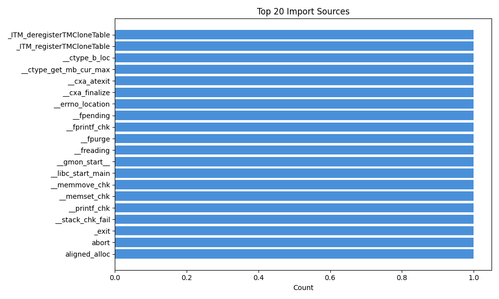
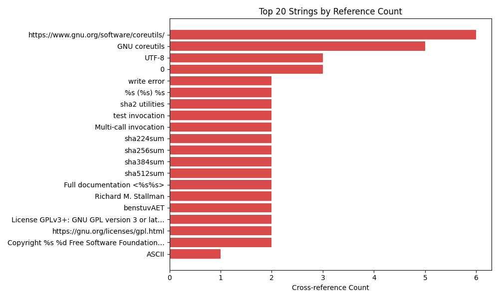

# Malware Analysis Report: `cat`
**SHA-256:** `dda0961715677dff3cd560e1933379c0eca73c0b6e19fef2737492ebc1de1700`

> **⚠️ DO NOT EXECUTE THIS BINARY ⚠️**
>
> This report was generated via automated static analysis.
> The analysed file may be malicious. Do not run it outside a controlled,
> isolated analysis environment. AI-generated names and explanations are
> *best-effort guesses* marked with the `ai_` prefix and should be verified
> by a human analyst.

## Table of Contents

1. [Environment & Run Configuration](#environment--run-configuration)
2. [Binary Overview](#binary-overview)
3. [Imports](#imports)
4. [Exports](#exports)
5. [Top Strings](#top-strings)
6. [Frequency Analysis](#frequency-analysis)
7. [Call Graph](#call-graph-top-functions)
8. [The Story So Far](#the-story-so-far)
9. [Function Deep Dives](#function-deep-dives) (137 functions)
10. [Function Index](#function-index)
11. [Conclusion](#conclusion)

## Environment & Run Configuration

| Setting | Value |
|---------|-------|
| Binary Ninja | headless |
| LLM Model | `gpt-oss-safeguard:120b`  |
| Top-N Deep Analysis | 137 |
| Analysis Timeout | 300s |
| Hybrid Mode | False |
| Skip Boring | False |
| AI Rename Prefix | `ai_` |

**Warnings:**
- Safety override active (--i-know-what-im-doing). Input: /usr/bin/cat

## Binary Overview

| Property | Value |
|----------|-------|
| File | `cat` |
| Size | 39,384 bytes |
| Format | ELF |
| Architecture | x86_64 |
| Platform | linux-x86_64 |
| Entry Point | `0x403ac0` |
| Functions | 137 total (137 analysed) |
| Strings | 177 (≥4 chars) |
| Imports | 65 |
| Exports | 6 |

### Sections

| Name | Start | Length | Semantics |
|------|-------|--------|-----------|
| `.bss` | `0x40a080` | 320 | 3 |
| `.data` | `0x40a000` | 104 | 3 |
| `.data.rel.ro` | `0x409aa0` | 328 | 2 |
| `.dynamic` | `0x409be8` | 496 | 2 |
| `.dynamic_rela` | `0x400e90` | 648 | 2 |
| `.dynstr` | `0x400a38` | 828 | 2 |
| `.dynsym` | `0x4003d8` | 1,632 | 2 |
| `.eh_frame` | `0x407eb0` | 872 | 2 |
| `.eh_frame_hdr` | `0x407de8` | 196 | 2 |
| `.extern` | `0x40a1c0` | 536 | 4 |
| `.fini` | `0x4064a4` | 13 | 1 |
| `.fini_array` | `0x409a98` | 8 | 3 |
| `.gnu.hash` | `0x4003b0` | 36 | 2 |
| `.gnu.version` | `0x400d74` | 136 | 2 |
| `.gnu.version_r` | `0x400e00` | 144 | 2 |
| `.got` | `0x409dd8` | 544 | 2 |
| `.init` | `0x402000` | 27 | 1 |
| `.init_array` | `0x409a90` | 8 | 3 |
| `.interp` | `0x400318` | 28 | 2 |
| `.plt` | `0x402020` | 896 | 1 |
| `.plt.got` | `0x4023a0` | 16 | 1 |
| `.plt.sec` | `0x4023b0` | 880 | 1 |
| `.rela.dyn` | `0x400e90` | 648 | 2 |
| `.rela.plt` | `0x401118` | 1,320 | 2 |
| `.rodata` | `0x407000` | 3,560 | 2 |
| `.synthetic_builtins` | `0x40a3e0` | 48 | 4 |
| `.text` | `0x402720` | 15,746 | 1 |

### Segments

| Start | Length | Flags |
|-------|--------|-------|
| `0x400000` | 5,696 | `r=rw=-x=-` |
| `0x402000` | 17,585 | `r=rw=-x=x` |
| `0x407000` | 4,632 | `r=rw=-x=-` |
| `0x409a90` | 1,496 | `r=rw=wx=-` |
| `0x40a068` | 344 | `r=rw=wx=-` |
| `0x40a1c0` | 536 | `r=-w=-x=-` |
| `0x40a3e0` | 48 | `r=-w=-x=-` |

## Imports

| # | Import |
|---|--------|
| 1 | `_ITM_deregisterTMCloneTable` |
| 2 | `_ITM_registerTMCloneTable` |
| 3 | `__ctype_b_loc` |
| 4 | `__ctype_get_mb_cur_max` |
| 5 | `__cxa_atexit` |
| 6 | `__cxa_finalize` |
| 7 | `__errno_location` |
| 8 | `__fpending` |
| 9 | `__fprintf_chk` |
| 10 | `__fpurge` |
| 11 | `__freading` |
| 12 | `__gmon_start__` |
| 13 | `__libc_start_main` |
| 14 | `__memmove_chk` |
| 15 | `__memset_chk` |
| 16 | `__printf_chk` |
| 17 | `__stack_chk_fail` |
| 18 | `_exit` |
| 19 | `abort` |
| 20 | `aligned_alloc` |
| 21 | `bindtextdomain` |
| 22 | `clearerr_unlocked` |
| 23 | `close` |
| 24 | `copy_file_range` |
| 25 | `dcgettext` |
| 26 | `error` |
| 27 | `exit` |
| 28 | `fclose` |
| 29 | `fflush` |
| 30 | `fflush_unlocked` |
| 31 | `fileno` |
| 32 | `fputc_unlocked` |
| 33 | `fputs_unlocked` |
| 34 | `free` |
| 35 | `fseeko` |
| 36 | `fstat` |
| 37 | `fwrite` |
| 38 | `getopt_long` |
| 39 | `getpagesize` |
| 40 | `ioctl` |
| 41 | `iswprint` |
| 42 | `lseek` |
| 43 | `malloc` |
| 44 | `mbrtoc32` |
| 45 | `mbsinit` |
| 46 | `memcmp` |
| 47 | `nl_langinfo` |
| 48 | `open` |
| 49 | `optind` |
| 50 | `posix_fadvise` |
| 51 | `program_invocation_name` |
| 52 | `program_invocation_short_name` |
| 53 | `read` |
| 54 | `realloc` |
| 55 | `setlocale` |
| 56 | `stderr` |
| 57 | `stdout` |
| 58 | `stpcpy` |
| 59 | `strcmp` |
| 60 | `strlen` |
| 61 | `strncmp` |
| 62 | `strrchr` |
| 63 | `textdomain` |
| 64 | `uname` |
| 65 | `write` |

## Exports

| # | Export |
|---|--------|
| 1 | `_FINI_0` |
| 2 | `_INIT_0` |
| 3 | `_fini` |
| 4 | `_init` |
| 5 | `_start` |
| 6 | `main` |

## Top Strings

| # | String | Refs | Functions |
|---|--------|------|-----------|
| 1 | `https://www.gnu.org/software/coreutils/` | 6 | 0x402730 |
| 2 | `GNU coreutils` | 5 | 0x404170, 0x402730 |
| 3 | `UTF-8` | 3 | 0x403d90 |
| 4 | `                 0	` | 3 | 0x403bb0 |
| 5 | `write error` | 2 | 0x403d30, 0x406360 |
| 6 | `%s (%s) %s\n` | 2 | 0x404170 |
| 7 | `sha2 utilities` | 2 | 0x402730 |
| 8 | `test invocation` | 2 | 0x402730 |
| 9 | `Multi-call invocation` | 2 | 0x402730 |
| 10 | `sha224sum` | 2 | 0x402730 |
| 11 | `sha256sum` | 2 | 0x402730 |
| 12 | `sha384sum` | 2 | 0x402730 |
| 13 | `sha512sum` | 2 | 0x402730 |
| 14 | `Full documentation <%s%s>\n` | 2 | 0x402730 |
| 15 | `Richard M. Stallman` | 2 | 0x402730 |
| 16 | `benstuvAET` | 2 | 0x402730 |
| 17 | `License GPLv3+: GNU GPL version 3 or later <%s>.\nThis is free software: you are` | 2 | 0x404170 |
| 18 | `https://gnu.org/licenses/gpl.html` | 2 | 0x404170 |
| 19 | `Copyright %s %d Free Software Foundation, Inc.` | 2 | 0x404170 |
| 20 | `ASCII` | 1 | 0x403d90 |
| 21 | `GB18030` | 1 | 0x403e50 |
| 22 | `memory exhausted` | 1 | 0x403fa0 |
| 23 | `Written by %s.\n` | 1 | 0x404170 |
| 24 | `Written by %s and %s.\n` | 1 | 0x404170 |
| 25 | `Written by %s, %s, and %s.\n` | 1 | 0x404170 |
| 26 | `POSIX` | 1 | 0x4047f0 |
| 27 | `/.libs/` | 1 | 0x402730 |
| 28 | `/usr/share/locale` | 1 | 0x402730 |
| 29 | `\n%s online help: <%s>\n` | 1 | 0x402730 |
| 30 | `Torbj` | 1 | 0x402730 |

## Frequency Analysis

### Import Sources



### String References



## Call Graph (Top Functions)

```mermaid
graph LR
    f_402730["ai_sha2sum_main"]
    f_404900["ai_utf8_to_utf32"]
    f_404170["ai_print_gpl_license"]
    f_4060d0["ai_buffer_resize"]
    f_403fe0["ai_flush_and_close_file"]
    f_4047f0["ai_check_posix_locale"]
    f_403e50["ai_detect_locale_charset"]
    f_403d90["ai_check_utf8_locale"]
    f_406360["ai_check_stdout_stderr_write_error_and_exit"]
    f_403d30["ai_write_error_handler"]
    f_4063f0["ai_write_all_stdout"]
    f_403c30["ai_case_insensitive_strcmp"]
    f_404100["ai_check_file_write_error"]
    f_403fa0["ai_fatal_memory_exhaustion"]
    f_403bb0["ai_increment_counter_string"]
    f_403f40["ai_safe_read"]
    f_402480["ai_localize_message"]
    f_406300["ai_stack_canary_wrapper"]
    f_402020["ai_dispatcher"]
    f_403b60["ai_runtime_finalize"]
    f_4023d0["ai_get_errno"]
    f_4026b0["ai_fprintf_chk_wrapper"]
    f_403b20["ai_null_return"]
    f_402630["ai_error_report"]
    f_403af0["ai_deregister_tm_clones"]
    f_402570["ai_fputs_unlocked_wrapper"]
    f_402620["ai_printf_wrapper"]
    f_4024b0["ai_stack_canary_failure"]
    f_4024a0["ai_string_length"]
    f_402590["ai_write_char_to_file"]
    f_402610["ai_set_locale"]
    f_406490["ai_register_atexit_handler"]
    f_4023b0["ai_free_memory"]
    f_4023c0["ai_abort_program"]
    f_4023e0["ai_strncmp_wrapper"]
    f_4024f0["ai_file_seek"]
    f_4025b0["ai_get_file_descriptor"]
    f_402690["ai_process_exit"]
    f_4026c0["ai_aligned_alloc"]
    f_4023f0["ai_process_exit"]
    f_402450["ai_close_file"]
    f_402470["ai_stpcpy_wrapper"]
    f_402520["ai_close_fd"]
    f_402580["ai_strcmp_wrapper"]
    f_4025e0["ai_get_locale_info"]
    f_4025f0["ai_check_file_reading"]
    f_402600["ai_realloc_memory"]
    f_402700["ai_fstat_wrapper"]
    f_4023a0["ai_cxa_finalize_wrapper"]
    f_402400["ai_get_pending_input"]
    f_402410["ai_reset_file_error_state"]
    f_402420["ai_write_wrapper"]
    f_402430["ai_purge_file_stream"]
    f_402440["ai_set_textdomain"]
    f_402460["ai_bind_text_domain"]
    f_402490["ai_get_mb_cur_max"]
    f_4024c0["ai_cmdline_option_parser"]
    f_4024d0["ai_strrchr_wrapper"]
    f_4024e0["ai_get_system_info"]
    f_402500["ai_ioctl_wrapper"]
    f_402510["ai_file_copy_range"]
    f_402530["ai_mbrtoc32_wrapper"]
    f_402540["ai_file_advice"]
    f_402550["ai_safe_read"]
    f_402560["ai_memory_compare"]
    f_4025a0["ai_memmove_check"]
    f_4025c0["ai_malloc_wrapper"]
    f_4025d0["ai_flush_file_buffer"]
    f_402640["ai_file_open_wrapper"]
    f_402650["ai_file_seek"]
    f_402660["ai_register_atexit"]
    f_402670["ai_get_page_size"]
    f_402680["ai_memset_chk_wrapper"]
    f_4026a0["ai_fwrite_wrapper"]
    f_4026d0["ai_flush_output_stream"]
    f_4026e0["ai_mbsinit_wrapper"]
    f_4026f0["ai_is_wide_printable"]
    f_402710["ai_get_ctype_table"]
    f_402030["ai_stub_wrapper"]
    f_402040["ai_noop_stub"]
    f_402050["ai_wrapper_stub"]
    f_402060["ai_proxy_call"]
    f_402070["ai_stub_function"]
    f_402080["ai_stub_wrapper"]
    f_402090["ai_stub_wrapper"]
    f_4020a0["ai_init_wrapper"]
    f_4020b0["ai_forwarder_stub"]
    f_4020c0["ai_noop_wrapper"]
    f_4020d0["ai_stub_wrapper"]
    f_4020e0["ai_dummy_wrapper"]
    f_4020f0["ai_stub_wrapper"]
    f_402100["ai_wrapper_stub"]
    f_402110["ai_noop_wrapper"]
    f_402120["ai_stub_wrapper"]
    f_402130["ai_tailcall_wrapper"]
    f_402140["ai_noop_wrapper"]
    f_402150["ai_stub_function"]
    f_402160["ai_stub_wrapper"]
    f_402170["ai_stub_forwarder"]
    f_402180["ai_stub_wrapper"]
    f_402190["ai_stub_init"]
    f_4021a0["ai_wrapper_stub"]
    f_4021b0["ai_stub_forwarder"]
    f_4021c0["ai_tailcall_wrapper"]
    f_4021d0["ai_wrapper_call_402020"]
    f_4021e0["ai_wrapper_initialize"]
    f_4021f0["ai_tailcall_wrapper"]
    f_402200["ai_wrapper_stub"]
    f_402210["ai_tailcall_wrapper"]
    f_402220["ai_stub_wrapper"]
    f_402230["ai_stub_wrapper"]
    f_402240["ai_tailcall_wrapper"]
    f_402250["ai_stub_wrapper"]
    f_402260["ai_stub_wrapper"]
    f_402270["ai_stub_wrapper"]
    f_402280["ai_placeholder_wrapper"]
    f_402290["ai_no_op_wrapper"]
    f_4022a0["ai_placeholder_wrapper"]
    f_4022b0["ai_trampoline"]
    f_4022c0["ai_stub_wrapper"]
    f_4022d0["ai_stub_wrapper"]
    f_4022e0["ai_stub_forwarder"]
    f_4022f0["ai_tailcall_wrapper"]
    f_402300["ai_tailcall_wrapper"]
    f_402310["ai_noop_wrapper"]
    f_402320["ai_dummy_wrapper"]
    f_402330["ai_tailcall_wrapper"]
    f_402340["ai_dummy_wrapper"]
    f_402350["ai_stub_forward"]
    f_402360["ai_dummy_wrapper"]
    f_402370["ai_stub_wrapper"]
    f_402380["ai_stub_wrapper"]
    f_402390["ai_dummy_wrapper"]
    f_403ba0["ai_dummy_init"]
    f_402730 --> f_4024d0
    f_402730 --> f_4023e0
    f_402730 --> f_402610
    f_402730 --> f_402460
    f_402730 --> f_402440
    f_402730 --> f_406490
    f_402730 --> f_4024c0
    f_402730 --> f_403d90
    f_402730 --> f_404170
    f_402730 --> f_402690
    f_402730 --> f_402700
    f_402730 --> f_402670
    f_402730 --> f_4023b0
    f_402730 --> f_402640
    f_402730 --> f_402540
    f_402730 --> f_4026c0
    f_402730 --> f_403f40
    f_402730 --> f_403bb0
    f_402730 --> f_402470
    f_402730 --> f_4063f0
    f_402730 --> f_4025a0
    f_402730 --> f_402500
    f_402730 --> f_4023d0
    f_402730 --> f_4060d0
    f_402730 --> f_402480
    f_402730 --> f_402630
    f_402730 --> f_402520
    f_402730 --> f_406300
    f_402730 --> f_403d30
    f_402730 --> f_4024f0
    f_402730 --> f_4026b0
    f_402730 --> f_402620
    f_402730 --> f_402570
    f_402730 --> f_402580
    f_402730 --> f_4024b0
    f_402730 --> f_4026a0
    f_402730 --> f_4023c0
    f_402730 --> f_403fa0
    f_402730 --> f_402510
    f_402730 --> f_4024e0
    f_404900 --> f_4023c0
    f_404900 --> f_402490
    f_404900 --> f_402480
    f_404900 --> f_4024a0
    f_404900 --> f_402710
    f_404900 --> f_402560
    f_404900 --> f_402530
    f_404900 --> f_4047f0
    f_404900 --> f_4026f0
    f_404900 --> f_4026e0
    f_404900 --> f_403e50
    f_404900 --> f_4024b0
    f_404170 --> f_4026b0
    f_404170 --> f_402480
    f_404170 --> f_402590
    f_404170 --> f_4024b0
    f_4060d0 --> f_4023d0
    f_4060d0 --> f_402600
    f_4060d0 --> f_402680
    f_4060d0 --> f_404900
    f_4060d0 --> f_4023b0
    f_4060d0 --> f_4025c0
    f_4060d0 --> f_403fa0
    f_403fe0 --> f_4025b0
    f_403fe0 --> f_4025f0
    f_403fe0 --> f_4025d0
    f_403fe0 --> f_4023d0
    f_403fe0 --> f_402450
    f_403fe0 --> f_4024f0
    f_403fe0 --> f_402650
    f_4047f0 --> f_402610
    f_4047f0 --> f_4024a0
    f_4047f0 --> f_402580
    f_4047f0 --> f_4024b0
    f_403e50 --> f_4025e0
    f_403e50 --> f_403c30
    f_403d90 --> f_402480
    f_403d90 --> f_4025e0
    f_406360 --> f_404100
    f_406360 --> f_402480
    f_406360 --> f_4023d0
    f_406360 --> f_402630
    f_406360 --> f_4023f0
    f_403d30 --> f_4023d0
    f_403d30 --> f_4026d0
    f_403d30 --> f_402430
    f_403d30 --> f_402410
    f_403d30 --> f_402480
    f_403d30 --> f_402630
    f_403d30 --> f_403d90
    f_4063f0 --> f_402420
    f_4063f0 --> f_4023d0
    f_404100 --> f_402400
    f_404100 --> f_403fe0
    f_404100 --> f_4023d0
    f_403fa0 --> f_402480
    f_403fa0 --> f_402630
    f_403fa0 --> f_4023c0
    f_403f40 --> f_402550
    f_403f40 --> f_4023d0
    f_406300 --> f_4060d0
    f_406300 --> f_4024b0
    f_403b60 --> f_4023a0
    f_403b60 --> f_403af0
    f_406490 --> f_402660
    f_402030 --> f_402020
    f_402040 --> f_402020
    f_402050 --> f_402020
    f_402060 --> f_402020
    f_402070 --> f_402020
    f_402080 --> f_402020
    f_402090 --> f_402020
    f_4020a0 --> f_402020
    f_4020b0 --> f_402020
    f_4020c0 --> f_402020
    f_4020d0 --> f_402020
    f_4020e0 --> f_402020
    f_4020f0 --> f_402020
    f_402100 --> f_402020
    f_402110 --> f_402020
    f_402120 --> f_402020
    f_402130 --> f_402020
    f_402140 --> f_402020
    f_402150 --> f_402020
    f_402160 --> f_402020
    f_402170 --> f_402020
    f_402180 --> f_402020
    f_402190 --> f_402020
    f_4021a0 --> f_402020
    f_4021b0 --> f_402020
    f_4021c0 --> f_402020
    f_4021d0 --> f_402020
    f_4021e0 --> f_402020
    f_4021f0 --> f_402020
    f_402200 --> f_402020
    f_402210 --> f_402020
    f_402220 --> f_402020
    f_402230 --> f_402020
    f_402240 --> f_402020
    f_402250 --> f_402020
    f_402260 --> f_402020
    f_402270 --> f_402020
    f_402280 --> f_402020
    f_402290 --> f_402020
    f_4022a0 --> f_402020
    f_4022b0 --> f_402020
    f_4022c0 --> f_402020
    f_4022d0 --> f_402020
    f_4022e0 --> f_402020
    f_4022f0 --> f_402020
    f_402300 --> f_402020
    f_402310 --> f_402020
    f_402320 --> f_402020
    f_402330 --> f_402020
    f_402340 --> f_402020
    f_402350 --> f_402020
    f_402360 --> f_402020
    f_402370 --> f_402020
    f_402380 --> f_402020
    f_402390 --> f_402020
    f_403ba0 --> f_403b20
```



## The Story So Far

The binary appears to be a stripped Linux ELF implementation of the GNU coreutils SHA2 checksum utilities (sha224sum, sha256sum, sha384sum, sha512sum). The code initializes locale settings, prints GPL licensing information, and dispatches to the appropriate SHA2 algorithm based on the invoked program name. It includes robust handling for multibyte character conversion, buffer resizing, and error handling for file I/O. There is no evidence of malicious behavior; the binary functions as a standard utility for computing cryptographic hashes of files or input streams.

**Likely type:** unknown

**Key capabilities:**
- SHA2 hash computation (sha224, sha256, sha384, sha512)
- Locale and character set handling
- File I/O with error detection and reporting

**Potential IOCs:**
- `https://www.gnu.org/software/coreutils/`
- `GNU coreutils`
- `sha224sum`
- `sha256sum`
- `sha384sum`
- `sha512sum`
- `License GPLv3+`

*Overall confidence: 96%*

## Function Deep Dives

<details><summary><strong>1. <code>ai_sha2sum_main</code> @ <code>0x402730</code></strong> (score: 563.0 | AI confidence: 93%) &mdash; crypto, file_io, config, process</summary>

**Tags:** `crypto`, `file_io`, `config`, `process`

```json
{
  "addr": "0x402730",
  "original_name": "main",
  "final_name": "ai_sha2sum_main",
  "score": 563.0,
  "bb_count": 205,
  "insn_est": 1060,
  "callers": 0,
  "callees": [
    "ai_strrchr_wrapper @ 0x4024d0",
    "ai_strncmp_wrapper @ 0x4023e0",
    "ai_set_locale @ 0x402610",
    "ai_bind_text_domain @ 0x402460",
    "ai_set_textdomain @ 0x402440",
    "ai_register_atexit_handler @ 0x406490",
    "ai_cmdline_option_parser @ 0x4024c0",
    "ai_check_utf8_locale @ 0x403d90",
    "ai_check_utf8_locale @ 0x403d90",
    "ai_print_gpl_license @ 0x404170"
  ],
  "import_refs": [
    "strrchr",
    "strncmp",
    "setlocale",
    "bindtextdomain",
    "textdomain",
    "getopt_long",
    "exit",
    "strncmp",
    "fstat",
    "getpagesize",
    "free",
    "free",
    "open",
    "fstat",
    "posix_fadvise",
    "aligned_alloc",
    "aligned_alloc",
    "stpcpy",
    "__memmove_chk",
    "stpcpy",
    "ioctl",
    "__errno_location",
    "dcgettext",
    "error",
    "aligned_alloc",
    "close",
    "__errno_location",
    "error",
    "lseek",
    "dcgettext",
    "error",
    "dcgettext",
    "__fprintf_chk",
    "exit",
    "dcgettext",
    "__printf_chk",
    "dcgettext",
    "fputs_unlocked",
    "dcgettext",
    "fputs_unlocked",
    "dcgettext",
    "fputs_unlocked",
    "dcgettext",
    "fputs_unlocked",
    "dcgettext",
    "fputs_unlocked",
    "dcgettext",
    "fputs_unlocked",
    "dcgettext",
    "__printf_chk",
    "strcmp",
    "dcgettext",
    "__printf_chk",
    "setlocale",
    "strncmp",
    "dcgettext",
    "__printf_chk",
    "dcgettext",
    "__printf_chk",
    "exit",
    "close",
    "dcgettext",
    "__errno_location",
    "error",
    "dcgettext",
    "__printf_chk",
    "setlocale",
    "dcgettext",
    "__printf_chk",
    "dcgettext",
    "fputs_unlocked",
    "__errno_location",
    "error",
    "__stack_chk_fail",
    "fwrite",
    "abort",
    "__errno_location",
    "error",
    "__errno_location",
    "error",
    "copy_file_range",
    "uname",
    "__errno_location",
    "__errno_location",
    "error"
  ],
  "string_refs": [
    "GNU coreutils",
    "/.libs/",
    "/usr/share/locale",
    "sha2 utilities",
    "test invocation",
    "Multi-call invocation",
    "sha224sum",
    "sha256sum",
    "sha384sum",
    "sha512sum"
  ]
}
```

**Notable constants (30):** `0x2c8`, `0xfffffffffffffd4c`, `0xfffffffffffffd40`, `0x409ff0`, `0x407490`, `0x4026a0`, `0x4023c0`, `0x4024d0`, `0x409fd0`, `0x4070ac`, `0x40a1a0`, `0x409aa0`, `0x4071a5`, `0x407cb4`, `0x402610`

**Summary:** The main function initializes the program, validates argv[0], extracts the executable name, adjusts for libtool wrapper paths, sets locale and text domain, and then dispatches to the appropriate SHA2 utility (sha224sum, sha256sum, sha384sum, sha512sum) based on the invocation name.

**Details:**
- If argv[0] is NULL the program aborts with an error message.
- It uses strrchr to locate the last '/' in the path, checks for a '/.libs/' segment and a 'lt-' prefix to normalize the program name.
- The normalized name is stored in program_invocation_short_name for later use.
- The function likely calls setlocale, bindtextdomain, textdomain, and getopt_long to configure locale and parse command-line options before invoking the specific hash implementation.

**Evidence refs:** `strings:'GNU coreutils'`, `strings:'/\.libs/'`, `strings:'sha224sum'`, `strings:'sha256sum'`, `strings:'sha384sum'`, `strings:'sha512sum'`, `imports:strrchr`, `imports:strncmp`, `imports:setlocale`, `imports:bindtextdomain`, `imports:textdomain`, `imports:getopt_long`, `call:0x4024d0`, `call:0x4023e0`, `call:0x402610`

**Unknowns:** Exact command-line option handling and the dispatch logic to the specific SHA2 implementation., Details of error handling beyond the initial NULL argv[0] check.

**Rename rationale:** The function is the entry point for GNU coreutils SHA2 utilities (sha224sum, sha256sum, etc.), handling argv[0] processing, locale setup, and command-line parsing typical of a checksum utility.

**Alternative names:** `ai_sha2_utility_entry`, `ai_sha2_checksum_main`

<details><summary>Pseudo-C</summary>

```c
{
    int64_t rbp;
    int64_t var_8 = rbp;
    int64_t* rbp_1 = &var_8;
    int64_t r15;
    int64_t var_10 = r15;
    int64_t r14;
    int64_t var_18 = r14;
    int64_t r13;
    int64_t var_20 = r13;
    int64_t r12;
    int64_t var_28 = r12;
    int64_t rbx;
    int64_t var_30 = rbx;
    char* rbx_1 = *(uint64_t*)argv;
    void* fsbase;
    int64_t var_40 = *(uint64_t*)((char*)fsbase + 0x28);
    
    if (!rbx_1)
    {
        fwrite("A NULL argv[0] was passed through an exec system call.\n", 1, 0x37, 
            *(uint64_t*)stderr);
        abort();
        /* no return */
    }
    
    char* rax_2;
    int64_t rcx;
    int64_t rdx;
    uint64_t r8;
    ssize_t r9;
    rax_2 = strrchr(rbx_1, 0x2f);
    
    if (rax_2 && &rax_2[1] - rbx_1 > 6)
    {
        int32_t rax_5;
        rax_5 = strncmp(&rax_2[-6], "/.libs/", 7);
        
        if (!rax_5)
        {
            rbx_1 = &rax_2[1];
            int32_t rax_12;
            rax_12 = strncmp(&rax_2[1], "lt-", 3);
            
            if (!rax_12)
            {
                rbx_1 = &rax_2[4];
                *(uint64_t*)program_invocation_short_name = rbx_1;
            }
        }
// ... truncated
```

</details>

</details>

---

<details><summary><strong>2. <code>ai_utf8_to_utf32</code> @ <code>0x404900</code></strong> (score: 415.0 | AI confidence: 78%)</summary>

```json
{
  "addr": "0x404900",
  "original_name": "sub_404900",
  "final_name": "ai_utf8_to_utf32",
  "score": 415.0,
  "bb_count": 372,
  "insn_est": 1328,
  "callers": 2,
  "callees": [
    "ai_abort_program @ 0x4023c0",
    "ai_get_mb_cur_max @ 0x402490",
    "ai_localize_message @ 0x402480",
    "ai_localize_message @ 0x402480",
    "ai_string_length @ 0x4024a0",
    "ai_get_ctype_table @ 0x402710",
    "ai_string_length @ 0x4024a0",
    "ai_memory_compare @ 0x402560",
    "ai_string_length @ 0x4024a0",
    "ai_mbrtoc32_wrapper @ 0x402530"
  ],
  "import_refs": [
    "abort",
    "__ctype_get_mb_cur_max",
    "dcgettext",
    "dcgettext",
    "strlen",
    "__ctype_b_loc",
    "strlen",
    "memcmp",
    "strlen",
    "mbrtoc32",
    "iswprint",
    "mbsinit",
    "__stack_chk_fail"
  ],
  "string_refs": []
}
```

**Notable constants (25):** `0x4023c0`, `0x407988`, `0x407023`, `0x4070b3`, `0x402480`, `0x407025`, `0x4024a0`, `0x403e50`, `0x402490`, `0x402560`, `0x3ffffff53ffffff`, `0x402710`, `0x4079b4`, `0x4024b0`, `0xfffffffd`

**Decoded constants:** `0x407023` = `"@p#"`, `0x407025` = `"@p%"`, `0x403e50` = `"@>P"`, `0x402560` = `"@%`"`

**Summary:** sub_404900 validates a length argument against the maximum multibyte character size, aborts on illegal values, then branches on the size to set up state for converting multibyte input to a 32‑bit character representation using mbrtoc32. It appears to compute or copy characters while handling locale‑dependent multibyte sequences.

**Details:**
- The function retrieves the current multibyte character maximum via __ctype_get_mb_cur_max() and aborts if the provided length (arg4) exceeds 10 bytes.
- A switch on the length value initializes conversion state variables (including an mbstate_t) and prepares buffers for processing, suggesting it performs multibyte‑to‑UTF‑32 conversion using mbrtoc32.
- It uses standard library helpers such as strlen, memcmp, and dcgettext for auxiliary string handling and localization.
- The function is called by sub_4060d0, which uses its return value to manage buffer resizing, indicating sub_404900 likely returns the required size of the converted string.

**Evidence refs:** `imports:abort`, `imports:__ctype_get_mb_cur_max`, `imports:mbrtoc32`, `imports:strlen`, `imports:memcmp`, `call:0x4023c0`, `call:0x402490`

**Unknowns:** Exact semantics of each argument (arg1‑arg8) and the precise return value format., Full handling of error conditions beyond the abort path.

**Rename rationale:** The function uses __ctype_get_mb_cur_max and mbrtoc32 to process multibyte characters, performs length checks and conversion logic typical of UTF-8 to UTF-32 (wide character) handling.

**Alternative names:** `ai_mbs_to_wchar`, `ai_multibyte_to_utf32`

<details><summary>Pseudo-C</summary>

```c
{
    char* r11 = arg2;
    int64_t var_88 = arg6;
    char* r15 = arg8;
    int32_t var_c4 = arg5;
    char* r13 = arg7;
    mbstate_t* r14_1 = -ffffffffffffffff;
    char* r9 = arg1;
    void* fsbase;
    int64_t rax = *(uint64_t*)((char*)fsbase + 0x28);
    int32_t var_64 = arg4;
label_404958:
    uint64_t rax_2;
    uint64_t rdx;
    uint32_t r10_1;
    rax_2 = __ctype_get_mb_cur_max();
    uint64_t rax_3 = (uint64_t)var_64;
    int32_t rbx_2 = var_c4 & 2;
    bool var_65_1 = rbx_2;
    
    if ((uint32_t)rax_3 > 0xa)
    {
        abort();
        /* no return */
    }
    
    char* var_d0_1;
    char* var_c0_1;
    uint64_t var_80_1;
    char* var_70_2;
    char var_68_1;
    char var_67_1;
    char var_66_1;
    int64_t result_1;
    char* rax_5;
    char* rcx_13;
    
    switch (rax_3)
    {
        case 0:
        {
            (uint8_t)var_70_2 = 1;
            var_68_1 = 0;
            var_66_1 = 0;
            var_d0_1 = nullptr;
            var_65_1 = false;
            var_67_1 = 0;
            var_80_1 = 0;
            var_c0_1 = nullptr;
            result_1 = 0;
// ... truncated
```

</details>

</details>

---

<details><summary><strong>3. <code>ai_print_gpl_license</code> @ <code>0x404170</code></strong> (score: 372.0 | AI confidence: 86%) &mdash; file_io</summary>

**Tags:** `file_io`

```json
{
  "addr": "0x404170",
  "original_name": "sub_404170",
  "final_name": "ai_print_gpl_license",
  "score": 372.0,
  "bb_count": 30,
  "insn_est": 350,
  "callers": 1,
  "callees": [
    "ai_fprintf_chk_wrapper @ 0x4026b0",
    "ai_localize_message @ 0x402480",
    "ai_fprintf_chk_wrapper @ 0x4026b0",
    "ai_write_char_to_file @ 0x402590",
    "ai_localize_message @ 0x402480",
    "ai_fprintf_chk_wrapper @ 0x4026b0",
    "ai_write_char_to_file @ 0x402590",
    "ai_fprintf_chk_wrapper @ 0x4026b0",
    "ai_localize_message @ 0x402480",
    "ai_fprintf_chk_wrapper @ 0x4026b0"
  ],
  "import_refs": [
    "__fprintf_chk",
    "dcgettext",
    "__fprintf_chk",
    "fputc_unlocked",
    "dcgettext",
    "__fprintf_chk",
    "fputc_unlocked",
    "__fprintf_chk",
    "dcgettext",
    "__fprintf_chk",
    "fputc_unlocked",
    "dcgettext",
    "__fprintf_chk",
    "fputc_unlocked",
    "dcgettext",
    "__fprintf_chk",
    "dcgettext",
    "dcgettext",
    "__fprintf_chk",
    "dcgettext",
    "dcgettext",
    "__fprintf_chk",
    "dcgettext",
    "dcgettext",
    "__fprintf_chk",
    "dcgettext",
    "__fprintf_chk",
    "dcgettext",
    "__fprintf_chk",
    "__stack_chk_fail"
  ],
  "string_refs": [
    "GNU coreutils",
    "%s (%s) %s\n",
    "Written by %s.\n",
    "Written by %s and %s.\n",
    "Written by %s, %s, and %s.\n",
    "License GPLv3+: GNU GPL version 3 or later <%s>.\nThis is free software: you are free to change and redistribute it.\nThere is NO WARRANTY, to the extent permitted by law.\n",
    "https://gnu.org/licenses/gpl.html",
    "Written by %s, %s, %s,\n%s, %s, %s, %s,\n%s, %s, and others.\n",
    "Written by %s, %s, %s,\nand %s.\n",
    "Written by %s, %s, %s,\n%s, and %s.\n"
  ]
}
```

**Notable constants (30):** `0x168`, `0xfffffffffffffea8`, `0xfffffffffffffea0`, `0xfffffffffffffec0`, `0xfffffffffffffea4`, `0xfffffffffffffeb0`, `0x407048`, `0x407056`, `0x40705a`, `0x4026b0`, `0x407066`, `0x402480`, `0x7e7`, `0x407da0`, `0x402590`

**Decoded constants:** `0x407048` = `"@pH"`, `0x407056` = `"@pV"`, `0x40705a` = `"@pZ"`, `0x407066` = `"@pf"`

**Summary:** The function prints GNU coreutils program information such as name, version, author list, and GPL license text, using localized strings and formatted output via __fprintf_chk.

**Details:**
- It selects appropriate author format strings (e.g., 'Written by %s, %s, and %s.') based on the number of authors passed (arg5) and prints them with __fprintf_chk.
- It retrieves localized messages via dcgettext and writes them to stdout/stderr using __fprintf_chk and fputc_unlocked, then outputs the GPLv3+ license notice and URL.

**Evidence refs:** `strings:'GNU coreutils'`, `strings:'Written by %s, %s, and %s.\n'`, `strings:'License GPLv3+: GNU GPL version 3 or later <%s>.'`, `imports:__fprintf_chk`, `imports:dcgettext`, `call:0x4026b0`, `call:0x402480`

**Unknowns:** Exact branching logic for handling different author count cases, Purpose of the AVX-512 ZMM register saves (likely related to formatting buffers), Specific role of the while loop and its termination condition

**Rename rationale:** The function references many GPL license strings and author formatting, and calls __fprintf_chk and dcgettext to output them, indicating it prints GNU coreutils license/author information.

**Alternative names:** `ai_display_license`, `ai_print_version_info`

<details><summary>Pseudo-C</summary>

```c
{
    int64_t r8;
    int64_t var_c8 = r8;
    int64_t r9;
    int64_t var_c0 = r9;
    
    if (arg5)
    {
        int128_t zmm0;
        int128_t var_b8_1 = zmm0;
        int128_t zmm1;
        int128_t var_a8_1 = zmm1;
        int128_t zmm2;
        int128_t var_98_1 = zmm2;
        int128_t zmm3;
        int128_t var_88_1 = zmm3;
        int128_t zmm4;
        int128_t var_78_1 = zmm4;
        int128_t zmm5;
        int128_t var_68_1 = zmm5;
        int128_t zmm6;
        int128_t var_58_1 = zmm6;
        int128_t zmm7;
        int128_t var_48_1 = zmm7;
    }
    
    void* fsbase;
    int64_t rax = *(uint64_t*)((char*)fsbase + 0x28);
    char rdi = 0;
    void arg_8;
    void* var_160 = &arg_8;
    int64_t* rcx = &arg_8;
    char r8_1 = 0;
    int64_t rbx = 0;
    int32_t var_168 = 0x20;
    int32_t rdx = 0x20;
    int32_t var_164 = 0x30;
    void var_e8;
    void* var_158 = &var_e8;
    
    while (true)
    {
        char* var_190_1;
        int64_t var_188_1;
        int64_t var_180_1;
        int64_t var_178_1;
        int64_t var_170_1;
        int64_t var_148;
        int64_t var_140;
        int64_t var_138;
// ... truncated
```

</details>

</details>

---

<details><summary><strong>4. <code>ai_buffer_resize</code> @ <code>0x4060d0</code></strong> (score: 129.8 | AI confidence: 86%)</summary>

```json
{
  "addr": "0x4060d0",
  "original_name": "sub_4060d0",
  "final_name": "ai_buffer_resize",
  "score": 129.8,
  "bb_count": 19,
  "insn_est": 146,
  "callers": 4,
  "callees": [
    "ai_get_errno @ 0x4023d0",
    "ai_realloc_memory @ 0x402600",
    "ai_memset_chk_wrapper @ 0x402680",
    "ai_utf8_to_utf32 @ 0x404900",
    "ai_free_memory @ 0x4023b0",
    "ai_malloc_wrapper @ 0x4025c0",
    "ai_utf8_to_utf32 @ 0x404900",
    "ai_realloc_memory @ 0x402600",
    "ai_fatal_memory_exhaustion @ 0x403fa0"
  ],
  "import_refs": [
    "__errno_location",
    "realloc",
    "__memset_chk",
    "free",
    "malloc",
    "realloc"
  ],
  "string_refs": []
}
```

**Notable constants (11):** `0x4023d0`, `0x40a010`, `0x40a050`, `0x404900`, `0x40a040`, `0x40a0a0`, `0x4025c0`, `0x4023b0`, `0x402600`, `0x403fa0`, `0x402680`

**Summary:** sub_4060d0 manages a dynamically sized output buffer for a helper routine (sub_404900). It checks an existing buffer size, calls the helper to determine required output length, and reallocates or allocates a new buffer if needed, preserving errno across the operation.

**Details:**
- Reads the current errno via __errno_location and restores it before returning.
- If a global size (data_40a010) is positive, it attempts to use an existing buffer (data_40a050) and calls sub_404900 to fill it.
- When the required size exceeds the current buffer, it computes a new size, frees the old buffer (unless it points to a static buffer), mallocs a larger buffer, and calls sub_404900 again to fill the new buffer.
- Updates global buffer pointer and size variables after successful allocation.

**Evidence refs:** `imports:__errno_location`, `imports:malloc`, `imports:free`, `imports:realloc`, `call:0x404900`

**Unknowns:** Exact semantics of the arguments passed to sub_404900, Purpose of the global variables data_40a010, data_40a050, and data_40a0a0, Full logic of the else branch (initial allocation path) which is truncated

**Rename rationale:** The function manages a dynamic buffer, checking existing size, reallocating or allocating memory as needed, and uses malloc/free/realloc. It appears to ensure sufficient capacity for data processing.

**Alternative names:** `ai_ensure_buffer_capacity`, `ai_dynamic_buffer_alloc`

<details><summary>Pseudo-C</summary>

```c
{
    int32_t* rax = __errno_location();
    int32_t rcx = data_40a010;
    int64_t* r15 = data_40a050;
    int32_t rax_1 = *(uint32_t*)rax;
    
    if (rcx > 0)
    {
    label_4061d6:
        char* r14_4 = *(uint64_t*)r15;
        char* r13_3 = r15[1];
        int32_t r8_3 = arg2[1] | 1;
        int64_t rax_6 = sub_404900(r13_3, r14_4, arg1, *(uint32_t*)arg2, r8_3, &arg2[2], 
            *(uint64_t*)((char*)arg2 + 0x28), *(uint64_t*)((char*)arg2 + 0x30));
        
        if (rax_6 < r14_4)
        {
            *(uint32_t*)rax = rax_1;
            return r13_3;
        }
        
        size_t n = rax_6 + 1;
        *(uint64_t*)r15 = n;
        
        if (r13_3 != &data_40a0a0)
            free(r13_3);
        
        char* rax_7 = malloc(n);
        
        if (rax_7)
        {
            int32_t rcx_6 = *(uint32_t*)arg2;
            r15[1] = rax_7;
            sub_404900(rax_7, n, arg1, rcx_6, r8_3, &arg2[2], *(uint64_t*)((char*)arg2 + 0x28), 
                *(uint64_t*)((char*)arg2 + 0x30));
            *(uint32_t*)rax = rax_1;
            return rax_7;
        }
    }
    else
    {
        int64_t r9_1 = (int64_t)rcx;
        int64_t* rdi = nullptr;
        
        if (r15 != &data_40a040)
            rdi = r15;
        
        int64_t r14_3 = (r9_1 >> 1) + r9_1;
        int64_t n_1 = r14_3 << 4;
        
// ... truncated
```

</details>

</details>

---

<details><summary><strong>5. <code>ai_flush_and_close_file</code> @ <code>0x403fe0</code></strong> (score: 122.2 | AI confidence: 86%) &mdash; file_io</summary>

**Tags:** `file_io`

```json
{
  "addr": "0x403fe0",
  "original_name": "sub_403fe0",
  "final_name": "ai_flush_and_close_file",
  "score": 122.2,
  "bb_count": 17,
  "insn_est": 79,
  "callers": 1,
  "callees": [
    "ai_get_file_descriptor @ 0x4025b0",
    "ai_check_file_reading @ 0x4025f0",
    "ai_check_file_reading @ 0x4025f0",
    "ai_flush_file_buffer @ 0x4025d0",
    "ai_get_errno @ 0x4023d0",
    "ai_close_file @ 0x402450",
    "ai_get_file_descriptor @ 0x4025b0",
    "ai_file_seek @ 0x4024f0",
    "ai_close_file @ 0x402450",
    "ai_file_seek @ 0x402650"
  ],
  "import_refs": [
    "fileno",
    "__freading",
    "__freading",
    "fflush",
    "__errno_location",
    "fclose",
    "fileno",
    "lseek",
    "fclose",
    "fseeko",
    "fileno",
    "lseek"
  ],
  "string_refs": []
}
```

**Notable constants (10):** `0x4025b0`, `0x402450`, `0x4025f0`, `0x4024f0`, `0x100`, `0x4025d0`, `0x4023d0`, `0x402650`, `0xffffffff`, `0xffffffef`

**Decoded constants:** `0x402450` = `"@$P"`, `0x402650` = `"@&P"`

**Summary:** The function safely closes a FILE* stream by first ensuring the file descriptor is valid, synchronizing the internal file offset for reading streams, flushing pending output, handling errors, and finally invoking fclose.

**Details:**
- It checks fileno(fp) >= 0 to confirm a valid descriptor.
- If the stream is in reading mode (__freading), it attempts to retrieve the current file offset with lseek and updates the FILE structure's flags and offset if necessary.
- When the stream has pending buffered data, it calls fseeko to sync the position.
- It flushes the stream with fflush; on failure it records errno, closes the file, and returns -1 (0xffffffff) while preserving errno.
- If flushing succeeds or the stream is not readable, it directly calls fclose and returns its result.

**Evidence refs:** `imports:fileno`, `imports:__freading`, `imports:lseek`, `imports:fseeko`, `imports:fflush`, `imports:__errno_location`, `imports:fclose`, `call:0x4025b0`, `call:0x4025f0`, `call:0x4025d0`, `call:0x4023d0`, `call:0x402450`, `call:0x4024f0`, `call:0x402650`

**Unknowns:** Exact meaning of the flag mask 0x100 and 0xffffffef in the FILE structure, Why the function reassigns fp = arg1 after the conditional block (no effect on outcome), Potential side effects of __freading on non-standard FILE implementations

**Rename rationale:** The function checks file descriptor validity, updates file offsets, flushes buffers, handles errors, and finally calls fclose, indicating a safe/robust file close routine.

**Alternative names:** `ai_safe_fclose`, `ai_flush_close`

<details><summary>Pseudo-C</summary>

```c
{
    FILE* fp = arg1;
    
    if (fileno(arg1) >= 0)
    {
        int32_t rax_1 = __freading(fp);
        off64_t rax_6;
        
        if (rax_1)
            rax_6 = lseek(fileno(arg1), 0, 1);
        
        if (!rax_1 || rax_6 != -1)
        {
            if (__freading(arg1) && arg1->_flags & 0x100)
            {
                if (arg1->_IO_read_end == arg1->_IO_read_ptr
                    && arg1->_IO_write_ptr == arg1->_IO_write_base && !arg1->_IO_save_base)
                {
                    int64_t rax_11 = lseek(fileno(arg1), 0, 1);
                    
                    if (rax_11 != -1)
                    {
                        arg1->_flags &= 0xffffffef;
                        arg1->_offset = rax_11;
                    }
                }
                else
                    fseeko(arg1, 0, 1);
            }
            
            if (fflush(arg1))
            {
                int32_t* rax_4 = __errno_location();
                int32_t r13 = *(uint32_t*)rax_4;
                int64_t result = fclose(arg1);
                
                if (!r13)
                    return result;
                
                *(uint32_t*)rax_4 = r13;
                return 0xffffffff;
            }
        }
        
        fp = arg1;
    }
    
    /* tailcall */
    return fclose(fp);
}
// ... truncated
```

</details>

</details>

---

<details><summary><strong>6. <code>ai_check_posix_locale</code> @ <code>0x4047f0</code></strong> (score: 94.7 | AI confidence: 78%) &mdash; config, evasion</summary>

**Tags:** `config`, `evasion`

```json
{
  "addr": "0x4047f0",
  "original_name": "sub_4047f0",
  "final_name": "ai_check_posix_locale",
  "score": 94.7,
  "bb_count": 22,
  "insn_est": 74,
  "callers": 1,
  "callees": [
    "ai_set_locale @ 0x402610",
    "ai_string_length @ 0x4024a0",
    "ai_strcmp_wrapper @ 0x402580",
    "0x40a3e0",
    "ai_stack_canary_failure @ 0x4024b0"
  ],
  "import_refs": [
    "setlocale",
    "strlen",
    "strcmp",
    "__stack_chk_fail"
  ],
  "string_refs": [
    "POSIX"
  ]
}
```

**Notable constants (9):** `0x118`, `0x402610`, `0x4024a0`, `0x100`, `0x4024b0`, `0xfffffffffffffee0`, `0xfffffffffffffee1`, `0x4070ad`, `0x402580`

**Summary:** sub_4047f0 obtains the current locale string via setlocale, validates its length (max 256 bytes), copies it into a local buffer with careful alignment handling, and likely compares it against the string "POSIX" to determine a boolean result.

**Details:**
- Calls setlocale with category 0 to retrieve the current locale string.
- If the returned pointer is null, the function returns 0.
- Uses strlen to compute the locale string length and ensures it does not exceed 0x100 bytes.
- Copies the locale string into a stack buffer (var_128) using memcpy with alignment optimizations.
- Subsequent logic (not fully shown) probably uses strcmp to compare the copied locale with "POSIX".

**Evidence refs:** `imports:setlocale`, `imports:strlen`, `imports:strcmp`, `strings:POSIX`, `call:0x402610`, `call:0x4024a0`, `call:0x402580`

**Unknowns:** Exact return value semantics after the strcmp comparison., Purpose of additional branches handling alignment beyond the shown snippet.

**Rename rationale:** The function calls setlocale, retrieves the current locale string, checks its length, copies it into a buffer and likely compares it against the literal "POSIX" using strcmp, indicating it detects if the environment locale is POSIX.

**Alternative names:** `ai_detect_posix_locale`, `ai_locale_check`

<details><summary>Pseudo-C</summary>

```c
{
    void* fsbase;
    int64_t rax = *(uint64_t*)((char*)fsbase + 0x28);
    int64_t entry_rcx;
    int64_t entry_rdx;
    uint64_t entry_r8;
    ssize_t entry_r9;
    char* rax_2 = setlocale(0, nullptr, entry_rdx, entry_rcx, entry_r8, entry_r9);
    int32_t result;
    
    if (!rax_2)
        result = 0;
    else
    {
        char* rbx_1 = rax_2;
        uint64_t rax_3 = strlen(rax_2);
        
        if (rax_3 <= 0x100)
        {
            char var_128;
            char* rdi_2 = &var_128;
            int64_t rdx_2;
            
            if ((uint32_t)rax_3 + 1 >= 8)
            {
                rdx_2 = 0;
                char* rsi_2;
                rdi_2 =
                    __builtin_memcpy(&var_128, rbx_1, (uint64_t)(((uint32_t)rax_3 + 1) >> 3) << 3);
                rbx_1 = rsi_2;
                
                if (!(((uint32_t)rax_3 + 1) & 4))
                    goto label_404869;
                
                goto label_4048d2;
            }
            
            rdx_2 = 0;
            
            if (!(((uint32_t)rax_3 + 1) & 4))
            {
            label_404869:
                
                if (((uint32_t)rax_3 + 1) & 2)
                    goto label_4048bc;
                
                goto label_40486d;
            }
            
        label_4048d2:
// ... truncated
```

</details>

</details>

---

<details><summary><strong>7. <code>ai_detect_locale_charset</code> @ <code>0x403e50</code></strong> (score: 84.6 | AI confidence: 86%) &mdash; config</summary>

**Tags:** `config`

```json
{
  "addr": "0x403e50",
  "original_name": "sub_403e50",
  "final_name": "ai_detect_locale_charset",
  "score": 84.6,
  "bb_count": 19,
  "insn_est": 77,
  "callers": 2,
  "callees": [
    "ai_get_locale_info @ 0x4025e0",
    "ai_case_insensitive_strcmp @ 0x403c30"
  ],
  "import_refs": [
    "nl_langinfo"
  ],
  "string_refs": [
    "GB18030"
  ]
}
```

**Notable constants (10):** `0x4025e0`, `0x407025`, `0x407023`, `0xffffffdf`, `0x40701c`, `0x40702b`, `0x40702f`, `0x403c30`, `0x407020`, `0x407027`

**Decoded constants:** `0x407025` = `"@p%"`, `0x407023` = `"@p#"`, `0x40702b` = `"@p+"`, `0x40702f` = `"@p/"`, `0x403c30` = `"@<0"`, `0x407020` = `"@p "`, `0x407027` = `"@p'"`

**Summary:** The function determines the system's character set via nl_langinfo and selects a specific data table based on whether the locale is GB18030 or UTF-8, also considering a flag byte in the first argument. If no known encoding is detected, it falls back to a default table or a special case when the second argument equals 9.

**Details:**
- Calls nl_langinfo(0xe) to retrieve the current codeset string.
- Normalizes characters by masking with 0xDF and checks for "GB18030" or "UTF-8" patterns.
- For "GB18030", it validates the full string using sub_403c30 before choosing a table based on arg1's first byte (0x60).
- For "UTF-8", it checks the pattern "UTF-8" and similarly selects a table based on arg1.
- If neither encoding matches, it returns a special table when arg2 == 9, otherwise a generic default table.

**Evidence refs:** `strings:GB18030`, `imports:nl_langinfo`, `call:0x403c30`

**Unknowns:** Exact meaning of arg1 and arg2 parameters, Contents and purpose of the data_4070xx tables, Full behavior of sub_403c30 beyond the shown snippet

**Rename rationale:** The function queries the system locale via nl_langinfo, checks for specific charset strings like "GB18030" and "UTF-8", and returns pointers to corresponding data tables, indicating it selects a charset/encoding based on locale.

**Alternative names:** `ai_get_charset_by_locale`, `ai_select_encoding_table`

<details><summary>Pseudo-C</summary>

```c
{
    char* rax = nl_langinfo(0xe);
    
    if (rax)
    {
        char rax_1 = *(uint8_t*)rax;
        
        if (rax_1)
        {
            char rax_2 = rax_1 & 0xdf;
            
            if (rax_2 != 0x55)
            {
                if (rax_2 == 0x47 && (rax[1] & 0xdf) == 0x42 && rax[2] == 0x31 && rax[3] == 0x38
                    && rax[4] == 0x30 && rax[5] == 0x33 && rax[6] == 0x30
                    && sub_403c30(rax, "GB18030", 0, 0))
                {
                    if (*(uint8_t*)arg1 == 0x60)
                        return &data_407027;
                    
                    return &data_407020;
                }
            }
            else if ((rax[1] & 0xdf) == 0x54 && (rax[2] & 0xdf) == 0x46 && rax[3] == 0x2d
                && rax[4] == 0x38 && !rax[5])
            {
                if (*(uint8_t*)arg1 == 0x60)
                    return &data_40702b;
                
                return &data_40701c;
            }
        }
    }
    
    if (arg2 == 9)
        return &data_407023;
    
    return &data_407025;
}
```

</details>

</details>

---

<details><summary><strong>8. <code>ai_check_utf8_locale</code> @ <code>0x403d90</code></strong> (score: 72.9 | AI confidence: 86%) &mdash; config</summary>

**Tags:** `config`

```json
{
  "addr": "0x403d90",
  "original_name": "sub_403d90",
  "final_name": "ai_check_utf8_locale",
  "score": 72.9,
  "bb_count": 16,
  "insn_est": 63,
  "callers": 3,
  "callees": [
    "ai_localize_message @ 0x402480",
    "ai_get_locale_info @ 0x4025e0"
  ],
  "import_refs": [
    "dcgettext",
    "nl_langinfo"
  ],
  "string_refs": [
    "ASCII",
    "UTF-8"
  ]
}
```

**Notable constants (4):** `0x402480`, `0x4025e0`, `0x407010`, `0x407016`

**Summary:** The function checks whether a given message ID has a translation, then determines the current locale's character set via nl_langinfo(CODESET). If the charset is UTF-8 (case‑insensitive) it returns the supplied string unchanged; otherwise it falls back to an ASCII handling path (or possibly performs a conversion).

**Details:**
- Calls dcgettext(nullptr, arg1, 5) and if the returned pointer equals arg1 (no translation) proceeds to charset detection.
- Uses nl_langinfo(0xe) to obtain the current codeset; defaults to "ASCII" if nl_langinfo fails or returns an empty string.
- Performs a case‑insensitive comparison of the detected codeset against the literal "UTF-8" using a manual loop.
- If the codeset matches "UTF-8", the function returns arg2 directly; otherwise it follows an alternate path (not fully shown) likely handling non‑UTF‑8 encodings.

**Evidence refs:** `strings:ASCII`, `strings:UTF-8`, `imports:dcgettext`, `imports:nl_langinfo`, `call:0x402480`, `call:0x4025e0`

**Unknowns:** Exact actions taken when the locale is not UTF-8 (the truncated part of the function)., Whether the function modifies or converts arg2 for non‑UTF‑8 locales.

**Rename rationale:** The function queries the current locale's character set via nl_langinfo(CODESET) and compares it case‑insensitively to "UTF-8", falling back to "ASCII". It returns a value based on whether the locale uses UTF‑8 encoding.

**Alternative names:** `ai_is_utf8_encoding`, `ai_locale_utf8_check`

<details><summary>Pseudo-C</summary>

```c
{
    char* rax = dcgettext(nullptr, arg1, 5);
    
    if (arg1 == rax)
    {
        char* rax_2 = nl_langinfo(0xe);
        
        if (!rax_2 || !*(uint8_t*)rax_2)
            rax_2 = "ASCII";
        else if (rax_2 == "UTF-8")
            return arg2;
        
        char* r8_1 = "UTF-8";
        uint32_t rsi_1;
        uint32_t rdi;
        uint32_t rcx_1;
        uint32_t rdx_1;
        
        do
        {
            rdi = (uint32_t)*(uint8_t*)rax_2;
            rsi_1 = (uint32_t)*(uint8_t*)r8_1;
            rcx_1 = rdi;
            rdx_1 = rsi_1;
            
            if (rdi - 0x41 <= 0x19)
            {
                rdi += 0x20;
                rcx_1 += 0x20;
                
                if (rsi_1 - 0x41 <= 0x19)
                {
                    rsi_1 += 0x20;
                    rdx_1 += 0x20;
                }
            }
            else
            {
                if (rsi_1 - 0x41 <= 0x19)
                    rsi_1 += 0x20;
                
                rdx_1 = rsi_1;
                
                if (!rdi)
                    break;
            }
            
            rax_2 = &rax_2[1];
            r8_1 = &r8_1[1];
        } while ((uint8_t)rcx_1 == (uint8_t)rdx_1);
// ... truncated
```

</details>

</details>

---

<details><summary><strong>9. <code>ai_check_stdout_stderr_write_error_and_exit</code> @ <code>0x406360</code></strong> (score: 68.2 | AI confidence: 87%) &mdash; file_io, process</summary>

**Tags:** `file_io`, `process`

```json
{
  "addr": "0x406360",
  "original_name": "sub_406360",
  "final_name": "ai_check_stdout_stderr_write_error_and_exit",
  "score": 68.2,
  "bb_count": 5,
  "insn_est": 34,
  "callers": 0,
  "callees": [
    "ai_check_file_write_error @ 0x404100",
    "ai_localize_message @ 0x402480",
    "ai_get_errno @ 0x4023d0",
    "ai_error_report @ 0x402630",
    "ai_process_exit @ 0x4023f0",
    "ai_check_file_write_error @ 0x404100",
    "ai_process_exit @ 0x4023f0"
  ],
  "import_refs": [
    "dcgettext",
    "__errno_location",
    "error",
    "_exit",
    "_exit"
  ],
  "string_refs": [
    "write error"
  ]
}
```

**Notable constants (10):** `0x409fb8`, `0x404100`, `0x409ff0`, `0x407004`, `0x402480`, `0x4023d0`, `0x4071f1`, `0x402630`, `0x40a014`, `0x4023f0`

**Decoded constants:** `0x402630` = `"@&0"`

**Summary:** The function checks for write errors on stdout and stderr using sub_404100; if an error is detected on stdout it logs a localized "write error" message and terminates the process, otherwise it may exit if stderr reports an error, or simply return if no error is present.

**Details:**
- Calls sub_404100 on the stdout FILE*; a non‑zero result triggers a call to dcgettext to fetch a localized "write error" string, then calls error() with errno and finally _exit() with a predefined exit code.
- If stdout is fine, it calls sub_404100 on stderr; a non‑zero result causes an immediate _exit(), while a zero result leads to a normal return.
- sub_404100 appears to inspect the file stream's pending status and error flag, using __fpending and __errno_location to determine if a write error occurred.

**Evidence refs:** `strings:"write error"`, `imports:dcgettext`, `imports:error`, `imports:_exit`, `call:0x404100`

**Unknowns:** Exact semantics of sub_404100's return values (whether true means error or success), The concrete value and meaning of data_40a014 used as the exit status

**Rename rationale:** The function checks stdout and stderr for write errors using sub_404100, logs a 'write error' message via error(), then terminates the process with _exit(). This indicates error handling for I/O streams and immediate exit.

**Alternative names:** `ai_verify_output_and_terminate`, `ai_handle_io_error_exit`

<details><summary>Pseudo-C</summary>

```c
{
    if (sub_404100(*(uint64_t*)stdout))
    {
        char* rax_1 = dcgettext(nullptr, "write error", 5);
        error(0, (uint64_t)*(uint32_t*)__errno_location(), "%s", rax_1);
        _exit(data_40a014);
        /* no return */
    }
    
    if (!sub_404100(*(uint64_t*)stderr))
        return;
    
    _exit(data_40a014);
    /* no return */
}
```

</details>

</details>

---

<details><summary><strong>10. <code>ai_write_error_handler</code> @ <code>0x403d30</code></strong> (score: 61.2 | AI confidence: 86%) &mdash; file_io</summary>

**Tags:** `file_io`

```json
{
  "addr": "0x403d30",
  "original_name": "sub_403d30",
  "final_name": "ai_write_error_handler",
  "score": 61.2,
  "bb_count": 1,
  "insn_est": 24,
  "callers": 1,
  "callees": [
    "ai_get_errno @ 0x4023d0",
    "ai_flush_output_stream @ 0x4026d0",
    "ai_purge_file_stream @ 0x402430",
    "ai_reset_file_error_state @ 0x402410",
    "ai_localize_message @ 0x402480",
    "ai_error_report @ 0x402630",
    "ai_check_utf8_locale @ 0x403d90"
  ],
  "import_refs": [
    "__errno_location",
    "fflush_unlocked",
    "__fpurge",
    "clearerr_unlocked",
    "dcgettext",
    "error"
  ],
  "string_refs": [
    "write error"
  ]
}
```

**Notable constants (9):** `0x4023d0`, `0x409fb8`, `0x4026d0`, `0x402430`, `0x402410`, `0x407004`, `0x402480`, `0x402630`, `0x403d90`

**Decoded constants:** `0x402430` = `"@$0"`, `0x402630` = `"@&0"`

**Summary:** The function handles a write error by retrieving the current errno, flushing and clearing the stdout stream, then invoking the GNU error() routine with a localized "write error" message before delegating to sub_403d90.

**Details:**
- It calls __errno_location() to capture the current error number.
- It flushes, purges, and clears errors on stdout using fflush_unlocked, __fpurge, and clearerr_unlocked.
- It constructs a localized error message via dcgettext and passes it to error(1, errno, "write error").
- Finally, it tail‑calls sub_403d90 with the error string (and an undefined rdi_3 argument) to complete handling.

**Evidence refs:** `imports:__errno_location`, `imports:fflush_unlocked`, `imports:__fpurge`, `imports:clearerr_unlocked`, `imports:dcgettext`, `imports:error`, `strings:write error`, `call:0x403d90`

**Unknowns:** The exact role and value of rdi_3 before the tailcall., The behavior of sub_403d90, which is not shown.

**Rename rationale:** The function retrieves errno, flushes and clears stdout, then calls error(1, errno, "write error") and forwards to a cleanup routine, indicating it handles write error reporting.

**Alternative names:** `ai_report_write_error`, `ai_error_write_handler`

<details><summary>Pseudo-C</summary>

```c
{
    int32_t r12 = *(uint32_t*)__errno_location();
    fflush_unlocked(*(uint64_t*)stdout);
    __fpurge(*(uint64_t*)stdout);
    clearerr_unlocked(*(uint64_t*)stdout);
    char* rsi_1;
    char* rdi_3;
    rsi_1 = error(1, (uint64_t)r12, dcgettext(nullptr, "write error", 5));
    /* tailcall */
    return sub_403d90(rdi_3, rsi_1);
}
```

</details>

</details>

---

<details><summary><strong>11. <code>ai_write_all_stdout</code> @ <code>0x4063f0</code></strong> (score: 60.6 | AI confidence: 88%) &mdash; file_io</summary>

**Tags:** `file_io`

```json
{
  "addr": "0x4063f0",
  "original_name": "sub_4063f0",
  "final_name": "ai_write_all_stdout",
  "score": 60.6,
  "bb_count": 13,
  "insn_est": 52,
  "callers": 6,
  "callees": [
    "ai_write_wrapper @ 0x402420",
    "ai_get_errno @ 0x4023d0",
    "ai_get_errno @ 0x4023d0"
  ],
  "import_refs": [
    "write",
    "__errno_location",
    "__errno_location"
  ],
  "string_refs": []
}
```

**Notable constants (3):** `0x4023d0`, `0x402420`, `0x7ff00000`

**Decoded constants:** `0x402420` = `"@$ "`

**Summary:** The function writes a buffer to file descriptor 1 (stdout) in a loop, handling partial writes, retrying on EINTR, limiting large writes, and tracking the total bytes successfully written.

**Details:**
- It repeatedly calls write(1, buf, nbytes) until all requested bytes are written or a non-recoverable error occurs.
- If write returns -1 with errno == EINTR (4), it retries; if errno == 0x16 (EINVAL) and the requested size exceeds 0x7ff00000, it caps the size to that limit before retrying.
- When write returns 0, it sets errno to 0x1c (ENOSPC) to indicate an error condition.
- The function accumulates the total bytes written in 'result' and updates the buffer pointer and remaining byte count after each successful write.

**Evidence refs:** `imports:write`, `imports:__errno_location`, `call:0x402420`, `call:0x4023d0`

**Unknowns:** Exact meaning of the custom errno 0x1c assignment when write returns 0, Behavior when errors other than EINTR or EINVAL occur

**Rename rationale:** The function repeatedly calls write on file descriptor 1, handling partial writes, EINTR, and large buffers to ensure all data is written, acting as a robust stdout writer.

**Alternative names:** `ai_stdout_write_loop`, `ai_write_fully`

<details><summary>Pseudo-C</summary>

```c
{
    int64_t result = 0;
    uint64_t nbytes_1 = arg2;
    int64_t buf = arg1;
    
    if (arg2)
    {
        ssize_t rax_1;
        uint64_t nbytes_2;
        
        do
        {
            uint64_t nbytes = nbytes_1;
            
            while (true)
            {
                rax_1 = write(1, buf, nbytes);
                
                if (rax_1 >= 0)
                {
                    if (rax_1)
                        goto label_40645e;
                    
                    *(uint32_t*)__errno_location() = 0x1c;
                    goto label_40647a;
                }
                
                int32_t rax_3 = *(uint32_t*)__errno_location();
                
                if (rax_3 != 4)
                {
                    if (nbytes <= 0x7ff00000)
                        break;
                    
                    if (rax_3 != 0x16)
                        break;
                    
                    nbytes = 0x7ff00000;
                }
            }
            
            if (rax_1 == -1)
                break;
            
        label_40645e:
            result += rax_1;
            buf += rax_1;
            nbytes_2 = nbytes_1;
            nbytes_1 -= rax_1;
        } while (nbytes_2 != rax_1);
// ... truncated
```

</details>

</details>

---

<details><summary><strong>12. <code>ai_case_insensitive_strcmp</code> @ <code>0x403c30</code></strong> (score: 56.7 | AI confidence: 86%)</summary>

```json
{
  "addr": "0x403c30",
  "original_name": "sub_403c30",
  "final_name": "ai_case_insensitive_strcmp",
  "score": 56.7,
  "bb_count": 22,
  "insn_est": 69,
  "callers": 1,
  "callees": [],
  "import_refs": [],
  "string_refs": []
}
```

**Notable constants (1):** `0xffffffdf`

**Summary:** The function performs a case‑insensitive comparison of two characters (arg3 and arg4) against the bytes located at offsets 7 and 8 of a buffer pointed to by arg1, returning true when they match (including special handling for zero) and otherwise false. It sets a flag when both checks succeed and may continue with additional logic if the buffers differ.

**Details:**
- Reads a byte at arg1+7 (r8) and compares it to arg3; if arg3 is an ASCII letter it masks both with 0xDF for case‑insensitive comparison, otherwise it checks direct equality.
- If arg3 matches (or is zero) the function proceeds to read a byte at arg1+8 (r8_2) and performs the same case‑insensitive comparison with arg4.
- When both character checks succeed, rsi_3 is set to 1; if arg1 != arg2 further processing (truncated) is performed.
- The function returns 1 on a successful match (including a special case when arg3 is zero) and 0 on any mismatch.

**Evidence refs:** `constants:0xffffffdf`

**Unknowns:** Exact role of arg1 and arg2 beyond the shown checks, Purpose of the remaining truncated code after the match, Overall context in which this comparison is used

**Rename rationale:** The function compares characters from a string with given values using a mask (0xDF) to perform case‑insensitive matching and checks for null terminators, indicating a case‑insensitive string comparison routine.

**Alternative names:** `ai_strcasecmp`, `ai_case_insensitive_compare`

<details><summary>Pseudo-C</summary>

```c
{
    char r8 = *(uint8_t*)((char*)arg1 + 7);
    int32_t rsi_3;
    
    if ((int32_t)arg3 - 0x41 > 0x19)
    {
        rsi_3 = 0;
        
        if (arg3 == r8)
        {
            if (!arg3)
                return 1;
            
            goto label_403c5a;
        }
    }
    else
    {
        if ((r8 & 0xdf) != arg3)
            return 0;
        
    label_403c5a:
        char r8_2 = *(uint8_t*)((char*)arg1 + 8);
        
        if ((int32_t)arg4 - 0x41 > 0x19)
        {
            rsi_3 = 0;
            
            if (arg4 == r8_2)
            {
                rsi_3 = 1;
                
                if (arg4)
                    goto label_403c78;
            }
        }
        else
        {
            if (arg4 != (r8_2 & 0xdf))
                return 0;
            
        label_403c78:
            rsi_3 = 1;
            
            if (arg1 != arg2)
            {
                int64_t rdx_2 = 9;
                uint32_t r8_4;
                uint32_t r9_1;
                uint32_t rcx;
// ... truncated
```

</details>

</details>

---

<details><summary><strong>13. <code>ai_check_file_write_error</code> @ <code>0x404100</code></strong> (score: 47.8 | AI confidence: 78%) &mdash; file_io</summary>

**Tags:** `file_io`

```json
{
  "addr": "0x404100",
  "original_name": "sub_404100",
  "final_name": "ai_check_file_write_error",
  "score": 47.8,
  "bb_count": 8,
  "insn_est": 36,
  "callers": 2,
  "callees": [
    "ai_get_pending_input @ 0x402400",
    "ai_flush_and_close_file @ 0x403fe0",
    "ai_get_errno @ 0x4023d0",
    "ai_get_errno @ 0x4023d0"
  ],
  "import_refs": [
    "__fpending",
    "__errno_location",
    "__errno_location"
  ],
  "string_refs": []
}
```

**Notable constants (4):** `0x402400`, `0x403fe0`, `0xffffffff`, `0x4023d0`

**Summary:** sub_404100 checks a FILE* for pending output using __fpending, attempts to flush or synchronize the stream via sub_403fe0, and returns a status indicating success or failure. It returns 0 on a successful flush with no pending data, -1 on error, and may clear errno for certain conditions. The function is used by higher-level code to detect write errors on stdout/stderr.

**Details:**
- Calls __fpending(arg1) to obtain the number of pending output bytes for the file stream.
- Invokes sub_403fe0(arg1) which performs flushing or state checks on the stream.
- If a specific flag (0x20) in the FILE structure is not set, and the flush succeeded, it examines the pending byte count; if zero, it returns 0 unless errno is not EAGAIN (9), in which case it returns -1.
- If the flag is set and the flush failed, it clears errno to 0 and returns -1 as a generic error indicator.

**Evidence refs:** `imports:__fpending`, `imports:__errno_location`, `call:0x403fe0`, `call:0x402400`, `call:0x4023d0`

**Unknowns:** Exact semantics of the 0x20 flag in the FILE structure, Full behavior of sub_403fe0 beyond the shown excerpt, Why errno is compared specifically to value 9 (EAGAIN) in this context

**Rename rationale:** The function inspects a FILE* stream using __fpending, checks flags, calls a flush/validation routine (sub_403fe0), and returns error codes based on errno. It is used by error handling code for stdout/stderr, indicating it verifies pending output and write errors.

**Alternative names:** `ai_verify_stream_write_status`, `ai_flush_and_check_error`

<details><summary>Pseudo-C</summary>

```c
{
    int32_t* rbx = arg1;
    uint64_t rax = __fpending(arg1);
    int32_t r12_1 = *(uint32_t*)rbx & 0x20;
    int32_t result = sub_403fe0(rbx);
    
    if (!r12_1)
    {
        if (!result)
            return result;
        
        if (!rax)
        {
            int32_t* rax_1;
            (uint8_t)rax_1 = *(uint32_t*)__errno_location() != 9;
            return -((uint32_t)(uint8_t)rax_1);
        }
    }
    else if (!result)
        *(uint32_t*)__errno_location() = 0;
    
    return -1;
}
```

</details>

</details>

---

<details><summary><strong>14. <code>ai_fatal_memory_exhaustion</code> @ <code>0x403fa0</code></strong> (score: 38.8 | AI confidence: 96%) &mdash; process</summary>

**Tags:** `process`

```json
{
  "addr": "0x403fa0",
  "original_name": "sub_403fa0",
  "final_name": "ai_fatal_memory_exhaustion",
  "score": 38.8,
  "bb_count": 1,
  "insn_est": 16,
  "callers": 2,
  "callees": [
    "ai_localize_message @ 0x402480",
    "ai_error_report @ 0x402630",
    "ai_abort_program @ 0x4023c0"
  ],
  "import_refs": [
    "dcgettext",
    "error",
    "abort"
  ],
  "string_refs": [
    "memory exhausted"
  ]
}
```

**Notable constants (6):** `0x407037`, `0x40a014`, `0x402480`, `0x4071f1`, `0x402630`, `0x4023c0`

**Decoded constants:** `0x407037` = `"@p7"`, `0x402630` = `"@&0"`

**Summary:** The function reports a memory allocation failure by printing a localized "memory exhausted" error message and then aborts execution.

**Details:**
- It calls dcgettext to retrieve a localized version of the string "memory exhausted".
- It invokes the error function with a status value from data_40a014, no errno, and the formatted message.
- It immediately calls abort to terminate the program, with no return path.

**Evidence refs:** `strings:memory exhausted`, `imports:dcgettext`, `imports:error`, `imports:abort`, `call:0x402480`, `call:0x402630`, `call:0x4023c0`

**Unknowns:** Exact meaning of data_40a014 (error status) and how this function is triggered in the broader program.

**Rename rationale:** The function logs a 'memory exhausted' error via error() and then calls abort(), indicating a fatal out-of-memory handler.

**Alternative names:** `ai_memory_exhaustion_abort`, `ai_fatal_error_handler`

<details><summary>Pseudo-C</summary>

```c
{
    error((uint64_t)data_40a014, 0, "%s", dcgettext(nullptr, "memory exhausted", 5));
    abort();
    /* no return */
}
```

</details>

</details>

---

<details><summary><strong>15. <code>ai_increment_counter_string</code> @ <code>0x403bb0</code></strong> (score: 38.4 | AI confidence: 78%) &mdash; config</summary>

**Tags:** `config`

```json
{
  "addr": "0x403bb0",
  "original_name": "sub_403bb0",
  "final_name": "ai_increment_counter_string",
  "score": 38.4,
  "bb_count": 10,
  "insn_est": 28,
  "callers": 2,
  "callees": [],
  "import_refs": [],
  "string_refs": [
    "                 0\t"
  ]
}
```

**Notable constants (4):** `0x40a060`, `0x40a031`, `0x40a020`, `0x40a058`

**Summary:** The function implements an ASCII digit counter that increments a numeric string stored in a buffer. It walks backwards through the buffer, incrementing a digit if possible or resetting it to '0' and propagating a carry, updating global pointers and handling overflow by writing a '>' marker. The updated pointer to the buffer or a related structure is returned.

**Details:**
- Starts with a pointer to a static string "0\t" and attempts to increment the character if it is <= '8', otherwise it backtracks and resets characters to '0' while moving left.
- Uses global buffers data_40a060, data_40a020, and data_40a058 to store the counter state and adjusts them when the counter overflows beyond the current buffer.
- If overflow occurs, it writes a '>' character to data_40a020 and may prepend a '1' to the buffer, updating the global pointer data_40a060 accordingly.
- Finally, it may decrement a pointer data_40a058 if the new buffer position is before it, returning the resulting pointer.

**Evidence refs:** `strings:"0\t"`, `strings:"                 0\t"`, `constants:0x40a060`, `constants:0x40a020`, `constants:0x40a058`

**Unknowns:** Exact purpose of the global buffers and how they relate to the rest of the program, Why the comparison with the literal "                 0\t" is performed

**Rename rationale:** The function walks a numeric string buffer, increments digits with carry handling, and updates global pointers, indicating a counter/sequence generator.

**Alternative names:** `ai_increment_numeric_counter`, `ai_next_sequence_number`

<details><summary>Pseudo-C</summary>

```c
{
    char (* rcx)[0x3] = data_40a060;
    char* rax = "0\t";
    
    do
    {
        char rdx_1 = *(uint8_t*)rax;
        
        if (rdx_1 <= 0x38)
        {
            *(uint8_t*)rax = rdx_1 + 1;
            return rax;
        }
        
        rax -= 1;
        rax[1] = 0x30;
    } while (rax >= rcx);
    
    char (* rdx_3)[0x3];
    
    if ("                 0\t" >= rcx)
    {
        data_40a020[0] = 0x3e;
        rdx_3 = rcx;
    }
    else
    {
        rdx_3 = &rcx[0];
        rcx[0][0] = 0x31;
        data_40a060 = rdx_3;
    }
    
    char (* rax_1)[0x8] = data_40a058;
    
    if (rdx_3 < rax_1)
    {
        rax_1 -= 1;
        data_40a058 = rax_1;
    }
    
    return rax_1;
}
```

</details>

</details>

---

<details><summary><strong>16. <code>ai_safe_read</code> @ <code>0x403f40</code></strong> (score: 37.7 | AI confidence: 96%) &mdash; file_io</summary>

**Tags:** `file_io`

```json
{
  "addr": "0x403f40",
  "original_name": "sub_403f40",
  "final_name": "ai_safe_read",
  "score": 37.7,
  "bb_count": 7,
  "insn_est": 34,
  "callers": 2,
  "callees": [
    "ai_safe_read @ 0x402550",
    "ai_get_errno @ 0x4023d0"
  ],
  "import_refs": [
    "read",
    "__errno_location"
  ],
  "string_refs": []
}
```

**Notable constants (3):** `0x4023d0`, `0x402550`, `0x7ff00000`

**Decoded constants:** `0x402550` = `"@%P"`

**Summary:** The function is a wrapper around the read system call that retries on EINTR and caps the requested byte count if it exceeds a large threshold, returning the read result.

**Details:**
- It calls read(fd, buf, nbytes) in a loop, breaking only when the call succeeds (result >= 0) or encounters a non-recoverable error.
- If read fails with errno 4 (EINTR), it retries immediately; if errno is 0x16 (EINVAL) and nbytes is larger than 0x7ff00000, it reduces nbytes to 0x7ff00000 before retrying.

**Evidence refs:** `imports:read`, `imports:__errno_location`, `call:0x402550`, `call:0x4023d0`, `constants:0x7ff00000`

**Unknowns:** Exact reason for the 0x7ff00000 limit (likely a kernel or application-imposed maximum).

**Rename rationale:** Wraps the POSIX read call with a loop that retries on EINTR and adjusts the requested size on EINVAL, providing a robust read operation.

**Alternative names:** `ai_read_retry`, `ai_retryable_read`

<details><summary>Pseudo-C</summary>

```c
{
    uint64_t nbytes = arg3;
    ssize_t result;
    
    while (true)
    {
        result = read(arg1, arg2, nbytes);
        
        if (result >= 0)
            break;
        
        int32_t rax_2 = *(uint32_t*)__errno_location();
        
        if (rax_2 != 4)
        {
            if (rax_2 != 0x16)
                break;
            
            if (nbytes <= 0x7ff00000)
                break;
            
            nbytes = 0x7ff00000;
        }
    }
    
    return result;
}
```

</details>

</details>

---

<details><summary><strong>17. <code>ai_localize_message</code> @ <code>0x402480</code></strong> (score: 28.6 | AI confidence: 86%)</summary>

```json
{
  "addr": "0x402480",
  "original_name": "dcgettext",
  "final_name": "ai_localize_message",
  "score": 28.6,
  "bb_count": 1,
  "insn_est": 2,
  "callers": 37,
  "callees": [
    "0x409e58"
  ],
  "import_refs": [
    "dcgettext"
  ],
  "string_refs": []
}
```

**Notable constants (1):** `0x409e58`

**Summary:** The function is a thin wrapper that forwards its three parameters (domainname, msgid, category) directly to the system dcgettext function and returns its result, acting as a simple pass‑through for localization lookups.

**Details:**
- It imports the dcgettext symbol and makes a tail call to it at address 0x409e58.
- No additional processing or logic is performed; the function merely returns the value from dcgettext.

**Evidence refs:** `imports:dcgettext`, `call:0x409e58`, `strings:none`

**Unknowns:** The specific domain name or message IDs used at runtime are not visible in this snippet.

**Rename rationale:** The function is a thin wrapper that directly calls dcgettext to retrieve a localized string, indicating its role in message translation.

**Alternative names:** `ai_gettext_wrapper`, `ai_translate_message`

<details><summary>Pseudo-C</summary>

```c
{
    /* tailcall */
    return dcgettext(domainname, msgid, category);
}
```

</details>

</details>

---

<details><summary><strong>18. <code>ai_stack_canary_wrapper</code> @ <code>0x406300</code></strong> (score: 28.3 | AI confidence: 78%) &mdash; anti_debug</summary>

**Tags:** `anti_debug`

```json
{
  "addr": "0x406300",
  "original_name": "sub_406300",
  "final_name": "ai_stack_canary_wrapper",
  "score": 28.3,
  "bb_count": 3,
  "insn_est": 21,
  "callers": 4,
  "callees": [
    "0x40a3e8",
    "ai_buffer_resize @ 0x4060d0",
    "ai_stack_canary_failure @ 0x4024b0"
  ],
  "import_refs": [
    "__stack_chk_fail"
  ],
  "string_refs": []
}
```

**Notable constants (3):** `0x407dd0`, `0x4060d0`, `0x4024b0`

**Summary:** sub_406300 is a stack‑protected wrapper that initializes a few local variables, zeroes a buffer, then calls sub_4060d0 with the original argument and a pointer to a constant value (3), returning the result if the stack canary is unchanged.

**Details:**
- Loads the stack canary from FS:[0x28] before calling sub_4060d0 and verifies it afterwards, invoking __stack_chk_fail on mismatch.
- Initializes a local 128‑bit variable with data_407dd0, zeroes a 32‑byte buffer, and sets var_48 to the constant 3 before delegating to sub_4060d0.

**Evidence refs:** `imports:__stack_chk_fail`, `call:0x4060d0`, `call:0x4024b0`

**Unknowns:** Exact semantic purpose of data_407dd0 and why var_48 is set to 3, What sub_4060d0 does with the provided arguments beyond memory allocation

**Rename rationale:** The function sets up a local context, calls sub_4060d0, then verifies the stack canary (fs:0x28) before returning, invoking __stack_chk_fail on mismatch. This pattern indicates a stack-protection wrapper around another routine.

**Alternative names:** `ai_canary_protected_call`, `ai_safe_sub_4060d0`

<details><summary>Pseudo-C</summary>

```c
{
    int128_t zmm0 = data_407dd0;
    void* fsbase;
    int64_t rax = *(uint64_t*)((char*)fsbase + 0x28);
    int64_t var_48 = 3;
    int128_t var_40 = zmm0;
    int128_t var_30;
    __builtin_memset(&var_30, 0, 0x20);
    char* result = sub_4060d0(arg1, &var_48);
    *(uint64_t*)((char*)fsbase + 0x28);
    
    if (rax == *(uint64_t*)((char*)fsbase + 0x28))
        return result;
    
    __stack_chk_fail();
    /* no return */
}
```

</details>

</details>

---

<details><summary><strong>19. <code>ai_dispatcher</code> @ <code>0x402020</code></strong> (score: 27.6 | AI confidence: 78%)</summary>

```json
{
  "addr": "0x402020",
  "original_name": "sub_402020",
  "final_name": "ai_dispatcher",
  "score": 27.6,
  "bb_count": 1,
  "insn_est": 2,
  "callers": 55,
  "callees": [
    "0x0"
  ],
  "import_refs": [],
  "string_refs": []
}
```

**Notable constants (2):** `0x409de0`, `0x409de8`

**Summary:** sub_402020 appears to be a stub or placeholder function that initializes a local variable and then jumps to a null address, effectively doing nothing. It is used as a tail-call target by three sibling functions that set a stack variable to different values before invoking it.

**Details:**
- The function defines a local int64_t var_8 set to 0 and then performs a jump to a nullptr, indicating no real operation.
- Neighbor functions sub_402030, sub_402040, and sub_402050 each set var_8 to 0, 1, and 2 respectively before tail-calling sub_402020, suggesting they pass a parameter via the stack to the stub.
- No imports, strings, or direct calls are present, and the only constants referenced are 0x409de0 and 0x409de8, whose purpose is unclear.

**Evidence refs:** `constants:0x409de0`, `constants:0x409de8`, `call:0x402030`, `call:0x402040`, `call:0x402050`

**Unknowns:** The actual effect of the jump to nullptr and whether it is intended to be patched at runtime., The role of the constants 0x409de0 and 0x409de8 in the function's logic.

**Rename rationale:** Function appears to act as a jump-table dispatcher, using a variable set by callers (0,1,2) to jump to different code paths via constants at 0x409de0 and 0x409de8.

**Alternative names:** `ai_jump_table`, `ai_selector`

<details><summary>Pseudo-C</summary>

```c
{
    int64_t var_8 = 0;
❓    /* jump -> nullptr */
}
```

</details>

</details>

---

<details><summary><strong>20. <code>ai_runtime_finalize</code> @ <code>0x403b60</code></strong> (score: 25.7 | AI confidence: 93%) &mdash; process, evasion</summary>

**Tags:** `process`, `evasion`

```json
{
  "addr": "0x403b60",
  "original_name": "_FINI_0",
  "final_name": "ai_runtime_finalize",
  "score": 25.7,
  "bb_count": 5,
  "insn_est": 14,
  "callers": 0,
  "callees": [
    "ai_cxa_finalize_wrapper @ 0x4023a0",
    "ai_deregister_tm_clones @ 0x403af0"
  ],
  "import_refs": [
    "__cxa_finalize"
  ],
  "string_refs": []
}
```

**Notable constants (4):** `0x40a080`, `0x403af0`, `0x40a008`, `0x4023a0`

**Summary:** The _FINI_0 function acts as a termination routine that runs once to perform cleanup by invoking __cxa_finalize on a global data pointer and deregistering transaction memory clones, then marks itself as executed.

**Details:**
- It checks a flag at data_40a080; if set, it returns immediately, preventing repeated execution.
- If not set, it calls __cxa_finalize with the address stored in data_40a008 to run C++ static destructors.
- It then calls deregister_tm_clones (which returns a pointer to data_40a068) to clean up TM clone tables.
- Finally, it sets data_40a080 to 1 to indicate cleanup has been performed.

**Evidence refs:** `imports:__cxa_finalize`, `call:0x4023a0`, `call:0x403af0`, `strings:none`

**Unknowns:** Exact purpose and initialization of data_40a080 flag, Exact structure or role of data_40a008 pointer

**Rename rationale:** The function checks a flag, calls __cxa_finalize with a data pointer, deregisters transaction memory clones, and sets the flag, matching typical C++ runtime finalization/cleanup behavior.

**Alternative names:** `ai_module_cleanup`, `ai_cxa_finalize_wrapper`

<details><summary>Pseudo-C</summary>

```c
{
    if (data_40a080)
        return;
    
    if (__cxa_finalize)
        __cxa_finalize(data_40a008);
    
    deregister_tm_clones();
    data_40a080 = 1;
}
```

</details>

</details>

---

<details><summary><strong>21. <code>ai_get_errno</code> @ <code>0x4023d0</code></strong> (score: 25.6 | AI confidence: 96%)</summary>

```json
{
  "addr": "0x4023d0",
  "original_name": "__errno_location",
  "final_name": "ai_get_errno",
  "score": 25.6,
  "bb_count": 1,
  "insn_est": 2,
  "callers": 17,
  "callees": [
    "0x409e00"
  ],
  "import_refs": [
    "__errno_location"
  ],
  "string_refs": []
}
```

**Notable constants (1):** `0x409e00`

**Summary:** The function is a thin wrapper that directly forwards to the imported __errno_location, returning the address of the thread-local errno variable.

**Details:**
- Implements a tailcall that returns the result of __errno_location() without additional processing.
- No other instructions, strings, or logic are present; it simply delegates to the libc function.

**Evidence refs:** `imports:__errno_location`, `call:0x409e00`

**Rename rationale:** The function simply tail-calls __errno_location, acting as a thin wrapper to retrieve the thread-local errno pointer.

**Alternative names:** `ai_errno_ptr`, `ai_retrieve_errno`

<details><summary>Pseudo-C</summary>

```c
{
    /* tailcall */
    return __errno_location();
}
```

</details>

</details>

---

<details><summary><strong>22. <code>ai_fprintf_chk_wrapper</code> @ <code>0x4026b0</code></strong> (score: 21.6 | AI confidence: 86%) &mdash; file_io</summary>

**Tags:** `file_io`

```json
{
  "addr": "0x4026b0",
  "original_name": "__fprintf_chk",
  "final_name": "ai_fprintf_chk_wrapper",
  "score": 21.6,
  "bb_count": 1,
  "insn_est": 2,
  "callers": 13,
  "callees": [
    "0x409f70"
  ],
  "import_refs": [
    "__fprintf_chk"
  ],
  "string_refs": []
}
```

**Notable constants (1):** `0x409f70`

**Summary:** The function is a thin wrapper that directly forwards its arguments to the C library function __fprintf_chk and returns its result.

**Details:**
- It receives parameters (fp, flag, format) and performs a tail-call to __fprintf_chk with the same arguments.
- The implementation contains only a return statement calling __fprintf_chk, indicating no additional processing.

**Evidence refs:** `imports:__fprintf_chk`, `call:0x409f70`

**Unknowns:** The specific purpose of the 'flag' argument in this context.

**Rename rationale:** The function simply forwards its arguments to __fprintf_chk, acting as a thin wrapper for formatted output with checking, indicating file I/O behavior.

**Alternative names:** `ai_fprintf_wrapper`, `ai_output_formatted`

<details><summary>Pseudo-C</summary>

```c
{
    /* tailcall */
    return __fprintf_chk(fp, flag, format);
}
```

</details>

</details>

---

<details><summary><strong>23. <code>ai_null_return</code> @ <code>0x403b20</code></strong> (score: 19.7 | AI confidence: 85%)</summary>

```json
{
  "addr": "0x403b20",
  "original_name": "sub_403b20",
  "final_name": "ai_null_return",
  "score": 19.7,
  "bb_count": 4,
  "insn_est": 14,
  "callers": 1,
  "callees": [
    "0x409fd8"
  ],
  "import_refs": [
    "_ITM_registerTMCloneTable"
  ],
  "string_refs": []
}
```

**Notable constants (2):** `0x40a068`, `0x409fd8`

**Summary:** The function sub_403b20 is a stub that immediately returns a null pointer without performing any operations.

**Details:**
- The function contains no executable code beyond a return nullptr statement.
- It is called by the initialization routine _INIT_0 via a tailcall, suggesting it may serve as a placeholder or default handler.

**Evidence refs:** `imports:_ITM_registerTMCloneTable`, `call:0x403b20`

**Unknowns:** The purpose of the listed constants (0x40a068, 0x409fd8) which are not referenced in the function body.

**Rename rationale:** The function contains only a return nullptr statement, acting as a no-op stub used by the initializer.

**Alternative names:** `ai_no_op`, `ai_stub_return_null`

<details><summary>Pseudo-C</summary>

```c
{
    return nullptr;
}
```

</details>

</details>

---

<details><summary><strong>24. <code>ai_error_report</code> @ <code>0x402630</code></strong> (score: 19.6 | AI confidence: 86%) &mdash; process</summary>

**Tags:** `process`

```json
{
  "addr": "0x402630",
  "original_name": "error",
  "final_name": "ai_error_report",
  "score": 19.6,
  "bb_count": 1,
  "insn_est": 2,
  "callers": 11,
  "callees": [
    "0x409f30"
  ],
  "import_refs": [
    "error"
  ],
  "string_refs": []
}
```

**Notable constants (1):** `0x409f30`

**Summary:** The function at 0x402630 is a thin wrapper that simply forwards its three arguments (status, errnum, message) to the imported GNU error() routine via a tail call. It performs no additional processing, acting as a pass‑through to the standard error handling facility used elsewhere in the binary.

**Details:**
- Receives parameters status, errnum, and message and immediately returns the result of calling error(status, errnum, message).
- The function imports the error symbol and its only callee is the address 0x409f30, indicating a direct call to the library error function.

**Evidence refs:** `imports:error`, `call:0x409f30`

**Unknowns:** Exact semantics of the status and errnum values in this context, Whether the wrapper ever modifies arguments before calling error

**Rename rationale:** The function is a thin wrapper that directly tail-calls the GNU error() routine, forwarding status, error number, and message, indicating its role in reporting errors and possibly terminating the program.

**Alternative names:** `ai_error_wrapper`, `ai_report_error`

<details><summary>Pseudo-C</summary>

```c
{
    /* tailcall */
    return error(status, errnum, message);
}
```

</details>

</details>

---

<details><summary><strong>25. <code>ai_deregister_tm_clones</code> @ <code>0x403af0</code></strong> (score: 18.2 | AI confidence: 95%) &mdash; process</summary>

**Tags:** `process`

```json
{
  "addr": "0x403af0",
  "original_name": "deregister_tm_clones",
  "final_name": "ai_deregister_tm_clones",
  "score": 18.2,
  "bb_count": 4,
  "insn_est": 9,
  "callers": 1,
  "callees": [
    "0x409fb0"
  ],
  "import_refs": [
    "_ITM_deregisterTMCloneTable"
  ],
  "string_refs": []
}
```

**Notable constants (2):** `0x40a068`, `0x409fb0`

**Summary:** deregister_tm_clones returns a pointer to a global data structure (data_40a068) that likely represents the Transactional Memory clone table, and is invoked during program termination to deregister TM clones via the imported _ITM_deregisterTMCloneTable routine.

**Details:**
- The function consists of a single return statement returning the address of data_40a068.
- It imports the runtime function _ITM_deregisterTMCloneTable, indicating its role in TM clone deregistration.
- It is called from the _FINI_0 cleanup routine after __cxa_finalize, suggesting it participates in program shutdown cleanup.

**Evidence refs:** `imports:_ITM_deregisterTMCloneTable`, `call:0x403af0`, `strings:none`

**Unknowns:** Exact conditions or parameters passed to _ITM_deregisterTMCloneTable are not visible in the decompiled snippet., The contents and purpose of data_40a068 beyond being a pointer are not determined.

**Rename rationale:** Function implements GCC's __deregister_tm_clones routine, returning the TM clone table address and invoking the ITM deregistration import during program cleanup.

**Alternative names:** `ai_cleanup_tm_clones`, `ai_unregister_tm_clones`

<details><summary>Pseudo-C</summary>

```c
{
    return &data_40a068;
}
```

</details>

</details>

---

<details><summary><strong>26. <code>ai_fputs_unlocked_wrapper</code> @ <code>0x402570</code></strong> (score: 15.6 | AI confidence: 92%) &mdash; file_io</summary>

**Tags:** `file_io`

```json
{
  "addr": "0x402570",
  "original_name": "fputs_unlocked",
  "final_name": "ai_fputs_unlocked_wrapper",
  "score": 15.6,
  "bb_count": 1,
  "insn_est": 2,
  "callers": 7,
  "callees": [
    "0x409ed0"
  ],
  "import_refs": [
    "fputs_unlocked"
  ],
  "string_refs": []
}
```

**Notable constants (1):** `0x409ed0`

**Summary:** The function is a thin wrapper that directly forwards its arguments to the standard library fputs_unlocked and returns its result.

**Details:**
- It takes a string pointer and a FILE pointer as parameters.
- It performs a tail-call to fputs_unlocked(str, fp) without any additional processing.

**Evidence refs:** `imports:fputs_unlocked`, `call:0x409ed0`

**Unknowns:** The broader context or reason for providing this wrapper in the binary.

**Rename rationale:** The function simply forwards its arguments to fputs_unlocked, acting as a thin wrapper for writing a string to a FILE stream.

**Alternative names:** `ai_write_string`, `ai_log_output`

<details><summary>Pseudo-C</summary>

```c
{
    /* tailcall */
    return fputs_unlocked(str, fp);
}
```

</details>

</details>

---

<details><summary><strong>27. <code>ai_printf_wrapper</code> @ <code>0x402620</code></strong> (score: 15.6 | AI confidence: 85%)</summary>

```json
{
  "addr": "0x402620",
  "original_name": "__printf_chk",
  "final_name": "ai_printf_wrapper",
  "score": 15.6,
  "bb_count": 1,
  "insn_est": 2,
  "callers": 7,
  "callees": [
    "0x409f28"
  ],
  "import_refs": [
    "__printf_chk"
  ],
  "string_refs": []
}
```

**Notable constants (1):** `0x409f28`

**Summary:** The function is a thin wrapper that directly tail-calls the imported __printf_chk routine, passing through its arguments and returning its result.

**Details:**
- It contains only a single return statement that invokes __printf_chk with the provided flag and format parameters.
- No additional processing, string handling, or logic is performed within this wrapper.

**Evidence refs:** `imports:__printf_chk`, `call:0x409f28`

**Unknowns:** The specific values of the flag and format arguments at runtime

**Rename rationale:** The function only tail-calls __printf_chk with the same arguments, acting as a thin wrapper for formatted output.

**Alternative names:** `ai_print_formatted`, `ai_printf`

<details><summary>Pseudo-C</summary>

```c
{
    /* tailcall */
    return __printf_chk(flag, format);
}
```

</details>

</details>

---

<details><summary><strong>28. <code>ai_stack_canary_failure</code> @ <code>0x4024b0</code></strong> (score: 13.6 | AI confidence: 96%) &mdash; process, anti_debug</summary>

**Tags:** `process`, `anti_debug`

```json
{
  "addr": "0x4024b0",
  "original_name": "__stack_chk_fail",
  "final_name": "ai_stack_canary_failure",
  "score": 13.6,
  "bb_count": 1,
  "insn_est": 2,
  "callers": 5,
  "callees": [
    "0x409e70"
  ],
  "import_refs": [
    "__stack_chk_fail"
  ],
  "string_refs": []
}
```

**Notable constants (1):** `0x409e70`

**Summary:** The function is a thin wrapper that directly invokes the imported __stack_chk_fail routine, typically used to abort execution when a stack canary check fails.

**Details:**
- The function consists of a single tail call to __stack_chk_fail and returns its result.
- No additional logic or processing is performed; it serves as a trampoline for the stack protection failure handler.

**Evidence refs:** `imports:__stack_chk_fail`, `call:0x409e70`

**Rename rationale:** The function simply forwards to __stack_chk_fail, indicating it handles stack canary violation detection and aborts execution.

**Alternative names:** `ai_stack_chk_fail_handler`, `ai_stack_protector_fail`

<details><summary>Pseudo-C</summary>

```c
{
    /* tailcall */
    return __stack_chk_fail();
}
```

</details>

</details>

---

<details><summary><strong>29. <code>ai_program_entry</code> @ <code>0x403ac0</code></strong> (score: 13.6 | AI confidence: 97%) &mdash; process</summary>

**Tags:** `process`

```json
{
  "addr": "0x403ac0",
  "original_name": "_start",
  "final_name": "ai_program_entry",
  "score": 13.6,
  "bb_count": 1,
  "insn_est": 12,
  "callers": 0,
  "callees": [
    "0x409fa8"
  ],
  "import_refs": [
    "__libc_start_main"
  ],
  "string_refs": []
}
```

**Notable constants (2):** `0x402730`, `0x409fa8`

**Decoded constants:** `0x402730` = `"@'0"`

**Summary:** The _start function is the program entry point that prepares the runtime environment and invokes __libc_start_main with the program's main function, then never returns.

**Details:**
- It defines a stack_end variable and passes its address to __libc_start_main, likely to set the stack limit for the process.
- It calls __libc_start_main(main, __return_addr, &ubp_av, nullptr, nullptr, arg3, &stack_end), handing control to the C runtime which will eventually call the program's main function.

**Evidence refs:** `imports:__libc_start_main`, `call:0x409fa8`, `constants:0x402730`, `constants:0x409fa8`

**Unknowns:** Exact purpose of the ubp_av variable and the value of arg3 passed to __libc_start_main, The content of the constants 0x402730 and 0x409fa8 beyond being addresses

**Rename rationale:** The function is the ELF entry point (_start) that calls __libc_start_main to initialize the runtime and invoke main, typical of program startup.

**Alternative names:** `ai_init_entry`, `ai_elf_start`

<details><summary>Pseudo-C</summary>

```c
{
    int64_t stack_end_1;
    int64_t stack_end = stack_end_1;
    void ubp_av;
    __libc_start_main(main, (uint32_t)__return_addr, &ubp_av, nullptr, nullptr, arg3, &stack_end);
    /* no return */
}
```

</details>

</details>

---

<details><summary><strong>30. <code>ai_gmon_init_wrapper</code> @ <code>0x402000</code></strong> (score: 13.4 | AI confidence: 78%)</summary>

```json
{
  "addr": "0x402000",
  "original_name": "_init",
  "final_name": "ai_gmon_init_wrapper",
  "score": 13.4,
  "bb_count": 3,
  "insn_est": 8,
  "callers": 0,
  "callees": [
    "0x409fc8"
  ],
  "import_refs": [
    "__gmon_start__"
  ],
  "string_refs": []
}
```

**Notable constants (1):** `0x409fc8`

**Summary:** The _init function acts as a thin wrapper around the __gmon_start__ symbol, checking if it is present and invoking it if so, otherwise returning a null pointer.

**Details:**
- It checks whether the imported __gmon_start__ function pointer is non‑NULL.
- If __gmon_start__ is NULL, it returns the pointer value (NULL); otherwise it calls __gmon_start__ and returns its result.

**Evidence refs:** `imports:__gmon_start__`, `call:0x409fc8`

**Unknowns:** The exact return type and side effects of __gmon_start__ are not determined from this snippet.

**Rename rationale:** The function checks for the presence of __gmon_start__ and calls it, which is typical of a GNU profiling initialization stub.

**Alternative names:** `ai_profile_init`, `ai_gmon_start_wrapper`

<details><summary>Pseudo-C</summary>

```c
{
    if (!__gmon_start__)
        return __gmon_start__;
    
    return __gmon_start__();
}
```

</details>

</details>

---

<details><summary><strong>31. <code>ai_string_length</code> @ <code>0x4024a0</code></strong> (score: 12.6 | AI confidence: 97%)</summary>

```json
{
  "addr": "0x4024a0",
  "original_name": "strlen",
  "final_name": "ai_string_length",
  "score": 12.6,
  "bb_count": 1,
  "insn_est": 2,
  "callers": 4,
  "callees": [
    "0x409e68"
  ],
  "import_refs": [
    "strlen"
  ],
  "string_refs": []
}
```

**Notable constants (1):** `0x409e68`

**Summary:** The function at 0x4024a0 is a thin wrapper that directly forwards its argument to the standard library strlen and returns the resulting length.

**Details:**
- It receives a single pointer argument (arg1) and performs a tail-call to the imported strlen function.
- No additional processing, checks, or side effects are performed; the result of strlen is returned unchanged.

**Evidence refs:** `imports:strlen`, `call:0x409e68`, `strings:none`

**Rename rationale:** The function is a thin wrapper that directly returns the result of the standard library strlen call, indicating its purpose is to compute string length.

**Alternative names:** `ai_strlen_wrapper`, `ai_get_string_length`

<details><summary>Pseudo-C</summary>

```c
{
    /* tailcall */
    return strlen(arg1);
}
```

</details>

</details>

---

<details><summary><strong>32. <code>ai_write_char_to_file</code> @ <code>0x402590</code></strong> (score: 12.6 | AI confidence: 97%) &mdash; file_io</summary>

**Tags:** `file_io`

```json
{
  "addr": "0x402590",
  "original_name": "fputc_unlocked",
  "final_name": "ai_write_char_to_file",
  "score": 12.6,
  "bb_count": 1,
  "insn_est": 2,
  "callers": 4,
  "callees": [
    "0x409ee0"
  ],
  "import_refs": [
    "fputc_unlocked"
  ],
  "string_refs": []
}
```

**Notable constants (1):** `0x409ee0`

**Summary:** The function is a thin wrapper that forwards its arguments to the standard library fputc_unlocked and returns its result, performing a direct tail-call without additional logic.

**Details:**
- It receives a character and a FILE pointer, then calls fputc_unlocked(c, fp) and returns the result.
- The implementation consists solely of a tail-call to the imported fputc_unlocked function, indicating no extra processing.

**Evidence refs:** `imports:fputc_unlocked`, `call:0x409ee0`

**Unknowns:** The broader context in which this wrapper is used within the program.

**Rename rationale:** The function directly forwards its arguments to fputc_unlocked, which writes a single character to a FILE stream, indicating a file output operation.

**Alternative names:** `ai_fputc_unlocked_wrapper`, `ai_output_char`

<details><summary>Pseudo-C</summary>

```c
{
    /* tailcall */
    return fputc_unlocked(c, fp);
}
```

</details>

</details>

---

<details><summary><strong>33. <code>ai_set_locale</code> @ <code>0x402610</code></strong> (score: 12.6 | AI confidence: 95%) &mdash; config</summary>

**Tags:** `config`

```json
{
  "addr": "0x402610",
  "original_name": "setlocale",
  "final_name": "ai_set_locale",
  "score": 12.6,
  "bb_count": 1,
  "insn_est": 2,
  "callers": 4,
  "callees": [
    "0x409f20"
  ],
  "import_refs": [
    "setlocale"
  ],
  "string_refs": []
}
```

**Notable constants (1):** `0x409f20`

**Summary:** The function at 0x402610 is a thin wrapper that directly forwards its arguments to the C library setlocale function and returns its result.

**Details:**
- It performs a tail call to setlocale, passing the original category and locale arguments along with additional placeholder arguments and repeats the category value.
- No additional logic, string handling, or error checking is performed; the function simply returns whatever setlocale returns.

**Evidence refs:** `imports:setlocale`, `call:0x409f20`

**Unknowns:** The purpose of the extra arguments (arg3‑arg6) and the repeated category parameters is not clear from the snippet.

**Rename rationale:** The function is a thin wrapper that directly forwards arguments to the standard setlocale call, indicating its purpose is to configure the program's locale settings.

**Alternative names:** `ai_locale_init`, `ai_set_locale_wrapper`

<details><summary>Pseudo-C</summary>

```c
{
    /* tailcall */
    return setlocale(category, locale, arg3, arg4, arg5, arg6, category, category);
}
```

</details>

</details>

---

<details><summary><strong>34. <code>ai_register_atexit_handler</code> @ <code>0x406490</code></strong> (score: 12.2 | AI confidence: 86%) &mdash; process</summary>

**Tags:** `process`

```json
{
  "addr": "0x406490",
  "original_name": "sub_406490",
  "final_name": "ai_register_atexit_handler",
  "score": 12.2,
  "bb_count": 1,
  "insn_est": 4,
  "callers": 1,
  "callees": [
    "ai_register_atexit @ 0x402660"
  ],
  "import_refs": [
    "__cxa_atexit"
  ],
  "string_refs": []
}
```

**Notable constants (2):** `0x40a008`, `0x402660`

**Decoded constants:** `0x402660` = `"@&`"`

**Summary:** The function registers a cleanup routine to be executed at program termination by calling __cxa_atexit with a provided function pointer, a null argument, and a static DSO handle.

**Details:**
- It forwards its first argument as the function to be called on exit.
- It passes nullptr as the argument to the cleanup function.
- It uses the constant at address 0x40a008 as the DSO handle for the registration.

**Evidence refs:** `imports:__cxa_atexit`, `call:0x402660`, `constants:0x40a008`

**Unknowns:** The actual function pointer passed in arg1 and its purpose, The content and meaning of the data at 0x40a008

**Rename rationale:** The function is a thin wrapper that calls __cxa_atexit to register a cleanup routine for program termination.

**Alternative names:** `ai_atexit_wrapper`, `ai_register_exit_callback`

<details><summary>Pseudo-C</summary>

```c
{
    /* tailcall */
    return __cxa_atexit(arg1, nullptr, data_40a008);
}
```

</details>

</details>

---

<details><summary><strong>35. <code>ai_free_memory</code> @ <code>0x4023b0</code></strong> (score: 11.6 | AI confidence: 95%)</summary>

```json
{
  "addr": "0x4023b0",
  "original_name": "free",
  "final_name": "ai_free_memory",
  "score": 11.6,
  "bb_count": 1,
  "insn_est": 2,
  "callers": 3,
  "callees": [
    "0x409df0"
  ],
  "import_refs": [
    "free"
  ],
  "string_refs": []
}
```

**Notable constants (1):** `0x409df0`

**Summary:** The function is a thin wrapper that directly forwards its argument to the standard free routine and returns, performing no additional processing.

**Details:**
- It imports the free function and tail-calls it with the provided pointer.
- No extra logic, checks, or side effects are present; it simply deallocates memory.

**Evidence refs:** `imports:free`, `call:0x409df0`

**Unknowns:** Potential reasons for the wrapper (e.g., custom allocation tracking) are not evident from the code.

**Rename rationale:** The function is a thin wrapper that directly calls the standard free() to deallocate a pointer.

**Alternative names:** `ai_deallocate_memory`, `ai_release`

<details><summary>Pseudo-C</summary>

```c
{
    /* tailcall */
    return free(ptr);
}
```

</details>

</details>

---

<details><summary><strong>36. <code>ai_abort_program</code> @ <code>0x4023c0</code></strong> (score: 11.6 | AI confidence: 98%) &mdash; process</summary>

**Tags:** `process`

```json
{
  "addr": "0x4023c0",
  "original_name": "abort",
  "final_name": "ai_abort_program",
  "score": 11.6,
  "bb_count": 1,
  "insn_est": 2,
  "callers": 3,
  "callees": [
    "0x409df8"
  ],
  "import_refs": [
    "abort"
  ],
  "string_refs": []
}
```

**Notable constants (1):** `0x409df8`

**Summary:** The function at 0x4023c0 is a thin wrapper that directly invokes the standard abort routine, causing immediate program termination. It performs no additional logic or processing and simply forwards control to abort. This wrapper is used by other parts of the program for error handling.

**Details:**
- The function imports the abort symbol from the C runtime.
- Its implementation consists of a single tail call: return abort();
- No string literals or other operations are present in this function.
- It is called by multiple callers as indicated by the callers count of 3.

**Evidence refs:** `imports:abort`, `call:0x409df8`

**Unknowns:** The specific reasons each caller invokes this wrapper.

**Rename rationale:** The function is a thin wrapper that directly calls the abort() library function, causing immediate termination of the process.

**Alternative names:** `ai_terminate_process`, `ai_fatal_exit`

<details><summary>Pseudo-C</summary>

```c
{
    /* tailcall */
    return abort();
}
```

</details>

</details>

---

<details><summary><strong>37. <code>ai_strncmp_wrapper</code> @ <code>0x4023e0</code></strong> (score: 11.6 | AI confidence: 97%)</summary>

```json
{
  "addr": "0x4023e0",
  "original_name": "strncmp",
  "final_name": "ai_strncmp_wrapper",
  "score": 11.6,
  "bb_count": 1,
  "insn_est": 2,
  "callers": 3,
  "callees": [
    "0x409e08"
  ],
  "import_refs": [
    "strncmp"
  ],
  "string_refs": []
}
```

**Notable constants (1):** `0x409e08`

**Summary:** The function is a thin wrapper that directly forwards its three arguments to the standard library strncmp and returns the result.

**Details:**
- Implements a tail-call to strncmp with the same arguments (arg1, arg2, arg3).
- No additional logic or processing is performed; it simply returns the comparison outcome.

**Evidence refs:** `imports:strncmp`, `call:0x409e08`

**Unknowns:** Purpose of the wrapper in the broader program context

**Rename rationale:** Function simply forwards its arguments to the imported strncmp, acting as a thin wrapper for string comparison.

**Alternative names:** `ai_string_compare`, `ai_strncmp`

<details><summary>Pseudo-C</summary>

```c
{
    /* tailcall */
    return strncmp(arg1, arg2, arg3);
}
```

</details>

</details>

---

<details><summary><strong>38. <code>ai_file_seek</code> @ <code>0x4024f0</code></strong> (score: 11.6 | AI confidence: 88%) &mdash; file_io</summary>

**Tags:** `file_io`

```json
{
  "addr": "0x4024f0",
  "original_name": "lseek",
  "final_name": "ai_file_seek",
  "score": 11.6,
  "bb_count": 1,
  "insn_est": 2,
  "callers": 3,
  "callees": [
    "0x409e90"
  ],
  "import_refs": [
    "lseek"
  ],
  "string_refs": []
}
```

**Notable constants (1):** `0x409e90`

**Summary:** The function is a thin wrapper that directly forwards its arguments to the imported lseek function and returns its result.

**Details:**
- It receives parameters fd, __arg2 (offset), and whence, then tail-calls lseek with those arguments.
- No additional logic, checks, or modifications are performed before returning the lseek result.

**Evidence refs:** `imports:lseek`, `call:0x409e90`

**Unknowns:** The reason for providing this wrapper instead of calling lseek directly elsewhere.

**Rename rationale:** Thin wrapper that directly forwards arguments to the lseek system call, indicating file positioning behavior.

**Alternative names:** `ai_lseek_wrapper`, `ai_seek`

<details><summary>Pseudo-C</summary>

```c
{
    /* tailcall */
    return lseek(fd, __arg2, whence);
}
```

</details>

</details>

---

<details><summary><strong>39. <code>ai_get_file_descriptor</code> @ <code>0x4025b0</code></strong> (score: 11.6 | AI confidence: 96%) &mdash; file_io</summary>

**Tags:** `file_io`

```json
{
  "addr": "0x4025b0",
  "original_name": "fileno",
  "final_name": "ai_get_file_descriptor",
  "score": 11.6,
  "bb_count": 1,
  "insn_est": 2,
  "callers": 3,
  "callees": [
    "0x409ef0"
  ],
  "import_refs": [
    "fileno"
  ],
  "string_refs": []
}
```

**Notable constants (1):** `0x409ef0`

**Summary:** The function at 0x4025b0 is a thin wrapper that forwards its FILE* argument to the standard fileno function and returns the resulting file descriptor.

**Details:**
- It imports the fileno symbol and performs a tail call to fileno(fp).
- No additional logic or side effects are present; it simply returns the integer file descriptor.

**Evidence refs:** `imports:fileno`, `call:0x409ef0`

**Unknowns:** The broader context in which this wrapper is used within the program.

**Rename rationale:** The function simply forwards its argument to the standard fileno() call, returning the underlying file descriptor for a FILE* stream.

**Alternative names:** `ai_fileno_wrapper`, `ai_get_fd`

<details><summary>Pseudo-C</summary>

```c
{
    /* tailcall */
    return fileno(fp);
}
```

</details>

</details>

---

<details><summary><strong>40. <code>ai_process_exit</code> @ <code>0x402690</code></strong> (score: 11.6 | AI confidence: 98%) &mdash; process</summary>

**Tags:** `process`

```json
{
  "addr": "0x402690",
  "original_name": "exit",
  "final_name": "ai_process_exit",
  "score": 11.6,
  "bb_count": 1,
  "insn_est": 2,
  "callers": 3,
  "callees": [
    "0x409f60"
  ],
  "import_refs": [
    "exit"
  ],
  "string_refs": []
}
```

**Notable constants (1):** `0x409f60`

**Summary:** The function at 0x402690 is a thin wrapper that directly forwards its argument to the standard library exit function, causing the process to terminate with the given status. It performs a tail call to exit without any additional processing.

**Details:**
- Calls the imported exit function with the provided status argument.
- Implements a tail-call optimization, returning directly from exit.

**Evidence refs:** `imports:exit`, `call:0x409f60`

**Unknowns:** The exact source of the status argument is not shown in this snippet.

**Rename rationale:** The function simply forwards its argument to the imported exit() call, acting as a termination wrapper.

**Alternative names:** `ai_exit_wrapper`, `ai_terminate_process`

<details><summary>Pseudo-C</summary>

```c
{
    /* tailcall */
    return exit(status);
}
```

</details>

</details>

---

<details><summary><strong>41. <code>ai_aligned_alloc</code> @ <code>0x4026c0</code></strong> (score: 11.6 | AI confidence: 96%)</summary>

```json
{
  "addr": "0x4026c0",
  "original_name": "aligned_alloc",
  "final_name": "ai_aligned_alloc",
  "score": 11.6,
  "bb_count": 1,
  "insn_est": 2,
  "callers": 3,
  "callees": [
    "0x409f78"
  ],
  "import_refs": [
    "aligned_alloc"
  ],
  "string_refs": []
}
```

**Notable constants (1):** `0x409f78`

**Summary:** The function is a thin wrapper that directly forwards its alignment and size arguments to the standard library aligned_alloc and returns the allocated pointer.

**Details:**
- It performs a tail-call to aligned_alloc with the same parameters (alignment, bytes).
- No additional logic, checks, or side effects are present; it simply returns the result of aligned_alloc.

**Evidence refs:** `imports:aligned_alloc`, `call:0x409f78`

**Unknowns:** Why this wrapper exists in the binary (e.g., for abstraction or linking reasons), Any potential error handling beyond the direct call

**Rename rationale:** Function is a thin wrapper that directly calls the imported aligned_alloc to allocate memory with a specific alignment.

**Alternative names:** `ai_aligned_alloc_wrapper`, `ai_aligned_memory_allocate`

<details><summary>Pseudo-C</summary>

```c
{
    /* tailcall */
    return aligned_alloc(alignment, bytes);
}
```

</details>

</details>

---

<details><summary><strong>42. <code>ai_process_exit</code> @ <code>0x4023f0</code></strong> (score: 10.6 | AI confidence: 97%) &mdash; process</summary>

**Tags:** `process`

```json
{
  "addr": "0x4023f0",
  "original_name": "_exit",
  "final_name": "ai_process_exit",
  "score": 10.6,
  "bb_count": 1,
  "insn_est": 2,
  "callers": 2,
  "callees": [
    "0x409e10"
  ],
  "import_refs": [
    "_exit"
  ],
  "string_refs": []
}
```

**Notable constants (1):** `0x409e10`

**Summary:** The function is a thin wrapper that directly invokes the system _exit call with the provided status, performing no additional logic.

**Details:**
- It receives a status argument and immediately tail-calls the imported _exit function.
- No cleanup or further processing occurs; control does not return to the caller.

**Evidence refs:** `imports:_exit`, `call:0x409e10`

**Rename rationale:** The function is a thin wrapper that directly calls the imported _exit function to terminate the process with a status code.

**Alternative names:** `ai_terminate_process`, `ai_exit`

<details><summary>Pseudo-C</summary>

```c
{
    /* tailcall */
    return _exit(status);
}
```

</details>

</details>

---

<details><summary><strong>43. <code>ai_close_file</code> @ <code>0x402450</code></strong> (score: 10.6 | AI confidence: 96%) &mdash; file_io</summary>

**Tags:** `file_io`

```json
{
  "addr": "0x402450",
  "original_name": "fclose",
  "final_name": "ai_close_file",
  "score": 10.6,
  "bb_count": 1,
  "insn_est": 2,
  "callers": 2,
  "callees": [
    "0x409e40"
  ],
  "import_refs": [
    "fclose"
  ],
  "string_refs": []
}
```

**Notable constants (1):** `0x409e40`

**Summary:** The function is a thin wrapper that directly invokes the standard library fclose on the provided FILE pointer and returns its result.

**Details:**
- Accepts a FILE* argument (fp) and performs a tail-call to the imported fclose function.
- No additional logic, checks, or side effects are performed before returning the fclose return value.

**Evidence refs:** `imports:fclose`, `call:0x409e40`

**Unknowns:** Potential context of how this wrapper is used elsewhere in the binary.

**Rename rationale:** Function is a thin wrapper that directly calls fclose on the provided FILE pointer, indicating a file close operation.

**Alternative names:** `ai_fclose_wrapper`, `ai_file_close`

<details><summary>Pseudo-C</summary>

```c
{
    /* tailcall */
    return fclose(fp);
}
```

</details>

</details>

---

<details><summary><strong>44. <code>ai_stpcpy_wrapper</code> @ <code>0x402470</code></strong> (score: 10.6 | AI confidence: 96%)</summary>

```json
{
  "addr": "0x402470",
  "original_name": "stpcpy",
  "final_name": "ai_stpcpy_wrapper",
  "score": 10.6,
  "bb_count": 1,
  "insn_est": 2,
  "callers": 2,
  "callees": [
    "0x409e50"
  ],
  "import_refs": [
    "stpcpy"
  ],
  "string_refs": []
}
```

**Notable constants (1):** `0x409e50`

**Summary:** The function is a thin wrapper that directly forwards its two arguments to the standard library stpcpy and returns the result.

**Details:**
- It performs a tail-call to stpcpy(arg1, arg2).
- No additional processing or logic is present; it simply returns the pointer returned by stpcpy.

**Evidence refs:** `imports:stpcpy`, `call:0x409e50`

**Unknowns:** Any side effects beyond those of the standard stpcpy implementation.

**Rename rationale:** The function simply forwards its arguments to the imported stpcpy function, acting as a thin wrapper for string copy with termination.

**Alternative names:** `ai_string_copy`, `ai_stpcpy_proxy`

<details><summary>Pseudo-C</summary>

```c
{
    /* tailcall */
    return stpcpy(arg1, arg2);
}
```

</details>

</details>

---

<details><summary><strong>45. <code>ai_close_fd</code> @ <code>0x402520</code></strong> (score: 10.6 | AI confidence: 97%) &mdash; file_io</summary>

**Tags:** `file_io`

```json
{
  "addr": "0x402520",
  "original_name": "close",
  "final_name": "ai_close_fd",
  "score": 10.6,
  "bb_count": 1,
  "insn_est": 2,
  "callers": 2,
  "callees": [
    "0x409ea8"
  ],
  "import_refs": [
    "close"
  ],
  "string_refs": []
}
```

**Notable constants (1):** `0x409ea8`

**Summary:** The function is a thin wrapper that directly forwards its argument to the imported close() function and returns its result.

**Details:**
- It imports the close symbol and makes a tail call to it with the provided file descriptor.
- No additional logic, string handling, or side effects are present; it simply returns the close() return value.

**Evidence refs:** `imports:close`, `call:0x409ea8`

**Unknowns:** The origin or validation of the file descriptor argument is not shown in this snippet.

**Rename rationale:** The function is a thin wrapper that directly calls the imported close() system call to close a file descriptor.

**Alternative names:** `ai_file_descriptor_close`, `ai_fd_close`

<details><summary>Pseudo-C</summary>

```c
{
    /* tailcall */
    return close(fd);
}
```

</details>

</details>

---

<details><summary><strong>46. <code>ai_strcmp_wrapper</code> @ <code>0x402580</code></strong> (score: 10.6 | AI confidence: 96%)</summary>

```json
{
  "addr": "0x402580",
  "original_name": "strcmp",
  "final_name": "ai_strcmp_wrapper",
  "score": 10.6,
  "bb_count": 1,
  "insn_est": 2,
  "callers": 2,
  "callees": [
    "0x409ed8"
  ],
  "import_refs": [
    "strcmp"
  ],
  "string_refs": []
}
```

**Notable constants (1):** `0x409ed8`

**Summary:** The function is a thin wrapper that directly forwards its two arguments to the imported strcmp function and returns its result.

**Details:**
- Implements a tail call to the standard library strcmp with arg1 and arg2.
- No additional processing, checks, or string literals are involved.

**Evidence refs:** `imports:strcmp`, `call:0x409ed8`

**Unknowns:** Why the wrapper exists in the binary (e.g., for indirection or compatibility).

**Rename rationale:** The function is a thin wrapper that directly tail-calls the standard strcmp function, indicating its role is simple string comparison.

**Alternative names:** `ai_strcmp`, `ai_string_compare`

<details><summary>Pseudo-C</summary>

```c
{
    /* tailcall */
    return strcmp(arg1, arg2);
}
```

</details>

</details>

---

<details><summary><strong>47. <code>ai_get_locale_info</code> @ <code>0x4025e0</code></strong> (score: 10.6 | AI confidence: 86%) &mdash; config</summary>

**Tags:** `config`

```json
{
  "addr": "0x4025e0",
  "original_name": "nl_langinfo",
  "final_name": "ai_get_locale_info",
  "score": 10.6,
  "bb_count": 1,
  "insn_est": 2,
  "callers": 2,
  "callees": [
    "0x409f08"
  ],
  "import_refs": [
    "nl_langinfo"
  ],
  "string_refs": []
}
```

**Notable constants (1):** `0x409f08`

**Summary:** The function at 0x4025e0 is a thin wrapper that directly forwards its argument to the system's nl_langinfo function and returns the result without modification.

**Details:**
- It imports nl_langinfo and performs a tail call to it with the provided item identifier.
- No additional logic or processing is performed; the function simply returns the pointer or value obtained from nl_langinfo.

**Evidence refs:** `imports:nl_langinfo`, `call:0x409f08`

**Unknowns:** The specific item codes expected by callers and any context of how the returned locale information is used.

**Rename rationale:** The function is a thin wrapper that directly returns the result of the nl_langinfo call, indicating it retrieves locale information.

**Alternative names:** `ai_nl_langinfo_wrapper`, `ai_locale_info_fetch`

<details><summary>Pseudo-C</summary>

```c
{
    /* tailcall */
    return nl_langinfo(item);
}
```

</details>

</details>

---

<details><summary><strong>48. <code>ai_check_file_reading</code> @ <code>0x4025f0</code></strong> (score: 10.6 | AI confidence: 78%) &mdash; file_io</summary>

**Tags:** `file_io`

```json
{
  "addr": "0x4025f0",
  "original_name": "__freading",
  "final_name": "ai_check_file_reading",
  "score": 10.6,
  "bb_count": 1,
  "insn_est": 2,
  "callers": 2,
  "callees": [
    "0x409f10"
  ],
  "import_refs": [
    "__freading"
  ],
  "string_refs": []
}
```

**Notable constants (1):** `0x409f10`

**Summary:** The function at 0x4025f0 is a thin wrapper that directly forwards its FILE* argument to the imported __freading routine and returns its result, performing no additional logic.

**Details:**
- Implements a tail-call to __freading(fp) and returns the value.
- No other operations, string references, or side effects are present.

**Evidence refs:** `imports:__freading`, `call:0x409f10`

**Unknowns:** Exact semantics of the __freading routine (e.g., what conditions it checks on the FILE*).

**Rename rationale:** The function is a thin wrapper that directly forwards its argument to the __freading import, indicating it checks whether a FILE* stream is in reading mode.

**Alternative names:** `ai_is_file_reading`, `ai_file_read_status`

<details><summary>Pseudo-C</summary>

```c
{
    /* tailcall */
    return __freading(fp);
}
```

</details>

</details>

---

<details><summary><strong>49. <code>ai_realloc_memory</code> @ <code>0x402600</code></strong> (score: 10.6 | AI confidence: 97%)</summary>

```json
{
  "addr": "0x402600",
  "original_name": "realloc",
  "final_name": "ai_realloc_memory",
  "score": 10.6,
  "bb_count": 1,
  "insn_est": 2,
  "callers": 2,
  "callees": [
    "0x409f18"
  ],
  "import_refs": [
    "realloc"
  ],
  "string_refs": []
}
```

**Notable constants (1):** `0x409f18`

**Summary:** The function is a thin wrapper that directly forwards its arguments to the standard realloc function and returns its result.

**Details:**
- It imports the realloc symbol and performs a tailcall to realloc(ptr, n).
- No additional logic, string handling, or memory management is performed beyond invoking realloc.

**Evidence refs:** `imports:realloc`, `call:0x409f18`

**Rename rationale:** The function is a thin wrapper that directly calls the standard realloc function to resize allocated memory.

**Alternative names:** `ai_resize_buffer`, `ai_memory_realloc`

<details><summary>Pseudo-C</summary>

```c
{
    /* tailcall */
    return realloc(ptr, n);
}
```

</details>

</details>

---

<details><summary><strong>50. <code>ai_fstat_wrapper</code> @ <code>0x402700</code></strong> (score: 10.6 | AI confidence: 88%) &mdash; file_io</summary>

**Tags:** `file_io`

```json
{
  "addr": "0x402700",
  "original_name": "fstat",
  "final_name": "ai_fstat_wrapper",
  "score": 10.6,
  "bb_count": 1,
  "insn_est": 2,
  "callers": 2,
  "callees": [
    "0x409f98"
  ],
  "import_refs": [
    "fstat"
  ],
  "string_refs": []
}
```

**Notable constants (1):** `0x409f98`

**Summary:** The function at 0x402700 is a thin wrapper that directly tail-calls the imported fstat routine. It performs no additional logic or argument manipulation, simply forwarding control to the system fstat call. This suggests it exists to provide an indirection layer or to match a specific calling convention within the binary.

**Details:**
- The function consists of a single return statement that invokes fstat, indicating a direct tail-call.
- No strings or additional instructions are present, confirming its role as a simple pass-through wrapper.

**Evidence refs:** `imports:fstat`, `call:0x409f98`

**Unknowns:** The exact arguments passed to fstat (register state) are not visible in this snippet, The broader context or reason for providing this wrapper within the program

**Rename rationale:** The function simply tail-calls the imported fstat system call, indicating it is a thin wrapper for retrieving file descriptor status information.

**Alternative names:** `ai_file_stat`, `ai_get_file_info`

<details><summary>Pseudo-C</summary>

```c
{
    /* tailcall */
    return fstat();
}
```

</details>

</details>

---

<details><summary><strong>51. <code>ai_cxa_finalize_wrapper</code> @ <code>0x4023a0</code></strong> (score: 9.6 | AI confidence: 88%) &mdash; process</summary>

**Tags:** `process`

```json
{
  "addr": "0x4023a0",
  "original_name": "__cxa_finalize",
  "final_name": "ai_cxa_finalize_wrapper",
  "score": 9.6,
  "bb_count": 1,
  "insn_est": 2,
  "callers": 1,
  "callees": [
    "0x409fe8"
  ],
  "import_refs": [
    "__cxa_finalize"
  ],
  "string_refs": []
}
```

**Notable constants (1):** `0x409fe8`

**Summary:** The function is a thin wrapper that forwards its argument to the imported __cxa_finalize routine and returns its result, acting as a finalizer dispatcher.

**Details:**
- It performs a tail call to __cxa_finalize with the provided argument d.
- The function imports __cxa_finalize and directly returns its outcome without additional logic.

**Evidence refs:** `imports:__cxa_finalize`, `call:0x409fe8`

**Unknowns:** The exact purpose of the argument d and any side effects of __cxa_finalize in this context.

**Rename rationale:** The function simply forwards its argument to the imported __cxa_finalize, acting as a wrapper for C++ global destructor cleanup.

**Alternative names:** `ai_global_destructor_cleanup`, `ai_cxx_finalize_proxy`

<details><summary>Pseudo-C</summary>

```c
{
    /* tailcall */
    return __cxa_finalize(d);
}
```

</details>

</details>

---

<details><summary><strong>52. <code>ai_get_pending_input</code> @ <code>0x402400</code></strong> (score: 9.6 | AI confidence: 85%) &mdash; file_io</summary>

**Tags:** `file_io`

```json
{
  "addr": "0x402400",
  "original_name": "__fpending",
  "final_name": "ai_get_pending_input",
  "score": 9.6,
  "bb_count": 1,
  "insn_est": 2,
  "callers": 1,
  "callees": [
    "0x409e18"
  ],
  "import_refs": [
    "__fpending"
  ],
  "string_refs": []
}
```

**Notable constants (1):** `0x409e18`

**Summary:** The function at 0x402400 is a thin wrapper that directly forwards its argument to the imported __fpending function and returns the result. It performs no additional processing, acting as a simple pass‑through to the standard library routine that checks pending input on a file stream.

**Details:**
- Accepts a file pointer argument (fp) and immediately calls the imported __fpending(fp).
- Returns the integer result from __fpending without modification or extra logic.

**Evidence refs:** `imports:__fpending`, `call:0x409e18`

**Unknowns:** Exact semantics of __fpending in this binary's runtime environment, Potential side effects of the imported __fpending beyond its return value

**Rename rationale:** Function is a thin wrapper that tail-calls __fpending to retrieve the number of pending characters in a file stream, indicating file I/O behavior.

**Alternative names:** `ai_fpending_wrapper`, `ai_check_pending_bytes`

<details><summary>Pseudo-C</summary>

```c
{
    /* tailcall */
    return __fpending(fp);
}
```

</details>

</details>

---

<details><summary><strong>53. <code>ai_reset_file_error_state</code> @ <code>0x402410</code></strong> (score: 9.6 | AI confidence: 92%) &mdash; file_io</summary>

**Tags:** `file_io`

```json
{
  "addr": "0x402410",
  "original_name": "clearerr_unlocked",
  "final_name": "ai_reset_file_error_state",
  "score": 9.6,
  "bb_count": 1,
  "insn_est": 2,
  "callers": 1,
  "callees": [
    "0x409e20"
  ],
  "import_refs": [
    "clearerr_unlocked"
  ],
  "string_refs": []
}
```

**Notable constants (1):** `0x409e20`

**Summary:** The function is a thin wrapper that forwards its argument to the standard library clearerr_unlocked function and returns its result.

**Details:**
- It imports clearerr_unlocked and performs a tail call to that function with the provided file pointer (fp).
- No additional logic or side effects are present; it simply returns the result of clearerr_unlocked.

**Evidence refs:** `imports:clearerr_unlocked`, `call:0x409e20`

**Unknowns:** The exact type and source of the fp argument (e.g., whether it is a FILE* from a specific context).

**Rename rationale:** The function is a thin wrapper that calls clearerr_unlocked on a file pointer, resetting the error indicator for file I/O.

**Alternative names:** `ai_clear_file_error`, `ai_file_error_reset`

<details><summary>Pseudo-C</summary>

```c
{
    /* tailcall */
    return clearerr_unlocked(fp);
}
```

</details>

</details>

---

<details><summary><strong>54. <code>ai_write_wrapper</code> @ <code>0x402420</code></strong> (score: 9.6 | AI confidence: 96%) &mdash; file_io</summary>

**Tags:** `file_io`

```json
{
  "addr": "0x402420",
  "original_name": "write",
  "final_name": "ai_write_wrapper",
  "score": 9.6,
  "bb_count": 1,
  "insn_est": 2,
  "callers": 1,
  "callees": [
    "0x409e28"
  ],
  "import_refs": [
    "write"
  ],
  "string_refs": []
}
```

**Notable constants (1):** `0x409e28`

**Summary:** The function at 0x402420 is a thin wrapper that directly forwards its arguments to the system write call and returns its result.

**Details:**
- It receives parameters fd, buf, and nbytes and immediately calls write(fd, buf, nbytes) as a tail call.
- No additional processing, error handling, or side effects are performed within this function.

**Evidence refs:** `imports:write`, `call:0x402420`

**Rename rationale:** The function directly forwards its arguments to the POSIX write() system call and returns its result, acting as a thin wrapper for writing data to a file descriptor.

**Alternative names:** `ai_write_fd`, `ai_write_data`

<details><summary>Pseudo-C</summary>

```c
{
    /* tailcall */
    return write(fd, buf, nbytes);
}
```

</details>

</details>

---

<details><summary><strong>55. <code>ai_purge_file_stream</code> @ <code>0x402430</code></strong> (score: 9.6 | AI confidence: 92%) &mdash; file_io</summary>

**Tags:** `file_io`

```json
{
  "addr": "0x402430",
  "original_name": "__fpurge",
  "final_name": "ai_purge_file_stream",
  "score": 9.6,
  "bb_count": 1,
  "insn_est": 2,
  "callers": 1,
  "callees": [
    "0x409e30"
  ],
  "import_refs": [
    "__fpurge"
  ],
  "string_refs": []
}
```

**Notable constants (1):** `0x409e30`

**Summary:** The function is a thin wrapper that forwards its file pointer argument to the imported __fpurge routine and returns its result.

**Details:**
- It imports the __fpurge symbol and performs a tailcall to it with the provided fp argument.
- No additional logic or string handling is present; it simply returns the outcome of __fpurge.

**Evidence refs:** `imports:__fpurge`, `call:0x409e30`

**Unknowns:** Exact return semantics of __fpurge in this binary context

**Rename rationale:** The function is a thin wrapper that directly calls __fpurge on a file pointer, indicating it purges/clears a file stream buffer.

**Alternative names:** `ai_flush_file_buffer`, `ai_clear_stream`

<details><summary>Pseudo-C</summary>

```c
{
    /* tailcall */
    return __fpurge(fp);
}
```

</details>

</details>

---

<details><summary><strong>56. <code>ai_set_textdomain</code> @ <code>0x402440</code></strong> (score: 9.6 | AI confidence: 92%) &mdash; config</summary>

**Tags:** `config`

```json
{
  "addr": "0x402440",
  "original_name": "textdomain",
  "final_name": "ai_set_textdomain",
  "score": 9.6,
  "bb_count": 1,
  "insn_est": 2,
  "callers": 1,
  "callees": [
    "0x409e38"
  ],
  "import_refs": [
    "textdomain"
  ],
  "string_refs": []
}
```

**Notable constants (1):** `0x409e38`

**Summary:** The function is a thin wrapper that forwards its argument to the gettext textdomain function, effectively setting the current message domain for localization.

**Details:**
- It imports the textdomain symbol and performs a tail call to it with the provided domain name argument.
- No additional logic or processing is performed; it simply returns the result of the textdomain call.

**Evidence refs:** `imports:textdomain`, `call:0x409e38`

**Unknowns:** The specific domain name value passed at runtime, Any side effects of the underlying textdomain implementation

**Rename rationale:** Function is a thin wrapper that directly calls the gettext textdomain() API to set the program's localization domain.

**Alternative names:** `ai_init_textdomain`, `ai_set_locale_domain`

<details><summary>Pseudo-C</summary>

```c
{
    /* tailcall */
    return textdomain(domainname);
}
```

</details>

</details>

---

<details><summary><strong>57. <code>ai_bind_text_domain</code> @ <code>0x402460</code></strong> (score: 9.6 | AI confidence: 92%) &mdash; config</summary>

**Tags:** `config`

```json
{
  "addr": "0x402460",
  "original_name": "bindtextdomain",
  "final_name": "ai_bind_text_domain",
  "score": 9.6,
  "bb_count": 1,
  "insn_est": 2,
  "callers": 1,
  "callees": [
    "0x409e48"
  ],
  "import_refs": [
    "bindtextdomain"
  ],
  "string_refs": []
}
```

**Notable constants (1):** `0x409e48`

**Summary:** The function is a thin wrapper that directly forwards its two arguments to the standard bindtextdomain library call and returns its result without additional processing.

**Details:**
- It receives parameters domainname and dirname and performs a tailcall to bindtextdomain.
- No extra logic, string handling, or error checking is performed within this function.

**Evidence refs:** `imports:bindtextdomain`, `call:0x409e48`

**Unknowns:** Potential side effects of the underlying bindtextdomain call are not shown here.

**Rename rationale:** The function is a thin wrapper that directly returns the result of the standard bindtextdomain call, indicating its purpose is to set the translation domain directory for localization.

**Alternative names:** `ai_set_translation_path`, `ai_set_locale_directory`

<details><summary>Pseudo-C</summary>

```c
{
    /* tailcall */
    return bindtextdomain(domainname, dirname);
}
```

</details>

</details>

---

<details><summary><strong>58. <code>ai_get_mb_cur_max</code> @ <code>0x402490</code></strong> (score: 9.6 | AI confidence: 95%) &mdash; config</summary>

**Tags:** `config`

```json
{
  "addr": "0x402490",
  "original_name": "__ctype_get_mb_cur_max",
  "final_name": "ai_get_mb_cur_max",
  "score": 9.6,
  "bb_count": 1,
  "insn_est": 2,
  "callers": 1,
  "callees": [
    "0x409e60"
  ],
  "import_refs": [
    "__ctype_get_mb_cur_max"
  ],
  "string_refs": []
}
```

**Notable constants (1):** `0x409e60`

**Summary:** This function is a thin wrapper that directly calls and returns the result of the imported __ctype_get_mb_cur_max function.

**Details:**
- It performs a tail call to __ctype_get_mb_cur_max and returns its value.
- The purpose is to expose the maximum number of bytes in a multibyte character for the current locale.

**Evidence refs:** `imports:__ctype_get_mb_cur_max`, `call:0x409e60`

**Rename rationale:** Function is a thin wrapper that directly returns the result of __ctype_get_mb_cur_max, which queries the maximum byte length of a multibyte character for the current locale.

**Alternative names:** `ai_mb_cur_max_wrapper`, `ai_locale_max_multibyte`

<details><summary>Pseudo-C</summary>

```c
{
    /* tailcall */
    return __ctype_get_mb_cur_max();
}
```

</details>

</details>

---

<details><summary><strong>59. <code>ai_cmdline_option_parser</code> @ <code>0x4024c0</code></strong> (score: 9.6 | AI confidence: 95%) &mdash; config</summary>

**Tags:** `config`

```json
{
  "addr": "0x4024c0",
  "original_name": "getopt_long",
  "final_name": "ai_cmdline_option_parser",
  "score": 9.6,
  "bb_count": 1,
  "insn_est": 2,
  "callers": 1,
  "callees": [
    "0x409e78"
  ],
  "import_refs": [
    "getopt_long"
  ],
  "string_refs": []
}
```

**Notable constants (1):** `0x409e78`

**Summary:** The function at 0x4024c0 is a thin wrapper that directly forwards its arguments to the standard library function getopt_long and returns its result. It performs no additional processing, acting solely as a pass‑through for command‑line option parsing.

**Details:**
- The implementation consists of a single tailcall to getopt_long with the provided argc, argv, options, long_options, and opt_index parameters.
- The function imports getopt_long and calls it at address 0x409e78, indicating it relies entirely on the external library routine.

**Evidence refs:** `imports:getopt_long`, `call:0x409e78`

**Unknowns:** The reason for providing this wrapper instead of calling getopt_long directly elsewhere in the code.

**Rename rationale:** The function is a thin wrapper that directly tail-calls getopt_long, indicating its role is to parse command-line options.

**Alternative names:** `ai_getopt_long_wrapper`, `ai_option_parser`

<details><summary>Pseudo-C</summary>

```c
{
    /* tailcall */
    return getopt_long(argc, argv, options, long_options, opt_index);
}
```

</details>

</details>

---

<details><summary><strong>60. <code>ai_strrchr_wrapper</code> @ <code>0x4024d0</code></strong> (score: 9.6 | AI confidence: 96%)</summary>

```json
{
  "addr": "0x4024d0",
  "original_name": "strrchr",
  "final_name": "ai_strrchr_wrapper",
  "score": 9.6,
  "bb_count": 1,
  "insn_est": 2,
  "callers": 1,
  "callees": [
    "0x409e80"
  ],
  "import_refs": [
    "strrchr"
  ],
  "string_refs": []
}
```

**Notable constants (1):** `0x409e80`

**Summary:** The function at 0x4024d0 is a thin wrapper that directly forwards its two arguments to the standard library strrchr function and returns its result.

**Details:**
- Implements a tail-call to the imported strrchr routine.
- No additional processing or logic is performed beyond calling strrchr.

**Evidence refs:** `imports:strrchr`, `call:0x409e80`

**Unknowns:** The reason for providing this wrapper instead of calling strrchr directly elsewhere.

**Rename rationale:** The function simply forwards its arguments to the standard library strrchr, acting as a thin wrapper for finding the last occurrence of a character in a string.

**Alternative names:** `ai_find_last_char`, `ai_last_occurrence_search`

<details><summary>Pseudo-C</summary>

```c
{
    /* tailcall */
    return strrchr(arg1, arg2);
}
```

</details>

</details>

---

<details><summary><strong>61. <code>ai_get_system_info</code> @ <code>0x4024e0</code></strong> (score: 9.6 | AI confidence: 96%) &mdash; process</summary>

**Tags:** `process`

```json
{
  "addr": "0x4024e0",
  "original_name": "uname",
  "final_name": "ai_get_system_info",
  "score": 9.6,
  "bb_count": 1,
  "insn_est": 2,
  "callers": 1,
  "callees": [
    "0x409e88"
  ],
  "import_refs": [
    "uname"
  ],
  "string_refs": []
}
```

**Notable constants (1):** `0x409e88`

**Summary:** The function at 0x4024e0 is a thin wrapper that directly invokes the imported uname function and returns its result without any additional processing.

**Details:**
- It performs a tailcall to uname, effectively forwarding the call.
- No other logic, strings, or data manipulation is present in this function.

**Evidence refs:** `imports:uname`, `call:0x409e88`

**Unknowns:** The specific arguments passed to uname (if any) are not shown in the snippet.

**Rename rationale:** The function is a thin wrapper that directly calls the uname import, indicating it retrieves OS name and version information.

**Alternative names:** `ai_uname_wrapper`, `ai_system_uname`

<details><summary>Pseudo-C</summary>

```c
{
    /* tailcall */
    return uname();
}
```

</details>

</details>

---

<details><summary><strong>62. <code>ai_ioctl_wrapper</code> @ <code>0x402500</code></strong> (score: 9.6 | AI confidence: 82%) &mdash; process</summary>

**Tags:** `process`

```json
{
  "addr": "0x402500",
  "original_name": "ioctl",
  "final_name": "ai_ioctl_wrapper",
  "score": 9.6,
  "bb_count": 1,
  "insn_est": 2,
  "callers": 1,
  "callees": [
    "0x409e98"
  ],
  "import_refs": [
    "ioctl"
  ],
  "string_refs": []
}
```

**Notable constants (1):** `0x409e98`

**Summary:** The function at 0x402500 is a thin wrapper that directly tail-calls the imported ioctl routine, returning its result without additional processing.

**Details:**
- The code consists of a single return ioctl(); statement, indicating a direct forward to the system ioctl call.
- No strings, local logic, or argument manipulation are present; it likely passes through whatever arguments the caller provides.

**Evidence refs:** `imports:ioctl`, `call:0x409e98`

**Unknowns:** Exact arguments passed to ioctl from this wrapper, Why the wrapper exists in the program's control flow

**Rename rationale:** The function is a thin wrapper that directly calls the imported ioctl system call without additional logic.

**Alternative names:** `ai_perform_ioctl`, `ai_device_control`

<details><summary>Pseudo-C</summary>

```c
{
    /* tailcall */
    return ioctl();
}
```

</details>

</details>

---

<details><summary><strong>63. <code>ai_file_copy_range</code> @ <code>0x402510</code></strong> (score: 9.6 | AI confidence: 96%) &mdash; file_io</summary>

**Tags:** `file_io`

```json
{
  "addr": "0x402510",
  "original_name": "copy_file_range",
  "final_name": "ai_file_copy_range",
  "score": 9.6,
  "bb_count": 1,
  "insn_est": 2,
  "callers": 1,
  "callees": [
    "0x409ea0"
  ],
  "import_refs": [
    "copy_file_range"
  ],
  "string_refs": []
}
```

**Notable constants (1):** `0x409ea0`

**Summary:** The function at 0x402510 is a thin wrapper that directly forwards its parameters to the system call copy_file_range and returns its result. It performs no additional processing, acting as a simple pass‑through to the kernel API.

**Details:**
- Accepts file descriptors, offsets, length, and flags as arguments.
- Immediately calls the imported copy_file_range function with those arguments (tailcall).
- Returns the result of copy_file_range without modification.

**Evidence refs:** `imports:copy_file_range`, `call:0x409ea0`

**Unknowns:** The broader context in which this wrapper is used within the program., Any error handling or fallback logic that may exist elsewhere.

**Rename rationale:** The function is a thin wrapper that directly tail-calls the copy_file_range import, indicating its purpose is to copy a range of data between files.

**Alternative names:** `ai_copy_file_range_wrapper`, `ai_file_range_copy`

<details><summary>Pseudo-C</summary>

```c
{
    /* tailcall */
    return copy_file_range(infd, pinoff, outfd, poutoff, length, flags);
}
```

</details>

</details>

---

<details><summary><strong>64. <code>ai_mbrtoc32_wrapper</code> @ <code>0x402530</code></strong> (score: 9.6 | AI confidence: 96%)</summary>

```json
{
  "addr": "0x402530",
  "original_name": "mbrtoc32",
  "final_name": "ai_mbrtoc32_wrapper",
  "score": 9.6,
  "bb_count": 1,
  "insn_est": 2,
  "callers": 1,
  "callees": [
    "0x409eb0"
  ],
  "import_refs": [
    "mbrtoc32"
  ],
  "string_refs": []
}
```

**Notable constants (1):** `0x409eb0`

**Summary:** The function is a thin wrapper that forwards its arguments to the standard library function mbrtoc32 and returns its result, performing a multibyte to char32_t conversion.

**Details:**
- It receives parameters (pc32, s, n, ps) and directly returns the result of calling mbrtoc32 with those arguments.
- No additional logic or processing is performed; it is a simple tail call.

**Evidence refs:** `imports:mbrtoc32`, `call:0x409eb0`

**Unknowns:** The broader context in which this wrapper is used within the program.

**Rename rationale:** Function is a thin wrapper that directly tail-calls the standard library mbrtoc32 to convert multibyte sequences to UTF-32 characters.

**Alternative names:** `ai_utf8_to_utf32`, `ai_char_conversion_wrapper`

<details><summary>Pseudo-C</summary>

```c
{
    /* tailcall */
    return mbrtoc32(pc32, s, n, ps);
}
```

</details>

</details>

---

<details><summary><strong>65. <code>ai_file_advice</code> @ <code>0x402540</code></strong> (score: 9.6 | AI confidence: 88%) &mdash; file_io</summary>

**Tags:** `file_io`

```json
{
  "addr": "0x402540",
  "original_name": "posix_fadvise",
  "final_name": "ai_file_advice",
  "score": 9.6,
  "bb_count": 1,
  "insn_est": 2,
  "callers": 1,
  "callees": [
    "0x409eb8"
  ],
  "import_refs": [
    "posix_fadvise"
  ],
  "string_refs": []
}
```

**Notable constants (1):** `0x409eb8`

**Summary:** The function at 0x402540 is a thin wrapper that directly forwards its arguments to the POSIX fadvise system call and returns its result. It performs no additional processing, acting as a simple pass‑through to the imported posix_fadvise function.

**Details:**
- The function receives parameters (fd, __arg2, len, advise) and immediately calls posix_fadvise with those same arguments.
- It returns the value from posix_fadvise without modification, indicating a tail‑call optimization.

**Evidence refs:** `imports:posix_fadvise`, `call:0x409eb8`

**Unknowns:** The exact context in which this wrapper is used within the larger program.

**Rename rationale:** The function is a thin wrapper that directly forwards arguments to the posix_fadvise system call, indicating its role in providing file access pattern hints.

**Alternative names:** `ai_posix_fadvise_wrapper`, `ai_fadvise`

<details><summary>Pseudo-C</summary>

```c
{
    /* tailcall */
    return posix_fadvise(fd, __arg2, len, advise);
}
```

</details>

</details>

---

<details><summary><strong>66. <code>ai_safe_read</code> @ <code>0x402550</code></strong> (score: 9.6 | AI confidence: 96%) &mdash; file_io</summary>

**Tags:** `file_io`

```json
{
  "addr": "0x402550",
  "original_name": "read",
  "final_name": "ai_safe_read",
  "score": 9.6,
  "bb_count": 1,
  "insn_est": 2,
  "callers": 1,
  "callees": [
    "0x409ec0"
  ],
  "import_refs": [
    "read"
  ],
  "string_refs": []
}
```

**Notable constants (1):** `0x409ec0`

**Summary:** The function at 0x402550 is a thin wrapper that directly forwards its arguments to the imported read function and returns the result.

**Details:**
- It performs a tail call to the system/library read(fd, buf, nbytes) without any additional logic.
- No extra processing, error handling, or string usage is present.

**Evidence refs:** `imports:read`, `call:0x402550`

**Rename rationale:** The function is a thin wrapper around the POSIX read call that retries on EINTR and adjusts the read size on EINVAL, providing a robust read operation.

**Alternative names:** `ai_read_retry`, `ai_read_wrapper`

<details><summary>Pseudo-C</summary>

```c
{
    /* tailcall */
    return read(fd, buf, nbytes);
}
```

</details>

</details>

---

<details><summary><strong>67. <code>ai_memory_compare</code> @ <code>0x402560</code></strong> (score: 9.6 | AI confidence: 96%)</summary>

```json
{
  "addr": "0x402560",
  "original_name": "memcmp",
  "final_name": "ai_memory_compare",
  "score": 9.6,
  "bb_count": 1,
  "insn_est": 2,
  "callers": 1,
  "callees": [
    "0x409ec8"
  ],
  "import_refs": [
    "memcmp"
  ],
  "string_refs": []
}
```

**Notable constants (1):** `0x409ec8`

**Summary:** The function is a thin wrapper that directly forwards its three arguments to the standard library memcmp and returns the comparison result.

**Details:**
- Accepts two memory pointers and a length as arguments.
- Calls the imported memcmp function with those arguments and returns its integer result.

**Evidence refs:** `imports:memcmp`, `call:0x409ec8`

**Rename rationale:** Function is a thin wrapper that directly forwards arguments to the standard memcmp library call, indicating its role is to compare memory buffers.

**Alternative names:** `ai_memcmp_wrapper`, `ai_compare_bytes`

<details><summary>Pseudo-C</summary>

```c
{
    /* tailcall */
    return memcmp(arg1, arg2, arg3);
}
```

</details>

</details>

---

<details><summary><strong>68. <code>ai_memmove_check</code> @ <code>0x4025a0</code></strong> (score: 9.6 | AI confidence: 96%)</summary>

```json
{
  "addr": "0x4025a0",
  "original_name": "__memmove_chk",
  "final_name": "ai_memmove_check",
  "score": 9.6,
  "bb_count": 1,
  "insn_est": 2,
  "callers": 1,
  "callees": [
    "0x409ee8"
  ],
  "import_refs": [
    "__memmove_chk"
  ],
  "string_refs": []
}
```

**Notable constants (1):** `0x409ee8`

**Summary:** The function is a thin wrapper that directly forwards its four arguments to the imported __memmove_chk routine and returns its result.

**Details:**
- It performs a tail-call to __memmove_chk with the same arguments (arg1, arg2, arg3, arg4).
- No additional logic, checks, or transformations are applied before the call.

**Evidence refs:** `imports:__memmove_chk`, `call:0x409ee8`

**Unknowns:** Exact purpose of the wrapper within the larger program context

**Rename rationale:** The function is a thin wrapper that directly tail-calls the imported __memmove_chk, indicating its role is to perform a safe memory move operation.

**Alternative names:** `ai_memmove_wrapper`, `ai_safe_memmove`

<details><summary>Pseudo-C</summary>

```c
{
    /* tailcall */
    return __memmove_chk(arg1, arg2, arg3, arg4);
}
```

</details>

</details>

---

<details><summary><strong>69. <code>ai_malloc_wrapper</code> @ <code>0x4025c0</code></strong> (score: 9.6 | AI confidence: 97%)</summary>

```json
{
  "addr": "0x4025c0",
  "original_name": "malloc",
  "final_name": "ai_malloc_wrapper",
  "score": 9.6,
  "bb_count": 1,
  "insn_est": 2,
  "callers": 1,
  "callees": [
    "0x409ef8"
  ],
  "import_refs": [
    "malloc"
  ],
  "string_refs": []
}
```

**Notable constants (1):** `0x409ef8`

**Summary:** The function is a thin wrapper that directly forwards its argument to the standard malloc routine and returns the allocated memory pointer.

**Details:**
- It receives a size parameter n and performs a tail call to the imported malloc function.
- No additional processing, error handling, or side effects are performed beyond the malloc call.

**Evidence refs:** `imports:malloc`, `call:0x409ef8`

**Unknowns:** Potential context of why this wrapper exists (e.g., abstraction or instrumentation).

**Rename rationale:** The function directly forwards its argument to the standard malloc import, acting as a simple memory allocation wrapper.

**Alternative names:** `ai_allocate_memory`, `ai_memory_alloc`

<details><summary>Pseudo-C</summary>

```c
{
    /* tailcall */
    return malloc(n);
}
```

</details>

</details>

---

<details><summary><strong>70. <code>ai_flush_file_buffer</code> @ <code>0x4025d0</code></strong> (score: 9.6 | AI confidence: 96%) &mdash; file_io</summary>

**Tags:** `file_io`

```json
{
  "addr": "0x4025d0",
  "original_name": "fflush",
  "final_name": "ai_flush_file_buffer",
  "score": 9.6,
  "bb_count": 1,
  "insn_est": 2,
  "callers": 1,
  "callees": [
    "0x409f00"
  ],
  "import_refs": [
    "fflush"
  ],
  "string_refs": []
}
```

**Notable constants (1):** `0x409f00`

**Summary:** The function is a thin wrapper that forwards its FILE* argument to the standard library fflush and returns the result.

**Details:**
- Accepts a FILE* pointer as its argument.
- Calls the imported fflush function with that pointer (tail call) and returns its return value.

**Evidence refs:** `imports:fflush`, `call:0x409f00`

**Rename rationale:** The function is a thin wrapper that directly calls the standard library fflush on a FILE pointer, indicating its purpose is to flush buffered file output.

**Alternative names:** `ai_flush_stream`, `ai_file_flush`

<details><summary>Pseudo-C</summary>

```c
{
    /* tailcall */
    return fflush(fp);
}
```

</details>

</details>

---

<details><summary><strong>71. <code>ai_file_open_wrapper</code> @ <code>0x402640</code></strong> (score: 9.6 | AI confidence: 96%) &mdash; file_io</summary>

**Tags:** `file_io`

```json
{
  "addr": "0x402640",
  "original_name": "open",
  "final_name": "ai_file_open_wrapper",
  "score": 9.6,
  "bb_count": 1,
  "insn_est": 2,
  "callers": 1,
  "callees": [
    "0x409f38"
  ],
  "import_refs": [
    "open"
  ],
  "string_refs": []
}
```

**Notable constants (1):** `0x409f38`

**Summary:** The function at 0x402640 is a thin wrapper that directly forwards its arguments to the imported open function and returns the result.

**Details:**
- It receives parameters (file, oflag) and performs a tail call to open(file, oflag).
- No additional processing, error handling, or side effects are present.

**Evidence refs:** `imports:open`, `call:0x409f38`

**Unknowns:** The specific context in which this wrapper is used within the larger program.

**Rename rationale:** Function directly forwards its arguments to the imported open() call, acting as a thin wrapper for file opening.

**Alternative names:** `ai_open_file`, `ai_open_wrapper`

<details><summary>Pseudo-C</summary>

```c
{
    /* tailcall */
    return open(file, oflag);
}
```

</details>

</details>

---

<details><summary><strong>72. <code>ai_file_seek</code> @ <code>0x402650</code></strong> (score: 9.6 | AI confidence: 96%) &mdash; file_io</summary>

**Tags:** `file_io`

```json
{
  "addr": "0x402650",
  "original_name": "fseeko",
  "final_name": "ai_file_seek",
  "score": 9.6,
  "bb_count": 1,
  "insn_est": 2,
  "callers": 1,
  "callees": [
    "0x409f40"
  ],
  "import_refs": [
    "fseeko"
  ],
  "string_refs": []
}
```

**Notable constants (1):** `0x409f40`

**Summary:** The function at 0x402650 is a thin wrapper that directly forwards its arguments to the standard library fseeko function and returns its result.

**Details:**
- It receives a FILE pointer, an offset, and a whence value.
- It performs a tail-call to fseeko(fp, offset, whence) without any additional processing.

**Evidence refs:** `imports:fseeko`, `call:0x409f40`

**Unknowns:** The reason for providing this wrapper in the binary (e.g., abstraction or compatibility layer) is not evident.

**Rename rationale:** The function is a thin wrapper that directly tail-calls the standard library fseeko to reposition a file pointer, indicating file seek behavior.

**Alternative names:** `ai_fseeko_wrapper`, `ai_seek_file`

<details><summary>Pseudo-C</summary>

```c
{
    /* tailcall */
    return fseeko(fp, offset, whence);
}
```

</details>

</details>

---

<details><summary><strong>73. <code>ai_register_atexit</code> @ <code>0x402660</code></strong> (score: 9.6 | AI confidence: 92%)</summary>

```json
{
  "addr": "0x402660",
  "original_name": "__cxa_atexit",
  "final_name": "ai_register_atexit",
  "score": 9.6,
  "bb_count": 1,
  "insn_est": 2,
  "callers": 1,
  "callees": [
    "0x409f48"
  ],
  "import_refs": [
    "__cxa_atexit"
  ],
  "string_refs": []
}
```

**Notable constants (1):** `0x409f48`

**Summary:** The function is a thin wrapper that registers a cleanup routine to be called at program termination by forwarding its arguments to the standard __cxa_atexit function and returning its result.

**Details:**
- It imports __cxa_atexit and performs a tail call to it with the provided func, arg, and dso_handle parameters.
- The wrapper does not perform any additional logic beyond passing through the arguments and returning the status from __cxa_atexit.

**Evidence refs:** `imports:__cxa_atexit`, `call:0x409f48`

**Unknowns:** The specific purpose of the func, arg, and dso_handle values in the broader program context.

**Rename rationale:** Function is a thin wrapper that calls __cxa_atexit to register a cleanup handler for program termination.

**Alternative names:** `ai_atexit_register`, `ai_register_exit_handler`

<details><summary>Pseudo-C</summary>

```c
{
    /* tailcall */
    return __cxa_atexit(func, arg, dso_handle);
}
```

</details>

</details>

---

<details><summary><strong>74. <code>ai_get_page_size</code> @ <code>0x402670</code></strong> (score: 9.6 | AI confidence: 96%) &mdash; process</summary>

**Tags:** `process`

```json
{
  "addr": "0x402670",
  "original_name": "getpagesize",
  "final_name": "ai_get_page_size",
  "score": 9.6,
  "bb_count": 1,
  "insn_est": 2,
  "callers": 1,
  "callees": [
    "0x409f50"
  ],
  "import_refs": [
    "getpagesize"
  ],
  "string_refs": []
}
```

**Notable constants (1):** `0x409f50`

**Summary:** The function is a thin wrapper that returns the system's memory page size by directly invoking the imported getpagesize function.

**Details:**
- It performs a tail call to the imported getpagesize routine and returns its result.
- No additional logic, data manipulation, or side effects are present.

**Evidence refs:** `imports:getpagesize`, `call:0x409f50`

**Rename rationale:** The function is a thin wrapper that directly returns the result of the imported getpagesize system call, indicating its purpose is to query the OS page size.

**Alternative names:** `ai_page_size`, `ai_query_pagesize`

<details><summary>Pseudo-C</summary>

```c
{
    /* tailcall */
    return getpagesize();
}
```

</details>

</details>

---

<details><summary><strong>75. <code>ai_memset_chk_wrapper</code> @ <code>0x402680</code></strong> (score: 9.6 | AI confidence: 96%)</summary>

```json
{
  "addr": "0x402680",
  "original_name": "__memset_chk",
  "final_name": "ai_memset_chk_wrapper",
  "score": 9.6,
  "bb_count": 1,
  "insn_est": 2,
  "callers": 1,
  "callees": [
    "0x409f58"
  ],
  "import_refs": [
    "__memset_chk"
  ],
  "string_refs": []
}
```

**Notable constants (1):** `0x409f58`

**Summary:** The function is a thin wrapper that directly forwards its arguments to the imported __memset_chk routine, returning its result without additional processing.

**Details:**
- It performs a tail call to __memset_chk with the same four arguments it receives.
- No other logic, data manipulation, or side effects are present in this function.

**Evidence refs:** `imports:__memset_chk`, `call:0x409f58`

**Unknowns:** The broader context in which this wrapper is used within the program.

**Rename rationale:** Function simply forwards arguments to the imported __memset_chk, acting as a thin wrapper for a bounds-checked memory set operation.

**Alternative names:** `ai_memory_set_checked`, `ai_memset_proxy`

<details><summary>Pseudo-C</summary>

```c
{
    /* tailcall */
    return __memset_chk(arg1, arg2, arg3, arg4);
}
```

</details>

</details>

---

<details><summary><strong>76. <code>ai_fwrite_wrapper</code> @ <code>0x4026a0</code></strong> (score: 9.6 | AI confidence: 96%) &mdash; file_io</summary>

**Tags:** `file_io`

```json
{
  "addr": "0x4026a0",
  "original_name": "fwrite",
  "final_name": "ai_fwrite_wrapper",
  "score": 9.6,
  "bb_count": 1,
  "insn_est": 2,
  "callers": 1,
  "callees": [
    "0x409f68"
  ],
  "import_refs": [
    "fwrite"
  ],
  "string_refs": []
}
```

**Notable constants (1):** `0x409f68`

**Summary:** The function at 0x4026a0 is a thin wrapper that directly forwards its arguments to the standard library fwrite and returns its result. It performs no additional processing, acting as a simple pass‑through to write data to a file stream.

**Details:**
- The implementation consists solely of a tailcall to fwrite(buf, size, count, fp) and returns its return value.
- The function imports fwrite and its only callee is the address 0x409f68, which corresponds to the actual fwrite implementation.

**Evidence refs:** `imports:fwrite`, `call:0x409f68`

**Unknowns:** The reason for providing this wrapper instead of calling fwrite directly elsewhere.

**Rename rationale:** The function directly forwards its arguments to the standard library fwrite and returns its result, acting as a thin wrapper for file output.

**Alternative names:** `ai_write_file`, `ai_fwrite_proxy`

<details><summary>Pseudo-C</summary>

```c
{
    /* tailcall */
    return fwrite(buf, size, count, fp);
}
```

</details>

</details>

---

<details><summary><strong>77. <code>ai_flush_output_stream</code> @ <code>0x4026d0</code></strong> (score: 9.6 | AI confidence: 96%) &mdash; file_io</summary>

**Tags:** `file_io`

```json
{
  "addr": "0x4026d0",
  "original_name": "fflush_unlocked",
  "final_name": "ai_flush_output_stream",
  "score": 9.6,
  "bb_count": 1,
  "insn_est": 2,
  "callers": 1,
  "callees": [
    "0x409f80"
  ],
  "import_refs": [
    "fflush_unlocked"
  ],
  "string_refs": []
}
```

**Notable constants (1):** `0x409f80`

**Summary:** The function is a thin wrapper that directly forwards its argument to the standard library fflush_unlocked and returns its result.

**Details:**
- It imports the fflush_unlocked symbol and performs a tail call to it with the provided FILE pointer.
- No additional logic or side effects are present; it simply returns the result of fflush_unlocked.

**Evidence refs:** `imports:fflush_unlocked`, `call:0x409f80`

**Unknowns:** The purpose of providing this wrapper instead of calling fflush_unlocked directly.

**Rename rationale:** The function is a thin wrapper that directly calls fflush_unlocked on the provided file pointer, indicating its purpose is to flush an output stream.

**Alternative names:** `ai_flush_stream`, `ai_flush_file`

<details><summary>Pseudo-C</summary>

```c
{
    /* tailcall */
    return fflush_unlocked(fp);
}
```

</details>

</details>

---

<details><summary><strong>78. <code>ai_mbsinit_wrapper</code> @ <code>0x4026e0</code></strong> (score: 9.6 | AI confidence: 95%)</summary>

```json
{
  "addr": "0x4026e0",
  "original_name": "mbsinit",
  "final_name": "ai_mbsinit_wrapper",
  "score": 9.6,
  "bb_count": 1,
  "insn_est": 2,
  "callers": 1,
  "callees": [
    "0x409f88"
  ],
  "import_refs": [
    "mbsinit"
  ],
  "string_refs": []
}
```

**Notable constants (1):** `0x409f88`

**Summary:** The function at 0x4026e0 is a thin wrapper that directly forwards its argument to the standard library function mbsinit and returns its result.

**Details:**
- It performs a tail call to the imported mbsinit function with the provided pointer (ps).
- No additional logic, checks, or string handling is present; it simply returns the result of mbsinit.

**Evidence refs:** `imports:mbsinit`, `call:0x409f88`

**Unknowns:** The context in which this wrapper is called and why the indirection is needed.

**Rename rationale:** Function simply forwards to the standard library mbsinit, acting as a wrapper for multibyte state initialization.

**Alternative names:** `ai_multibyte_state_init`, `ai_mbsinit_proxy`

<details><summary>Pseudo-C</summary>

```c
{
    /* tailcall */
    return mbsinit(ps);
}
```

</details>

</details>

---

<details><summary><strong>79. <code>ai_is_wide_printable</code> @ <code>0x4026f0</code></strong> (score: 9.6 | AI confidence: 97%)</summary>

```json
{
  "addr": "0x4026f0",
  "original_name": "iswprint",
  "final_name": "ai_is_wide_printable",
  "score": 9.6,
  "bb_count": 1,
  "insn_est": 2,
  "callers": 1,
  "callees": [
    "0x409f90"
  ],
  "import_refs": [
    "iswprint"
  ],
  "string_refs": []
}
```

**Notable constants (1):** `0x409f90`

**Summary:** The function is a thin wrapper that forwards its argument to the standard library iswprint function and returns its result, effectively checking if a wide character is printable.

**Details:**
- It receives a wide character (wc) as input.
- It performs a tail-call to the imported iswprint function at address 0x409f90 and returns the result directly.

**Evidence refs:** `imports:iswprint`, `call:0x409f90`

**Unknowns:** The broader context in which this wrapper is used within the program.

**Rename rationale:** The function simply forwards its argument to the standard library iswprint, indicating it checks if a wide character is printable.

**Alternative names:** `ai_check_wide_printable`, `ai_is_printable_unicode`

<details><summary>Pseudo-C</summary>

```c
{
    /* tailcall */
    return iswprint(wc);
}
```

</details>

</details>

---

<details><summary><strong>80. <code>ai_get_ctype_table</code> @ <code>0x402710</code></strong> (score: 9.6 | AI confidence: 78%) &mdash; config</summary>

**Tags:** `config`

```json
{
  "addr": "0x402710",
  "original_name": "__ctype_b_loc",
  "final_name": "ai_get_ctype_table",
  "score": 9.6,
  "bb_count": 1,
  "insn_est": 2,
  "callers": 1,
  "callees": [
    "0x409fa0"
  ],
  "import_refs": [
    "__ctype_b_loc"
  ],
  "string_refs": []
}
```

**Notable constants (1):** `0x409fa0`

**Summary:** The function is a thin wrapper that directly returns the result of __ctype_b_loc(), effectively exposing the locale-specific character classification table.

**Details:**
- It performs a tail call to the imported __ctype_b_loc function and returns its pointer.
- No additional logic, data manipulation, or side effects are present.

**Evidence refs:** `imports:__ctype_b_loc`, `call:0x409fa0`

**Rename rationale:** The function is a thin wrapper that directly returns the result of the imported __ctype_b_loc, which provides a pointer to the character classification table used by C library functions.

**Alternative names:** `ai_ctype_loc_wrapper`, `ai_fetch_ctype_table`

<details><summary>Pseudo-C</summary>

```c
{
    /* tailcall */
    return __ctype_b_loc();
}
```

</details>

</details>

---

<details><summary><strong>81. <code>ai_stub_wrapper</code> @ <code>0x402030</code></strong> (score: 5.9 | AI confidence: 30%)</summary>

```json
{
  "addr": "0x402030",
  "original_name": "sub_402030",
  "final_name": "ai_stub_wrapper",
  "score": 5.9,
  "bb_count": 1,
  "insn_est": 3,
  "callers": 0,
  "callees": [
    "ai_dispatcher @ 0x402020"
  ],
  "import_refs": [],
  "string_refs": []
}
```

**Notable constants (1):** `0x402020`

**Decoded constants:** `0x402020` = `"@  "`

**Summary:** sub_402030 is a thin wrapper that immediately tail-calls sub_402020 and returns its result, performing no additional logic.

**Details:**
- The function sets a local variable to zero then performs a tail-call to sub_402020.
- sub_402020 appears to contain a placeholder jump to a null address, indicating undefined or stub behavior.

**Evidence refs:** `call:0x402020`

**Unknowns:** The exact effect of sub_402020's jump to nullptr and its return value.

**Rename rationale:** Function simply tail-calls another function (sub_402020) without any logic, indicating a wrapper or stub behavior.

**Alternative names:** `ai_noop`, `ai_wrapper`

<details><summary>Pseudo-C</summary>

```c
{
    int64_t var_8 = 0;
    /* tailcall */
    return sub_402020();
}
```

</details>

</details>

---

<details><summary><strong>82. <code>ai_noop_stub</code> @ <code>0x402040</code></strong> (score: 5.9 | AI confidence: 32%)</summary>

```json
{
  "addr": "0x402040",
  "original_name": "sub_402040",
  "final_name": "ai_noop_stub",
  "score": 5.9,
  "bb_count": 1,
  "insn_est": 3,
  "callers": 0,
  "callees": [
    "ai_dispatcher @ 0x402020"
  ],
  "import_refs": [],
  "string_refs": []
}
```

**Notable constants (1):** `0x402020`

**Decoded constants:** `0x402020` = `"@  "`

**Summary:** sub_402040 is a thin wrapper that initializes a local variable to 1 and then tail‑calls sub_402020, returning its result.

**Details:**
- The function sets a stack variable (var_8) to 1 but does not use it before making a tail call to sub_402020.
- sub_402020, the callee, sets its own local variable to 0 and then jumps to a null pointer, indicating it likely returns a default value or is a stub.

**Evidence refs:** `call:0x402020`, `constants:0x402020`

**Unknowns:** The purpose of the local variable var_8 and whether its value influences any external state., The exact effect of the jump to nullptr in sub_402020.

**Rename rationale:** The function simply sets a local variable and tail-calls another stub that does nothing, indicating a no-op or placeholder behavior.

**Alternative names:** `ai_stub`, `ai_placeholder`

<details><summary>Pseudo-C</summary>

```c
{
    int64_t var_8 = 1;
    /* tailcall */
    return sub_402020();
}
```

</details>

</details>

---

<details><summary><strong>83. <code>ai_wrapper_stub</code> @ <code>0x402050</code></strong> (score: 5.9 | AI confidence: 32%)</summary>

```json
{
  "addr": "0x402050",
  "original_name": "sub_402050",
  "final_name": "ai_wrapper_stub",
  "score": 5.9,
  "bb_count": 1,
  "insn_est": 3,
  "callers": 0,
  "callees": [
    "ai_dispatcher @ 0x402020"
  ],
  "import_refs": [],
  "string_refs": []
}
```

**Notable constants (1):** `0x402020`

**Decoded constants:** `0x402020` = `"@  "`

**Summary:** sub_402050 is a thin wrapper that sets a local variable to 2 and then tail‑calls sub_402020, returning whatever sub_402020 returns.

**Details:**
- The function initializes a stack variable var_8 with the constant value 2.
- It performs a tail call to sub_402020 and returns its result without further processing.

**Evidence refs:** `call:0x402020`, `constants:0x402020`

**Unknowns:** The actual behavior of sub_402020, which appears to jump to a nullptr, is unclear., The purpose of the var_8 assignment, as it is not used elsewhere.

**Rename rationale:** The function simply forwards execution to sub_402020 with a tail call, acting as a thin wrapper or stub without any visible side effects.

**Alternative names:** `ai_tailcall_wrapper`, `ai_stub_forward`

<details><summary>Pseudo-C</summary>

```c
{
    int64_t var_8 = 2;
    /* tailcall */
    return sub_402020();
}
```

</details>

</details>

---

<details><summary><strong>84. <code>ai_proxy_call</code> @ <code>0x402060</code></strong> (score: 5.9 | AI confidence: 32%)</summary>

```json
{
  "addr": "0x402060",
  "original_name": "sub_402060",
  "final_name": "ai_proxy_call",
  "score": 5.9,
  "bb_count": 1,
  "insn_est": 3,
  "callers": 0,
  "callees": [
    "ai_dispatcher @ 0x402020"
  ],
  "import_refs": [],
  "string_refs": []
}
```

**Notable constants (1):** `0x402020`

**Decoded constants:** `0x402020` = `"@  "`

**Summary:** sub_402060 is a thin wrapper that sets a local variable to 3 and then tail‑calls sub_402020, returning whatever sub_402020 returns.

**Details:**
- The function initializes a stack variable var_8 with the constant value 3, which is not used elsewhere.
- It performs a tail call to sub_402020 (address 0x402020) and returns its result directly.

**Evidence refs:** `call:0x402020`, `constants:0x402020`

**Unknowns:** The actual behavior of sub_402020 is unclear; it appears to set var_8 to 0 and then jumps to a nullptr, suggesting it may be a stub or unimplemented routine.

**Rename rationale:** The function does nothing but set a local variable and tail-call another function (sub_402020), acting as a simple wrapper or proxy.

**Alternative names:** `ai_wrapper_sub_402020`, `ai_tailcall_stub`

<details><summary>Pseudo-C</summary>

```c
{
    int64_t var_8 = 3;
    /* tailcall */
    return sub_402020();
}
```

</details>

</details>

---

<details><summary><strong>85. <code>ai_stub_function</code> @ <code>0x402070</code></strong> (score: 5.9 | AI confidence: 30%)</summary>

```json
{
  "addr": "0x402070",
  "original_name": "sub_402070",
  "final_name": "ai_stub_function",
  "score": 5.9,
  "bb_count": 1,
  "insn_est": 3,
  "callers": 0,
  "callees": [
    "ai_dispatcher @ 0x402020"
  ],
  "import_refs": [],
  "string_refs": []
}
```

**Notable constants (1):** `0x402020`

**Decoded constants:** `0x402020` = `"@  "`

**Summary:** sub_402070 is a thin wrapper that sets a local variable then tail‑calls sub_402020, returning whatever that function returns.

**Details:**
- The function initializes a local variable var_8 to 4, which is not used elsewhere.
- It performs a tail call to sub_402020 (address 0x402020) and returns its result directly.

**Evidence refs:** `call:0x402020`, `constants:0x402020`

**Unknowns:** The actual behavior of sub_402020, which appears to jump to a nullptr or be a stub., The purpose of the var_8 assignment in both functions.

**Rename rationale:** The function simply tail-calls another function (sub_402020) that appears to be a placeholder with no operations, suggesting a stub or no-op behavior.

**Alternative names:** `ai_no_op`, `ai_placeholder`

<details><summary>Pseudo-C</summary>

```c
{
    int64_t var_8 = 4;
    /* tailcall */
    return sub_402020();
}
```

</details>

</details>

---

<details><summary><strong>86. <code>ai_stub_wrapper</code> @ <code>0x402080</code></strong> (score: 5.9 | AI confidence: 32%)</summary>

```json
{
  "addr": "0x402080",
  "original_name": "sub_402080",
  "final_name": "ai_stub_wrapper",
  "score": 5.9,
  "bb_count": 1,
  "insn_est": 3,
  "callers": 0,
  "callees": [
    "ai_dispatcher @ 0x402020"
  ],
  "import_refs": [],
  "string_refs": []
}
```

**Notable constants (1):** `0x402020`

**Decoded constants:** `0x402020` = `"@  "`

**Summary:** sub_402080 is a thin wrapper that sets a local variable to 5 and then tail‑calls sub_402020, returning its result.

**Details:**
- The function defines a local int64 variable initialized to 5, which is not used elsewhere.
- It performs a tail call to sub_402020 (address 0x402020) and returns whatever that function returns.

**Evidence refs:** `call:0x402020`

**Unknowns:** The purpose of the local variable var_8 and whether its value is used by sub_402020., The exact behavior of sub_402020, which appears to jump to a nullptr or undefined location.

**Rename rationale:** The function only sets a local variable and tail-calls another empty stub function, indicating a placeholder or no-op wrapper.

**Alternative names:** `ai_noop_wrapper`, `ai_placeholder`

<details><summary>Pseudo-C</summary>

```c
{
    int64_t var_8 = 5;
    /* tailcall */
    return sub_402020();
}
```

</details>

</details>

---

<details><summary><strong>87. <code>ai_stub_wrapper</code> @ <code>0x402090</code></strong> (score: 5.9 | AI confidence: 62%)</summary>

```json
{
  "addr": "0x402090",
  "original_name": "sub_402090",
  "final_name": "ai_stub_wrapper",
  "score": 5.9,
  "bb_count": 1,
  "insn_est": 3,
  "callers": 0,
  "callees": [
    "ai_dispatcher @ 0x402020"
  ],
  "import_refs": [],
  "string_refs": []
}
```

**Notable constants (1):** `0x402020`

**Decoded constants:** `0x402020` = `"@  "`

**Summary:** sub_402090 is a thin wrapper that sets a local variable and then tail‑calls sub_402020, returning its result. sub_402020 appears to be a stub that does nothing meaningful and jumps to a null address.

**Details:**
- The function initializes a local variable var_8 to 6 but never uses it before calling sub_402020.
- It performs a tail call to sub_402020 (call:0x402020) and returns whatever that function returns.

**Evidence refs:** `call:0x402020`

**Unknowns:** The purpose of the local variable var_8 and whether its value influences sub_402020., The actual behavior of sub_402020 beyond the placeholder jump to nullptr.

**Rename rationale:** Function simply forwards to another empty stub (sub_402020) without performing any operations, indicating a no-op or wrapper behavior.

**Alternative names:** `ai_dummy`, `ai_noop`

<details><summary>Pseudo-C</summary>

```c
{
    int64_t var_8 = 6;
    /* tailcall */
    return sub_402020();
}
```

</details>

</details>

---

<details><summary><strong>88. <code>ai_init_wrapper</code> @ <code>0x4020a0</code></strong> (score: 5.9 | AI confidence: 32%) &mdash; config</summary>

**Tags:** `config`

```json
{
  "addr": "0x4020a0",
  "original_name": "sub_4020a0",
  "final_name": "ai_init_wrapper",
  "score": 5.9,
  "bb_count": 1,
  "insn_est": 3,
  "callers": 0,
  "callees": [
    "ai_dispatcher @ 0x402020"
  ],
  "import_refs": [],
  "string_refs": []
}
```

**Notable constants (1):** `0x402020`

**Decoded constants:** `0x402020` = `"@  "`

**Summary:** sub_4020a0 is a thin wrapper that sets a local variable to 7 and then tail‑calls sub_402020, returning whatever that function returns.

**Details:**
- The function initializes a stack variable var_8 with the constant 7, but this value is never used before the tail call.
- It performs a tail call to sub_402020 (address 0x402020) and returns its result directly.

**Evidence refs:** `call:0x402020`, `constants:0x402020`

**Unknowns:** The purpose of the local variable var_8 and why it is set to 7., The actual behavior of sub_402020, which appears to jump to a nullptr or be a placeholder.

**Rename rationale:** Function simply forwards execution to sub_402020, acting as a thin wrapper likely for initialization or stub behavior.

**Alternative names:** `ai_stub_forward`, `ai_wrapper_call`

<details><summary>Pseudo-C</summary>

```c
{
    int64_t var_8 = 7;
    /* tailcall */
    return sub_402020();
}
```

</details>

</details>

---

<details><summary><strong>89. <code>ai_forwarder_stub</code> @ <code>0x4020b0</code></strong> (score: 5.9 | AI confidence: 35%)</summary>

```json
{
  "addr": "0x4020b0",
  "original_name": "sub_4020b0",
  "final_name": "ai_forwarder_stub",
  "score": 5.9,
  "bb_count": 1,
  "insn_est": 3,
  "callers": 0,
  "callees": [
    "ai_dispatcher @ 0x402020"
  ],
  "import_refs": [],
  "string_refs": []
}
```

**Notable constants (1):** `0x402020`

**Decoded constants:** `0x402020` = `"@  "`

**Summary:** sub_4020b0 is a thin wrapper that sets a local variable and then tail‑calls sub_402020, effectively delegating its functionality to that routine.

**Details:**
- The function initializes a stack variable var_8 with the constant value 8 before performing a tail call to sub_402020.
- sub_402020 appears to be a stub that sets var_8 to 0 and then jumps to a null pointer, suggesting it may be a placeholder or termination routine.

**Evidence refs:** `call:0x402020`, `constants:0x402020`

**Unknowns:** The actual effect of sub_402020's jump to nullptr, The purpose of the var_8 variable and any side effects it may have

**Rename rationale:** The function only tail-calls another function (sub_402020) without any processing, indicating a simple forwarding or stub wrapper.

**Alternative names:** `ai_wrapper`, `ai_stub`

<details><summary>Pseudo-C</summary>

```c
{
    int64_t var_8 = 8;
    /* tailcall */
    return sub_402020();
}
```

</details>

</details>

---

<details><summary><strong>90. <code>ai_noop_wrapper</code> @ <code>0x4020c0</code></strong> (score: 5.9 | AI confidence: 32%)</summary>

```json
{
  "addr": "0x4020c0",
  "original_name": "sub_4020c0",
  "final_name": "ai_noop_wrapper",
  "score": 5.9,
  "bb_count": 1,
  "insn_est": 3,
  "callers": 0,
  "callees": [
    "ai_dispatcher @ 0x402020"
  ],
  "import_refs": [],
  "string_refs": []
}
```

**Notable constants (1):** `0x402020`

**Decoded constants:** `0x402020` = `"@  "`

**Summary:** The function sub_4020c0 initializes a local variable to 9 and then immediately tail-calls sub_402020, returning its result.

**Details:**
- Sets var_8 to the constant value 9.
- Performs a tail call to sub_402020 at address 0x402020 and returns whatever that function returns.

**Evidence refs:** `call:0x402020`

**Unknowns:** The actual behavior of sub_402020 beyond setting a local variable to 0 and jumping to a null pointer., The purpose of the local variable var_8 in both functions.

**Rename rationale:** The function only sets a local variable and tail-calls another minimal stub, indicating a no-op or placeholder wrapper with no observable side effects.

**Alternative names:** `ai_stub_wrapper`, `ai_dummy_function`

<details><summary>Pseudo-C</summary>

```c
{
    int64_t var_8 = 9;
    /* tailcall */
    return sub_402020();
}
```

</details>

</details>

---

<details><summary><strong>91. <code>ai_stub_wrapper</code> @ <code>0x4020d0</code></strong> (score: 5.9 | AI confidence: 62%)</summary>

```json
{
  "addr": "0x4020d0",
  "original_name": "sub_4020d0",
  "final_name": "ai_stub_wrapper",
  "score": 5.9,
  "bb_count": 1,
  "insn_est": 3,
  "callers": 0,
  "callees": [
    "ai_dispatcher @ 0x402020"
  ],
  "import_refs": [],
  "string_refs": []
}
```

**Notable constants (1):** `0x402020`

**Decoded constants:** `0x402020` = `"@  "`

**Summary:** sub_4020d0 is a thin wrapper that initializes a local variable to 0xa and then tail‑calls sub_402020, returning whatever that function returns.

**Details:**
- A local 64‑bit variable (var_8) is set to the constant 0xa but never used.
- The function performs a tail call to sub_402020 at address 0x402020 and returns its result.

**Evidence refs:** `constants:0xa`, `call:0x402020`

**Unknowns:** The actual behavior of sub_402020, which appears to jump to a nullptr., The purpose of the unused local variable.

**Rename rationale:** Function simply forwards to sub_402020 after setting a local variable; sub_402020 appears to be a stub (jump to nullptr), indicating this is a no-op or placeholder wrapper.

**Alternative names:** `ai_noop`, `ai_placeholder`

<details><summary>Pseudo-C</summary>

```c
{
    int64_t var_8 = 0xa;
    /* tailcall */
    return sub_402020();
}
```

</details>

</details>

---

<details><summary><strong>92. <code>ai_dummy_wrapper</code> @ <code>0x4020e0</code></strong> (score: 5.9 | AI confidence: 32%) &mdash; anti_debug, packer</summary>

**Tags:** `anti_debug`, `packer`

```json
{
  "addr": "0x4020e0",
  "original_name": "sub_4020e0",
  "final_name": "ai_dummy_wrapper",
  "score": 5.9,
  "bb_count": 1,
  "insn_est": 3,
  "callers": 0,
  "callees": [
    "ai_dispatcher @ 0x402020"
  ],
  "import_refs": [],
  "string_refs": []
}
```

**Notable constants (1):** `0x402020`

**Decoded constants:** `0x402020` = `"@  "`

**Summary:** sub_4020e0 is a thin wrapper that initializes a local variable to 0xb and then tail‑calls sub_402020, which appears to be a placeholder stub that does nothing meaningful.

**Details:**
- Sets a local 64‑bit variable to the constant 0xb (unused).
- Immediately tail‑calls sub_402020, forwarding control without further processing.

**Evidence refs:** `call:0x402020`, `constants:0xb`

**Unknowns:** The actual effect or return value of sub_402020, since its body is a jump to nullptr.

**Rename rationale:** The function only sets a constant and tail-calls another empty stub, indicating a placeholder or no-op wrapper.

**Alternative names:** `ai_stub`, `ai_no_op`

<details><summary>Pseudo-C</summary>

```c
{
    int64_t var_8 = 0xb;
    /* tailcall */
    return sub_402020();
}
```

</details>

</details>

---

<details><summary><strong>93. <code>ai_stub_wrapper</code> @ <code>0x4020f0</code></strong> (score: 5.9 | AI confidence: 32%) &mdash; packer, anti_debug</summary>

**Tags:** `packer`, `anti_debug`

```json
{
  "addr": "0x4020f0",
  "original_name": "sub_4020f0",
  "final_name": "ai_stub_wrapper",
  "score": 5.9,
  "bb_count": 1,
  "insn_est": 3,
  "callers": 0,
  "callees": [
    "ai_dispatcher @ 0x402020"
  ],
  "import_refs": [],
  "string_refs": []
}
```

**Notable constants (1):** `0x402020`

**Decoded constants:** `0x402020` = `"@  "`

**Summary:** sub_4020f0 is a thin wrapper that initializes a local variable to 0xc and then tail‑calls sub_402020, effectively delegating its functionality to that routine.

**Details:**
- The function sets a stack variable var_8 to the constant 0xc, but the value is not used before the tail call.
- It performs a tail call to sub_402020, returning whatever that function returns.

**Evidence refs:** `call:0x402020`, `constants:0xc`

**Unknowns:** The actual behavior and return value of sub_402020, which appears to be a stub or jump to nullptr., The purpose of the local variable var_8.

**Rename rationale:** The function only sets a local variable and tail-calls another function without any imports or strings, indicating a simple wrapper or stub behavior.

**Alternative names:** `ai_noop_wrapper`, `ai_placeholder`

<details><summary>Pseudo-C</summary>

```c
{
    int64_t var_8 = 0xc;
    /* tailcall */
    return sub_402020();
}
```

</details>

</details>

---

<details><summary><strong>94. <code>ai_wrapper_stub</code> @ <code>0x402100</code></strong> (score: 5.9 | AI confidence: 35%)</summary>

```json
{
  "addr": "0x402100",
  "original_name": "sub_402100",
  "final_name": "ai_wrapper_stub",
  "score": 5.9,
  "bb_count": 1,
  "insn_est": 3,
  "callers": 0,
  "callees": [
    "ai_dispatcher @ 0x402020"
  ],
  "import_refs": [],
  "string_refs": []
}
```

**Notable constants (1):** `0x402020`

**Decoded constants:** `0x402020` = `"@  "`

**Summary:** sub_402100 is a thin wrapper that initializes a local variable and then tail-calls sub_402020, effectively delegating its functionality.

**Details:**
- The function sets a local variable var_8 to the constant 0xd, which is not used elsewhere.
- It performs a tail call to sub_402020, returning whatever that function returns.

**Evidence refs:** `call:0x402020`

**Unknowns:** The actual behavior of sub_402020, since its implementation appears to jump to a null pointer or is otherwise undefined.

**Rename rationale:** Function simply forwards execution to sub_402020 with minimal setup, indicating a wrapper or stub behavior.

**Alternative names:** `ai_forward_to_sub_402020`, `ai_stub`

<details><summary>Pseudo-C</summary>

```c
{
    int64_t var_8 = 0xd;
    /* tailcall */
    return sub_402020();
}
```

</details>

</details>

---

<details><summary><strong>95. <code>ai_noop_wrapper</code> @ <code>0x402110</code></strong> (score: 5.9 | AI confidence: 32%) &mdash; anti_debug, packer</summary>

**Tags:** `anti_debug`, `packer`

```json
{
  "addr": "0x402110",
  "original_name": "sub_402110",
  "final_name": "ai_noop_wrapper",
  "score": 5.9,
  "bb_count": 1,
  "insn_est": 3,
  "callers": 0,
  "callees": [
    "ai_dispatcher @ 0x402020"
  ],
  "import_refs": [],
  "string_refs": []
}
```

**Notable constants (1):** `0x402020`

**Decoded constants:** `0x402020` = `"@  "`

**Summary:** sub_402110 is a thin wrapper that initializes a local variable to 0xE and then tail-calls sub_402020, which appears to be a stub that does nothing meaningful.

**Details:**
- The function sets var_8 = 0xE but never uses it before transferring control.
- It performs a tail call to sub_402020, which itself only sets a local variable to zero and then jumps to a null pointer, indicating a no-op or placeholder.

**Evidence refs:** `call:0x402020`, `constants:0xe`

**Unknowns:** The actual effect of sub_402020's jump to nullptr and its return value., Purpose of the local variable var_8 in both functions.

**Rename rationale:** The function simply sets a local variable and tail-calls another function that appears to do nothing (jump to nullptr), indicating a placeholder or no-op wrapper.

**Alternative names:** `ai_stub_wrapper`, `ai_placeholder`

<details><summary>Pseudo-C</summary>

```c
{
    int64_t var_8 = 0xe;
    /* tailcall */
    return sub_402020();
}
```

</details>

</details>

---

<details><summary><strong>96. <code>ai_stub_wrapper</code> @ <code>0x402120</code></strong> (score: 5.9 | AI confidence: 32%) &mdash; process</summary>

**Tags:** `process`

```json
{
  "addr": "0x402120",
  "original_name": "sub_402120",
  "final_name": "ai_stub_wrapper",
  "score": 5.9,
  "bb_count": 1,
  "insn_est": 3,
  "callers": 0,
  "callees": [
    "ai_dispatcher @ 0x402020"
  ],
  "import_refs": [],
  "string_refs": []
}
```

**Notable constants (1):** `0x402020`

**Decoded constants:** `0x402020` = `"@  "`

**Summary:** sub_402120 is a thin wrapper that initializes a local variable to 0xf and then tail‑calls sub_402020, returning whatever that function returns.

**Details:**
- The function sets var_8 = 0xf but never uses it before making a tail call.
- It directly jumps to sub_402020, indicating it forwards control without additional logic.

**Evidence refs:** `call:0x402020`, `constants:0xf`

**Unknowns:** The actual behavior and return value of sub_402020, which appears to be a placeholder with no visible operations.

**Rename rationale:** The function only sets a local variable and immediately tail-calls sub_402020, indicating a simple wrapper or placeholder with no visible side effects.

**Alternative names:** `ai_placeholder`, `ai_no_op`

<details><summary>Pseudo-C</summary>

```c
{
    int64_t var_8 = 0xf;
    /* tailcall */
    return sub_402020();
}
```

</details>

</details>

---

<details><summary><strong>97. <code>ai_tailcall_wrapper</code> @ <code>0x402130</code></strong> (score: 5.9 | AI confidence: 62%)</summary>

```json
{
  "addr": "0x402130",
  "original_name": "sub_402130",
  "final_name": "ai_tailcall_wrapper",
  "score": 5.9,
  "bb_count": 1,
  "insn_est": 3,
  "callers": 0,
  "callees": [
    "ai_dispatcher @ 0x402020"
  ],
  "import_refs": [],
  "string_refs": []
}
```

**Notable constants (1):** `0x402020`

**Decoded constants:** `0x402020` = `"@  "`

**Summary:** sub_402130 is a thin wrapper that initializes a local variable to 0x10 and then tail‑calls sub_402020, returning its result without further processing.

**Details:**
- The function sets a stack variable var_8 to the constant 0x10, which is not used elsewhere.
- It performs a tail call to sub_402020 and returns whatever that function returns.

**Evidence refs:** `call:0x402020`

**Unknowns:** The functional effect of sub_402020 and any side‑effects of the unused local variable.

**Rename rationale:** The function simply forwards execution to sub_402020 via a tailcall, acting as a thin wrapper or stub.

**Alternative names:** `ai_stub_forward`, `ai_wrapper_function`

<details><summary>Pseudo-C</summary>

```c
{
    int64_t var_8 = 0x10;
    /* tailcall */
    return sub_402020();
}
```

</details>

</details>

---

<details><summary><strong>98. <code>ai_noop_wrapper</code> @ <code>0x402140</code></strong> (score: 5.9 | AI confidence: 32%)</summary>

```json
{
  "addr": "0x402140",
  "original_name": "sub_402140",
  "final_name": "ai_noop_wrapper",
  "score": 5.9,
  "bb_count": 1,
  "insn_est": 3,
  "callers": 0,
  "callees": [
    "ai_dispatcher @ 0x402020"
  ],
  "import_refs": [],
  "string_refs": []
}
```

**Notable constants (1):** `0x402020`

**Decoded constants:** `0x402020` = `"@  "`

**Summary:** sub_402140 is a thin wrapper that initializes a local variable to 0x11 and then tail‑calls sub_402020, effectively delegating its behavior to that function.

**Details:**
- The function sets var_8 = 0x11 but does not use it before the tail call.
- It performs a tail call to sub_402020, returning whatever that function returns.

**Evidence refs:** `call:0x402020`, `constants:0x402020`

**Unknowns:** The actual effect and return value of sub_402020, since its implementation appears to jump to a nullptr or be a stub.

**Rename rationale:** Function only sets a constant and tail-calls another stub function, indicating a no-op or placeholder wrapper.

**Alternative names:** `ai_stub_wrapper`, `ai_trivial_forward`

<details><summary>Pseudo-C</summary>

```c
{
    int64_t var_8 = 0x11;
    /* tailcall */
    return sub_402020();
}
```

</details>

</details>

---

<details><summary><strong>99. <code>ai_stub_function</code> @ <code>0x402150</code></strong> (score: 5.9 | AI confidence: 32%) &mdash; packer, anti_debug</summary>

**Tags:** `packer`, `anti_debug`

```json
{
  "addr": "0x402150",
  "original_name": "sub_402150",
  "final_name": "ai_stub_function",
  "score": 5.9,
  "bb_count": 1,
  "insn_est": 3,
  "callers": 0,
  "callees": [
    "ai_dispatcher @ 0x402020"
  ],
  "import_refs": [],
  "string_refs": []
}
```

**Notable constants (1):** `0x402020`

**Decoded constants:** `0x402020` = `"@  "`

**Summary:** sub_402150 is a thin wrapper that initializes a local variable to 0x12 and then tail-calls sub_402020, returning whatever that function returns.

**Details:**
- The function sets a local 64-bit variable (var_8) to the constant 0x12, but the variable is not used elsewhere.
- It performs a tail call to sub_402020, effectively delegating its behavior to that function.

**Evidence refs:** `call:0x402020`, `constants:0x402020`

**Unknowns:** The actual effect and return value of sub_402020, which appears to be a stub or no-op., Whether the local variable var_8 influences any external state.

**Rename rationale:** The function simply sets a local variable and tail-calls another empty stub, indicating a placeholder or no-op routine.

**Alternative names:** `ai_noop`, `ai_dummy`

<details><summary>Pseudo-C</summary>

```c
{
    int64_t var_8 = 0x12;
    /* tailcall */
    return sub_402020();
}
```

</details>

</details>

---

<details><summary><strong>100. <code>ai_stub_wrapper</code> @ <code>0x402160</code></strong> (score: 5.9 | AI confidence: 32%)</summary>

```json
{
  "addr": "0x402160",
  "original_name": "sub_402160",
  "final_name": "ai_stub_wrapper",
  "score": 5.9,
  "bb_count": 1,
  "insn_est": 3,
  "callers": 0,
  "callees": [
    "ai_dispatcher @ 0x402020"
  ],
  "import_refs": [],
  "string_refs": []
}
```

**Notable constants (1):** `0x402020`

**Decoded constants:** `0x402020` = `"@  "`

**Summary:** sub_402160 is a thin wrapper that initializes a local variable to 0x13 and then tail-calls sub_402020, returning its result. sub_402020 appears to be a stub that does nothing meaningful before returning.

**Details:**
- The function sets a local variable var_8 to the constant 0x13, which is not used elsewhere.
- It performs a tail-call to sub_402020 and returns whatever that function returns.

**Evidence refs:** `call:0x402020`, `constants:0x13`

**Unknowns:** The actual effect or return value of sub_402020, since its body is a placeholder., Whether var_8 influences any external state or is optimized away.

**Rename rationale:** Function only sets a constant and tail-calls another empty stub, indicating a placeholder or wrapper with no observable side effects.

**Alternative names:** `ai_noop_wrapper`, `ai_placeholder`

<details><summary>Pseudo-C</summary>

```c
{
    int64_t var_8 = 0x13;
    /* tailcall */
    return sub_402020();
}
```

</details>

</details>

---

<details><summary><strong>101. <code>ai_stub_forwarder</code> @ <code>0x402170</code></strong> (score: 5.9 | AI confidence: 32%)</summary>

```json
{
  "addr": "0x402170",
  "original_name": "sub_402170",
  "final_name": "ai_stub_forwarder",
  "score": 5.9,
  "bb_count": 1,
  "insn_est": 3,
  "callers": 0,
  "callees": [
    "ai_dispatcher @ 0x402020"
  ],
  "import_refs": [],
  "string_refs": []
}
```

**Notable constants (1):** `0x402020`

**Decoded constants:** `0x402020` = `"@  "`

**Summary:** sub_402170 initializes a local variable with the constant 0x14 and then tail‑calls sub_402020, effectively delegating its functionality to that routine.

**Details:**
- The function sets var_8 = 0x14, but the variable is not used elsewhere, suggesting it may be placeholder or alignment.
- It performs a tail call to sub_402020 (call:0x402020), passing control without further processing.

**Evidence refs:** `call:0x402020`, `constants:0x402020`

**Unknowns:** The purpose of the local variable var_8 and any side effects of sub_402020, Return value semantics of sub_402020

**Rename rationale:** The function only sets a constant and tail-calls sub_402020 without any imports or strings, indicating it acts as a simple wrapper or stub forwarding to another routine.

**Alternative names:** `ai_wrapper_stub`, `ai_forward_to_sub_402020`

<details><summary>Pseudo-C</summary>

```c
{
    int64_t var_8 = 0x14;
    /* tailcall */
    return sub_402020();
}
```

</details>

</details>

---

<details><summary><strong>102. <code>ai_stub_wrapper</code> @ <code>0x402180</code></strong> (score: 5.9 | AI confidence: 32%)</summary>

```json
{
  "addr": "0x402180",
  "original_name": "sub_402180",
  "final_name": "ai_stub_wrapper",
  "score": 5.9,
  "bb_count": 1,
  "insn_est": 3,
  "callers": 0,
  "callees": [
    "ai_dispatcher @ 0x402020"
  ],
  "import_refs": [],
  "string_refs": []
}
```

**Notable constants (1):** `0x402020`

**Decoded constants:** `0x402020` = `"@  "`

**Summary:** sub_402180 initializes a local variable with the constant 0x15 and then tail-calls sub_402020, acting as a simple wrapper that transfers execution to the next function.

**Details:**
- A local variable var_8 is set to 0x15 before the call.
- The function performs a tail-call to sub_402020, which appears to be a stub that does not perform any visible operations.

**Evidence refs:** `call:0x402020`

**Unknowns:** The exact effect of sub_402020 since its implementation jumps to a nullptr or contains no observable behavior.

**Rename rationale:** The function only sets a constant and tail-calls another empty stub, indicating a placeholder or no-op wrapper.

**Alternative names:** `ai_noop`, `ai_placeholder`

<details><summary>Pseudo-C</summary>

```c
{
    int64_t var_8 = 0x15;
    /* tailcall */
    return sub_402020();
}
```

</details>

</details>

---

<details><summary><strong>103. <code>ai_stub_init</code> @ <code>0x402190</code></strong> (score: 5.9 | AI confidence: 32%) &mdash; config, process</summary>

**Tags:** `config`, `process`

```json
{
  "addr": "0x402190",
  "original_name": "sub_402190",
  "final_name": "ai_stub_init",
  "score": 5.9,
  "bb_count": 1,
  "insn_est": 3,
  "callers": 0,
  "callees": [
    "ai_dispatcher @ 0x402020"
  ],
  "import_refs": [],
  "string_refs": []
}
```

**Notable constants (1):** `0x402020`

**Decoded constants:** `0x402020` = `"@  "`

**Summary:** sub_402190 initializes a local variable to 0x16 and then tail-calls sub_402020, effectively acting as a thin wrapper that forwards execution to the next function.

**Details:**
- The function sets var_8 = 0x16 but does not use it before the tail call, suggesting the value may be irrelevant or used by sub_402020 via stack conventions.
- It performs a tail call to sub_402020, meaning control is transferred without returning to sub_402190.

**Evidence refs:** `call:0x402020`, `constants:0x16`

**Unknowns:** The exact purpose of the local variable var_8 and whether sub_402020 reads it., The behavior and return value of sub_402020, which appears to jump to a nullptr.

**Rename rationale:** Function only sets a constant and tail-calls another empty stub, indicating a placeholder or initialization wrapper with no observable side effects.

**Alternative names:** `ai_wrapper_init`, `ai_noop`

<details><summary>Pseudo-C</summary>

```c
{
    int64_t var_8 = 0x16;
    /* tailcall */
    return sub_402020();
}
```

</details>

</details>

---

<details><summary><strong>104. <code>ai_wrapper_stub</code> @ <code>0x4021a0</code></strong> (score: 5.9 | AI confidence: 32%)</summary>

```json
{
  "addr": "0x4021a0",
  "original_name": "sub_4021a0",
  "final_name": "ai_wrapper_stub",
  "score": 5.9,
  "bb_count": 1,
  "insn_est": 3,
  "callers": 0,
  "callees": [
    "ai_dispatcher @ 0x402020"
  ],
  "import_refs": [],
  "string_refs": []
}
```

**Notable constants (1):** `0x402020`

**Decoded constants:** `0x402020` = `"@  "`

**Summary:** sub_4021a0 initializes a local variable to 0x17 and then tail-calls sub_402020, returning its result without further processing.

**Details:**
- The function sets a stack variable var_8 to the constant 0x17, which appears unused.
- It performs a tail call to sub_402020 and returns whatever that function returns.

**Evidence refs:** `call:0x402020`

**Unknowns:** The effect of the local variable assignment (var_8) since it is not used elsewhere., The actual behavior of sub_402020, which is not detailed in the provided evidence.

**Rename rationale:** Function simply sets a local constant and tail-calls another function with no visible side effects, acting as a thin wrapper or stub.

**Alternative names:** `ai_tailcall_wrapper`, `ai_stub_entry`

<details><summary>Pseudo-C</summary>

```c
{
    int64_t var_8 = 0x17;
    /* tailcall */
    return sub_402020();
}
```

</details>

</details>

---

<details><summary><strong>105. <code>ai_stub_forwarder</code> @ <code>0x4021b0</code></strong> (score: 5.9 | AI confidence: 45%)</summary>

```json
{
  "addr": "0x4021b0",
  "original_name": "sub_4021b0",
  "final_name": "ai_stub_forwarder",
  "score": 5.9,
  "bb_count": 1,
  "insn_est": 3,
  "callers": 0,
  "callees": [
    "ai_dispatcher @ 0x402020"
  ],
  "import_refs": [],
  "string_refs": []
}
```

**Notable constants (1):** `0x402020`

**Decoded constants:** `0x402020` = `"@  "`

**Summary:** sub_4021b0 is a thin wrapper that initializes a local variable and then tail-calls sub_402020, which appears to be a stub that jumps to a null pointer.

**Details:**
- The function sets a local variable var_8 to the constant 0x18 before making a tail call.
- It directly transfers control to sub_402020 without additional processing.
- sub_402020 sets its own var_8 to 0 and then performs a jump to a null address, suggesting a placeholder or unimplemented routine.

**Evidence refs:** `call:0x402020`, `constants:0x402020`

**Unknowns:** The actual purpose of the var_8 assignments., The effect of the jump to a null pointer in sub_402020., Whether sub_402020 is intended to be patched or overridden at runtime.

**Rename rationale:** Function only sets a local variable and tail-calls sub_402020, which appears to be a no-op stub; likely a wrapper or placeholder.

**Alternative names:** `ai_noop_wrapper`, `ai_placeholder_forward`

<details><summary>Pseudo-C</summary>

```c
{
    int64_t var_8 = 0x18;
    /* tailcall */
    return sub_402020();
}
```

</details>

</details>

---

<details><summary><strong>106. <code>ai_tailcall_wrapper</code> @ <code>0x4021c0</code></strong> (score: 5.9 | AI confidence: 32%)</summary>

```json
{
  "addr": "0x4021c0",
  "original_name": "sub_4021c0",
  "final_name": "ai_tailcall_wrapper",
  "score": 5.9,
  "bb_count": 1,
  "insn_est": 3,
  "callers": 0,
  "callees": [
    "ai_dispatcher @ 0x402020"
  ],
  "import_refs": [],
  "string_refs": []
}
```

**Notable constants (1):** `0x402020`

**Decoded constants:** `0x402020` = `"@  "`

**Summary:** sub_4021c0 is a thin wrapper that initializes a local variable to 0x19 and then tail‑calls sub_402020, which appears to be a stub that does nothing and returns.

**Details:**
- The function sets a local variable var_8 = 0x19 but never uses it.
- It immediately tail‑calls sub_402020, passing control without further processing.

**Evidence refs:** `call:0x402020`, `constants:0x19`

**Unknowns:** The purpose of the local variable var_8 and whether it influences sub_402020 via hidden side‑effects., The actual return value or side‑effects of sub_402020, which appears to jump to a null pointer.

**Rename rationale:** The function simply sets a constant value and then tail-calls another function (sub_402020), acting as a thin wrapper or stub.

**Alternative names:** `ai_stub_call`, `ai_wrapper_function`

<details><summary>Pseudo-C</summary>

```c
{
    int64_t var_8 = 0x19;
    /* tailcall */
    return sub_402020();
}
```

</details>

</details>

---

<details><summary><strong>107. <code>ai_wrapper_call_402020</code> @ <code>0x4021d0</code></strong> (score: 5.9 | AI confidence: 32%)</summary>

```json
{
  "addr": "0x4021d0",
  "original_name": "sub_4021d0",
  "final_name": "ai_wrapper_call_402020",
  "score": 5.9,
  "bb_count": 1,
  "insn_est": 3,
  "callers": 0,
  "callees": [
    "ai_dispatcher @ 0x402020"
  ],
  "import_refs": [],
  "string_refs": []
}
```

**Notable constants (1):** `0x402020`

**Decoded constants:** `0x402020` = `"@  "`

**Summary:** sub_4021d0 is a thin wrapper that initializes a local variable to 0x1a and then tail‑calls sub_402020, effectively delegating its work to that function.

**Details:**
- The function defines a local int64 variable set to the constant 0x1a, which is not used elsewhere.
- It performs a tail call to sub_402020, returning whatever that function returns.

**Evidence refs:** `call:0x402020`, `constants:0x1a`

**Unknowns:** The actual effect of sub_402020, which appears to be a stub or placeholder., The purpose of the local variable var_8 within sub_4021d0.

**Rename rationale:** The function sets a constant value then tail-calls sub_402020, acting as a simple wrapper or stub without visible side effects.

**Alternative names:** `ai_stub_wrapper`, `ai_forward_to_402020`

<details><summary>Pseudo-C</summary>

```c
{
    int64_t var_8 = 0x1a;
    /* tailcall */
    return sub_402020();
}
```

</details>

</details>

---

<details><summary><strong>108. <code>ai_wrapper_initialize</code> @ <code>0x4021e0</code></strong> (score: 5.9 | AI confidence: 35%) &mdash; config</summary>

**Tags:** `config`

```json
{
  "addr": "0x4021e0",
  "original_name": "sub_4021e0",
  "final_name": "ai_wrapper_initialize",
  "score": 5.9,
  "bb_count": 1,
  "insn_est": 3,
  "callers": 0,
  "callees": [
    "ai_dispatcher @ 0x402020"
  ],
  "import_refs": [],
  "string_refs": []
}
```

**Notable constants (1):** `0x402020`

**Decoded constants:** `0x402020` = `"@  "`

**Summary:** sub_4021e0 is a thin wrapper that sets a local variable to 0x1b and then tail‑calls sub_402020, returning its result.

**Details:**
- The function defines a local int64 variable var_8 and initializes it with the constant 0x1b, but the variable is not used elsewhere.
- It performs a tail call to sub_402020 and returns whatever that function returns.

**Evidence refs:** `call:0x402020`, `constants:0x402020`

**Unknowns:** The actual behavior of sub_402020, which appears to jump to a nullptr or perform no operation.

**Rename rationale:** Function assigns a constant (0x1b) then tail-calls sub_402020, acting as a thin wrapper likely for initialization or configuration.

**Alternative names:** `ai_stub_wrapper`, `ai_delegate_call`

<details><summary>Pseudo-C</summary>

```c
{
    int64_t var_8 = 0x1b;
    /* tailcall */
    return sub_402020();
}
```

</details>

</details>

---

<details><summary><strong>109. <code>ai_tailcall_wrapper</code> @ <code>0x4021f0</code></strong> (score: 5.9 | AI confidence: 32%)</summary>

```json
{
  "addr": "0x4021f0",
  "original_name": "sub_4021f0",
  "final_name": "ai_tailcall_wrapper",
  "score": 5.9,
  "bb_count": 1,
  "insn_est": 3,
  "callers": 0,
  "callees": [
    "ai_dispatcher @ 0x402020"
  ],
  "import_refs": [],
  "string_refs": []
}
```

**Notable constants (1):** `0x402020`

**Decoded constants:** `0x402020` = `"@  "`

**Summary:** sub_4021f0 is a thin wrapper that initializes a local variable to 0x1c and then tail‑calls sub_402020, returning whatever that function returns.

**Details:**
- The function sets var_8 to the constant 0x1c but does not use it further.
- It performs a tail call to sub_402020, effectively delegating its behavior.

**Evidence refs:** `call:0x402020`, `constants:0x402020`

**Unknowns:** The actual implementation and side effects of sub_402020, The meaning of the local variable var_8

**Rename rationale:** The function simply sets a constant and tail-calls another function, acting as a thin wrapper or stub without visible side effects.

**Alternative names:** `ai_stub_wrapper`, `ai_wrapper_stub`

<details><summary>Pseudo-C</summary>

```c
{
    int64_t var_8 = 0x1c;
    /* tailcall */
    return sub_402020();
}
```

</details>

</details>

---

<details><summary><strong>110. <code>ai_wrapper_stub</code> @ <code>0x402200</code></strong> (score: 5.9 | AI confidence: 32%)</summary>

```json
{
  "addr": "0x402200",
  "original_name": "sub_402200",
  "final_name": "ai_wrapper_stub",
  "score": 5.9,
  "bb_count": 1,
  "insn_est": 3,
  "callers": 0,
  "callees": [
    "ai_dispatcher @ 0x402020"
  ],
  "import_refs": [],
  "string_refs": []
}
```

**Notable constants (1):** `0x402020`

**Decoded constants:** `0x402020` = `"@  "`

**Summary:** sub_402200 is a thin wrapper that initializes a local variable to 0x1d and then tail‑calls sub_402020, returning its result.

**Details:**
- The function sets a stack variable var_8 to the constant 0x1d, which is not used elsewhere.
- It performs a tail call to sub_402020 and returns whatever that function returns.

**Evidence refs:** `call:0x402020`, `constants:0x402020`

**Unknowns:** The actual behavior and return value of sub_402020, which appears to jump to a nullptr or be a stub.

**Rename rationale:** Function simply sets a constant and tail-calls sub_402020, acting as a thin wrapper or stub with no visible side effects.

**Alternative names:** `ai_dummy_call`, `ai_stub_wrapper`

<details><summary>Pseudo-C</summary>

```c
{
    int64_t var_8 = 0x1d;
    /* tailcall */
    return sub_402020();
}
```

</details>

</details>

---

<details><summary><strong>111. <code>ai_tailcall_wrapper</code> @ <code>0x402210</code></strong> (score: 5.9 | AI confidence: 45%)</summary>

```json
{
  "addr": "0x402210",
  "original_name": "sub_402210",
  "final_name": "ai_tailcall_wrapper",
  "score": 5.9,
  "bb_count": 1,
  "insn_est": 3,
  "callers": 0,
  "callees": [
    "ai_dispatcher @ 0x402020"
  ],
  "import_refs": [],
  "string_refs": []
}
```

**Notable constants (1):** `0x402020`

**Decoded constants:** `0x402020` = `"@  "`

**Summary:** sub_402210 initializes a local variable to 0x1e and then tail-calls sub_402020, returning whatever that function returns. It acts as a thin wrapper with no visible side effects.

**Details:**
- The function defines a local int64_t variable set to 0x1e, which is not used elsewhere.
- It performs a tail call to sub_402020 and returns its result directly.

**Evidence refs:** `call:0x402020`, `constants:0x1e`

**Unknowns:** The actual behavior of sub_402020 since its implementation is unclear (jump -> nullptr)

**Rename rationale:** The function only sets a constant and immediately tail-calls sub_402020, acting as a simple wrapper or stub without any other logic.

**Alternative names:** `ai_stub_wrapper`, `ai_simple_forward`

<details><summary>Pseudo-C</summary>

```c
{
    int64_t var_8 = 0x1e;
    /* tailcall */
    return sub_402020();
}
```

</details>

</details>

---

<details><summary><strong>112. <code>ai_stub_wrapper</code> @ <code>0x402220</code></strong> (score: 5.9 | AI confidence: 32%) &mdash; config</summary>

**Tags:** `config`

```json
{
  "addr": "0x402220",
  "original_name": "sub_402220",
  "final_name": "ai_stub_wrapper",
  "score": 5.9,
  "bb_count": 1,
  "insn_est": 3,
  "callers": 0,
  "callees": [
    "ai_dispatcher @ 0x402020"
  ],
  "import_refs": [],
  "string_refs": []
}
```

**Notable constants (1):** `0x402020`

**Decoded constants:** `0x402020` = `"@  "`

**Summary:** sub_402220 initializes a local variable with the constant 0x1f and then tail-calls sub_402020, returning its result. sub_402020 appears to set a local variable to zero and then jumps to a null address, likely acting as a stub or placeholder.

**Details:**
- The function sets var_8 = 0x1f before delegating execution to sub_402020 via a tail call.
- sub_402020 sets var_8 = 0 and performs a jump to a null pointer, suggesting no meaningful operation or a placeholder.

**Evidence refs:** `call:0x402020`, `constants:0x1f`

**Unknowns:** The actual effect of the jump to nullptr in sub_402020, The purpose of the local variable var_8

**Rename rationale:** Function simply sets a local constant and tail-calls another function without side effects, indicating a stub or wrapper behavior.

**Alternative names:** `ai_wrapper`, `ai_noop`

<details><summary>Pseudo-C</summary>

```c
{
    int64_t var_8 = 0x1f;
    /* tailcall */
    return sub_402020();
}
```

</details>

</details>

---

<details><summary><strong>113. <code>ai_stub_wrapper</code> @ <code>0x402230</code></strong> (score: 5.9 | AI confidence: 32%)</summary>

```json
{
  "addr": "0x402230",
  "original_name": "sub_402230",
  "final_name": "ai_stub_wrapper",
  "score": 5.9,
  "bb_count": 1,
  "insn_est": 3,
  "callers": 0,
  "callees": [
    "ai_dispatcher @ 0x402020"
  ],
  "import_refs": [],
  "string_refs": []
}
```

**Notable constants (1):** `0x402020`

**Decoded constants:** `0x402020` = `"@  "`

**Summary:** sub_402230 is a thin wrapper that sets a local variable to 0x20 and then tail-calls sub_402020, effectively delegating its functionality.

**Details:**
- The function initializes a stack variable var_8 with the constant 0x20.
- It then performs a tail call to sub_402020, returning its result directly.

**Evidence refs:** `call:0x402020`, `constants:0x20`

**Unknowns:** The actual purpose of the var_8 assignment, as it is not used elsewhere., The behavior of sub_402020, which appears to jump to a nullptr or act as a placeholder.

**Rename rationale:** The function simply forwards execution to sub_402020 after setting a constant (0x20), indicating a thin wrapper or stub with no visible side effects.

**Alternative names:** `ai_noop_wrapper`, `ai_placeholder`

<details><summary>Pseudo-C</summary>

```c
{
    int64_t var_8 = 0x20;
    /* tailcall */
    return sub_402020();
}
```

</details>

</details>

---

<details><summary><strong>114. <code>ai_tailcall_wrapper</code> @ <code>0x402240</code></strong> (score: 5.9 | AI confidence: 32%) &mdash; process</summary>

**Tags:** `process`

```json
{
  "addr": "0x402240",
  "original_name": "sub_402240",
  "final_name": "ai_tailcall_wrapper",
  "score": 5.9,
  "bb_count": 1,
  "insn_est": 3,
  "callers": 0,
  "callees": [
    "ai_dispatcher @ 0x402020"
  ],
  "import_refs": [],
  "string_refs": []
}
```

**Notable constants (1):** `0x402020`

**Decoded constants:** `0x402020` = `"@  "`

**Summary:** sub_402240 initializes a local stack variable with the constant 0x21 and then immediately tail-calls sub_402020, acting as a thin wrapper that forwards execution.

**Details:**
- Assigns var_8 = 0x21, but the variable is not used elsewhere in the function.
- Performs a tail call to sub_402020 and returns its result.

**Evidence refs:** `call:0x402020`

**Unknowns:** The actual effect of sub_402020 (it appears to jump to a nullptr)., Whether var_8 influences any later code via side effects or calling conventions.

**Rename rationale:** The function only sets a constant and then tail-calls another function (sub_402020) without any imports or strings, indicating a simple wrapper or forwarding stub.

**Alternative names:** `ai_stub_forward`, `ai_wrapper`

<details><summary>Pseudo-C</summary>

```c
{
    int64_t var_8 = 0x21;
    /* tailcall */
    return sub_402020();
}
```

</details>

</details>

---

<details><summary><strong>115. <code>ai_stub_wrapper</code> @ <code>0x402250</code></strong> (score: 5.9 | AI confidence: 32%)</summary>

```json
{
  "addr": "0x402250",
  "original_name": "sub_402250",
  "final_name": "ai_stub_wrapper",
  "score": 5.9,
  "bb_count": 1,
  "insn_est": 3,
  "callers": 0,
  "callees": [
    "ai_dispatcher @ 0x402020"
  ],
  "import_refs": [],
  "string_refs": []
}
```

**Notable constants (1):** `0x402020`

**Decoded constants:** `0x402020` = `"@  "`

**Summary:** sub_402250 is a thin wrapper that initializes a local variable to 0x22 and then tail‑calls sub_402020, returning whatever sub_402020 returns.

**Details:**
- The function defines a local variable var_8 and assigns it the constant 0x22, but the variable is never used elsewhere.
- It performs a tail call to sub_402020 (address 0x402020) and returns its result directly.

**Evidence refs:** `call:0x402020`, `constants:0x402020`

**Unknowns:** The actual behavior and return value of sub_402020, since its implementation appears to jump to a nullptr or is otherwise undefined.

**Rename rationale:** The function only sets a constant and tail-calls another empty stub, indicating a placeholder or no-op wrapper.

**Alternative names:** `ai_dummy_call`, `ai_placeholder`

<details><summary>Pseudo-C</summary>

```c
{
    int64_t var_8 = 0x22;
    /* tailcall */
    return sub_402020();
}
```

</details>

</details>

---

<details><summary><strong>116. <code>ai_stub_wrapper</code> @ <code>0x402260</code></strong> (score: 5.9 | AI confidence: 32%) &mdash; packer, anti_debug</summary>

**Tags:** `packer`, `anti_debug`

```json
{
  "addr": "0x402260",
  "original_name": "sub_402260",
  "final_name": "ai_stub_wrapper",
  "score": 5.9,
  "bb_count": 1,
  "insn_est": 3,
  "callers": 0,
  "callees": [
    "ai_dispatcher @ 0x402020"
  ],
  "import_refs": [],
  "string_refs": []
}
```

**Notable constants (1):** `0x402020`

**Decoded constants:** `0x402020` = `"@  "`

**Summary:** The function initializes a local variable with the constant 0x23 and then immediately tail-calls sub_402020, returning its result.

**Details:**
- A local variable var_8 is set to 0x23 but is not used elsewhere.
- The function performs a tail call to sub_402020 and returns whatever that function returns.

**Evidence refs:** `call:0x402020`

**Unknowns:** The actual behavior of sub_402020, which appears to jump to a nullptr or perform no operation.

**Rename rationale:** The function only sets a local constant and tail-calls another minimal function that appears to be a placeholder or no-op, suggesting a stub or wrapper behavior.

**Alternative names:** `ai_noop_wrapper`, `ai_placeholder_call`

<details><summary>Pseudo-C</summary>

```c
{
    int64_t var_8 = 0x23;
    /* tailcall */
    return sub_402020();
}
```

</details>

</details>

---

<details><summary><strong>117. <code>ai_stub_wrapper</code> @ <code>0x402270</code></strong> (score: 5.9 | AI confidence: 32%) &mdash; process</summary>

**Tags:** `process`

```json
{
  "addr": "0x402270",
  "original_name": "sub_402270",
  "final_name": "ai_stub_wrapper",
  "score": 5.9,
  "bb_count": 1,
  "insn_est": 3,
  "callers": 0,
  "callees": [
    "ai_dispatcher @ 0x402020"
  ],
  "import_refs": [],
  "string_refs": []
}
```

**Notable constants (1):** `0x402020`

**Decoded constants:** `0x402020` = `"@  "`

**Summary:** sub_402270 initializes a local variable and then tail-calls sub_402020, returning its result. It acts as a thin wrapper or stub with no direct side effects.

**Details:**
- The function sets a stack variable var_8 to 0x24 before performing a tail call to sub_402020.
- No imports or strings are referenced; the only observable operation is the call to sub_402020.

**Evidence refs:** `call:0x402020`

**Unknowns:** The actual behavior of sub_402020 (its jump to nullptr suggests incomplete or placeholder code)., The purpose of the var_8 assignment in both functions.

**Rename rationale:** The function only sets a local constant and then tail-calls another function (sub_402020) without any imports or strings, indicating it acts as a simple wrapper or stub for the callee.

**Alternative names:** `ai_wrapper_stub`, `ai_forwarder`

<details><summary>Pseudo-C</summary>

```c
{
    int64_t var_8 = 0x24;
    /* tailcall */
    return sub_402020();
}
```

</details>

</details>

---

<details><summary><strong>118. <code>ai_placeholder_wrapper</code> @ <code>0x402280</code></strong> (score: 5.9 | AI confidence: 42%) &mdash; config, process</summary>

**Tags:** `config`, `process`

```json
{
  "addr": "0x402280",
  "original_name": "sub_402280",
  "final_name": "ai_placeholder_wrapper",
  "score": 5.9,
  "bb_count": 1,
  "insn_est": 3,
  "callers": 0,
  "callees": [
    "ai_dispatcher @ 0x402020"
  ],
  "import_refs": [],
  "string_refs": []
}
```

**Notable constants (1):** `0x402020`

**Decoded constants:** `0x402020` = `"@  "`

**Summary:** sub_402280 is a thin wrapper that initializes a local variable to 0x25 and then tail‑calls sub_402020, returning whatever that function returns.

**Details:**
- The function sets a stack variable var_8 to the constant 0x25, but the value is never used before the tail call.
- It performs a tail call to sub_402020, effectively transferring control and returning its result.

**Evidence refs:** `constants:0x402020`, `callees:0x402020`

**Unknowns:** The actual behavior and return value of sub_402020, since its implementation appears to be a stub or jump to nullptr., The purpose of the local variable assignment (0x25) which is not used.

**Rename rationale:** The function only sets a constant (0x25) and then tail-calls another stub-like function (sub_402020) that appears to do nothing, suggesting a placeholder or no-op wrapper.

**Alternative names:** `ai_noop_wrapper`, `ai_stub_initializer`

<details><summary>Pseudo-C</summary>

```c
{
    int64_t var_8 = 0x25;
    /* tailcall */
    return sub_402020();
}
```

</details>

</details>

---

<details><summary><strong>119. <code>ai_no_op_wrapper</code> @ <code>0x402290</code></strong> (score: 5.9 | AI confidence: 32%)</summary>

```json
{
  "addr": "0x402290",
  "original_name": "sub_402290",
  "final_name": "ai_no_op_wrapper",
  "score": 5.9,
  "bb_count": 1,
  "insn_est": 3,
  "callers": 0,
  "callees": [
    "ai_dispatcher @ 0x402020"
  ],
  "import_refs": [],
  "string_refs": []
}
```

**Notable constants (1):** `0x402020`

**Decoded constants:** `0x402020` = `"@  "`

**Summary:** sub_402290 is a thin wrapper that initializes a local variable to 0x26 and then tail‑calls sub_402020, returning whatever that function returns.

**Details:**
- The function sets a local variable var_8 to the constant 0x26, which is not used elsewhere.
- It performs a tail call to sub_402020 and returns its result directly.

**Evidence refs:** `call:0x402020`

**Unknowns:** The actual behavior and return value of sub_402020, since its implementation is not provided., The purpose of the unused local variable assignment.

**Rename rationale:** The function only sets a constant and tail-calls another empty stub, indicating a no-op or placeholder wrapper.

**Alternative names:** `ai_stub_forward`, `ai_placeholder`

<details><summary>Pseudo-C</summary>

```c
{
    int64_t var_8 = 0x26;
    /* tailcall */
    return sub_402020();
}
```

</details>

</details>

---

<details><summary><strong>120. <code>ai_placeholder_wrapper</code> @ <code>0x4022a0</code></strong> (score: 5.9 | AI confidence: 62%)</summary>

```json
{
  "addr": "0x4022a0",
  "original_name": "sub_4022a0",
  "final_name": "ai_placeholder_wrapper",
  "score": 5.9,
  "bb_count": 1,
  "insn_est": 3,
  "callers": 0,
  "callees": [
    "ai_dispatcher @ 0x402020"
  ],
  "import_refs": [],
  "string_refs": []
}
```

**Notable constants (1):** `0x402020`

**Decoded constants:** `0x402020` = `"@  "`

**Summary:** sub_4022a0 initializes a local variable with the constant 0x27 and then immediately tail-calls sub_402020, returning its result without further processing.

**Details:**
- A stack variable var_8 is set to 0x27 but never used before the tail call.
- The function performs a tail call to sub_402020, effectively delegating its behavior.

**Evidence refs:** `call:0x402020`, `constants:0x27`

**Unknowns:** The purpose of the var_8 assignment, The actual behavior of sub_402020 beyond its stub-like appearance

**Rename rationale:** Function only sets a local constant and tail-calls another stub function, indicating a placeholder or no-op wrapper.

**Alternative names:** `ai_dummy_wrapper`, `ai_noop`

<details><summary>Pseudo-C</summary>

```c
{
    int64_t var_8 = 0x27;
    /* tailcall */
    return sub_402020();
}
```

</details>

</details>

---

<details><summary><strong>121. <code>ai_trampoline</code> @ <code>0x4022b0</code></strong> (score: 5.9 | AI confidence: 62%)</summary>

```json
{
  "addr": "0x4022b0",
  "original_name": "sub_4022b0",
  "final_name": "ai_trampoline",
  "score": 5.9,
  "bb_count": 1,
  "insn_est": 3,
  "callers": 0,
  "callees": [
    "ai_dispatcher @ 0x402020"
  ],
  "import_refs": [],
  "string_refs": []
}
```

**Notable constants (1):** `0x402020`

**Decoded constants:** `0x402020` = `"@  "`

**Summary:** sub_4022b0 is a thin wrapper that sets a local variable to 0x28 and then tail‑calls sub_402020, effectively delegating its functionality to that routine.

**Details:**
- The function initializes a stack variable (var_8) with the constant 0x28 but does not use it before the tail call.
- It performs a tail call to sub_402020, passing control directly without further processing.

**Evidence refs:** `call:0x402020`

**Unknowns:** The exact purpose of the local variable var_8 and any side effects of sub_402020.

**Rename rationale:** The function simply sets a local variable and tail-calls another function without any imports or strings, indicating a thin wrapper or trampoline behavior.

**Alternative names:** `ai_noop_wrapper`, `ai_stub_call`

<details><summary>Pseudo-C</summary>

```c
{
    int64_t var_8 = 0x28;
    /* tailcall */
    return sub_402020();
}
```

</details>

</details>

---

<details><summary><strong>122. <code>ai_stub_wrapper</code> @ <code>0x4022c0</code></strong> (score: 5.9 | AI confidence: 32%)</summary>

```json
{
  "addr": "0x4022c0",
  "original_name": "sub_4022c0",
  "final_name": "ai_stub_wrapper",
  "score": 5.9,
  "bb_count": 1,
  "insn_est": 3,
  "callers": 0,
  "callees": [
    "ai_dispatcher @ 0x402020"
  ],
  "import_refs": [],
  "string_refs": []
}
```

**Notable constants (1):** `0x402020`

**Decoded constants:** `0x402020` = `"@  "`

**Summary:** sub_4022c0 initializes a local variable with the constant 0x29 and then performs a tail call to sub_402020, effectively delegating its functionality to that routine.

**Details:**
- A local variable var_8 is set to 0x29 but never used before the tail call.
- The function ends with a tail call to sub_402020, passing control directly without further processing.

**Evidence refs:** `call:0x402020`, `constants:0x402020`

**Unknowns:** The actual behavior and return value of sub_402020, The purpose of the var_8 assignment in sub_4022c0

**Rename rationale:** The function simply sets a local constant and tail-calls another function without any imports or strings, indicating a thin wrapper or stub.

**Alternative names:** `ai_tailcall_stub`, `ai_wrapper_sub_402020`

<details><summary>Pseudo-C</summary>

```c
{
    int64_t var_8 = 0x29;
    /* tailcall */
    return sub_402020();
}
```

</details>

</details>

---

<details><summary><strong>123. <code>ai_stub_wrapper</code> @ <code>0x4022d0</code></strong> (score: 5.9 | AI confidence: 32%)</summary>

```json
{
  "addr": "0x4022d0",
  "original_name": "sub_4022d0",
  "final_name": "ai_stub_wrapper",
  "score": 5.9,
  "bb_count": 1,
  "insn_est": 3,
  "callers": 0,
  "callees": [
    "ai_dispatcher @ 0x402020"
  ],
  "import_refs": [],
  "string_refs": []
}
```

**Notable constants (1):** `0x402020`

**Decoded constants:** `0x402020` = `"@  "`

**Summary:** sub_4022d0 initializes a local variable to 0x2a and then tail‑calls sub_402020, returning whatever that function returns.

**Details:**
- The function defines a 64‑bit local variable var_8 and assigns it the constant 0x2a (42), but the variable is never used elsewhere.
- It performs a tail call to sub_402020, effectively acting as a thin wrapper that forwards control to the callee.

**Evidence refs:** `constants:0x2a`, `call:0x402020`

**Unknowns:** The purpose of the local variable var_8 and whether it influences sub_402020 via side‑effects or registers., The actual behavior of sub_402020, which appears to set var_8 to zero and then jump to a nullptr, but its effect is not clear.

**Rename rationale:** Function simply sets a constant and tail-calls another empty stub, indicating a placeholder or wrapper with no real logic.

**Alternative names:** `ai_dummy_wrapper`, `ai_placeholder`

<details><summary>Pseudo-C</summary>

```c
{
    int64_t var_8 = 0x2a;
    /* tailcall */
    return sub_402020();
}
```

</details>

</details>

---

<details><summary><strong>124. <code>ai_stub_forwarder</code> @ <code>0x4022e0</code></strong> (score: 5.9 | AI confidence: 32%)</summary>

```json
{
  "addr": "0x4022e0",
  "original_name": "sub_4022e0",
  "final_name": "ai_stub_forwarder",
  "score": 5.9,
  "bb_count": 1,
  "insn_est": 3,
  "callers": 0,
  "callees": [
    "ai_dispatcher @ 0x402020"
  ],
  "import_refs": [],
  "string_refs": []
}
```

**Notable constants (1):** `0x402020`

**Decoded constants:** `0x402020` = `"@  "`

**Summary:** sub_4022e0 initializes a local variable with the constant 0x2b and then tail-calls sub_402020, returning whatever that function returns.

**Details:**
- The function sets var_8 to 0x2b (43) but does not use it before the tail call.
- It performs a tail call to sub_402020 at address 0x402020 and returns its result.

**Evidence refs:** `call:0x402020`

**Unknowns:** The actual behavior and return value of sub_402020, since its implementation is not provided., The purpose of the local variable var_8 set to 0x2b.

**Rename rationale:** The function only sets a local constant and tail-calls another function without performing any visible work, indicating a stub or wrapper behavior.

**Alternative names:** `ai_placeholder`, `ai_noop_wrapper`

<details><summary>Pseudo-C</summary>

```c
{
    int64_t var_8 = 0x2b;
    /* tailcall */
    return sub_402020();
}
```

</details>

</details>

---

<details><summary><strong>125. <code>ai_tailcall_wrapper</code> @ <code>0x4022f0</code></strong> (score: 5.9 | AI confidence: 42%) &mdash; process</summary>

**Tags:** `process`

```json
{
  "addr": "0x4022f0",
  "original_name": "sub_4022f0",
  "final_name": "ai_tailcall_wrapper",
  "score": 5.9,
  "bb_count": 1,
  "insn_est": 3,
  "callers": 0,
  "callees": [
    "ai_dispatcher @ 0x402020"
  ],
  "import_refs": [],
  "string_refs": []
}
```

**Notable constants (1):** `0x402020`

**Decoded constants:** `0x402020` = `"@  "`

**Summary:** sub_4022f0 is a thin wrapper that sets a local variable to 0x2c and then tail-calls sub_402020, returning its result.

**Details:**
- The function initializes a stack variable (var_8) with the constant 0x2c, but the value is not used elsewhere.
- It performs a tail call to sub_402020, effectively delegating its behavior to that function.

**Evidence refs:** `call:0x402020`

**Unknowns:** The purpose of the var_8 assignment and whether it influences sub_402020., The actual behavior of sub_402020, which appears to jump to a nullptr.

**Rename rationale:** The function only sets a local variable and then tail-calls sub_402020, acting as a simple wrapper or forwarder with no other logic.

**Alternative names:** `ai_stub_forward`, `ai_forward_to_sub_402020`

<details><summary>Pseudo-C</summary>

```c
{
    int64_t var_8 = 0x2c;
    /* tailcall */
    return sub_402020();
}
```

</details>

</details>

---

<details><summary><strong>126. <code>ai_tailcall_wrapper</code> @ <code>0x402300</code></strong> (score: 5.9 | AI confidence: 32%)</summary>

```json
{
  "addr": "0x402300",
  "original_name": "sub_402300",
  "final_name": "ai_tailcall_wrapper",
  "score": 5.9,
  "bb_count": 1,
  "insn_est": 3,
  "callers": 0,
  "callees": [
    "ai_dispatcher @ 0x402020"
  ],
  "import_refs": [],
  "string_refs": []
}
```

**Notable constants (1):** `0x402020`

**Decoded constants:** `0x402020` = `"@  "`

**Summary:** sub_402300 initializes a local variable with the constant 0x2d and then tail-calls sub_402020, returning whatever sub_402020 returns.

**Details:**
- A local variable (var_8) is set to 0x2d before the call.
- The function performs a tail call to sub_402020, effectively delegating its behavior.

**Evidence refs:** `call:0x402020`

**Unknowns:** The actual operation performed by sub_402020 (it jumps to a nullptr placeholder)., The purpose of the var_8 assignment.

**Rename rationale:** The function only sets a constant and then tailcalls another function (sub_402020), acting as a simple wrapper or dispatcher with no visible side effects.

**Alternative names:** `ai_stub_wrapper`, `ai_placeholder`

<details><summary>Pseudo-C</summary>

```c
{
    int64_t var_8 = 0x2d;
    /* tailcall */
    return sub_402020();
}
```

</details>

</details>

---

<details><summary><strong>127. <code>ai_noop_wrapper</code> @ <code>0x402310</code></strong> (score: 5.9 | AI confidence: 32%)</summary>

```json
{
  "addr": "0x402310",
  "original_name": "sub_402310",
  "final_name": "ai_noop_wrapper",
  "score": 5.9,
  "bb_count": 1,
  "insn_est": 3,
  "callers": 0,
  "callees": [
    "ai_dispatcher @ 0x402020"
  ],
  "import_refs": [],
  "string_refs": []
}
```

**Notable constants (1):** `0x402020`

**Decoded constants:** `0x402020` = `"@  "`

**Summary:** sub_402310 is a thin wrapper that sets a local variable to 0x2e and then tail‑calls sub_402020, returning whatever that function returns.

**Details:**
- The function defines a local int64_t var_8 and assigns it the constant 0x2e, but this variable is never used elsewhere.
- It performs a tail call to sub_402020 (address 0x402020) and returns its result directly.

**Evidence refs:** `call:0x402020`, `strings:none`, `imports:none`

**Unknowns:** The actual behavior of sub_402020, which appears to jump to a nullptr or perform no operation., The purpose of the unused var_8 assignment.

**Rename rationale:** The function sets a constant then tail-calls another function that appears to be a no-op stub, suggesting a placeholder or wrapper with no real behavior.

**Alternative names:** `ai_stub_wrapper`, `ai_placeholder`

<details><summary>Pseudo-C</summary>

```c
{
    int64_t var_8 = 0x2e;
    /* tailcall */
    return sub_402020();
}
```

</details>

</details>

---

<details><summary><strong>128. <code>ai_dummy_wrapper</code> @ <code>0x402320</code></strong> (score: 5.9 | AI confidence: 32%)</summary>

```json
{
  "addr": "0x402320",
  "original_name": "sub_402320",
  "final_name": "ai_dummy_wrapper",
  "score": 5.9,
  "bb_count": 1,
  "insn_est": 3,
  "callers": 0,
  "callees": [
    "ai_dispatcher @ 0x402020"
  ],
  "import_refs": [],
  "string_refs": []
}
```

**Notable constants (1):** `0x402020`

**Decoded constants:** `0x402020` = `"@  "`

**Summary:** sub_402320 initializes a local variable with the constant 0x2f and then tail‑calls sub_402020, effectively delegating its functionality to that routine.

**Details:**
- The function sets var_8 to 0x2f before making a tailcall to sub_402020.
- sub_402020 appears to reset var_8 to 0 and then jumps to a null pointer, suggesting it may be a stub or placeholder with no meaningful operation.

**Evidence refs:** `call:0x402020`, `strings:none`, `imports:none`

**Unknowns:** The actual effect of sub_402020 due to the jump to nullptr is unclear., The purpose of the var_8 assignment in both functions.

**Rename rationale:** The function only sets a constant value and tail-calls another stub function, indicating a placeholder or no-op wrapper.

**Alternative names:** `ai_stub_wrapper`, `ai_noop_caller`

<details><summary>Pseudo-C</summary>

```c
{
    int64_t var_8 = 0x2f;
    /* tailcall */
    return sub_402020();
}
```

</details>

</details>

---

<details><summary><strong>129. <code>ai_tailcall_wrapper</code> @ <code>0x402330</code></strong> (score: 5.9 | AI confidence: 32%)</summary>

```json
{
  "addr": "0x402330",
  "original_name": "sub_402330",
  "final_name": "ai_tailcall_wrapper",
  "score": 5.9,
  "bb_count": 1,
  "insn_est": 3,
  "callers": 0,
  "callees": [
    "ai_dispatcher @ 0x402020"
  ],
  "import_refs": [],
  "string_refs": []
}
```

**Notable constants (1):** `0x402020`

**Decoded constants:** `0x402020` = `"@  "`

**Summary:** sub_402330 is a thin wrapper that initializes a local variable and then tail-calls sub_402020, effectively delegating its behavior to that function.

**Details:**
- The function sets a local variable var_8 to 0x30 but does not use it before the tail call.
- It performs a tail call to sub_402020, returning whatever that function returns.

**Evidence refs:** `call:0x402020`

**Unknowns:** The actual effect and return value of sub_402020, which appears to be a stub or no-op., The purpose of the var_8 assignment in both functions.

**Rename rationale:** The function only sets a constant and then tail-calls sub_402020, acting as a thin wrapper or stub without visible side effects.

**Alternative names:** `ai_stub_wrapper`, `ai_wrapper_sub_402020`

<details><summary>Pseudo-C</summary>

```c
{
    int64_t var_8 = 0x30;
    /* tailcall */
    return sub_402020();
}
```

</details>

</details>

---

<details><summary><strong>130. <code>ai_dummy_wrapper</code> @ <code>0x402340</code></strong> (score: 5.9 | AI confidence: 32%) &mdash; anti_debug, packer</summary>

**Tags:** `anti_debug`, `packer`

```json
{
  "addr": "0x402340",
  "original_name": "sub_402340",
  "final_name": "ai_dummy_wrapper",
  "score": 5.9,
  "bb_count": 1,
  "insn_est": 3,
  "callers": 0,
  "callees": [
    "ai_dispatcher @ 0x402020"
  ],
  "import_refs": [],
  "string_refs": []
}
```

**Notable constants (1):** `0x402020`

**Decoded constants:** `0x402020` = `"@  "`

**Summary:** sub_402340 is a thin wrapper that initializes a local variable to 0x31 and then tail‑calls sub_402020, returning whatever that function returns.

**Details:**
- The function sets var_8 = 0x31, but the variable is not used elsewhere, suggesting it may be placeholder or debugging data.
- It performs a tail call to sub_402020, effectively delegating its functionality to that routine.

**Evidence refs:** `call:0x402020`, `constants:0x31`

**Unknowns:** The actual effect of sub_402020, which appears to jump to a nullptr or be a stub., Whether var_8 influences any external state or is optimized away.

**Rename rationale:** The function only sets a local variable and immediately tail-calls another empty stub, indicating a placeholder or no-op wrapper.

**Alternative names:** `ai_noop_stub`, `ai_placeholder`

<details><summary>Pseudo-C</summary>

```c
{
    int64_t var_8 = 0x31;
    /* tailcall */
    return sub_402020();
}
```

</details>

</details>

---

<details><summary><strong>131. <code>ai_stub_forward</code> @ <code>0x402350</code></strong> (score: 5.9 | AI confidence: 32%) &mdash; packer, anti_debug</summary>

**Tags:** `packer`, `anti_debug`

```json
{
  "addr": "0x402350",
  "original_name": "sub_402350",
  "final_name": "ai_stub_forward",
  "score": 5.9,
  "bb_count": 1,
  "insn_est": 3,
  "callers": 0,
  "callees": [
    "ai_dispatcher @ 0x402020"
  ],
  "import_refs": [],
  "string_refs": []
}
```

**Notable constants (1):** `0x402020`

**Decoded constants:** `0x402020` = `"@  "`

**Summary:** sub_402350 is a thin wrapper that initializes a local variable to 0x32 and then tail‑calls sub_402020, returning whatever that function returns.

**Details:**
- The function sets var_8 = 0x32 (50) but does not use it before the tail call.
- It performs a tail call to sub_402020 at address 0x402020 and returns its result.

**Evidence refs:** `call:0x402020`, `constants:0x402020`

**Unknowns:** The actual behavior of sub_402020, which appears to jump to a nullptr or be a stub.

**Rename rationale:** Function sets a constant local value then tail-calls another function without side effects, indicating a simple wrapper or stub.

**Alternative names:** `ai_noop_wrapper`, `ai_placeholder`

<details><summary>Pseudo-C</summary>

```c
{
    int64_t var_8 = 0x32;
    /* tailcall */
    return sub_402020();
}
```

</details>

</details>

---

<details><summary><strong>132. <code>ai_dummy_wrapper</code> @ <code>0x402360</code></strong> (score: 5.9 | AI confidence: 35%)</summary>

```json
{
  "addr": "0x402360",
  "original_name": "sub_402360",
  "final_name": "ai_dummy_wrapper",
  "score": 5.9,
  "bb_count": 1,
  "insn_est": 3,
  "callers": 0,
  "callees": [
    "ai_dispatcher @ 0x402020"
  ],
  "import_refs": [],
  "string_refs": []
}
```

**Notable constants (1):** `0x402020`

**Decoded constants:** `0x402020` = `"@  "`

**Summary:** sub_402360 is a thin wrapper that initializes a local variable to 0x33 and then tail-calls sub_402020, which appears to be a stub that performs no meaningful work and returns.

**Details:**
- Assigns constant 0x33 to a local variable (var_8) which is not used elsewhere.
- Performs a tail call to sub_402020 and returns its result.

**Evidence refs:** `call:0x402020`

**Unknowns:** The functional purpose of the var_8 assignment., The actual effect or return value of sub_402020, which contains only a placeholder jump.

**Rename rationale:** The function only sets a local variable and tail-calls another minimal stub function, indicating a no-op or placeholder wrapper.

**Alternative names:** `ai_noop`, `ai_stub`

<details><summary>Pseudo-C</summary>

```c
{
    int64_t var_8 = 0x33;
    /* tailcall */
    return sub_402020();
}
```

</details>

</details>

---

<details><summary><strong>133. <code>ai_stub_wrapper</code> @ <code>0x402370</code></strong> (score: 5.9 | AI confidence: 32%)</summary>

```json
{
  "addr": "0x402370",
  "original_name": "sub_402370",
  "final_name": "ai_stub_wrapper",
  "score": 5.9,
  "bb_count": 1,
  "insn_est": 3,
  "callers": 0,
  "callees": [
    "ai_dispatcher @ 0x402020"
  ],
  "import_refs": [],
  "string_refs": []
}
```

**Notable constants (1):** `0x402020`

**Decoded constants:** `0x402020` = `"@  "`

**Summary:** sub_402370 initializes a local variable with the constant 0x34 and then tail-calls sub_402020, effectively delegating its functionality to that routine.

**Details:**
- The function sets var_8 to 0x34 but does not use it before the tail call.
- It performs a direct tail call to sub_402020, indicating it acts as a thin wrapper or forwarder.

**Evidence refs:** `call:0x402020`

**Unknowns:** The actual behavior of sub_402020 since its implementation appears to jump to a null pointer or is otherwise incomplete.

**Rename rationale:** Function simply forwards to sub_402020 after setting a constant, acting as a thin wrapper or stub with no observable side effects.

**Alternative names:** `ai_noop_wrapper`, `ai_placeholder`

<details><summary>Pseudo-C</summary>

```c
{
    int64_t var_8 = 0x34;
    /* tailcall */
    return sub_402020();
}
```

</details>

</details>

---

<details><summary><strong>134. <code>ai_stub_wrapper</code> @ <code>0x402380</code></strong> (score: 5.9 | AI confidence: 32%)</summary>

```json
{
  "addr": "0x402380",
  "original_name": "sub_402380",
  "final_name": "ai_stub_wrapper",
  "score": 5.9,
  "bb_count": 1,
  "insn_est": 3,
  "callers": 0,
  "callees": [
    "ai_dispatcher @ 0x402020"
  ],
  "import_refs": [],
  "string_refs": []
}
```

**Notable constants (1):** `0x402020`

**Decoded constants:** `0x402020` = `"@  "`

**Summary:** sub_402380 is a thin wrapper that initializes a local variable to 0x35 and then tail‑calls sub_402020, returning its result.

**Details:**
- The function defines a local int64_t var_8 set to 0x35, but the variable is never used.
- It performs a tail call to sub_402020 (address 0x402020) and returns whatever that function returns.

**Evidence refs:** `constants:0x402020`, `call:0x402020`

**Unknowns:** The actual behavior and return value of sub_402020, which appears to jump to a nullptr or be a stub.

**Rename rationale:** The function only sets a constant and tail-calls another empty stub, indicating a placeholder or no-op wrapper.

**Alternative names:** `ai_no_op`, `ai_placeholder`

<details><summary>Pseudo-C</summary>

```c
{
    int64_t var_8 = 0x35;
    /* tailcall */
    return sub_402020();
}
```

</details>

</details>

---

<details><summary><strong>135. <code>ai_dummy_wrapper</code> @ <code>0x402390</code></strong> (score: 5.9 | AI confidence: 32%)</summary>

```json
{
  "addr": "0x402390",
  "original_name": "sub_402390",
  "final_name": "ai_dummy_wrapper",
  "score": 5.9,
  "bb_count": 1,
  "insn_est": 3,
  "callers": 0,
  "callees": [
    "ai_dispatcher @ 0x402020"
  ],
  "import_refs": [],
  "string_refs": []
}
```

**Notable constants (1):** `0x402020`

**Decoded constants:** `0x402020` = `"@  "`

**Summary:** The function sub_402390 initializes a local variable with the constant 0x36 and then performs a tail call to sub_402020, effectively delegating its execution.

**Details:**
- A stack variable var_8 is set to 0x36 but never used elsewhere in the function.
- The function ends with a tail call to sub_402020, which itself appears to be a stub that sets a local variable to zero and jumps to a null pointer.

**Evidence refs:** `call:0x402020`

**Unknowns:** The intended purpose of the var_8 assignment in both functions., The actual effect of sub_402020 since it jumps to a nullptr.

**Rename rationale:** The function only sets a local constant and tail-calls another empty stub, indicating a no-op or placeholder wrapper.

**Alternative names:** `ai_noop`, `ai_stub_wrapper`

<details><summary>Pseudo-C</summary>

```c
{
    int64_t var_8 = 0x36;
    /* tailcall */
    return sub_402020();
}
```

</details>

</details>

---

<details><summary><strong>136. <code>ai_dummy_init</code> @ <code>0x403ba0</code></strong> (score: 5.6 | AI confidence: 78%) &mdash; persistence, config</summary>

**Tags:** `persistence`, `config`

```json
{
  "addr": "0x403ba0",
  "original_name": "_INIT_0",
  "final_name": "ai_dummy_init",
  "score": 5.6,
  "bb_count": 1,
  "insn_est": 2,
  "callers": 0,
  "callees": [
    "ai_null_return @ 0x403b20"
  ],
  "import_refs": [],
  "string_refs": []
}
```

**Notable constants (1):** `0x403b20`

**Decoded constants:** `0x403b20` = `"@; "`

**Summary:** The _INIT_0 function is a thin wrapper that immediately tail-calls sub_403b20 and returns its result, which is a nullptr. It performs no additional logic.

**Details:**
- The function consists of a single tail-call to sub_403b20.
- sub_403b20 returns a nullptr, so _INIT_0 also returns nullptr.

**Evidence refs:** `call:0x403b20`, `imports:_ITM_registerTMCloneTable`

**Unknowns:** The broader purpose of this initialization stub within the program.

**Rename rationale:** The function simply tail-calls another function that returns nullptr, indicating a no-op or placeholder initialization routine.

**Alternative names:** `ai_no_op`, `ai_init_stub`

<details><summary>Pseudo-C</summary>

```c
{
    /* tailcall */
    return sub_403b20();
}
```

</details>

</details>

---

<details><summary><strong>137. <code>ai_noop_fini</code> @ <code>0x4064a4</code></strong> (score: 2.7 | AI confidence: 92%)</summary>

```json
{
  "addr": "0x4064a4",
  "original_name": "_fini",
  "final_name": "ai_noop_fini",
  "score": 2.7,
  "bb_count": 1,
  "insn_est": 4,
  "callers": 0,
  "callees": [],
  "import_refs": [],
  "string_refs": []
}
```

**Summary:** The _fini function is a no-op stub that immediately returns without performing any operations.

**Details:**
- The function contains only a return instruction and no other code.
- It has no imports, strings, constants, or calls, indicating no side effects.

**Rename rationale:** The function contains only a return statement and performs no operations; typical of an empty finalizer stub.

**Alternative names:** `ai_empty_cleanup`, `ai_fini_stub`

<details><summary>Pseudo-C</summary>

```c
{
    return;
}
```

</details>

</details>

---

## Function Index

| # | Address | Name | Score | BBs | Tags | Boring |
|---|---------|------|-------|-----|------|--------|
| 1 | `0x402000` | `ai_gmon_init_wrapper` | 13.4 | 3 |  | ✓ |
| 2 | `0x402020` | `ai_dispatcher` | 27.6 | 1 |  | ✓ |
| 3 | `0x402030` | `ai_stub_wrapper` | 5.9 | 1 |  | ✓ |
| 4 | `0x402040` | `ai_noop_stub` | 5.9 | 1 |  | ✓ |
| 5 | `0x402050` | `ai_wrapper_stub` | 5.9 | 1 |  | ✓ |
| 6 | `0x402060` | `ai_proxy_call` | 5.9 | 1 |  | ✓ |
| 7 | `0x402070` | `ai_stub_function` | 5.9 | 1 |  | ✓ |
| 8 | `0x402080` | `ai_stub_wrapper` | 5.9 | 1 |  | ✓ |
| 9 | `0x402090` | `ai_stub_wrapper` | 5.9 | 1 |  | ✓ |
| 10 | `0x4020a0` | `ai_init_wrapper` | 5.9 | 1 | config | ✓ |
| 11 | `0x4020b0` | `ai_forwarder_stub` | 5.9 | 1 |  | ✓ |
| 12 | `0x4020c0` | `ai_noop_wrapper` | 5.9 | 1 |  | ✓ |
| 13 | `0x4020d0` | `ai_stub_wrapper` | 5.9 | 1 |  | ✓ |
| 14 | `0x4020e0` | `ai_dummy_wrapper` | 5.9 | 1 | anti_debug, packer | ✓ |
| 15 | `0x4020f0` | `ai_stub_wrapper` | 5.9 | 1 | packer, anti_debug | ✓ |
| 16 | `0x402100` | `ai_wrapper_stub` | 5.9 | 1 |  | ✓ |
| 17 | `0x402110` | `ai_noop_wrapper` | 5.9 | 1 | anti_debug, packer | ✓ |
| 18 | `0x402120` | `ai_stub_wrapper` | 5.9 | 1 | process | ✓ |
| 19 | `0x402130` | `ai_tailcall_wrapper` | 5.9 | 1 |  | ✓ |
| 20 | `0x402140` | `ai_noop_wrapper` | 5.9 | 1 |  | ✓ |
| 21 | `0x402150` | `ai_stub_function` | 5.9 | 1 | packer, anti_debug | ✓ |
| 22 | `0x402160` | `ai_stub_wrapper` | 5.9 | 1 |  | ✓ |
| 23 | `0x402170` | `ai_stub_forwarder` | 5.9 | 1 |  | ✓ |
| 24 | `0x402180` | `ai_stub_wrapper` | 5.9 | 1 |  | ✓ |
| 25 | `0x402190` | `ai_stub_init` | 5.9 | 1 | config, process | ✓ |
| 26 | `0x4021a0` | `ai_wrapper_stub` | 5.9 | 1 |  | ✓ |
| 27 | `0x4021b0` | `ai_stub_forwarder` | 5.9 | 1 |  | ✓ |
| 28 | `0x4021c0` | `ai_tailcall_wrapper` | 5.9 | 1 |  | ✓ |
| 29 | `0x4021d0` | `ai_wrapper_call_402020` | 5.9 | 1 |  | ✓ |
| 30 | `0x4021e0` | `ai_wrapper_initialize` | 5.9 | 1 | config | ✓ |
| 31 | `0x4021f0` | `ai_tailcall_wrapper` | 5.9 | 1 |  | ✓ |
| 32 | `0x402200` | `ai_wrapper_stub` | 5.9 | 1 |  | ✓ |
| 33 | `0x402210` | `ai_tailcall_wrapper` | 5.9 | 1 |  | ✓ |
| 34 | `0x402220` | `ai_stub_wrapper` | 5.9 | 1 | config | ✓ |
| 35 | `0x402230` | `ai_stub_wrapper` | 5.9 | 1 |  | ✓ |
| 36 | `0x402240` | `ai_tailcall_wrapper` | 5.9 | 1 | process | ✓ |
| 37 | `0x402250` | `ai_stub_wrapper` | 5.9 | 1 |  | ✓ |
| 38 | `0x402260` | `ai_stub_wrapper` | 5.9 | 1 | packer, anti_debug | ✓ |
| 39 | `0x402270` | `ai_stub_wrapper` | 5.9 | 1 | process | ✓ |
| 40 | `0x402280` | `ai_placeholder_wrapper` | 5.9 | 1 | config, process | ✓ |
| 41 | `0x402290` | `ai_no_op_wrapper` | 5.9 | 1 |  | ✓ |
| 42 | `0x4022a0` | `ai_placeholder_wrapper` | 5.9 | 1 |  | ✓ |
| 43 | `0x4022b0` | `ai_trampoline` | 5.9 | 1 |  | ✓ |
| 44 | `0x4022c0` | `ai_stub_wrapper` | 5.9 | 1 |  | ✓ |
| 45 | `0x4022d0` | `ai_stub_wrapper` | 5.9 | 1 |  | ✓ |
| 46 | `0x4022e0` | `ai_stub_forwarder` | 5.9 | 1 |  | ✓ |
| 47 | `0x4022f0` | `ai_tailcall_wrapper` | 5.9 | 1 | process | ✓ |
| 48 | `0x402300` | `ai_tailcall_wrapper` | 5.9 | 1 |  | ✓ |
| 49 | `0x402310` | `ai_noop_wrapper` | 5.9 | 1 |  | ✓ |
| 50 | `0x402320` | `ai_dummy_wrapper` | 5.9 | 1 |  | ✓ |
| 51 | `0x402330` | `ai_tailcall_wrapper` | 5.9 | 1 |  | ✓ |
| 52 | `0x402340` | `ai_dummy_wrapper` | 5.9 | 1 | anti_debug, packer | ✓ |
| 53 | `0x402350` | `ai_stub_forward` | 5.9 | 1 | packer, anti_debug | ✓ |
| 54 | `0x402360` | `ai_dummy_wrapper` | 5.9 | 1 |  | ✓ |
| 55 | `0x402370` | `ai_stub_wrapper` | 5.9 | 1 |  | ✓ |
| 56 | `0x402380` | `ai_stub_wrapper` | 5.9 | 1 |  | ✓ |
| 57 | `0x402390` | `ai_dummy_wrapper` | 5.9 | 1 |  | ✓ |
| 58 | `0x4023a0` | `ai_cxa_finalize_wrapper` | 9.6 | 1 | process | ✓ |
| 59 | `0x4023b0` | `ai_free_memory` | 11.6 | 1 |  | ✓ |
| 60 | `0x4023c0` | `ai_abort_program` | 11.6 | 1 | process | ✓ |
| 61 | `0x4023d0` | `ai_get_errno` | 25.6 | 1 |  | ✓ |
| 62 | `0x4023e0` | `ai_strncmp_wrapper` | 11.6 | 1 |  | ✓ |
| 63 | `0x4023f0` | `ai_process_exit` | 10.6 | 1 | process | ✓ |
| 64 | `0x402400` | `ai_get_pending_input` | 9.6 | 1 | file_io | ✓ |
| 65 | `0x402410` | `ai_reset_file_error_state` | 9.6 | 1 | file_io | ✓ |
| 66 | `0x402420` | `ai_write_wrapper` | 9.6 | 1 | file_io | ✓ |
| 67 | `0x402430` | `ai_purge_file_stream` | 9.6 | 1 | file_io | ✓ |
| 68 | `0x402440` | `ai_set_textdomain` | 9.6 | 1 | config | ✓ |
| 69 | `0x402450` | `ai_close_file` | 10.6 | 1 | file_io | ✓ |
| 70 | `0x402460` | `ai_bind_text_domain` | 9.6 | 1 | config | ✓ |
| 71 | `0x402470` | `ai_stpcpy_wrapper` | 10.6 | 1 |  | ✓ |
| 72 | `0x402480` | `ai_localize_message` | 28.6 | 1 |  | ✓ |
| 73 | `0x402490` | `ai_get_mb_cur_max` | 9.6 | 1 | config | ✓ |
| 74 | `0x4024a0` | `ai_string_length` | 12.6 | 1 |  | ✓ |
| 75 | `0x4024b0` | `ai_stack_canary_failure` | 13.6 | 1 | process, anti_debug | ✓ |
| 76 | `0x4024c0` | `ai_cmdline_option_parser` | 9.6 | 1 | config | ✓ |
| 77 | `0x4024d0` | `ai_strrchr_wrapper` | 9.6 | 1 |  | ✓ |
| 78 | `0x4024e0` | `ai_get_system_info` | 9.6 | 1 | process | ✓ |
| 79 | `0x4024f0` | `ai_file_seek` | 11.6 | 1 | file_io | ✓ |
| 80 | `0x402500` | `ai_ioctl_wrapper` | 9.6 | 1 | process | ✓ |
| 81 | `0x402510` | `ai_file_copy_range` | 9.6 | 1 | file_io | ✓ |
| 82 | `0x402520` | `ai_close_fd` | 10.6 | 1 | file_io | ✓ |
| 83 | `0x402530` | `ai_mbrtoc32_wrapper` | 9.6 | 1 |  | ✓ |
| 84 | `0x402540` | `ai_file_advice` | 9.6 | 1 | file_io | ✓ |
| 85 | `0x402550` | `ai_safe_read` | 9.6 | 1 | file_io | ✓ |
| 86 | `0x402560` | `ai_memory_compare` | 9.6 | 1 |  | ✓ |
| 87 | `0x402570` | `ai_fputs_unlocked_wrapper` | 15.6 | 1 | file_io | ✓ |
| 88 | `0x402580` | `ai_strcmp_wrapper` | 10.6 | 1 |  | ✓ |
| 89 | `0x402590` | `ai_write_char_to_file` | 12.6 | 1 | file_io | ✓ |
| 90 | `0x4025a0` | `ai_memmove_check` | 9.6 | 1 |  | ✓ |
| 91 | `0x4025b0` | `ai_get_file_descriptor` | 11.6 | 1 | file_io | ✓ |
| 92 | `0x4025c0` | `ai_malloc_wrapper` | 9.6 | 1 |  | ✓ |
| 93 | `0x4025d0` | `ai_flush_file_buffer` | 9.6 | 1 | file_io | ✓ |
| 94 | `0x4025e0` | `ai_get_locale_info` | 10.6 | 1 | config | ✓ |
| 95 | `0x4025f0` | `ai_check_file_reading` | 10.6 | 1 | file_io | ✓ |
| 96 | `0x402600` | `ai_realloc_memory` | 10.6 | 1 |  | ✓ |
| 97 | `0x402610` | `ai_set_locale` | 12.6 | 1 | config | ✓ |
| 98 | `0x402620` | `ai_printf_wrapper` | 15.6 | 1 |  | ✓ |
| 99 | `0x402630` | `ai_error_report` | 19.6 | 1 | process | ✓ |
| 100 | `0x402640` | `ai_file_open_wrapper` | 9.6 | 1 | file_io | ✓ |
| 101 | `0x402650` | `ai_file_seek` | 9.6 | 1 | file_io | ✓ |
| 102 | `0x402660` | `ai_register_atexit` | 9.6 | 1 |  | ✓ |
| 103 | `0x402670` | `ai_get_page_size` | 9.6 | 1 | process | ✓ |
| 104 | `0x402680` | `ai_memset_chk_wrapper` | 9.6 | 1 |  | ✓ |
| 105 | `0x402690` | `ai_process_exit` | 11.6 | 1 | process | ✓ |
| 106 | `0x4026a0` | `ai_fwrite_wrapper` | 9.6 | 1 | file_io | ✓ |
| 107 | `0x4026b0` | `ai_fprintf_chk_wrapper` | 21.6 | 1 | file_io | ✓ |
| 108 | `0x4026c0` | `ai_aligned_alloc` | 11.6 | 1 |  | ✓ |
| 109 | `0x4026d0` | `ai_flush_output_stream` | 9.6 | 1 | file_io | ✓ |
| 110 | `0x4026e0` | `ai_mbsinit_wrapper` | 9.6 | 1 |  | ✓ |
| 111 | `0x4026f0` | `ai_is_wide_printable` | 9.6 | 1 |  | ✓ |
| 112 | `0x402700` | `ai_fstat_wrapper` | 10.6 | 1 | file_io | ✓ |
| 113 | `0x402710` | `ai_get_ctype_table` | 9.6 | 1 | config | ✓ |
| 114 | `0x402730` | `ai_sha2sum_main` | 563.0 | 205 | crypto, file_io, config |  |
| 115 | `0x403ac0` | `ai_program_entry` | 13.6 | 1 | process | ✓ |
| 116 | `0x403af0` | `ai_deregister_tm_clones` | 18.2 | 4 | process | ✓ |
| 117 | `0x403b20` | `ai_null_return` | 19.7 | 4 |  |  |
| 118 | `0x403b60` | `ai_runtime_finalize` | 25.7 | 5 | process, evasion | ✓ |
| 119 | `0x403ba0` | `ai_dummy_init` | 5.6 | 1 | persistence, config | ✓ |
| 120 | `0x403bb0` | `ai_increment_counter_string` | 38.4 | 10 | config |  |
| 121 | `0x403c30` | `ai_case_insensitive_strcmp` | 56.7 | 22 |  |  |
| 122 | `0x403d30` | `ai_write_error_handler` | 61.2 | 1 | file_io |  |
| 123 | `0x403d90` | `ai_check_utf8_locale` | 72.9 | 16 | config |  |
| 124 | `0x403e50` | `ai_detect_locale_charset` | 84.6 | 19 | config |  |
| 125 | `0x403f40` | `ai_safe_read` | 37.7 | 7 | file_io |  |
| 126 | `0x403fa0` | `ai_fatal_memory_exhaustion` | 38.8 | 1 | process |  |
| 127 | `0x403fe0` | `ai_flush_and_close_file` | 122.2 | 17 | file_io |  |
| 128 | `0x404100` | `ai_check_file_write_error` | 47.8 | 8 | file_io |  |
| 129 | `0x404170` | `ai_print_gpl_license` | 372.0 | 30 | file_io |  |
| 130 | `0x4047f0` | `ai_check_posix_locale` | 94.7 | 22 | config, evasion |  |
| 131 | `0x404900` | `ai_utf8_to_utf32` | 415.0 | 372 |  |  |
| 132 | `0x4060d0` | `ai_buffer_resize` | 129.8 | 19 |  |  |
| 133 | `0x406300` | `ai_stack_canary_wrapper` | 28.3 | 3 | anti_debug |  |
| 134 | `0x406360` | `ai_check_stdout_stderr_write_error_and_e` | 68.2 | 5 | file_io, process |  |
| 135 | `0x4063f0` | `ai_write_all_stdout` | 60.6 | 13 | file_io |  |
| 136 | `0x406490` | `ai_register_atexit_handler` | 12.2 | 1 | process | ✓ |
| 137 | `0x4064a4` | `ai_noop_fini` | 2.7 | 1 |  | ✓ |

## Conclusion

This binary appears to be a **unknown**. 
The binary appears to be a stripped Linux ELF implementation of the GNU coreutils SHA2 checksum utilities (sha224sum, sha256sum, sha384sum, sha512sum). The code initializes locale settings, prints GPL licensing information, and dispatches to the appropriate SHA2 algorithm based on the invoked program name. It includes robust handling for multibyte character conversion, buffer resizing, and error handling for file I/O. There is no evidence of malicious behavior; the binary functions as a standard

---

*Report generated by `analyze.py` — 2026-02-15 13:46:29*