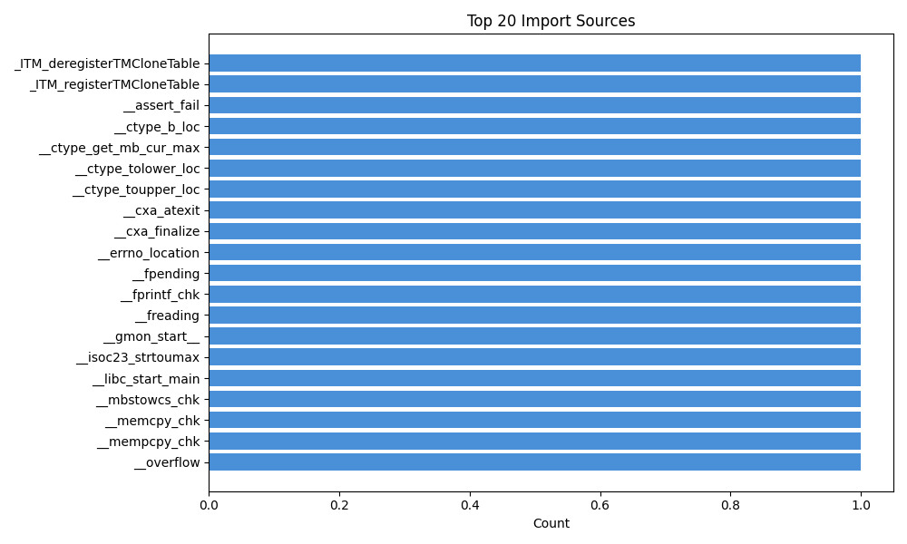
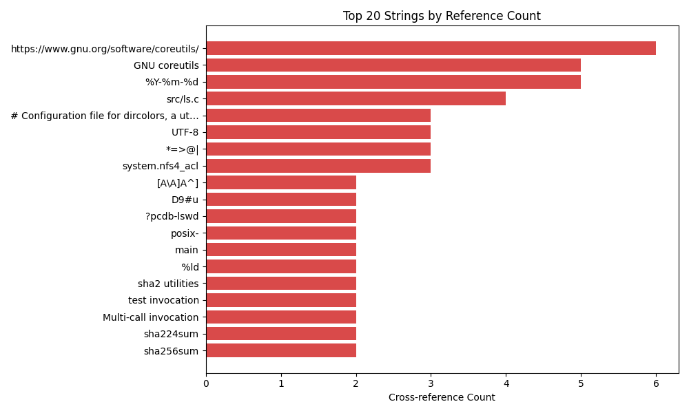

# Malware Analysis Report: `ls`
**SHA-256:** `1bea8094b78a3910345d80af3d182390fda07ae5788352651eb7773505dc39af`

> **⚠️ DO NOT EXECUTE THIS BINARY ⚠️**
>
> This report was generated via automated static analysis.
> The analysed file may be malicious. Do not run it outside a controlled,
> isolated analysis environment. AI-generated names and explanations are
> *best-effort guesses* marked with the `ai_` prefix and should be verified
> by a human analyst.

## Environment & Run Configuration

| Setting | Value |
|---------|-------|
| Binary Ninja | headless |
| LLM Model | `gpt-oss-safeguard:120b`  |
| Top-N Deep Analysis | 397 |
| Analysis Timeout | 600s |
| Hybrid Mode | False |
| Skip Boring | False |
| AI Rename Prefix | `ai_` |

**Warnings:**
- Safety override active (--i-know-what-im-doing). Input: /usr/bin/ls

## Binary Overview

| Property | Value |
|----------|-------|
| File | `ls` |
| Size | 142,312 bytes |
| Format | ELF |
| Architecture | x86_64 |
| Platform | linux-x86_64 |
| Entry Point | `0x406d30` |
| Functions | 397 total (397 analysed) |
| Strings | 1018 (≥4 chars) |
| Imports | 118 |
| Exports | 12 |

### Sections

| Name | Start | Length | Semantics |
|------|-------|--------|-----------|
| `.bss` | `0x423280` | 4,760 | 3 |
| `.data` | `0x423000` | 632 | 3 |
| `.data.rel.ro` | `0x421f40` | 2,808 | 2 |
| `.dynamic` | `0x422a38` | 512 | 2 |
| `.dynamic_rela` | `0x401808` | 5,424 | 2 |
| `.dynstr` | `0x401000` | 1,556 | 2 |
| `.dynsym` | `0x400400` | 3,072 | 2 |
| `.eh_frame` | `0x41e760` | 6,744 | 2 |
| `.eh_frame_hdr` | `0x41e170` | 1,516 | 2 |
| `.extern` | `0x424520` | 960 | 4 |
| `.fini` | `0x418da4` | 13 | 1 |
| `.fini_array` | `0x421f38` | 8 | 3 |
| `.gnu.hash` | `0x4003b0` | 80 | 2 |
| `.gnu.version` | `0x401614` | 256 | 2 |
| `.gnu.version_r` | `0x401718` | 240 | 2 |
| `.got` | `0x422c38` | 968 | 2 |
| `.init` | `0x404000` | 27 | 1 |
| `.init_array` | `0x421f30` | 8 | 3 |
| `.interp` | `0x400318` | 28 | 2 |
| `.plt` | `0x404020` | 1,680 | 1 |
| `.plt.got` | `0x4046b0` | 64 | 1 |
| `.plt.sec` | `0x4046f0` | 1,664 | 1 |
| `.rela.dyn` | `0x401808` | 5,424 | 2 |
| `.rela.plt` | `0x402d38` | 2,496 | 2 |
| `.rodata` | `0x419000` | 20,847 | 2 |
| `.synthetic_builtins` | `0x4248e0` | 48 | 4 |
| `.text` | `0x404d70` | 81,970 | 1 |

### Segments

| Start | Length | Flags |
|-------|--------|-------|
| `0x400000` | 14,072 | `r=rw=-x=-` |
| `0x404000` | 85,425 | `r=rw=-x=x` |
| `0x419000` | 29,112 | `r=rw=-x=-` |
| `0x421f30` | 4,936 | `r=rw=wx=-` |
| `0x423278` | 4,768 | `r=rw=wx=-` |
| `0x424520` | 960 | `r=-w=-x=-` |
| `0x4248e0` | 48 | `r=-w=-x=-` |

## Imports

| # | Import |
|---|--------|
| 1 | `_ITM_deregisterTMCloneTable` |
| 2 | `_ITM_registerTMCloneTable` |
| 3 | `__assert_fail` |
| 4 | `__ctype_b_loc` |
| 5 | `__ctype_get_mb_cur_max` |
| 6 | `__ctype_tolower_loc` |
| 7 | `__ctype_toupper_loc` |
| 8 | `__cxa_atexit` |
| 9 | `__cxa_finalize` |
| 10 | `__errno_location` |
| 11 | `__fpending` |
| 12 | `__fprintf_chk` |
| 13 | `__freading` |
| 14 | `__gmon_start__` |
| 15 | `__isoc23_strtoumax` |
| 16 | `__libc_start_main` |
| 17 | `__mbstowcs_chk` |
| 18 | `__memcpy_chk` |
| 19 | `__mempcpy_chk` |
| 20 | `__overflow` |
| 21 | `__printf_chk` |
| 22 | `__readlink_chk` |
| 23 | `__snprintf_chk` |
| 24 | `__sprintf_chk` |
| 25 | `__stack_chk_fail` |
| 26 | `__strcpy_chk` |
| 27 | `_exit` |
| 28 | `_setjmp` |
| 29 | `abort` |
| 30 | `bindtextdomain` |
| 31 | `calloc` |
| 32 | `clock_gettime` |
| 33 | `closedir` |
| 34 | `dcgettext` |
| 35 | `dirfd` |
| 36 | `error` |
| 37 | `exit` |
| 38 | `fclose` |
| 39 | `fflush` |
| 40 | `fflush_unlocked` |
| 41 | `fileno` |
| 42 | `fnmatch` |
| 43 | `fputc_unlocked` |
| 44 | `fputs_unlocked` |
| 45 | `free` |
| 46 | `freecon` |
| 47 | `fseeko` |
| 48 | `fwrite` |
| 49 | `fwrite_unlocked` |
| 50 | `getcwd` |
| 51 | `getenv` |
| 52 | `getfilecon` |
| 53 | `getgrgid` |
| 54 | `gethostname` |
| 55 | `getopt_long` |
| 56 | `getpwuid` |
| 57 | `getxattr` |
| 58 | `gmtime_r` |
| 59 | `ioctl` |
| 60 | `isatty` |
| 61 | `iswcntrl` |
| 62 | `iswprint` |
| 63 | `lgetfilecon` |
| 64 | `listxattr` |
| 65 | `localeconv` |
| 66 | `localtime_r` |
| 67 | `lseek` |
| 68 | `malloc` |
| 69 | `mbrtoc32` |
| 70 | `mbrtowc` |
| 71 | `mbsinit` |
| 72 | `mbstowcs` |
| 73 | `memcmp` |
| 74 | `memcpy` |
| 75 | `memmove` |
| 76 | `mempcpy` |
| 77 | `memset` |
| 78 | `mktime` |
| 79 | `nl_langinfo` |
| 80 | `opendir` |
| 81 | `optarg` |
| 82 | `optind` |
| 83 | `program_invocation_name` |
| 84 | `program_invocation_short_name` |
| 85 | `raise` |
| 86 | `rawmemchr` |
| 87 | `readdir` |
| 88 | `readlink` |
| 89 | `realloc` |
| 90 | `reallocarray` |
| 91 | `setenv` |
| 92 | `setlocale` |
| 93 | `sigaction` |
| 94 | `sigaddset` |
| 95 | `sigemptyset` |
| 96 | `sigismember` |
| 97 | `signal` |
| 98 | `sigprocmask` |
| 99 | `snprintf` |
| 100 | `stat` |
| ... | *(18 more in evidence.json)* |

## Exports

| # | Export |
|---|--------|
| 1 | `_FINI_0` |
| 2 | `_INIT_0` |
| 3 | `_fini` |
| 4 | `_init` |
| 5 | `_obstack_allocated_p` |
| 6 | `_obstack_begin` |
| 7 | `_obstack_begin_1` |
| 8 | `_obstack_free` |
| 9 | `_obstack_memory_used` |
| 10 | `_obstack_newchunk` |
| 11 | `_start` |
| 12 | `main` |

## Top Strings

| # | String | Refs | Functions |
|---|--------|------|-----------|
| 1 | `https://www.gnu.org/software/coreutils/` | 6 | 0x4090e0 |
| 2 | `GNU coreutils` | 5 | 0x404da0, 0x411790, 0x4090e0 |
| 3 | `%Y-%m-%d` | 5 | 0x414780 |
| 4 | `src/ls.c` | 4 | 0x404da0, 0x40e4b0 |
| 5 | `# Configuration file for dircolors, a utility to help you set the` | 3 | 0x404da0 |
| 6 | `UTF-8` | 3 | 0x408c20 |
| 7 | `*=>@\|` | 3 | 0x404da0 |
| 8 | `system.nfs4_acl` | 3 | 0x417490 |
| 9 | `[A\A]A^]` | 2 | 0x408090 |
| 10 | `D9#u` | 2 | 0x40f4c0 |
| 11 | `D9#u` | 2 | 0x40f5f0 |
| 12 | `?pcdb-lswd` | 2 | 0x40f6b0 |
| 13 | `posix-` | 2 | 0x404da0 |
| 14 | `main` | 2 | 0x404da0 |
| 15 | ` %ld` | 2 | 0x408190 |
| 16 | `sha2 utilities` | 2 | 0x4090e0 |
| 17 | `test invocation` | 2 | 0x4090e0 |
| 18 | `Multi-call invocation` | 2 | 0x4090e0 |
| 19 | `sha224sum` | 2 | 0x4090e0 |
| 20 | `sha256sum` | 2 | 0x4090e0 |
| 21 | `sha384sum` | 2 | 0x4090e0 |
| 22 | `sha512sum` | 2 | 0x4090e0 |
| 23 | `Full documentation <%s%s>\n` | 2 | 0x4090e0 |
| 24 | `memory exhausted` | 2 | 0x409a00, 0x40e430 |
| 25 | `%.0Lf` | 2 | 0x40cb80 |
| 26 | `%.1Lf` | 2 | 0x40cb80 |
| 27 | `unlabeled` | 2 | 0x40e040, 0x417490 |
| 28 | `error canonicalizing %s` | 2 | 0x417490, 0x410fc0 |
| 29 | `%s%s argument '%s' too large` | 2 | 0x404da0 |
| 30 | `full-iso` | 2 | 0x404da0 |

## Frequency Analysis

### Import Sources



### String References



## Call Graph (Top Functions)

```mermaid
graph LR
    f_404da0["ai_ls_initialize"]
    f_404da0 --> f_404970
    f_404da0 --> f_404770
    f_404da0 --> f_404bc0
    f_404da0 --> f_4048a0
    f_404da0 --> f_404860
    f_404da0 --> f_418d90
    f_404da0 --> f_404900
    f_404da0 --> f_413ec0
    f_404da0 --> f_409ee0
    f_404da0 --> f_4046d0
    f_404da0 --> f_412420
    f_404da0 --> f_409070
    f_404da0 --> f_409cf0
    f_404da0 --> f_4048c0
    f_404da0 --> f_404c30
    f_404da0 --> f_411f60
    f_404da0 --> f_404760
    f_404da0 --> f_413ce0
    f_404da0 --> f_40e470
    f_404da0 --> f_408c20
    f_404da0 --> f_411790
    f_404da0 --> f_404cb0
    f_404da0 --> f_411e10
    f_404da0 --> f_40c6a0
    f_404da0 --> f_416a40
    f_404da0 --> f_40dc60
    f_404da0 --> f_404700
    f_404da0 --> f_408fc0
    f_404da0 --> f_4047f0
    f_404da0 --> f_409f10
    f_404da0 --> f_417490
    f_404da0 --> f_410fc0
    f_404da0 --> f_4046b0
    f_404da0 --> f_409a50
    f_404da0 --> f_40be90
    f_404da0 --> f_404cf0
    f_404da0 --> f_408a60
    f_404da0 --> f_404730
    f_404da0 --> f_40c840
    f_404da0 --> f_40c7b0
    f_404da0 --> f_40b590
    f_404da0 --> f_411e70
    f_404da0 --> f_404c90
    f_404da0 --> f_4048e0
    f_404da0 --> f_410a20
    f_404da0 --> f_410b30
    f_404da0 --> f_404a10
    f_404da0 --> f_407d70
    f_404da0 --> f_4046c0
    f_404da0 --> f_406ea0
    f_404da0 --> f_4049a0
    f_404da0 --> f_40e430
    f_404da0 --> f_408190
    f_404da0 --> f_404bd0
    f_404da0 --> f_408280
    f_404da0 --> f_40e4b0
    f_404da0 --> f_4105e0
    f_404da0 --> f_4049d0
    f_404da0 --> f_4049b0
    f_404da0 --> f_40bbb0
    f_404da0 --> f_410b70
    f_404da0 --> f_40c040
    f_404da0 --> f_404a30
    f_404da0 --> f_404cd0
    f_404da0 --> f_4090e0
    f_404da0 --> f_404960
    f_404da0 --> f_404930
    f_404da0 --> f_410bf0
    f_404da0 --> f_404aa0
    f_404da0 --> f_4048f0
    f_404da0 --> f_404750
    f_404da0 --> f_404cc0
    f_417490["ai_collect_file_acl_info"]
    f_417490 --> f_40bbb0
    f_417490 --> f_40b910
    f_417490 --> f_40b9e0
    f_417490 --> f_410b30
    f_417490 --> f_4048c0
    f_417490 --> f_40bc10
    f_417490 --> f_40cb80
    f_417490 --> f_4048e0
    f_417490 --> f_4140a0
    f_417490 --> f_416b20
    f_417490 --> f_404ce0
    f_417490 --> f_40e040
    f_417490 --> f_4046c0
    f_417490 --> f_404a60
    f_417490 --> f_4046b0
    f_417490 --> f_4046d0
    f_417490 --> f_404760
    f_417490 --> f_404d10
    f_417490 --> f_4047f0
    f_417490 --> f_40bcc0
    f_417490 --> f_4048b0
    f_417490 --> f_404c80
    f_417490 --> f_40e430
    f_417490 --> f_40f580
    f_417490 --> f_404720
    f_417490 --> f_414030
    f_417490 --> f_404c30
    f_417490 --> f_404aa0
    f_417490 --> f_40f5f0
    f_417490 --> f_404ba0
    f_417490 --> f_4048f0
    f_414780["ai_custom_strftime"]
    f_414780 --> f_404760
    f_414780 --> f_4049c0
    f_414780 --> f_4046f0
    f_414780 --> f_404ad0
    f_414780 --> f_404c00
    f_414780 --> f_414780
    f_414780 --> f_4048e0
    f_414780 --> f_40e1f0
    f_414780 --> f_404b70
    f_414780 --> f_40e300
    f_414780 --> f_404d40
    f_414780 --> f_40e0c0
    f_414780 --> f_404bf0
    f_414780 --> f_4048f0
    f_4090e0["ai_print_usage_help"]
    f_4090e0 --> f_4048c0
    f_4090e0 --> f_404cd0
    f_4090e0 --> f_404cb0
    f_4090e0 --> f_404bd0
    f_4090e0 --> f_404a30
    f_4090e0 --> f_404bc0
    f_4090e0 --> f_404770
    f_416b20["ai_resolve_path"]
    f_416b20 --> f_404750
    f_416b20 --> f_4049e0
    f_416b20 --> f_404760
    f_416b20 --> f_4046b0
    f_416b20 --> f_40c560
    f_416b20 --> f_40c840
    f_416b20 --> f_4046d0
    f_416b20 --> f_404aa0
    f_416b20 --> f_40c5e0
    f_416b20 --> f_40e430
    f_416b20 --> f_404c10
    f_416b20 --> f_404830
    f_416b20 --> f_404a40
    f_416b20 --> f_404ac0
    f_416b20 --> f_4048e0
    f_416b20 --> f_404c20
    f_416b20 --> f_404ad0
    f_416b20 --> f_410b30
    f_416b20 --> f_40c940
    f_416b20 --> f_416a40
    f_416b20 --> f_4048f0
    f_40cb80["ai_locale_number_format"]
    f_40cb80 --> f_404810
    f_40cb80 --> f_4048e0
    f_40cb80 --> f_404aa0
    f_40cb80 --> f_404ad0
    f_40cb80 --> f_404d60
    f_40cb80 --> f_404c20
    f_40cb80 --> f_4048f0
    f_40f6b0["ai_format_file_mode_string"]
    f_40f6b0 --> f_404d60
    f_40f6b0 --> f_4140a0
    f_40f6b0 --> f_408170
    f_40f6b0 --> f_40cb80
    f_40f6b0 --> f_4048e0
    f_40f6b0 --> f_40ecd0
    f_40f6b0 --> f_40bd80
    f_40f6b0 --> f_40af90
    f_40f6b0 --> f_40f5f0
    f_40f6b0 --> f_40f4c0
    f_40f6b0 --> f_40e390
    f_40f6b0 --> f_414780
    f_40f6b0 --> f_404840
    f_40f6b0 --> f_404960
    f_40f6b0 --> f_4048f0
    f_412790["ai_locale_string_validator"]
    f_412790 --> f_404750
    f_412790 --> f_4048d0
    f_412790 --> f_4048c0
    f_412790 --> f_4048e0
    f_412790 --> f_404d50
    f_412790 --> f_404a10
    f_412790 --> f_411700
    f_412790 --> f_404d20
    f_412790 --> f_404d00
    f_412790 --> f_40df40
    f_412790 --> f_4048f0
    f_408280["ai_parse_format_placeholders"]
    f_408280 --> f_404740
    f_408280 --> f_4046b0
    f_408280 --> f_404b50
    f_408280 --> f_404930
    f_408280 --> f_404d50
    f_408280 --> f_4048e0
    f_408280 --> f_4048d0
    f_408280 --> f_404820
    f_408280 --> f_4046d0
    f_408280 --> f_4047a0
    f_408280 --> f_404d20
    f_408280 --> f_404800
    f_408280 --> f_404b30
    f_408280 --> f_404c70
    f_408280 --> f_404720
    f_408280 --> f_404950
    f_408280 --> f_4048f0
    f_410fc0["ai_directory_traversal"]
    f_410fc0 --> f_404760
    f_410fc0 --> f_404880
    f_410fc0 --> f_404a80
    f_410fc0 --> f_40b9e0
    f_410fc0 --> f_4046d0
    f_410fc0 --> f_40c940
    f_410fc0 --> f_4046b0
    f_410fc0 --> f_414030
    f_410fc0 --> f_4048c0
    f_410fc0 --> f_404c30
    f_410fc0 --> f_404a00
    f_410fc0 --> f_409f10
    f_410fc0 --> f_40e910
    f_410fc0 --> f_408170
    f_410fc0 --> f_404b20
    f_410fc0 --> f_4049b0
    f_410fc0 --> f_40bf40
    f_410fc0 --> f_40bc10
    f_410fc0 --> f_40e4b0
    f_410fc0 --> f_40cb80
    f_410fc0 --> f_4048e0
    f_410fc0 --> f_4105e0
    f_410fc0 --> f_417490
    f_410fc0 --> f_410bf0
    f_410fc0 --> f_416b20
    f_410fc0 --> f_40dca0
    f_410fc0 --> f_404960
    f_410fc0 --> f_4048f0
    f_410fc0 --> f_40e430
    f_411790["ai_print_version_and_license"]
    f_411790 --> f_404cd0
    f_411790 --> f_4048c0
    f_411790 --> f_404a90
    f_411790 --> f_4048f0
    f_414230["ai_validate_string_and_flag"]
    f_414230 --> f_4048e0
    f_414230 --> f_4048d0
    f_414230 --> f_404d50
    f_414230 --> f_404ad0
    f_414230 --> f_404760
    f_414230 --> f_412790
    f_414230 --> f_404910
    f_414230 --> f_40c6a0
    f_414230 --> f_404b30
    f_414230 --> f_404d00
    f_414230 --> f_4140a0
    f_414230 --> f_4046d0
    f_414230 --> f_40e430
    f_414230 --> f_4048f0
    f_411f60["ai_parse_uintmax"]
    f_411f60 --> f_404760
    f_411f60 --> f_404d50
    f_411f60 --> f_404ae0
    f_411f60 --> f_404930
    f_411f60 --> f_4048f0
    f_40ecd0["ai_dispatch_operation"]
    f_40ecd0 --> f_40e910
    f_40ecd0 --> f_40bf40
    f_40ecd0 --> f_40bbb0
    f_40ecd0 --> f_40be90
    f_40ecd0 --> f_4048e0
    f_40ecd0 --> f_404770
    f_40ecd0 --> f_407d70
    f_410bf0["ai_process_config_entries"]
    f_410bf0 --> f_4046d0
    f_410bf0 --> f_410b30
    f_410bf0 --> f_4048e0
    f_410bf0 --> f_404740
    f_410bf0 --> f_404c10
    f_410bf0 --> f_410b70
    f_410bf0 --> f_4046b0
    f_410bf0 --> f_404920
    f_410bf0 --> f_40e430
    f_40e910["ai_print_entry"]
    f_40e910 --> f_414230
    f_40e910 --> f_40bbb0
    f_40e910 --> f_40be90
    f_40e910 --> f_40e7a0
    f_40e910 --> f_404bd0
    f_40e910 --> f_4046b0
    f_40e910 --> f_40dde0
    f_40e910 --> f_404b90
    f_40e910 --> f_404960
    f_40e910 --> f_4048f0
    f_40c1f0["ai_is_digit_string"]
    f_40e4b0["ai_resize_sort_file_buffer"]
    f_40e4b0 --> f_4046b0
    f_40e4b0 --> f_4047f0
    f_40e4b0 --> f_404a20
    f_40e4b0 --> f_40b040
    f_40e4b0 --> f_408ce0
    f_40e4b0 --> f_40e430
    f_40e4b0 --> f_4049a0
    f_418b20["ai_print_formatted_config_value"]
    f_418b20 --> f_40bbb0
    f_418b20 --> f_404bd0
    f_418b20 --> f_40ecd0
    f_418b20 --> f_40bd80
    f_418b20 --> f_40cb80
    f_418b20 --> f_40be90
    f_418b20 --> f_404960
    f_418b20 --> f_4048f0
    f_40f200["ai_ensure_capacity"]
    f_40f200 --> f_4047f0
    f_40f200 --> f_40e430
    f_40f200 --> f_40d850
    f_40c940["ai_safe_malloc"]
    f_40c940 --> f_404750
    f_40c940 --> f_409a50
    f_40c940 --> f_40c7b0
    f_40c940 --> f_404760
    f_40c940 --> f_40b590
    f_40c940 --> f_4046d0
    f_40c940 --> f_4048f0
    f_4140a0["ai_compute_display_width"]
    f_4140a0 --> f_4048d0
    f_4140a0 --> f_404b30
    f_4140a0 --> f_404d00
    f_4140a0 --> f_411700
    f_4140a0 --> f_4047e0
    f_4140a0 --> f_404d50
    f_4140a0 --> f_4048f0
    f_40d850["ai_process_config_flags"]
    f_40d850 --> f_40bd80
    f_40d850 --> f_40cb80
    f_40d850 --> f_4048e0
    f_40d850 --> f_40b040
    f_40d850 --> f_4048f0
    f_406ea0["ai_decode_escape_sequence"]
    f_412420["ai_get_blocksize_config"]
    f_412420 --> f_411e70
    f_412420 --> f_411f60
    f_412420 --> f_404700
    f_412420 --> f_4048f0
    f_408a60["ai_signal_handler_setup"]
    f_408a60 --> f_404ca0
    f_408a60 --> f_404a70
    f_408a60 --> f_404ab0
    f_408a60 --> f_4047d0
    f_408a60 --> f_404d30
    f_408a60 --> f_4048f0
    f_408ce0["ai_sort_array_by_comparator"]
    f_408ce0 --> f_404ad0
    f_408ce0 --> f_408ce0
    f_413ce0["ai_dynamic_array_ensure_and_process"]
    f_413ce0 --> f_404760
    f_413ce0 --> f_410a20
    f_413ce0 --> f_4049c0
    f_413ce0 --> f_412790
    f_413ce0 --> f_4046b0
    f_413ce0 --> f_4046d0
    f_413ce0 --> f_40e430
    f_413ce0 --> f_4048f0
    f_40b6f0["ai_flush_and_close_file"]
    f_40b6f0 --> f_404b00
    f_40b6f0 --> f_404b80
    f_40b6f0 --> f_404b40
    f_40b6f0 --> f_404760
    f_40b6f0 --> f_404870
    f_40b6f0 --> f_404990
    f_40b6f0 --> f_404c40
    f_413ec0["ai_print_valid_arguments"]
    f_413ec0 --> f_411e70
    f_413ec0 --> f_40c040
    f_413ec0 --> f_4048c0
    f_413ec0 --> f_404a30
    f_413ec0 --> f_413ce0
    f_413ec0 --> f_404cd0
    f_413ec0 --> f_404960
    f_412600["ai_filename_compare"]
    f_412600 --> f_40c110
    f_412600 --> f_40c1f0
    f_412600 --> f_4048f0
    f_40e1f0["ai_manage_timezone_env"]
    f_40e1f0 --> f_404700
    f_40e1f0 --> f_408fc0
    f_40e1f0 --> f_404c50
    f_40e1f0 --> f_404af0
    f_40e1f0 --> f_4046c0
    f_40e1f0 --> f_404850
    f_40e1f0 --> f_404760
    f_40e1f0 --> f_4046b0
    f_40da80["ai_print_data_array_stdout"]
    f_40da80 --> f_418b20
    f_40da80 --> f_40d850
    f_40da80 --> f_404960
    f_40bf40["ai_signal_suspension_loop"]
    f_40bf40 --> f_404cf0
    f_40bf40 --> f_404710
    f_40bf40 --> f_404730
    f_40bf40 --> f_40be90
    f_40bf40 --> f_404a70
    f_40bf40 --> f_4048f0
    f_40c6a0["ai_check_posix_locale"]
    f_40c6a0 --> f_404bc0
    f_40c6a0 --> f_4048e0
    f_40c6a0 --> f_4046c0
    f_40c6a0 --> f_4048f0
    f_40b590["ai_ensure_capacity"]
    f_40b590 --> f_404750
    f_40b590 --> f_4168e0
    f_40b590 --> f_404a50
    f_40b590 --> f_409b80
    f_40b590 --> f_404760
    f_40b590 --> f_4046b0
    f_40b590 --> f_4048f0
    f_40e0c0["ai_add_string_to_list"]
    f_40e0c0 --> f_4046c0
    f_40e0c0 --> f_4048e0
    f_40e0c0 --> f_404ad0
    f_40e0c0 --> f_408fc0
    f_40df40["ai_detect_locale_charset"]
    f_40df40 --> f_404b50
    f_40df40 --> f_407f90
    f_40c840["ai_cleanup_linked_structure"]
    f_40c840 --> f_404760
    f_40c840 --> f_4046b0
    f_40e7a0["ai_url_encode"]
    f_40e7a0 --> f_4048e0
    f_40e7a0 --> f_4047f0
    f_40e7a0 --> f_404d60
    f_40e7a0 --> f_40e430
    f_409b80["ai_hash_table_insert"]
    f_409b80 --> f_404750
    f_409b80 --> f_4046d0
    f_40b9e0["ai_collect_file_metadata"]
    f_40b9e0 --> f_404be0
    f_40b9e0 --> f_4048f0
    f_4168e0["ai_compute_bucket_capacity"]
    f_4168e0 --> f_404760
    f_40f4c0["ai_user_name_cache_lookup"]
    f_40f4c0 --> f_404890
    f_40f4c0 --> f_4048e0
    f_40f4c0 --> f_4046d0
    f_40f4c0 --> f_404bb0
    f_40f4c0 --> f_40e430
    f_40be90["ai_lazy_stdout_write"]
    f_40be90 --> f_404b90
    f_40be90 --> f_404b10
    f_40be90 --> f_40be90
    f_40be90 --> f_408a60
    f_40f5f0["ai_get_group_name_by_gid"]
    f_40f5f0 --> f_404940
    f_40f5f0 --> f_4048e0
    f_40f5f0 --> f_4046d0
    f_40f5f0 --> f_404bb0
    f_40f5f0 --> f_40e430
    f_409f10["ai_cleanup_global_structs"]
    f_409f10 --> f_4046b0
    f_409f10 --> f_404920
    f_416a40["ai_initialize_object_pool"]
    f_416a40 --> f_4046d0
    f_416a40 --> f_40c7b0
    f_416a40 --> f_4168e0
    f_416a40 --> f_404a50
    f_416a40 --> f_404760
    f_416a40 --> f_4046b0
    f_40af90["ai_print_padded_string"]
    f_40af90 --> f_4048e0
    f_40af90 --> f_4140a0
    f_40af90 --> f_408170
    f_40af90 --> f_404960
    f_40af90 --> f_404bd0
    f_410a20["ai_safe_buffer_resize"]
    f_410a20 --> f_404ba0
    f_410a20 --> f_40e430
    f_40c040["ai_argument_error_report"]
    f_40c040 --> f_4048c0
    f_40c040 --> f_413ce0
    f_40c040 --> f_404c30
    f_40c040 --> f_4048f0
    f_408c20["ai_is_utf8_locale"]
    f_408c20 --> f_4048c0
    f_408c20 --> f_404b50
    f_40b880["ai_write_error_exit_handler"]
    f_40b880 --> f_40b810
    f_40b880 --> f_4048c0
    f_40b880 --> f_404760
    f_40b880 --> f_404c30
    f_40b880 --> f_404790
    f_40c5e0["ai_expand_buffer"]
    f_40c5e0 --> f_404ba0
    f_40c5e0 --> f_4046d0
    f_40c5e0 --> f_404aa0
    f_40c5e0 --> f_404760
    f_40c5e0 --> f_4046b0
    f_409a50["ai_hash_table_lookup"]
    f_409a50 --> f_404750
    f_408190["ai_print_long_array"]
    f_408190 --> f_404a30
    f_408190 --> f_404bd0
    f_408190 --> f_404960
    f_40b910["ai_compute_file_mode_flags"]
    f_40b910 --> f_404750
    f_40e300["ai_set_tz_env_and_cleanup"]
    f_40e300 --> f_404760
    f_40e300 --> f_404c50
    f_40e300 --> f_4046b0
    f_40e300 --> f_404850
    f_40e300 --> f_404af0
    f_40c7b0["ai_validate_float_bounds"]
    f_40dca0["ai_memory_chunk_allocate"]
    f_40dca0 --> f_404ad0
    f_40dca0 --> f_40dde0
    f_411e70["ai_match_argument_in_list"]
    f_411e70 --> f_4048e0
    f_411e70 --> f_404770
    f_40e390["ai_set_timezone_and_get_localtime"]
    f_40e390 --> f_40e1f0
    f_40e390 --> f_404780
    f_40e390 --> f_40e0c0
    f_40e390 --> f_40e300
    f_40e390 --> f_404980
    f_40bc10["ai_report_error"]
    f_40bc10 --> f_413ce0
    f_40bc10 --> f_404760
    f_40bc10 --> f_404c30
    f_40bc10 --> f_4048f0
    f_40bd80["ai_map_status_code"]
    f_408090["ai_write_padding_spaces_tabs"]
    f_408090 --> f_404960
    f_40c110["ai_validate_dot_extension"]
    f_407f90["ai_case_insensitive_two_char_match"]
    f_40e040["ai_cleanup_unlabeled_label"]
    f_40e040 --> f_4046c0
    f_40e040 --> f_404920
    f_40e040 --> f_404760
    f_40b040["ai_compute_string_sort_key"]
    f_40b040 --> f_414230
    f_40b040 --> f_4046b0
    f_40b040 --> f_4048f0
    f_40ab80["ai_compare_filenames_by_extension"]
    f_40ab80 --> f_404970
    f_40ab80 --> f_404760
    f_40ab80 --> f_404b60
    f_40ac90["ai_compare_filenames_by_extension"]
    f_40ac90 --> f_404970
    f_40ac90 --> f_404760
    f_40ac90 --> f_404b60
    f_40e430["ai_memory_exhausted_abort"]
    f_40e430 --> f_4048c0
    f_40e430 --> f_404c30
    f_40e430 --> f_404750
    f_40bcc0["ai_validate_string_prefix_length"]
    f_40bcc0 --> f_404760
    f_40bcc0 --> f_412790
    f_40bcc0 --> f_4048e0
    f_40bcc0 --> f_4048f0
    f_408fc0["ai_allocate_string_struct"]
    f_408fc0 --> f_4048e0
    f_408fc0 --> f_4046d0
    f_408fc0 --> f_404aa0
    f_40aed0["ai_compare_objects_by_type_and_name"]
    f_40aed0 --> f_412600
    f_40aed0 --> f_4046c0
    f_40ae20["ai_compare_structs_by_type"]
    f_40ae20 --> f_412600
    f_40ae20 --> f_4046c0
    f_40b810["ai_check_file_write_error"]
    f_40b810 --> f_4047b0
    f_40b810 --> f_40b6f0
    f_40b810 --> f_404760
    f_40b210["ai_compare_struct_cached_key_strcoll"]
    f_40b210 --> f_404760
    f_40b210 --> f_404b60
    f_40b210 --> f_40b040
    f_40b340["ai_cached_strcoll_compare"]
    f_40b340 --> f_404760
    f_40b340 --> f_404b60
    f_40b340 --> f_40b040
    f_40a850["ai_compare_structs_by_type_and_name"]
    f_40a850 --> f_404760
    f_40a850 --> f_404b60
    f_40de70["ai_obstack_free_memory"]
    f_40de70 --> f_404750
    f_40a920["ai_compare_struct_by_type_and_timestamp"]
    f_40a920 --> f_404760
    f_40a920 --> f_404b60
    f_40c560["ai_buffer_grow"]
    f_40c560 --> f_4046b0
    f_40c560 --> f_4046d0
    f_40c560 --> f_404760
    f_40bbb0["ai_get_config_option"]
    f_410b70["ai_add_list_node"]
    f_410b70 --> f_4046d0
    f_410b70 --> f_410b30
    f_410b70 --> f_40e430
    f_411700["ai_utf8_to_utf32_wrapper"]
    f_411700 --> f_4049f0
    f_411700 --> f_40c6a0
    f_40aa40["ai_custom_string_compare"]
    f_40aa40 --> f_404760
    f_40aa40 --> f_404b60
    f_40aae0["ai_custom_sort_compare"]
    f_40aae0 --> f_404760
    f_40aae0 --> f_404b60
    f_410b30["ai_strdup"]
    f_410b30 --> f_4048e0
    f_410b30 --> f_4046d0
    f_410b30 --> f_404aa0
    f_410b30 --> f_40e430
    f_411e10["ai_allocate_and_init_static_struct"]
    f_411e10 --> f_404760
    f_411e10 --> f_4046d0
    f_411e10 --> f_40e430
    f_40f580["ai_resolve_uid_to_name"]
    f_40f580 --> f_404720
    f_40f580 --> f_40f4c0
    f_40f580 --> f_4048e0
    f_40f580 --> f_4140a0
    f_409a00["ai_exit_on_memory_exhausted"]
    f_409a00 --> f_4048c0
    f_409a00 --> f_404cd0
    f_409a00 --> f_404cb0
    f_409d10["ai_compare_file_extensions"]
    f_409d10 --> f_404970
    f_4071f0["ai_compare_struct_by_type_and_name"]
    f_4071f0 --> f_4046c0
    f_4072c0["ai_struct_comparator"]
    f_4072c0 --> f_4046c0
    f_407430["ai_compare_struct_by_type_and_range"]
    f_407430 --> f_4046c0
    f_407500["ai_struct_compare_by_type_and_range"]
    f_407500 --> f_4046c0
    f_407670["ai_compare_struct_by_type_and_name"]
    f_407670 --> f_4046c0
    f_407740["ai_compare_struct_by_type_and_name"]
    f_407740 --> f_4046c0
    f_4078b0["ai_compare_struct_by_type_and_name"]
    f_4078b0 --> f_4046c0
    f_407980["ai_compare_structs_by_type_and_position"]
    f_407980 --> f_4046c0
    f_40b0f0["ai_cached_string_compare"]
    f_40b0f0 --> f_4046c0
    f_40b0f0 --> f_40b040
    f_40b470["ai_string_compare_cached_hash"]
    f_40b470 --> f_4046c0
    f_40b470 --> f_40b040
    f_407ed0["ai_obstack_new_chunk"]
    f_407ed0 --> f_407f90
    f_407b70["ai_file_entry_compare"]
    f_407b70 --> f_4046c0
    f_407ad0["ai_compare_structs_by_type_and_name"]
    f_407ad0 --> f_4046c0
    f_407c50["ai_compare_struct_by_type_and_flag"]
    f_407c50 --> f_4046c0
    f_407ce0["ai_struct_compare_by_type_and_flag"]
    f_407ce0 --> f_4046c0
    f_409070["ai_safe_strtoumax"]
    f_409070 --> f_411f60
    f_409070 --> f_4048f0
    f_409e50["ai_compare_file_entries"]
    f_409e50 --> f_409d10
    f_409dc0["ai_compare_file_type_and_extension"]
    f_409dc0 --> f_409d10
    f_4046b0["ai_free_memory"]
    f_4046c0["ai_strcmp_wrapper"]
    f_4046d0["ai_allocate_memory"]
    f_404760["ai_get_errno_location"]
    f_4048c0["ai_gettext_wrapper"]
    f_4048e0["ai_string_length"]
    f_4048f0["ai_stack_canary_failure"]
    f_4049c0["ai_memset_wrapper"]
    f_404a30["ai_print_string_to_stream"]
    f_404b60["ai_string_collate_wrapper"]
    f_40a010["ai_struct_compare_with_fallback_strcoll"]
    f_40a010 --> f_404760
    f_40a010 --> f_404b60
    f_40a110["ai_struct_comparator"]
    f_40a110 --> f_404760
    f_40a110 --> f_404b60
    f_40a210["ai_struct_comparator"]
    f_40a210 --> f_404760
    f_40a210 --> f_404b60
    f_40a300["ai_struct_comparator_by_fields_and_name"]
    f_40a300 --> f_404760
    f_40a300 --> f_404b60
    f_40a3f0["ai_struct_compare_by_fields_and_name"]
    f_40a3f0 --> f_404760
    f_40a3f0 --> f_404b60
    f_40a4e0["ai_struct_comparator"]
    f_40a4e0 --> f_404760
    f_40a4e0 --> f_404b60
    f_40a5d0["ai_struct_compare_by_fields_and_name"]
    f_40a5d0 --> f_404760
    f_40a5d0 --> f_404b60
    f_40a6c0["ai_struct_compare_by_fields_and_name"]
    f_40a6c0 --> f_404760
    f_40a6c0 --> f_404b60
    f_404020["ai_config_lookup"]
    f_40a090["ai_struct_comparator"]
    f_40a090 --> f_40a010
    f_40a190["ai_struct_compare_by_type_and_flag"]
    f_40a190 --> f_40a110
    f_40a280["ai_compare_struct_by_type_flag"]
    f_40a280 --> f_40a210
    f_40a370["ai_compare_struct_by_type_flag"]
    f_40a370 --> f_40a300
    f_40a460["ai_compare_struct_entries"]
    f_40a460 --> f_40a3f0
    f_40a550["ai_compare_entries_by_type_and_flags"]
    f_40a550 --> f_40a4e0
    f_40a640["ai_compare_file_entry"]
    f_40a640 --> f_40a5d0
    f_40a730["ai_compare_struct_by_type_and_flags"]
    f_40a730 --> f_40a6c0
    f_40ac10["ai_compare_file_entries"]
    f_40ac10 --> f_40ab80
    f_40ad20["ai_compare_file_entries"]
    f_40ad20 --> f_40ac90
    f_40b190["ai_compare_struct_by_type_and_flag"]
    f_40b190 --> f_40b0f0
    f_40b2c0["ai_type_flag_comparator"]
    f_40b2c0 --> f_40b210
    f_40b3f0["ai_compare_objects_by_type_and_flag"]
    f_40b3f0 --> f_40b340
    f_40b510["ai_compare_entries_by_type_flag"]
    f_40b510 --> f_40b470
    f_414030["ai_init_dynamic_array"]
    f_414030 --> f_413ce0
    f_414030 --> f_4048f0
    f_40ada0["ai_custom_string_compare"]
    f_40ada0 --> f_412600
    f_40ada0 --> f_4046c0
    f_40ade0["ai_custom_strcmp"]
    f_40ade0 --> f_412600
    f_40ade0 --> f_4046c0
    f_406dd0["ai_runtime_cleanup"]
    f_406dd0 --> f_4046e0
    f_406dd0 --> f_406d60
    f_404cd0["ai_safe_fprintf_wrapper"]
    f_40a7b0["ai_compare_struct_by_numeric_and_string"]
    f_40a7b0 --> f_404760
    f_40a7b0 --> f_404b60
    f_40a800["ai_compare_by_numeric_then_string"]
    f_40a800 --> f_404760
    f_40a800 --> f_404b60
    f_404c30["ai_error_handler"]
    f_40e470["ai_allocate_and_store_128bit"]
    f_40e470 --> f_4046d0
    f_40e470 --> f_40e430
    f_409ee0["ai_stdout_isatty_cached"]
    f_409ee0 --> f_4047c0
    f_408170["ai_write_stdout"]
    f_408170 --> f_404b90
    f_404700["ai_getenv_wrapper"]
    f_404960["ai_file_stream_overflow"]
    f_407d70["ai_strnicmp"]
    f_40de30["ai_obstack_address_check"]
    f_404bd0["ai_printf_chk_wrapper"]
    f_404ad0["ai_copy_memory"]
    f_406d90["ai_null_stub"]
    f_404750["ai_fatal_abort"]
    f_40a9e0["ai_locale_string_compare"]
    f_40a9e0 --> f_404760
    f_40a9e0 --> f_404b60
    f_40aa10["ai_locale_string_compare"]
    f_40aa10 --> f_404760
    f_40aa10 --> f_404b60
    f_40dde0["ai_obstack_write_global_counter"]
    f_40dde0 --> f_40dca0
    f_406d60["ai_cleanup_tm_clone_registry"]
    f_407130["ai_compare_struct_by_fields"]
    f_407130 --> f_4046c0
    f_407390["ai_struct_compare_by_fields"]
    f_407390 --> f_4046c0
    f_4075d0["ai_struct_comparator"]
    f_4075d0 --> f_4046c0
    f_407810["ai_struct_compare_by_fields"]
    f_407810 --> f_4046c0
    f_407e60["ai_struct_compare"]
    f_407e60 --> f_4046c0
    f_404d60["ai_sprintf_wrapper"]
    f_407190["ai_struct_compare"]
    f_407190 --> f_4046c0
    f_4073e0["ai_struct_field_string_compare"]
    f_4073e0 --> f_4046c0
    f_407620["ai_struct_comparator"]
    f_407620 --> f_4046c0
    f_407860["ai_struct_field_string_compare"]
    f_407860 --> f_4046c0
    f_404770["ai_strncmp_wrapper"]
    f_4105e0["ai_jump_table_dispatch"]
    f_407ea0["ai_free_nested_pointer"]
    f_407ea0 --> f_4046b0
    f_407e00["ai_string_hash_mod"]
    f_4047f0["ai_reallocarray_wrapper"]
    f_404970["ai_strrchr_wrapper"]
    f_404aa0["ai_safe_memory_copy"]
    f_407a50["ai_compare_by_field_then_string"]
    f_407a50 --> f_4046c0
    f_407a90["ai_compare_by_field9_then_string"]
    f_407a90 --> f_4046c0
    f_404930["ai_strchr_wrapper"]
    f_404d50["ai_get_ctype_table"]
    f_409cf0["ai_dynamic_buffer_init"]
    f_409cf0 --> f_413ce0
    f_4046f0["ai_get_toupper_locale"]
    f_4048d0["ai_get_mb_cur_max"]
    f_404b30["ai_wcwidth_wrapper"]
    f_404b90["ai_write_buffer_to_file"]
    f_406d30["ai_entry_point"]
    f_404000["ai_gmon_init"]
    f_4049a0["ai_assert_failure_handler"]
    f_404a90["ai_write_char_to_stream"]
    f_404ba0["ai_memory_realloc_wrapper"]
    f_404bc0["ai_set_locale_wrapper"]
    f_418d90["ai_register_atexit_handler"]
    f_418d90 --> f_404c60
    f_404720["ai_safe_snprintf_wrapper"]
    f_404730["ai_raise_signal"]
    f_404920["ai_free_security_context"]
    f_4049b0["ai_fnmatch_wrapper"]
    f_404a00["ai_close_directory"]
    f_404a10["ai_memcmp_wrapper"]
    f_404b00["ai_get_fileno"]
    f_404b50["ai_get_locale_info"]
    f_404cb0["ai_exit_wrapper"]
    f_404d00["ai_check_multibyte_state"]
    f_406e70["ai_increment_global_counter"]
    f_404710["ai_signal_mask_control"]
    f_404740["ai_safe_memcpy"]
    f_404790["ai_process_exit"]
    f_4047d0["ai_set_signal_handler"]
    f_404800["ai_wcswidth_wrapper"]
    f_404850["ai_set_environment_variable"]
    f_404870["ai_close_file"]
    f_4048b0["ai_list_extended_attributes"]
    f_404990["ai_file_seek"]
    f_404a50["ai_calloc_wrapper"]
    f_404a70["ai_set_signal_handler"]
    f_404af0["ai_set_timezone"]
    f_404b80["ai_file_is_reading"]
    f_404bb0["ai_safe_strcpy"]
    f_404c10["ai_memcpy_wrapper"]
    f_404c20["ai_memmove_wrapper"]
    f_404c50["ai_unset_environment_variable"]
    f_404c70["ai_wide_to_multibyte"]
    f_404ca0["ai_check_signal_membership"]
    f_404cf0["ai_flush_file_stream"]
    f_404d20["ai_is_wide_printable"]
    f_404d40["ai_get_locale_tolower_table"]
    f_40df10["ai_obstack_memory_usage"]
    f_4046e0["ai_runtime_cleanup_wrapper"]
    f_404780["ai_localtime_wrapper"]
    f_4047a0["ai_mbstowcs_convert_chk"]
    f_4047b0["ai_check_file_pending"]
    f_4047c0["ai_check_isatty"]
    f_4047e0["ai_is_wide_control_char"]
    f_404810["ai_localeconv_wrapper"]
    f_404820["ai_mbstowcs_wrapper"]
    f_404830["ai_readlink_wrapper"]
    f_404840["ai_get_system_time"]
    f_404860["ai_set_textdomain"]
    f_404880["ai_open_directory"]
    f_404890["ai_get_user_passwd_entry"]
    f_4048a0["ai_bind_textdomain_wrapper"]
    f_404900["ai_cli_option_parser"]
    f_404910["ai_mbrtowc_wrapper"]
    f_404940["ai_get_group_by_gid"]
    f_404950["ai_snprintf_wrapper"]
    f_404980["ai_gmtime_wrapper"]
    f_4049d0["ai_ioctl_wrapper"]
    f_4049e0["ai_get_current_working_directory"]
    f_4049f0["ai_mbrtoc32_wrapper"]
    f_404a20["ai_setjmp_wrapper"]
    f_404a40["ai_memory_byte_search"]
    f_404a60["ai_readlink_check"]
    f_404a80["ai_get_dir_fd"]
    f_404ab0["ai_sigemptyset_wrapper"]
    f_404ac0["ai_file_stat"]
    f_404ae0["ai_str_to_uintmax"]
    f_404b10["ai_get_process_group_id"]
    f_404b20["ai_read_directory_entry"]
    f_404b40["ai_flush_file_stream"]
    f_404b70["ai_mktime_wrapper"]
    f_404be0["ai_statx_wrapper"]
    f_404bf0["ai_utc_timestamp_from_tm"]
    f_404c00["ai_format_timestamp"]
    f_404c40["ai_file_seek"]
    f_404c60["ai_register_exit_handler"]
    f_404c80["ai_get_extended_attribute"]
    f_404c90["ai_get_hostname"]
    f_404cc0["ai_fwrite_wrapper"]
    f_404ce0["ai_get_file_security_context"]
    f_404d10["ai_get_file_security_context"]
    f_404d30["ai_add_signal_to_set"]
    f_407c30["ai_reverse_strcmp"]
    f_407c30 --> f_4046c0
    f_40dc60["ai_obstack_init"]
    f_40dc60 --> f_407ed0
    f_407c20["ai_string_compare"]
    f_407c20 --> f_4046c0
    f_409da0["ai_compare_file_extension"]
    f_409da0 --> f_409d10
    f_406e90["ai_free_memory"]
    f_406e90 --> f_4046b0
    f_406e50["ai_lazy_global_set"]
    f_409d90["ai_compare_file_extension"]
    f_409d90 --> f_409d10
    f_406e30["ai_memcmp_8byte"]
    f_40dc80["ai_obstack_initialize"]
    f_40dc80 --> f_407ed0
    f_4099e0["ai_print_usage_and_exit"]
    f_4099e0 --> f_4090e0
    f_404030["ai_forward_stub"]
    f_404030 --> f_404020
    f_404040["ai_forward_to_sub_404020"]
    f_404040 --> f_404020
    f_404050["ai_tailcall_wrapper"]
    f_404050 --> f_404020
    f_404060["ai_tailcall_wrapper"]
    f_404060 --> f_404020
    f_404070["ai_tailcall_stub"]
    f_404070 --> f_404020
    f_404080["ai_stub_function"]
    f_404080 --> f_404020
    f_404090["ai_dummy_function"]
    f_404090 --> f_404020
    f_4040a0["ai_noop_wrapper"]
    f_4040a0 --> f_404020
    f_4040b0["ai_stub_wrapper"]
    f_4040b0 --> f_404020
    f_4040c0["ai_dummy_wrapper"]
    f_4040c0 --> f_404020
    f_4040d0["ai_stub_wrapper"]
    f_4040d0 --> f_404020
    f_4040e0["ai_stub_wrapper"]
    f_4040e0 --> f_404020
    f_4040f0["ai_noop_wrapper"]
    f_4040f0 --> f_404020
    f_404100["ai_stub_function"]
    f_404100 --> f_404020
    f_404110["ai_forward_stub"]
    f_404110 --> f_404020
    f_404120["ai_no_op_wrapper"]
    f_404120 --> f_404020
    f_404130["ai_stub_call"]
    f_404130 --> f_404020
    f_404140["ai_stub_forward"]
    f_404140 --> f_404020
    f_404150["ai_wrapper_init"]
    f_404150 --> f_404020
    f_404160["ai_stub_function"]
    f_404160 --> f_404020
    f_404170["ai_stub_wrapper"]
    f_404170 --> f_404020
    f_404180["ai_stub_return"]
    f_404180 --> f_404020
    f_404190["ai_call_sub_404020"]
    f_404190 --> f_404020
    f_4041a0["ai_wrapper_stub"]
    f_4041a0 --> f_404020
    f_4041b0["ai_noop_wrapper"]
    f_4041b0 --> f_404020
    f_4041c0["ai_stub_wrapper"]
    f_4041c0 --> f_404020
    f_4041d0["ai_noop_wrapper"]
    f_4041d0 --> f_404020
    f_4041e0["ai_dummy_wrapper"]
    f_4041e0 --> f_404020
    f_4041f0["ai_stub_forwarder"]
    f_4041f0 --> f_404020
    f_404200["ai_wrapper_call_sub_404020"]
    f_404200 --> f_404020
    f_404210["ai_stub_function"]
    f_404210 --> f_404020
    f_404220["ai_wrapper_set_constant_and_call"]
    f_404220 --> f_404020
    f_404230["ai_noop_wrapper"]
    f_404230 --> f_404020
    f_404240["ai_stub_wrapper"]
    f_404240 --> f_404020
    f_404250["ai_stub_wrapper"]
    f_404250 --> f_404020
    f_404260["ai_noop"]
    f_404260 --> f_404020
    f_404270["ai_stub_wrapper"]
    f_404270 --> f_404020
    f_404280["ai_stub_wrapper"]
    f_404280 --> f_404020
    f_404290["ai_tailcall_wrapper"]
    f_404290 --> f_404020
    f_4042a0["ai_tailcall_wrapper_27"]
    f_4042a0 --> f_404020
    f_4042b0["ai_tailcall_wrapper"]
    f_4042b0 --> f_404020
    f_4042c0["ai_stub_wrapper"]
    f_4042c0 --> f_404020
    f_4042d0["ai_dummy_wrapper"]
    f_4042d0 --> f_404020
    f_4042e0["ai_stub_wrapper"]
    f_4042e0 --> f_404020
    f_4042f0["ai_forward_stub"]
    f_4042f0 --> f_404020
    f_404300["ai_stub"]
    f_404300 --> f_404020
    f_404310["ai_wrapper_stub"]
    f_404310 --> f_404020
    f_404320["ai_noop_wrapper"]
    f_404320 --> f_404020
    f_404330["ai_dummy_wrapper"]
    f_404330 --> f_404020
    f_404340["ai_dummy_function"]
    f_404340 --> f_404020
    f_404350["ai_stub_wrapper"]
    f_404350 --> f_404020
    f_404360["ai_set_default_config_33"]
    f_404360 --> f_404020
    f_404370["ai_stub_forwarder"]
    f_404370 --> f_404020
    f_404380["ai_dummy_wrapper"]
    f_404380 --> f_404020
    f_404390["ai_stub_wrapper"]
    f_404390 --> f_404020
    f_4043a0["ai_stub_noop"]
    f_4043a0 --> f_404020
    f_4043b0["ai_tailcall_wrapper"]
    f_4043b0 --> f_404020
    f_4043c0["ai_stub_wrapper"]
    f_4043c0 --> f_404020
    f_4043d0["ai_dummy_wrapper"]
    f_4043d0 --> f_404020
    f_4043e0["ai_dummy_wrapper"]
    f_4043e0 --> f_404020
    f_4043f0["ai_dummy_wrapper"]
    f_4043f0 --> f_404020
    f_404400["ai_dummy_wrapper"]
    f_404400 --> f_404020
    f_404410["ai_noop_stub"]
    f_404410 --> f_404020
    f_404420["ai_flag_wrapper"]
    f_404420 --> f_404020
    f_404430["ai_wrapper_call_0x40"]
    f_404430 --> f_404020
    f_404440["ai_placeholder_wrapper"]
    f_404440 --> f_404020
    f_404450["ai_stub_wrapper"]
    f_404450 --> f_404020
    f_404460["ai_dummy_wrapper"]
    f_404460 --> f_404020
    f_404470["ai_stub_wrapper"]
    f_404470 --> f_404020
    f_404480["ai_stub_wrapper"]
    f_404480 --> f_404020
    f_404490["ai_set_flag_0x46_and_call_handler"]
    f_404490 --> f_404020
    f_4044a0["ai_stub_init_wrapper"]
    f_4044a0 --> f_404020
    f_4044b0["ai_wrapper_stub"]
    f_4044b0 --> f_404020
    f_4044c0["ai_stub_return"]
    f_4044c0 --> f_404020
    f_4044d0["ai_dummy_wrapper"]
    f_4044d0 --> f_404020
    f_4044e0["ai_stub_wrapper"]
    f_4044e0 --> f_404020
    f_4044f0["ai_noop_wrapper"]
    f_4044f0 --> f_404020
    f_404500["ai_noop_wrapper"]
    f_404500 --> f_404020
    f_404510["ai_stub_wrapper"]
    f_404510 --> f_404020
    f_404520["ai_no_op_stub"]
    f_404520 --> f_404020
    f_404530["ai_tailcall_wrapper"]
    f_404530 --> f_404020
    f_404540["ai_wrapper_call_sub_404020"]
    f_404540 --> f_404020
    f_404550["ai_placeholder_wrapper"]
    f_404550 --> f_404020
    f_404560["ai_dummy_wrapper"]
    f_404560 --> f_404020
    f_404570["ai_initialize"]
    f_404570 --> f_404020
    f_404580["ai_dummy_wrapper"]
    f_404580 --> f_404020
    f_404590["ai_stub_wrapper"]
    f_404590 --> f_404020
    f_4045a0["ai_dummy_wrapper"]
    f_4045a0 --> f_404020
    f_4045b0["ai_stub_forward"]
    f_4045b0 --> f_404020
    f_4045c0["ai_stub_function"]
    f_4045c0 --> f_404020
    f_4045d0["ai_placeholder"]
    f_4045d0 --> f_404020
    f_4045e0["ai_stub_wrapper"]
    f_4045e0 --> f_404020
    f_4045f0["ai_noop_wrapper"]
    f_4045f0 --> f_404020
    f_404600["ai_wrapper_call_404020"]
    f_404600 --> f_404020
    f_404610["ai_stub_wrapper"]
    f_404610 --> f_404020
    f_404620["ai_stub_wrapper"]
    f_404620 --> f_404020
    f_404630["ai_call_initializer"]
    f_404630 --> f_404020
    f_404640["ai_set_constant_and_delegate"]
    f_404640 --> f_404020
    f_404650["ai_stub_return"]
    f_404650 --> f_404020
    f_404660["ai_dummy_wrapper"]
    f_404660 --> f_404020
    f_404670["ai_stub_wrapper"]
    f_404670 --> f_404020
    f_404680["ai_stub_wrapper"]
    f_404680 --> f_404020
    f_404690["ai_dummy"]
    f_404690 --> f_404020
    f_4046a0["ai_noop_wrapper"]
    f_4046a0 --> f_404020
    f_406e10["ai_null_initializer"]
    f_406e10 --> f_406d90
    f_407dd0["ai_rot_mod_hash"]
    f_406e20["ai_modulo_hash_index"]
    f_407df0["ai_check_equality"]
    f_418da4["ai_no_op"]
```

## The Story So Far

The binary appears to be a compiled version of the GNU coreutils 'ls' utility, possibly with additional support for ACL handling, locale-aware formatting, and colorized output. The function names and strings reference coreutils source files (e.g., src/ls.c), dircolors configuration, and standard utilities like sha256sum, indicating that this is a legitimate system tool rather than a malicious payload. The code performs typical operations for a file listing program: initializing locale settings, parsing command-line options, traversing directories, formatting file mode strings, handling ACL entries, and printing usage/help messages. There is no evidence of network communication, persistence mechanisms, or code obfuscation that would suggest malicious intent.

Given the presence of standard libc imports, safe string handling functions, and the absence of suspicious IOCs such as C2 URLs or encryption routines, the binary is most likely a benign component of a Linux distribution. It may have been bundled with other software or used in a custom build, but its behavior aligns with expected functionality of the 'ls' command from GNU coreutils.

**Likely type:** unknown

**Key capabilities:**
- directory listing
- ACL information collection
- locale-aware formatting
- colorized output support

**Potential IOCs:**
- `https://www.gnu.org/software/coreutils/`
- `GNU coreutils`
- `src/ls.c`
- `sha256sum`
- `dircolors`

*Overall confidence: 96%*

## Function Deep Dives

### 1. `ai_ls_initialize` @ `0x404da0` (score: 533.0 | AI confidence: 95%)

**Tags:** `process`, `config`

```json
{
  "addr": "0x404da0",
  "original_name": "main",
  "final_name": "ai_ls_initialize",
  "score": 533.0,
  "bb_count": 381,
  "insn_est": 1641,
  "callers": 0,
  "callees": [
    "ai_strrchr_wrapper @ 0x404970",
    "ai_strncmp_wrapper @ 0x404770",
    "ai_set_locale_wrapper @ 0x404bc0",
    "ai_bind_textdomain_wrapper @ 0x4048a0",
    "ai_set_textdomain @ 0x404860",
    "ai_register_atexit_handler @ 0x418d90",
    "ai_cli_option_parser @ 0x404900",
    "ai_strncmp_wrapper @ 0x404770",
    "ai_print_valid_arguments @ 0x413ec0",
    "ai_print_valid_arguments @ 0x413ec0"
  ],
  "import_refs": [
    "strrchr",
    "strncmp",
    "setlocale",
    "bindtextdomain",
    "textdomain",
    "getopt_long",
    "strncmp",
    "malloc",
    "dcgettext",
    "error",
    "dcgettext",
    "__errno_location",
    "__errno_location",
    "error",
    "exit",
    "strncmp",
    "getenv",
    "reallocarray",
    "free",
    "free",
    "free",
    "free",
    "free",
    "free",
    "free",
    "fflush_unlocked",
    "raise",
    "__errno_location",
    "getenv",
    "free",
    "getenv",
    "__errno_location",
    "gethostname",
    "strlen",
    "free",
    "getenv",
    "getenv",
    "memcmp",
    "strcmp",
    "dcgettext",
    "error",
    "dcgettext",
    "error",
    "free",
    "__assert_fail",
    "__printf_chk",
    "ioctl",
    "getenv",
    "getenv",
    "getenv",
    "strlen",
    "strncmp",
    "fnmatch",
    "free",
    "strncmp",
    "malloc",
    "dcgettext",
    "fputs_unlocked",
    "__fprintf_chk",
    "dcgettext",
    "fputs_unlocked",
    "getenv",
    "raise",
    "dcgettext",
    "dcgettext",
    "__overflow",
    "memcmp",
    "strchr",
    "strchr",
    "getenv",
    "dcgettext",
    "error",
    "malloc",
    "__memcpy_chk",
    "__assert_fail",
    "dcgettext",
    "error",
    "__stack_chk_fail",
    "__assert_fail",
    "dcgettext",
    "error",
    "dcgettext",
    "error",
    "abort",
    "dcgettext",
    "error",
    "dcgettext",
    "error",
    "fwrite",
    "abort"
  ],
  "string_refs": [
    "M;.u",
    "posix-",
    "# Configuration file for dircolors, a utility to help you set the",
    "dev_ino_pop",
    "main",
    "GNU coreutils",
    "src/ls.c",
    "invalid %s%s argument '%s'",
    "%s%s argument '%s' too large",
    "full-iso"
  ]
}
```

**Notable constants (30):** `0x108`, `0x422ff8`, `0x41d5d8`, `0x404cc0`, `0x404750`, `0x404970`, `0x422fd0`, `0x423460`, `0x41af54`, `0x422340`, `0x41ae52`, `0x41d610`, `0x404bc0`, `0x41b029`, `0x4048a0`

**Decoded constants:** `0x404750` = `"@GP"`, `0x404970` = `"@Ip"`, `0x423460` = `"B4`"`, `0x422340` = `"B#@"`

**Summary:** The main function initializes the GNU coreutils program by extracting the executable name, handling libtool wrapper paths, setting locale and translation domains, and preparing global state before delegating to further initialization and option parsing routines.

**Details:**
- It extracts the base name from argv[0] using strrchr and adjusts it if the path contains '/.libs/lt-' (common for libtool), storing the result in program_invocation_name and program_invocation_short_name.
- It calls setlocale, bindtextdomain, and textdomain to configure internationalization for the "coreutils" domain.
- Global variables such as data_423460, data_423088, and others are initialized, and a subroutine sub_418d90 is invoked with a function pointer argument, likely to set up further program state or parse command-line options.

**Evidence refs:** `strings:"GNU coreutils"`, `strings:"src/ls.c"`, `imports:strrchr`, `imports:strncmp`, `imports:setlocale`, `imports:bindtextdomain`, `imports:textdomain`, `call:0x404970`, `call:0x404770`, `call:0x404bc0`

**Unknowns:** Exact purpose of the later global variables (data_42372c, data_423728, etc.), Detailed command-line parsing and core functionality performed after the shown initialization

**Rename rationale:** The function is the main entry point of GNU coreutils 'ls', handling program name extraction, locale setup, and text domain binding, typical of command initialization.

**Alternative names:** `ai_ls_main`, `ai_coreutils_ls_entry`

<details><summary>Pseudo-C</summary>

```c
{
    char* rbx = *(uint64_t*)argv;
    void* fsbase;
    int64_t rax = *(uint64_t*)((char*)fsbase + 0x28);
    
    if (rbx)
    {
        char* rax_2;
        int64_t rcx_1;
        int64_t rdx;
        uint64_t r8_1;
        ssize_t r9_1;
        rax_2 = strrchr(rbx, 0x2f);
        
        if (rax_2 && &rax_2[1] - rbx > 6)
        {
            int32_t rax_5;
            rax_5 = strncmp(&rax_2[-6], "/.libs/", 7);
            
            if (!rax_5)
            {
                rbx = &rax_2[1];
                int32_t rax_11;
                rax_11 = strncmp(&rax_2[1], "lt-", 3);
                
                if (!rax_11)
                {
                    rbx = &rax_2[4];
                    *(uint64_t*)program_invocation_short_name = rbx;
                }
            }
        }
        
        data_423460 = rbx;
        *(uint64_t*)program_invocation_name = rbx;
        void category;
        int32_t category_1;
        setlocale(6, &data_41af54, rdx, rcx_1, r8_1, r9_1, category, category_1);
        bindtextdomain("coreutils", "/usr/share/locale");
        uint32_t* const rbx_1 = &jump_table_419194;
        textdomain("coreutils");
        data_423088 = 2;
        sub_418d90(sub_40b880);
        int128_t zmm0_1 = data_41daf0;
        data_42372c = 0;
        data_423728 = 1;
        data_423720 = 0;
        int64_t var_120_1 = -1;
        uint64_t var_128_1 = -1;
        int32_t var_100_1 = 0xffffffff;
// ... truncated
```

</details>

---

### 2. `ai_collect_file_acl_info` @ `0x417490` (score: 463.0 | AI confidence: 78%)

**Tags:** `file_io`

```json
{
  "addr": "0x417490",
  "original_name": "sub_417490",
  "final_name": "ai_collect_file_acl_info",
  "score": 463.0,
  "bb_count": 306,
  "insn_est": 1186,
  "callers": 3,
  "callees": [
    "0x4248e8",
    "ai_get_config_option @ 0x40bbb0",
    "ai_get_config_option @ 0x40bbb0",
    "ai_get_config_option @ 0x40bbb0",
    "ai_get_config_option @ 0x40bbb0",
    "ai_compute_file_mode_flags @ 0x40b910",
    "ai_compute_file_mode_flags @ 0x40b910",
    "ai_collect_file_metadata @ 0x40b9e0",
    "ai_strdup @ 0x410b30",
    "ai_collect_file_metadata @ 0x40b9e0"
  ],
  "import_refs": [
    "dcgettext",
    "strlen",
    "strlen",
    "strlen",
    "strlen",
    "strlen",
    "strlen",
    "strlen",
    "dcgettext",
    "getfilecon",
    "strcmp",
    "__readlink_chk",
    "free",
    "malloc",
    "__errno_location",
    "strlen",
    "lgetfilecon",
    "__errno_location",
    "reallocarray",
    "strlen",
    "__errno_location",
    "free",
    "listxattr",
    "malloc",
    "listxattr",
    "free",
    "getxattr",
    "__snprintf_chk",
    "__errno_location",
    "error",
    "free",
    "dcgettext",
    "__errno_location",
    "dcgettext",
    "malloc",
    "__memcpy_chk",
    "strlen",
    "__errno_location",
    "realloc",
    "strlen",
    "free",
    "free",
    "strlen",
    "free",
    "__errno_location",
    "free",
    "strlen",
    "free",
    "__stack_chk_fail"
  ],
  "string_refs": [
    "unlabeled",
    "error canonicalizing %s",
    "system.nfs4_acl",
    "system.posix_acl_access",
    "system.posix_acl_default",
    "cannot access %s",
    "cannot read symbolic link %s"
  ]
}
```

**Notable constants (30):** `0x308`, `0xfffffffffffffd00`, `0x423318`, `0xfffffffffffffcfc`, `0x423320`, `0x423328`, `0x1a0`, `0x4047f0`, `0xffffffff`, `0x4232c9`, `0x423330`, `0x4232ca`, `0x40e430`, `0xfffffffffffffd08`, `0x40bcc0`

**Decoded constants:** `0x423320` = `"B3 "`, `0x423328` = `"B3("`, `0x423330` = `"B30"`

**Summary:** sub_417490 expands a dynamically allocated array of ACL entry structures, initializes a new entry, and populates fields based on the provided arguments and global state. It handles memory growth with reallocarray, zeroes the new entry, sets type flags, and may compute ACL type via sub_40bcc0, preparing data for later processing of file ACLs.

**Details:**
- If the current number of entries (data_423318) equals the allocated capacity (data_423328), the function doubles the capacity using reallocarray with an element size of 0x1a0 bytes.
- A new entry is allocated at the end of the array, cleared with memset, and fields such as the file identifier (rbx) and a default flag (0xffffffff) are set.
- When a specific global flag (data_4232c9) is not set but another flag (data_4232ca) is, the function calls sub_40bcc0(arg1) to determine an ACL type, storing the result in the entry.
- The function references strings related to ACL types ('system.nfs4_acl', 'system.posix_acl_access', 'system.posix_acl_default') and error messages, indicating its role in ACL handling.

**Evidence refs:** `strings:'system.nfs4_acl'`, `strings:'system.posix_acl_access'`, `strings:'system.posix_acl_default'`, `imports:dcgettext`, `imports:strlen`, `imports:getfilecon`, `call:0x40e430`, `call:0x40bcc0`

**Unknowns:** Exact semantics of arg1 and arg2 (e.g., file path vs. mode) and the meaning of global variables data_4232c9/data_4232ca., Precise structure layout of the ACL entry beyond the fields observed.

**Rename rationale:** The function expands a dynamic array of structures, initializes entries, and references ACL-related strings (system.nfs4_acl, system.posix_acl_access, system.posix_acl_default) and SELinux context via getfilecon, indicating it gathers file ACL and security metadata.

**Alternative names:** `ai_store_file_metadata`, `ai_process_acl_entry`

<details><summary>Pseudo-C</summary>

```c
{
    int64_t __saved_rbp_1;
    int64_t __saved_rbp = __saved_rbp_1;
    int64_t __saved_r15_1;
    int64_t __saved_r15 = __saved_r15_1;
    int64_t __saved_r14_1;
    int64_t __saved_r14 = __saved_r14_1;
    int64_t __saved_r13_1;
    int64_t __saved_r13 = __saved_r13_1;
    int64_t __saved_r12_1;
    int64_t __saved_r12 = __saved_r12_1;
    int64_t __saved_rbx_1;
    int64_t __saved_rbx = __saved_rbx_1;
    uint64_t rbx = (uint64_t)arg2;
    void var_338;
    void* i = &var_338;
    uint64_t nmemb = data_423318;
    void* optr = data_423320;
    void* fsbase;
    int64_t rax = *(uint64_t*)((char*)fsbase + 0x28);
    
    if (nmemb == data_423328)
    {
        void* optr_1 = reallocarray(optr, nmemb, 0x1a0);
        
        if (!optr_1 && (!optr || nmemb))
        {
            sub_40e430();
            /* no return */
        }
        
        data_423320 = optr_1;
        nmemb = data_423318;
        optr = optr_1;
        data_423328 <<= 1;
    }
    
    int64_t* r15 = (char*)optr + nmemb * 0xd0;
    *(uint64_t*)r15 = 0;
    r15[0x19] = 0;
    void* rdi_1 = &r15[1] & 0xfffffffffffffff8;
    __builtin_memset(rdi_1, 0, (uint64_t)(((uint32_t)r15 - (uint32_t)rdi_1 + 0xd0) >> 3) << 3);
    r15[0x15] = (uint32_t)rbx;
    *(uint32_t*)((char*)r15 + 0xc4) = 0xffffffff;
    
    if (!data_4232c9 && data_4232ca)
    {
        char rax_87 = sub_40bcc0(arg1);
        *(uint32_t*)((char*)r15 + 0xc4) = (uint32_t)rax_87;
        
// ... truncated
```

</details>

---

### 3. `ai_custom_strftime` @ `0x414780` (score: 453.0 | AI confidence: 86%)

```json
{
  "addr": "0x414780",
  "original_name": "sub_414780",
  "final_name": "ai_custom_strftime",
  "score": 453.0,
  "bb_count": 429,
  "insn_est": 1831,
  "callers": 5,
  "callees": [
    "ai_get_errno_location @ 0x404760",
    "ai_memset_wrapper @ 0x4049c0",
    "ai_memset_wrapper @ 0x4049c0",
    "ai_get_toupper_locale @ 0x4046f0",
    "ai_copy_memory @ 0x404ad0",
    "ai_format_timestamp @ 0x404c00",
    "ai_memset_wrapper @ 0x4049c0",
    "ai_get_toupper_locale @ 0x4046f0",
    "ai_custom_strftime @ 0x414780",
    "ai_memset_wrapper @ 0x4049c0"
  ],
  "import_refs": [
    "__errno_location",
    "memset",
    "memset",
    "__ctype_toupper_loc",
    "memcpy",
    "strftime",
    "memset",
    "__ctype_toupper_loc",
    "memset",
    "__ctype_toupper_loc",
    "memset",
    "strlen",
    "memset",
    "__ctype_toupper_loc",
    "mktime",
    "__ctype_toupper_loc",
    "memset",
    "memset",
    "memset",
    "memcpy",
    "memset",
    "memcpy",
    "__ctype_tolower_loc",
    "memset",
    "memset",
    "memset",
    "memset",
    "memset",
    "memcpy",
    "__ctype_tolower_loc",
    "timegm",
    "memset",
    "memset",
    "memset",
    "memset",
    "memset",
    "__stack_chk_fail"
  ],
  "string_refs": [
    "%m/%d/%y",
    "%Y-%m-%d",
    "%H:%M:%S"
  ]
}
```

**Notable constants (30):** `0x518`, `0xfffffffffffffb38`, `0xfffffffffffffb28`, `0xfffffffffffffb1c`, `0xfffffffffffffb20`, `0xfffffffffffffb33`, `0x404760`, `0x41af54`, `0xfffffffffffffb34`, `0xfffffffffffffb10`, `0xfffffffffffffb18`, `0xfffffffffffffb08`, `0x1000000000002500`, `0x4048f0`, `0x41df4c`

**Decoded constants:** `0x404760` = `"@G`"`

**Summary:** The function implements a custom date/time formatting routine similar to strftime, formatting a struct tm into a string based on a format pattern.

**Details:**
- It reads the tm_zone field from a struct tm and falls back to a default string if none is provided.
- It computes a 12‑hour adjustment for the hour field (tm_hour) and stores it in a local variable.
- It iterates over a format string (arg3), handling '%' specifiers and using helper functions like memset, memcpy, and __ctype_toupper_loc to build the output buffer (arg1).
- The presence of format strings '%m/%d/%y', '%Y-%m-%d', and '%H:%M:%S' indicates support for common date and time placeholders.

**Evidence refs:** `strings:'%m/%d/%y'`, `strings:'%Y-%m-%d'`, `strings:'%H:%M:%S'`, `imports:__errno_location`, `imports:memset`, `imports:__ctype_toupper_loc`, `imports:memcpy`, `call:0x404760`, `call:0x4049c0`

**Unknowns:** Exact handling of all format specifiers beyond those hinted at in the snippet., Purpose and usage of the arg7 parameter., Full control flow after the truncated loop.

**Rename rationale:** The function processes a format string with '%' tokens and uses time struct fields (tm_hour, tm_zone) along with date format literals like "%m/%d/%y", "%Y-%m-%d", "%H:%M:%S", indicating it implements custom date/time formatting similar to strftime.

**Alternative names:** `ai_timestamp_formatter`, `ai_format_time_string`

<details><summary>Pseudo-C</summary>

```c
{
    char* r15 = arg1;
    void* fsbase;
    int64_t rax_1 = *(uint64_t*)((char*)fsbase + 0x28);
    int32_t* rax_3 = __errno_location();
    char* tm_zone = arg4->tm_zone;
    uint64_t i_12 = (uint64_t)arg4->tm_hour;
    int32_t r13 = *(uint32_t*)rax_3;
    char* tm_zone_1 = &data_41af54;
    int32_t var_4d4 = (uint32_t)i_12;
    
    if (tm_zone)
        tm_zone_1 = tm_zone;
    
    int32_t var_4d4_1;
    
    if ((int32_t)i_12 <= 0xc)
    {
        int32_t rax_12 = 0xc;
        
        if (var_4d4)
            rax_12 = var_4d4;
        
        var_4d4_1 = rax_12;
    }
    else
        var_4d4_1 = (uint32_t)i_12 - 0xc;
    
    char rax_4 = *(uint8_t*)arg3;
    int64_t result = 0;
    
    if (rax_4)
    {
        char* r8 = arg3;
        int64_t r13_1 = (int64_t)arg7;
        int64_t result_1 = 0;
        
        while (true)
        {
            char var_500;
            char* r14_2;
            
            if (rax_4 != 0x25)
            {
                int64_t rax_5 = 0;
                int64_t r14_1 = 1;
                
                if ((int32_t)r13_1 >= 0)
                    rax_5 = r13_1;
                
// ... truncated
```

</details>

---

### 4. `ai_print_usage_help` @ `0x4090e0` (score: 443.5 | AI confidence: 96%)

```json
{
  "addr": "0x4090e0",
  "original_name": "sub_4090e0",
  "final_name": "ai_print_usage_help",
  "score": 443.5,
  "bb_count": 17,
  "insn_est": 542,
  "callers": 3,
  "callees": [
    "ai_gettext_wrapper @ 0x4048c0",
    "ai_safe_fprintf_wrapper @ 0x404cd0",
    "ai_exit_wrapper @ 0x404cb0",
    "ai_gettext_wrapper @ 0x4048c0",
    "ai_printf_chk_wrapper @ 0x404bd0",
    "ai_gettext_wrapper @ 0x4048c0",
    "ai_print_string_to_stream @ 0x404a30",
    "ai_gettext_wrapper @ 0x4048c0",
    "ai_print_string_to_stream @ 0x404a30",
    "ai_gettext_wrapper @ 0x4048c0"
  ],
  "import_refs": [
    "dcgettext",
    "__fprintf_chk",
    "exit",
    "dcgettext",
    "__printf_chk",
    "dcgettext",
    "fputs_unlocked",
    "dcgettext",
    "fputs_unlocked",
    "dcgettext",
    "fputs_unlocked",
    "dcgettext",
    "fputs_unlocked",
    "dcgettext",
    "fputs_unlocked",
    "dcgettext",
    "fputs_unlocked",
    "dcgettext",
    "fputs_unlocked",
    "dcgettext",
    "fputs_unlocked",
    "dcgettext",
    "fputs_unlocked",
    "dcgettext",
    "fputs_unlocked",
    "dcgettext",
    "fputs_unlocked",
    "dcgettext",
    "fputs_unlocked",
    "dcgettext",
    "fputs_unlocked",
    "dcgettext",
    "fputs_unlocked",
    "dcgettext",
    "fputs_unlocked",
    "dcgettext",
    "fputs_unlocked",
    "dcgettext",
    "fputs_unlocked",
    "dcgettext",
    "fputs_unlocked",
    "dcgettext",
    "fputs_unlocked",
    "dcgettext",
    "fputs_unlocked",
    "dcgettext",
    "fputs_unlocked",
    "dcgettext",
    "fputs_unlocked",
    "dcgettext",
    "fputs_unlocked",
    "dcgettext",
    "fputs_unlocked",
    "dcgettext",
    "fputs_unlocked",
    "dcgettext",
    "fputs_unlocked",
    "dcgettext",
    "fputs_unlocked",
    "dcgettext",
    "fputs_unlocked",
    "dcgettext",
    "fputs_unlocked",
    "dcgettext",
    "fputs_unlocked",
    "dcgettext",
    "fputs_unlocked",
    "dcgettext",
    "fputs_unlocked",
    "dcgettext",
    "fputs_unlocked",
    "dcgettext",
    "fputs_unlocked",
    "dcgettext",
    "fputs_unlocked",
    "dcgettext",
    "fputs_unlocked",
    "dcgettext",
    "fputs_unlocked",
    "dcgettext",
    "fputs_unlocked",
    "dcgettext",
    "fputs_unlocked",
    "dcgettext",
    "fputs_unlocked",
    "dcgettext",
    "fputs_unlocked",
    "dcgettext",
    "fputs_unlocked",
    "dcgettext",
    "fputs_unlocked",
    "dcgettext",
    "fputs_unlocked",
    "dcgettext",
    "fputs_unlocked",
    "dcgettext",
    "fputs_unlocked",
    "dcgettext",
    "__printf_chk",
    "setlocale",
    "strncmp",
    "dcgettext",
    "__printf_chk",
    "dcgettext",
    "__printf_chk",
    "dcgettext",
    "__printf_chk",
    "setlocale",
    "dcgettext",
    "__printf_chk",
    "dcgettext",
    "fputs_unlocked"
  ],
  "string_refs": [
    "sha2 utilities",
    "test invocation",
    "Multi-call invocation",
    "sha224sum",
    "sha256sum",
    "sha384sum",
    "sha512sum",
    "\n%s online help: <%s>\n",
    "GNU coreutils",
    "Full documentation <%s%s>\n"
  ]
}
```

**Notable constants (30):** `0x423460`, `0x41b638`, `0x4048c0`, `0x404bd0`, `0x422fa8`, `0x41b660`, `0x404a30`, `0x41b6f0`, `0x41b740`, `0x41b850`, `0x41b8f0`, `0x41b938`, `0x41ba50`, `0x41bb68`, `0x41bc38`

**Decoded constants:** `0x423460` = `"B4`"`, `0x404a30` = `"@J0"`

**Summary:** sub_4090e0 prints the command-line usage/help text for a GNU coreutils utility (likely ls), using localized strings via dcgettext and writing to stdout, then may exit based on the argument flag.

**Details:**
- If the first argument is false (e.g., no arguments or error), it prints a formatted usage line with __printf_chk and a series of option descriptions with fputs_unlocked, all retrieved via dcgettext for localization.
- The function references many option strings typical of ls (e.g., -a, -A, --color) and includes usage and help messages, indicating it serves as the help routine for the utility.

**Evidence refs:** `strings:Usage: %s [OPTION]... [FILE]...`, `strings:List information about the FILEs (the current directory by default).`, `strings:-a, --all                  do not ignore entries starting with .`, `imports:dcgettext`, `imports:__printf_chk`, `imports:fputs_unlocked`, `call:0x4048c0`, `call:0x404cd0`, `call:0x404cb0`

**Unknowns:** Exact behavior when arg1 is true (e.g., version output or other messages not shown in the snippet), Potential additional branches handling other command-line flags

**Rename rationale:** The function prints localized usage and help text for a command-line utility (sha2 utilities), indicating it implements a help/usage display routine.

**Alternative names:** `ai_display_help`, `ai_show_usage`

<details><summary>Pseudo-C</summary>

```c
{
    int64_t rbx = data_423460;
    void* fsbase;
    int64_t var_40 = *(uint64_t*)((char*)fsbase + 0x28);
    
    if (!arg1)
    {
        __printf_chk(2, dcgettext(nullptr, "Usage: %s [OPTION]... [FILE]...\n", 5), rbx);
        fputs_unlocked(
            dcgettext(nullptr, 
                "List information about the FILEs (the current directory by default).\nSort entries "
        "alphabetically if none of -cftuvSUX nor --sort is specified.\n", 
                5), 
            *(uint64_t*)stdout);
        fputs_unlocked(
            dcgettext(nullptr, 
                "\nMandatory arguments to long options are mandatory for short options too.\n", 5), 
            *(uint64_t*)stdout);
        fputs_unlocked(
            dcgettext(nullptr, 
                "  -a, --all                  do not ignore entries starting with .\n  -A, --almost-all           "
        "do not list implied . and ..\n      --author               with -l, print the author of "
        "each file\n  -b, --escape               print C-style escapes for nongraphic characters"
        "
                5), 
            *(uint64_t*)stdout);
        fputs_unlocked(
            dcgettext(nullptr, 
                "      --block-size=SIZE      with -l, scale sizes by SIZE when printing them;\n                             "
        "e.g., '--block-size=M'; see SIZE format below\n\n", 
                5), 
            *(uint64_t*)stdout);
        fputs_unlocked(
            dcgettext(nullptr, 
                "  -B, --ignore-backups       do not list implied entries ending with ~\n", 5), 
            *(uint64_t*)stdout);
        fputs_unlocked(
            dcgettext(nullptr, 
                "  -c                         with -lt: sort by, and show, ctime (time of last\n                             "
        "change of file status information);\n                             with -l: show ctime and "
        "sort by name;\n                             otherwise: sort by ctime, newest first\n\n", 
                5), 
            *(uint64_t*)stdout);
        fputs_unlocked(
            dcgettext(nullptr, 
                "  -C                         list entries by columns\n      --color[=WHEN]         color "
        "the output WHEN; more info below\n  -d, --directory            list directories themselves, "
        "not their contents\n  -D, --dired                generate output designed for Emacs' dired "
        "mode\n", 
                5), 
// ... truncated
```

</details>

---

### 5. `ai_resolve_path` @ `0x416b20` (score: 430.3 | AI confidence: 86%)

**Tags:** `file_io`

```json
{
  "addr": "0x416b20",
  "original_name": "sub_416b20",
  "final_name": "ai_resolve_path",
  "score": 430.3,
  "bb_count": 109,
  "insn_est": 491,
  "callers": 2,
  "callees": [
    "ai_fatal_abort @ 0x404750",
    "ai_get_current_working_directory @ 0x4049e0",
    "ai_get_errno_location @ 0x404760",
    "ai_free_memory @ 0x4046b0",
    "ai_free_memory @ 0x4046b0",
    "ai_buffer_grow @ 0x40c560",
    "ai_cleanup_linked_structure @ 0x40c840",
    "ai_allocate_memory @ 0x4046d0",
    "ai_safe_memory_copy @ 0x404aa0",
    "ai_expand_buffer @ 0x40c5e0"
  ],
  "import_refs": [
    "abort",
    "getcwd",
    "__errno_location",
    "free",
    "free",
    "malloc",
    "__memcpy_chk",
    "__errno_location",
    "free",
    "__errno_location",
    "mempcpy",
    "readlink",
    "rawmemchr",
    "stat",
    "strlen",
    "strlen",
    "memmove",
    "memcpy",
    "malloc",
    "free",
    "free",
    "__stack_chk_fail"
  ],
  "string_refs": []
}
```

**Notable constants (30):** `0xfffffffffffff7b0`, `0xfffffffffffffbc0`, `0xfffffffffffff3a0`, `0xd58`, `0xfffffffffffff390`, `0xfffffffffffff398`, `0x400`, `0xfffffffffffff7a0`, `0xfffffffffffff7a8`, `0xfffffffffffffbb0`, `0xfffffffffffffbb8`, `0x404760`, `0x4046b0`, `0xfffffffffffff3a1`, `0x4049e0`

**Decoded constants:** `0x404760` = `"@G`"`

**Summary:** sub_416b20 validates a pathname argument, sets appropriate errno values for null or empty inputs, and builds a normalized absolute path using a 0x400‑byte buffer. It distinguishes absolute paths (starting with '/') from relative ones, uses getcwd for the latter, and employs dynamic allocation and safe copying to assemble the final path.

**Details:**
- If arg1 is NULL, errno is set to 0x16 (EINVAL) and the function returns 0.
- If the first byte of arg1 is zero, errno is set to 2 (ENOENT) and the function returns 0.
- When the path starts with '/', the function initializes a buffer with '/' and proceeds to canonicalize the path.
- For relative paths, it likely calls getcwd to obtain the current working directory and prepends it to the supplied path.
- Memory for temporary buffers is allocated with malloc/realloc and freed with free; copies are performed with __memcpy_chk for safety.
- The function may abort on unrecoverable errors via the imported abort routine.

**Evidence refs:** `imports:abort`, `imports:getcwd`, `imports:__errno_location`, `imports:malloc`, `imports:free`, `imports:__memcpy_chk`, `call:0x404750`, `call:0x4049e0`, `call:0x404760`

**Unknowns:** Exact handling of symbolic links or path components beyond the initial checks, The final return value and how the constructed path is delivered to the caller, Whether additional helper functions are invoked for further normalization

**Rename rationale:** The function validates a path argument, checks for null or empty strings, distinguishes absolute paths (starting with '/') and likely builds a canonical absolute path using buffers of size 0x400, calling getcwd for relative paths and setting errno on errors, matching typical realpath/canonicalize behavior.

**Alternative names:** `ai_realpath`, `ai_canonicalize_path`

<details><summary>Pseudo-C</summary>

```c
{
    void var_858;
    void* r14 = &var_858;
    void var_448;
    void* r13 = &var_448;
    char var_c68;
    char* r12 = &var_c68;
    void* fsbase;
    int64_t rax = *(uint64_t*)((char*)fsbase + 0x28);
    char* buf_1 = &var_c68;
    uint64_t size_1 = 0x400;
    void* var_868 = &var_858;
    int64_t var_860 = 0x400;
    void* var_458 = &var_448;
    int64_t var_450 = 0x400;
    int64_t result;
    
    if (!arg1)
    {
        *(uint32_t*)__errno_location() = 0x16;
        result = 0;
    }
    else
    {
        char i_1 = *(uint8_t*)arg1;
        char* r9_1 = arg1;
        
        if (!i_1)
        {
            *(uint32_t*)__errno_location() = 2;
            result = 0;
        }
        else
        {
            uint64_t size = 0x400;
            char* buf = &var_c68;
            char* r10_1;
            
            if (i_1 == 0x2f)
            {
                var_c68 = 0x2f;
                void var_c67;
                r10_1 = &var_c67;
            label_416c4e:
                char var_d48_1 = 0;
                int64_t* var_d40_1 = nullptr;
                int32_t var_d64_1 = 0;
                void* var_d58_1 = &var_858;
                char* var_d50_1 = &var_c68;
                char* r12_1 = r9_1;
// ... truncated
```

</details>

---

### 6. `ai_locale_number_format` @ `0x40cb80` (score: 425.5 | AI confidence: 86%)

```json
{
  "addr": "0x40cb80",
  "original_name": "sub_40cb80",
  "final_name": "ai_locale_number_format",
  "score": 425.5,
  "bb_count": 166,
  "insn_est": 779,
  "callers": 7,
  "callees": [
    "ai_localeconv_wrapper @ 0x404810",
    "ai_string_length @ 0x4048e0",
    "ai_string_length @ 0x4048e0",
    "ai_string_length @ 0x4048e0",
    "ai_safe_memory_copy @ 0x404aa0",
    "ai_copy_memory @ 0x404ad0",
    "ai_copy_memory @ 0x404ad0",
    "ai_sprintf_wrapper @ 0x404d60",
    "ai_string_length @ 0x4048e0",
    "ai_sprintf_wrapper @ 0x404d60"
  ],
  "import_refs": [
    "localeconv",
    "strlen",
    "strlen",
    "strlen",
    "__memcpy_chk",
    "memcpy",
    "memcpy",
    "__sprintf_chk",
    "strlen",
    "__sprintf_chk",
    "strlen",
    "__sprintf_chk",
    "strlen",
    "__sprintf_chk",
    "strlen",
    "memmove",
    "__stack_chk_fail"
  ],
  "string_refs": [
    "%.0Lf",
    "%.1Lf"
  ]
}
```

**Notable constants (24):** `0xffffffe8`, `0x400`, `0x404810`, `0x4048e0`, `0x41aedc`, `0x41af54`, `0x287`, `0x419014`, `0x5f800000`, `0xffffffff`, `0x41aede`, `0x404d60`, `0x404c20`, `0xcccccccccccccccd`, `0x41aee4`

**Decoded constants:** `0x404d60` = `"@M`"`, `0x404c20` = `"@L "`

**Summary:** sub_40cb80 formats a numeric value into a locale‑aware string, applying grouping, decimal point, and precision based on the current locale and flag arguments. It retrieves locale information via localeconv, calculates integer and fractional parts using division and modulo, then emits the result with sprintf using "%.0Lf" or "%.1Lf" patterns. The function also respects formatting flags (e.g., arg3 bits) and writes the output into a caller‑provided buffer.

**Details:**
- Calls localeconv() to obtain decimal_point, thousands_sep, and grouping strings, falling back to defaults if they exceed length limits.
- Uses strlen() to determine the length of locale strings and adjusts internal pointers accordingly.
- Performs integer arithmetic on arg1, arg4, and arg5 to compute quotient, remainder, and scaled fractional parts, handling rounding when needed.
- Selects format strings "%.0Lf" or "%.1Lf" (via __sprintf_chk) based on flag bits (arg3) to produce the final textual representation.
- Copies the formatted result into a buffer (arg2) using memcpy/__memcpy_chk, respecting buffer offsets (e.g., var_98 at arg2+0x287).

**Evidence refs:** `strings:'%.0Lf'`, `strings:'%.1Lf'`, `imports:localeconv`, `imports:strlen`, `imports:__sprintf_chk`, `call:0x404810`, `call:0x4048e0`

**Unknowns:** Exact meaning of arg3 flag bits beyond the checked 0x20 and low two bits, Purpose of the large buffer offset (0x287) and how the result is later used, Why the function may branch to label_40ce4c on division remainder conditions

**Rename rationale:** The function retrieves locale information (decimal point, thousands separator) via localeconv, uses format strings like '%.0Lf' and '%.1Lf', and performs numeric division/modulo to format numbers according to locale settings.

**Alternative names:** `ai_format_number_locale`, `ai_number_to_string_locale`

<details><summary>Pseudo-C</summary>

```c
{
    void* fsbase;
    int64_t rax = *(uint64_t*)((char*)fsbase + 0x28);
    int32_t rdx = arg3 & 0x20;
    int32_t rax_2 = arg3 & 3;
    struct lconv* rax_6 = localeconv();
    char* decimal_point = rax_6->decimal_point;
    uint64_t rax_7 = strlen(decimal_point);
    char* grouping = rax_6->grouping;
    char* thousands_sep = rax_6->thousands_sep;
    uint64_t rsi = rax_7;
    
    if (rax_7 - 1 >= 0x10)
        rsi = 1;
    
    if (rax_7 - 1 >= 0x10)
        decimal_point = &data_41aedc;
    
    char* thousands_sep_1 = &data_41af54;
    
    if (strlen(thousands_sep) <= 0x10)
        thousands_sep_1 = thousands_sep;
    
    char* var_98 = &arg2[0x287];
    uint64_t i_4;
    uint32_t rdi_4;
    uint32_t r9_1;
    int32_t r12_2;
    
    if (arg4 < arg5)
    {
        int64_t rdx_1 = 0;
        uint64_t temp0 = COMBINE(rdx_1, arg5) / arg4;
        
        if (COMBINE(rdx_1, arg5) % arg4)
            goto label_40ce4c;
        
        int64_t rdx_3 = 0;
        i_4 = COMBINE(rdx_3, arg1) / temp0;
        int64_t rdx_5 = 0;
        uint64_t rax_17 = COMBINE(rdx_3, arg1) % temp0 * 0xa;
        uint64_t rdx_7 = COMBINE(rdx_5, rax_17) % temp0 * 2;
        r9_1 = (int32_t)(COMBINE(rdx_5, rax_17) / temp0);
        
        if (rdx_7 >= temp0)
        {
            uint64_t rdi_3;
            (uint8_t)rdi_3 = temp0 < rdx_7;
            rdi_4 = (uint32_t)(uint8_t)rdi_3 + 2;
        }
// ... truncated
```

</details>

---

### 7. `ai_format_file_mode_string` @ `0x40f6b0` (score: 417.0 | AI confidence: 78%)

**Tags:** `file_io`, `process`

```json
{
  "addr": "0x40f6b0",
  "original_name": "sub_40f6b0",
  "final_name": "ai_format_file_mode_string",
  "score": 417.0,
  "bb_count": 138,
  "insn_est": 847,
  "callers": 0,
  "callees": [
    "0x4248f8",
    "ai_sprintf_wrapper @ 0x404d60",
    "ai_compute_display_width @ 0x4140a0",
    "ai_sprintf_wrapper @ 0x404d60",
    "ai_write_stdout @ 0x408170",
    "ai_locale_number_format @ 0x40cb80",
    "ai_string_length @ 0x4048e0",
    "ai_compute_display_width @ 0x4140a0",
    "ai_sprintf_wrapper @ 0x404d60",
    "ai_write_stdout @ 0x408170"
  ],
  "import_refs": [
    "__sprintf_chk",
    "__sprintf_chk",
    "strlen",
    "__sprintf_chk",
    "strlen",
    "__sprintf_chk",
    "clock_gettime",
    "__overflow",
    "__stack_chk_fail"
  ],
  "string_refs": [
    "?pcdb-lswd",
    "%s %*s ",
    "%*s, %*s ",
    " -> "
  ]
}
```

**Notable constants (30):** `0x1000`, `0x338`, `0x419648`, `0x3f3f`, `0xffffffffffffed6d`, `0xffffffffffffed6f`, `0xffffffffffffed64`, `0x3f3f3f3f3f3f3f3f`, `0xffffffffffffed65`, `0xf000`, `0x8000`, `0xffffffffffffed6e`, `0x100`, `0xffffffbb`, `0xffffffb6`

**Decoded constants:** `0x3f3f3f3f3f3f3f3f` = `"????????"`

**Summary:** sub_40f6b0 formats file metadata for display, converting file mode bits into the typical ls -l type character and building a formatted output string using sprintf.

**Details:**
- It reads a flag byte (arg1[0x17]) and a mode field (arg1[6]), masking the high-order bits (0xf000) to select a file type character, mapping values like 0x8000 to '-', 0x4000 to 'd', 0x2000 to 'c', 0x6000 to 'b', 0x1000 to 'p', 0xa000 to 'l', 0xc000 to 's', otherwise '?' (evidence: string "?pcdb-lswd").
- The selected character is stored in var_12a4 and later used in formatted output strings such as "%s %*s " and "%*s, %*s " via __sprintf_chk calls, likely constructing a columnar listing similar to the Unix "ls -l" output.

**Evidence refs:** `strings:?pcdb-lswd`, `strings:%s %*s `, `strings:%*s, %*s `, `imports:__sprintf_chk`, `call:0x404d60`, `call:0x4140a0`

**Unknowns:** Exact handling of the remaining fields (e.g., timestamps, sizes) beyond the file type character, Purpose of the constants like 0x338, 0x419648, and the large negative values

**Rename rationale:** The function maps file type bits to characters like '-', 'd', 'b', 'c', 'l', 'p', 's', '?' and uses sprintf to build formatted output strings such as '%s %*s '. This matches behavior of generating a file permission/type string similar to 'ls -l' output.

**Alternative names:** `ai_ls_output_formatter`, `ai_file_permission_string`

<details><summary>Pseudo-C</summary>

```c
{
    int64_t var_1030;
    int64_t var_1030_1 = var_1030;
    char rdx = arg1[0x17];
    void* fsbase;
    int64_t rax = *(uint64_t*)((char*)fsbase + 0x28);
    char var_12a4;
    int16_t var_129b;
    
    if (rdx)
    {
        int32_t rax_2 = arg1[6];
        char rcx_1 = 0x2d;
        int32_t rsi_2 = rax_2 & 0xf000;
        
        if (rsi_2 != 0x8000)
        {
            rcx_1 = 0x64;
            
            if (rsi_2 != 0x4000)
            {
                rcx_1 = 0x62;
                
                if (rsi_2 != 0x6000)
                {
                    rcx_1 = 0x63;
                    
                    if (rsi_2 != 0x2000)
                    {
                        rcx_1 = 0x6c;
                        
                        if (rsi_2 != 0xa000)
                        {
                            rcx_1 = 0x70;
                            
                            if (rsi_2 != 0x1000)
                            {
                                rcx_1 = 0x73;
                                
                                if (rsi_2 != 0xc000)
                                    rcx_1 = 0x3f;
                            }
                        }
                    }
                }
            }
        }
        
        var_12a4 = rcx_1;
        int32_t rcx_3 = rax_2 & 0x100;
// ... truncated
```

</details>

---

### 8. `ai_locale_string_validator` @ `0x412790` (score: 409.5 | AI confidence: 68%)

**Tags:** `file_io`, `process`

```json
{
  "addr": "0x412790",
  "original_name": "sub_412790",
  "final_name": "ai_locale_string_validator",
  "score": 409.5,
  "bb_count": 363,
  "insn_est": 1242,
  "callers": 5,
  "callees": [
    "ai_fatal_abort @ 0x404750",
    "ai_get_mb_cur_max @ 0x4048d0",
    "ai_gettext_wrapper @ 0x4048c0",
    "ai_gettext_wrapper @ 0x4048c0",
    "ai_string_length @ 0x4048e0",
    "ai_get_ctype_table @ 0x404d50",
    "ai_string_length @ 0x4048e0",
    "ai_memcmp_wrapper @ 0x404a10",
    "ai_string_length @ 0x4048e0",
    "ai_utf8_to_utf32_wrapper @ 0x411700"
  ],
  "import_refs": [
    "abort",
    "__ctype_get_mb_cur_max",
    "dcgettext",
    "dcgettext",
    "strlen",
    "__ctype_b_loc",
    "strlen",
    "memcmp",
    "strlen",
    "iswprint",
    "mbsinit",
    "__stack_chk_fail"
  ],
  "string_refs": []
}
```

**Notable constants (23):** `0x404750`, `0x41dc20`, `0x41aef1`, `0x41b542`, `0x4048c0`, `0x41afef`, `0x4048e0`, `0x40df40`, `0x4048d0`, `0x404a10`, `0x3ffffff53ffffff`, `0x404d50`, `0x41dc4c`, `0x4048f0`, `0xfffffffd`

**Decoded constants:** `0x404750` = `"@GP"`, `0x404d50` = `"@MP"`

**Summary:** sub_412790 is a validation/processing routine that examines a string or buffer according to a mode parameter (r15) limited to values 0‑10. It uses locale information (__ctype_get_mb_cur_max) and character classification (iswprint, __ctype_b_loc) to compute lengths, compare data (memcmp) and possibly translate messages (dcgettext). If an unsupported mode is supplied it aborts, otherwise it initializes internal state and returns a length or status used by callers such as sub_40bcc0 for further checks.

**Details:**
- The function checks r15 against a maximum of 0xA and aborts if out of range, indicating r15 is a mode or type identifier.
- It calls __ctype_get_mb_cur_max early, suggesting handling of multibyte character encodings.
- Switch logic initializes many local variables (e.g., var_60_2, var_64_1) based on the mode, likely preparing buffers for parsing.
- Calls to memcmp, iswprint, __ctype_b_loc, and dcgettext imply character property checks and localized error handling.
- Callers (e.g., sub_40bcc0) use the return value as a length to compare against strlen, indicating the function returns a processed length or validation result.

**Evidence refs:** `imports:abort`, `imports:__ctype_get_mb_cur_max`, `imports:dcgettext`, `imports:strlen`, `imports:memcmp`, `imports:iswprint`, `call:0x404750`, `call:0x4048d0`, `call:0x4048c0`

**Unknowns:** Exact semantics of each case branch within the switch (full behavior not shown)., Precise meaning of all eight arguments and how they map to internal processing., The role of the other callee addresses (0x4048e0, 0x404a10, 0x411700) not detailed in the excerpt.

**Rename rationale:** The function switches on a mode value (r15) with a limit of 10, uses __ctype_get_mb_cur_max, dcgettext, iswprint, memcmp and strlen, and aborts on invalid mode. It appears to validate or parse strings according to locale rules, likely checking printable characters and length.

**Alternative names:** `ai_string_locale_check`, `ai_multibyte_string_parser`

<details><summary>Pseudo-C</summary>

```c
{
    char* r11 = arg2;
    int32_t r15 = arg4;
    int64_t var_80 = arg6;
    int32_t var_bc = arg5;
    void* fsbase;
    int64_t rax = *(uint64_t*)((char*)fsbase + 0x28);
    char* var_e0 = arg7;
    char* r14_1 = -ffffffffffffffff;
    char* var_d8 = arg8;
    char* r13_1 = arg1;
label_4127f4:
    uint64_t rax_2;
    uint64_t rdx;
    uint32_t r8;
    uint32_t r9;
    rax_2 = __ctype_get_mb_cur_max();
    int32_t r12_2 = var_bc & 2;
    bool var_61_1 = r12_2;
    
    if (r15 > 0xa)
    {
        abort();
        /* no return */
    }
    
    char* var_b8_1;
    char const* const var_b0_1;
    uint64_t var_78_1;
    char var_64_1;
    char result_4;
    char var_62_1;
    char* var_60_2;
    char* rax_5;
    char* result_2;
    
    switch (r15)
    {
        case 0:
        {
            (uint8_t)var_60_2 = 1;
            result_2 = nullptr;
            var_64_1 = 0;
            var_62_1 = 0;
            var_b8_1 = nullptr;
            var_61_1 = false;
            result_4 = 0;
            var_78_1 = 0;
            var_b0_1 = nullptr;
            break;
// ... truncated
```

</details>

---

### 9. `ai_parse_format_placeholders` @ `0x408280` (score: 400.7 | AI confidence: 78%)

**Tags:** `config`, `process`, `file_io`

```json
{
  "addr": "0x408280",
  "original_name": "sub_408280",
  "final_name": "ai_parse_format_placeholders",
  "score": 400.7,
  "bb_count": 89,
  "insn_est": 434,
  "callers": 1,
  "callees": [
    "ai_safe_memcpy @ 0x404740",
    "ai_free_memory @ 0x4046b0",
    "ai_free_memory @ 0x4046b0",
    "ai_get_locale_info @ 0x404b50",
    "ai_strchr_wrapper @ 0x404930",
    "ai_get_ctype_table @ 0x404d50",
    "ai_string_length @ 0x4048e0",
    "ai_get_mb_cur_max @ 0x4048d0",
    "ai_mbstowcs_wrapper @ 0x404820",
    "ai_allocate_memory @ 0x4046d0"
  ],
  "import_refs": [
    "__mempcpy_chk",
    "free",
    "free",
    "nl_langinfo",
    "strchr",
    "__ctype_b_loc",
    "strlen",
    "__ctype_get_mb_cur_max",
    "mbstowcs",
    "malloc",
    "__mbstowcs_chk",
    "iswprint",
    "wcswidth",
    "malloc",
    "wcwidth",
    "wcstombs",
    "wcstombs",
    "wcswidth",
    "__snprintf_chk",
    "snprintf",
    "free",
    "__stack_chk_fail"
  ],
  "string_refs": [
    "%.*s%s%s"
  ]
}
```

**Notable constants (30):** `0xfffffffffffff9b0`, `0x698`, `0x423240`, `0xfffffffffffff9b8`, `0xfffffffffffff9c0`, `0xfffffffffffffa3f`, `0xfffffffffffff998`, `0xfffffffffffff958`, `0xfffffffffffff978`, `0xfffffffffffff940`, `0xfffffffffffff960`, `0xfffffffffffff984`, `0x404b50`, `0x404930`, `0xfffffffffffff990`

**Decoded constants:** `0x423240` = `"B2@"`, `0x404b50` = `"@KP"`, `0x404930` = `"@I0"`

**Summary:** The function iterates over a fixed-size array of string pointers, scanning each string for a "%b" format specifier. For each entry it records either the address of the "%b" occurrence or zero if not found, storing the result in a parallel array. This appears to prepare format strings for later processing, likely related to color or formatting output in the dircolors utility.

**Details:**
- Loops over up to nine entries (rsi from 0 to 8) reading pointers from data_423240.
- Scans each string character by character, looking for a '%' followed by 'b'; on finding it stores the pointer to that position in var_658 + rsi, otherwise stores zero.
- Handles escaped '%%' sequences by skipping the second '%' before checking for 'b'.
- The function uses standard C library imports (e.g., strchr, malloc) elsewhere, suggesting further processing of the captured pointers.

**Evidence refs:** `strings:%.*s%s%s`, `imports:strchr`, `imports:malloc`, `call:0x404740`

**Unknowns:** Exact downstream use of the stored pointers in var_658, Why the function limits to nine entries and the meaning of the constants listed

**Rename rationale:** The function iterates over a table of strings, scans for '%' format markers, handles escaped '%%', stops at a specific specifier ('b'), and stores pointers or zero values. This behavior matches parsing and extracting format placeholders for later formatting.

**Alternative names:** `ai_extract_format_specifiers`, `ai_scan_format_strings`

<details><summary>Pseudo-C</summary>

```c
{
    int64_t rsi = 0;
    void* fsbase;
    int64_t rax = *(uint64_t*)((char*)fsbase + 0x28);
    int64_t var_658;
    
    while (true)
    {
        char* rax_2 = *(uint64_t*)(&data_423240 + rsi);
        char rdx_1 = *(uint8_t*)rax_2;
        
        if (!rdx_1)
        {
        label_4082d9:
            *(uint64_t*)(&var_658 + rsi) = 0;
            
            if (rsi == 8)
                break;
        }
        else
        {
            while (true)
            {
                char rcx_1 = rax_2[1];
                
                if (rdx_1 != 0x25)
                    rdx_1 = rcx_1;
                else if (rcx_1 == 0x25)
                {
                    rdx_1 = rax_2[2];
                    rax_2 = &rax_2[1];
                }
                else
                {
                    if (rcx_1 == 0x62)
                        break;
                    
                    rdx_1 = rcx_1;
                }
                
                rax_2 = &rax_2[1];
                
                if (!rdx_1)
                    goto label_4082d9;
            }
            
            *(uint64_t*)(&var_658 + rsi) = rax_2;
            
            if (rsi == 8)
                break;
// ... truncated
```

</details>

---

### 10. `ai_directory_traversal` @ `0x410fc0` (score: 399.9 | AI confidence: 78%)

**Tags:** `file_io`

```json
{
  "addr": "0x410fc0",
  "original_name": "sub_410fc0",
  "final_name": "ai_directory_traversal",
  "score": 399.9,
  "bb_count": 77,
  "insn_est": 398,
  "callers": 1,
  "callees": [
    "ai_get_errno_location @ 0x404760",
    "ai_open_directory @ 0x404880",
    "ai_get_dir_fd @ 0x404a80",
    "ai_collect_file_metadata @ 0x40b9e0",
    "ai_allocate_memory @ 0x4046d0",
    "ai_safe_malloc @ 0x40c940",
    "ai_free_memory @ 0x4046b0",
    "ai_init_dynamic_array @ 0x414030",
    "ai_gettext_wrapper @ 0x4048c0",
    "ai_error_handler @ 0x404c30"
  ],
  "import_refs": [
    "__errno_location",
    "opendir",
    "dirfd",
    "malloc",
    "free",
    "dcgettext",
    "error",
    "closedir",
    "free",
    "readdir",
    "fnmatch",
    "dcgettext",
    "closedir",
    "strlen",
    "dcgettext",
    "strlen",
    "fnmatch",
    "dcgettext",
    "closedir",
    "dcgettext",
    "dcgettext",
    "__overflow",
    "__stack_chk_fail",
    "dcgettext"
  ],
  "string_refs": [
    "cannot open directory %s",
    "error canonicalizing %s",
    "reading directory %s",
    "closing directory %s",
    "total",
    "cannot determine device and inode of %s",
    "%s: not listing already-listed directory"
  ]
}
```

**Notable constants (30):** `0x2e8`, `0xfffffffffffffd18`, `0xfffffffffffffcfc`, `0x404760`, `0x404880`, `0x41af75`, `0x4048c0`, `0x4236f8`, `0x4048f0`, `0x40bc10`, `0x409f10`, `0x423700`, `0x404a80`, `0xfffffffffffffd30`, `0x100`

**Decoded constants:** `0x404760` = `"@G`"`

**Summary:** sub_410fc0 opens a directory, reports errors if it cannot be opened, then iterates over its entries while tracking visited directories to avoid duplicate processing. It prints status messages such as "reading directory" and "total", and updates counters before closing the directory. The function uses standard POSIX directory APIs and localized error messages.

**Details:**
- Calls opendir on the provided path and checks for a NULL return; on failure it uses dcgettext to fetch a localized error string and forwards it to sub_40bc10 for reporting.
- If the directory opens successfully, it accesses global data structures (e.g., data_4236f8) to manage state, reads entries with readdir, and may recursively process subdirectories while avoiding already-listed directories using device/inode checks.
- Writes output to stdout, including newline handling and a "total" line, and updates counters such as data_423350.
- Closes the directory with closedir and cleans up allocated resources via free.

**Evidence refs:** `strings:"cannot open directory %s"`, `strings:"reading directory %s"`, `strings:"total"`, `imports:opendir`, `imports:readdir`, `imports:closedir`, `imports:dcgettext`, `call:0x40bc10`, `call:0x409f10`

**Unknowns:** Exact logic for handling symbolic links and device/inode comparison, Precise structure and purpose of the global data variables (e.g., data_4236f8, data_423350), Full recursion depth and termination conditions

**Rename rationale:** The function opens a directory, iterates entries with readdir, handles errors like 'cannot open directory', prints totals, and tracks visited directories, indicating it performs directory listing/traversal.

**Alternative names:** `ai_dir_traverse`, `ai_list_directory`

<details><summary>Pseudo-C</summary>

```c
{
    int64_t rbx = arg2;
    void* fsbase;
    int64_t rax = *(uint64_t*)((char*)fsbase + 0x28);
    int32_t* rax_2 = __errno_location();
    *(uint32_t*)rax_2 = 0;
    DIR* dirp = opendir(arg1);
    
    if (!dirp)
    {
        char* rax_44 = dcgettext(nullptr, "cannot open directory %s", 5);
        *(uint64_t*)((char*)fsbase + 0x28);
        
        if (rax == *(uint64_t*)((char*)fsbase + 0x28))
            /* tailcall */
            return sub_40bc10(arg3, rax_44, arg1);
    }
    else
    {
        int64_t* r12_1 = data_4236f8;
        int32_t var_2d8[0x29][0x4];
        
        if (!r12_1)
        {
        label_41115a:
            sub_409f10();
            
            if (data_423700)
            {
                if (data_423026)
                    goto label_411179;
                
            label_4115bb:
                data_423350 += 1;
                FILE* f = *(uint64_t*)stdout;
                char* _IO_write_ptr = f->_IO_write_ptr;
                
                if (_IO_write_ptr < f->_IO_write_end)
                {
                    bool cond:1_1 = !data_423678;
                    data_423026 = 0;
                    f->_IO_write_ptr = &_IO_write_ptr[1];
                    *(uint8_t*)_IO_write_ptr = 0xa;
                    
                    if (cond:1_1)
                        goto label_41118d;
                    
                    goto label_4115ff;
                }
                
// ... truncated
```

</details>

---

### 11. `ai_print_version_and_license` @ `0x411790` (score: 372.6 | AI confidence: 78%)

**Tags:** `file_io`

```json
{
  "addr": "0x411790",
  "original_name": "sub_411790",
  "final_name": "ai_print_version_and_license",
  "score": 372.6,
  "bb_count": 30,
  "insn_est": 352,
  "callers": 1,
  "callees": [
    "ai_safe_fprintf_wrapper @ 0x404cd0",
    "ai_gettext_wrapper @ 0x4048c0",
    "ai_safe_fprintf_wrapper @ 0x404cd0",
    "ai_write_char_to_stream @ 0x404a90",
    "ai_gettext_wrapper @ 0x4048c0",
    "ai_safe_fprintf_wrapper @ 0x404cd0",
    "ai_write_char_to_stream @ 0x404a90",
    "ai_safe_fprintf_wrapper @ 0x404cd0",
    "ai_gettext_wrapper @ 0x4048c0",
    "ai_safe_fprintf_wrapper @ 0x404cd0"
  ],
  "import_refs": [
    "__fprintf_chk",
    "dcgettext",
    "__fprintf_chk",
    "fputc_unlocked",
    "dcgettext",
    "__fprintf_chk",
    "fputc_unlocked",
    "__fprintf_chk",
    "dcgettext",
    "__fprintf_chk",
    "fputc_unlocked",
    "dcgettext",
    "__fprintf_chk",
    "fputc_unlocked",
    "dcgettext",
    "__fprintf_chk",
    "dcgettext",
    "dcgettext",
    "__fprintf_chk",
    "dcgettext",
    "dcgettext",
    "__fprintf_chk",
    "dcgettext",
    "dcgettext",
    "__fprintf_chk",
    "dcgettext",
    "__fprintf_chk",
    "dcgettext",
    "__fprintf_chk",
    "__stack_chk_fail"
  ],
  "string_refs": [
    "GNU coreutils",
    "%s (%s) %s\n",
    "Written by %s.\n",
    "Written by %s and %s.\n",
    "Written by %s, %s, and %s.\n",
    "License GPLv3+: GNU GPL version 3 or later <%s>.\nThis is free software: you are free to change and redistribute it.\nThere is NO WARRANTY, to the extent permitted by law.\n",
    "https://gnu.org/licenses/gpl.html",
    "Written by %s, %s, %s,\n%s, %s, %s, %s,\n%s, %s, and others.\n",
    "Written by %s, %s, %s,\nand %s.\n",
    "Written by %s, %s, %s,\n%s, and %s.\n"
  ]
}
```

**Notable constants (30):** `0x168`, `0xfffffffffffffea8`, `0xfffffffffffffea0`, `0xfffffffffffffec0`, `0xfffffffffffffea4`, `0xfffffffffffffeb0`, `0x41ae4e`, `0x41b4c3`, `0x404cd0`, `0x41b4cf`, `0x4048c0`, `0x7e7`, `0x41e140`, `0x404a90`, `0x41d8a8`

**Summary:** The function prints GNU coreutils version, author, and licensing information, using localized strings and formatted output. It selects appropriate format strings based on the number of authors and writes them to stdout via __fprintf_chk and fputc_unlocked, handling optional arguments to control output.

**Details:**
- Loads localized strings such as "GNU coreutils" and various "Written by" formats, then calls __fprintf_chk (import) to output them.
- Uses dcgettext to retrieve translations for the strings before printing, indicating support for internationalization.
- Iterates over a list of author name placeholders, selecting the correct format string (e.g., "%s (%s) %s\n") based on the count of authors.
- Writes the GPLv3+ license text and URL using fputc_unlocked for line breaks.

**Evidence refs:** `strings:'GNU coreutils'`, `strings:'%s (%s) %s\n'`, `strings:'Written by %s.\n'`, `strings:'License GPLv3+: GNU GPL version 3 or later <%s>.\nThis is free software: you are free to change and redistribute it.\nThere is NO WARRANTY, to the extent permitted by law.\n'`, `imports:__fprintf_chk`, `imports:dcgettext`, `imports:fputc_unlocked`, `call:0x404cd0`, `call:0x4048c0`

**Unknowns:** Exact conditions under which each author format string is chosen, The role of the ZMM registers and the arg5 flag in the initial block

**Rename rationale:** The function references many strings related to GNU coreutils version, author credits, and GPL license text, and uses __fprintf_chk and fputc_unlocked to output formatted text, indicating it prints version/license information.

**Alternative names:** `ai_print_license`, `ai_print_version`

<details><summary>Pseudo-C</summary>

```c
{
    int64_t r8;
    int64_t var_c8 = r8;
    int64_t r9;
    int64_t var_c0 = r9;
    
    if (arg5)
    {
        int128_t zmm0;
        int128_t var_b8_1 = zmm0;
        int128_t zmm1;
        int128_t var_a8_1 = zmm1;
        int128_t zmm2;
        int128_t var_98_1 = zmm2;
        int128_t zmm3;
        int128_t var_88_1 = zmm3;
        int128_t zmm4;
        int128_t var_78_1 = zmm4;
        int128_t zmm5;
        int128_t var_68_1 = zmm5;
        int128_t zmm6;
        int128_t var_58_1 = zmm6;
        int128_t zmm7;
        int128_t var_48_1 = zmm7;
    }
    
    void* fsbase;
    int64_t rax = *(uint64_t*)((char*)fsbase + 0x28);
    char rdi = 0;
    void arg_8;
    void* var_160 = &arg_8;
    int64_t* rcx = &arg_8;
    char r8_1 = 0;
    int64_t rbx = 0;
    int32_t var_168 = 0x20;
    int32_t rdx = 0x20;
    int32_t var_164 = 0x30;
    void var_e8;
    void* var_158 = &var_e8;
    
    while (true)
    {
        char* var_190_1;
        int64_t var_188_1;
        int64_t var_180_1;
        int64_t var_178_1;
        int64_t var_170_1;
        int64_t var_148;
        int64_t var_140;
        int64_t var_138;
// ... truncated
```

</details>

---

### 12. `ai_validate_string_and_flag` @ `0x414230` (score: 329.0 | AI confidence: 68%)

**Tags:** `config`

```json
{
  "addr": "0x414230",
  "original_name": "sub_414230",
  "final_name": "ai_validate_string_and_flag",
  "score": 329.0,
  "bb_count": 77,
  "insn_est": 335,
  "callers": 2,
  "callees": [
    "ai_string_length @ 0x4048e0",
    "ai_get_mb_cur_max @ 0x4048d0",
    "ai_get_ctype_table @ 0x404d50",
    "ai_string_length @ 0x4048e0",
    "ai_copy_memory @ 0x404ad0",
    "ai_get_mb_cur_max @ 0x4048d0",
    "ai_get_errno_location @ 0x404760",
    "ai_locale_string_validator @ 0x412790",
    "ai_string_length @ 0x4048e0",
    "ai_get_ctype_table @ 0x404d50"
  ],
  "import_refs": [
    "strlen",
    "__ctype_get_mb_cur_max",
    "__ctype_b_loc",
    "strlen",
    "memcpy",
    "__ctype_get_mb_cur_max",
    "__errno_location",
    "strlen",
    "__ctype_b_loc",
    "mbrtowc",
    "wcwidth",
    "mbsinit",
    "wcwidth",
    "malloc",
    "malloc",
    "__stack_chk_fail"
  ],
  "string_refs": []
}
```

**Notable constants (21):** `0x4232e0`, `0x4232cb`, `0x4048e0`, `0x1fff`, `0x404760`, `0x2000`, `0x412790`, `0x4046d0`, `0x404ad0`, `0x4232ca`, `0x4048d0`, `0x40e430`, `0x4232c9`, `0x4140a0`, `0x404d50`

**Decoded constants:** `0x404760` = `"@G`"`, `0x404d50` = `"@MP"`

**Summary:** sub_414230 processes an input string, computes its length, and determines a flag based on internal configuration and character properties. It may allocate a transformed copy of the string, store the length in an optional out‑parameter, and set a status byte indicating special handling (e.g., presence of multibyte or whitespace characters). The function is used by higher‑level routines for formatting output and memory management.

**Details:**
- If the third argument is null, a default data pointer is used; a flag is derived from a global mask (data_4232cb) and a comparison against a small integer.
- When arg4 is false, the function calls strlen on the provided string (arg2) to obtain its length, optionally storing it via arg5 and setting a status byte via arg6 based on global flags (data_4232ca, data_4232c9).
- The function imports and likely uses __ctype_get_mb_cur_max, __ctype_b_loc, and mbrtowc, indicating handling of multibyte character classification and conversion.
- Higher‑level callers (sub_40b040, sub_40e910) receive a pointer to a possibly allocated buffer, a length value, and a flag, and they free the buffer if it was allocated.

**Evidence refs:** `imports:strlen`, `imports:__ctype_get_mb_cur_max`, `imports:__ctype_b_loc`, `imports:mbrtowc`, `call:0x4048e0`

**Unknowns:** Exact semantics of arg4 and the meaning of the flag stored at arg6, Precise conditions under which a new buffer is allocated versus using the original string, The role of data_4232e0, data_4232ca, data_4232c9 in controlling behavior

**Rename rationale:** The function uses strlen and ctype functions to examine a string, computes a flag based on global settings, and returns length/flag information. It is called by higher-level routines that handle string output, suggesting it validates or processes strings for configuration or output.

**Alternative names:** `ai_string_check`, `ai_process_string_flag`

<details><summary>Pseudo-C</summary>

```c
{
    int32_t* r11 = arg3;
    uint64_t var_18 = arg7;
    char* i_1 = *(uint64_t*)arg1;
    void* fsbase;
    int64_t rdx = *(uint64_t*)((char*)fsbase + 0x28);
    
    if (!r11)
        r11 = &data_4232e0;
    
    int32_t rbx = *(uint32_t*)r11;
    uint64_t r13;
    (uint8_t)r13 = rbx <= 2;
    (uint8_t)r13 &= data_4232cb;
    int32_t var_60;
    char rax_5;
    uint64_t result;
    
    if (!(uint8_t)r13)
    {
        if (arg4)
        {
            var_60 = 0;
            goto label_41444b;
        }
        
        i_1 = arg2;
        result = strlen(arg2);
        
        if (!arg5)
        {
        label_414310:
            
            if (!data_4232ca)
                *(uint8_t*)arg6 = 0;
            else
            {
            label_414323:
                rax_5 = ((uint8_t)r13 ^ 1) & data_4232c9;
            label_414332:
                *(uint8_t*)arg6 = rax_5;
                
                if (arg5)
                    *(uint64_t*)arg5 = arg7;
            }
        }
        else
        {
        label_4142ab:
            
// ... truncated
```

</details>

---

### 13. `ai_parse_uintmax` @ `0x411f60` (score: 267.3 | AI confidence: 87%)

**Tags:** `config`, `process`

```json
{
  "addr": "0x411f60",
  "original_name": "sub_411f60",
  "final_name": "ai_parse_uintmax",
  "score": 267.3,
  "bb_count": 85,
  "insn_est": 301,
  "callers": 4,
  "callees": [
    "ai_get_errno_location @ 0x404760",
    "ai_get_ctype_table @ 0x404d50",
    "ai_str_to_uintmax @ 0x404ae0",
    "ai_strchr_wrapper @ 0x404930",
    "ai_strchr_wrapper @ 0x404930",
    "ai_strchr_wrapper @ 0x404930",
    "ai_stack_canary_failure @ 0x4048f0"
  ],
  "import_refs": [
    "__errno_location",
    "__ctype_b_loc",
    "__isoc23_strtoumax",
    "strchr",
    "strchr",
    "strchr",
    "__stack_chk_fail"
  ],
  "string_refs": []
}
```

**Notable constants (9):** `0x404760`, `0x404d50`, `0x404ae0`, `0x4048f0`, `0x404930`, `0x400`, `0x81440030b945`, `0x41db48`, `0x3e8`

**Decoded constants:** `0x404760` = `"@G`"`, `0x404d50` = `"@MP"`, `0x404930` = `"@I0"`

**Summary:** sub_411f60 parses a numeric string, skipping leading whitespace, handling an optional sign, converting the characters to an unsigned integer with __isoc23_strtoumax, and returns a status code indicating success or error.

**Details:**
- Clears errno via __errno_location before conversion.
- Uses __ctype_b_loc to skip whitespace characters before parsing.
- Detects a leading '-' sign and sets a flag (rbx_1 = 4) for negative values.
- Calls __isoc23_strtoumax to perform the actual conversion with base detection.
- If conversion consumes no characters or encounters errors, it returns a non‑zero status; otherwise it stores the parsed value via the provided pointer and returns zero.

**Evidence refs:** `imports:__errno_location`, `imports:__ctype_b_loc`, `imports:__isoc23_strtoumax`, `call:0x404760`, `call:0x404d50`, `call:0x404ae0`

**Unknowns:** Exact meaning of the returned flag values (e.g., why rbx_1 is set to 4)., How overflow or out‑of‑range values are reported beyond the errno check.

**Rename rationale:** The function trims whitespace, handles optional sign, clears errno, and calls __isoc23_strtoumax to convert a string to an unsigned integer, indicating it is a numeric parsing utility.

**Alternative names:** `ai_str_to_uintmax`, `ai_parse_number`

<details><summary>Pseudo-C</summary>

```c
{
    int64_t* r14 = arg2;
    void* fsbase;
    int64_t rax = *(uint64_t*)((char*)fsbase + 0x28);
    void var_48;
    
    if (!arg2)
        r14 = &var_48;
    int32_t* rax_1 = __errno_location();
    *(uint32_t*)rax_1 = 0;
    char r15 = *(uint8_t*)arg1;
    uint16_t* rcx = *(uint64_t*)__ctype_b_loc();
    
    if (*(uint8_t*)(&rcx[(uint64_t)r15] + 1) & 0x20)
    {
        char* rax_4 = arg1;
        uint64_t rdx;
        
        do
        {
            rdx = (uint64_t)rax_4[1];
            rax_4 = &rax_4[1];
            r15 = (uint8_t)rdx;
        } while (*(uint8_t*)(&rcx[rdx] + 1) & 0x20);
    }
    
    int32_t rbx_1;
    
    if (r15 == 0x2d)
        rbx_1 = 4;
    else
    {
        int64_t rax_5 = __isoc23_strtoumax(arg1, r14, 0, rcx);
        char* rcx_1 = *(uint64_t*)r14;
        int64_t r15_1 = rax_5;
        char* rcx_2;
        uint32_t r12_1;
        
        if (arg1 == rcx_1)
        {
            r12_1 = (uint32_t)*(uint8_t*)rcx_1;
            
            if (!(uint8_t)r12_1)
                rbx_1 = 4;
            else
            {
                rbx_1 = 0;
                r15_1 = 1;
                rcx_2 = rcx_1;
                
// ... truncated
```

</details>

---

### 14. `ai_dispatch_operation` @ `0x40ecd0` (score: 267.2 | AI confidence: 71%)

**Tags:** `process`, `config`

```json
{
  "addr": "0x40ecd0",
  "original_name": "sub_40ecd0",
  "final_name": "ai_dispatch_operation",
  "score": 267.2,
  "bb_count": 74,
  "insn_est": 284,
  "callers": 3,
  "callees": [
    "ai_print_entry @ 0x40e910",
    "ai_signal_suspension_loop @ 0x40bf40",
    "ai_get_config_option @ 0x40bbb0",
    "ai_get_config_option @ 0x40bbb0",
    "ai_print_entry @ 0x40e910",
    "ai_signal_suspension_loop @ 0x40bf40",
    "ai_lazy_stdout_write @ 0x40be90",
    "ai_lazy_stdout_write @ 0x40be90",
    "ai_get_config_option @ 0x40bbb0",
    "ai_print_entry @ 0x40e910"
  ],
  "import_refs": [
    "strlen",
    "strncmp"
  ],
  "string_refs": []
}
```

**Notable constants (30):** `0x423342`, `0x4235a0`, `0x40e910`, `0x40bf40`, `0x40bbb0`, `0xf000`, `0x8000`, `0x419620`, `0xffffffff`, `0x800`, `0x4000`, `0x4048e0`, `0x423490`, `0x4230c0`, `0x400`

**Decoded constants:** `0x423342` = `"B3B"`

**Summary:** sub_40ecd0 dispatches processing based on a mode flag (arg2) and a global flag (data_423342), extracts values from a complex structure, invokes sub_40e910 to perform formatted output or data handling, and then calls sub_40bf40 to flush output and manage pending signals. It also contains conditional logic that selects different fields and lookup tables depending on flag values.

**Details:**
- If arg2 is zero, the function uses a pointer from arg1[0] and, when the global flag is set, reads a byte at offset 0xb9 to decide which field (0xac or arg1[6]) to pass to later processing.
- When arg2 is non-zero, it uses arg1[1] as a pointer and similarly selects fields based on the global flag and other structure offsets, including a lookup in data_419620 indexed by arg1[0x15].
- The core operation is a call to sub_40e910 with parameters including a global data_4235a0, a value from arg1+0xc4, a XORed arg2 flag, and other fields; this likely formats or logs data.
- After sub_40e910 returns, sub_40bf40 is called, which flushes output streams and handles signal-related cleanup.
- The function references helper routines sub_40bbb0 (numeric checks) and sub_40be90 (cleanup), indicating it may validate or reset internal state before or after processing.

**Evidence refs:** `imports:strlen`, `imports:strncmp`, `call:0x40e910`, `call:0x40bf40`, `call:0x40bbb0`, `call:0x40be90`

**Unknowns:** Exact semantics of the structure pointed to by arg1 and meaning of its offsets (e.g., 0xb9, 0xac, 0xc4)., Purpose of the XOR operation on arg2 before passing to sub_40e910., Specific role of the global flag data_423342 and the table at data_419620., Detailed output format or side effects performed by sub_40e910.

**Rename rationale:** The function examines flags and fields in a data structure, selects behavior based on those values, and calls sub_40e910 (output/processing) and sub_40bf40 (signal handling). This pattern matches a dispatcher/handler for processing a configuration or command entry.

**Alternative names:** `ai_handle_entry`, `ai_process_command`

<details><summary>Pseudo-C</summary>

```c
{
    char rax = data_423342;
    uint64_t result;
    uint32_t rax_4;
    int32_t r8_1;
    char* r14;
    
    if (!arg2)
    {
        r14 = *(uint64_t*)arg1;
        
        if (rax)
        {
            rax_4 = (uint32_t)*(uint8_t*)((char*)arg1 + 0xb9);
            
            if (data_423340 && (uint8_t)rax_4)
                r8_1 = *(uint32_t*)((char*)arg1 + 0xac);
            else
                r8_1 = arg1[6];
            
            goto label_40edab;
        }
        
        result = sub_40e910(r14, data_4235a0, *(uint32_t*)((char*)arg1 + 0xc4), nullptr, 
            (uint32_t)arg2 ^ 1, arg3, arg1[2]);
        sub_40bf40();
    }
    else
    {
        r14 = arg1[1];
        
        if (rax)
        {
            r8_1 = *(uint32_t*)((char*)arg1 + 0xac);
            int64_t* rcx_7;
            uint64_t rcx_3;
            
            if (*(uint8_t*)((char*)arg1 + 0xb9))
            {
                rax_4 = 0;
                
                if (!arg1[0x17])
                {
                label_40edc7:
                    uint64_t rcx_2 =
                        (uint64_t)*(uint32_t*)(&data_419620 + ((uint64_t)arg1[0x15] << 2));
                    
                    if ((uint32_t)rcx_2 != 5)
                    {
                        if ((uint32_t)rcx_2 != 7 || rax_4)
// ... truncated
```

</details>

---

### 15. `ai_process_config_entries` @ `0x410bf0` (score: 251.7 | AI confidence: 78%)

**Tags:** `config`, `process`

```json
{
  "addr": "0x410bf0",
  "original_name": "sub_410bf0",
  "final_name": "ai_process_config_entries",
  "score": 251.7,
  "bb_count": 59,
  "insn_est": 244,
  "callers": 2,
  "callees": [
    "ai_allocate_memory @ 0x4046d0",
    "ai_strdup @ 0x410b30",
    "ai_string_length @ 0x4048e0",
    "ai_string_length @ 0x4048e0",
    "ai_allocate_memory @ 0x4046d0",
    "ai_safe_memcpy @ 0x404740",
    "ai_memcpy_wrapper @ 0x404c10",
    "ai_add_list_node @ 0x410b70",
    "ai_free_memory @ 0x4046b0",
    "ai_add_list_node @ 0x410b70"
  ],
  "import_refs": [
    "malloc",
    "strlen",
    "strlen",
    "malloc",
    "__mempcpy_chk",
    "mempcpy",
    "free",
    "free",
    "free",
    "free",
    "freecon",
    "strlen"
  ],
  "string_refs": []
}
```

**Notable constants (14):** `0x423318`, `0x4236f8`, `0x4046d0`, `0x40e430`, `0x410b30`, `0x423720`, `0x423450`, `0x410b70`, `0x4046b0`, `0x423024`, `0x404920`, `0x4048e0`, `0x404740`, `0x404c10`

**Decoded constants:** `0x423720` = `"B7 "`, `0x423450` = `"B4P"`, `0x423024` = `"B0$"`, `0x404920` = `"@I "`, `0x404740` = `"@G@"`

**Summary:** sub_410bf0 registers a new string entry in a global linked list when a non‑null argument is provided, then iterates over a global array of structures performing actions on entries of type 3 or 9. It allocates memory for the new node, copies the input string, links it into data_423720, and for each matching entry calls sub_410b70 with stored pointers. The routine appears to manage a collection of configuration or file‑related objects.

**Details:**
- If arg1 is non‑null and data_4236f8 is set, the function allocates a 0x20‑byte node, copies arg1 via sub_410b30, stores the copy and a pointer to data_423720, and updates the global head data_423720.
- It then walks a global array (data_423450) indexed by data_423318, checking each entry's field at offset 0x15 for values 3 or 9, and for those entries invokes sub_410b70 with the entry's string pointer and a second field, passing arg2 as a parameter.
- Memory allocation failures trigger a call to sub_40e430 (likely an error/exit routine).
- The function uses standard C library functions malloc, strlen, __mempcpy_chk, mempcpy, and free, indicating dynamic string handling.

**Evidence refs:** `imports:malloc`, `imports:strlen`, `imports:__mempcpy_chk`, `imports:mempcpy`, `imports:free`, `call:0x410b30`, `call:0x410b70`, `call:0x40e430`

**Unknowns:** Exact semantics of the structures referenced by data_423450 and the meaning of the type codes 3 and 9, Purpose of sub_410b70 and how its result influences later processing, The overall higher‑level functionality of this routine within the application

**Rename rationale:** The function allocates a node, links it into a global list, then iterates over a collection of entries checking type fields (3 or 9) and dispatches handling via sub_410b70. This pattern matches processing of configuration or queued items.

**Alternative names:** `ai_handle_config_items`, `ai_dispatch_queue`

<details><summary>Pseudo-C</summary>

```c
{
    char* rdx;
    
    if (arg1 && data_4236f8)
    {
        int64_t* rax_1 = malloc(0x20);
        
        if (!rax_1)
        {
        label_410fb3:
            sub_40e430();
            /* no return */
        }
        
        int64_t rax_2;
        rax_2 = sub_410b30(arg1);
        *(uint64_t*)rax_1 = 0;
        rax_1[1] = rax_2;
        rax_1[2] = 0;
        rax_1[3] = data_423720;
        data_423720 = rax_1;
    }
    
    uint64_t i_2 = data_423318;
    int64_t r14_1 = i_2 - 1;
    int64_t rdx_7;
    
    if (!i_2)
        rdx_7 = 0;
    else
    {
        while (true)
        {
            int64_t* r15_1 = *(uint64_t*)(data_423450 + (r14_1 << 3));
            int32_t rbx_3 = r15_1[0x15];
            (uint8_t)rdx = rbx_3 == 3;
            (uint8_t)i_2 = rbx_3 == 9;
            char rdi_1 = (uint8_t)rdx | (uint8_t)i_2;
            
            if (rdi_1)
            {
                char* r13_1 = *(uint64_t*)r15_1;
                
                if (!arg1)
                {
                label_410eca:
                    i_2 = sub_410b70(r13_1, r15_1[1], arg2);
                    
                    if (rbx_3 == 9)
                    {
// ... truncated
```

</details>

---

### 16. `ai_print_entry` @ `0x40e910` (score: 242.6 | AI confidence: 78%)

**Tags:** `file_io`

```json
{
  "addr": "0x40e910",
  "original_name": "sub_40e910",
  "final_name": "ai_print_entry",
  "score": 242.6,
  "bb_count": 39,
  "insn_est": 197,
  "callers": 4,
  "callees": [
    "ai_validate_string_and_flag @ 0x414230",
    "ai_get_config_option @ 0x40bbb0",
    "ai_lazy_stdout_write @ 0x40be90",
    "ai_lazy_stdout_write @ 0x40be90",
    "ai_lazy_stdout_write @ 0x40be90",
    "ai_url_encode @ 0x40e7a0",
    "ai_url_encode @ 0x40e7a0",
    "ai_printf_chk_wrapper @ 0x404bd0",
    "ai_free_memory @ 0x4046b0",
    "ai_free_memory @ 0x4046b0"
  ],
  "import_refs": [
    "__printf_chk",
    "free",
    "free",
    "fwrite_unlocked",
    "fwrite_unlocked",
    "free",
    "fwrite_unlocked",
    "__overflow",
    "__overflow",
    "__overflow",
    "__stack_chk_fail"
  ],
  "string_refs": []
}
```

**Notable constants (30):** `0x1000`, `0xffffffffffffdf98`, `0xffffffffffffdfa8`, `0xffffffffffffdfc0`, `0xffffffffffffdfb8`, `0xffffffffffffdfb7`, `0xffffffffffffdf80`, `0x414230`, `0x422fa8`, `0x40bbb0`, `0x4230c0`, `0x423350`, `0xffffffffffffdf90`, `0xffffffffffffdf88`, `0x4232ca`

**Decoded constants:** `0x414230` = `"AB0"`, `0x423350` = `"B3P"`

**Summary:** sub_40e910 parses input via sub_414230, conditionally prints a space to stdout, and performs cleanup and output of buffered data using sub_40be90. It also updates a global counter when a flag is set and frees resources associated with global buffers. The function appears to be part of a formatting or reporting routine that writes data to the standard output stream.

**Details:**
- Calls sub_414230 to process arguments and obtain a count and status flag (r15).
- If the status flag is true and a non-zero flag argument is provided, increments a global counter and writes a space character to stdout using __overflow or direct buffer manipulation.
- When arg4 is non-null, checks a condition via sub_40bbb0(4) and then frees or writes global buffers (data_4230c0, data_4230d0) using sub_40be90.
- Uses sub_40be90 to write buffered data to stdout via fwrite_unlocked, ensuring initialization of output handling on first call.

**Evidence refs:** `call:0x414230`, `call:0x40bbb0`, `call:0x40be90`, `imports:__overflow`, `imports:fwrite_unlocked`, `imports:free`, `imports:__printf_chk`

**Unknowns:** Exact semantics of the arguments arg1‑arg7 and the data structures referenced by data_4230c0, data_4230d0, etc., The full purpose of the count returned by sub_414230 and how it is used later in the truncated portion of the function.

**Rename rationale:** The function formats and writes data to stdout, inserting spaces and invoking sub_40be90 which performs fwrite_unlocked. It appears to handle output of entries (e.g., file names) with optional formatting flags.

**Alternative names:** `ai_output_formatter`, `ai_print_line`

<details><summary>Pseudo-C</summary>

```c
{
    int64_t var_1030;
    int64_t var_1030_1 = var_1030;
    int64_t var_2030;
    int64_t var_2030_1 = var_2030;
    uint64_t r14 = (uint64_t)arg5;
    void* fsbase;
    int64_t rcx = *(uint64_t*)((char*)fsbase + 0x28);
    void var_2048;
    char* var_2050 = &var_2048;
    char var_2051;
    uint64_t count_1 = sub_414230(&var_2050, arg1, arg2, arg3, nullptr, &var_2051, r14);
    char r15 = var_2051;
    
    if (r15 && (uint8_t)r14)
    {
        data_423350 += 1;
        FILE* f_1 = *(uint64_t*)stdout;
        char* _IO_write_ptr_1 = f_1->_IO_write_ptr;
        
        if (_IO_write_ptr_1 >= f_1->_IO_write_end)
            __overflow(f_1, 0x20);
        else
        {
            f_1->_IO_write_ptr = &_IO_write_ptr_1[1];
            *(uint8_t*)_IO_write_ptr_1 = 0x20;
        }
    }
    
    if (arg4)
    {
        if (sub_40bbb0(4))
        {
            sub_40be90(&data_4230c0);
            sub_40be90(&data_4230d0);
        }
        
        sub_40be90(&data_4230c0);
        sub_40be90(arg4);
        sub_40be90(&data_4230d0);
    }
    
    int64_t var_2080;
    uint64_t count;
    char r12_1;
    
    if (!arg7)
    {
        count = count_1;
        r12_1 = 0;
// ... truncated
```

</details>

---

### 17. `ai_is_digit_string` @ `0x40c1f0` (score: 194.4 | AI confidence: 86%)

**Tags:** `config`

```json
{
  "addr": "0x40c1f0",
  "original_name": "sub_40c1f0",
  "final_name": "ai_is_digit_string",
  "score": 194.4,
  "bb_count": 82,
  "insn_est": 218,
  "callers": 2,
  "callees": [],
  "import_refs": [],
  "string_refs": []
}
```

**Notable constants (4):** `0x100`, `0xffffffff`, `0x101`, `0xfffffffe`

**Summary:** The function iterates over two input buffers, using indices rax and rdx, and checks each character to see if it is a decimal digit (0x30-0x39). It stops when either buffer length is reached or a non‑digit is encountered, returning 0 in the termination case.

**Details:**
- The loop compares characters from arg1[rax] and arg3[rdx] against the digit range by testing r10_1 - 0x30 <= 9.
- If the index rdx reaches arg4 (the length of the second buffer), the function jumps to a return of 0.

**Unknowns:** Exact behavior when both characters are digits (e.g., whether it computes a numeric comparison or just validates)., The purpose of the constants 0x100, 0xffffffff, 0x101, 0xfffffffe which are not referenced in the shown snippet.

**Rename rationale:** The function iterates over two buffers, checking each byte to see if it falls within the ASCII range for digits (0x30-0x39), indicating a numeric string validation routine.

**Alternative names:** `ai_validate_numeric`, `ai_check_digit_buffer`

<details><summary>Pseudo-C</summary>

```c
{
    int64_t rax = 0;
    int64_t rdx = 0;
label_40c202:
    
    if (rax < arg2)
        goto label_40c219;
    
label_40c207:
    
    if (rdx >= arg4)
    {
    label_40c2c1:
        return 0;
    }
    
    int32_t rbx_1;
    
    while (true)
    {
        if (rax >= arg2)
            goto label_40c2cb;
        
    label_40c219:
        int32_t r10_1 = (int32_t)arg1[rax];
        char r9_1 = (uint8_t)r10_1;
        int32_t r10_5;
        char r12_1;
        
        if (r10_1 - 0x30 <= 9)
        {
        label_40c2cb:
            uint32_t r11_1;
            
            if (rdx < arg4)
            {
                r11_1 = (uint32_t)arg3[rdx];
                r10_5 = (int32_t)(char)r11_1;
            }
            
            if (rdx >= arg4 || r10_5 - 0x30 <= 9)
            {
                if (rax >= arg2)
                {
                    if (rdx < arg4)
                        break;
                    
                    goto label_40c202;
                }
                
// ... truncated
```

</details>

---

### 18. `ai_resize_sort_file_buffer` @ `0x40e4b0` (score: 191.0 | AI confidence: 78%)

**Tags:** `file_io`, `process`, `config`

```json
{
  "addr": "0x40e4b0",
  "original_name": "sub_40e4b0",
  "final_name": "ai_resize_sort_file_buffer",
  "score": 191.0,
  "bb_count": 36,
  "insn_est": 165,
  "callers": 4,
  "callees": [
    "ai_free_memory @ 0x4046b0",
    "ai_reallocarray_wrapper @ 0x4047f0",
    "ai_setjmp_wrapper @ 0x404a20",
    "ai_compute_string_sort_key @ 0x40b040",
    "ai_sort_array_by_comparator @ 0x408ce0",
    "ai_memory_exhausted_abort @ 0x40e430",
    "ai_assert_failure_handler @ 0x4049a0"
  ],
  "import_refs": [
    "free",
    "reallocarray",
    "_setjmp",
    "__assert_fail"
  ],
  "string_refs": [
    "sort_files",
    "src/ls.c",
    "sort_type != sort_version"
  ]
}
```

**Notable constants (24):** `0x423318`, `0x423448`, `0x4243e0`, `0x423450`, `0x4046b0`, `0x4047f0`, `0x40e430`, `0x423320`, `0x423380`, `0x404a20`, `0x423478`, `0x423344`, `0x423701`, `0x423488`, `0x421f40`

**Decoded constants:** `0x423448` = `"B4H"`, `0x423450` = `"B4P"`, `0x423320` = `"B3 "`, `0x404a20` = `"@J "`, `0x423478` = `"B4x"`, `0x423344` = `"B3D"`

**Summary:** sub_40e4b0 expands and populates a dynamically allocated array used for sorting file entries. It checks current capacity, frees and reallocates the buffer if needed, then fills it with pointers to file structures before handling different sort modes.

**Details:**
- If the required number of elements (data_423318) exceeds the allocated size (data_423448), the old buffer (data_423450) is freed and a new buffer is allocated with reallocarray for 24‑byte entries.
- On allocation failure the function calls sub_40e430 (likely an error handler) and does not return.
- When capacity is sufficient, it iterates over the number of entries, writing pointers (data_423320 + offset) into the buffer at data_423450.
- A branch based on the global sort_type (data_4243e0) directs further processing, with a special case when sort_type == 2.

**Evidence refs:** `strings:sort_files`, `strings:src/ls.c`, `strings:sort_type != sort_version`, `imports:free`, `imports:reallocarray`, `imports:_setjmp`, `call:0x40e430`

**Unknowns:** Exact meaning of data_423478, data_423344 and the code after label_40e65f, What sub_40e430 does beyond being an error handler, How the populated array is later used for sorting

**Rename rationale:** The function checks and expands a dynamically allocated array used for sorting files, using free and reallocarray, and references strings like 'sort_files' and 'sort_type != sort_version'.

**Alternative names:** `ai_ensure_sort_buffer_capacity`, `ai_expand_file_list_array`

<details><summary>Pseudo-C</summary>

```c
{
    uint64_t nmemb = data_423318;
    uint64_t i = (nmemb >> 1) + nmemb;
    
    if (data_423448 < i)
    {
        free(data_423450);
        int64_t rax_2 = reallocarray(nullptr, nmemb, 0x18);
        
        if (!rax_2)
        {
            sub_40e430();
            /* no return */
        }
        
        nmemb = data_423318;
        data_423450 = rax_2;
        i = nmemb * 3;
        data_423448 = i;
    }
    
    int32_t r15 = data_4243e0;
    
    if (nmemb)
    {
        uint64_t i_3 = data_423450;
        int64_t rdx_1 = 0;
        i = i_3;
        
        do
        {
            i += 8;
            int64_t rcx_2 = data_423320 + rdx_1;
            rdx_1 += 0xd0;
            *(uint64_t*)(i - 8) = rcx_2;
        } while (i_3 + (nmemb << 3) != i);
        
        if (r15 == 2)
            goto label_40e65f;
        
        if (data_423478)
        {
            i = (uint64_t)(data_423344 - 2);
            
            if ((uint32_t)i <= 1)
            {
                i_3 = data_423450;
            label_40e65f:
                int64_t rbx_1 = 0;
                
// ... truncated
```

</details>

---

### 19. `ai_print_formatted_config_value` @ `0x418b20` (score: 177.4 | AI confidence: 78%)

**Tags:** `config`, `file_io`

```json
{
  "addr": "0x418b20",
  "original_name": "sub_418b20",
  "final_name": "ai_print_formatted_config_value",
  "score": 177.4,
  "bb_count": 30,
  "insn_est": 128,
  "callers": 5,
  "callees": [
    "ai_get_config_option @ 0x40bbb0",
    "ai_printf_chk_wrapper @ 0x404bd0",
    "ai_printf_chk_wrapper @ 0x404bd0",
    "ai_printf_chk_wrapper @ 0x404bd0",
    "ai_dispatch_operation @ 0x40ecd0",
    "ai_map_status_code @ 0x40bd80",
    "ai_locale_number_format @ 0x40cb80",
    "ai_lazy_stdout_write @ 0x40be90",
    "ai_lazy_stdout_write @ 0x40be90",
    "ai_lazy_stdout_write @ 0x40be90"
  ],
  "import_refs": [
    "__printf_chk",
    "__printf_chk",
    "__printf_chk",
    "__overflow",
    "__stack_chk_fail"
  ],
  "string_refs": []
}
```

**Notable constants (30):** `0x2a0`, `0x423342`, `0x423349`, `0x40bbb0`, `0x423348`, `0x41af59`, `0x4230c0`, `0x40be90`, `0x423100`, `0x4230d0`, `0x423333`, `0x423344`, `0x40ecd0`, `0x423334`, `0x4232dc`

**Decoded constants:** `0x423342` = `"B3B"`, `0x423349` = `"B3I"`, `0x423348` = `"B3H"`, `0x423333` = `"B33"`, `0x423344` = `"B3D"`, `0x423334` = `"B34"`

**Summary:** sub_418b20 formats and prints data based on several global flags. It may clear internal buffers, convert a numeric argument to a decimal string, and output it with a width specifier using __printf_chk.

**Details:**
- If data_423342 is set and sub_40bbb0(4) returns true, it calls sub_40be90 on three data structures, likely resetting or printing them.
- When data_423349 is true, it builds a decimal string from arg1[4] (if arg1[0x17] is set) using manual division, then prints it with a field width (data_4232c4) via __printf_chk("%*s ").
- A similar block guarded by data_423348 prints another string from a global buffer.
- The function reads the stack guard value (fsbase+0x28) but does not otherwise use it, indicating stack protection.

**Evidence refs:** `imports:__printf_chk`, `call:0x40bbb0`, `call:0x40be90`, `call:0x418b20`

**Unknowns:** Exact semantics of sub_40be90 and the meaning of the global data_4233xx variables., The full purpose of the second conditional block (data_423348) which is truncated.

**Rename rationale:** The function conditionally formats numeric data into a string and prints it using __printf_chk, handling configuration-like globals and calling helper routines for validation, indicating a status/config output routine.

**Alternative names:** `ai_display_status_output`, `ai_format_and_print_number`

<details><summary>Pseudo-C</summary>

```c
{
    void* fsbase;
    int64_t rax = *(uint64_t*)((char*)fsbase + 0x28);
    
    if (data_423342 && sub_40bbb0(4))
    {
        sub_40be90(&data_4230c0);
        sub_40be90(&data_423100);
        sub_40be90(&data_4230d0);
    }
    
    if (data_423349)
    {
        char* rsi = &data_41af59;
        
        if (arg1[0x17])
        {
            uint64_t i_1 = arg1[4];
            
            if (i_1)
            {
                char var_2a4 = 0;
                rsi = &var_2a4;
                uint64_t i;
                
                do
                {
                    rsi -= 1;
                    uint64_t i_2 = i_1 / 0xa;
                    *(uint8_t*)rsi = (uint8_t)i_1 - ((uint8_t)i_2 + (char)(i_2 << 2)) * 2 + 0x30;
                    i = i_1;
                    i_1 = i_2;
                } while (i > 9);
            }
        }
        
        uint64_t rdx_1 = 0;
        
        if (data_423344 != 4)
            rdx_1 = (uint64_t)data_4232c4;
        
        __printf_chk(2, "%*s ", rdx_1, rsi);
    }
    
    if (data_423348)
    {
        void* const rcx_2 = &data_41af59;
        
        if (arg1[0x17])
        {
// ... truncated
```

</details>

---

### 20. `ai_ensure_capacity` @ `0x40f200` (score: 154.2 | AI confidence: 86%)

```json
{
  "addr": "0x40f200",
  "original_name": "sub_40f200",
  "final_name": "ai_ensure_capacity",
  "score": 154.2,
  "bb_count": 43,
  "insn_est": 184,
  "callers": 0,
  "callees": [
    "ai_reallocarray_wrapper @ 0x4047f0",
    "ai_memory_exhausted_abort @ 0x40e430",
    "ai_reallocarray_wrapper @ 0x4047f0",
    "ai_reallocarray_wrapper @ 0x4047f0",
    "ai_process_config_flags @ 0x40d850"
  ],
  "import_refs": [
    "reallocarray",
    "reallocarray",
    "reallocarray"
  ],
  "string_refs": []
}
```

**Notable constants (9):** `0x423470`, `0x423368`, `0x423318`, `0x423370`, `0x4047f0`, `0x40e430`, `0x423450`, `0x40d850`, `0x423478`

**Decoded constants:** `0x423470` = `"B4p"`, `0x423368` = `"B3h"`, `0x423370` = `"B3p"`, `0x423450` = `"B4P"`, `0x423478` = `"B4x"`

**Summary:** The function manages a growable data structure, doubling its capacity when needed, reallocating the main buffer (size 0x30 per element) and a secondary buffer of 8‑byte entries, while checking for overflow and aborting on allocation failure.

**Details:**
- It reads current capacity (data_423470), element count (data_423368) and a size parameter (data_423318) from global variables.
- If the current capacity is zero or insufficient, it computes a new capacity (nmemb_1 = nmemb * 2) and calls reallocarray to resize the primary buffer at data_423370.
- It then calculates a secondary allocation size based on remaining space and uses reallocarray to allocate a secondary array of 8‑byte entries, populating it in a loop.
- On any allocation failure it invokes sub_40e430, which prints "memory exhausted" and aborts execution.

**Evidence refs:** `imports:reallocarray`, `imports:error`, `imports:abort`, `call:0x4047f0`, `call:0x40e430`

**Unknowns:** Exact semantic meaning of the secondary array and how it is used later., The role of data_423318 and the constant values referenced.

**Rename rationale:** The function dynamically resizes a buffer using reallocarray, checks capacity, and reallocates internal structures, typical of an ensure-capacity or buffer expansion routine.

**Alternative names:** `ai_expand_buffer`, `ai_dynamic_array_grow`

<details><summary>Pseudo-C</summary>

```c
{
    uint64_t nmemb_1 = data_423470;
    int64_t r14 = data_423368;
    uint64_t nmemb = data_423318;
    int64_t r12_1;
    
    if (!nmemb_1)
    {
        if (r14 >= nmemb)
        {
        label_40f429:
            
            if (!nmemb)
                return nmemb;
            
            r12_1 = data_423370;
            goto label_40f319;
        }
        
    label_40f27c:
        nmemb_1 = nmemb * 2;
        int64_t rax_2 = reallocarray(data_423370, nmemb, 0x30);
        r12_1 = rax_2;
        
        if (rax_2)
        {
        label_40f297:
            data_423370 = r12_1;
            int64_t rax_4 = nmemb_1 - r14;
            int64_t rdx_2 = nmemb_1 + r14 + 1;
            
            if (nmemb_1 + r14 + 1 >= nmemb_1 && !(uint64_t)((rax_4 * rdx_2) >> 0x40 != {0}))
            {
                int64_t rax_7 = reallocarray(nullptr, (rax_4 * rdx_2) >> 1, 8);
                
                if (rax_7)
                {
                    int64_t i = (r14 + 1) << 3;
                    
                    if (r14 < nmemb_1)
                    {
                        do
                        {
                            *(uint64_t*)(r12_1 + i * 3 - 8) = rax_7;
                            rax_7 += i;
                            i += 8;
                        } while ((nmemb_1 << 3) + 8 != i);
                    }
                    
                    data_423368 = nmemb_1;
// ... truncated
```

</details>

---

### 21. `ai_safe_malloc` @ `0x40c940` (score: 141.1 | AI confidence: 78%)

```json
{
  "addr": "0x40c940",
  "original_name": "sub_40c940",
  "final_name": "ai_safe_malloc",
  "score": 141.1,
  "bb_count": 33,
  "insn_est": 132,
  "callers": 2,
  "callees": [
    "ai_fatal_abort @ 0x404750",
    "ai_hash_table_lookup @ 0x409a50",
    "ai_validate_float_bounds @ 0x40c7b0",
    "ai_get_errno_location @ 0x404760",
    "ai_ensure_capacity @ 0x40b590",
    "ai_hash_table_lookup @ 0x409a50",
    "ai_allocate_memory @ 0x4046d0",
    "ai_stack_canary_failure @ 0x4048f0"
  ],
  "import_refs": [
    "abort",
    "__errno_location",
    "malloc",
    "__stack_chk_fail"
  ],
  "string_refs": []
}
```

**Notable constants (13):** `0x404750`, `0x409a50`, `0x4048f0`, `0x40c7b0`, `0x419014`, `0x5f800000`, `0x4046d0`, `0x419018`, `0x5f000000`, `0x404760`, `0x8000000000000000`, `0xffffffff`, `0x40b590`

**Decoded constants:** `0x404750` = `"@GP"`, `0x404760` = `"@G`"`

**Summary:** sub_40c940 performs a conditional lookup followed by numeric processing of fields in a data structure. If a non‑null second argument is supplied it calls sub_409a50 to retrieve a cached entry; on success it stores the result in the third argument and returns. When the lookup fails it extracts two integer fields from the first argument, converts them to floating‑point values (handling negative values specially), and proceeds with further calculations before returning a status code, with stack‑canary protection throughout.

**Details:**
- Checks a stack canary at entry and exit using the FS segment guard (fsbase+0x28) and calls __stack_chk_fail on mismatch.
- If arg2 is non‑zero, calls sub_409a50(arg1, arg2, &var_38, 0) to perform a lookup; on a non‑zero return stores the pointer in *arg3 and returns 0.
- If the lookup returns zero, reads arg1[3] and arg1[2] (likely integer coordinates), converts them to floats with special handling for negative values, and computes derived floating‑point values (zmm5_1, zmm4_1).
- The function likely uses these computed values for further processing (e.g., validation via sub_40c7b0) before returning a result.

**Evidence refs:** `imports:__stack_chk_fail`, `call:0x409a50`, `call:0x40c7b0`, `call:0x404760`, `call:0x404750`, `strings:none`

**Unknowns:** Exact purpose of the floating‑point calculations and the final return value., What the overall data structure pointed to by arg1 represents., The role of subsequent calls (e.g., sub_404760) not shown in the truncated code.

**Rename rationale:** The function imports malloc, abort, __errno_location and __stack_chk_fail, indicating it performs memory allocation with error checking and aborts on failure, typical of a safe malloc wrapper.

**Alternative names:** `ai_malloc_wrapper`, `ai_allocate_buffer`

<details><summary>Pseudo-C</summary>

```c
{
    void* fsbase;
    int64_t rax = *(uint64_t*)((char*)fsbase + 0x28);
    
    if (arg2)
    {
        int64_t* var_38;
        int64_t rax_2 = sub_409a50(arg1, arg2, &var_38, 0);
        int64_t result;
        
        if (rax_2)
        {
            *(uint64_t*)arg3 = rax_2;
            result = 0;
        label_40c991:
            *(uint64_t*)((char*)fsbase + 0x28);
            
            if (rax == *(uint64_t*)((char*)fsbase + 0x28))
                return result;
            
            __stack_chk_fail();
            /* no return */
        }
        
        int64_t rax_3 = arg1[3];
        float zmm4_1;
        int32_t zmm5_1;
        int64_t rax_4;
        
        if (rax_3 < 0)
        {
            rax_4 = arg1[2];
            zmm5_1 = (float)(rax_3 >> 1 | ((uint64_t)(uint32_t)rax_3 & 1));
            zmm5_1 = zmm5_1 + zmm5_1;
            
            if (rax_4 >= 0)
                zmm4_1 = (float)rax_4;
            else
            {
                zmm4_1 = (float)(rax_4 >> 1 | ((uint64_t)(uint32_t)rax_4 & 1));
                zmm4_1 = zmm4_1 + zmm4_1;
            }
        }
        else
        {
            zmm5_1 = (float)rax_3;
            rax_4 = arg1[2];
            
            if (rax_4 < 0)
            {
// ... truncated
```

</details>

---

### 22. `ai_compute_display_width` @ `0x4140a0` (score: 139.9 | AI confidence: 86%)

```json
{
  "addr": "0x4140a0",
  "original_name": "sub_4140a0",
  "final_name": "ai_compute_display_width",
  "score": 139.9,
  "bb_count": 31,
  "insn_est": 113,
  "callers": 9,
  "callees": [
    "ai_get_mb_cur_max @ 0x4048d0",
    "0x4248e8",
    "ai_wcwidth_wrapper @ 0x404b30",
    "ai_check_multibyte_state @ 0x404d00",
    "ai_utf8_to_utf32_wrapper @ 0x411700",
    "ai_wcwidth_wrapper @ 0x404b30",
    "ai_is_wide_control_char @ 0x4047e0",
    "ai_get_ctype_table @ 0x404d50",
    "ai_stack_canary_failure @ 0x4048f0"
  ],
  "import_refs": [
    "__ctype_get_mb_cur_max",
    "wcwidth",
    "mbsinit",
    "wcwidth",
    "iswcntrl",
    "__ctype_b_loc",
    "__stack_chk_fail"
  ],
  "string_refs": []
}
```

**Notable constants (8):** `0x4048d0`, `0x404d50`, `0x4048f0`, `0x7fffffff`, `0x411700`, `0x404b30`, `0x4047e0`, `0x404d00`

**Decoded constants:** `0x404d50` = `"@MP"`, `0x404b30` = `"@K0"`

**Summary:** sub_4140a0 computes the display width (column count) of a string, handling both single-byte and multibyte locales. It iterates over the characters, using ctype tables for single-byte characters and wcwidth for multibyte characters, counting only printable characters and capping the result at 0x7fffffff.

**Details:**
- If __ctype_get_mb_cur_max() <= 1, the function walks each byte, checks character classification via __ctype_b_loc(), and increments a counter for characters that are not control or non‑printable.
- If the locale supports multibyte characters, it likely uses wcwidth (and related wide‑character checks) to add the column width of each wide character.
- The loop stops when the end of the buffer is reached or when the counter reaches the maximum 0x7fffffff.

**Evidence refs:** `imports:__ctype_get_mb_cur_max`, `imports:wcwidth`, `imports:__ctype_b_loc`, `call:0x4048d0`, `call:0x404b30`

**Unknowns:** Exact handling of multibyte characters beyond the truncated portion of the code, Specific treatment of control characters versus printable characters in the multibyte branch

**Rename rationale:** The function iterates over a string, uses ctype classification and wcwidth to count printable/displayable characters, returning a column width used for formatting output.

**Alternative names:** `ai_string_display_width`, `ai_calc_column_width`

<details><summary>Pseudo-C</summary>

```c
{
    void* r13 = &arg1[arg2];
    char* rbx = arg1;
    void* fsbase;
    int64_t rax = *(uint64_t*)((char*)fsbase + 0x28);
    int32_t r12;
    
    if (__ctype_get_mb_cur_max() <= 1)
    {
        r12 = 0;
        
        if (rbx < r13)
        {
            r12 = 0;
            uint16_t* rdx_3 = *(uint64_t*)__ctype_b_loc();
            
            while (true)
            {
                uint64_t rax_12 = (uint64_t)*(uint8_t*)rbx;
                rbx = &rbx[1];
                int16_t rax_13 = rdx_3[rax_12];
                
                if (*(uint8_t*)((char*)&rax_13 + 1) & 0x40 || !((uint8_t)rax_13 & 2))
                {
                    if (r12 == 0x7fffffff)
                        break;
                    
                    r12 += 1;
                }
                
                if (r13 == rbx)
                    goto label_4141b8;
            }
            
        label_414220:
            r12 = 0x7fffffff;
        }
    }
    else
    {
        r12 = 0;
        
        while (rbx < r13)
        {
            if ((int32_t)*(uint8_t*)rbx - 0x20 <= 0x5e)
            {
            label_4140f8:
                rbx = &rbx[1];
                r12 += 1;
            }
// ... truncated
```

</details>

---

### 23. `ai_process_config_flags` @ `0x40d850` (score: 138.1 | AI confidence: 66%)

**Tags:** `config`, `file_io`, `process`

```json
{
  "addr": "0x40d850",
  "original_name": "sub_40d850",
  "final_name": "ai_process_config_flags",
  "score": 138.1,
  "bb_count": 28,
  "insn_est": 112,
  "callers": 2,
  "callees": [
    "ai_map_status_code @ 0x40bd80",
    "ai_locale_number_format @ 0x40cb80",
    "ai_string_length @ 0x4048e0",
    "ai_compute_string_sort_key @ 0x40b040",
    "ai_string_length @ 0x4048e0",
    "ai_string_length @ 0x4048e0",
    "ai_stack_canary_failure @ 0x4048f0"
  ],
  "import_refs": [
    "strlen",
    "strlen",
    "strlen",
    "__stack_chk_fail"
  ],
  "string_refs": []
}
```

**Notable constants (21):** `0x2a8`, `0x423348`, `0x423349`, `0x423344`, `0x423333`, `0xfffffffffffffd54`, `0xcccccccccccccccd`, `0x4232c4`, `0x4232c0`, `0x4048e0`, `0x4232ac`, `0x4235a0`, `0x40b040`, `0x423334`, `0x4232d0`

**Decoded constants:** `0x423348` = `"B3H"`, `0x423349` = `"B3I"`, `0x423344` = `"B3D"`, `0x423333` = `"B33"`, `0x423334` = `"B34"`

**Summary:** sub_40d850 conditionally formats and processes fields of a data structure based on several global configuration flags. It invokes a locale-aware formatting routine (sub_40cb80) when certain flags are set, measures resulting string lengths with strlen, and may call sub_40b040 for further handling of a specific field. Stack protection is present via __stack_chk_fail.

**Details:**
- The function checks global flags data_423349, data_423348, data_423344, and data_423333 to decide which processing path to take.
- When data_423348 is true and data_423344 equals 4, it calls sub_40cb80 with arg1[0xb] and a local buffer, then calls strlen on the returned string.
- If data_423333 is set and data_423344 equals 4, it calls strlen on arg1[0x16] (likely another string field).
- If arg1[0x19] is zero, it invokes sub_40b040 with values extracted from the structure and a global data_4235a0.
- The function includes a stack canary check (via __stack_chk_fail) to detect stack corruption.

**Evidence refs:** `imports:strlen`, `imports:__stack_chk_fail`, `call:0x40cb80`, `call:0x40bd80`, `call:0x40b040`, `call:0x4048e0`

**Unknowns:** Exact semantics of the global variables data_423348, data_423349, data_423344, data_423333, The higher‑level purpose of the structure referenced by arg1 and the meaning of its indexed fields, What sub_40b040 ultimately does with the processed data

**Rename rationale:** The function checks several global configuration variables, conditionally calls formatting and processing routines (sub_40cb80) and a handler (sub_40b040), and uses strlen on fields, indicating it processes configuration or state flags rather than network or cryptographic operations.

**Alternative names:** `ai_handle_global_settings`, `ai_evaluate_config_entries`

<details><summary>Pseudo-C</summary>

```c
{
    char r13 = data_423348;
    void* fsbase;
    int64_t rax = *(uint64_t*)((char*)fsbase + 0x28);
    
    if (!data_423349)
    {
        if (r13)
        {
            if (data_423344 != 4)
            {
            label_40d8a8:
                data_4232c0;
            }
            else
            {
            label_40d948:
                
                if (arg1[0x17])
                {
                    char var_2c8[0x14];
                    char* rax_10;
                    int16_t x87control;
                    int80_t st0_1;
                    st0_1 = sub_40cb80(arg1[0xb], &var_2c8, data_4232dc, 0x200, data_4232d0, 
                        x87control);
                    strlen(rax_10);
                    goto label_40d8b6;
                }
            }
        }
        
    label_40d8b6:
        
        if (data_423333)
        {
            if (data_423344 != 4)
                goto label_40d99d;
            
        label_40da68:
            strlen(arg1[0x16]);
            goto label_40d9b3;
        }
        
    label_40d8cb:
        
        if (!arg1[0x19])
            sub_40b040(*(uint64_t*)arg1, data_4235a0, *(uint32_t*)((char*)arg1 + 0xc4));
    }
    else
// ... truncated
```

</details>

---

### 24. `ai_decode_escape_sequence` @ `0x406ea0` (score: 136.1 | AI confidence: 78%)

```json
{
  "addr": "0x406ea0",
  "original_name": "sub_406ea0",
  "final_name": "ai_decode_escape_sequence",
  "score": 136.1,
  "bb_count": 52,
  "insn_est": 177,
  "callers": 3,
  "callees": [],
  "import_refs": [],
  "string_refs": []
}
```

**Notable constants (1):** `0x419040`

**Summary:** The function parses a numeric literal from a character buffer, handling different bases (decimal, octal, possibly hex) and returns the parsed integer while updating the input pointers.

**Details:**
- It reads characters from the buffer pointed to by arg2, converting ASCII digits by subtracting 0x30 and using a switch to handle digit ranges.
- State variable r10 controls parsing phases; when a digit is recognized it updates the accumulator r9 and advances pointers arg1 and arg2, storing the final value in arg4.
- The function returns zero on end-of-string or invalid input and updates the caller's pointers to the next unprocessed character.

**Evidence refs:** `constants:0x419040`

**Unknowns:** Exact handling of hexadecimal prefixes and overflow conditions, The purpose of the constant 0x419040 in the broader context

**Rename rationale:** The function walks through a character buffer, checks for a leading backslash-like context, subtracts '0' to detect octal digits (0-7) and handles '?' escape, indicating parsing of C-style escape sequences, likely decoding octal/hex escapes in strings.

**Alternative names:** `ai_parse_octal_escape`, `ai_decode_string_literal`

<details><summary>Pseudo-C</summary>

```c
{
    uint64_t result = (uint64_t)arg3;
    int32_t r10 = 0;
    int64_t r9 = 0;
    char* r8 = *(uint64_t*)arg2;
    uint64_t rsi = 0;
    char* r15 = *(uint64_t*)arg1;
    uint32_t rcx = (uint32_t)*(uint8_t*)r8;
    
    while (true)
    {
        char* rdi = r15;
        char* rdx = r8;
        
        if (r10 == 1)
        {
            if (!(uint8_t)rcx)
            {
                r8 = &r8[1];
                rdi = r15;
                result = 0;
            label_406f5a:
                *(uint64_t*)arg1 = rdi;
                *(uint64_t*)arg2 = r8;
                *(uint64_t*)arg4 = r9;
                return result;
            }
            
            rsi = (uint64_t)(rcx - 0x30);
            
            switch ((uint8_t)rsi)
            {
                case 0:
                case 1:
                case 2:
                case 3:
                case 4:
                case 5:
                case 6:
                case 7:
                {
                    rdi = r15;
                    r10 = 2;
                    rcx = (uint32_t)r8[1];
                    rdx = &r8[1];
                    break;
                }
                case 0xf:
                {
                    rsi = 0x7f;
// ... truncated
```

</details>

---

### 25. `ai_get_blocksize_config` @ `0x412420` (score: 135.2 | AI confidence: 86%)

**Tags:** `config`

```json
{
  "addr": "0x412420",
  "original_name": "sub_412420",
  "final_name": "ai_get_blocksize_config",
  "score": 135.2,
  "bb_count": 25,
  "insn_est": 104,
  "callers": 2,
  "callees": [
    "ai_match_argument_in_list @ 0x411e70",
    "ai_parse_uintmax @ 0x411f60",
    "ai_getenv_wrapper @ 0x404700",
    "ai_getenv_wrapper @ 0x404700",
    "ai_getenv_wrapper @ 0x404700",
    "ai_getenv_wrapper @ 0x404700",
    "ai_stack_canary_failure @ 0x4048f0"
  ],
  "import_refs": [
    "getenv",
    "getenv",
    "getenv",
    "getenv",
    "__stack_chk_fail"
  ],
  "string_refs": [
    "BLOCKSIZE",
    "POSIXLY_CORRECT",
    "eEgGkKmMpPtTyYzZ0"
  ]
}
```

**Notable constants (14):** `0x41b0ed`, `0x404700`, `0x41b516`, `0x41e138`, `0x422a20`, `0x411e70`, `0x41b520`, `0x4232dc`, `0x200`, `0x4232d0`, `0x41b530`, `0x411f60`, `0x4048f0`, `0x180`

**Decoded constants:** `0x422a20` = `"B* "`

**Summary:** sub_412420 determines the block size to use by checking a provided argument or environment variables (BLOCK_SIZE, BLOCKSIZE) and falling back to a default of 512 bytes when POSIXLY_CORRECT is set. It parses the value, handling optional leading quotes and unit suffixes (e.g., K, M, G) via sub_411f60, and stores the resulting size in global variables data_4232d0 and a flag in data_4232dc.

**Details:**
- If arg1 is NULL, the function queries the environment for BLOCK_SIZE or BLOCKSIZE; if none are found it checks POSIXLY_CORRECT and defaults to 0x200 (512) bytes.
- When a string is provided (or retrieved), a leading single quote is stripped and a flag is set, then sub_411e70 is called to match known size descriptors.
- If sub_411e70 fails, sub_411f60 parses the string as a numeric value with optional unit suffixes defined by the string "eEgGkKmMpPtTyYzZ0".
- The parsed block size is stored in data_4232d0, and data_4232dc is updated to indicate whether a custom size was successfully parsed.

**Evidence refs:** `strings:BLOCK_SIZE`, `strings:BLOCKSIZE`, `strings:POSIXLY_CORRECT`, `strings:eEgGkKmMpPtTyYzZ0`, `imports:getenv`, `call:0x411e70`, `call:0x411f60`, `imports:__stack_chk_fail`

**Unknowns:** Exact semantics of data_4232dc flag and how it influences later code, Full handling of quoted values beyond the initial quote detection, All possible unit suffix mappings performed by sub_411f60

**Rename rationale:** The function reads BLOCK_SIZE/BLOCKSIZE environment variables, checks POSIXLY_CORRECT, parses numeric values with suffixes (eEgGkKmMpPtTyYzZ0) and stores the result, indicating block size configuration handling.

**Alternative names:** `ai_parse_blocksize_env`, `ai_blocksize_setting`

<details><summary>Pseudo-C</summary>

```c
{
    char* rbx = arg1;
    void* fsbase;
    int64_t rax = *(uint64_t*)((char*)fsbase + 0x28);
    int32_t result;
    
    if (!arg1)
    {
        char* rax_8 = getenv("BLOCK_SIZE");
        rbx = rax_8;
        
        if (rax_8)
            goto label_41244c;
        
        char* rax_9 = getenv("BLOCKSIZE");
        rbx = rax_9;
        
        if (rax_9)
            goto label_41244c;
        
        char* rax_10 = getenv("POSIXLY_CORRECT");
        data_4232dc = 0;
        data_4232d0 = ((uint64_t)(uint32_t)(rax_10 - rax_10) & 0x200) + 0x200;
        result = 0;
    }
    else
    {
    label_41244c:
        int32_t r12_1 = 0;
        
        if (*(uint8_t*)rbx == 0x27)
        {
            rbx = &rbx[1];
            r12_1 = 4;
        }
        
        int32_t rax_2 = sub_411e70(rbx, &data_422a20, &data_41e138);
        
        if (rax_2 < 0)
        {
            int64_t var_38;
            result = sub_411f60(rbx, &var_38, &data_4232d0, "eEgGkKmMpPtTyYzZ0");
            int64_t rdx_3;
            
            if (result)
            {
                data_4232dc = 0;
                rdx_3 = data_4232d0;
            }
            else
// ... truncated
```

</details>

---

### 26. `ai_signal_handler_setup` @ `0x408a60` (score: 131.5 | AI confidence: 88%)

**Tags:** `process`

```json
{
  "addr": "0x408a60",
  "original_name": "sub_408a60",
  "final_name": "ai_signal_handler_setup",
  "score": 131.5,
  "bb_count": 17,
  "insn_est": 100,
  "callers": 2,
  "callees": [
    "ai_check_signal_membership @ 0x404ca0",
    "ai_set_signal_handler @ 0x404a70",
    "ai_sigemptyset_wrapper @ 0x404ab0",
    "ai_set_signal_handler @ 0x4047d0",
    "ai_add_signal_to_set @ 0x404d30",
    "ai_check_signal_membership @ 0x404ca0",
    "ai_set_signal_handler @ 0x4047d0",
    "ai_stack_canary_failure @ 0x4048f0"
  ],
  "import_refs": [
    "sigismember",
    "signal",
    "sigemptyset",
    "sigaction",
    "sigaddset",
    "sigismember",
    "sigaction",
    "__stack_chk_fail"
  ],
  "string_refs": []
}
```

**Notable constants (19):** `0x423740`, `0x41ad80`, `0x41adb0`, `0x404ca0`, `0x404a70`, `0x404ab0`, `0x404d30`, `0x4048f0`, `0x4047d0`, `0x423750`, `0x10000000`, `0x406e50`, `0x423760`, `0x423770`, `0x423780`

**Decoded constants:** `0x423740` = `"B7@"`, `0x404a70` = `"@Jp"`, `0x404d30` = `"@M0"`, `0x423750` = `"B7P"`, `0x406e50` = `"@nP"`, `0x423760` = `"B7`"`, `0x423770` = `"B7p"`

**Summary:** sub_408a60 configures signal handling based on its argument: when called with a false argument it clears handlers for a predefined list of signals, and when called with a true argument it builds a signal mask of those signals that are not set to a specific action, storing the mask in global data structures.

**Details:**
- Iterates over a static array of signal numbers (data_41ad80 to data_41adb0) and checks membership in a signal set (data_423740) using sigismember.
- If arg1 is zero, it resets each listed signal's handler to the default by calling signal(sig, nullptr).
- If arg1 is non-zero, it initializes an empty signal set, queries each signal's current action with sigaction, adds signals not having a specific action (var_d8 != 1) to the set with sigaddset, and stores the resulting mask in global variables (data_423740, data_423750, data_423760).

**Evidence refs:** `imports:sigismember`, `imports:signal`, `imports:sigemptyset`, `imports:sigaction`, `imports:sigaddset`, `call:0x404ca0`, `call:0x404a70`, `call:0x404ab0`, `call:0x4047d0`

**Unknowns:** Exact contents of the signal number array and the meaning of the constants stored in data_423750 and data_423760, Purpose of the var_50_1 = 0x10000000 assignment and subsequent truncated code, Return value of the function and how the built mask is later used

**Rename rationale:** The function iterates over a static list of signal numbers, checks membership in a signal set, clears or restores handlers using signal, sigaction, sigemptyset, sigaddset, indicating it configures or resets signal handling for the process.

**Alternative names:** `ai_signal_mask_init`, `ai_signal_handler_config`

<details><summary>Pseudo-C</summary>

```c
{
    int32_t* i_1 = &data_41ad80;
    void* fsbase;
    int64_t rax = *(uint64_t*)((char*)fsbase + 0x28);
    
    if (!arg1)
    {
        while (true)
        {
            int32_t r14_1 = *(uint32_t*)i_1;
            
            if (!sigismember(&data_423740, r14_1))
            {
                i_1 = &i_1[1];
                
                if (i_1 == &data_41adb0)
                    break;
            }
            else
            {
                i_1 = &i_1[1];
                signal(r14_1, nullptr);
                
                if (i_1 == &data_41adb0)
                    break;
            }
        }
    }
    else
    {
        int32_t* i = &data_41ad80;
        sigemptyset(&data_423740);
        int64_t (* var_d8)();
        int64_t* var_e0_1 = &var_d8;
        
        do
        {
            int32_t r14_2 = *(uint32_t*)i;
            sigaction(r14_2, nullptr, var_e0_1);
            
            if (var_d8 != 1)
                sigaddset(&data_423740, r14_2);
            
            i = &i[1];
        } while (i != &data_41adb0);
        
        int32_t var_50_1 = 0x10000000;
        int128_t var_d0_1 = data_423740;
        int128_t var_c0_1 = data_423750;
        int128_t var_b0_1 = data_423760;
// ... truncated
```

</details>

---

### 27. `ai_sort_array_by_comparator` @ `0x408ce0` (score: 130.4 | AI confidence: 86%)

**Tags:** `packer`

```json
{
  "addr": "0x408ce0",
  "original_name": "sub_408ce0",
  "final_name": "ai_sort_array_by_comparator",
  "score": 130.4,
  "bb_count": 35,
  "insn_est": 188,
  "callers": 4,
  "callees": [
    "ai_copy_memory @ 0x404ad0",
    "ai_copy_memory @ 0x404ad0",
    "ai_sort_array_by_comparator @ 0x408ce0",
    "ai_sort_array_by_comparator @ 0x408ce0",
    "ai_sort_array_by_comparator @ 0x408ce0"
  ],
  "import_refs": [
    "memcpy",
    "memcpy"
  ],
  "string_refs": []
}
```

**Notable constants (2):** `0x408ce0`, `0x404ad0`

**Summary:** sub_408ce0 recursively sorts an array of 128‑bit elements (two doubles) using a user‑supplied comparator, swapping elements when out of order and handling small sub‑arrays directly.

**Details:**
- The function splits the input range using bit‑shifts (>>1, >>2) and recursively calls itself on sub‑ranges.
- For sub‑ranges of size 2 it loads a 128‑bit value, calls the comparator arg4 on the two double components, and swaps them via _mm_shuffle_pd if needed.
- Base cases for sizes <=2 are handled directly; larger ranges trigger further recursion.
- The function imports memcpy but does not appear to use it in the shown code; it may be used in omitted sections for moving data.

**Evidence refs:** `imports:memcpy`, `call:0x408ce0`, `call:0x404ad0`

**Unknowns:** Exact sorting algorithm (quick‑sort, merge‑sort, or insertion sort) is not fully determined from the truncated code., Purpose of arg3 (unused in the visible snippet) and any additional data movement performed by omitted code.

**Rename rationale:** The function recursively partitions an array, compares pairs using a comparator callback, and swaps elements using SIMD shuffle, indicating a generic sorting routine.

**Alternative names:** `ai_quicksort`, `ai_bitonic_sort`

<details><summary>Pseudo-C</summary>

```c
{
    uint64_t rax_1 = arg2 >> 1;
    int64_t rsi = arg2 - rax_1;
    int64_t* rax_2 = &arg1[rax_1];
    double var_48[0x2];
    double zmm0[0x2];
    
    if (rsi > 2)
        sub_408ce0(rax_2, rsi, arg3, arg4);
    else
    {
        if (rsi != 2)
            goto label_408d25;
        
        zmm0 = *(uint128_t*)rax_2;
        var_48 = zmm0;
        
        if (arg4(zmm0[0], zmm0 >> 0x40) > 0)
        {
            *(uint128_t*)rax_2 = _mm_shuffle_pd(var_48, var_48, 1);
            
            if (arg2 == 3)
                goto label_408d30;
            
            goto label_408e20;
        }
    }
    
label_408d25:
    
    if (arg2 != 3)
    {
    label_408e20:
        uint64_t rax_12 = arg2 >> 2;
        uint64_t rsi_6 = rax_1 - rax_12;
        uint64_t var_70_1 = rax_12;
        int64_t* r12_2 = &arg1[rax_12];
        
        if (rsi_6 > 2)
            sub_408ce0(r12_2, rsi_6, arg3, arg4);
        else if (rsi_6 == 2)
        {
            zmm0 = *(uint128_t*)r12_2;
            var_48 = zmm0;
            
            if (arg4(zmm0[0], zmm0 >> 0x40) > 0)
                *(uint128_t*)r12_2 = _mm_shuffle_pd(var_48, var_48, 1);
        }
        
        if (var_70_1 > 2)
// ... truncated
```

</details>

---

### 28. `ai_dynamic_array_ensure_and_process` @ `0x413ce0` (score: 122.8 | AI confidence: 78%)

```json
{
  "addr": "0x413ce0",
  "original_name": "sub_413ce0",
  "final_name": "ai_dynamic_array_ensure_and_process",
  "score": 122.8,
  "bb_count": 14,
  "insn_est": 126,
  "callers": 8,
  "callees": [
    "ai_get_errno_location @ 0x404760",
    "ai_safe_buffer_resize @ 0x410a20",
    "ai_memset_wrapper @ 0x4049c0",
    "ai_locale_string_validator @ 0x412790",
    "ai_free_memory @ 0x4046b0",
    "ai_allocate_memory @ 0x4046d0",
    "ai_locale_string_validator @ 0x412790",
    "ai_safe_buffer_resize @ 0x410a20",
    "ai_memory_exhausted_abort @ 0x40e430",
    "ai_stack_canary_failure @ 0x4048f0"
  ],
  "import_refs": [
    "__errno_location",
    "memset",
    "free",
    "malloc",
    "__stack_chk_fail"
  ],
  "string_refs": []
}
```

**Notable constants (13):** `0x404760`, `0x423270`, `0x423250`, `0x412790`, `0x423260`, `0x424400`, `0x7fffffff`, `0x410a20`, `0x4048f0`, `0x4046d0`, `0x4046b0`, `0x4049c0`, `0x40e430`

**Decoded constants:** `0x404760` = `"@G`"`, `0x423270` = `"B2p"`, `0x423250` = `"B2P"`, `0x423260` = `"B2`"`

**Summary:** sub_413ce0 manages a resizable array of 128‑bit entries, expanding it when the requested index exceeds the current capacity, then invokes a helper (sub_412790) to process the selected entry and updates the stored pointer based on the result.

**Details:**
- The function checks if the supplied index (arg1) is greater than or equal to the current size stored in data_423250; if so it reallocates the array using sub_410a20, zero‑fills the new region with memset, and updates the global pointer data_423270 and size.
- After ensuring capacity, it retrieves the entry at the given index, extracts fields from arg3, and calls sub_412790 with those fields and the entry's pointers; if the returned pointer is beyond the original entry pointer, it stores the new pointer back into the array.

**Evidence refs:** `imports:__errno_location`, `imports:memset`, `imports:free`, `imports:malloc`, `calls:0x410a20`, `calls:0x412790`, `calls:0x4049c0`, `constants:0x7fffffff`

**Unknowns:** Exact semantics of sub_412790 and the structure of the array elements, Purpose of the additional arguments passed from arg3 (e.g., arg3[1], arg3+0x28, arg3+0x30), Why __errno_location is read at function start (potential stack canary check)

**Rename rationale:** The function checks if an index exceeds the current size, expands a dynamically allocated array using a custom realloc, zeroes new slots, then updates an entry and calls a processing routine. This matches behavior of ensuring capacity and inserting/processing an element in a dynamic array.

**Alternative names:** `ai_ensure_capacity`, `ai_vector_set`

<details><summary>Pseudo-C</summary>

```c
{
    int64_t rbx = (int64_t)arg1;
    void* fsbase;
    int64_t rax = *(uint64_t*)((char*)fsbase + 0x28);
    int32_t* rax_2 = __errno_location();
    int128_t* r14 = data_423270;
    int32_t rax_3 = *(uint32_t*)rax_2;
    int32_t rax_4 = data_423250;
    
    if ((int32_t)rbx >= rax_4)
    {
        int64_t r9_1 = (int64_t)rax_4;
        int64_t var_48 = r9_1;
        int64_t rdx_3 = (int64_t)((uint32_t)rbx - rax_4 + 1);
        int64_t r9_2;
        int32_t var_60;
        
        if (r14 == &data_423260)
        {
            var_60 = r9_1;
            int128_t* rax_14 = sub_410a20(0, &var_48, rdx_3, 0x7fffffff, 0x10);
            int128_t zmm0_1 = data_423260;
            r9_2 = var_60;
            data_423270 = rax_14;
            r14 = rax_14;
            *(uint128_t*)rax_14 = zmm0_1;
        }
        else
        {
            var_60 = r9_1;
            int128_t* rax_5 = sub_410a20(r14, &var_48, rdx_3, 0x7fffffff, 0x10);
            r9_2 = var_60;
            data_423270 = rax_5;
            r14 = rax_5;
        }
        memset(&r14[r9_2], 0, (var_48 - r9_2) << 4);
        data_423250 = (int32_t)var_48;
    }
    
    int64_t* rbx_2 = &r14[rbx];
    int32_t r8_1 = arg3[1] | 1;
    char* r13 = *(uint64_t*)rbx_2;
    char* result = rbx_2[1];
    char* rax_8 = sub_412790(result, r13, arg2, *(uint32_t*)arg3, r8_1, &arg3[2], 
        *(uint64_t*)((char*)arg3 + 0x28), *(uint64_t*)((char*)arg3 + 0x30));
    
    if (rax_8 >= r13)
    {
        char* n = &rax_8[1];
        *(uint64_t*)rbx_2 = n;
// ... truncated
```

</details>

---

### 29. `ai_flush_and_close_file` @ `0x40b6f0` (score: 122.2 | AI confidence: 88%)

**Tags:** `file_io`

```json
{
  "addr": "0x40b6f0",
  "original_name": "sub_40b6f0",
  "final_name": "ai_flush_and_close_file",
  "score": 122.2,
  "bb_count": 17,
  "insn_est": 79,
  "callers": 1,
  "callees": [
    "ai_get_fileno @ 0x404b00",
    "ai_file_is_reading @ 0x404b80",
    "ai_file_is_reading @ 0x404b80",
    "ai_flush_file_stream @ 0x404b40",
    "ai_get_errno_location @ 0x404760",
    "ai_close_file @ 0x404870",
    "ai_get_fileno @ 0x404b00",
    "ai_file_seek @ 0x404990",
    "ai_close_file @ 0x404870",
    "ai_file_seek @ 0x404c40"
  ],
  "import_refs": [
    "fileno",
    "__freading",
    "__freading",
    "fflush",
    "__errno_location",
    "fclose",
    "fileno",
    "lseek",
    "fclose",
    "fseeko",
    "fileno",
    "lseek"
  ],
  "string_refs": []
}
```

**Notable constants (10):** `0x404b00`, `0x404870`, `0x404b80`, `0x404990`, `0x100`, `0x404b40`, `0x404760`, `0x404c40`, `0xffffffff`, `0xffffffef`

**Decoded constants:** `0x404870` = `"@Hp"`, `0x404b40` = `"@K@"`, `0x404760` = `"@G`"`, `0x404c40` = `"@L@"`

**Summary:** sub_40b6f0 attempts to safely close a FILE* by first ensuring the file descriptor is valid, synchronizing the file position for reading streams, flushing pending output, and handling errors before finally calling fclose. It updates internal FILE state flags and offsets when appropriate, and restores errno on failure.

**Details:**
- Checks fileno(fp) >= 0 and uses __freading to determine if the stream is in read mode.
- If reading, obtains current file offset with lseek and, if internal buffers are empty, clears a flag (0x100) and updates the FILE->_offset field.
- If buffers are not empty, calls fseeko to synchronize the file position.
- Calls fflush(fp); on failure, retrieves errno, calls fclose(fp), and returns -1 (0xffffffff) while preserving errno.
- If all checks pass or flushing succeeds, directly tailcalls fclose(fp) to close the stream.

**Evidence refs:** `imports:fileno`, `imports:__freading`, `imports:lseek`, `imports:fseeko`, `imports:fflush`, `imports:__errno_location`, `imports:fclose`, `call:0x404b00`, `call:0x404b80`, `call:0x404b40`, `call:0x404b70`, `call:0x404b80`

**Unknowns:** Exact semantics of the flag mask 0xffffffef and its impact on FILE internal state, Why the function checks arg1->_IO_write_ptr == arg1->_IO_write_base and arg1->_IO_save_base conditions

**Rename rationale:** The function checks file descriptor validity, flushes pending output, adjusts file offset for reading streams, and finally calls fclose, handling errors. It implements a safe flush-and-close routine for FILE* objects.

**Alternative names:** `ai_safe_fclose`, `ai_file_flush_close`

<details><summary>Pseudo-C</summary>

```c
{
    FILE* fp = arg1;
    
    if (fileno(arg1) >= 0)
    {
        int32_t rax_1 = __freading(fp);
        off64_t rax_6;
        
        if (rax_1)
            rax_6 = lseek(fileno(arg1), 0, 1);
        
        if (!rax_1 || rax_6 != -1)
        {
            if (__freading(arg1) && arg1->_flags & 0x100)
            {
                if (arg1->_IO_read_end == arg1->_IO_read_ptr
                    && arg1->_IO_write_ptr == arg1->_IO_write_base && !arg1->_IO_save_base)
                {
                    int64_t rax_11 = lseek(fileno(arg1), 0, 1);
                    
                    if (rax_11 != -1)
                    {
                        arg1->_flags &= 0xffffffef;
                        arg1->_offset = rax_11;
                    }
                }
                else
                    fseeko(arg1, 0, 1);
            }
            
            if (fflush(arg1))
            {
                int32_t* rax_4 = __errno_location();
                int32_t r13 = *(uint32_t*)rax_4;
                int64_t result = fclose(arg1);
                
                if (!r13)
                    return result;
                
                *(uint32_t*)rax_4 = r13;
                return 0xffffffff;
            }
        }
        
        fp = arg1;
    }
    
    /* tailcall */
    return fclose(fp);
}
// ... truncated
```

</details>

---

### 30. `ai_print_valid_arguments` @ `0x413ec0` (score: 122.0 | AI confidence: 92%)

```json
{
  "addr": "0x413ec0",
  "original_name": "sub_413ec0",
  "final_name": "ai_print_valid_arguments",
  "score": 122.0,
  "bb_count": 12,
  "insn_est": 95,
  "callers": 8,
  "callees": [
    "ai_match_argument_in_list @ 0x411e70",
    "ai_argument_error_report @ 0x40c040",
    "ai_gettext_wrapper @ 0x4048c0",
    "ai_print_string_to_stream @ 0x404a30",
    "ai_dynamic_array_ensure_and_process @ 0x413ce0",
    "ai_safe_fprintf_wrapper @ 0x404cd0",
    "ai_dynamic_array_ensure_and_process @ 0x413ce0",
    "ai_safe_fprintf_wrapper @ 0x404cd0",
    "ai_file_stream_overflow @ 0x404960"
  ],
  "import_refs": [
    "dcgettext",
    "fputs_unlocked",
    "__fprintf_chk",
    "__fprintf_chk",
    "__overflow"
  ],
  "string_refs": [
    "Valid arguments are:",
    "\n  - %s",
    ", %s"
  ]
}
```

**Notable constants (12):** `0x411e70`, `0x40c040`, `0x422ff8`, `0x41b544`, `0x4048c0`, `0x404a30`, `0x404960`, `0x423040`, `0x413ce0`, `0x41b559`, `0x404cd0`, `0x41b561`

**Decoded constants:** `0x404a30` = `"@J0"`, `0x404960` = `"@I`"`, `0x423040` = `"B0@"`

**Summary:** sub_413ec0 validates command-line arguments using sub_411e70; if validation fails it reports an error via sub_40c040, prints a "Valid arguments are:" header and enumerates each acceptable argument, then returns -1.

**Details:**
- Calls sub_411e70(arg2,arg3,arg4) to locate a matching argument; a non‑negative return indicates success.
- On failure, invokes sub_40c040 to emit an "invalid/ambiguous argument" error message.
- Prints the string "Valid arguments are:" to stderr using fputs_unlocked and then iterates over the argument list (arg3) printing each entry with "\n  - %s" via __fprintf_chk.
- Ensures a trailing newline is written to stderr, handling buffer overflow with __overflow if needed, and finally returns -1.

**Evidence refs:** `strings:Valid arguments are:`, `strings:\n  - %s`, `imports:fputs_unlocked`, `imports:__fprintf_chk`, `imports:__overflow`, `call:0x411e70`, `call:0x40c040`, `call:0x413ce0`

**Unknowns:** Exact semantics of arg1, arg2, arg3, arg4 beyond being argument descriptors, The content and purpose of data_423040 used by sub_413ce0

**Rename rationale:** The function validates arguments, prints an error via sub_40c040 when invalid, then outputs "Valid arguments are:" followed by a list of possible arguments, indicating it generates a usage/help message.

**Alternative names:** `ai_display_help`, `ai_show_usage`

<details><summary>Pseudo-C</summary>

```c
{
    int32_t* rbx = arg4;
    int64_t result = sub_411e70(arg2, arg3, arg4);
    
    if (result >= 0)
        return result;
    
    sub_40c040(arg1, arg2, result);
    int64_t r15_2 = 0;
    fputs_unlocked(dcgettext(nullptr, "Valid arguments are:", 5), *(uint64_t*)stderr);
    char* rsi_3 = *(uint64_t*)arg3;
    int32_t* r8 = rbx;
    
    if (!rsi_3)
    {
    label_413ff0:
        FILE* f = *(uint64_t*)stderr;
        char* _IO_write_ptr = f->_IO_write_ptr;
        
        if (_IO_write_ptr >= f->_IO_write_end)
            __overflow(f, 0xa);
        else
        {
            f->_IO_write_ptr = &_IO_write_ptr[1];
            *(uint8_t*)_IO_write_ptr = 0xa;
        }
        
        arg5();
        return -1;
    }
    
    while (true)
    {
        char* rax_1 = sub_413ce0(0, rsi_3, &data_423040);
        __fprintf_chk(*(uint64_t*)stderr, 2, "\n  - %s", rax_1);
        int32_t* r8_1 = r8;
        int32_t* r10_1 = rbx;
        
        while (true)
        {
            r15_2 += 1;
            r8 = &r8_1[1];
            rsi_3 = arg3[r15_2];
            
            if (!rsi_3)
                goto label_413ff0;
            
            rbx = r8;
            
            if (*(uint32_t*)r8 != *(uint32_t*)r10_1)
// ... truncated
```

</details>

---

### 31. `ai_filename_compare` @ `0x412600` (score: 104.6 | AI confidence: 78%)

**Tags:** `file_io`

```json
{
  "addr": "0x412600",
  "original_name": "sub_412600",
  "final_name": "ai_filename_compare",
  "score": 104.6,
  "bb_count": 29,
  "insn_est": 112,
  "callers": 4,
  "callees": [
    "ai_validate_dot_extension @ 0x40c110",
    "ai_validate_dot_extension @ 0x40c110",
    "ai_is_digit_string @ 0x40c1f0",
    "ai_is_digit_string @ 0x40c1f0",
    "ai_stack_canary_failure @ 0x4048f0"
  ],
  "import_refs": [
    "__stack_chk_fail"
  ],
  "string_refs": [
    "<.u|"
  ]
}
```

**Notable constants (4):** `0x4048f0`, `0xffffffff`, `0x40c110`, `0x40c1f0`

**Summary:** sub_412600 is a custom string comparator that first checks for null or '.' characters, handling special cases for empty strings and dot-prefixed components before delegating to helper routines for more detailed comparison. It returns -1, 0, or 1 like strcmp, and is used by higher‑level functions that fall back to a standard strcmp if this routine reports equality.

**Details:**
- The function reads the first byte of each input string (arg1, arg2) and treats a zero byte as end‑of‑string, returning a result based on sign inversion.
- If the first character is a period (0x2e), it performs special handling for dot‑prefixed names, comparing subsequent characters and possibly recursing.
- When both characters are non‑zero and not a dot, it calls sub_40c110 and sub_40c1f0 (numeric and dot‑segment helpers) to perform more complex ordering before falling back to a simple comparison.
- A stack canary check (__stack_chk_fail) is present, indicating stack protection is enabled.

**Evidence refs:** `strings:'<.u|'`, `imports:__stack_chk_fail`, `call:0x40c110`, `call:0x40c1f0`, `call:0x4048f0`

**Unknowns:** Exact semantics of the numeric comparison performed by sub_40c1f0, Full handling of multi‑character dot sequences beyond the shown snippet

**Rename rationale:** The function implements a custom string comparison handling '.' characters and case, used by higher-level functions before falling back to strcmp, indicating filename or path component comparison logic.

**Alternative names:** `ai_custom_strcmp`, `ai_dot_aware_strcmp`

<details><summary>Pseudo-C</summary>

```c
{
    char rdx = *(uint8_t*)arg1;
    void* fsbase;
    int64_t rax = *(uint64_t*)((char*)fsbase + 0x28);
    int64_t var_48 = -1;
    uint32_t rax_1 = (uint32_t)*(uint8_t*)arg2;
    int64_t var_50 = -1;
    uint32_t result;
    
    if (!rdx)
    {
    label_412738:
        char temp0_1 = (uint8_t)rax_1;
        (uint8_t)rax_1 = -((char)rax_1);
        result = rax_1 - rax_1;
    label_412719:
        *(uint64_t*)((char*)fsbase + 0x28);
        
        if (rax == *(uint64_t*)((char*)fsbase + 0x28))
            return result;
    }
    else
    {
        if (!(uint8_t)rax_1)
        {
        label_412710:
            result = 1;
            goto label_412719;
        }
        
        if (rdx == 0x2e)
        {
            if ((uint8_t)rax_1 != 0x2e)
            {
            label_412760:
                result = -1;
                goto label_412719;
            }
            
            char rdx_4 = arg1[1];
            rax_1 = (uint32_t)arg2[1];
            
            if (!rdx_4)
                goto label_412738;
            
            if (!(uint8_t)rax_1)
                goto label_412710;
            
            if (rdx_4 != 0x2e)
            {
// ... truncated
```

</details>

---

### 32. `ai_manage_timezone_env` @ `0x40e1f0` (score: 102.5 | AI confidence: 92%)

**Tags:** `config`

```json
{
  "addr": "0x40e1f0",
  "original_name": "sub_40e1f0",
  "final_name": "ai_manage_timezone_env",
  "score": 102.5,
  "bb_count": 16,
  "insn_est": 80,
  "callers": 2,
  "callees": [
    "ai_getenv_wrapper @ 0x404700",
    "ai_allocate_string_struct @ 0x408fc0",
    "ai_unset_environment_variable @ 0x404c50",
    "ai_set_timezone @ 0x404af0",
    "ai_strcmp_wrapper @ 0x4046c0",
    "ai_allocate_string_struct @ 0x408fc0",
    "ai_set_environment_variable @ 0x404850",
    "ai_get_errno_location @ 0x404760",
    "ai_free_memory @ 0x4046b0"
  ],
  "import_refs": [
    "getenv",
    "unsetenv",
    "tzset",
    "strcmp",
    "setenv",
    "__errno_location",
    "free"
  ],
  "string_refs": []
}
```

**Notable constants (9):** `0x41af0d`, `0x404700`, `0x408fc0`, `0x4046c0`, `0x404850`, `0x404c50`, `0x404af0`, `0x404760`, `0x4046b0`

**Decoded constants:** `0x404850` = `"@HP"`, `0x404c50` = `"@LP"`, `0x404760` = `"@G`"`

**Summary:** The function manages the TZ environment variable: it checks the current TZ, optionally compares it with a new value, sets or unsets TZ accordingly, calls tzset to apply changes, and returns a saved copy of the previous TZ string or a sentinel.

**Details:**
- Retrieves the current TZ value using getenv("TZ").
- If a flag byte at arg1+8 is set, it compares the new TZ string at arg1+9 with the existing one using strcmp; if they match it returns 1.
- When a new TZ is provided, it allocates a copy of the old TZ via sub_408fc0, then sets the new TZ with setenv and calls tzset.
- When the flag is not set, it allocates a copy of the old TZ, then unsets TZ with unsetenv and calls tzset.
- On failure of setenv/unsetenv, it reads errno via __errno_location for error handling.

**Evidence refs:** `strings:TZ`, `imports:getenv`, `imports:setenv`, `imports:unsetenv`, `imports:tzset`, `imports:strcmp`, `imports:__errno_location`, `call:0x408fc0`

**Unknowns:** Exact layout and purpose of the structure pointed to by arg1 beyond the flag and string offsets., Meaning of the return value 1 versus a pointer from sub_408fc0 in the broader program context.

**Rename rationale:** The function reads, compares, sets, or unsets the TZ environment variable and calls tzset, indicating it manages timezone configuration via environment variables.

**Alternative names:** `ai_set_tz_env`, `ai_timezone_config`

<details><summary>Pseudo-C</summary>

```c
{
    char* rax = getenv("TZ");
    
    if (!rax)
    {
        if (!*(uint8_t*)((char*)arg1 + 8))
            return 1;
        
        goto label_40e279;
    }
    
    int64_t* i;
    
    if (*(uint8_t*)((char*)arg1 + 8))
    {
        if (!strcmp((char*)arg1 + 9, rax))
            return 1;
        
    label_40e279:
        int64_t* i_2 = sub_408fc0(rax);
        i = i_2;
        
        if (i_2)
        {
            if (setenv("TZ", (char*)arg1 + 9, 1))
                goto label_40e29c;
            
            tzset();
            return i;
        }
    }
    else
    {
        int64_t* i_1 = sub_408fc0(rax);
        i = i_1;
        
        if (i_1)
        {
            if (!unsetenv("TZ"))
            {
                tzset();
                return i;
            }
            
        label_40e29c:
            int32_t* rax_5 = __errno_location();
            int32_t r13_1 = *(uint32_t*)rax_5;
            
            if (i != 1)
            {
// ... truncated
```

</details>

---

### 33. `ai_print_data_array_stdout` @ `0x40da80` (score: 102.4 | AI confidence: 78%)

**Tags:** `file_io`, `process`

```json
{
  "addr": "0x40da80",
  "original_name": "sub_40da80",
  "final_name": "ai_print_data_array_stdout",
  "score": 102.4,
  "bb_count": 23,
  "insn_est": 118,
  "callers": 0,
  "callees": [
    "ai_print_formatted_config_value @ 0x418b20",
    "ai_process_config_flags @ 0x40d850",
    "ai_file_stream_overflow @ 0x404960",
    "ai_file_stream_overflow @ 0x404960",
    "ai_file_stream_overflow @ 0x404960"
  ],
  "import_refs": [
    "__overflow",
    "__overflow",
    "__overflow"
  ],
  "string_refs": []
}
```

**Notable constants (8):** `0x422fa8`, `0x404960`, `0x423450`, `0x40d850`, `0x418b20`, `0x423318`, `0x423478`, `0x423078`

**Decoded constants:** `0x404960` = `"@I`"`, `0x423450` = `"B4P"`, `0x423478` = `"B4x"`, `0x423078` = `"B0x"`

**Summary:** sub_40da80 checks a global flag (data_423318) and, if set, iterates over an array of pointers (data_423450). For each entry it conditionally writes a space character (0x20) to stdout using the low‑level __overflow routine, adjusting the write pointer as needed. The loop also updates a counter (r13_1) and may invoke other helper functions (sub_418b20, sub_40d850) to output additional data, suggesting it formats and prints a list of values.

**Details:**
- The function begins with a guard on data_423318; if false the routine does nothing.
- It loops over indices i, fetching pointers from data_423450 and using a counter r13_1 that increments by 2 after the first iteration.
- When data_423478 is false, it writes a space (0x20) to stdout, handling buffer overflow via __overflow.
- Calls to sub_418b20 and sub_40d850 (not shown in the snippet) indicate further processing or printing of the array elements.

**Evidence refs:** `imports:__overflow`, `call:0x404960`, `call:0x418b20`, `call:0x40d850`, `strings:none`

**Unknowns:** Exact content and purpose of the data structures referenced by data_423450, data_423318, and data_423478., What additional output is produced by the calls to sub_418b20 and sub_40d850.

**Rename rationale:** The function iterates over a data array (data_423450) and writes characters (including spaces) to stdout using __overflow, indicating it prints or dumps data to the console.

**Alternative names:** `ai_stdout_dump`, `ai_print_buffer`

<details><summary>Pseudo-C</summary>

```c
{
    if (data_423318)
    {
        int64_t r13_1 = 0;
        int64_t i = 0;
        
        do
        {
            int64_t* r15_1 = *(uint64_t*)(data_423450 + (i << 3));
            int64_t r12_1;
            int16_t top;
            char* _IO_write_ptr;
            char rcx_3;
            FILE* f;
            int32_t r8_1;
            
            if (!data_423478)
            {
                r12_1 = r13_1;
                
                if (i)
                {
                    r12_1 = r13_1 + 2;
                    r13_1 = r12_1;
                label_40db38:
                    f = *(uint64_t*)stdout;
                    r8_1 = 0x20;
                    rcx_3 = 0x20;
                    _IO_write_ptr = f->_IO_write_ptr;
                    char* _IO_write_ptr_1;
                    FILE* f_1;
                    
                    if (_IO_write_ptr >= f->_IO_write_end)
                    {
                    label_40dbb9:
                        __overflow(f, (int32_t)arg1);
                        f_1 = *(uint64_t*)stdout;
                        _IO_write_ptr_1 = f_1->_IO_write_ptr;
                        
                        if (_IO_write_ptr_1 < f_1->_IO_write_end)
                        {
                            f_1->_IO_write_ptr = &_IO_write_ptr_1[1];
                            *(uint8_t*)_IO_write_ptr_1 = rcx_3;
                        }
                        else
                            __overflow(f_1, (uint32_t)(uint8_t)r8_1);
                    }
                    else
                    {
                    label_40db58:
// ... truncated
```

</details>

---

### 34. `ai_signal_suspension_loop` @ `0x40bf40` (score: 98.5 | AI confidence: 78%)

**Tags:** `anti_debug`, `process`, `evasion`

```json
{
  "addr": "0x40bf40",
  "original_name": "sub_40bf40",
  "final_name": "ai_signal_suspension_loop",
  "score": 98.5,
  "bb_count": 12,
  "insn_est": 65,
  "callers": 5,
  "callees": [
    "ai_flush_file_stream @ 0x404cf0",
    "ai_signal_mask_control @ 0x404710",
    "ai_raise_signal @ 0x404730",
    "ai_signal_mask_control @ 0x404710",
    "ai_lazy_stdout_write @ 0x40be90",
    "ai_lazy_stdout_write @ 0x40be90",
    "ai_set_signal_handler @ 0x404a70",
    "ai_stack_canary_failure @ 0x4048f0"
  ],
  "import_refs": [
    "fflush_unlocked",
    "sigprocmask",
    "raise",
    "sigprocmask",
    "signal",
    "__stack_chk_fail"
  ],
  "string_refs": []
}
```

**Notable constants (13):** `0x4230c0`, `0x4230d0`, `0x423740`, `0x4237c8`, `0x4237c0`, `0x4237c4`, `0x422fa8`, `0x404cf0`, `0x404710`, `0x40be90`, `0x404a70`, `0x4048f0`, `0x404730`

**Decoded constants:** `0x423740` = `"B7@"`, `0x404a70` = `"@Jp"`, `0x404730` = `"@G0"`

**Summary:** sub_40bf40 implements a loop that repeatedly blocks signals, flushes stdout, and raises either a configurable signal or SIGPIPE based on two global counters, performing cleanup calls when a flag is set, and finally checks the stack canary before exiting.

**Details:**
- The function reads the stack canary from the FS segment and later verifies it to detect stack corruption.
- It loops while either data_4237c8 or data_4237c4 is non‑zero, optionally invoking sub_40be90 on two global buffers when data_4237c0 is set.
- Within each iteration it flushes stdout, blocks signals with sigprocmask, determines which signal to raise (either the value in data_4237c8 or SIGPIPE if data_4237c4 is non‑zero), raises the signal, then restores the original signal mask.

**Evidence refs:** `imports:fflush_unlocked`, `imports:sigprocmask`, `imports:raise`, `imports:signal`, `imports:__stack_chk_fail`, `call:0x404cf0`, `call:0x404710`, `call:0x404730`, `call:0x40be90`

**Unknowns:** Exact semantics of the global variables data_4237c8, data_4237c4, data_4237c0, and the buffers at data_4230c0/data_4230d0., Purpose of sub_40be90 and how it interacts with the rest of the program.

**Rename rationale:** The function repeatedly manipulates signal masks, raises signals (including SIGSTOP), and checks global flags, indicating a loop that suspends or controls execution via signals, a common anti-debug/anti-analysis technique.

**Alternative names:** `ai_signal_suspension`, `ai_signal_control_loop`

<details><summary>Pseudo-C</summary>

```c
{
    void* fsbase;
    int64_t rax = *(uint64_t*)((char*)fsbase + 0x28);
    
    while (data_4237c8 || data_4237c4)
    {
        if (data_4237c0)
        {
            sub_40be90(&data_4230c0);
            sub_40be90(&data_4230d0);
        }
        
        fflush_unlocked(*(uint64_t*)stdout);
        sigset_t var_c8;
        sigprocmask(0, &data_423740, &var_c8);
        int32_t sig = data_4237c8;
        int32_t rax_2 = data_4237c4;
        
        if (!rax_2)
            signal(sig, nullptr);
        else
        {
            sig = 0x13;
            data_4237c4 = rax_2 - 1;
        }
        
        raise(sig);
        sigprocmask(2, &var_c8, nullptr);
    }
    
    if (rax == *(uint64_t*)((char*)fsbase + 0x28))
        return rax - *(uint64_t*)((char*)fsbase + 0x28);
    
    __stack_chk_fail();
    /* no return */
}
```

</details>

---

### 35. `ai_check_posix_locale` @ `0x40c6a0` (score: 97.7 | AI confidence: 78%)

**Tags:** `config`, `process`

```json
{
  "addr": "0x40c6a0",
  "original_name": "sub_40c6a0",
  "final_name": "ai_check_posix_locale",
  "score": 97.7,
  "bb_count": 22,
  "insn_est": 74,
  "callers": 4,
  "callees": [
    "ai_set_locale_wrapper @ 0x404bc0",
    "ai_string_length @ 0x4048e0",
    "ai_strcmp_wrapper @ 0x4046c0",
    "0x4248e0",
    "ai_stack_canary_failure @ 0x4048f0"
  ],
  "import_refs": [
    "setlocale",
    "strlen",
    "strcmp",
    "__stack_chk_fail"
  ],
  "string_refs": [
    "POSIX"
  ]
}
```

**Notable constants (9):** `0x118`, `0x404bc0`, `0x4048e0`, `0x100`, `0x4048f0`, `0xfffffffffffffee0`, `0xfffffffffffffee1`, `0x41aed6`, `0x4046c0`

**Summary:** sub_40c6a0 obtains the current locale string via setlocale, ensures it is not longer than 256 bytes, copies it into a local buffer, and compares it against the literal "POSIX" to determine if the process is running in the POSIX locale.

**Details:**
- Calls setlocale with a NULL locale argument to retrieve the current locale string.
- If the returned pointer is NULL the function returns 0; otherwise it measures the string length with strlen.
- The length is limited to 0x100 bytes and the string is copied into a stack buffer (var_128) using memcpy with alignment handling.
- The copied string is then compared to the constant "POSIX" using strcmp, and the result of this comparison is returned as a boolean indicator.

**Evidence refs:** `strings:POSIX`, `imports:setlocale`, `imports:strlen`, `imports:strcmp`, `call:0x404bc0`, `call:0x4048e0`, `call:0x4046c0`

**Unknowns:** Exact return value semantics (whether 1 indicates POSIX or non‑POSIX)., Any additional locale handling beyond the POSIX check.

**Rename rationale:** The function calls setlocale, retrieves the locale string, checks its length, copies it, and likely compares it against the 'POSIX' string, indicating it checks if the current locale is POSIX.

**Alternative names:** `ai_is_posix_locale`, `ai_detect_locale`

<details><summary>Pseudo-C</summary>

```c
{
    void* fsbase;
    int64_t rax = *(uint64_t*)((char*)fsbase + 0x28);
    int64_t entry_rcx;
    int64_t entry_rdx;
    uint64_t entry_r8;
    ssize_t entry_r9;
    char* rax_2 = setlocale(arg1, nullptr, entry_rdx, entry_rcx, entry_r8, entry_r9);
    int32_t result;
    
    if (!rax_2)
        result = 0;
    else
    {
        char* rbx_1 = rax_2;
        uint64_t rax_3 = strlen(rax_2);
        
        if (rax_3 <= 0x100)
        {
            char var_128;
            char* rdi_1 = &var_128;
            int64_t rdx_2;
            
            if ((uint32_t)rax_3 + 1 >= 8)
            {
                rdx_2 = 0;
                char* rsi_2;
                rdi_1 =
                    __builtin_memcpy(&var_128, rbx_1, (uint64_t)(((uint32_t)rax_3 + 1) >> 3) << 3);
                rbx_1 = rsi_2;
                
                if (!(((uint32_t)rax_3 + 1) & 4))
                    goto label_40c719;
                
                goto label_40c782;
            }
            
            rdx_2 = 0;
            
            if (!(((uint32_t)rax_3 + 1) & 4))
            {
            label_40c719:
                
                if (((uint32_t)rax_3 + 1) & 2)
                    goto label_40c76c;
                
                goto label_40c71d;
            }
            
        label_40c782:
// ... truncated
```

</details>

---

### 36. `ai_ensure_capacity` @ `0x40b590` (score: 97.0 | AI confidence: 78%)

```json
{
  "addr": "0x40b590",
  "original_name": "sub_40b590",
  "final_name": "ai_ensure_capacity",
  "score": 97.0,
  "bb_count": 14,
  "insn_est": 90,
  "callers": 2,
  "callees": [
    "ai_fatal_abort @ 0x404750",
    "ai_compute_bucket_capacity @ 0x4168e0",
    "ai_calloc_wrapper @ 0x404a50",
    "ai_hash_table_insert @ 0x409b80",
    "ai_get_errno_location @ 0x404760",
    "ai_hash_table_insert @ 0x409b80",
    "ai_hash_table_insert @ 0x409b80",
    "ai_free_memory @ 0x4046b0",
    "ai_free_memory @ 0x4046b0",
    "ai_stack_canary_failure @ 0x4048f0"
  ],
  "import_refs": [
    "abort",
    "calloc",
    "__errno_location",
    "free",
    "free",
    "__stack_chk_fail"
  ],
  "string_refs": []
}
```

**Notable constants (7):** `0x4168e0`, `0x4048f0`, `0x404a50`, `0x409b80`, `0x4046b0`, `0x404760`, `0x404750`

**Decoded constants:** `0x404a50` = `"@JP"`, `0x404760` = `"@G`"`, `0x404750` = `"@GP"`

**Summary:** sub_40b590 resizes a container by computing a required element count, allocating a new buffer with calloc, copying existing data via sub_409b80, freeing the old buffer, and updating the container's metadata; it returns success if the new allocation and copy succeed, otherwise it handles errors and may abort.

**Details:**
- Calls sub_4168e0 to compute the number of elements (nmemb) needed based on input arguments.
- If the computed size is zero, the function returns failure; if it matches the current size stored in arg1[2], it returns success without changes.
- Otherwise it allocates a new buffer of nmemb * 0x10 bytes using calloc.
- On successful allocation, it attempts to copy existing data into the new buffer via sub_409b80; if successful, it frees the old buffer, updates the structure fields (pointer, size, and other saved values), and returns success.
- If any step fails, it retrieves errno, may attempt cleanup or rollback, and ultimately returns failure (potentially invoking abort on critical errors).

**Evidence refs:** `imports:calloc`, `imports:free`, `imports:__errno_location`, `imports:abort`, `calls:0x4168e0`, `calls:0x409b80`

**Unknowns:** Exact semantics of sub_4168e0 and sub_409b80 (how they compute size and perform copying), Precise layout and meaning of the fields in the arg1 structure, Conditions under which abort is triggered

**Rename rationale:** The function calculates a required element count, allocates a new buffer with calloc, copies existing data, frees old memory, and updates structure fields, typical of a dynamic array resize or capacity ensure routine.

**Alternative names:** `ai_grow_vector`, `ai_resize_buffer`

<details><summary>Pseudo-C</summary>

```c
{
    void* r13 = arg1[5];
    void* fsbase;
    int64_t rax = *(uint64_t*)((char*)fsbase + 0x28);
    size_t nmemb = sub_4168e0(arg2, *(uint8_t*)((char*)r13 + 0x10), *(uint32_t*)((char*)r13 + 8));
    int64_t result;
    
    if (!nmemb)
        result = 0;
    else if (arg1[2] == nmemb)
        result = 1;
    else
    {
        int64_t rax_2 = calloc(nmemb, 0x10);
        int64_t var_88 = rax_2;
        
        if (!rax_2)
            result = 0;
        else
        {
            int64_t var_70_1 = 0;
            int64_t var_80_1 = rax_2 + (nmemb << 4);
            int64_t var_68_1 = 0;
            int64_t var_48_1 = arg1[8];
            int64_t rax_5 = arg1[9];
            void* var_60_1 = r13;
            int128_t var_58_1 = *(uint128_t*)((char*)arg1 + 0x30);
            
            if (sub_409b80(&var_88, arg1, 0))
            {
                free(*(uint64_t*)arg1);
                int128_t zmm2_1 = var_88;
                arg1[9] = rax_5;
                *(uint128_t*)arg1 = zmm2_1;
                *(uint128_t*)((char*)arg1 + 0x10) = nmemb;
                result = 1;
            }
            else
            {
                int32_t* rax_7 = __errno_location();
                int32_t r14_1 = *(uint32_t*)rax_7;
                arg1[9] = rax_5;
                char rax_9 = sub_409b80(arg1, &var_88, 1);
                char rax_10;
                
                if (rax_9)
                    rax_10 = sub_409b80(arg1, &var_88, 0);
                
                if (!rax_9 || !rax_10)
                {
// ... truncated
```

</details>

---

### 37. `ai_add_string_to_list` @ `0x40e0c0` (score: 94.8 | AI confidence: 78%)

**Tags:** `config`

```json
{
  "addr": "0x40e0c0",
  "original_name": "sub_40e0c0",
  "final_name": "ai_add_string_to_list",
  "score": 94.8,
  "bb_count": 22,
  "insn_est": 86,
  "callers": 2,
  "callees": [
    "ai_strcmp_wrapper @ 0x4046c0",
    "ai_string_length @ 0x4048e0",
    "ai_strcmp_wrapper @ 0x4046c0",
    "ai_string_length @ 0x4048e0",
    "ai_copy_memory @ 0x404ad0",
    "ai_allocate_string_struct @ 0x408fc0"
  ],
  "import_refs": [
    "strcmp",
    "strlen",
    "strcmp",
    "strlen",
    "memcpy"
  ],
  "string_refs": []
}
```

**Notable constants (5):** `0x41af54`, `0x4048e0`, `0x4046c0`, `0x408fc0`, `0x404ad0`

**Summary:** sub_40e0c0 inserts a string referenced by arg2+0x30 into a null‑terminated string list stored in the structure pointed to by arg1, avoiding duplicates and expanding the buffer when needed. It handles empty strings specially, uses strcmp to compare existing entries, and allocates a new buffer via sub_408fc0 if the current buffer lacks space.

**Details:**
- The function reads a pointer (r13) from arg2+0x30; if null it does nothing.
- It iterates over the existing string list (starting at arg1+9) using strcmp to find a matching entry.
- If the string is not found, it checks for space; if insufficient, it calls sub_408fc0 to allocate a larger buffer and updates the structure.
- When space is sufficient, it copies the new string with memcpy and updates the list termination.
- An empty string case redirects to a default string at data_41af54.

**Evidence refs:** `imports:strcmp`, `imports:strlen`, `imports:memcpy`, `call:0x408fc0`, `strings:data_41af54`

**Unknowns:** Exact layout of the structure pointed to by arg1 (fields beyond offsets used)., The purpose of the return value and how callers interpret it., Full behavior after label_40e160 (truncated code).

**Rename rationale:** The function iterates over a list of null-terminated strings, compares each entry with a target string using strcmp, and inserts or appends the string if not present, allocating memory when needed. This behavior matches adding a string to a configuration or string list.

**Alternative names:** `ai_insert_string`, `ai_append_to_string_array`

<details><summary>Pseudo-C</summary>

```c
{
    char* r13 = *(uint64_t*)((char*)arg2 + 0x30);
    
    if (r13)
    {
        int64_t** r12_1 = arg1;
        
        if (r13 < arg2 || r13 >= (char*)arg2 + 0x38)
        {
            char* rbx_1 = (char*)r12_1 + 9;
            
            if (!*(uint8_t*)r13)
                rbx_1 = &data_41af54;
            else
            {
                while (strcmp(rbx_1, r13))
                {
                    while (true)
                    {
                        if (!*(uint8_t*)rbx_1 && (rbx_1 != (char*)r12_1 + 9 || !r12_1[1]))
                        {
                            uint64_t rax_8 = strlen(r13);
                            
                            if (&r12_1[0x10] - rbx_1 <= rax_8 + 1)
                            {
                                int64_t* rax_11 = sub_408fc0(r13);
                                *(uint64_t*)r12_1 = rax_11;
                                
                                if (!rax_11)
                                    return 0;
                                
                                rax_11[1] = 0;
                                rbx_1 = (char*)rax_11 + 9;
                            }
                            else
                            {
                                memcpy(rbx_1, r13, rax_8 + 1);
                                rbx_1[rax_8 + 1] = 0;
                            }
                            
                            goto label_40e160;
                        }
                        
                        rbx_1 = &rbx_1[strlen(rbx_1) + 1];
                        
                        if (*(uint8_t*)rbx_1)
                            break;
                        
                        int64_t* rax_5 = *(uint64_t*)r12_1;
                        
// ... truncated
```

</details>

---

### 38. `ai_detect_locale_charset` @ `0x40df40` (score: 84.9 | AI confidence: 86%)

**Tags:** `config`

```json
{
  "addr": "0x40df40",
  "original_name": "sub_40df40",
  "final_name": "ai_detect_locale_charset",
  "score": 84.9,
  "bb_count": 19,
  "insn_est": 78,
  "callers": 2,
  "callees": [
    "ai_get_locale_info @ 0x404b50",
    "ai_case_insensitive_two_char_match @ 0x407f90"
  ],
  "import_refs": [
    "nl_langinfo"
  ],
  "string_refs": [
    "GB18030"
  ]
}
```

**Notable constants (10):** `0x404b50`, `0x41afef`, `0x41aef1`, `0xffffffdf`, `0x41aeea`, `0x41aef7`, `0x41aefb`, `0x407f90`, `0x41aeee`, `0x41aef3`

**Decoded constants:** `0x404b50` = `"@KP"`

**Summary:** The function queries the system's codeset via nl_langinfo and checks if it matches "GB18030" or "UTF-8". Depending on the match and the first byte of arg1, it returns pointers to specific data tables; if no match and arg2 equals 9 it returns another table, otherwise it returns a default literal.

**Details:**
- Calls nl_langinfo(0xe) to obtain the current locale's encoding string.
- If the string starts with 'G' and matches "GB18030" (case‑insensitive) and sub_407f90 confirms the pattern, it returns either data_41aeee or data_41aef3 based on arg1[0] == 0x60.
- If the string matches "UTF-8" (case‑insensitive) it returns either data_41aeea or data_41aef7 based on the same arg1 check.
- When no known encoding is detected, it falls back to returning data_41aef1 if arg2 == 9, otherwise a default string "'".

**Evidence refs:** `strings:GB18030`, `imports:nl_langinfo`, `call:0x407f90`

**Unknowns:** Exact semantics of arg1 and arg2 beyond the observed checks, What the returned data pointers (data_41aeee, etc.) represent in the broader program

**Rename rationale:** The function queries nl_langinfo for the current character set, checks for "GB18030" or "UTF-8" patterns, and returns data pointers based on the detected locale encoding.

**Alternative names:** `ai_get_charset`, `ai_locale_charset_lookup`

<details><summary>Pseudo-C</summary>

```c
{
    char* rax = nl_langinfo(0xe);
    
    if (rax)
    {
        char rax_1 = *(uint8_t*)rax;
        
        if (rax_1)
        {
            char rax_2 = rax_1 & 0xdf;
            
            if (rax_2 != 0x55)
            {
                if (rax_2 == 0x47 && (rax[1] & 0xdf) == 0x42 && rax[2] == 0x31 && rax[3] == 0x38
                    && rax[4] == 0x30 && rax[5] == 0x33 && rax[6] == 0x30
                    && sub_407f90(rax, "GB18030", 0, 0))
                {
                    if (*(uint8_t*)arg1 == 0x60)
                        return &data_41aef3;
                    
                    return &data_41aeee;
                }
            }
            else if ((rax[1] & 0xdf) == 0x54 && (rax[2] & 0xdf) == 0x46 && rax[3] == 0x2d
                && rax[4] == 0x38 && !rax[5])
            {
                if (*(uint8_t*)arg1 == 0x60)
                    return &data_41aef7;
                
                return &data_41aeea;
            }
        }
    }
    
    if (arg2 == 9)
        return &data_41aef1;
    
    return "'";
}
```

</details>

---

### 39. `ai_cleanup_linked_structure` @ `0x40c840` (score: 84.7 | AI confidence: 78%)

```json
{
  "addr": "0x40c840",
  "original_name": "sub_40c840",
  "final_name": "ai_cleanup_linked_structure",
  "score": 84.7,
  "bb_count": 21,
  "insn_est": 79,
  "callers": 3,
  "callees": [
    "ai_get_errno_location @ 0x404760",
    "ai_free_memory @ 0x4046b0",
    "ai_free_memory @ 0x4046b0",
    "ai_free_memory @ 0x4046b0",
    "ai_free_memory @ 0x4046b0"
  ],
  "import_refs": [
    "__errno_location",
    "free",
    "free",
    "free",
    "free"
  ],
  "string_refs": []
}
```

**Notable constants (2):** `0x404760`, `0x4046b0`

**Decoded constants:** `0x404760` = `"@G`"`

**Summary:** sub_40c840 walks a container structure passed in arg1 and frees all allocated elements, handling two cleanup paths depending on flags at offsets 4 and 8. It iterates over an array of entries, freeing linked lists within each entry, and finally frees the array itself.

**Details:**
- The function obtains the current errno pointer via __errno_location but does not modify it in the shown code.
- If either arg1[8] or arg1[4] is zero, it treats the structure as a simple array of pointers and frees each linked list found at offset 8 of each entry.
- If both flags are non-zero, it iterates over the entries, calling a function pointer stored at arg1[8] to free each node in a linked list until the list ends.
- Memory is released using the imported free function throughout the loops.

**Evidence refs:** `imports:__errno_location`, `imports:free`, `call:0x404760`, `call:0x4046b0`

**Unknowns:** Exact meaning of arg1[4] and arg1[8] fields and the overall data structure type, What additional cleanup may occur after the truncated portion of the function

**Rename rationale:** The function iterates over a collection of pointers, freeing nested linked lists and associated memory, indicating a cleanup/deallocation routine for a data structure.

**Alternative names:** `ai_free_nested_list`, `ai_deallocate_structure`

<details><summary>Pseudo-C</summary>

```c
{
    int32_t* rax = __errno_location();
    int64_t* i_4 = *(uint64_t*)arg1;
    int32_t r15 = *(uint32_t*)rax;
    int64_t rax_1 = arg1[1];
    
    if (!arg1[8] || !arg1[4])
    {
    label_40c8c0:
        void* i = *(uint64_t*)arg1;
        
        if (i < rax_1)
        {
            do
            {
                void* j = *(uint64_t*)((char*)i + 8);
                
                while (j)
                {
                    void* j_1 = j;
                    j = *(uint64_t*)((char*)j + 8);
                    free(j_1);
                }
                
                i += 0x10;
            } while (i < arg1[1]);
        }
    }
    else if (i_4 < rax_1)
    {
        while (true)
        {
            if (!*(uint64_t*)i_4)
            {
                rax_1 = arg1[1];
                i_4 = &i_4[2];
                
                if (i_4 >= rax_1)
                    break;
            }
            else
            {
                int64_t* i_1 = i_4;
                
                do
                {
                    arg1[8]();
                    i_1 = i_1[1];
                } while (i_1);
                
// ... truncated
```

</details>

---

### 40. `ai_url_encode` @ `0x40e7a0` (score: 83.5 | AI confidence: 93%)

**Tags:** `networking`

```json
{
  "addr": "0x40e7a0",
  "original_name": "sub_40e7a0",
  "final_name": "ai_url_encode",
  "score": 83.5,
  "bb_count": 13,
  "insn_est": 100,
  "callers": 2,
  "callees": [
    "ai_string_length @ 0x4048e0",
    "ai_reallocarray_wrapper @ 0x4047f0",
    "ai_sprintf_wrapper @ 0x404d60",
    "ai_memory_exhausted_abort @ 0x40e430"
  ],
  "import_refs": [
    "strlen",
    "reallocarray",
    "__sprintf_chk"
  ],
  "string_refs": [
    "%%%02x"
  ]
}
```

**Notable constants (6):** `0x4048e0`, `0x4047f0`, `0x40e430`, `0x4234a0`, `0x41af33`, `0x404d60`

**Decoded constants:** `0x404d60` = `"@M`"`

**Summary:** sub_40e7a0 URL‑encodes an input string. It allocates a buffer three times the input length, copies safe characters directly, preserves '/' when a flag is set, and percent‑encodes other bytes using a "%02x" format. On allocation failure it invokes an error routine and does not return.

**Details:**
- Computes input length with strlen and allocates result buffer via reallocarray sized 3 * (len+1).
- Iterates over each character of the input; if the character is '/' and arg2 is true, copies it unchanged.
- Uses a lookup table at data_4234a0 to decide if a character is safe; safe characters are copied directly.
- For unsafe characters, formats them as "%%02x" using __sprintf_chk, producing a "%XX" escape sequence.
- Handles allocation failure by calling sub_40e430 (likely an error handler) and aborts.

**Evidence refs:** `strings:%%%02x`, `imports:strlen`, `imports:reallocarray`, `imports:__sprintf_chk`, `call:0x4048e0`, `call:0x4047f0`, `call:0x404d60`

**Unknowns:** Exact contents and purpose of the data_4234a0 lookup table., The meaning of the arg2 flag beyond slash handling., The return value of the function (not shown in snippet)., Behavior of sub_40e430 on allocation failure.

**Rename rationale:** The function allocates a buffer sized 3 * input length, iterates over each character, preserves '/' optionally, and uses a '%02x' format string to percent‑encode characters, matching typical URL/percent encoding behavior.

**Alternative names:** `ai_percent_encode`, `ai_url_escape`

<details><summary>Pseudo-C</summary>

```c
{
    char* r15 = arg1;
    uint64_t elem_size = strlen(arg1) + 1;
    char* result = reallocarray(nullptr, 3, elem_size);
    
    if (!result)
    {
        sub_40e430();
        /* no return */
    }
    
    char rax_1 = *(uint8_t*)r15;
    char* r14 = result;
    
    if (rax_1)
    {
        uint64_t slen = elem_size * 3;
        char* s = result;
        uint64_t slen_2 = slen;
        
        while (true)
        {
            r15 = &r15[1];
            uint64_t slen_1 = slen;
            
            if (slen_2 >= slen)
                slen_1 = slen_2;
            
            if (rax_1 == 0x2f && arg2)
            {
                *(uint8_t*)s = 0x2f;
                uint64_t slen_4 = slen_1 - slen + 1;
                
                if (slen_4 < slen_1)
                    slen_4 = slen_1;
                
                s = &s[1];
                slen = slen - 1 - slen_1 + slen_4;
            }
            else if (*(uint8_t*)(&data_4234a0 + (uint64_t)rax_1))
            {
                *(uint8_t*)s = rax_1;
                uint64_t slen_5 = slen_1 - slen + 1;
                
                if (slen_5 < slen_1)
                    slen_5 = slen_1;
                
                s = &s[1];
                slen = slen - 1 - slen_1 + slen_5;
            }
// ... truncated
```

</details>

---

### 41. `ai_hash_table_insert` @ `0x409b80` (score: 82.9 | AI confidence: 78%)

```json
{
  "addr": "0x409b80",
  "original_name": "sub_409b80",
  "final_name": "ai_hash_table_insert",
  "score": 82.9,
  "bb_count": 25,
  "insn_est": 98,
  "callers": 3,
  "callees": [
    "ai_fatal_abort @ 0x404750",
    "ai_allocate_memory @ 0x4046d0"
  ],
  "import_refs": [
    "abort",
    "malloc"
  ],
  "string_refs": []
}
```

**Notable constants (2):** `0x404750`, `0x4046d0`

**Decoded constants:** `0x404750` = `"@GP"`

**Summary:** sub_409b80 walks a list of entries, computes a hash for each using a callback stored at arg1+0x30, and inserts the entries into a hash table with chaining, updating the table's count and head pointer. It performs pointer manipulations to link nodes into buckets and handles empty bucket insertion.

**Details:**
- Iterates over a range defined by arg2[0] and arg2[1], processing each non‑null entry.
- For each entry, calls a function pointer at arg1+0x30 to obtain a hash value, checks it against the table size at arg1+0x10, and computes the bucket address using (hash<<4)+base.
- If the bucket is empty, inserts the node and updates the table's entry count at arg1+0x18 and head pointer at arg1+0x48; otherwise, re‑links nodes to maintain a chain.
- Uses abort and malloc imports (though not directly shown in the snippet) for error handling or allocation in related code paths.

**Evidence refs:** `imports:abort`, `imports:malloc`, `call:0x404750`, `call:0x4046d0`

**Unknowns:** Exact layout and purpose of the structures referenced by arg1 and arg2, The role of the outer loop's r12 pointer beyond iteration, Conditions that trigger abort or malloc calls within this function

**Rename rationale:** The function iterates over a list of entries, computes a hash via a function pointer, and inserts each entry into a bucket array, updating linked list pointers and counters – typical of a hash table insertion routine.

**Alternative names:** `ai_hash_insert`, `ai_rehash_table`

<details><summary>Pseudo-C</summary>

```c
{
    int64_t* r12 = *(uint64_t*)arg2;
    
    if (r12 < arg2[1])
    {
        while (true)
        {
            int64_t rbx_2 = *(uint64_t*)r12;
            
            if (rbx_2)
            {
                int64_t* r15_1 = r12[1];
                
                if (r15_1)
                {
                    while (true)
                    {
                        int64_t rbx_1 = *(uint64_t*)r15_1;
                        int64_t rax_1 = (*(uint64_t*)((char*)arg1 + 0x30))(rbx_1);
                        
                        if (rax_1 >= *(uint64_t*)((char*)arg1 + 0x10))
                            goto label_404d75;
                        
                        int64_t* rax_3 = (rax_1 << 4) + *(uint64_t*)arg1;
                        int64_t* rdx = r15_1[1];
                        
                        if (*(uint64_t*)rax_3)
                        {
                            r15_1[1] = rax_3[1];
                            rax_3[1] = r15_1;
                            
                            if (rdx)
                            {
                                r15_1 = rdx;
                                continue;
                            }
                        }
                        else
                        {
                            *(uint64_t*)rax_3 = rbx_1;
                            int64_t rax_4 = *(uint64_t*)((char*)arg1 + 0x48);
                            *(uint64_t*)((char*)arg1 + 0x18) += 1;
                            *(uint64_t*)r15_1 = 0;
                            r15_1[1] = rax_4;
                            *(uint64_t*)((char*)arg1 + 0x48) = r15_1;
                            
                            if (rdx)
                            {
                                r15_1 = rdx;
                                continue;
// ... truncated
```

</details>

---

### 42. `ai_collect_file_metadata` @ `0x40b9e0` (score: 82.4 | AI confidence: 86%)

**Tags:** `file_io`

```json
{
  "addr": "0x40b9e0",
  "original_name": "sub_40b9e0",
  "final_name": "ai_collect_file_metadata",
  "score": 82.4,
  "bb_count": 8,
  "insn_est": 98,
  "callers": 6,
  "callees": [
    "ai_statx_wrapper @ 0x404be0",
    "ai_stack_canary_failure @ 0x4048f0"
  ],
  "import_refs": [
    "statx",
    "__stack_chk_fail"
  ],
  "string_refs": []
}
```

**Notable constants (15):** `0xfffffffffffffee0`, `0x110`, `0x404be0`, `0xfffff00000000000`, `0xfffffffffffffef4`, `0xfffffffffffffee4`, `0xfff00`, `0xffffff00000`, `0xfffffffffffffefc`, `0xfffffffffffffef8`, `0xffffffffffffff00`, `0xfffffffffffffef0`, `0x800`, `0xfffffffffffffee1`, `0x4048f0`

**Summary:** sub_40b9e0 is a wrapper around the Linux statx syscall that gathers file metadata and packs selected fields into a custom output structure. It first sets a flag in the provided options, invokes statx, and on success extracts mode, uid, gid, size, timestamps and other attributes, applying bit masks and shifts before storing them in the buffer pointed by arg3.

**Details:**
- The function modifies arg4 (likely the flags argument) by OR-ing the value 8 before calling statx with arg1, arg2, arg4, and arg5.
- After a successful statx call, it reads various fields from the statx result (e.g., mode, uid, gid, size, timestamps) and assembles them into a packed structure using bitwise masks such as 0xffffff00000, 0xfff00, and shifts, storing the result in the memory region referenced by arg3.
- It uses SSE intrinsics like _mm_unpacklo_epi32/_mm_unpacklo_epi64 to combine 32‑bit and 64‑bit parts of the statx data before writing them to the output buffer.
- Stack protection is present, referencing __stack_chk_fail in case of canary violation.

**Evidence refs:** `imports:statx`, `imports:__stack_chk_fail`, `call:0x404be0`, `call:0x4048f0`, `constants:0xffffff00000`, `constants:0xfff00`

**Unknowns:** Exact layout and purpose of the custom structure pointed by arg3, Meaning of some intermediate local variables (var_a0, var_9c, etc.), Whether the function returns a status code or a pointer

**Rename rationale:** The function calls statx to retrieve file information and then packs various fields (size, timestamps, attributes) into a custom structure, indicating it gathers and formats file metadata.

**Alternative names:** `ai_get_file_stat`, `ai_build_file_info_struct`

<details><summary>Pseudo-C</summary>

```c
{
    *(uint8_t*)((char*)&arg4 + 1) |= 8;
    void* fsbase;
    int64_t rax = *(uint64_t*)((char*)fsbase + 0x28);
    int32_t result = statx(arg1, arg2, arg4, arg5);
    
    if (result >= 0)
    {
        int32_t var_a0;
        uint64_t rcx_1 = (uint64_t)var_a0;
        int32_t var_9c;
        uint64_t rdx_3 = (uint64_t)var_9c;
        int64_t var_108;
        *(uint128_t*)arg3 = (((uint128_t)(rdx_3 << 0xc) & 0xffffff00000)
            | ((uint128_t)(rcx_1 << 0x20) & -0x100000000000)
            | ((uint128_t)(uint32_t)(rcx_1 << 8) & 0xfff00) | (uint128_t)(uint8_t)rdx_3)[0]
            | var_108 << 0x40;
        int32_t var_110;
        arg3[2][0] = var_110;
        int32_t var_a4;
        uint64_t rdx_8 = (uint64_t)var_a4;
        int32_t var_114;
        int16_t var_10c;
        int32_t temp0_2[0x4] = _mm_unpacklo_epi32((uint128_t)var_10c, (uint64_t)var_114);
        int32_t var_118;
        arg3[1][0] = (uint64_t)var_118;
        int32_t var_a8;
        uint64_t rcx_8 = (uint64_t)var_a8;
        *(uint64_t*)((char*)arg3 + 0x18) = *(uint64_t*)&temp0_2[0];
        int32_t var_124;
        int64_t var_100;
        int32_t temp0_3[0x4] = _mm_unpacklo_epi64((uint128_t)var_100, (uint64_t)var_124);
        arg3[3] = temp0_3;
        *(uint64_t*)((char*)arg3 + 0x28) = (rdx_8 << 0xc & 0xffffff00000)
            | (rcx_8 << 0x20 & 0xfffff00000000000) | ((uint64_t)(uint32_t)(rcx_8 << 8) & 0xfff00)
            | (uint64_t)(uint8_t)rdx_8;
        int32_t var_e0;
        arg3[5][0] = (uint64_t)var_e0;
        int64_t var_f8;
        arg3[4][0] = var_f8;
        int32_t var_b0;
        arg3[6][0] = (uint64_t)var_b0;
        int64_t var_e8;
        *(uint64_t*)((char*)arg3 + 0x48) = var_e8;
        int32_t var_c0;
        arg3[7][0] = (uint64_t)var_c0;
        int64_t var_b8;
        *(uint64_t*)((char*)arg3 + 0x58) = var_b8;
        int64_t var_c8;
        *(uint64_t*)((char*)arg3 + 0x68) = var_c8;
// ... truncated
```

</details>

---

### 43. `ai_compute_bucket_capacity` @ `0x4168e0` (score: 80.2 | AI confidence: 78%)

```json
{
  "addr": "0x4168e0",
  "original_name": "sub_4168e0",
  "final_name": "ai_compute_bucket_capacity",
  "score": 80.2,
  "bb_count": 22,
  "insn_est": 89,
  "callers": 2,
  "callees": [
    "ai_get_errno_location @ 0x404760"
  ],
  "import_refs": [
    "__errno_location"
  ],
  "string_refs": []
}
```

**Notable constants (7):** `0xaaaaaaaaaaaaaaab`, `0x419014`, `0x5f800000`, `0x404760`, `0x419018`, `0x5f000000`, `0x8000000000000000`

**Decoded constants:** `0x404760` = `"@G`"`

**Summary:** sub_4168e0 computes a suitable allocation count (nmemb) based on input parameters, scaling and rounding the requested size, then adjusting it to an odd number and iteratively finding a value that satisfies certain divisibility constraints (likely a prime or non‑multiple of small factors) for hash‑table sizing.

**Details:**
- If arg2 is zero, the function derives a floating‑point estimate from arg1 and arg3, handling negative arg1 specially, then clamps the result within 64‑bit limits.
- The resulting integer is forced to be at least 10, made odd (|1), and then a loop uses magic‑number multiplication (‑0x5555555555555555) to test divisibility, incrementing by 2 until a suitable value is found.
- The final value is returned and used by callers (e.g., sub_416a40, sub_40b590) to allocate memory for data structures such as hash tables.

**Evidence refs:** `imports:__errno_location`, `call:0x404760`, `strings:none`

**Unknowns:** Exact role of arg2 flag and why it bypasses the floating‑point path, Full termination condition of the loop (full primality test not fully visible), Precise mathematical meaning of the magic constants beyond division by 3 approximation

**Rename rationale:** The function calculates a size/count based on input values, using floating-point scaling and magic constants for division, and is used by callers to determine allocation sizes for data structures, suggesting it computes a bucket or table capacity.

**Alternative names:** `ai_calc_table_capacity`, `ai_compute_allocation_size`

<details><summary>Pseudo-C</summary>

```c
{
    if (arg2)
        goto label_41693a;
    
    int32_t zmm1;
    
    if (arg1 < 0)
    {
        zmm1 = (float)(arg1 >> 1 | ((uint64_t)(uint32_t)arg1 & 1));
        zmm1 = (zmm1 + zmm1) / arg3;
        
        if (zmm1 < 1.84467441e+19f)
        {
        label_41690c:
            
            if (!(zmm1 < 9.22337204e+18f))
            {
                arg1 = (int64_t)(zmm1 - 9.22337204e+18f) ^ 0x8000000000000000;
                goto label_41693a;
            }
            
            arg1 = (int64_t)zmm1;
        label_41693a:
            int64_t rax_1 = 0xa;
            
            if (arg1 >= 0xa)
                rax_1 = arg1;
            
            int64_t result = rax_1 | 1;
            
            if (result != -1)
            {
                while (true)
                {
                    int64_t rax_3;
                    int64_t rdx_1;
                    rdx_1 = HIGHQ(result * -0x5555555555555555);
                    rax_3 = LOWQ(result * -0x5555555555555555);
                    int64_t rax_7 = result - ((rdx_1 & 0xfffffffffffffffe) + result / 3);
                    
                    if (result <= 9)
                    {
                        if (rax_7)
                            break;
                        
                        result += 2;
                    }
                    else
                    {
                        if (rax_7)
// ... truncated
```

</details>

---

### 44. `ai_user_name_cache_lookup` @ `0x40f4c0` (score: 80.1 | AI confidence: 96%)

```json
{
  "addr": "0x40f4c0",
  "original_name": "sub_40f4c0",
  "final_name": "ai_user_name_cache_lookup",
  "score": 80.1,
  "bb_count": 12,
  "insn_est": 52,
  "callers": 3,
  "callees": [
    "ai_get_user_passwd_entry @ 0x404890",
    "ai_string_length @ 0x4048e0",
    "ai_allocate_memory @ 0x4046d0",
    "ai_safe_strcpy @ 0x404bb0",
    "ai_memory_exhausted_abort @ 0x40e430"
  ],
  "import_refs": [
    "getpwuid",
    "strlen",
    "malloc",
    "__strcpy_chk"
  ],
  "string_refs": [
    "D9#u",
    "[A\\A]A^]"
  ]
}
```

**Notable constants (7):** `0x423360`, `0x41af54`, `0x404890`, `0x4046d0`, `0x4048e0`, `0x40e430`, `0x404bb0`

**Decoded constants:** `0x423360` = `"B3`"`

**Summary:** sub_40f4c0 implements a simple UID-to-username cache. It searches a linked list for an entry matching the supplied UID, and if none is found it retrieves the username via getpwuid, allocates a new node, stores the UID and username, inserts it at the head of the list, and returns a pointer to the stored name. If allocation fails it calls an error routine and never returns; if the username is empty it returns nullptr.

**Details:**
- The global pointer data_423360 is the head of a singly-linked list of structures where the first 4 bytes hold a UID and the following bytes hold the username string.
- The function traverses the list comparing each node's UID to the argument; on a miss it calls getpwuid(uid) to obtain the passwd entry, calculates the needed allocation size, allocates memory, stores the UID and copies the username with __strcpy_chk, then links the new node into the list.
- After insertion (or if the node already existed), it checks if the stored username pointer is non‑null and returns a pointer to the username string; otherwise it returns nullptr.

**Evidence refs:** `imports:getpwuid`, `imports:strlen`, `imports:malloc`, `imports:__strcpy_chk`, `call:0x404890`, `call:0x4048e0`, `call:0x4046d0`, `call:0x40e430`, `strings:D9#u`, `strings:[A\A]A^]`

**Unknowns:** Thread‑safety of the linked list operations, Exact structure layout beyond the UID and username fields, Behavior of sub_40e430 (error handling) and whether it terminates the process

**Rename rationale:** Function caches and returns the username string for a given UID, using getpwuid, malloc, and string copy, inserting into a linked list for future lookups.

**Alternative names:** `ai_get_username`, `ai_uid_to_name_cache`

<details><summary>Pseudo-C</summary>

```c
{
    int32_t* rbx = data_423360;
    
    if (rbx)
    {
        while (*(uint32_t*)rbx != arg1)
        {
            rbx = *(uint64_t*)((char*)rbx + 8);
            
            if (!rbx)
                goto label_40f50b;
        }
    }
    else
    {
    label_40f50b:
        size_t n = 0x18;
        char* pw_name = &data_41af54;
        struct passwd* rax_2 = getpwuid(arg1);
        
        if (rax_2)
        {
            pw_name = rax_2->pw_name;
            n = (strlen(pw_name) + 0x18) & 0xfffffffffffffff8;
        }
        
        int32_t* rax_4 = malloc(n);
        rbx = rax_4;
        
        if (!rax_4)
        {
            sub_40e430();
            /* no return */
        }
        
        *(uint32_t*)rax_4 = arg1;
        __strcpy_chk(&rax_4[4], pw_name, n - 0x10);
        int64_t rax_5 = data_423360;
        data_423360 = rbx;
        *(uint64_t*)((char*)rbx + 8) = rax_5;
    }
    
    if (!rbx[4])
        return nullptr;
    
    return &rbx[4];
}
```

</details>

---

### 45. `ai_lazy_stdout_write` @ `0x40be90` (score: 79.8 | AI confidence: 78%)

**Tags:** `file_io`, `process`

```json
{
  "addr": "0x40be90",
  "original_name": "sub_40be90",
  "final_name": "ai_lazy_stdout_write",
  "score": 79.8,
  "bb_count": 7,
  "insn_est": 36,
  "callers": 21,
  "callees": [
    "ai_write_buffer_to_file @ 0x404b90",
    "ai_get_process_group_id @ 0x404b10",
    "ai_lazy_stdout_write @ 0x40be90",
    "ai_signal_handler_setup @ 0x408a60",
    "ai_lazy_stdout_write @ 0x40be90",
    "ai_lazy_stdout_write @ 0x40be90",
    "ai_lazy_stdout_write @ 0x40be90"
  ],
  "import_refs": [
    "fwrite_unlocked",
    "tcgetpgrp"
  ],
  "string_refs": []
}
```

**Notable constants (11):** `0x4237c0`, `0x404b10`, `0x422fa8`, `0x404b90`, `0x408a60`, `0x4230e8`, `0x4230c0`, `0x40be90`, `0x4230f0`, `0x4230d0`, `0x4230e0`

**Summary:** sub_40be90 performs a one‑time initialization guarded by data_4237c0, checks the process group of stdout via tcgetpgrp and may invoke sub_408a60, then recursively processes a set of data structures before finally writing a buffer to stdout using fwrite_unlocked.

**Details:**
- If data_4237c0 is not set, it is marked as initialized and tcgetpgrp(1) is called; on success sub_408a60(1) is invoked.
- Depending on the flag data_4230e8, the function recursively calls itself on three or one global data blocks (data_4230c0, data_4230f0, data_4230d0, or data_4230e0).
- The function ends with a tail call to fwrite_unlocked, writing one item of size *(uint64_t*)arg1 from buffer arg1[1] to stdout.

**Evidence refs:** `imports:fwrite_unlocked`, `imports:tcgetpgrp`, `call:0x408a60`, `call:0x404b90`, `call:0x404b10`

**Unknowns:** Exact semantics of the data structures referenced by data_4230c0, data_4230f0, data_4230d0, data_4230e0, Purpose of sub_408a60 and its effect on the environment, What content is being written to stdout (e.g., configuration data, color definitions)

**Rename rationale:** The function performs a one‑time initialization (checking a flag, calling tcgetpgrp and sub_408a60) then writes data to stdout using fwrite_unlocked. It appears to lazily set up output handling before writing buffers.

**Alternative names:** `ai_init_and_write_stdout`, `ai_stdout_output_handler`

<details><summary>Pseudo-C</summary>

```c
{
    if (!data_4237c0)
    {
        data_4237c0 = 1;
        
        if (tcgetpgrp(1) >= 0)
            sub_408a60(1);
        
        if (!data_4230e8)
        {
            sub_40be90(&data_4230c0);
            sub_40be90(&data_4230f0);
            sub_40be90(&data_4230d0);
        }
        else
            sub_40be90(&data_4230e0);
    }
    
    /* tailcall */
    return fwrite_unlocked(arg1[1], *(uint64_t*)arg1, 1, *(uint64_t*)stdout);
}
```

</details>

---

### 46. `ai_get_group_name_by_gid` @ `0x40f5f0` (score: 79.4 | AI confidence: 92%)

```json
{
  "addr": "0x40f5f0",
  "original_name": "sub_40f5f0",
  "final_name": "ai_get_group_name_by_gid",
  "score": 79.4,
  "bb_count": 12,
  "insn_est": 53,
  "callers": 2,
  "callees": [
    "ai_get_group_by_gid @ 0x404940",
    "ai_string_length @ 0x4048e0",
    "ai_allocate_memory @ 0x4046d0",
    "ai_safe_strcpy @ 0x404bb0",
    "ai_memory_exhausted_abort @ 0x40e430"
  ],
  "import_refs": [
    "getgrgid",
    "strlen",
    "malloc",
    "__strcpy_chk"
  ],
  "string_refs": [
    "D9#u",
    "[A\\A]A^]"
  ]
}
```

**Notable constants (7):** `0x423358`, `0x41af54`, `0x404940`, `0x4046d0`, `0x4048e0`, `0x40e430`, `0x404bb0`

**Decoded constants:** `0x423358` = `"B3X"`, `0x404940` = `"@I@"`

**Summary:** The function implements a simple cache for POSIX group names. It searches a linked list for an entry matching the supplied GID, and if not found it queries getgrgid, allocates a new entry, stores the GID and the group name string, inserts it into the list, and returns a pointer to the cached name.

**Details:**
- Iterates a global linked list (data_423358) comparing stored GIDs to the argument; if a match is found the cached name is returned.
- When no entry exists, calls getgrgid(arg1) to retrieve the group struct, extracts the group name, allocates memory sized to the name plus overhead, stores the GID and copies the name, then prepends the new node to the list.
- If getgrgid fails, a default string (data_41af54) is used; allocation failures trigger sub_40e430 (likely an error handler).
- The function returns a pointer to the stored name string (offset 16 in the allocated struct) or nullptr if the name is empty.

**Evidence refs:** `imports:getgrgid`, `imports:strlen`, `imports:malloc`, `imports:__strcpy_chk`, `call:0x404940`, `call:0x4048e0`, `call:0x4046d0`, `call:0x40e430`, `strings:D9#u`, `strings:[A\A]A^]`

**Unknowns:** Exact layout of the allocated struct beyond the observed fields, Purpose of the default string referenced by data_41af54, What sub_40e430 does on allocation failure

**Rename rationale:** The function searches a linked list cache for a GID, uses getgrgid to retrieve the group entry, allocates memory, stores the GID and group name, and returns a pointer to the cached name. It implements a GID-to-group-name lookup with caching.

**Alternative names:** `ai_gid_to_group_name`, `ai_group_name_cache`

<details><summary>Pseudo-C</summary>

```c
{
    int32_t* rbx = data_423358;
    
    if (rbx)
    {
        while (*(uint32_t*)rbx != arg1)
        {
            rbx = *(uint64_t*)((char*)rbx + 8);
            
            if (!rbx)
                goto label_40f63b;
        }
    }
    else
    {
    label_40f63b:
        size_t n = 0x18;
        error_t (* parser)(int32_t, char*, struct argp_state*) = &data_41af54;
        struct group* rax_2 = getgrgid(arg1);
        
        if (rax_2)
        {
            parser = rax_2->parser;
            n = (strlen(parser) + 0x18) & 0xfffffffffffffff8;
        }
        
        int32_t* rax_4 = malloc(n);
        rbx = rax_4;
        
        if (!rax_4)
        {
            sub_40e430();
            /* no return */
        }
        
        *(uint32_t*)rax_4 = arg1;
        __strcpy_chk(&rax_4[4], parser, n - 0x10);
        int64_t rax_5 = data_423358;
        data_423358 = rbx;
        *(uint64_t*)((char*)rbx + 8) = rax_5;
    }
    
    if (!rbx[4])
        return nullptr;
    
    return &rbx[4];
}
```

</details>

---

### 47. `ai_cleanup_global_structs` @ `0x409f10` (score: 79.0 | AI confidence: 93%)

**Tags:** `process`

```json
{
  "addr": "0x409f10",
  "original_name": "sub_409f10",
  "final_name": "ai_cleanup_global_structs",
  "score": 79.0,
  "bb_count": 6,
  "insn_est": 45,
  "callers": 3,
  "callees": [
    "ai_free_memory @ 0x4046b0",
    "ai_free_memory @ 0x4046b0",
    "ai_free_memory @ 0x4046b0",
    "ai_free_security_context @ 0x404920",
    "0x4248e8"
  ],
  "import_refs": [
    "free",
    "free",
    "free",
    "freecon"
  ],
  "string_refs": []
}
```

**Notable constants (17):** `0x423318`, `0x4232c9`, `0x4232c8`, `0x4232c4`, `0x4232c0`, `0x4232bc`, `0x4232b8`, `0x4232b4`, `0x4232b0`, `0x4232ac`, `0x4232a8`, `0x4232a4`, `0x4232a0`, `0x423024`, `0x404920`

**Decoded constants:** `0x423024` = `"B0$"`, `0x404920` = `"@I "`

**Summary:** sub_409f10 is a cleanup routine that iterates over a global array of structures, frees several allocated pointers within each entry, conditionally frees a connection object, then resets the entry count and clears a related data buffer.

**Details:**
- If data_423318 (the entry count) is non-zero, the function loops from i = 0 to i < data_423318, retrieving a pointer from data_423450 + (i * 8).
- For each structure, it frees three pointers stored at offsets 0, 8, and 16 bytes (rbx_1[0], rbx_1[1], rbx_1[2]) using the imported free function.
- It then checks a pointer at offset 0x16 (rbx_1[0x16]); if it does not equal the global &data_423024, it frees it with freecon.
- After processing all entries, it sets data_423318 to 0 and zeroes a 0x2a‑byte region starting at data_4232a0 with memset.

**Evidence refs:** `imports:free`, `imports:freecon`, `call:0x4046b0`, `call:0x4248e8`

**Unknowns:** Exact layout and semantic meaning of the structures referenced by data_423450, Purpose of the data_4232a0 buffer being cleared

**Rename rationale:** The function iterates over a global array, frees multiple allocated pointers for each entry, conditionally frees a connection object, then resets the count and zeroes a data region, indicating a global cleanup routine.

**Alternative names:** `ai_release_global_memory`, `ai_reset_global_state`

<details><summary>Pseudo-C</summary>

```c
{
    if (data_423318)
    {
        int64_t i = 0;
        
        do
        {
            int64_t* rbx_1 = *(uint64_t*)(data_423450 + (i << 3));
            free(*(uint64_t*)rbx_1);
            free(rbx_1[1]);
            free(rbx_1[2]);
            int64_t rdi_4 = rbx_1[0x16];
            
            if (rdi_4 != &data_423024)
                freecon(rdi_4);
            
            i += 1;
        } while (i < data_423318);
    }
    
    data_423318 = 0;
    __builtin_memset(&data_4232a0, 0, 0x2a);
}
```

</details>

---

### 48. `ai_initialize_object_pool` @ `0x416a40` (score: 78.1 | AI confidence: 78%)

**Tags:** `config`

```json
{
  "addr": "0x416a40",
  "original_name": "sub_416a40",
  "final_name": "ai_initialize_object_pool",
  "score": 78.1,
  "bb_count": 9,
  "insn_est": 62,
  "callers": 2,
  "callees": [
    "ai_allocate_memory @ 0x4046d0",
    "ai_validate_float_bounds @ 0x40c7b0",
    "ai_compute_bucket_capacity @ 0x4168e0",
    "ai_calloc_wrapper @ 0x404a50",
    "ai_get_errno_location @ 0x404760",
    "ai_free_memory @ 0x4046b0"
  ],
  "import_refs": [
    "malloc",
    "calloc",
    "__errno_location",
    "free"
  ],
  "string_refs": []
}
```

**Notable constants (9):** `0x4046d0`, `0x419600`, `0x40c7b0`, `0x404760`, `0x419020`, `0x3f4ccccd`, `0x4168e0`, `0x4046b0`, `0x404a50`

**Decoded constants:** `0x404760` = `"@G`"`, `0x404a50` = `"@JP"`

**Summary:** sub_416a40 allocates and initializes a custom data structure. It first allocates a 0x50‑byte block, validates it with sub_40c7b0, computes an element count via sub_4168e0, allocates a buffer of that many 16‑byte entries with calloc, stores several arguments into the structure, and returns the pointer. On any failure it sets errno to 0x16, frees allocated memory, and returns nullptr.

**Details:**
- Allocates a 0x50‑byte struct with malloc and stores a sentinel pointer (&data_419600) at offset 0x28.
- Calls sub_40c7b0 to validate the struct; on failure sets errno (0x16) and frees the struct.
- Computes a count (nmemb) using sub_4168e0 with arguments arg1 and a float constant 0.8, stores it at offset 0x10.
- If nmemb > 0, allocates nmemb * 0x10 bytes with calloc, stores the buffer pointer, calculates the end pointer, and records arg2‑arg4 in subsequent fields.
- Initializes additional fields to zero and returns the initialized structure; otherwise frees resources and returns nullptr.

**Evidence refs:** `imports:malloc`, `imports:calloc`, `imports:free`, `imports:__errno_location`, `call:0x40c7b0`, `call:0x4168e0`

**Unknowns:** Exact semantic meaning of the stored sentinel &data_419600, Purpose of the arguments arg1‑arg4 and the overall structure, Detailed behavior of sub_4168e0 beyond the count calculation

**Rename rationale:** The function allocates a struct, validates input via sub_40c7b0, computes element count with sub_4168e0, allocates a buffer with calloc, and initializes fields, typical of an object pool or buffer initialization routine.

**Alternative names:** `ai_alloc_and_init`, `ai_create_buffer_struct`

<details><summary>Pseudo-C</summary>

```c
{
    int64_t* result = malloc(0x50);
    
    if (result)
    {
        result[5] = &data_419600;
        
        if (!sub_40c7b0(result))
            *(uint32_t*)__errno_location() = 0x16;
        else
        {
            size_t nmemb = sub_4168e0(arg1, 0, 0.800000012f);
            result[2] = nmemb;
            
            if (nmemb)
            {
                int64_t rax_1 = calloc(nmemb, 0x10);
                *(uint64_t*)result = rax_1;
                
                if (rax_1)
                {
                    result[6] = arg2;
                    result[7] = arg3;
                    result[1] = rax_1 + (nmemb << 4);
                    result[8] = arg4;
                    result[9] = 0;
                    *(uint128_t*)((char*)result + 0x18) = {0};
                    return result;
                }
            }
        }
        
        free(result);
    }
    
    return nullptr;
}
```

</details>

---

### 49. `ai_print_padded_string` @ `0x40af90` (score: 78.0 | AI confidence: 86%)

**Tags:** `file_io`

```json
{
  "addr": "0x40af90",
  "original_name": "sub_40af90",
  "final_name": "ai_print_padded_string",
  "score": 78.0,
  "bb_count": 8,
  "insn_est": 50,
  "callers": 4,
  "callees": [
    "ai_string_length @ 0x4048e0",
    "ai_compute_display_width @ 0x4140a0",
    "ai_string_length @ 0x4048e0",
    "ai_write_stdout @ 0x408170",
    "ai_file_stream_overflow @ 0x404960",
    "ai_printf_chk_wrapper @ 0x404bd0"
  ],
  "import_refs": [
    "strlen",
    "strlen",
    "__overflow",
    "__printf_chk"
  ],
  "string_refs": [
    "[A\\]",
    "%*lu "
  ]
}
```

**Notable constants (8):** `0x41ae8c`, `0x404bd0`, `0x423350`, `0x4048e0`, `0x4140a0`, `0x408170`, `0x422fa8`, `0x404960`

**Decoded constants:** `0x423350` = `"B3P"`, `0x404960` = `"@I`"`

**Summary:** The function formats output to a fixed width. If the first argument is NULL it prints a numeric value using a "%*lu " format and updates a global counter. If a string is provided it computes its display width, prints the string, then pads the output with spaces until the desired width is reached, also updating the counter.

**Details:**
- When arg1 is NULL, __printf_chk is called with format "%*lu " using arg3 as field width and arg2 as the value, and the number of characters printed is added to data_423350.
- When arg1 is non‑NULL, sub_4140a0 is called to compute the printable width of the string (likely handling multibyte characters).
- The string is output via sub_408170, then a loop writes space characters directly to stdout until the total printed width matches arg3.
- Each space written increments the global counter data_423350, and the function returns a pointer to the last written character.

**Evidence refs:** `strings:"%*lu "`, `imports:__printf_chk`, `imports:strlen`, `imports:__overflow`, `call:0x4140a0`, `call:0x408170`

**Unknowns:** Exact implementation of sub_408170 (how it writes the string), Precise behavior of sub_4140a0 for multibyte/wide characters, Purpose of the global variable data_423350 beyond counting characters

**Rename rationale:** The function formats output by printing a string (or number) with left padding to a specified width, handling multibyte width calculations and writing spaces directly to stdout.

**Alternative names:** `ai_format_aligned_output`, `ai_print_column_padding`

<details><summary>Pseudo-C</summary>

```c
{
    if (!arg1)
    {
        int64_t rax_5 = (int64_t)__printf_chk(2, "%*lu ", arg3, arg2);
        data_423350 += rax_5;
        return rax_5;
    }
    
    char* r12 = arg1;
    int32_t rax_1 = sub_4140a0(r12, strlen(arg1));
    int32_t i_1 = arg3 - rax_1;
    
    if (arg3 - rax_1 < 0)
        i_1 = 0;
    
    sub_408170(r12, strlen(r12));
    char* _IO_write_ptr;
    int32_t i;
    
    do
    {
        FILE* f = *(uint64_t*)stdout;
        data_423350 += 1;
        _IO_write_ptr = f->_IO_write_ptr;
        
        if (_IO_write_ptr >= f->_IO_write_end)
            _IO_write_ptr = __overflow(f, 0x20);
        else
        {
            f->_IO_write_ptr = &_IO_write_ptr[1];
            *(uint8_t*)_IO_write_ptr = 0x20;
        }
        
        i = i_1;
        i_1 -= 1;
    } while (i >= 1);
    return _IO_write_ptr;
}
```

</details>

---

### 50. `ai_safe_buffer_resize` @ `0x410a20` (score: 75.3 | AI confidence: 84%)

```json
{
  "addr": "0x410a20",
  "original_name": "sub_410a20",
  "final_name": "ai_safe_buffer_resize",
  "score": 75.3,
  "bb_count": 21,
  "insn_est": 81,
  "callers": 3,
  "callees": [
    "ai_memory_realloc_wrapper @ 0x404ba0",
    "ai_memory_realloc_wrapper @ 0x404ba0",
    "ai_memory_exhausted_abort @ 0x40e430"
  ],
  "import_refs": [
    "realloc",
    "realloc"
  ],
  "string_refs": []
}
```

**Notable constants (3):** `0x7fffffffffffffff`, `0x404ba0`, `0x40e430`

**Summary:** sub_410a20 computes a new allocation size for a buffer, applying a growth factor, limiting it by a maximum, rounding to a multiple of the element size, handling overflow, and then invokes realloc to resize the memory. On failure it triggers a memory‑exhausted abort routine.

**Details:**
- Reads the current allocation size from *arg2, calculates a 1.5× growth (rcx + rcx/2) and caps it at 0x7FFFFFFFFFFFFF on overflow.
- Chooses the smaller of the computed growth size and arg4 (unless arg4 is -1) as the target capacity.
- Multiplies the target capacity by arg5 (element size), checks for multiplication overflow, and rounds the result up to a whole number of elements.
- Updates the stored size in *arg2 when appropriate and calls realloc (import at 0x404ba0) with the new byte count.
- If allocation fails, it calls sub_40e430 which prints "memory exhausted" and aborts.

**Evidence refs:** `imports:realloc`, `call:0x404ba0`, `call:0x40e430`, `strings:memory exhausted`

**Unknowns:** Exact meaning of arg1, arg3, and the conditional branches involving them, Precise handling of the zero‑size case and the return value semantics

**Rename rationale:** The function computes a new allocation size with overflow checks, caps at a maximum, and invokes realloc, indicating it safely resizes a memory buffer.

**Alternative names:** `ai_buffer_grow`, `ai_safe_realloc`

<details><summary>Pseudo-C</summary>

```c
{
    int64_t rcx = *(uint64_t*)arg2;
    int64_t rbx_1 = rcx >> 1;
    int64_t rbx_2 = rbx_1 + rcx;
    
    if (rbx_1 + rcx)
        rbx_2 = 0x7fffffffffffffff;
    
    int64_t rax = arg4;
    
    if (rbx_2 <= arg4)
        rax = rbx_2;
    
    if (arg4 != -1)
        rbx_2 = rax;
    
🚫🚫    size_t n_1 = rbx_2 * arg5;
    bool o_1 = /* bool o_1 = unimplemented  {imul rsi, r8} */;
    int64_t rsi_2;
    
    if (o_1)
    {
        rsi_2 = 0x7fffffffffffffff;
    label_410ac8:
        int64_t rax_4;
        int64_t rdx;
        rdx = HIGHQ((int128_t)rsi_2);
        rax_4 = LOWQ((int128_t)rsi_2);
        rbx_2 = COMBINE(rdx, rax_4) / arg5;
        n_1 = rsi_2 - COMBINE(rdx, rax_4) % arg5;
        
        if (!arg1)
        {
        label_410adb:
            *(uint64_t*)arg2 = 0;
            
            if (rbx_2 - rcx < arg3)
                goto label_410a82;
            
            goto label_410aee;
        }
    }
    else
    {
        if (n_1 <= 0x7f)
        {
            rsi_2 = 0x80;
            goto label_410ac8;
        }
        
// ... truncated
```

</details>

---

### 51. `ai_argument_error_report` @ `0x40c040` (score: 74.0 | AI confidence: 92%)

```json
{
  "addr": "0x40c040",
  "original_name": "sub_40c040",
  "final_name": "ai_argument_error_report",
  "score": 74.0,
  "bb_count": 6,
  "insn_est": 55,
  "callers": 2,
  "callees": [
    "ai_gettext_wrapper @ 0x4048c0",
    "ai_dynamic_array_ensure_and_process @ 0x413ce0",
    "0x4248e8",
    "ai_dynamic_array_ensure_and_process @ 0x413ce0",
    "ai_error_handler @ 0x404c30",
    "ai_gettext_wrapper @ 0x4048c0",
    "ai_stack_canary_failure @ 0x4048f0"
  ],
  "import_refs": [
    "dcgettext",
    "error",
    "dcgettext",
    "__stack_chk_fail"
  ],
  "string_refs": [
    "invalid argument %s for %s",
    "ambiguous argument %s for %s"
  ]
}
```

**Notable constants (7):** `0x41ae9e`, `0x4048c0`, `0x41aeb9`, `0x423040`, `0x413ce0`, `0x4048f0`, `0x404c30`

**Decoded constants:** `0x423040` = `"B0@"`, `0x404c30` = `"@L0"`

**Summary:** sub_40c040 formats and reports an argument error, selecting between "invalid" and "ambiguous" messages based on a flag, localizing the text via dcgettext, and then invoking the GNU error() function. It builds string representations of the offending argument and its context using sub_413ce0, checks the stack canary for integrity, and aborts on mismatch.

**Details:**
- If arg3 equals -1 the function chooses the "invalid argument %s for %s" template; otherwise it uses "ambiguous argument %s for %s" (strings evidence).
- It calls sub_413ce0 twice to format arg1 and arg2 into printable strings (calls evidence).
- The localized format string and the two formatted arguments are passed to error(0,0,...) which prints the message and exits.
- A stack canary read from FS:0x28 is verified after the calls; on mismatch __stack_chk_fail() is invoked.

**Evidence refs:** `strings:invalid argument %s for %s`, `strings:ambiguous argument %s for %s`, `imports:dcgettext`, `imports:error`, `imports:__stack_chk_fail`, `call:0x413ce0`, `call:0x4048c0`

**Unknowns:** Exact meaning of arg1 and arg2 (likely option name and value) is inferred but not confirmed., The return value of error() and whether the function ever returns normally.

**Rename rationale:** The function formats and emits localized error messages for invalid or ambiguous command-line arguments, using dcgettext and error functions.

**Alternative names:** `ai_invalid_argument_error`, `ai_ambiguous_argument_error`

<details><summary>Pseudo-C</summary>

```c
{
    void* fsbase;
    int64_t rax = *(uint64_t*)((char*)fsbase + 0x28);
    char* r13;
    
    if (arg3 == -1)
        r13 = dcgettext(nullptr, "invalid argument %s for %s", 5);
    else
        r13 = dcgettext(nullptr, "ambiguous argument %s for %s", 5);
    
    char* rax_3 = sub_413ce0(1, arg1, &data_423040);
    int128_t var_60;
    __builtin_memset(&var_60, 0, 0x30);
    int64_t var_68 = 8;
    char* rax_4 = sub_413ce0(0, arg2, &var_68);
    *(uint64_t*)((char*)fsbase + 0x28);
    
    if (rax == *(uint64_t*)((char*)fsbase + 0x28))
        /* tailcall */
        return error(0, 0, r13, rax_4, rax_3);
    
    __stack_chk_fail();
    /* no return */
}
```

</details>

---

### 52. `ai_is_utf8_locale` @ `0x408c20` (score: 71.9 | AI confidence: 86%)

**Tags:** `config`

```json
{
  "addr": "0x408c20",
  "original_name": "sub_408c20",
  "final_name": "ai_is_utf8_locale",
  "score": 71.9,
  "bb_count": 16,
  "insn_est": 63,
  "callers": 2,
  "callees": [
    "ai_gettext_wrapper @ 0x4048c0",
    "ai_get_locale_info @ 0x404b50"
  ],
  "import_refs": [
    "dcgettext",
    "nl_langinfo"
  ],
  "string_refs": [
    "ASCII",
    "UTF-8"
  ]
}
```

**Notable constants (4):** `0x4048c0`, `0x404b50`, `0x41adce`, `0x41add4`

**Decoded constants:** `0x404b50` = `"@KP"`

**Summary:** The function checks whether a given message string has a translation and then determines if the current locale uses UTF-8 encoding. If the locale encoding is UTF-8 (case‑insensitively), it returns the second argument; otherwise it falls back to a default handling path. It uses dcgettext to fetch a translation and nl_langinfo(CODESET) to query the character set.

**Details:**
- Calls dcgettext(nullptr, arg1, 5) and compares the returned pointer to arg1 to detect missing translation.
- Retrieves the current locale's character set via nl_langinfo(0xe) and defaults to "ASCII" if unavailable.
- Performs a case‑insensitive comparison of the locale string against "UTF-8" using a manual loop.
- If the locale is UTF-8, the function returns arg2; otherwise it proceeds to alternative logic (not shown).

**Evidence refs:** `imports:dcgettext`, `imports:nl_langinfo`, `strings:ASCII`, `strings:UTF-8`, `call:0x4048c0`, `call:0x404b50`

**Unknowns:** Exact behavior after the case‑insensitive comparison when the locale is not UTF-8, Precise meaning of arg1 and arg2 in the broader program context

**Rename rationale:** The function retrieves the current locale's character set via nl_langinfo(CODESET) and performs a case‑insensitive comparison against "UTF-8", returning a value when it matches. This indicates a check for UTF‑8 locale support.

**Alternative names:** `ai_check_utf8_locale`, `ai_locale_is_utf8`

<details><summary>Pseudo-C</summary>

```c
{
    char* rax = dcgettext(nullptr, arg1, 5);
    
    if (arg1 == rax)
    {
        char* rax_2 = nl_langinfo(0xe);
        
        if (!rax_2 || !*(uint8_t*)rax_2)
            rax_2 = "ASCII";
        else if (rax_2 == "UTF-8")
            return arg2;
        
        char* r8_1 = "UTF-8";
        uint32_t rsi_1;
        uint32_t rdi;
        uint32_t rcx_1;
        uint32_t rdx_1;
        
        do
        {
            rdi = (uint32_t)*(uint8_t*)rax_2;
            rsi_1 = (uint32_t)*(uint8_t*)r8_1;
            rcx_1 = rdi;
            rdx_1 = rsi_1;
            
            if (rdi - 0x41 <= 0x19)
            {
                rdi += 0x20;
                rcx_1 += 0x20;
                
                if (rsi_1 - 0x41 <= 0x19)
                {
                    rsi_1 += 0x20;
                    rdx_1 += 0x20;
                }
            }
            else
            {
                if (rsi_1 - 0x41 <= 0x19)
                    rsi_1 += 0x20;
                
                rdx_1 = rsi_1;
                
                if (!rdi)
                    break;
            }
            
            rax_2 = &rax_2[1];
            r8_1 = &r8_1[1];
        } while ((uint8_t)rcx_1 == (uint8_t)rdx_1);
// ... truncated
```

</details>

---

### 53. `ai_write_error_exit_handler` @ `0x40b880` (score: 68.2 | AI confidence: 92%)

**Tags:** `file_io`, `process`, `error_handling`

```json
{
  "addr": "0x40b880",
  "original_name": "sub_40b880",
  "final_name": "ai_write_error_exit_handler",
  "score": 68.2,
  "bb_count": 5,
  "insn_est": 34,
  "callers": 0,
  "callees": [
    "ai_check_file_write_error @ 0x40b810",
    "ai_gettext_wrapper @ 0x4048c0",
    "ai_get_errno_location @ 0x404760",
    "ai_error_handler @ 0x404c30",
    "ai_process_exit @ 0x404790",
    "ai_check_file_write_error @ 0x40b810",
    "ai_process_exit @ 0x404790"
  ],
  "import_refs": [
    "dcgettext",
    "__errno_location",
    "error",
    "_exit",
    "_exit"
  ],
  "string_refs": [
    "write error"
  ]
}
```

**Notable constants (10):** `0x422fa8`, `0x40b810`, `0x422ff8`, `0x41ae92`, `0x4048c0`, `0x404760`, `0x41b563`, `0x404c30`, `0x423088`, `0x404790`

**Decoded constants:** `0x404760` = `"@G`"`, `0x404c30` = `"@L0"`

**Summary:** The function checks for pending write errors on stdout and stderr, reports a "write error" via error() if stdout fails, and then terminates the process; if only stderr fails it exits silently, otherwise it returns normally.

**Details:**
- Calls sub_40b810 on stdout; if it indicates an error, retrieves a localized "write error" string with dcgettext, logs it with error(), and exits using _exit with data_423088 as status.
- If stdout is fine, it calls sub_40b810 on stderr; if that indicates an error, it exits with the same status without reporting.
- If neither stream reports an error, the function simply returns.

**Evidence refs:** `strings:"write error"`, `imports:dcgettext`, `imports:error`, `imports:_exit`, `call:0x40b810`

**Unknowns:** Exact meaning of the return value of sub_40b810 and the value stored at data_423088, Whether the function also flushes buffers before checking errors

**Rename rationale:** The function checks write status of stdout and stderr via sub_40b810, logs a 'write error' using error() and terminates the process with _exit, indicating an I/O error handling routine.

**Alternative names:** `ai_io_error_exit`, `ai_stdout_stderr_error_handler`

<details><summary>Pseudo-C</summary>

```c
{
    if (sub_40b810(*(uint64_t*)stdout))
    {
        char* rax_1 = dcgettext(nullptr, "write error", 5);
        error(0, (uint64_t)*(uint32_t*)__errno_location(), "%s", rax_1);
        _exit(data_423088);
        /* no return */
    }
    
    if (!sub_40b810(*(uint64_t*)stderr))
        return;
    
    _exit(data_423088);
    /* no return */
}
```

</details>

---

### 54. `ai_expand_buffer` @ `0x40c5e0` (score: 67.8 | AI confidence: 93%)

```json
{
  "addr": "0x40c5e0",
  "original_name": "sub_40c5e0",
  "final_name": "ai_expand_buffer",
  "score": 67.8,
  "bb_count": 11,
  "insn_est": 56,
  "callers": 2,
  "callees": [
    "ai_memory_realloc_wrapper @ 0x404ba0",
    "ai_allocate_memory @ 0x4046d0",
    "ai_safe_memory_copy @ 0x404aa0",
    "ai_get_errno_location @ 0x404760",
    "ai_free_memory @ 0x4046b0"
  ],
  "import_refs": [
    "realloc",
    "malloc",
    "__memcpy_chk",
    "__errno_location",
    "free"
  ],
  "string_refs": []
}
```

**Notable constants (6):** `0x4046d0`, `0x404aa0`, `0x404760`, `0x404ba0`, `0x4046b0`, `0x400`

**Decoded constants:** `0x404760` = `"@G`"`

**Summary:** The function expands a buffer referenced by a two-element structure (pointer and size) by doubling its current length. It allocates a new block with malloc if the buffer is a static placeholder, otherwise attempts to resize with realloc, copying existing data when needed, and handles allocation failures by resetting to a default static buffer and setting errno.

**Details:**
- If the current buffer pointer equals the address of arg1[2] (a static buffer), it allocates a new block of size r14*2 using malloc and copies the existing data with __memcpy_chk.
- If the buffer is dynamically allocated, it checks for overflow, then attempts to enlarge it with realloc to double the size; on failure it frees the old buffer, resets the pointer to the static buffer, sets the size to 0x400, and records ENOMEM (error 12).
- On successful allocation or reallocation, it updates the structure's pointer and size fields and returns 1; otherwise it returns 0.

**Evidence refs:** `imports:malloc`, `imports:realloc`, `imports:__memcpy_chk`, `imports:free`, `imports:__errno_location`, `constants:0x400`, `call:0x4046d0`, `call:0x404ba0`, `call:0x404aa0`

**Unknowns:** Exact purpose and type of the structure pointed to by arg1 beyond pointer and size fields, The meaning of the static buffer located at &arg1[2]

**Rename rationale:** The function doubles the size of a buffer, allocating or reallocating memory and copying existing data, typical of a dynamic buffer growth routine.

**Alternative names:** `ai_buffer_grow`, `ai_dynamic_array_resize`

<details><summary>Pseudo-C</summary>

```c
{
    uint64_t r14 = arg1[1];
    int64_t r13 = *(uint64_t*)arg1;
    size_t n = r14 * 2;
    int64_t rdi_1;
    
    if (r13 == &arg1[2])
    {
        int64_t rax_2 = malloc(n);
        
        if (!rax_2)
            return 0;
        
        rdi_1 = __memcpy_chk(rax_2, r13, r14, n);
    }
    else
    {
        if (n < r14)
        {
            *(uint32_t*)__errno_location() = 0xc;
        label_40c676:
            free(r13);
            *(uint64_t*)arg1 = &arg1[2];
            arg1[1] = 0x400;
            return 0;
        }
        
        int64_t rax = realloc(r13, n);
        rdi_1 = rax;
        
        if (!rax)
        {
            r13 = *(uint64_t*)arg1;
            goto label_40c676;
        }
    }
    
    *(uint64_t*)arg1 = rdi_1;
    arg1[1] = n;
    return 1;
}
```

</details>

---

### 55. `ai_hash_table_lookup` @ `0x409a50` (score: 65.9 | AI confidence: 86%)

```json
{
  "addr": "0x409a50",
  "original_name": "sub_409a50",
  "final_name": "ai_hash_table_lookup",
  "score": 65.9,
  "bb_count": 19,
  "insn_est": 93,
  "callers": 3,
  "callees": [
    "ai_fatal_abort @ 0x404750"
  ],
  "import_refs": [
    "abort"
  ],
  "string_refs": []
}
```

**Notable constants (1):** `0x404750`

**Decoded constants:** `0x404750` = `"@GP"`

**Summary:** sub_409a50 implements a hash-table lookup with optional removal or reordering of entries. It computes a bucket index via a function pointer, validates bounds, traverses a linked list in the bucket, and may adjust the list based on a flag before returning the found value.

**Details:**
- Calls a function pointer at arg1+0x30 to compute an index from arg2 and the table size stored at arg1+0x10; aborts if the index is out of range (imports:abort, call:0x404750).
- Calculates the bucket address using (index << 4) + base pointer from arg1, then walks the chain comparing stored keys with arg2 using a comparator at arg1+0x38.
- If a matching entry is found and arg4 is true, it may remove or move the entry by updating pointers and linking the old node into a free list stored at arg1+0x48.
- Returns the key/value (r12) of the matching entry or continues scanning the chain until the end.

**Evidence refs:** `imports:abort`, `call:0x404750`

**Unknowns:** Exact structure layout of arg1 and meaning of each field (e.g., offsets 0x10, 0x30, 0x38, 0x48)., Purpose of the arg4 flag beyond triggering the list manipulation., What the comparator function at arg1+0x38 specifically checks.

**Rename rationale:** The function indexes into a table using a hash, checks for key equality via a comparator, optionally removes the entry, and returns the stored value, indicating hash table lookup/removal behavior.

**Alternative names:** `ai_map_find_entry`, `ai_hash_lookup`

<details><summary>Pseudo-C</summary>

```c
{
    int64_t r12 = arg2;
    int64_t rax = (*(uint64_t*)((char*)arg1 + 0x30))(r12, *(uint64_t*)((char*)arg1 + 0x10));
    
    if (rax >= *(uint64_t*)((char*)arg1 + 0x10))
    {
        abort();
        /* no return */
    }
    
    int64_t* rbx_2 = (rax << 4) + *(uint64_t*)arg1;
    *(uint64_t*)arg3 = rbx_2;
    int64_t rsi_1 = *(uint64_t*)rbx_2;
    
    if (rsi_1)
    {
        if (rsi_1 == r12)
            goto label_409aae;
        
        if ((*(uint64_t*)((char*)arg1 + 0x38))(r12, rsi_1))
        {
            r12 = *(uint64_t*)rbx_2;
        label_409aae:
            
            if (arg4)
            {
                int128_t* rax_6 = rbx_2[1];
                
                if (!rax_6)
                    *(uint64_t*)rbx_2 = 0;
                else
                {
                    int64_t rdx_1 = *(uint64_t*)((char*)arg1 + 0x48);
                    *(uint128_t*)rbx_2 = *(uint128_t*)rax_6;
                    *(uint64_t*)rax_6 = 0;
                    *(uint64_t*)((char*)rax_6 + 8) = rdx_1;
                    *(uint64_t*)((char*)arg1 + 0x48) = rax_6;
                }
            }
            
            return r12;
        }
        
        while (true)
        {
            int64_t* rax_4 = rbx_2[1];
            
            if (!rax_4)
                break;
            
// ... truncated
```

</details>

---

### 56. `ai_print_long_array` @ `0x408190` (score: 65.6 | AI confidence: 88%)

**Tags:** `file_io`

```json
{
  "addr": "0x408190",
  "original_name": "sub_408190",
  "final_name": "ai_print_long_array",
  "score": 65.6,
  "bb_count": 9,
  "insn_est": 72,
  "callers": 2,
  "callees": [
    "ai_print_string_to_stream @ 0x404a30",
    "ai_printf_chk_wrapper @ 0x404bd0",
    "ai_file_stream_overflow @ 0x404960"
  ],
  "import_refs": [
    "fputs_unlocked",
    "__printf_chk",
    "__overflow"
  ],
  "string_refs": [
    " %ld"
  ]
}
```

**Notable constants (5):** `0x41adc0`, `0x422fa8`, `0x404a30`, `0x404bd0`, `0x404960`

**Decoded constants:** `0x404a30` = `"@J0"`, `0x404960` = `"@I`"`

**Summary:** The function prints a prefix string followed by a space‑separated list of 64‑bit integers stored in a buffer to stdout, then appends a newline. It checks the buffer length, updates the FILE object's internal write pointers, and uses __overflow if the output buffer is full.

**Details:**
- Computes the number of 8‑byte entries in the buffer pointed to by arg2 and only proceeds if more than 7 bytes are present.
- Writes the initial string (arg1) to stdout using fputs_unlocked.
- Iterates over each 64‑bit value in the buffer, printing it with __printf_chk using the format " %ld".
- After printing all values, writes a newline character, handling buffer overflow via __overflow if needed.
- Updates the FILE structure's _IO_write_ptr and sets a flag when the buffer is empty.

**Evidence refs:** `strings:' %ld'`, `imports:fputs_unlocked`, `imports:__printf_chk`, `imports:__overflow`, `call:0x404a30`, `call:0x404bd0`, `call:0x404960`

**Unknowns:** Exact semantics of arg1 and arg2 beyond being a string and a FILE‑like buffer, Purpose of the flag bit set at *(char*)arg2+0x50, Reason for the initial r12_1 > 7 check

**Rename rationale:** The function iterates over a buffer of 64-bit integers, printing each with the format " %ld" to stdout using fputs_unlocked and __printf_chk, then writes a newline, indicating it dumps an array of long values to the console.

**Alternative names:** `ai_dump_long_values`, `ai_log_int64_array`

<details><summary>Pseudo-C</summary>

```c
{
    char* _IO_write_ptr = *(uint64_t*)((char*)arg2 + 0x18);
    int64_t r13 = *(uint64_t*)((char*)arg2 + 0x10);
    void* r12_1 = _IO_write_ptr - r13;
    
    if (r12_1 > 7)
    {
        if (_IO_write_ptr == r13)
            *(uint8_t*)((char*)arg2 + 0x50) |= 2;
        
        int64_t rdx_1 = *(uint64_t*)((char*)arg2 + 0x30);
        int64_t rcx_1 = *(uint64_t*)((char*)arg2 + 8);
        void* rax_1 = &_IO_write_ptr[rdx_1] & ~rdx_1;
        void* rdx_3 = *(uint64_t*)((char*)arg2 + 0x20);
        
        if ((char*)rdx_3 - rcx_1 < (char*)rax_1 - rcx_1)
            rax_1 = rdx_3;
        
        int64_t i = 0;
        uint128_t zmm0 = (uint128_t)rax_1;
        *(uint128_t*)((char*)arg2 + 0x10) = _mm_unpacklo_epi64(zmm0, (uint64_t)zmm0);
        fputs_unlocked(arg1, *(uint64_t*)stdout);
        
        do
        {
            int64_t rdx_4 = *(uint64_t*)(r13 + (i << 3));
            i += 1;
            __printf_chk(2, " %ld", rdx_4);
        } while (i < r12_1 >> 3);
        
        FILE* rdi = *(uint64_t*)stdout;
        _IO_write_ptr = rdi->_IO_write_ptr;
        
        if (_IO_write_ptr >= rdi->_IO_write_end)
            /* tailcall */
            return __overflow(rdi, 0xa);
        
        rdi->_IO_write_ptr = &_IO_write_ptr[1];
        *(uint8_t*)_IO_write_ptr = 0xa;
    }
    
    return _IO_write_ptr;
}
```

</details>

---

### 57. `ai_compute_file_mode_flags` @ `0x40b910` (score: 63.2 | AI confidence: 78%)

**Tags:** `config`, `file_io`

```json
{
  "addr": "0x40b910",
  "original_name": "sub_40b910",
  "final_name": "ai_compute_file_mode_flags",
  "score": 63.2,
  "bb_count": 15,
  "insn_est": 44,
  "callers": 3,
  "callees": [
    "ai_fatal_abort @ 0x404750"
  ],
  "import_refs": [
    "abort"
  ],
  "string_refs": []
}
```

**Notable constants (14):** `0x423348`, `0x423344`, `0x400`, `0x423349`, `0x102`, `0x4243e4`, `0x41adb0`, `0x4243e0`, `0x20c`, `0x423343`, `0x404750`, `0x419164`, `0x204`, `0x42308c`

**Decoded constants:** `0x423348` = `"B3H"`, `0x423344` = `"B3D"`, `0x423349` = `"B3I"`, `0x423343` = `"B3C"`, `0x404750` = `"@GP"`

**Summary:** The function builds a configuration bitmask by combining several global flags and constants, validates a mode index, and returns the mask; it aborts if the mode index exceeds an allowed range.

**Details:**
- Computes an initial flag using data_423348 and masks with 0x400, then adds base flags (0x2 or 0x102) depending on data_423349.
- If data_423344 is zero, further ORs the mask with a value from an array indexed by data_4243e4 and adds additional bits based on data_42308d, data_423343, and data_42308c.
- Checks data_4243e0; if greater than 6 the function calls abort, otherwise returns the constructed mask for specific case values (0,1,2,4,6).

**Evidence refs:** `imports:abort`, `call:0x404750`, `strings:none`

**Unknowns:** Exact meaning of each global variable (e.g., data_423349, data_423344) and the purpose of the returned bitmask, The full behavior for cases of data_4243e0 not shown in the truncated code

**Rename rationale:** The function builds a result by combining several global flag variables using bitwise operations, checks a mode index, and aborts on invalid values, indicating it computes configuration or file mode flags.

**Alternative names:** `ai_assemble_flags`, `ai_compute_mode`

<details><summary>Pseudo-C</summary>

```c
{
    int32_t rdx = data_423344;
    int32_t rax_2 = -((uint32_t)data_423348) & 0x400;
    int32_t result;
    
    if (!data_423349)
    {
        result = rax_2 | 2;
        
        if (!rdx)
        {
        label_40b947:
            int32_t rax_3 = result | *(uint32_t*)(&data_41adb0 + ((uint64_t)data_4243e4 << 2));
            int32_t rdx_3;
            
            if (data_42308d || data_423343)
                rdx_3 = rax_3 | 0x20c;
            else
                rdx_3 = rax_3 | 0x204;
            
            result = (-((uint32_t)data_42308c) & 0x10) | rdx_3;
        }
    }
    else
    {
        result = rax_2 | 0x102;
        
        if (!rdx)
            goto label_40b947;
    }
    
    if (data_4243e0 > 6)
    {
        abort();
        /* no return */
    }
    
    switch (data_4243e0)
    {
        case 0:
        case 1:
        case 2:
        case 4:
        case 6:
        {
            return result;
            break;
        }
        case 3:
        {
// ... truncated
```

</details>

---

### 58. `ai_set_tz_env_and_cleanup` @ `0x40e300` (score: 62.6 | AI confidence: 88%)

**Tags:** `config`, `process`

```json
{
  "addr": "0x40e300",
  "original_name": "sub_40e300",
  "final_name": "ai_set_tz_env_and_cleanup",
  "score": 62.6,
  "bb_count": 7,
  "insn_est": 42,
  "callers": 5,
  "callees": [
    "ai_get_errno_location @ 0x404760",
    "ai_unset_environment_variable @ 0x404c50",
    "ai_free_memory @ 0x4046b0",
    "ai_set_environment_variable @ 0x404850",
    "ai_set_timezone @ 0x404af0"
  ],
  "import_refs": [
    "__errno_location",
    "unsetenv",
    "free",
    "setenv",
    "tzset"
  ],
  "string_refs": []
}
```

**Notable constants (6):** `0x404760`, `0x41af0d`, `0x404850`, `0x404c50`, `0x404af0`, `0x4046b0`

**Decoded constants:** `0x404760` = `"@G`"`, `0x404850` = `"@HP"`, `0x404c50` = `"@LP"`

**Summary:** The function updates the process timezone by setting or unsetting the TZ environment variable based on a linked list node, calls tzset to apply the change, restores the original errno, and frees the list.

**Details:**
- If the second field of the node is non‑zero, it attempts setenv("TZ", <string>), calling tzset() on success; otherwise it records the error.
- If the flag is zero, it attempts unsetenv("TZ"), calling tzset() on success; otherwise it records the error.
- After handling the environment change, it iterates through the linked list, freeing each node, and finally restores the saved errno before returning a success flag.

**Evidence refs:** `imports:setenv`, `imports:unsetenv`, `imports:tzset`, `imports:__errno_location`, `imports:free`, `strings:TZ`, `call:0x404760`, `call:0x404c50`, `call:0x4046b0`

**Unknowns:** Exact layout of the linked list node and meaning of the flag at i[1], Source of the string at offset 9 from the node

**Rename rationale:** The function sets or unsets the TZ environment variable using setenv/unsetenv, calls tzset to apply changes, and then frees a linked list of allocated structures, preserving errno. This matches behavior of configuring timezone environment and cleaning up resources.

**Alternative names:** `ai_set_tz_env`, `ai_tz_env_cleanup`

<details><summary>Pseudo-C</summary>

```c
{
    int64_t* i = arg1;
    int32_t* rax = __errno_location();
    int32_t r13 = *(uint32_t*)rax;
    int32_t r14;
    
    if (i[1])
    {
        if (setenv("TZ", (char*)i + 9, 1))
        {
            r13 = *(uint32_t*)rax;
            r14 = 0;
        }
        else
        {
            tzset();
            r14 = 1;
        }
    }
    else if (!unsetenv("TZ"))
    {
        tzset();
        r14 = 1;
    }
    else
    {
        r13 = *(uint32_t*)rax;
        r14 = 0;
    }
    
    do
    {
        int64_t* i_1 = i;
        i = *(uint64_t*)i;
        free(i_1);
    } while (i);
    
    *(uint32_t*)rax = r13;
    return (uint64_t)r14;
}
```

</details>

---

### 59. `ai_validate_float_bounds` @ `0x40c7b0` (score: 62.4 | AI confidence: 86%)

**Tags:** `config`

```json
{
  "addr": "0x40c7b0",
  "original_name": "sub_40c7b0",
  "final_name": "ai_validate_float_bounds",
  "score": 62.4,
  "bb_count": 11,
  "insn_est": 33,
  "callers": 3,
  "callees": [],
  "import_refs": [],
  "string_refs": []
}
```

**Notable constants (9):** `0x419600`, `0x419004`, `0x3dcccccd`, `0x419008`, `0x3f666666`, `0x41900c`, `0x3f8ccccd`, `0x419010`, `0x3f800000`

**Decoded constants:** `0x3f666666` = `"?fff"`

**Summary:** The function validates a floating‑point configuration structure referenced at arg1+0x28, ensuring its fields lie within specific ranges; if any check fails it resets the pointer to a default data block and returns false, otherwise it returns true.

**Details:**
- If the pointer does not already point to the default data_419600, the function reads several float values from the structure (offsets 0, 1, 2, 3) and checks that they satisfy range constraints (e.g., field2 between 0.1 and 0.9, field4 > 1.1, field1 >= 0, field1+0.1 < field2 <= 1.0, and field3 > field1+0.1).
- When any constraint is violated, the pointer is overwritten with the address of data_419600 and the function returns 0; otherwise it returns 1.

**Evidence refs:** `call:0x40c7b0`

**Unknowns:** Exact semantic meaning of each float field in the structure, Origin and layout of the data_419600 block

**Rename rationale:** The function checks a structure of floating-point values against specific range thresholds (0.1, 0.9, 1.0, 1.1) and resets the pointer on failure, indicating it validates parameter bounds.

**Alternative names:** `ai_check_parameter_constraints`, `ai_validate_numeric_range`

<details><summary>Pseudo-C</summary>

```c
{
    int32_t* rax = *(uint64_t*)((char*)arg1 + 0x28);
    
    if (rax != &data_419600)
    {
        float zmm0 = rax[2];
        
        if (zmm0 <= 0.100000001f || 0.899999976f <= zmm0 || rax[3] <= 1.10000002f)
        {
            *(uint64_t*)((char*)arg1 + 0x28) = &data_419600;
            return 0;
        }
        
        float zmm1 = *(uint32_t*)rax;
        
        if (zmm1 < 0f)
        {
            *(uint64_t*)((char*)arg1 + 0x28) = &data_419600;
            return 0;
        }
        
        zmm1 = zmm1 + 0.100000001f;
        int32_t zmm2 = rax[1];
        
        if (zmm2 <= zmm1 || 1f < zmm2 || !(zmm0 > zmm1))
        {
            *(uint64_t*)((char*)arg1 + 0x28) = &data_419600;
            return 0;
        }
    }
    
    return 1;
}
```

</details>

---

### 60. `ai_memory_chunk_allocate` @ `0x40dca0` (score: 61.1 | AI confidence: 96%)

```json
{
  "addr": "0x40dca0",
  "original_name": "_obstack_newchunk",
  "final_name": "ai_memory_chunk_allocate",
  "score": 61.1,
  "bb_count": 13,
  "insn_est": 92,
  "callers": 2,
  "callees": [
    "ai_copy_memory @ 0x404ad0",
    "ai_obstack_write_global_counter @ 0x40dde0"
  ],
  "import_refs": [
    "memcpy"
  ],
  "string_refs": []
}
```

**Notable constants (3):** `0x4230a0`, `0x40dde0`, `0x404ad0`

**Summary:** The _obstack_newchunk function implements the allocation of a new memory chunk for a GNU obstack, calculating the required size, handling overflow checks, invoking a custom allocator, aligning the new chunk, copying existing data, and updating the obstack's internal pointers.

**Details:**
- Computes the needed chunk size based on the requested allocation (arg2) plus current used space (r14_1) and adds extra space for alignment and overhead.
- Performs overflow checks using unsigned addition flags (rcx and arg1 flag) to ensure the size calculations do not wrap.
- Selects an allocation routine from the obstack structure (rbx[7]) and calls it with either a default size or a size derived from the obstack flags (rbx[0xa]).
- If allocation succeeds, updates the obstack's chunk base (rbx[1]), end pointer (rbx[4]), and alignment pointer using the returned pointer and the alignment mask stored in rbx[6].
- Copies the existing data from the old chunk to the new one with memcpy (call to 0x404ad0) and adjusts internal bookkeeping fields.
- Handles special flag bits in rbx[0xa] to decide whether to use a custom size or default allocation and to manage alignment semantics.

**Evidence refs:** `imports:memcpy`, `call:0x404ad0`, `call:0x40dde0`, `constants:0x4230a0`, `constants:0x40dde0`, `constants:0x404ad0`

**Unknowns:** Exact semantics of the flag bits in rbx[0xa] beyond the observed checks, The precise allocator function signature and how it handles failure cases, The purpose of the truncated code after the memcpy call

**Rename rationale:** The function implements the GNU obstack new chunk logic, allocating and linking a new memory chunk, using memcpy for data movement. It is a generic dynamic memory allocation routine.

**Alternative names:** `ai_obstack_newchunk`, `ai_dynamic_memory_expand`

<details><summary>Pseudo-C</summary>

```c
{
    int64_t* rbx = arg1;
    uint64_t r14_1 = arg1[3] - arg1[2];
    int64_t rdx = *(uint64_t*)rbx;
    int64_t rsi = arg2 + r14_1;
    void* r12 = arg1[1];
    int64_t rcx;
    (uint8_t)rcx = arg2 + r14_1 < arg2;
    int64_t rsi_1 = rsi + arg1[6];
    (uint8_t)arg1 = rsi + arg1[6] < rsi;
    int64_t rax_2 = rsi_1 + (r14_1 >> 3) + 0x64;
    
    if (rsi_1 < rdx)
        rsi_1 = rdx;
    
    if (rax_2 >= rsi_1)
        rsi_1 = rax_2;
    
    if (!rcx && !(uint64_t)(uint8_t)arg1)
    {
        int64_t rax_3 = rbx[7];
        int64_t* r13_1;
        
        if (rbx[0xa] & 1)
            r13_1 = rax_3(rbx[9]);
        else
            r13_1 = rax_3(rsi_1);
        
        if (r13_1)
        {
            void* rax_5 = (char*)r13_1 + rsi_1;
            rbx[1] = r13_1;
            int64_t rsi_2 = rbx[2];
            r13_1[1] = r12;
            rbx[4] = rax_5;
            *(uint64_t*)r13_1 = rax_5;
            int64_t rax_6 = rbx[6];
            void* r15_3 = ((char*)r13_1 + rax_6 + 0x10) & ~rax_6;
            void* result = memcpy(r15_3, rsi_2, r14_1);
            uint32_t rdx_2 = (uint32_t)rbx[0xa];
            
            if (!((uint8_t)rdx_2 & 2))
            {
                int64_t rax_8 = rbx[6];
                result = ~rax_8 & ((char*)r12 + rax_8 + 0x10);
                
                if (rbx[2] == result)
                {
                    int32_t rdx_3 = rdx_2 & 1;
                    r13_1[1] = *(uint64_t*)((char*)r12 + 8);
// ... truncated
```

</details>

---

### 61. `ai_match_argument_in_list` @ `0x411e70` (score: 60.8 | AI confidence: 88%)

**Tags:** `config`, `process`

```json
{
  "addr": "0x411e70",
  "original_name": "sub_411e70",
  "final_name": "ai_match_argument_in_list",
  "score": 60.8,
  "bb_count": 13,
  "insn_est": 66,
  "callers": 4,
  "callees": [
    "ai_string_length @ 0x4048e0",
    "ai_strncmp_wrapper @ 0x404770",
    "ai_string_length @ 0x4048e0"
  ],
  "import_refs": [
    "strlen",
    "strncmp",
    "strlen"
  ],
  "string_refs": []
}
```

**Notable constants (2):** `0x4048e0`, `0x404770`

**Decoded constants:** `0x404770` = `"@Gp"`

**Summary:** The function scans a NULL‑terminated array of strings (arg2) for entries that match the provided key string (arg1). It returns the index of an exact match, -1 if no match is found, and -2 if the key is a prefix of multiple entries that differ in an associated value array (arg3), indicating an ambiguous match.

**Details:**
- Computes the length of arg1 with strlen and uses strncmp to compare each candidate string in arg2 against arg1 up to that length.
- If a candidate string exactly equals arg1 (same length), the current index is returned immediately.
- Tracks the first prefix match (r14) and sets a flag (var_41_1) when a later prefix match has a different associated value in arg3, leading to an ambiguous result (-2).
- Returns -1 when the array is empty or no candidate matches the prefix.

**Evidence refs:** `imports:strlen`, `imports:strncmp`, `call:0x4048e0`, `call:0x404770`

**Unknowns:** Exact semantics of the arg3 integer array and how its values influence the ambiguous‑match flag., The remaining code after the truncated section, which may handle additional edge cases or cleanup.

**Rename rationale:** The function iterates over an array of strings, comparing each to a target string using strlen and strncmp, returning the index of a unique match, -1 if not found, or -2 if ambiguous, typical of command-line argument or option lookup.

**Alternative names:** `ai_find_option_index`, `ai_lookup_argument`

<details><summary>Pseudo-C</summary>

```c
{
    uint64_t rax = strlen(arg1);
    char* r12 = *(uint64_t*)arg2;
    
    if (!r12)
        return -1;
    
    char var_41_1 = 0;
    int64_t r15_1 = 0;
    int64_t r14 = -1;
    
    while (true)
    {
        if (!strncmp(r12, arg1, rax))
        {
            if (rax == strlen(r12))
                return r15_1;
            
            if (r14 != -1)
            {
                char rax_2 = var_41_1;
                
                if (*(uint32_t*)(arg3 + (r15_1 << 2)) != *(uint32_t*)(arg3 + (r14 << 2)))
                    rax_2 = 1;
                
                var_41_1 = rax_2;
            }
            else
            {
                r14 = r15_1;
                r15_1 += 1;
                r12 = arg2[r15_1];
                
                if (!r12)
                    break;
                
                continue;
            }
        }
        
        r15_1 += 1;
        r12 = arg2[r15_1];
        
        if (!r12)
            break;
    }
    
    if (var_41_1)
        return -2;
    
// ... truncated
```

</details>

---

### 62. `ai_set_timezone_and_get_localtime` @ `0x40e390` (score: 60.6 | AI confidence: 78%)

**Tags:** `config`, `process`

```json
{
  "addr": "0x40e390",
  "original_name": "sub_40e390",
  "final_name": "ai_set_timezone_and_get_localtime",
  "score": 60.6,
  "bb_count": 11,
  "insn_est": 57,
  "callers": 2,
  "callees": [
    "ai_manage_timezone_env @ 0x40e1f0",
    "ai_localtime_wrapper @ 0x404780",
    "ai_add_string_to_list @ 0x40e0c0",
    "ai_set_tz_env_and_cleanup @ 0x40e300",
    "ai_set_tz_env_and_cleanup @ 0x40e300",
    "ai_gmtime_wrapper @ 0x404980"
  ],
  "import_refs": [
    "localtime_r",
    "gmtime_r"
  ],
  "string_refs": []
}
```

**Notable constants (5):** `0x404980`, `0x40e1f0`, `0x404780`, `0x40e0c0`, `0x40e300`

**Summary:** sub_40e390 selects a time conversion based on a timezone argument. If no timezone is provided it returns UTC via gmtime_r; otherwise it attempts to set the TZ environment using sub_40e1f0, obtains local time with localtime_r, validates the result with sub_40e0c0, and conditionally cleans up with sub_40e300 before returning the populated struct tm or NULL.

**Details:**
- When arg1 is NULL the function simply tail‑calls gmtime_r(arg2, arg3) to produce a UTC time structure.
- If arg1 is non‑NULL, sub_40e1f0 is called to adjust the TZ environment; a non‑zero return indicates a successful timezone change.
- localtime_r(arg2, arg3) is then invoked to compute the local time according to the possibly modified TZ setting.
- sub_40e0c0 validates or adjusts the tm structure against the timezone data; if it succeeds and the earlier TZ change returned a special value (1) or sub_40e300 succeeds, the function returns arg3.
- If validation fails or the TZ change did not return the special value, sub_40e300 is called for cleanup and the function returns NULL.

**Evidence refs:** `imports:localtime_r`, `imports:gmtime_r`, `call:0x40e1f0`, `call:0x40e0c0`, `call:0x40e300`

**Unknowns:** Exact semantics of sub_40e300 (cleanup or state restoration), Precise structure and meaning of arg1 and arg2 buffers, Full logic inside sub_40e0c0 that performs string comparison and memory operations

**Rename rationale:** The function checks a timezone configuration, manipulates the TZ environment variable via sub_40e1f0, then calls localtime_r or gmtime_r to obtain a struct tm, indicating it sets/adjusts timezone before returning a time structure.

**Alternative names:** `ai_tz_localtime_wrapper`, `ai_adjust_tz_and_get_time`

<details><summary>Pseudo-C</summary>

```c
{
    if (!arg1)
        /* tailcall */
        return gmtime_r(arg2, arg3);
    
    int64_t* rax = sub_40e1f0(arg1);
    
    if (rax)
    {
        struct tm* rax_1 = localtime_r(arg2, arg3);
        char rax_2;
        
        if (rax_1)
            rax_2 = sub_40e0c0(arg1, arg3);
        
        if (rax_1 && rax_2)
        {
            char rax_3;
            
            if (rax != 1)
                rax_3 = sub_40e300(rax);
            
            if (rax == 1 || rax_3)
                return arg3;
        }
        else if (rax != 1)
            sub_40e300(rax);
    }
    
    return 0;
}
```

</details>

---

### 63. `ai_report_error` @ `0x40bc10` (score: 60.4 | AI confidence: 85%)

```json
{
  "addr": "0x40bc10",
  "original_name": "sub_40bc10",
  "final_name": "ai_report_error",
  "score": 60.4,
  "bb_count": 7,
  "insn_est": 48,
  "callers": 9,
  "callees": [
    "0x4248e8",
    "ai_dynamic_array_ensure_and_process @ 0x413ce0",
    "ai_get_errno_location @ 0x404760",
    "ai_error_handler @ 0x404c30",
    "ai_stack_canary_failure @ 0x4048f0"
  ],
  "import_refs": [
    "__errno_location",
    "error",
    "__stack_chk_fail"
  ],
  "string_refs": []
}
```

**Notable constants (5):** `0x413ce0`, `0x404760`, `0x404c30`, `0x42372c`, `0x4048f0`

**Decoded constants:** `0x404760` = `"@G`"`, `0x404c30` = `"@L0"`, `0x42372c` = `"B7,"`

**Summary:** sub_40bc10 logs an error message, updates a global status flag, and enforces stack canary protection before returning.

**Details:**
- Retrieves the current stack canary from the FS segment and stores it in rax for later verification.
- Calls sub_413ce0 with a fixed size argument (var_68 = 4) to obtain a formatted error string, then invokes error(0, errno, arg2, formatted_string).
- Updates global variable data_42372c based on arg1: sets it to 2 if arg1 is true, otherwise sets it to 1 if it was previously zero.
- Verifies the stack canary after execution; if altered, calls __stack_chk_fail to abort.

**Evidence refs:** `imports:__errno_location`, `imports:error`, `imports:__stack_chk_fail`, `call:0x413ce0`, `call:0x404760`, `call:0x4248e8`

**Unknowns:** Exact semantics of arg1, arg2, arg3 beyond their use in error handling, The content and purpose of the buffer var_60 and constant values referenced, The full behavior of sub_413ce0 which generates the error string

**Rename rationale:** Function wraps a call to the C library error() to report an error message, uses errno, updates a global status flag, and includes stack canary protection, indicating it is an error handling/reporting routine.

**Alternative names:** `ai_error_report`, `ai_log_error`

<details><summary>Pseudo-C</summary>

```c
{
    void* fsbase;
    int64_t rax = *(uint64_t*)((char*)fsbase + 0x28);
    int128_t var_60;
    __builtin_memset(&var_60, 0, 0x30);
    int64_t var_68 = 4;
    char* rax_2 = sub_413ce0(0, arg3, &var_68);
    error(0, (uint64_t)*(uint32_t*)__errno_location(), arg2, rax_2);
    
    if (arg1)
        data_42372c = 2;
    else if (!data_42372c)
        data_42372c = 1;
    
    if (rax == *(uint64_t*)((char*)fsbase + 0x28))
        return rax - *(uint64_t*)((char*)fsbase + 0x28);
    
    __stack_chk_fail();
    /* no return */
}
```

</details>

---

### 64. `ai_map_status_code` @ `0x40bd80` (score: 60.3 | AI confidence: 78%)

**Tags:** `config`

```json
{
  "addr": "0x40bd80",
  "original_name": "sub_40bd80",
  "final_name": "ai_map_status_code",
  "score": 60.3,
  "bb_count": 24,
  "insn_est": 61,
  "callers": 4,
  "callees": [],
  "import_refs": [],
  "string_refs": []
}
```

**Notable constants (6):** `0xf000`, `0x8000`, `0x4000`, `0x423334`, `0xa000`, `0x1000`

**Decoded constants:** `0x423334` = `"B34"`

**Summary:** sub_40bd80 is a small lookup routine that returns specific constant values based on masked bits of arg2 when arg1 is true, or based on arg3 when arg1 is false. The returned constants (0x2f, 0x40, 0x7c, 0x3d, or 0) are further conditioned by a global flag data_423334, suggesting it selects formatting widths or type identifiers for later processing.

**Details:**
- If arg1 is non‑zero, the function masks arg2 with 0xf000 and returns values: 0x2f for 0x4000, 0x40 for 0xa000, 0x7c for 0x1000, 0x3d for 0xc000, otherwise 0; special handling for 0x8000 when data_423334 equals 3 returns 0.
- If arg1 is zero, the function examines arg3 and returns similar constants (0x40 for 6, 0x7c for 1, etc.) unless data_423334 equals 1, in which case it returns 0.
- The global variable data_423334 influences several branches, acting as a mode flag that can suppress or alter the returned values.

**Evidence refs:** `call:0x40bd80`, `constants:0xf000`, `constants:0x8000`, `constants:0x4000`, `constants:0xa000`, `constants:0x1000`, `constants:0xc000`, `data:423334`

**Unknowns:** Exact semantic meaning of arg1, arg2, arg3 and the global data_423334, How the returned constants are used by the rest of the program

**Rename rationale:** The function examines masked bits of an input value and a global mode flag to return specific constant codes, acting as a lookup/decoder for status or error codes.

**Alternative names:** `ai_decode_flag`, `ai_status_lookup`

<details><summary>Pseudo-C</summary>

```c
{
    if (arg1)
    {
        int32_t rdx_1 = arg2 & 0xf000;
        
        if (rdx_1 != 0x8000)
        {
            if (rdx_1 == 0x4000)
                return 0x2f;
            
            if (data_423334 != 1)
            {
                if (rdx_1 == 0xa000)
                    return 0x40;
                
                if (rdx_1 == 0x1000)
                    return 0x7c;
                
                if (rdx_1 != 0xc000)
                    return 0;
                
                return 0x3d;
            }
        }
        else if (data_423334 == 3)
        {
            int32_t rax;
            (uint8_t)rax = 0 - 0;
            return (uint64_t)rax & 0x2a;
        }
    }
    else if (arg3 != 5)
    {
        if (arg3 != 3)
        {
            int32_t rcx;
            (uint8_t)rcx = arg3 == 9;
            
            if (arg3 != 9)
            {
                if (data_423334 == 1)
                    return 0;
                
                if (arg3 == 6)
                    return 0x40;
                
                if (arg3 == 1)
                    return 0x7c;
                
                if (arg3 != 7)
// ... truncated
```

</details>

---

### 65. `ai_write_padding_spaces_tabs` @ `0x408090` (score: 59.9 | AI confidence: 78%)

**Tags:** `file_io`

```json
{
  "addr": "0x408090",
  "original_name": "sub_408090",
  "final_name": "ai_write_padding_spaces_tabs",
  "score": 59.9,
  "bb_count": 14,
  "insn_est": 63,
  "callers": 0,
  "callees": [
    "ai_file_stream_overflow @ 0x404960",
    "ai_file_stream_overflow @ 0x404960"
  ],
  "import_refs": [
    "__overflow",
    "__overflow"
  ],
  "string_refs": [
    "[A\\A]A^]"
  ]
}
```

**Notable constants (3):** `0x422fa8`, `0x423708`, `0x404960`

**Decoded constants:** `0x404960` = `"@I`"`

**Summary:** The function writes whitespace characters to stdout between two indices, emitting a tab (0x09) at regular intervals defined by a global value (data_423708) and spaces (0x20) otherwise, handling buffer overflow via __overflow.

**Details:**
- If arg1 >= arg2 the function returns immediately; otherwise it iterates from arg1 to arg2.
- When the current position aligns with the next multiple of the global interval (data_423708), it writes a tab character, otherwise it writes a space.
- Writes are performed directly into the FILE* stdout buffer, falling back to __overflow when the buffer is full.
- After writing a tab, the index is advanced to the next interval boundary; after writing a space, the index increments by one.

**Evidence refs:** `imports:__overflow`, `call:0x404960`, `constants:0x423708`, `strings:'[A\A]A^]'`

**Unknowns:** Exact purpose of the constant at 0x422fa8 which is not referenced in the shown code, Why the string '[A\A]A^]' appears in the evidence but is not used in the logic

**Rename rationale:** The function iterates from arg1 to arg2, writing space (0x20) or tab (0x09) characters to stdout, handling buffer overflow via __overflow. It appears to generate formatted padding/indentation.

**Alternative names:** `ai_print_indent`, `ai_output_padding`

<details><summary>Pseudo-C</summary>

```c
{
    if (arg1 >= arg2)
        return;
    
    int64_t rbx = arg1;
    
    while (true)
    {
        FILE* f = *(uint64_t*)stdout;
        int64_t rcx_1 = data_423708;
        char* _IO_write_ptr = f->_IO_write_ptr;
        char* _IO_write_end = f->_IO_write_end;
        
        if (rcx_1 && COMBINE(0, rbx + 1) / rcx_1 < COMBINE(0, arg2) / rcx_1)
        {
            if (_IO_write_ptr >= _IO_write_end)
            {
                __overflow(f, 9);
                rcx_1 = data_423708;
            }
            else
            {
                f->_IO_write_ptr = &_IO_write_ptr[1];
                *(uint8_t*)_IO_write_ptr = 9;
            }
            
            rbx = rcx_1 + rbx - COMBINE(0, rbx) % rcx_1;
            
            if (rbx >= arg2)
                break;
            
            continue;
        }
        
        if (_IO_write_ptr >= _IO_write_end)
            __overflow(f, 0x20);
        else
        {
            f->_IO_write_ptr = &_IO_write_ptr[1];
            *(uint8_t*)_IO_write_ptr = 0x20;
        }
        
        rbx += 1;
        
        if (rbx >= arg2)
            break;
    }
}
```

</details>

---

### 66. `ai_validate_dot_extension` @ `0x40c110` (score: 59.6 | AI confidence: 78%)

**Tags:** `file_io`

```json
{
  "addr": "0x40c110",
  "original_name": "sub_40c110",
  "final_name": "ai_validate_dot_extension",
  "score": 59.6,
  "bb_count": 25,
  "insn_est": 67,
  "callers": 2,
  "callees": [],
  "import_refs": [],
  "string_refs": []
}
```

**Summary:** The function scans a buffer of length given by the second argument, looking for a '.' character followed by alphabetic characters (A‑Z, a‑z) or a tilde '~', likely to detect or validate a file extension within the string.

**Details:**
- It reads the length of the input string from arg2 (rdi) and iterates over the buffer arg1 using an index (result_1).
- When a '.' (0x2e) is found, it checks the next character to ensure it is a letter or '~', then continues advancing the index over subsequent valid extension characters.

**Evidence refs:** `strings:0x2e`, `imports:none`, `call:none`

**Unknowns:** Exact return value or purpose of label_40c1b8 (e.g., whether it returns a boolean, index, or length)., How the function handles strings without a dot or with invalid characters beyond the scanned portion.

**Rename rationale:** The function scans a buffer for a '.' character followed by alphanumeric or '~' characters, typical of validating a file extension or dot-prefixed token.

**Alternative names:** `ai_check_dot_segment`, `ai_is_valid_extension`

<details><summary>Pseudo-C</summary>

```c
{
    int64_t result_1 = 0;
    int64_t rdi = *(uint64_t*)arg2;
    int64_t result = 0;
label_40c12d:
    
    if (rdi >= 0)
    {
        while (true)
        {
            if (rdi == result_1)
                goto label_40c1b8;
            
            result = result_1 + 1;
            
            if (result_1 + 2 >= rdi)
                result_1 = result;
            else
            {
            label_40c14c:
                result_1 = result;
            label_40c150:
                
                if (arg1[result_1] != 0x2e)
                    goto label_40c12d;
                
                char rdx_1 = arg1[result_1 + 1];
                
                if (rdx_1 <= 0x5a)
                {
                    if (rdx_1 <= 0x40)
                        goto label_40c12d;
                }
                else if (rdx_1 - 0x61 > 0x19 && rdx_1 != 0x7e)
                    goto label_40c12d;
                
                result_1 += 2;
                
                if (result_1 < rdi)
                {
                label_40c178:
                    char rdx_2 = arg1[result_1];
                    
                    if (rdx_2 > 0x5a)
                    {
                        if (rdx_2 - 0x61 <= 0x19 || rdx_2 == 0x7e)
                        {
                        label_40c1cf:
                            result_1 += 1;
                            
// ... truncated
```

</details>

---

### 67. `ai_case_insensitive_two_char_match` @ `0x407f90` (score: 57.7 | AI confidence: 78%)

```json
{
  "addr": "0x407f90",
  "original_name": "sub_407f90",
  "final_name": "ai_case_insensitive_two_char_match",
  "score": 57.7,
  "bb_count": 22,
  "insn_est": 69,
  "callers": 2,
  "callees": [],
  "import_refs": [],
  "string_refs": []
}
```

**Notable constants (1):** `0xffffffdf`

**Summary:** sub_407f90 checks two characters stored at offsets 7 and 8 of a data buffer against supplied characters, performing case‑insensitive comparison for alphabetic values and handling zero/null specially, returning a boolean indicating a match.

**Details:**
- It reads a byte at arg1+7 (r8) and compares it to arg3; if arg3 is a letter (0x41‑0x5A) it masks the stored byte with 0xDF to ignore case before comparing, otherwise it checks for exact equality, returning 0 on mismatch.
- If the first check succeeds, it reads a byte at arg1+8 and similarly compares it to arg4 with case‑insensitive logic, setting a success flag (rsi_3) and returning 1 when both checks pass; zero values are treated as immediate matches.
- The function includes early returns for mismatches and a special case where arg3 is zero, directly returning 1.

**Evidence refs:** `strings:none`, `imports:none`, `call:0x407f90`

**Unknowns:** The exact role of the later truncated code block and how arg2 is used, The broader context of the data structure pointed to by arg1

**Rename rationale:** The function reads two bytes from a structure at offsets 7 and 8, applies a case‑insensitive mask (0xDF) and compares them against provided characters, returning a boolean. This matches a case‑insensitive two‑character comparison routine.

**Alternative names:** `ai_char_pair_ci_compare`, `ai_two_byte_case_insensitive_check`

<details><summary>Pseudo-C</summary>

```c
{
    char r8 = *(uint8_t*)((char*)arg1 + 7);
    int32_t rsi_3;
    
    if ((int32_t)arg3 - 0x41 > 0x19)
    {
        rsi_3 = 0;
        
        if (arg3 == r8)
        {
            if (!arg3)
                return 1;
            
            goto label_407fba;
        }
    }
    else
    {
        if ((r8 & 0xdf) != arg3)
            return 0;
        
    label_407fba:
        char r8_2 = *(uint8_t*)((char*)arg1 + 8);
        
        if ((int32_t)arg4 - 0x41 > 0x19)
        {
            rsi_3 = 0;
            
            if (arg4 == r8_2)
            {
                rsi_3 = 1;
                
                if (arg4)
                    goto label_407fd8;
            }
        }
        else
        {
            if (arg4 != (r8_2 & 0xdf))
                return 0;
            
        label_407fd8:
            rsi_3 = 1;
            
            if (arg1 != arg2)
            {
                int64_t rdx_2 = 9;
                uint32_t r8_4;
                uint32_t r9_1;
                uint32_t rcx;
// ... truncated
```

</details>

---

### 68. `ai_cleanup_unlabeled_label` @ `0x40e040` (score: 56.3 | AI confidence: 78%)

**Tags:** `config`

```json
{
  "addr": "0x40e040",
  "original_name": "sub_40e040",
  "final_name": "ai_cleanup_unlabeled_label",
  "score": 56.3,
  "bb_count": 7,
  "insn_est": 36,
  "callers": 2,
  "callees": [
    "ai_strcmp_wrapper @ 0x4046c0",
    "ai_free_security_context @ 0x404920",
    "ai_get_errno_location @ 0x404760",
    "ai_get_errno_location @ 0x404760"
  ],
  "import_refs": [
    "strcmp",
    "freecon",
    "__errno_location",
    "__errno_location"
  ],
  "string_refs": [
    "unlabeled"
  ]
}
```

**Notable constants (5):** `0x404760`, `0xffffffff`, `0x41af03`, `0x4046c0`, `0x404920`

**Decoded constants:** `0x404760` = `"@G`"`, `0x404920` = `"@I "`

**Summary:** The function validates its inputs, setting errno and returning -1 on error. If the first argument is NULL it sets errno to 0x5f and fails. If the first argument equals 10 and the second argument points to the string "unlabeled", it frees the string, clears the pointer, sets errno to 0x3d, and fails. Otherwise it returns the original first argument unchanged.

**Details:**
- Checks if arg1 is zero; on failure writes errno=0x5f (EOPNOTSUPP) and returns -1.
- When arg1 equals 0xa (10), it dereferences arg2 to get a string pointer and compares it to "unlabeled" using strcmp.
- If the string matches, it calls freecon to release the context, nulls the pointer at arg2, sets errno=0x3d (ENODATA), and returns -1.
- In all other cases it simply returns the original arg1 value.

**Evidence refs:** `strings:unlabeled`, `imports:strcmp`, `imports:freecon`, `imports:__errno_location`, `call:0x4046c0`, `call:0x404920`, `call:0x404760`

**Unknowns:** The semantic meaning of the numeric arg1 values beyond the observed case of 10., The broader context in which this function is called (e.g., SELinux label handling).

**Rename rationale:** The function checks for a specific label string "unlabeled" when arg1 equals 10, frees the associated security context via freecon, clears the pointer, and sets errno. This behavior matches cleanup of an unlabeled security context.

**Alternative names:** `ai_handle_unlabeled_label`, `ai_free_unlabeled_context`

<details><summary>Pseudo-C</summary>

```c
{
    int32_t rbx_1;
    
    if (!arg1)
    {
        *(uint32_t*)__errno_location() = 0x5f;
        rbx_1 = -1;
    }
    else
    {
        rbx_1 = arg1;
        
        if (arg1 == 0xa)
        {
            char* r13_1 = *(uint64_t*)arg2;
            
            if (!strcmp(r13_1, "unlabeled"))
            {
                freecon(r13_1);
                *(uint64_t*)arg2 = 0;
                *(uint32_t*)__errno_location() = 0x3d;
                rbx_1 = -1;
            }
        }
    }
    
    return (uint64_t)rbx_1;
}
```

</details>

---

### 69. `ai_compute_string_sort_key` @ `0x40b040` (score: 55.2 | AI confidence: 78%)

```json
{
  "addr": "0x40b040",
  "original_name": "sub_40b040",
  "final_name": "ai_compute_string_sort_key",
  "score": 55.2,
  "bb_count": 6,
  "insn_est": 39,
  "callers": 10,
  "callees": [
    "ai_validate_string_and_flag @ 0x414230",
    "ai_free_memory @ 0x4046b0",
    "ai_stack_canary_failure @ 0x4048f0"
  ],
  "import_refs": [
    "free",
    "__stack_chk_fail"
  ],
  "string_refs": []
}
```

**Notable constants (9):** `0x1000`, `0xffffffffffffdfd8`, `0xffffffffffffdfe0`, `0xffffffffffffdfcf`, `0xffffffffffffdfd0`, `0x414230`, `0x4048f0`, `0x2030`, `0x4046b0`

**Decoded constants:** `0x414230` = `"AB0"`

**Summary:** sub_40b040 is a wrapper that invokes sub_414230 to generate a processed representation of a string (likely a locale‑aware collation key), handles temporary allocation, frees it if needed, and returns a numeric result derived from two output values.

**Details:**
- Calls sub_414230 with the original string and additional parameters, receiving a pointer (var_2030), a size/value (var_2038) and a flag/extra value (var_2039).
- If the returned pointer is not the original input or a local buffer, it frees the allocated memory, then returns the sum of var_2038 and var_2039 after a stack‑canary check.

**Evidence refs:** `imports:free`, `imports:__stack_chk_fail`, `call:0x414230`

**Unknowns:** Exact meaning of the returned sum (var_2038 + var_2039) – whether it is a length, hash, or collation weight., Precise behavior of sub_414230 (string transformation, locale handling, etc.).

**Rename rationale:** The function calls a helper that processes a string, frees temporary buffers, and returns a combined value used by comparison functions to sort strings, indicating it computes a locale-aware sort key or hash.

**Alternative names:** `ai_string_collation_key`, `ai_string_hash_for_sort`

<details><summary>Pseudo-C</summary>

```c
{
    int64_t var_1018;
    int64_t var_1018_1 = var_1018;
    int64_t var_2018;
    int64_t var_2018_1 = var_2018;
    void* fsbase;
    int64_t rax = *(uint64_t*)((char*)fsbase + 0x28);
    void var_2028;
    void* var_2030 = &var_2028;
    char var_2039;
    uint64_t var_2038;
    uint64_t r14;
    sub_414230(&var_2030, arg1, arg2, arg3, &var_2038, &var_2039, r14);
    void* rdi_1 = var_2030;
    
    if (rdi_1 != arg1 && rdi_1 != &var_2028)
        free(rdi_1);
    
    *(uint64_t*)((char*)fsbase + 0x28);
    
    if (rax == *(uint64_t*)((char*)fsbase + 0x28))
        return (uint64_t)var_2039 + var_2038;
    
    __stack_chk_fail();
    /* no return */
}
```

</details>

---

### 70. `ai_compare_filenames_by_extension` @ `0x40ab80` (score: 54.2 | AI confidence: 86%)

**Tags:** `file_io`

```json
{
  "addr": "0x40ab80",
  "original_name": "sub_40ab80",
  "final_name": "ai_compare_filenames_by_extension",
  "score": 54.2,
  "bb_count": 3,
  "insn_est": 44,
  "callers": 1,
  "callees": [
    "ai_strrchr_wrapper @ 0x404970",
    "ai_strrchr_wrapper @ 0x404970",
    "ai_get_errno_location @ 0x404760",
    "ai_string_collate_wrapper @ 0x404b60",
    "ai_string_collate_wrapper @ 0x404b60"
  ],
  "import_refs": [
    "strrchr",
    "strrchr",
    "__errno_location",
    "strcoll",
    "strcoll"
  ],
  "string_refs": [
    "[A\\A]A^]"
  ]
}
```

**Notable constants (4):** `0x404970`, `0x41af54`, `0x404760`, `0x404b60`

**Decoded constants:** `0x404970` = `"@Ip"`, `0x404760` = `"@G`"`, `0x404b60` = `"@K`"`

**Summary:** The function compares two file name strings by first comparing their extensions (the substring after the last '.') using locale-aware collation, and if the extensions are equal, it falls back to comparing the full strings. It clears errno before performing the comparisons.

**Details:**
- Extracts the actual string pointers from the provided arguments.
- Finds the last '.' in each string with strrchr; if none is found, substitutes a default empty string (data_41af54).
- Resets errno to zero via __errno_location.
- Uses strcoll to compare the extensions; returns the result if non-zero.
- If extensions match, calls strcoll again to compare the full strings and returns that result.

**Evidence refs:** `imports:strrchr`, `imports:strcoll`, `imports:__errno_location`, `call:0x404970`, `call:0x404760`, `call:0x404b60`, `strings:data_41af54`

**Unknowns:** Exact content of the default string at data_41af54, Why the function receives pointers to pointers rather than direct strings

**Rename rationale:** The function extracts file extensions using strrchr, compares them with strcoll, and falls back to full string comparison, indicating a locale-aware filename/extension comparator.

**Alternative names:** `ai_compare_by_extension`, `ai_sort_filenames`

<details><summary>Pseudo-C</summary>

```c
{
    char* r13 = *(uint64_t*)arg1;
    char* s1_1 = strrchr(r13, 0x2e);
    char* r14 = *(uint64_t*)arg2;
    char* s1 = s1_1;
    char* s2 = strrchr(r14, 0x2e);
    
    if (!s2)
        s2 = &data_41af54;
    
    if (!s1)
        s1 = &data_41af54;
    
    *(uint32_t*)__errno_location() = 0;
    int32_t result = strcoll(s1, s2);
    
    if (result)
        return result;
    
    /* tailcall */
    return strcoll(r13, r14);
}
```

</details>

---

### 71. `ai_compare_filenames_by_extension` @ `0x40ac90` (score: 54.2 | AI confidence: 87%)

**Tags:** `file_io`

```json
{
  "addr": "0x40ac90",
  "original_name": "sub_40ac90",
  "final_name": "ai_compare_filenames_by_extension",
  "score": 54.2,
  "bb_count": 3,
  "insn_est": 44,
  "callers": 1,
  "callees": [
    "ai_strrchr_wrapper @ 0x404970",
    "ai_strrchr_wrapper @ 0x404970",
    "ai_get_errno_location @ 0x404760",
    "ai_string_collate_wrapper @ 0x404b60",
    "ai_string_collate_wrapper @ 0x404b60"
  ],
  "import_refs": [
    "strrchr",
    "strrchr",
    "__errno_location",
    "strcoll",
    "strcoll"
  ],
  "string_refs": [
    "[A\\A]A^]"
  ]
}
```

**Notable constants (4):** `0x404970`, `0x41af54`, `0x404760`, `0x404b60`

**Decoded constants:** `0x404970` = `"@Ip"`, `0x404760` = `"@G`"`, `0x404b60` = `"@K`"`

**Summary:** The function compares two file path strings by first extracting their extensions (text after the last '.') and comparing those extensions using locale-aware string comparison; if the extensions differ, it returns that result, otherwise it falls back to comparing the full original strings.

**Details:**
- It retrieves the last '.' in each input string via strrchr; if none is found, it substitutes a default string located at data_41af54.
- It clears errno, then calls strcoll on the two extensions; a non-zero result is returned immediately.
- If the extensions are equal, it calls strcoll again on the original full strings and returns that result.

**Evidence refs:** `imports:strrchr`, `imports:__errno_location`, `imports:strcoll`, `strings:data_41af54`, `call:0x404970`, `call:0x404760`

**Unknowns:** Exact content of data_41af54 (likely an empty string or placeholder), Purpose of the constant string "[A\A]A^]" which is not used in this function

**Rename rationale:** The function extracts file extensions using strrchr, compares them with strcoll, and falls back to full string comparison, indicating a filename/extension comparator used for sorting or ordering.

**Alternative names:** `ai_compare_by_extension`, `ai_sort_filenames`

<details><summary>Pseudo-C</summary>

```c
{
    char* r13 = *(uint64_t*)arg2;
    char* s1_1 = strrchr(r13, 0x2e);
    char* r14 = *(uint64_t*)arg1;
    char* s1 = s1_1;
    char* s2 = strrchr(r14, 0x2e);
    
    if (!s2)
        s2 = &data_41af54;
    
    if (!s1)
        s1 = &data_41af54;
    
    *(uint32_t*)__errno_location() = 0;
    int32_t result = strcoll(s1, s2);
    
    if (result)
        return result;
    
    /* tailcall */
    return strcoll(r13, r14);
}
```

</details>

---

### 72. `ai_memory_exhausted_abort` @ `0x40e430` (score: 54.1 | AI confidence: 96%)

**Tags:** `process`

```json
{
  "addr": "0x40e430",
  "original_name": "sub_40e430",
  "final_name": "ai_memory_exhausted_abort",
  "score": 54.1,
  "bb_count": 1,
  "insn_est": 17,
  "callers": 17,
  "callees": [
    "ai_gettext_wrapper @ 0x4048c0",
    "ai_error_handler @ 0x404c30",
    "ai_fatal_abort @ 0x404750"
  ],
  "import_refs": [
    "dcgettext",
    "error",
    "abort"
  ],
  "string_refs": [
    "memory exhausted"
  ]
}
```

**Notable constants (6):** `0x41ae7b`, `0x423088`, `0x4048c0`, `0x41b563`, `0x404c30`, `0x404750`

**Decoded constants:** `0x404c30` = `"@L0"`, `0x404750` = `"@GP"`

**Summary:** sub_40e430 is a fatal out-of-memory handler. It retrieves a localized "memory exhausted" message, reports it via the error() function, and then aborts the program execution.

**Details:**
- Calls dcgettext with "memory exhausted" to obtain a localized error string.
- Invokes error() with a status code from data_423088 and the formatted message.
- Calls abort() to terminate the process; the function does not return.

**Evidence refs:** `strings:memory exhausted`, `imports:error`, `imports:abort`, `imports:dcgettext`, `call:0x4048c0`, `call:0x404c30`, `call:0x404750`

**Unknowns:** Exact value and meaning of data_423088 used as the error status, Whether any cleanup occurs before abort

**Rename rationale:** The function logs a 'memory exhausted' error via error() and then calls abort(), indicating a fatal out-of-memory handler.

**Alternative names:** `ai_fatal_memory_error`, `ai_out_of_memory_handler`

<details><summary>Pseudo-C</summary>

```c
{
    error((uint64_t)data_423088, 0, "%s", dcgettext(nullptr, "memory exhausted", 5));
    abort();
    /* no return */
}
```

</details>

---

### 73. `ai_validate_string_prefix_length` @ `0x40bcc0` (score: 53.6 | AI confidence: 68%)

**Tags:** `config`

```json
{
  "addr": "0x40bcc0",
  "original_name": "sub_40bcc0",
  "final_name": "ai_validate_string_prefix_length",
  "score": 53.6,
  "bb_count": 6,
  "insn_est": 52,
  "callers": 2,
  "callees": [
    "ai_get_errno_location @ 0x404760",
    "ai_locale_string_validator @ 0x412790",
    "ai_string_length @ 0x4048e0",
    "ai_stack_canary_failure @ 0x4048f0"
  ],
  "import_refs": [
    "__errno_location",
    "strlen",
    "__stack_chk_fail"
  ],
  "string_refs": []
}
```

**Notable constants (6):** `0x4235a0`, `0x4232e0`, `0x404760`, `0x412790`, `0x4048e0`, `0x4048f0`

**Decoded constants:** `0x404760` = `"@G`"`

**Summary:** sub_40bcc0 validates a provided string against configuration data, preserving errno, and returns a boolean indicating whether the string matches expected criteria; it also includes a stack canary check for integrity.

**Details:**
- Loads a global configuration pointer (data_4235a0 or fallback data_4232e0) and saves the current stack canary.
- Preserves the current errno value across a call to sub_412790, which processes the input string with parameters from the configuration.
- Compares the first byte of the input string to a value returned in var_32 and checks if the string length matches the length returned by sub_412790; returns 1 on mismatch or when the first byte differs.
- Restores errno, verifies the stack canary, and calls __stack_chk_fail on corruption.

**Evidence refs:** `imports:__errno_location`, `imports:strlen`, `imports:__stack_chk_fail`, `call:0x412790`, `call:0x404760`, `call:0x4048e0`, `call:0x4048f0`

**Unknowns:** Exact meaning of the data structures referenced by data_4235a0/data_4232e0, Precise semantics of sub_412790's return value and its internal logic, Purpose of the constant argument '2' passed to sub_412790

**Rename rationale:** The function preserves errno, calls a helper (sub_412790) to compute a reference character and length, then checks the first byte of the input string against that character and compares its length, returning a boolean error flag. This indicates a validation of string format/prefix and length.

**Alternative names:** `ai_check_string_integrity`, `ai_verify_input_format`

<details><summary>Pseudo-C</summary>

```c
{
    int32_t* rbx = data_4235a0;
    void* fsbase;
    int64_t rax = *(uint64_t*)((char*)fsbase + 0x28);
    
    if (!rbx)
        rbx = &data_4232e0;
    
    int32_t* rax_1 = __errno_location();
    int32_t r14 = *(uint32_t*)rax_1;
    char var_32;
    char* rax_2 = sub_412790(&var_32, 2, arg1, *(uint32_t*)rbx, rbx[1], &rbx[2], 
        *(uint64_t*)((char*)rbx + 0x28), *(uint64_t*)((char*)rbx + 0x30));
    *(uint32_t*)rax_1 = r14;
    uint64_t result;
    
    if (*(uint8_t*)arg1 == var_32)
        (uint8_t)result = strlen(arg1) != rax_2;
    else
        result = 1;
    
    *(uint64_t*)((char*)fsbase + 0x28);
    
    if (rax == *(uint64_t*)((char*)fsbase + 0x28))
        return result;
    
    __stack_chk_fail();
    /* no return */
}
```

</details>

---

### 74. `ai_allocate_string_struct` @ `0x408fc0` (score: 52.9 | AI confidence: 78%)

```json
{
  "addr": "0x408fc0",
  "original_name": "sub_408fc0",
  "final_name": "ai_allocate_string_struct",
  "score": 52.9,
  "bb_count": 6,
  "insn_est": 53,
  "callers": 4,
  "callees": [
    "ai_string_length @ 0x4048e0",
    "ai_allocate_memory @ 0x4046d0",
    "ai_safe_memory_copy @ 0x404aa0",
    "ai_allocate_memory @ 0x4046d0"
  ],
  "import_refs": [
    "strlen",
    "malloc",
    "__memcpy_chk",
    "malloc"
  ],
  "string_refs": []
}
```

**Notable constants (3):** `0x4046d0`, `0x4048e0`, `0x404aa0`

**Summary:** sub_408fc0 allocates and initializes a small structure that stores a string argument. If the argument is NULL it allocates a default 0x80‑byte block with zeroed fields; otherwise it allocates enough space for the string plus a header, sets a flag, copies the string, and ensures null termination. The function returns a pointer to this newly allocated structure.

**Details:**
- When arg1 is NULL, the function calls malloc(0x80) and initializes the first two 64‑bit fields to zero.
- When arg1 is non‑NULL, it computes the string length with strlen, chooses a buffer size of max(0x76, length+1) rounded up to an 8‑byte boundary, allocates it, sets the first field to zero, the second field to 1, copies the string into the buffer at offset 9 using __memcpy_chk, and appends a terminating NUL.
- The allocated block is likely a custom struct where the first 8 bytes hold a status or pointer, the next byte is a flag, and the remaining bytes hold the string data.

**Evidence refs:** `imports:strlen`, `imports:malloc`, `imports:__memcpy_chk`, `call:0x4048e0`, `call:0x4046d0`, `call:0x404aa0`

**Unknowns:** Exact purpose of the first two fields and the 9‑byte offset, Why a fixed minimum allocation size of 0x76 is used

**Rename rationale:** The function allocates a memory block, initializes metadata fields, and copies an input string into the allocated buffer, acting as a generic string wrapper/struct creator used for environment variable handling.

**Alternative names:** `ai_create_string_entry`, `ai_init_string_node`

<details><summary>Pseudo-C</summary>

```c
{
    int64_t* result;
    
    if (!arg1)
    {
        int64_t* result_2 = malloc(0x80);
        result = result_2;
        
        if (result_2)
        {
            *(uint64_t*)result_2 = 0;
            result_2[1] = 0;
        }
    }
    else
    {
        uint64_t r14_1 = strlen(arg1) + 1;
        uint64_t rax_1 = 0x76;
        
        if (r14_1 >= 0x76)
            rax_1 = r14_1;
        
        size_t n = (rax_1 + 0x11) & 0xfffffffffffffff8;
        int64_t* result_1 = malloc(n);
        result = result_1;
        
        if (result_1)
        {
            *(uint64_t*)result_1 = 0;
            result[1] = 1;
            __memcpy_chk((char*)result + 9, arg1, r14_1, n - 9);
            *(uint8_t*)((char*)result + r14_1 + 9) = 0;
        }
    }
    
    return result;
}
```

</details>

---

### 75. `ai_compare_objects_by_type_and_name` @ `0x40aed0` (score: 48.3 | AI confidence: 78%)

**Tags:** `config`

```json
{
  "addr": "0x40aed0",
  "original_name": "sub_40aed0",
  "final_name": "ai_compare_objects_by_type_and_name",
  "score": 48.3,
  "bb_count": 11,
  "insn_est": 56,
  "callers": 0,
  "callees": [
    "ai_filename_compare @ 0x412600",
    "ai_strcmp_wrapper @ 0x4046c0"
  ],
  "import_refs": [
    "strcmp"
  ],
  "string_refs": [
    "[A\\]"
  ]
}
```

**Notable constants (4):** `0xf000`, `0x4000`, `0x412600`, `0x4046c0`

**Summary:** sub_40aed0 compares two objects by first checking a type field and a flag field, then optionally performing a custom string comparison before falling back to a standard strcmp. It returns a difference based on mismatched flags or the result of the custom comparison, otherwise the lexical string comparison result.

**Details:**
- The function reads a byte at offset 0x15 from both arguments and checks for values 3 or 9, using this to set a flag (rcx_1).
- It then examines a 32-bit field at offset 0xac masked with 0xf000 to see if it equals 0x4000, using this to compute a boolean (rax_3) that is compared against the flag, returning the difference if they differ.
- If the flag checks pass, it retrieves pointers stored at the start of each structure (arg1 and arg2) and calls sub_412600 for a specialized comparison.
- If sub_412600 returns non‑zero, that value is returned; otherwise the function calls strcmp on the two strings and returns its result.

**Evidence refs:** `imports:strcmp`, `call:0x412600`, `constants:0xf000`, `constants:0x4000`, `strings:'[A\\]'`

**Unknowns:** Exact semantics of the type values 3 and 9, Purpose of the custom comparison performed by sub_412600, Structure layout beyond the examined offsets

**Rename rationale:** The function checks type fields and flag bits of two structures, then calls a custom comparator sub_412600 and falls back to strcmp, indicating it implements a comparison routine for objects or entries.

**Alternative names:** `ai_compare_structs`, `ai_entry_comparator`

<details><summary>Pseudo-C</summary>

```c
{
    int32_t rdi = arg2[0x15];
    int32_t rax = arg1[0x15];
    bool rcx = rax == 3;
    (uint8_t)rax = rax == 9;
    char rcx_1 = rcx | (uint8_t)rax;
    uint32_t rax_3;
    
    if (rdi == 3 || rdi == 9)
    {
        rax_3 = 1;
        
        if (!rcx_1)
        {
        label_40af6c:
            int32_t rdi_4;
            (uint8_t)rdi_4 = (*(uint32_t*)((char*)arg1 + 0xac) & 0xf000) == 0x4000;
            
            if (rax_3 != rdi_4)
                return (uint64_t)(rax_3 - rdi_4);
        }
    }
    else
    {
        int32_t rax_2;
        (uint8_t)rax_2 = (*(uint32_t*)((char*)arg2 + 0xac) & 0xf000) == 0x4000;
        rax_3 = (uint32_t)(uint8_t)rax_2;
        
        if (!rcx_1)
            goto label_40af6c;
        
        if (rax_3 != 1)
            return (uint64_t)(rax_3 - 1);
    }
    char* r12 = *(uint64_t*)arg1;
    char* rbx = *(uint64_t*)arg2;
    uint32_t result = sub_412600(rbx, r12);
    
    if (result)
        return result;
    
    /* tailcall */
    return strcmp(rbx, r12);
}
```

</details>

---

### 76. `ai_compare_structs_by_type` @ `0x40ae20` (score: 48.0 | AI confidence: 81%)

**Tags:** `file_io`

```json
{
  "addr": "0x40ae20",
  "original_name": "sub_40ae20",
  "final_name": "ai_compare_structs_by_type",
  "score": 48.0,
  "bb_count": 11,
  "insn_est": 55,
  "callers": 0,
  "callees": [
    "ai_filename_compare @ 0x412600",
    "ai_strcmp_wrapper @ 0x4046c0"
  ],
  "import_refs": [
    "strcmp"
  ],
  "string_refs": [
    "[A\\]"
  ]
}
```

**Notable constants (4):** `0xf000`, `0x4000`, `0x412600`, `0x4046c0`

**Summary:** sub_40ae20 compares two objects by first checking type codes and a flag field, then performs a custom string comparison via sub_412600 and falls back to a standard strcmp, returning an ordering or difference value.

**Details:**
- It reads a byte at offset 0x15 from each argument and treats values 3 or 9 specially, setting a flag rdx_1.
- It checks a masked field at offset 0xac for the bit pattern 0x4000 and uses this to influence the return value before any string comparison.
- If the preliminary checks pass, it extracts pointers from the start of each argument and calls sub_412600 for a specialized comparison; if that yields zero it calls strcmp on the pointed strings.
- The function returns either the result of the flag/field comparison, the result of sub_412600, or the strcmp result.

**Evidence refs:** `imports:strcmp`, `call:0x412600`, `constants:0xf000`, `constants:0x4000`, `strings:'[A\\]'`

**Unknowns:** Exact semantic meaning of the values 3 and 9 at offset 0x15, Purpose of the flag check using 0x4000 mask at offset 0xac, Detailed behavior of sub_412600 beyond its partial implementation

**Rename rationale:** Function checks type/flag fields of two objects, then falls back to a custom compare and finally strcmp, indicating a comparator for entries based on type and string content.

**Alternative names:** `ai_struct_comparator`, `ai_entry_compare`

<details><summary>Pseudo-C</summary>

```c
{
    int32_t rax = arg1[0x15];
    int32_t rcx = arg2[0x15];
    bool rdx = rax == 3;
    (uint8_t)rax = rax == 9;
    char rdx_1 = rdx | (uint8_t)rax;
    uint32_t rax_3;
    
    if (rcx == 3 || rcx == 9)
    {
        rax_3 = 1;
        
        if (!rdx_1)
        {
        label_40aebc:
            int32_t rcx_2;
            (uint8_t)rcx_2 = (*(uint32_t*)((char*)arg1 + 0xac) & 0xf000) == 0x4000;
            
            if (rax_3 != rcx_2)
                return (uint64_t)(rax_3 - rcx_2);
        }
    }
    else
    {
        int32_t rax_2;
        (uint8_t)rax_2 = (*(uint32_t*)((char*)arg2 + 0xac) & 0xf000) == 0x4000;
        rax_3 = (uint32_t)(uint8_t)rax_2;
        
        if (!rdx_1)
            goto label_40aebc;
        
        if (rax_3 != 1)
            return (uint64_t)(rax_3 - 1);
    }
    char* rbx = *(uint64_t*)arg1;
    char* r12 = *(uint64_t*)arg2;
    uint32_t result = sub_412600(rbx, r12);
    
    if (result)
        return result;
    
    /* tailcall */
    return strcmp(rbx, r12);
}
```

</details>

---

### 77. `ai_check_file_write_error` @ `0x40b810` (score: 47.8 | AI confidence: 92%)

**Tags:** `file_io`

```json
{
  "addr": "0x40b810",
  "original_name": "sub_40b810",
  "final_name": "ai_check_file_write_error",
  "score": 47.8,
  "bb_count": 8,
  "insn_est": 36,
  "callers": 2,
  "callees": [
    "ai_check_file_pending @ 0x4047b0",
    "ai_flush_and_close_file @ 0x40b6f0",
    "ai_get_errno_location @ 0x404760",
    "ai_get_errno_location @ 0x404760"
  ],
  "import_refs": [
    "__fpending",
    "__errno_location",
    "__errno_location"
  ],
  "string_refs": []
}
```

**Notable constants (4):** `0x4047b0`, `0x40b6f0`, `0xffffffff`, `0x404760`

**Decoded constants:** `0x404760` = `"@G`"`

**Summary:** sub_40b810 checks a FILE* for pending output and error conditions, invoking sub_40b6f0 to flush or sync the stream, then returns 0 on success or -1 on failure (with special handling for EAGAIN).

**Details:**
- Calls __fpending to get the number of pending output bytes for the file pointer.
- Inspects the FILE's flag 0x20 (likely the error flag) and calls sub_40b6f0 to perform flushing or state checks.
- If no error flag is set and sub_40b6f0 reports success, the function returns the result; otherwise it examines errno and returns -1 unless errno equals 9 (EAGAIN), in which case it returns 0.
- When the error flag is set and sub_40b6f0 reports no error, errno is cleared before returning -1.

**Evidence refs:** `imports:__fpending`, `imports:__errno_location`, `call:0x40b6f0`

**Unknowns:** Exact meaning of the FILE flag bit 0x20 in this context, Full behavior of sub_40b6f0 beyond the provided snippet

**Rename rationale:** The function checks a FILE* stream for pending output, error flags, and errno to determine if a write error occurred, and is used by error handling for stdout/stderr.

**Alternative names:** `ai_stdout_error_check`, `ai_file_write_error_check`

<details><summary>Pseudo-C</summary>

```c
{
    int32_t* rbx = arg1;
    uint64_t rax = __fpending(arg1);
    int32_t r12_1 = *(uint32_t*)rbx & 0x20;
    int32_t result = sub_40b6f0(rbx);
    
    if (!r12_1)
    {
        if (!result)
            return result;
        
        if (!rax)
        {
            int32_t* rax_1;
            (uint8_t)rax_1 = *(uint32_t*)__errno_location() != 9;
            return -((uint32_t)(uint8_t)rax_1);
        }
    }
    else if (!result)
        *(uint32_t*)__errno_location() = 0;
    
    return -1;
}
```

</details>

---

### 78. `ai_compare_struct_cached_key_strcoll` @ `0x40b210` (score: 45.9 | AI confidence: 86%)

```json
{
  "addr": "0x40b210",
  "original_name": "sub_40b210",
  "final_name": "ai_compare_struct_cached_key_strcoll",
  "score": 45.9,
  "bb_count": 7,
  "insn_est": 48,
  "callers": 1,
  "callees": [
    "ai_get_errno_location @ 0x404760",
    "ai_string_collate_wrapper @ 0x404b60",
    "ai_compute_string_sort_key @ 0x40b040",
    "ai_compute_string_sort_key @ 0x40b040"
  ],
  "import_refs": [
    "__errno_location",
    "strcoll"
  ],
  "string_refs": []
}
```

**Notable constants (4):** `0x4235a0`, `0x40b040`, `0x404760`, `0x404b60`

**Decoded constants:** `0x404760` = `"@G`"`, `0x404b60` = `"@K`"`

**Summary:** The function implements a locale-aware string comparison with a cached collation key. It retrieves a cached value from each object, computes it via sub_40b040 if missing, compares the keys, and falls back to strcoll on the actual strings, resetting errno to zero before the final comparison.

**Details:**
- Reads a 64‑bit field at offset 0x19 from each argument; if zero, calls sub_40b040 to compute a value using the object's string pointer, a global table (data_4235a0), and a length at offset 0xc4.
- If the computed or cached values differ, returns their signed difference; otherwise clears errno via __errno_location and returns the result of strcoll on the two string pointers stored at the start of each structure.

**Evidence refs:** `imports:__errno_location`, `imports:strcoll`, `call:0x40b040`, `call:0x404760`, `call:0x404b60`

**Unknowns:** Exact semantics of the value at offset 0x19 and the role of data_4235a0, Precise structure layout of the arguments beyond the observed offsets

**Rename rationale:** The function compares two structures by a cached numeric field (offset 0x19), falling back to a locale-aware string comparison via strcoll, and resets errno. It acts as a comparator for objects with cached keys.

**Alternative names:** `ai_struct_string_compare`, `ai_cached_key_string_compare`

<details><summary>Pseudo-C</summary>

```c
{
    uint64_t rax = arg1[0x19];
    
    if (!rax)
        rax = sub_40b040(*(uint64_t*)arg1, data_4235a0, *(uint32_t*)((char*)arg1 + 0xc4));
    
    uint64_t rdx_1 = arg2[0x19];
    int32_t rbx = (uint32_t)rax;
    
    if (!rdx_1)
        rdx_1 = sub_40b040(*(uint64_t*)arg2, data_4235a0, *(uint32_t*)((char*)arg2 + 0xc4));
    
    if (rbx != (uint32_t)rdx_1)
        return (uint64_t)(rbx - (uint32_t)rdx_1);
    
    int32_t* rax_1 = __errno_location();
    char* rbx_2 = *(uint64_t*)arg1;
    char* r12_1 = *(uint64_t*)arg2;
    *(uint32_t*)rax_1 = 0;
    /* tailcall */
    return strcoll(rbx_2, r12_1);
}
```

</details>

---

### 79. `ai_cached_strcoll_compare` @ `0x40b340` (score: 45.9 | AI confidence: 92%)

```json
{
  "addr": "0x40b340",
  "original_name": "sub_40b340",
  "final_name": "ai_cached_strcoll_compare",
  "score": 45.9,
  "bb_count": 7,
  "insn_est": 48,
  "callers": 1,
  "callees": [
    "ai_get_errno_location @ 0x404760",
    "ai_string_collate_wrapper @ 0x404b60",
    "ai_compute_string_sort_key @ 0x40b040",
    "ai_compute_string_sort_key @ 0x40b040"
  ],
  "import_refs": [
    "__errno_location",
    "strcoll"
  ],
  "string_refs": []
}
```

**Notable constants (4):** `0x4235a0`, `0x40b040`, `0x404760`, `0x404b60`

**Decoded constants:** `0x404760` = `"@G`"`, `0x404b60` = `"@K`"`

**Summary:** The function compares two objects by first checking a cached integer at offset 0x19, computing it via sub_40b040 if missing, then returning the integer difference; if the integers match it clears errno and performs a locale-aware string comparison using strcoll on the objects' primary string pointers.

**Details:**
- Reads a cached value at offset 0x19 from each argument; if zero, calls sub_40b040 with the object's base pointer, a global data pointer, and a field at offset 0xc4 to compute the value.
- If the computed/ cached integers differ, returns their signed difference.
- If they are equal, resets errno to 0 via __errno_location and returns the result of strcoll on the two objects' string pointers (first field of each structure).

**Evidence refs:** `imports:__errno_location`, `imports:strcoll`, `call:0x40b040`, `call:0x404760`, `call:0x404b60`

**Unknowns:** Exact semantics of the integer at offset 0x19 and the computation performed by sub_40b040, Structure layout and meaning of the field at offset 0xc4, Purpose of the global constant at 0x4235a0

**Rename rationale:** Function compares two objects using a cached value; if missing, computes it via sub_40b040, then falls back to locale-aware string comparison using strcoll, resetting errno. Indicates a cached string comparison routine.

**Alternative names:** `ai_strcoll_with_cache`, `ai_locale_string_compare`

<details><summary>Pseudo-C</summary>

```c
{
    uint64_t rax = arg2[0x19];
    
    if (!rax)
        rax = sub_40b040(*(uint64_t*)arg2, data_4235a0, *(uint32_t*)((char*)arg2 + 0xc4));
    
    uint64_t rdx_1 = arg1[0x19];
    int32_t rbx = (uint32_t)rax;
    
    if (!rdx_1)
        rdx_1 = sub_40b040(*(uint64_t*)arg1, data_4235a0, *(uint32_t*)((char*)arg1 + 0xc4));
    
    if (rbx != (uint32_t)rdx_1)
        return (uint64_t)(rbx - (uint32_t)rdx_1);
    
    int32_t* rax_1 = __errno_location();
    char* rbx_2 = *(uint64_t*)arg2;
    char* r12_1 = *(uint64_t*)arg1;
    *(uint32_t*)rax_1 = 0;
    /* tailcall */
    return strcoll(rbx_2, r12_1);
}
```

</details>

---

### 80. `ai_compare_structs_by_type_and_name` @ `0x40a850` (score: 45.4 | AI confidence: 78%)

**Tags:** `file_io`

```json
{
  "addr": "0x40a850",
  "original_name": "sub_40a850",
  "final_name": "ai_compare_structs_by_type_and_name",
  "score": 45.4,
  "bb_count": 10,
  "insn_est": 58,
  "callers": 0,
  "callees": [
    "ai_get_errno_location @ 0x404760",
    "ai_string_collate_wrapper @ 0x404b60"
  ],
  "import_refs": [
    "__errno_location",
    "strcoll"
  ],
  "string_refs": []
}
```

**Notable constants (4):** `0xf000`, `0x4000`, `0x404760`, `0x404b60`

**Decoded constants:** `0x404760` = `"@G`"`, `0x404b60` = `"@K`"`

**Summary:** The function implements a multi‑stage comparison between two data structures pointed to by arg1 and arg2. It first checks a type field at offset 0x15 for values 3 or 9, then examines a flag in the 0xac offset masked with 0xf000, followed by a numeric comparison of the value at index 9. If those checks deem the objects equal, it clears errno and performs a locale‑aware string comparison via strcoll on the pointers stored at the structures' base addresses.

**Details:**
- If arg1[0x15] or arg2[0x15] equals 3 or 9, a flag (rax_3) is set to 1, otherwise the function skips further comparison.
- When both objects have the same flag condition, it checks whether the high‑order bits (0xf000) of the dword at offset 0xac equal 0x4000 for each object, influencing the result.
- It then compares the 64‑bit values at index 9 of each structure, returning the difference unless they are equal.
- When all prior fields match, it resets *__errno_location()* to 0 and calls strcoll on the strings referenced by the first pointer of each structure, returning that result.

**Evidence refs:** `imports:__errno_location`, `imports:strcoll`, `call:0x404760`, `call:0x404b60`

**Unknowns:** Exact semantic meaning of the type codes (3, 9) and the flag mask 0xf000/0x4000, Purpose of the numeric field at index 9 (e.g., timestamp, size), Why rax_3 is forced to 1 regardless of specific type

**Rename rationale:** The function checks type fields, flag bits, compares numeric fields, and finally calls strcoll on string pointers, indicating it implements a comparator for sorting structures based on type, numeric value, and locale-aware string comparison.

**Alternative names:** `ai_struct_comparator`, `ai_sort_by_type_name`

<details><summary>Pseudo-C</summary>

```c
{
    int64_t* rcx = arg2;
    int32_t rdi = arg2[0x15];
    int32_t rax = arg1[0x15];
    (uint8_t)arg2 = rax == 9;
    (uint8_t)rax = rax == 3;
    int32_t rsi = (uint32_t)arg2 | rax;
    uint64_t result;
    uint32_t rax_3;
    
    if (rdi == 3 || rdi == 9)
    {
        rax_3 = 1;
        
        if (!(uint8_t)rsi)
        {
        label_40a90c:
            int32_t rdi_3;
            (uint8_t)rdi_3 = (*(uint32_t*)((char*)arg1 + 0xac) & 0xf000) == 0x4000;
            result = (uint64_t)(rax_3 - rdi_3);
            
            if (rax_3 == rdi_3)
                goto label_40a8b2;
        }
        else
        {
        label_40a8b2:
            int64_t rax_4 = rcx[9];
            int64_t temp1_1 = arg1[9];
            bool cond:0_1 = temp1_1 > rax_4;
            (uint8_t)rax_4 = temp1_1 < rax_4;
            (uint8_t)rsi = cond:0_1;
            uint32_t rax_5 = (uint32_t)(uint8_t)rax_4;
            uint32_t rsi_1 = (uint32_t)(uint8_t)rsi;
            result = (uint64_t)(rax_5 - rsi_1);
            
            if (rax_5 == rsi_1)
            {
                char* r12 = *(uint64_t*)rcx;
                char* rbx = *(uint64_t*)arg1;
                *(uint32_t*)__errno_location() = 0;
                /* tailcall */
                return strcoll(rbx, r12);
            }
        }
    }
    else
    {
        int32_t rax_2;
        (uint8_t)rax_2 = (*(uint32_t*)((char*)rcx + 0xac) & 0xf000) == 0x4000;
// ... truncated
```

</details>

---

### 81. `ai_obstack_free_memory` @ `0x40de70` (score: 45.4 | AI confidence: 86%)

```json
{
  "addr": "0x40de70",
  "original_name": "_obstack_free",
  "final_name": "ai_obstack_free_memory",
  "score": 45.4,
  "bb_count": 12,
  "insn_est": 53,
  "callers": 0,
  "callees": [
    "ai_fatal_abort @ 0x404750"
  ],
  "import_refs": [
    "abort"
  ],
  "string_refs": [
    "L9(s9L"
  ]
}
```

**Notable constants (1):** `0x404750`

**Decoded constants:** `0x404750` = `"@GP"`

**Summary:** The function implements a custom free operation for an obstack-like allocator, locating the chunk containing the target pointer, updating the obstack's internal state, and invoking a stored deallocation callback. If the target pointer is null it returns silently; otherwise, if the pointer cannot be validated it aborts the program.

**Details:**
- It retrieves a linked list head from the obstack structure (arg1+8) and walks the list to find a chunk whose start address is less than arg2 and whose end address is greater or equal to arg2.
- When the appropriate chunk is found, it updates several obstack fields (offsets 0x10, 0x18, 0x20, and 0x8) to reflect the new top of the stack and returns the chunk pointer.
- If the chunk traversal reaches the end, it calls a function pointer stored at offset 0x40 of the obstack, passing either the obstack's custom free routine or a default routine, and sets a flag at offset 0x50.
- If arg2 is zero, the function simply returns; otherwise, it triggers abort() to terminate execution on an invalid free request.

**Evidence refs:** `imports:abort`, `call:0x404750`, `strings:'L9(s9L'`

**Unknowns:** Exact meaning of the flag bits at offset 0x50, The specific deallocation routine referenced by the function pointer at offset 0x40, The structure layout of the obstack beyond the accessed fields

**Rename rationale:** Function manipulates internal obstack structure pointers, updates allocation metadata, and aborts on invalid input, matching typical behavior of an obstack free routine.

**Alternative names:** `ai_obstack_free`, `ai_memory_deallocator`

<details><summary>Pseudo-C</summary>

```c
{
    int64_t* result = *(uint64_t*)((char*)arg1 + 8);
    
    if (result)
    {
        while (true)
        {
            if (result < arg2 && *(uint64_t*)result >= arg2)
            {
                int64_t rdx_2 = *(uint64_t*)result;
                *(uint64_t*)((char*)arg1 + 0x18) = arg2;
                *(uint64_t*)((char*)arg1 + 0x10) = arg2;
                *(uint64_t*)((char*)arg1 + 0x20) = rdx_2;
                *(uint64_t*)((char*)arg1 + 8) = result;
                return result;
            }
            
            int64_t* result_1 = result[1];
            int64_t rdx_1 = *(uint64_t*)((char*)arg1 + 0x40);
            
            if (*(uint8_t*)((char*)arg1 + 0x50) & 1)
            {
                result = rdx_1(*(uint64_t*)((char*)arg1 + 0x48), result);
                *(uint8_t*)((char*)arg1 + 0x50) |= 2;
                
                if (!result_1)
                    break;
            }
            else
            {
                result = rdx_1(result);
                *(uint8_t*)((char*)arg1 + 0x50) |= 2;
                
                if (!result_1)
                    break;
            }
            
            result = result_1;
        }
    }
    
    if (!arg2)
        return result;
    
    abort();
    /* no return */
}
```

</details>

---

### 82. `ai_compare_struct_by_type_and_timestamp` @ `0x40a920` (score: 45.1 | AI confidence: 85%)

```json
{
  "addr": "0x40a920",
  "original_name": "sub_40a920",
  "final_name": "ai_compare_struct_by_type_and_timestamp",
  "score": 45.1,
  "bb_count": 10,
  "insn_est": 57,
  "callers": 0,
  "callees": [
    "ai_get_errno_location @ 0x404760",
    "ai_string_collate_wrapper @ 0x404b60"
  ],
  "import_refs": [
    "__errno_location",
    "strcoll"
  ],
  "string_refs": []
}
```

**Notable constants (4):** `0xf000`, `0x4000`, `0x404760`, `0x404b60`

**Decoded constants:** `0x404760` = `"@G`"`, `0x404b60` = `"@K`"`

**Summary:** The function implements a custom comparator: it checks specific type codes (3 or 9) in the structures, optionally validates a flag in a bitfield, compares a numeric field, and if those are equal falls back to a locale-aware string comparison via strcoll, clearing errno beforehand.

**Details:**
- It reads a byte at offset 0x15 of both arguments and proceeds only if either value is 3 or 9.
- A bitmask check ((field_at_0xac & 0xf000) == 0x4000) influences a branch that may adjust the comparison result.
- It compares the 64‑bit values at offset 0x48 (arg1[9] and arg2[9]) and returns the difference if they differ.
- When the numeric values are equal, it retrieves the first pointer from each structure, clears errno via __errno_location, and returns the result of strcoll on the two strings.

**Evidence refs:** `imports:__errno_location`, `imports:strcoll`, `call:0x404760`, `call:0x404b60`

**Unknowns:** Exact semantics of the type codes 3 and 9 and the bitfield at offset 0xac, What the structures represent (e.g., file entries, locale objects), Why the function subtracts a flag-derived value before the numeric comparison

**Rename rationale:** The function checks type fields (values 3 or 9), flag bits, compares timestamp fields, and finally performs a locale-aware string comparison via strcoll, indicating it is a custom comparator for sorting structures.

**Alternative names:** `ai_struct_comparator`, `ai_custom_sort`

<details><summary>Pseudo-C</summary>

```c
{
    int32_t rdi = arg2[0x15];
    int32_t rax = arg1[0x15];
    int32_t rcx;
    (uint8_t)rcx = rax == 9;
    (uint8_t)rax = rax == 3;
    int32_t rcx_1 = rcx | rax;
    uint64_t result;
    uint32_t rax_3;
    
    if (rdi == 3 || rdi == 9)
    {
        rax_3 = 1;
        
        if (!(uint8_t)rcx_1)
        {
        label_40a9d4:
            int32_t rdi_3;
            (uint8_t)rdi_3 = (*(uint32_t*)((char*)arg1 + 0xac) & 0xf000) == 0x4000;
            result = (uint64_t)(rax_3 - rdi_3);
            
            if (rax_3 == rdi_3)
                goto label_40a979;
        }
        else
        {
        label_40a979:
            int64_t rax_4 = arg1[9];
            int64_t temp1_1 = arg2[9];
            bool cond:0_1 = temp1_1 > rax_4;
            (uint8_t)rax_4 = temp1_1 < rax_4;
            (uint8_t)rcx_1 = cond:0_1;
            uint32_t rax_5 = (uint32_t)(uint8_t)rax_4;
            uint32_t rcx_2 = (uint32_t)(uint8_t)rcx_1;
            result = (uint64_t)(rax_5 - rcx_2);
            
            if (rax_5 == rcx_2)
            {
                char* r12 = *(uint64_t*)arg1;
                char* rbx = *(uint64_t*)arg2;
                *(uint32_t*)__errno_location() = 0;
                /* tailcall */
                return strcoll(rbx, r12);
            }
        }
    }
    else
    {
        int32_t rax_2;
        (uint8_t)rax_2 = (*(uint32_t*)((char*)arg2 + 0xac) & 0xf000) == 0x4000;
// ... truncated
```

</details>

---

### 83. `ai_buffer_grow` @ `0x40c560` (score: 44.9 | AI confidence: 92%)

```json
{
  "addr": "0x40c560",
  "original_name": "sub_40c560",
  "final_name": "ai_buffer_grow",
  "score": 44.9,
  "bb_count": 8,
  "insn_est": 38,
  "callers": 2,
  "callees": [
    "ai_free_memory @ 0x4046b0",
    "ai_allocate_memory @ 0x4046d0",
    "ai_get_errno_location @ 0x404760"
  ],
  "import_refs": [
    "free",
    "malloc",
    "__errno_location"
  ],
  "string_refs": []
}
```

**Notable constants (4):** `0x4046b0`, `0x404760`, `0x4046d0`, `0x400`

**Decoded constants:** `0x404760` = `"@G`"`

**Summary:** The function expands a buffer stored in a two-element structure, freeing any previously allocated memory, attempting to double its size, and falling back to a static 0x400-byte buffer on overflow or allocation failure, while setting errno on error.

**Details:**
- It reads the current buffer pointer (arg1[0]) and size (arg1[1]), computes a new size n = old_size * 2.
- If the current pointer is not the address of the internal static buffer (&arg1[2]), it frees the existing allocation.
- If the size calculation overflows (n < old_size) or malloc fails, it sets errno to ENOMEM (0xc), uses the static buffer at &arg1[2] with size 0x400, and returns 0.
- On successful allocation, it stores the new pointer and size in the structure and returns 1.

**Evidence refs:** `imports:free`, `imports:malloc`, `imports:__errno_location`, `call:0x4046b0`, `call:0x4046d0`, `call:0x404760`

**Unknowns:** Exact semantics of the structure layout beyond the two fields used, Whether the static buffer is pre‑initialized elsewhere

**Rename rationale:** The function checks a buffer pointer, frees existing memory if needed, doubles the allocated size, allocates new memory with malloc, falls back to a static buffer on failure, and updates the buffer metadata. This matches typical buffer resizing/growth logic.

**Alternative names:** `ai_buffer_resize`, `ai_expand_buffer`

<details><summary>Pseudo-C</summary>

```c
{
    int64_t rax = arg1[1];
    int64_t rdi = *(uint64_t*)arg1;
    size_t n = rax * 2;
    
    if (rdi != &arg1[2])
    {
        free(rdi);
        rax = arg1[1];
    }
    
    void* rax_1;
    int32_t rdx;
    
    if (n < rax)
    {
        *(uint32_t*)__errno_location() = 0xc;
    label_40c5cb:
        rax_1 = &arg1[2];
        n = 0x400;
        rdx = 0;
    }
    else
    {
        rax_1 = malloc(n);
        
        if (!rax_1)
            goto label_40c5cb;
        
        rdx = 1;
    }
    
    *(uint64_t*)arg1 = rax_1;
    arg1[1] = n;
    return (uint64_t)rdx;
}
```

</details>

---

### 84. `ai_get_config_option` @ `0x40bbb0` (score: 42.4 | AI confidence: 78%)

**Tags:** `config`

```json
{
  "addr": "0x40bbb0",
  "original_name": "sub_40bbb0",
  "final_name": "ai_get_config_option",
  "score": 42.4,
  "bb_count": 8,
  "insn_est": 28,
  "callers": 24,
  "callees": [],
  "import_refs": [],
  "string_refs": []
}
```

**Notable constants (1):** `0x4230c0`

**Summary:** The function indexes two parallel tables using the provided index, checks a control value from the first table, and based on that either validates a character against '0' or extracts a digit value from a character pointer in the second table, returning a boolean or numeric result.

**Details:**
- It reads a control byte (rdx) from a table at data_4230c0 indexed by arg1*2.
- If the control byte is 1, it returns whether the character at the corresponding address in data_4230c8 is not '0' (0x30).
- If the control byte is 2, it computes a digit value by subtracting '0' from the character; if the first character is '0', it uses the next character instead.
- If the control byte is zero or any other value, the function returns 0.

**Evidence refs:** `constants:0x4230c0`, `constants:0x4230c8`

**Unknowns:** Exact semantic meaning of the control values (1 and 2) and the broader context of the tables., What higher-level logic calls this function and how its return value is used.

**Rename rationale:** The function indexes a configuration table (data_4230c0) and based on a type code (1 or 2) returns a boolean or numeric value derived from a string pointer (data_4230c8), indicating it parses or checks configuration options.

**Alternative names:** `ai_parse_config_flag`, `ai_get_option_value`

<details><summary>Pseudo-C</summary>

```c
{
    int32_t rcx = 0;
    int64_t rdx = (&data_4230c0)[(uint64_t)arg1 * 2];
    
    if (rdx)
    {
        char* rsi_1 = (&data_4230c8)[(uint64_t)arg1 * 2];
        
        if (rdx == 1)
        {
            (uint8_t)rcx = *(uint8_t*)rsi_1 != 0x30;
            return (uint64_t)rcx;
        }
        
        rcx = 1;
        
        if (rdx == 2)
        {
            uint32_t rax_1 = (uint32_t)*(uint8_t*)rsi_1;
            int32_t rax_2 = rax_1 - 0x30;
            
            if (rax_1 == 0x30)
                rax_2 = (uint32_t)rsi_1[1] - 0x30;
            
            (uint8_t)rcx = rax_2;
        }
    }
    
    return (uint64_t)rcx;
}
```

</details>

---

### 85. `ai_add_list_node` @ `0x410b70` (score: 41.6 | AI confidence: 86%)

**Tags:** `config`

```json
{
  "addr": "0x410b70",
  "original_name": "sub_410b70",
  "final_name": "ai_add_list_node",
  "score": 41.6,
  "bb_count": 7,
  "insn_est": 37,
  "callers": 3,
  "callees": [
    "ai_allocate_memory @ 0x4046d0",
    "ai_strdup @ 0x410b30",
    "ai_strdup @ 0x410b30",
    "ai_memory_exhausted_abort @ 0x40e430"
  ],
  "import_refs": [
    "malloc"
  ],
  "string_refs": []
}
```

**Notable constants (4):** `0x4046d0`, `0x40e430`, `0x410b30`, `0x423720`

**Decoded constants:** `0x423720` = `"B7 "`

**Summary:** sub_410b70 allocates a 32-byte structure, duplicates optional string arguments, stores a third argument, and inserts the new node at the head of a global linked list. It returns the previous head of the list and aborts on allocation failure via sub_40e430.

**Details:**
- Calls malloc (0x4046d0) to allocate memory for a new node; on failure it invokes sub_40e430 which does not return.
- If arg2 is non‑null, duplicates it using sub_410b30 (string copy with malloc) and stores the copy in the node's second field.
- If arg1 is non‑null, duplicates it similarly and stores the copy in the node's first field.
- Stores arg3 in the node's third field and the previous global list head (data_423720) in the fourth field, then updates data_423720 to point to the new node.
- Returns the previous head of the list (the value of data_423720 before update).

**Evidence refs:** `imports:malloc`, `call:0x4046d0`, `call:0x410b30`, `call:0x40e430`

**Unknowns:** Exact purpose of arg3 and the semantics of the stored fields, The structure layout beyond the observed fields, Behavior of sub_40e430 (error handling routine)

**Rename rationale:** Allocates a 32-byte struct, duplicates two input strings, stores a value and links the struct into a global linked list (data_423720), typical of a list node creation/insertion routine.

**Alternative names:** `ai_create_list_entry`, `ai_push_node`

<details><summary>Pseudo-C</summary>

```c
{
    char* r14 = arg2;
    char* r12 = arg1;
    int64_t* rax = malloc(0x20);
    
    if (!rax)
    {
        sub_40e430();
        /* no return */
    }
    
    if (r14)
        r14 = sub_410b30(r14);
    
    rax[1] = r14;
    
    if (r12)
        r12 = sub_410b30(r12);
    
    int64_t result = data_423720;
    *(uint64_t*)rax = r12;
    rax[2] = arg3;
    rax[3] = result;
    data_423720 = rax;
    return result;
}
```

</details>

---

### 86. `ai_utf8_to_utf32_wrapper` @ `0x411700` (score: 41.6 | AI confidence: 78%)

```json
{
  "addr": "0x411700",
  "original_name": "sub_411700",
  "final_name": "ai_utf8_to_utf32_wrapper",
  "score": 41.6,
  "bb_count": 10,
  "insn_est": 42,
  "callers": 2,
  "callees": [
    "ai_mbrtoc32_wrapper @ 0x4049f0",
    "ai_check_posix_locale @ 0x40c6a0"
  ],
  "import_refs": [
    "mbrtoc32"
  ],
  "string_refs": []
}
```

**Notable constants (3):** `0x41af54`, `0x4049f0`, `0x40c6a0`

**Summary:** sub_411700 is a wrapper around the C library function mbrtoc32 that converts a multibyte character to a UTF-32 code point. It handles a null input pointer by using a default byte string, checks the conversion result and a locale condition via sub_40c6a0, and on success optionally stores the raw byte as a code point before returning 1; otherwise it returns the mbrtoc32 result.

**Details:**
- If arg2 is null, the function uses a default byte (data_41af54) and sets a flag (r14) to indicate a fallback mode.
- Calls mbrtoc32(pc32, s, arg3, arg4) to perform the multibyte-to-char32 conversion.
- If the conversion result is not an error (result > -3), the fallback flag is set, and sub_40c6a0(0) returns false (likely indicating a non‑POSIX locale), the function writes the first byte of the input to *pc32 when pc32 is non‑null and returns 1.
- If any of those conditions fail, the original mbrtoc32 result is returned.

**Evidence refs:** `imports:mbrtoc32`, `call:0x4049f0`, `call:0x40c6a0`, `strings:data_41af54`

**Unknowns:** Exact semantics of sub_40c6a0 return value and its locale check, Purpose of arg1, arg3, arg4 beyond being passed to mbrtoc32, Why the function writes only the first byte of s to pc32 in the fallback case

**Rename rationale:** The function wraps the mbrtoc32 conversion, handling null inputs, default values, locale checks via sub_40c6a0, and writes a fallback byte to the output. It essentially performs a safe multibyte-to-UTF-32 character conversion.

**Alternative names:** `ai_mbrtoc32_safe`, `ai_char_conversion`

<details><summary>Pseudo-C</summary>

```c
{
    char* s;
    uint32_t* pc32;
    int64_t r14;
    
    if (!arg2)
    {
        pc32 = nullptr;
        r14 = 1;
        arg3 = 1;
        s = &data_41af54;
    }
    else
    {
        pc32 = arg1;
        s = arg2;
        (uint8_t)r14 = arg3;
    }
    
    uint64_t result = mbrtoc32(pc32, s, arg3, arg4);
    
    if (result > -3 && (uint8_t)r14 && !sub_40c6a0(0))
    {
        if (pc32)
            *(uint32_t*)pc32 = (uint32_t)*(uint8_t*)s;
        
        return 1;
    }
    
    return result;
}
```

</details>

---

### 87. `ai_custom_string_compare` @ `0x40aa40` (score: 41.2 | AI confidence: 78%)

```json
{
  "addr": "0x40aa40",
  "original_name": "sub_40aa40",
  "final_name": "ai_custom_string_compare",
  "score": 41.2,
  "bb_count": 9,
  "insn_est": 49,
  "callers": 0,
  "callees": [
    "ai_get_errno_location @ 0x404760",
    "ai_string_collate_wrapper @ 0x404b60"
  ],
  "import_refs": [
    "__errno_location",
    "strcoll"
  ],
  "string_refs": []
}
```

**Notable constants (4):** `0xf000`, `0x4000`, `0x404760`, `0x404b60`

**Decoded constants:** `0x404760` = `"@G`"`, `0x404b60` = `"@K`"`

**Summary:** The function validates specific fields of two structures, checks a flag mask, clears errno, and then performs a locale-aware string comparison using strcoll, returning either the comparison result or a difference based on mismatched flags.

**Details:**
- It reads a byte at offset 0x15 from both arguments and checks if either value equals 3 or 9, setting a combined flag rcx_1.
- It examines bits masked by 0xf000 at offset 0xac of the structures, comparing them against 0x4000, and returns the difference if they do not match expected values.
- If the preliminary checks pass, it clears errno via __errno_location and delegates the actual string comparison to strcoll using the pointers stored at the start of each structure.

**Evidence refs:** `imports:__errno_location`, `imports:strcoll`, `call:0x404760`, `call:0x404b60`, `constants:0xf000`, `constants:0x4000`

**Unknowns:** Exact semantics of the structures pointed to by arg1 and arg2, Purpose of the specific type values 3 and 9, Reason for using the 0xf000 mask and the 0x4000 flag

**Rename rationale:** The function checks specific flag fields in two structures, sets errno to 0, then delegates to strcoll for locale-aware string comparison, acting as a custom comparator with special flag handling.

**Alternative names:** `ai_strcoll_with_flags`, `ai_compare_strings_conditional`

<details><summary>Pseudo-C</summary>

```c
{
    int32_t rdi = arg2[0x15];
    int32_t rax = arg1[0x15];
    bool rcx = rax == 3;
    (uint8_t)rax = rax == 9;
    char rcx_1 = rcx | (uint8_t)rax;
    uint32_t rax_3;
    
    if (rdi == 3 || rdi == 9)
    {
        rax_3 = 1;
        
        if (!rcx_1)
        {
        label_40aad4:
            int32_t rdi_3;
            (uint8_t)rdi_3 = (*(uint32_t*)((char*)arg1 + 0xac) & 0xf000) == 0x4000;
            
            if (rax_3 != rdi_3)
                return (uint64_t)(rax_3 - rdi_3);
        }
    }
    else
    {
        int32_t rax_2;
        (uint8_t)rax_2 = (*(uint32_t*)((char*)arg2 + 0xac) & 0xf000) == 0x4000;
        rax_3 = (uint32_t)(uint8_t)rax_2;
        
        if (!rcx_1)
            goto label_40aad4;
        
        if (rax_3 != 1)
            return (uint64_t)(rax_3 - 1);
    }
    char* rbx = *(uint64_t*)arg1;
    char* r12 = *(uint64_t*)arg2;
    *(uint32_t*)__errno_location() = 0;
    /* tailcall */
    return strcoll(rbx, r12);
}
```

</details>

---

### 88. `ai_custom_sort_compare` @ `0x40aae0` (score: 40.9 | AI confidence: 78%)

```json
{
  "addr": "0x40aae0",
  "original_name": "sub_40aae0",
  "final_name": "ai_custom_sort_compare",
  "score": 40.9,
  "bb_count": 9,
  "insn_est": 48,
  "callers": 0,
  "callees": [
    "ai_get_errno_location @ 0x404760",
    "ai_string_collate_wrapper @ 0x404b60"
  ],
  "import_refs": [
    "__errno_location",
    "strcoll"
  ],
  "string_refs": []
}
```

**Notable constants (4):** `0xf000`, `0x4000`, `0x404760`, `0x404b60`

**Decoded constants:** `0x404760` = `"@G`"`, `0x404b60` = `"@K`"`

**Summary:** The function compares specific fields of two structures, checks for particular flag values, and if those checks pass it clears errno and performs a locale-aware string comparison using strcoll, returning the comparison result. If the flag conditions differ, it returns a numeric difference based on those flags.

**Details:**
- It reads a byte at offset 0x15 from both arguments and checks if either value equals 3 or 9, setting a combined flag rdx_1.
- It examines a 32‑bit field at offset 0xac masked with 0xf000 to see if it equals 0x4000, using this to compute a return value when the flag conditions differ.
- When the flag checks succeed, it clears errno via __errno_location and calls strcoll with the second argument's string pointer as the first parameter and the first argument's string pointer as the second.
- The function returns either the difference of flag-derived values or the result of strcoll.

**Evidence refs:** `imports:__errno_location`, `imports:strcoll`, `call:0x404760`, `call:0x404b60`, `constants:0xf000`, `constants:0x4000`

**Unknowns:** Exact semantic meaning of the values at offset 0x15 and 0xac in the structures, Why the function swaps argument order for strcoll (rbx, r12) compared to typical usage

**Rename rationale:** The function checks type fields and attribute flags of two objects, then clears errno and delegates to strcoll for string comparison, acting as a custom comparator for sorting entries.

**Alternative names:** `ai_compare_entries`, `ai_string_compare_with_flags`

<details><summary>Pseudo-C</summary>

```c
{
    int32_t rax = arg1[0x15];
    int32_t rcx = arg2[0x15];
    bool rdx = rax == 3;
    (uint8_t)rax = rax == 9;
    char rdx_1 = rdx | (uint8_t)rax;
    uint32_t rax_3;
    
    if (rcx == 3 || rcx == 9)
    {
        rax_3 = 1;
        
        if (!rdx_1)
        {
        label_40ab74:
            int32_t rcx_2;
            (uint8_t)rcx_2 = (*(uint32_t*)((char*)arg1 + 0xac) & 0xf000) == 0x4000;
            
            if (rax_3 != rcx_2)
                return (uint64_t)(rax_3 - rcx_2);
        }
    }
    else
    {
        int32_t rax_2;
        (uint8_t)rax_2 = (*(uint32_t*)((char*)arg2 + 0xac) & 0xf000) == 0x4000;
        rax_3 = (uint32_t)(uint8_t)rax_2;
        
        if (!rdx_1)
            goto label_40ab74;
        
        if (rax_3 != 1)
            return (uint64_t)(rax_3 - 1);
    }
    char* r12 = *(uint64_t*)arg1;
    char* rbx = *(uint64_t*)arg2;
    *(uint32_t*)__errno_location() = 0;
    /* tailcall */
    return strcoll(rbx, r12);
}
```

</details>

---

### 89. `ai_strdup` @ `0x410b30` (score: 40.8 | AI confidence: 96%)

```json
{
  "addr": "0x410b30",
  "original_name": "sub_410b30",
  "final_name": "ai_strdup",
  "score": 40.8,
  "bb_count": 3,
  "insn_est": 21,
  "callers": 7,
  "callees": [
    "ai_string_length @ 0x4048e0",
    "ai_allocate_memory @ 0x4046d0",
    "ai_safe_memory_copy @ 0x404aa0",
    "ai_memory_exhausted_abort @ 0x40e430"
  ],
  "import_refs": [
    "strlen",
    "malloc",
    "__memcpy_chk"
  ],
  "string_refs": []
}
```

**Notable constants (4):** `0x4048e0`, `0x4046d0`, `0x40e430`, `0x404aa0`

**Summary:** sub_410b30 duplicates a null‑terminated string by allocating a buffer of the appropriate size and copying the contents, acting like a safe strdup implementation. On allocation failure it invokes an error handler (sub_40e430) and does not return.

**Details:**
- Computes the length of the input string with strlen and adds one for the terminating null.
- Allocates memory of that size using malloc; if allocation succeeds, copies the string into the new buffer with __memcpy_chk and returns the new pointer.
- If malloc returns NULL, calls sub_40e430 (likely a fatal error routine) and does not return.

**Evidence refs:** `imports:strlen`, `imports:malloc`, `imports:__memcpy_chk`, `call:0x4048e0`, `call:0x4046d0`, `call:0x404aa0`

**Unknowns:** Exact behavior of sub_40e430 (error handling routine) is not detailed.

**Rename rationale:** Allocates memory for a copy of a given string and copies it using memcpy, matching typical strdup behavior.

**Alternative names:** `ai_string_duplicate`, `ai_copy_string`

<details><summary>Pseudo-C</summary>

```c
{
    size_t n = strlen(arg1) + 1;
    int64_t rax_1 = malloc(n);
    
    if (rax_1)
        /* tailcall */
        return __memcpy_chk(rax_1, arg1, n, n);
    
    sub_40e430();
    /* no return */
}
```

</details>

---

### 90. `ai_allocate_and_init_static_struct` @ `0x411e10` (score: 40.8 | AI confidence: 78%)

**Tags:** `config`

```json
{
  "addr": "0x411e10",
  "original_name": "sub_411e10",
  "final_name": "ai_allocate_and_init_static_struct",
  "score": 40.8,
  "bb_count": 3,
  "insn_est": 26,
  "callers": 4,
  "callees": [
    "ai_get_errno_location @ 0x404760",
    "ai_allocate_memory @ 0x4046d0",
    "ai_memory_exhausted_abort @ 0x40e430"
  ],
  "import_refs": [
    "__errno_location",
    "malloc"
  ],
  "string_refs": []
}
```

**Notable constants (7):** `0x404760`, `0x4046d0`, `0x40e430`, `0x4232e0`, `0x4232f0`, `0x423300`, `0x423310`

**Decoded constants:** `0x404760` = `"@G`"`

**Summary:** The function allocates a 56‑byte block, preserves the current errno value across the allocation, initializes the block with three static 128‑bit constants and one static 64‑bit constant, and returns a pointer to this initialized structure; on allocation failure it prints a memory exhausted error and aborts.

**Details:**
- Calls __errno_location to save the current errno value before calling malloc.
- Allocates 0x38 (56) bytes; if malloc returns NULL, invokes sub_40e430 which reports a memory exhausted error and aborts.
- Copies static data values (data_4232e0, data_4232f0, data_423300, data_423310) into the newly allocated memory in a specific order.
- Restores the saved errno value before returning the pointer to the initialized memory.

**Evidence refs:** `imports:__errno_location`, `imports:malloc`, `call:0x40e430`

**Unknowns:** Exact purpose of the static data constants and the structure they initialize, Why errno is saved and restored in this context

**Rename rationale:** The function allocates a fixed-size memory block, checks for allocation failure, restores errno, and fills the block with predefined constant data, indicating an initialization of a static configuration/structure.

**Alternative names:** `ai_init_static_buffer`, `ai_create_config_struct`

<details><summary>Pseudo-C</summary>

```c
{
    int32_t* rax = __errno_location();
    int32_t r12 = *(uint32_t*)rax;
    int128_t* result = malloc(0x38);
    
    if (!result)
    {
        sub_40e430();
        /* no return */
    }
    
    int128_t zmm0 = data_4232e0;
    int128_t zmm1 = data_4232f0;
    int128_t zmm2 = data_423300;
    int64_t rdx = data_423310;
    *(uint32_t*)rax = r12;
    *(uint128_t*)result = zmm0;
    result[3] = rdx;
    result[1] = zmm1;
    result[2] = zmm2;
    return result;
}
```

</details>

---

### 91. `ai_resolve_uid_to_name` @ `0x40f580` (score: 40.5 | AI confidence: 78%)

**Tags:** `process`

```json
{
  "addr": "0x40f580",
  "original_name": "sub_40f580",
  "final_name": "ai_resolve_uid_to_name",
  "score": 40.5,
  "bb_count": 4,
  "insn_est": 35,
  "callers": 2,
  "callees": [
    "ai_safe_snprintf_wrapper @ 0x404720",
    "ai_user_name_cache_lookup @ 0x40f4c0",
    "ai_string_length @ 0x4048e0",
    "ai_compute_display_width @ 0x4140a0"
  ],
  "import_refs": [
    "__snprintf_chk",
    "strlen"
  ],
  "string_refs": []
}
```

**Notable constants (5):** `0x40f4c0`, `0x41af55`, `0x404720`, `0x4048e0`, `0x4140a0`

**Decoded constants:** `0x404720` = `"@G "`

**Summary:** sub_40f580 resolves a UID to a username string and processes it, falling back to formatting the UID as a decimal string when no name is available.

**Details:**
- If the global flag data_4232cc is false, it calls sub_40f4c0(arg1) to retrieve a cached or system username for the UID.
- When a username is obtained, it calls sub_4140a0 with the name and its length; the result of that call is returned unless it is negative.
- If the flag is true, the username lookup fails, or sub_4140a0 returns a negative value, the function tail‑calls __snprintf_chk with a null buffer to compute the length of the UID formatted as "%lu" and returns that length.

**Evidence refs:** `imports:__snprintf_chk`, `imports:strlen`, `call:0x40f4c0`, `call:0x4140a0`, `call:0x404720`

**Unknowns:** Exact semantics of sub_4140a0 (what processing it performs on the username), Purpose of the global variable data_4232cc, What callers expect beyond the returned length/value

**Rename rationale:** The function maps a numeric UID to a username via getpwuid (sub_40f4c0) and processes it, falling back to formatting the UID as a string with snprintf.

**Alternative names:** `ai_uid_to_string`, `ai_get_user_name`

<details><summary>Pseudo-C</summary>

```c
{
    if (!data_4232cc)
    {
        char* rax_3 = sub_40f4c0(arg1);
        
        if (rax_3)
        {
            int32_t result = sub_4140a0(rax_3, strlen(rax_3));
            
            if (result < 0)
                return 0;
            
            return result;
        }
    }
    
    /* tailcall */
    return __snprintf_chk(nullptr, 0, 2, -1, "%lu", (uint64_t)arg1);
}
```

</details>

---

### 92. `ai_exit_on_memory_exhausted` @ `0x409a00` (score: 38.8 | AI confidence: 96%)

**Tags:** `process`

```json
{
  "addr": "0x409a00",
  "original_name": "sub_409a00",
  "final_name": "ai_exit_on_memory_exhausted",
  "score": 38.8,
  "bb_count": 1,
  "insn_est": 16,
  "callers": 0,
  "callees": [
    "ai_gettext_wrapper @ 0x4048c0",
    "ai_safe_fprintf_wrapper @ 0x404cd0",
    "ai_exit_wrapper @ 0x404cb0"
  ],
  "import_refs": [
    "dcgettext",
    "__fprintf_chk",
    "exit"
  ],
  "string_refs": [
    "memory exhausted"
  ]
}
```

**Notable constants (7):** `0x41ae7b`, `0x4048c0`, `0x41b4cb`, `0x422ff8`, `0x404cd0`, `0x423088`, `0x404cb0`

**Summary:** The function retrieves a localized "memory exhausted" message, prints it to standard error, and then terminates the process with a status code from data_423088.

**Details:**
- Calls dcgettext with a null domain and the string "memory exhausted" to obtain a possibly translated message.
- Uses __fprintf_chk to write the message followed by a newline to stderr.
- Invokes exit with a status value stored at data_423088, causing the program to terminate.

**Evidence refs:** `strings:"memory exhausted"`, `imports:dcgettext`, `imports:__fprintf_chk`, `imports:exit`, `call:0x4048c0`, `call:0x404cd0`, `call:0x404cb0`

**Unknowns:** The exact numeric value of data_423088 (exit status) is not determined.

**Rename rationale:** The function prints a localized 'memory exhausted' message to stderr and then calls exit, indicating a fatal out-of-memory handler.

**Alternative names:** `ai_fatal_memory_error`, `ai_memory_exhausted_handler`

<details><summary>Pseudo-C</summary>

```c
{
    char* rax = dcgettext(nullptr, "memory exhausted", 5);
    __fprintf_chk(*(uint64_t*)stderr, 2, "%s\n", rax);
    exit(data_423088);
    /* no return */
}
```

</details>

---

### 93. `ai_compare_file_extensions` @ `0x409d10` (score: 38.8 | AI confidence: 87%)

**Tags:** `file_io`

```json
{
  "addr": "0x409d10",
  "original_name": "sub_409d10",
  "final_name": "ai_compare_file_extensions",
  "score": 38.8,
  "bb_count": 3,
  "insn_est": 41,
  "callers": 4,
  "callees": [
    "ai_strrchr_wrapper @ 0x404970",
    "ai_strrchr_wrapper @ 0x404970"
  ],
  "import_refs": [
    "strrchr",
    "strrchr"
  ],
  "string_refs": [
    "[A\\A]A^]"
  ]
}
```

**Notable constants (2):** `0x404970`, `0x41af54`

**Decoded constants:** `0x404970` = `"@Ip"`

**Summary:** sub_409d10 extracts the file extensions from two input strings, substitutes a default placeholder when a dot is missing, and then compares the extensions using a supplied comparator (typically strcmp). The function returns the comparator's result, effectively checking if the two paths share the same extension.

**Details:**
- Uses strrchr to locate the last '.' character in each input string (arg1 and arg2).
- If an extension is not found, substitutes a static string at data_41af54 (likely a default or empty extension).
- Calls the function pointer passed as arg3 (observed to be strcmp in callers) with the two extension pointers.
- Returns the result of the comparison, propagating a non-zero result directly.

**Evidence refs:** `imports:strrchr`, `strings:"[A\\A]A^]"`, `call:0x404970`, `call:0x409d90`, `call:0x409da0`

**Unknowns:** Exact contents of data_41af54 and its role beyond a placeholder., The purpose of the final lines referencing *(uint64_t*)arg1/arg2 and the jump to arg3, which are not fully decompiled.

**Rename rationale:** The function extracts the substring after the last '.' in two input strings using strrchr, defaults to a placeholder if missing, then calls strcmp to compare the extensions, indicating a file extension comparison utility.

**Alternative names:** `ai_file_ext_compare`, `ai_check_extension_match`

<details><summary>Pseudo-C</summary>

```c
{
    char* rbx = strrchr(*(uint64_t*)arg1, 0x2e);
    char* rsi = strrchr(*(uint64_t*)arg2, 0x2e);
    
    if (!rsi)
        rsi = &data_41af54;
    
    if (!rbx)
        rbx = &data_41af54;
    
    int32_t rax_2;
    int512_t result;
    rax_2 = arg3(rbx, rsi);
    
    if (rax_2)
        return result;
    
    *(uint64_t*)arg2;
    *(uint64_t*)arg1;
❓    /* jump -> arg3 */
}
```

</details>

---

### 94. `ai_compare_struct_by_type_and_name` @ `0x4071f0` (score: 38.3 | AI confidence: 78%)

**Tags:** `config`

```json
{
  "addr": "0x4071f0",
  "original_name": "sub_4071f0",
  "final_name": "ai_compare_struct_by_type_and_name",
  "score": 38.3,
  "bb_count": 10,
  "insn_est": 56,
  "callers": 0,
  "callees": [
    "ai_strcmp_wrapper @ 0x4046c0"
  ],
  "import_refs": [
    "strcmp"
  ],
  "string_refs": []
}
```

**Notable constants (3):** `0xf000`, `0x4000`, `0x4046c0`

**Summary:** The function compares two objects based on a type field (offset 0x15) and a flag mask (0xf000 == 0x4000), then optionally compares numeric fields at offsets 0x10 and 0x11, and finally delegates to strcmp on the objects' string members if all checks succeed.

**Details:**
- It first checks if arg1[0x15] and arg2[0x15] are either 3 or 9, setting a flag rsi accordingly.
- If the type matches, it verifies a flag in each object's 0xac field using the mask 0xf000 against 0x4000.
- When the flag condition holds, it compares the 0x10 and 0x11 fields of both objects with a mixed <, > logic, producing a zero result only when they match the expected ordering.
- If all conditions are satisfied, the function tail‑calls strcmp on the first 8‑byte member of each object, effectively comparing their string identifiers.

**Evidence refs:** `imports:strcmp`, `call:0x4046c0`, `constants:0xf000`, `constants:0x4000`

**Unknowns:** Exact semantic meaning of the fields at offsets 0x15, 0xac, 0x10, and 0x11, Why the specific type values 3 and 9 are used

**Rename rationale:** The function checks type fields (values 3 or 9), a flag mask (0x4000), compares numeric fields at offsets 0x10/0x11, and finally falls back to strcmp on string fields, indicating a comparator for struct entries based on type, flags, and name.

**Alternative names:** `ai_struct_comparator`, `ai_entry_compare`

<details><summary>Pseudo-C</summary>

```c
{
    int64_t* rcx = arg2;
    int32_t rdi = arg2[0x15];
    int32_t rax = arg1[0x15];
    (uint8_t)arg2 = rax == 3;
    (uint8_t)rax = rax == 9;
    char rsi = (uint8_t)arg2 | (uint8_t)rax;
    uint32_t result;
    uint32_t rax_3;
    
    if (rdi == 3 || rdi == 9)
    {
        rax_3 = 1;
        
        if (!rsi)
        {
        label_4072b4:
            (uint8_t)rdi = (*(uint32_t*)((char*)arg1 + 0xac) & 0xf000) == 0x4000;
            result = rax_3 - rdi;
            
            if (rax_3 == rdi)
                goto label_407252;
        }
        else
        {
        label_407252:
            int64_t rax_4 = rcx[0x10];
            int64_t temp1_1 = arg1[0x10];
            bool cond:0_1 = temp1_1 < rax_4;
            (uint8_t)rax_4 = temp1_1 > rax_4;
            int32_t rsi_1;
            (uint8_t)rsi_1 = cond:0_1;
            int64_t rax_6 = rcx[0x11];
            int64_t temp2_1 = arg1[0x11];
            bool cond:1_1 = temp2_1 > rax_6;
            (uint8_t)rax_6 = temp2_1 < rax_6;
            (uint8_t)rdi = cond:1_1;
            result = (uint32_t)(uint8_t)rax_6 - (uint32_t)(uint8_t)rdi
                + ((rsi_1 - (uint32_t)(uint8_t)rax_4) << 1);
            
            if (!result)
                /* tailcall */
                return strcmp(*(uint64_t*)arg1, *(uint64_t*)rcx);
        }
    }
    else
    {
        int32_t rax_2;
        (uint8_t)rax_2 = (*(uint32_t*)((char*)rcx + 0xac) & 0xf000) == 0x4000;
        rax_3 = (uint32_t)(uint8_t)rax_2;
// ... truncated
```

</details>

---

### 95. `ai_struct_comparator` @ `0x4072c0` (score: 38.3 | AI confidence: 86%)

```json
{
  "addr": "0x4072c0",
  "original_name": "sub_4072c0",
  "final_name": "ai_struct_comparator",
  "score": 38.3,
  "bb_count": 10,
  "insn_est": 56,
  "callers": 0,
  "callees": [
    "ai_strcmp_wrapper @ 0x4046c0"
  ],
  "import_refs": [
    "strcmp"
  ],
  "string_refs": []
}
```

**Notable constants (3):** `0xf000`, `0x4000`, `0x4046c0`

**Summary:** The function compares two structures (arg1 and arg2) based on a type field, a flag mask, and two numeric fields, and if they match it delegates to strcmp to compare their string members.

**Details:**
- It checks the value at offset 0x15 of each argument; only values 3 or 9 trigger further comparison.
- It tests a flag at offset 0xac masked with 0xf000 against 0x4000 for both structures.
- It compares the 64‑bit values at offsets 0x10 and 0x11 of the two structures, computing a combined result that is zero only when both pairs match.
- When all conditions are satisfied, it tail‑calls strcmp on the pointers stored at the start of each structure, returning the strcmp result.

**Evidence refs:** `imports:strcmp`, `constants:0xf000`, `constants:0x4000`, `call:0x4046c0`

**Unknowns:** Exact meaning of the fields at offsets 0x15, 0xac, 0x10, and 0x11, Why only type values 3 and 9 are considered

**Rename rationale:** The function compares two data structures by checking type fields (values 3 or 9), flag bits at offset 0xac, and numeric fields at offsets 0x10/0x11, then falls back to strcmp on string members, indicating a custom comparator for sorting or matching objects.

**Alternative names:** `ai_compare_object`, `ai_entry_compare`

<details><summary>Pseudo-C</summary>

```c
{
    int64_t* rcx = arg2;
    int32_t rdi = arg2[0x15];
    int32_t rax = arg1[0x15];
    (uint8_t)arg2 = rax == 3;
    (uint8_t)rax = rax == 9;
    char rsi = (uint8_t)arg2 | (uint8_t)rax;
    uint32_t result;
    uint32_t rax_3;
    
    if (rdi == 3 || rdi == 9)
    {
        rax_3 = 1;
        
        if (!rsi)
        {
        label_407384:
            (uint8_t)rdi = (*(uint32_t*)((char*)arg1 + 0xac) & 0xf000) == 0x4000;
            result = rax_3 - rdi;
            
            if (rax_3 == rdi)
                goto label_407322;
        }
        else
        {
        label_407322:
            int64_t rax_4 = arg1[0x10];
            int64_t temp1_1 = rcx[0x10];
            bool cond:0_1 = temp1_1 < rax_4;
            (uint8_t)rax_4 = temp1_1 > rax_4;
            int32_t rsi_1;
            (uint8_t)rsi_1 = cond:0_1;
            int64_t rax_6 = arg1[0x11];
            int64_t temp2_1 = rcx[0x11];
            bool cond:1_1 = temp2_1 > rax_6;
            (uint8_t)rax_6 = temp2_1 < rax_6;
            (uint8_t)rdi = cond:1_1;
            result = (uint32_t)(uint8_t)rax_6 - (uint32_t)(uint8_t)rdi
                + ((rsi_1 - (uint32_t)(uint8_t)rax_4) << 1);
            
            if (!result)
                /* tailcall */
                return strcmp(*(uint64_t*)rcx, *(uint64_t*)arg1);
        }
    }
    else
    {
        int32_t rax_2;
        (uint8_t)rax_2 = (*(uint32_t*)((char*)rcx + 0xac) & 0xf000) == 0x4000;
        rax_3 = (uint32_t)(uint8_t)rax_2;
// ... truncated
```

</details>

---

### 96. `ai_compare_struct_by_type_and_range` @ `0x407430` (score: 38.3 | AI confidence: 78%)

```json
{
  "addr": "0x407430",
  "original_name": "sub_407430",
  "final_name": "ai_compare_struct_by_type_and_range",
  "score": 38.3,
  "bb_count": 10,
  "insn_est": 56,
  "callers": 0,
  "callees": [
    "ai_strcmp_wrapper @ 0x4046c0"
  ],
  "import_refs": [
    "strcmp"
  ],
  "string_refs": []
}
```

**Notable constants (3):** `0xf000`, `0x4000`, `0x4046c0`

**Summary:** The function compares two data structures, first checking a type field at offset 0x15 for values 3 or 9, then evaluating a flag in a masked field at offset 0xac. If those checks pass, it compares two 64‑bit fields at offsets 0xe and 0xf, and only if those numeric fields match does it fall back to a string comparison via strcmp.

**Details:**
- It reads arg1[0x15] and arg2[0x15] and proceeds only when either value is 3 or 9.
- A mask (0xf000) on a field at offset 0xac is compared against 0x4000 to influence the comparison logic.
- It then compares the 64‑bit values at offsets 0xe and 0xf of both structures, combining the results into a numeric 'result'.
- If the numeric fields are equal (result == 0), the function tail‑calls strcmp on the pointers at the start of each structure.

**Evidence refs:** `imports:strcmp`, `call:0x4046c0`

**Unknowns:** Exact semantic meaning of the fields at offsets 0x15, 0xac, 0xe, and 0xf, Purpose of the constants 0xf000 and 0x4000 beyond the mask check

**Rename rationale:** The function checks type fields (values 3 or 9), examines flag bits at offset 0xac, compares range values at offsets 0xe/0xf, and finally calls strcmp on the objects' string fields, indicating a custom comparator for structured data.

**Alternative names:** `ai_struct_comparator`, `ai_custom_compare`

<details><summary>Pseudo-C</summary>

```c
{
    int64_t* rcx = arg2;
    int32_t rdi = arg2[0x15];
    int32_t rax = arg1[0x15];
    (uint8_t)arg2 = rax == 3;
    (uint8_t)rax = rax == 9;
    char rsi = (uint8_t)arg2 | (uint8_t)rax;
    uint32_t result;
    uint32_t rax_3;
    
    if (rdi == 3 || rdi == 9)
    {
        rax_3 = 1;
        
        if (!rsi)
        {
        label_4074ec:
            (uint8_t)rdi = (*(uint32_t*)((char*)arg1 + 0xac) & 0xf000) == 0x4000;
            result = rax_3 - rdi;
            
            if (rax_3 == rdi)
                goto label_407492;
        }
        else
        {
        label_407492:
            int64_t rax_4 = rcx[0xe];
            int64_t temp1_1 = arg1[0xe];
            bool cond:0_1 = temp1_1 < rax_4;
            (uint8_t)rax_4 = temp1_1 > rax_4;
            int32_t rsi_1;
            (uint8_t)rsi_1 = cond:0_1;
            int64_t rax_6 = rcx[0xf];
            int64_t temp2_1 = arg1[0xf];
            bool cond:1_1 = temp2_1 > rax_6;
            (uint8_t)rax_6 = temp2_1 < rax_6;
            (uint8_t)rdi = cond:1_1;
            result = (uint32_t)(uint8_t)rax_6 - (uint32_t)(uint8_t)rdi
                + ((rsi_1 - (uint32_t)(uint8_t)rax_4) << 1);
            
            if (!result)
                /* tailcall */
                return strcmp(*(uint64_t*)arg1, *(uint64_t*)rcx);
        }
    }
    else
    {
        int32_t rax_2;
        (uint8_t)rax_2 = (*(uint32_t*)((char*)rcx + 0xac) & 0xf000) == 0x4000;
        rax_3 = (uint32_t)(uint8_t)rax_2;
// ... truncated
```

</details>

---

### 97. `ai_struct_compare_by_type_and_range` @ `0x407500` (score: 38.3 | AI confidence: 86%)

```json
{
  "addr": "0x407500",
  "original_name": "sub_407500",
  "final_name": "ai_struct_compare_by_type_and_range",
  "score": 38.3,
  "bb_count": 10,
  "insn_est": 56,
  "callers": 0,
  "callees": [
    "ai_strcmp_wrapper @ 0x4046c0"
  ],
  "import_refs": [
    "strcmp"
  ],
  "string_refs": []
}
```

**Notable constants (3):** `0xf000`, `0x4000`, `0x4046c0`

**Summary:** The function compares two data structures, checking a type field at offset 0x15 for values 3 or 9, then verifying a flag in the 0xac field (mask 0xf000 == 0x4000) and matching range fields at offsets 0xe and 0xf. If all checks succeed, it delegates to strcmp to compare the strings pointed to by the structures; otherwise it returns a boolean-like result based on the checks.

**Details:**
- It reads arg1[0x15] and arg2[0x15] and proceeds only if either value is 3 or 9.
- It checks whether the high nibble of the dword at offset 0xac equals 0x4000 for both structures.
- It compares the 64-bit values at offsets 0xe and 0xf between the two structures, combining the results into a zero/non-zero flag.
- When the flag is zero (indicating equality), it tail‑calls strcmp on the pointers stored at the start of each structure.

**Evidence refs:** `imports:strcmp`, `call:0x4046c0`

**Unknowns:** Exact semantics of the type values (3, 9) and the flag at offset 0xac, What the function returns when the early checks fail or when the range comparison is non‑zero

**Rename rationale:** The function checks type fields (values 3 or 9), evaluates flag bits, compares range values, and finally falls back to strcmp, indicating it is a comparator for structured objects.

**Alternative names:** `ai_compare_entries`, `ai_struct_cmp`

<details><summary>Pseudo-C</summary>

```c
{
    int64_t* rcx = arg2;
    int32_t rdi = arg2[0x15];
    int32_t rax = arg1[0x15];
    (uint8_t)arg2 = rax == 3;
    (uint8_t)rax = rax == 9;
    char rsi = (uint8_t)arg2 | (uint8_t)rax;
    uint32_t result;
    uint32_t rax_3;
    
    if (rdi == 3 || rdi == 9)
    {
        rax_3 = 1;
        
        if (!rsi)
        {
        label_4075bc:
            (uint8_t)rdi = (*(uint32_t*)((char*)arg1 + 0xac) & 0xf000) == 0x4000;
            result = rax_3 - rdi;
            
            if (rax_3 == rdi)
                goto label_407562;
        }
        else
        {
        label_407562:
            int64_t rax_4 = arg1[0xe];
            int64_t temp1_1 = rcx[0xe];
            bool cond:0_1 = temp1_1 < rax_4;
            (uint8_t)rax_4 = temp1_1 > rax_4;
            int32_t rsi_1;
            (uint8_t)rsi_1 = cond:0_1;
            int64_t rax_6 = arg1[0xf];
            int64_t temp2_1 = rcx[0xf];
            bool cond:1_1 = temp2_1 > rax_6;
            (uint8_t)rax_6 = temp2_1 < rax_6;
            (uint8_t)rdi = cond:1_1;
            result = (uint32_t)(uint8_t)rax_6 - (uint32_t)(uint8_t)rdi
                + ((rsi_1 - (uint32_t)(uint8_t)rax_4) << 1);
            
            if (!result)
                /* tailcall */
                return strcmp(*(uint64_t*)rcx, *(uint64_t*)arg1);
        }
    }
    else
    {
        int32_t rax_2;
        (uint8_t)rax_2 = (*(uint32_t*)((char*)rcx + 0xac) & 0xf000) == 0x4000;
        rax_3 = (uint32_t)(uint8_t)rax_2;
// ... truncated
```

</details>

---

### 98. `ai_compare_struct_by_type_and_name` @ `0x407670` (score: 38.3 | AI confidence: 78%)

**Tags:** `config`

```json
{
  "addr": "0x407670",
  "original_name": "sub_407670",
  "final_name": "ai_compare_struct_by_type_and_name",
  "score": 38.3,
  "bb_count": 10,
  "insn_est": 56,
  "callers": 0,
  "callees": [
    "ai_strcmp_wrapper @ 0x4046c0"
  ],
  "import_refs": [
    "strcmp"
  ],
  "string_refs": []
}
```

**Notable constants (3):** `0xf000`, `0x4000`, `0x4046c0`

**Summary:** sub_407670 compares two data structures based on type fields and flag bits, then optionally compares numeric range fields before delegating to a string comparison. If both structures have type values 3 or 9, or a specific flag (0x4000) is set, it checks the values at offsets 0xc and 0xd for equality; when those match it calls strcmp on the first member of each structure. The function returns the result of strcmp or a derived integer indicating mismatch.

**Details:**
- The function reads a type field at offset 0x15 from both arguments and sets a flag if either equals 3 or 9.
- When the type flag is set, it checks a flag bitmask ((value & 0xf000) == 0x4000) in the first argument to influence control flow.
- It then compares 64‑bit values at offsets 0xc and 0xd of the two structures, combining the comparison results into a temporary integer.
- If those numeric comparisons indicate equality, the function tail‑calls strcmp (imported at 0x4046c0) on the pointers stored at offset 0 of each structure.
- If the initial type/flag checks fail, the function returns a non‑zero integer derived from the flag test.

**Evidence refs:** `imports:strcmp`, `call:0x4046c0`, `constants:0xf000`, `constants:0x4000`

**Unknowns:** Exact semantic meaning of the fields at offsets 0x15, 0xc, 0xd, and 0xac, Why the function returns rax_3 - rdi in some branches, The broader context in which this comparison is used

**Rename rationale:** The function checks type fields (values 3 or 9), examines a flag mask, compares numeric fields, and finally delegates to strcmp to compare string pointers, indicating it is a comparator for structured entries based on type, flags, and name.

**Alternative names:** `ai_struct_comparator`, `ai_entry_compare`

<details><summary>Pseudo-C</summary>

```c
{
    int64_t* rcx = arg2;
    int32_t rdi = arg2[0x15];
    int32_t rax = arg1[0x15];
    (uint8_t)arg2 = rax == 3;
    (uint8_t)rax = rax == 9;
    char rsi = (uint8_t)arg2 | (uint8_t)rax;
    uint32_t result;
    uint32_t rax_3;
    
    if (rdi == 3 || rdi == 9)
    {
        rax_3 = 1;
        
        if (!rsi)
        {
        label_40772c:
            (uint8_t)rdi = (*(uint32_t*)((char*)arg1 + 0xac) & 0xf000) == 0x4000;
            result = rax_3 - rdi;
            
            if (rax_3 == rdi)
                goto label_4076d2;
        }
        else
        {
        label_4076d2:
            int64_t rax_4 = rcx[0xc];
            int64_t temp1_1 = arg1[0xc];
            bool cond:0_1 = temp1_1 < rax_4;
            (uint8_t)rax_4 = temp1_1 > rax_4;
            int32_t rsi_1;
            (uint8_t)rsi_1 = cond:0_1;
            int64_t rax_6 = rcx[0xd];
            int64_t temp2_1 = arg1[0xd];
            bool cond:1_1 = temp2_1 > rax_6;
            (uint8_t)rax_6 = temp2_1 < rax_6;
            (uint8_t)rdi = cond:1_1;
            result = (uint32_t)(uint8_t)rax_6 - (uint32_t)(uint8_t)rdi
                + ((rsi_1 - (uint32_t)(uint8_t)rax_4) << 1);
            
            if (!result)
                /* tailcall */
                return strcmp(*(uint64_t*)arg1, *(uint64_t*)rcx);
        }
    }
    else
    {
        int32_t rax_2;
        (uint8_t)rax_2 = (*(uint32_t*)((char*)rcx + 0xac) & 0xf000) == 0x4000;
        rax_3 = (uint32_t)(uint8_t)rax_2;
// ... truncated
```

</details>

---

### 99. `ai_compare_struct_by_type_and_name` @ `0x407740` (score: 38.3 | AI confidence: 78%)

```json
{
  "addr": "0x407740",
  "original_name": "sub_407740",
  "final_name": "ai_compare_struct_by_type_and_name",
  "score": 38.3,
  "bb_count": 10,
  "insn_est": 56,
  "callers": 0,
  "callees": [
    "ai_strcmp_wrapper @ 0x4046c0"
  ],
  "import_refs": [
    "strcmp"
  ],
  "string_refs": []
}
```

**Notable constants (3):** `0xf000`, `0x4000`, `0x4046c0`

**Summary:** The function compares two data structures (arg1 and arg2) primarily when their type field at offset 0x15 equals 3 or 9. It checks a flag in a field at offset 0xac, compares two numeric fields at offsets 0xc and 0xd, and if those are equal it falls back to a lexical string comparison via strcmp.

**Details:**
- It first verifies that both structures have a type value of 3 or 9 (offset 0x15).
- It tests a flag by masking the 32‑bit value at offset 0xac with 0xf000 and checking for 0x4000.
- It then compares the 64‑bit values at offsets 0xc and 0xd of each structure, combining the results into a numeric comparison.
- If the numeric fields match, it calls strcmp on the pointers stored at the start of each structure to perform a final string comparison.

**Evidence refs:** `imports:strcmp`, `call:0x4046c0`, `constants:0xf000`, `constants:0x4000`

**Unknowns:** Exact semantics of the fields at offsets 0xc and 0xd (e.g., coordinates, timestamps) are not identified., Behavior for types other than 3 or 9 is truncated in the provided snippet.

**Rename rationale:** The function checks type fields (values 3 or 9), mask flags at offset 0xac, compares numeric fields at offsets 0xc and 0xd, and finally falls back to strcmp on string fields, indicating it is a comparator for structured objects based on type, flags, and name.

**Alternative names:** `ai_struct_comparator`, `ai_compare_entries`

<details><summary>Pseudo-C</summary>

```c
{
    int64_t* rcx = arg2;
    int32_t rdi = arg2[0x15];
    int32_t rax = arg1[0x15];
    (uint8_t)arg2 = rax == 3;
    (uint8_t)rax = rax == 9;
    char rsi = (uint8_t)arg2 | (uint8_t)rax;
    uint32_t result;
    uint32_t rax_3;
    
    if (rdi == 3 || rdi == 9)
    {
        rax_3 = 1;
        
        if (!rsi)
        {
        label_4077fc:
            (uint8_t)rdi = (*(uint32_t*)((char*)arg1 + 0xac) & 0xf000) == 0x4000;
            result = rax_3 - rdi;
            
            if (rax_3 == rdi)
                goto label_4077a2;
        }
        else
        {
        label_4077a2:
            int64_t rax_4 = arg1[0xc];
            int64_t temp1_1 = rcx[0xc];
            bool cond:0_1 = temp1_1 < rax_4;
            (uint8_t)rax_4 = temp1_1 > rax_4;
            int32_t rsi_1;
            (uint8_t)rsi_1 = cond:0_1;
            int64_t rax_6 = arg1[0xd];
            int64_t temp2_1 = rcx[0xd];
            bool cond:1_1 = temp2_1 > rax_6;
            (uint8_t)rax_6 = temp2_1 < rax_6;
            (uint8_t)rdi = cond:1_1;
            result = (uint32_t)(uint8_t)rax_6 - (uint32_t)(uint8_t)rdi
                + ((rsi_1 - (uint32_t)(uint8_t)rax_4) << 1);
            
            if (!result)
                /* tailcall */
                return strcmp(*(uint64_t*)rcx, *(uint64_t*)arg1);
        }
    }
    else
    {
        int32_t rax_2;
        (uint8_t)rax_2 = (*(uint32_t*)((char*)rcx + 0xac) & 0xf000) == 0x4000;
        rax_3 = (uint32_t)(uint8_t)rax_2;
// ... truncated
```

</details>

---

### 100. `ai_compare_struct_by_type_and_name` @ `0x4078b0` (score: 38.3 | AI confidence: 78%)

**Tags:** `config`

```json
{
  "addr": "0x4078b0",
  "original_name": "sub_4078b0",
  "final_name": "ai_compare_struct_by_type_and_name",
  "score": 38.3,
  "bb_count": 10,
  "insn_est": 56,
  "callers": 0,
  "callees": [
    "ai_strcmp_wrapper @ 0x4046c0"
  ],
  "import_refs": [
    "strcmp"
  ],
  "string_refs": []
}
```

**Notable constants (3):** `0xf000`, `0x4000`, `0x4046c0`

**Summary:** sub_4078b0 compares two data structures, first checking a type field at offset 0x15 for values 3 or 9, then evaluating a flag in the 0xac field masked with 0xf000 against 0x4000. If those checks pass, it compares range fields at offsets 0xe and 0xf, and finally delegates to strcmp to compare the strings referenced by the structures.

**Details:**
- The function reads a type identifier from both arguments (arg1[0x15] and arg2[0x15]) and proceeds only if either is 3 or 9.
- It checks a flag in each structure: (*(uint32_t*)((char*)argX + 0xac) & 0xf000) == 0x4000.
- If the flag matches, it compares the 64‑bit values at offsets 0xe and 0xf of both structures, using both less‑than and greater‑than comparisons to compute a result.
- When all earlier conditions are satisfied and the computed result is zero, the function tail‑calls strcmp on the pointers stored at the start of each structure.

**Evidence refs:** `imports:strcmp`, `constants:0xf000`, `constants:0x4000`, `call:0x4046c0`

**Unknowns:** Exact semantic meaning of the fields at offsets 0x15, 0xac, 0xe, and 0xf, Why the function returns the difference of flag checks (rax_3 - rdi) in some paths

**Rename rationale:** The function checks type fields (values 3 or 9), examines flag bits, compares numeric fields, and finally delegates to strcmp, indicating it implements a custom comparator for structured objects.

**Alternative names:** `ai_struct_comparator`, `ai_entry_compare`

<details><summary>Pseudo-C</summary>

```c
{
    int64_t* rcx = arg2;
    int32_t rdi = arg2[0x15];
    int32_t rax = arg1[0x15];
    (uint8_t)arg2 = rax == 3;
    (uint8_t)rax = rax == 9;
    char rsi = (uint8_t)arg2 | (uint8_t)rax;
    uint32_t result;
    uint32_t rax_3;
    
    if (rdi == 3 || rdi == 9)
    {
        rax_3 = 1;
        
        if (!rsi)
        {
        label_40796c:
            (uint8_t)rdi = (*(uint32_t*)((char*)arg1 + 0xac) & 0xf000) == 0x4000;
            result = rax_3 - rdi;
            
            if (rax_3 == rdi)
                goto label_407912;
        }
        else
        {
        label_407912:
            int64_t rax_4 = rcx[0xe];
            int64_t temp1_1 = arg1[0xe];
            bool cond:0_1 = temp1_1 < rax_4;
            (uint8_t)rax_4 = temp1_1 > rax_4;
            int32_t rsi_1;
            (uint8_t)rsi_1 = cond:0_1;
            int64_t rax_6 = rcx[0xf];
            int64_t temp2_1 = arg1[0xf];
            bool cond:1_1 = temp2_1 > rax_6;
            (uint8_t)rax_6 = temp2_1 < rax_6;
            (uint8_t)rdi = cond:1_1;
            result = (uint32_t)(uint8_t)rax_6 - (uint32_t)(uint8_t)rdi
                + ((rsi_1 - (uint32_t)(uint8_t)rax_4) << 1);
            
            if (!result)
                /* tailcall */
                return strcmp(*(uint64_t*)arg1, *(uint64_t*)rcx);
        }
    }
    else
    {
        int32_t rax_2;
        (uint8_t)rax_2 = (*(uint32_t*)((char*)rcx + 0xac) & 0xf000) == 0x4000;
        rax_3 = (uint32_t)(uint8_t)rax_2;
// ... truncated
```

</details>

---

### 101. `ai_compare_structs_by_type_and_position` @ `0x407980` (score: 38.3 | AI confidence: 78%)

```json
{
  "addr": "0x407980",
  "original_name": "sub_407980",
  "final_name": "ai_compare_structs_by_type_and_position",
  "score": 38.3,
  "bb_count": 10,
  "insn_est": 56,
  "callers": 0,
  "callees": [
    "ai_strcmp_wrapper @ 0x4046c0"
  ],
  "import_refs": [
    "strcmp"
  ],
  "string_refs": []
}
```

**Notable constants (3):** `0xf000`, `0x4000`, `0x4046c0`

**Summary:** sub_407980 compares two data structures, first checking a type field at offset 0x15 for values 3 or 9, then evaluating a flag mask at offset 0xac. If the flag condition matches, it compares two coordinate fields (offsets 0xe and 0xf) for equality; when all checks succeed it falls back to a string comparison via strcmp. Otherwise it returns a boolean-like result based on the flag comparison.

**Details:**
- The function reads arg1[0x15] and arg2[0x15] and proceeds only if either value is 3 or 9.
- It checks whether the high nibble of the dword at offset 0xac masked with 0xf000 equals 0x4000 for each argument.
- If the flag check fails, it returns the difference of the flag results (result = rax_3 - rdi).
- When the flag check passes, it compares the 64‑bit values at offsets 0xe and 0xf of both structures, forming a composite result; a zero result triggers a tail‑call to strcmp on the pointers stored at the start of each structure.
- The only external call made is to strcmp (imported at 0x4046c0).

**Evidence refs:** `imports:strcmp`, `call:0x4046c0`, `constants:0xf000`, `constants:0x4000`

**Unknowns:** Exact semantic meaning of the type values 3 and 9, Purpose of the structures being compared (e.g., file entries, UI objects), What the function returns in the non‑strcmp branch beyond the boolean flag difference

**Rename rationale:** Function checks type fields (values 3 or 9), flag bits (0xf000 == 0x4000), compares coordinate fields, and finally falls back to strcmp, indicating a custom comparator for struct objects.

**Alternative names:** `ai_struct_compare`, `ai_custom_comparator`

<details><summary>Pseudo-C</summary>

```c
{
    int64_t* rcx = arg2;
    int32_t rdi = arg2[0x15];
    int32_t rax = arg1[0x15];
    (uint8_t)arg2 = rax == 3;
    (uint8_t)rax = rax == 9;
    char rsi = (uint8_t)arg2 | (uint8_t)rax;
    uint32_t result;
    uint32_t rax_3;
    
    if (rdi == 3 || rdi == 9)
    {
        rax_3 = 1;
        
        if (!rsi)
        {
        label_407a3c:
            (uint8_t)rdi = (*(uint32_t*)((char*)arg1 + 0xac) & 0xf000) == 0x4000;
            result = rax_3 - rdi;
            
            if (rax_3 == rdi)
                goto label_4079e2;
        }
        else
        {
        label_4079e2:
            int64_t rax_4 = arg1[0xe];
            int64_t temp1_1 = rcx[0xe];
            bool cond:0_1 = temp1_1 < rax_4;
            (uint8_t)rax_4 = temp1_1 > rax_4;
            int32_t rsi_1;
            (uint8_t)rsi_1 = cond:0_1;
            int64_t rax_6 = arg1[0xf];
            int64_t temp2_1 = rcx[0xf];
            bool cond:1_1 = temp2_1 > rax_6;
            (uint8_t)rax_6 = temp2_1 < rax_6;
            (uint8_t)rdi = cond:1_1;
            result = (uint32_t)(uint8_t)rax_6 - (uint32_t)(uint8_t)rdi
                + ((rsi_1 - (uint32_t)(uint8_t)rax_4) << 1);
            
            if (!result)
                /* tailcall */
                return strcmp(*(uint64_t*)rcx, *(uint64_t*)arg1);
        }
    }
    else
    {
        int32_t rax_2;
        (uint8_t)rax_2 = (*(uint32_t*)((char*)rcx + 0xac) & 0xf000) == 0x4000;
        rax_3 = (uint32_t)(uint8_t)rax_2;
// ... truncated
```

</details>

---

### 102. `ai_cached_string_compare` @ `0x40b0f0` (score: 38.2 | AI confidence: 86%)

```json
{
  "addr": "0x40b0f0",
  "original_name": "sub_40b0f0",
  "final_name": "ai_cached_string_compare",
  "score": 38.2,
  "bb_count": 7,
  "insn_est": 44,
  "callers": 1,
  "callees": [
    "ai_strcmp_wrapper @ 0x4046c0",
    "ai_compute_string_sort_key @ 0x40b040",
    "ai_compute_string_sort_key @ 0x40b040"
  ],
  "import_refs": [
    "strcmp"
  ],
  "string_refs": []
}
```

**Notable constants (3):** `0x4235a0`, `0x40b040`, `0x4046c0`

**Summary:** sub_40b0f0 implements a two‑stage comparison of two objects: it first compares a cached numeric value (or computes it via sub_40b040 if missing) and, if those values are equal, falls back to a lexical strcmp of the objects' string fields.

**Details:**
- Reads a 64‑bit field at offset 0x19 from each argument; if zero it calls sub_40b040 to compute a value using the object's primary pointer, a global (data_4235a0), and a field at offset 0xc4.
- If the numeric values differ, the function returns their difference; otherwise it returns the result of strcmp on the two objects' string pointers.
- The function imports strcmp and calls sub_40b040 (address 0x40b040) and strcmp (address 0x4046c0) as shown in the evidence.

**Evidence refs:** `imports:strcmp`, `call:0x40b040`, `call:0x4046c0`, `constants:0x4235a0`

**Unknowns:** Exact meaning of the field at offset 0x19 and the value returned by sub_40b040 (likely a hash or length)., Purpose of the global data_4235a0 used in sub_40b040.

**Rename rationale:** Function compares two objects by a cached numeric field (likely a hash or length) and falls back to strcmp if equal, indicating a cached string comparison routine.

**Alternative names:** `ai_compare_string_with_hash`, `ai_string_compare_cached`

<details><summary>Pseudo-C</summary>

```c
{
    uint64_t rax = arg1[0x19];
    
    if (!rax)
        rax = sub_40b040(*(uint64_t*)arg1, data_4235a0, *(uint32_t*)((char*)arg1 + 0xc4));
    
    uint64_t rdx_1 = arg2[0x19];
    int32_t rbx = (uint32_t)rax;
    
    if (!rdx_1)
        rdx_1 = sub_40b040(*(uint64_t*)arg2, data_4235a0, *(uint32_t*)((char*)arg2 + 0xc4));
    
    if (rbx != (uint32_t)rdx_1)
        return (uint64_t)(rbx - (uint32_t)rdx_1);
    
    /* tailcall */
    return strcmp(*(uint64_t*)arg1, *(uint64_t*)arg2);
}
```

</details>

---

### 103. `ai_string_compare_cached_hash` @ `0x40b470` (score: 38.2 | AI confidence: 86%)

**Tags:** `config`

```json
{
  "addr": "0x40b470",
  "original_name": "sub_40b470",
  "final_name": "ai_string_compare_cached_hash",
  "score": 38.2,
  "bb_count": 7,
  "insn_est": 44,
  "callers": 1,
  "callees": [
    "ai_strcmp_wrapper @ 0x4046c0",
    "ai_compute_string_sort_key @ 0x40b040",
    "ai_compute_string_sort_key @ 0x40b040"
  ],
  "import_refs": [
    "strcmp"
  ],
  "string_refs": []
}
```

**Notable constants (3):** `0x4235a0`, `0x40b040`, `0x4046c0`

**Summary:** sub_40b470 implements a two-stage comparison of two objects. It first checks a cached numeric field at offset 0x19; if missing it computes the value via sub_40b040 using a global table and a size field. If the numeric values differ, it returns their difference; otherwise it falls back to a lexical string comparison using strcmp on the objects' name pointers.

**Details:**
- Reads a 64‑bit field at offset 0x19 from each argument; if zero, calls sub_40b040 with the object's base pointer, a global data pointer (0x4235a0), and a size field at offset 0xc4 to compute a fallback value.
- Compares the resulting 32‑bit values; a non‑zero difference is returned directly, providing a primary ordering key.
- When the primary keys are equal, the function delegates to strcmp on the first pointer of each object, providing a secondary alphabetical ordering.

**Evidence refs:** `imports:strcmp`, `call:0x40b040`, `call:0x4046c0`

**Unknowns:** Exact semantics of the field at offset 0x19 and the value returned by sub_40b040 (likely a hash or length), Purpose of the global constant at 0x4235a0

**Rename rationale:** The function compares two objects by first checking a cached hash field (offset 0x19), computing it via sub_40b040 if missing, then falling back to strcmp on the string pointers. This behavior matches a cached string comparison routine.

**Alternative names:** `ai_compare_strings_by_hash`, `ai_cached_string_cmp`

<details><summary>Pseudo-C</summary>

```c
{
    uint64_t rax = arg2[0x19];
    
    if (!rax)
        rax = sub_40b040(*(uint64_t*)arg2, data_4235a0, *(uint32_t*)((char*)arg2 + 0xc4));
    
    uint64_t rdx_1 = arg1[0x19];
    int32_t rbx = (uint32_t)rax;
    
    if (!rdx_1)
        rdx_1 = sub_40b040(*(uint64_t*)arg1, data_4235a0, *(uint32_t*)((char*)arg1 + 0xc4));
    
    if (rbx != (uint32_t)rdx_1)
        return (uint64_t)(rbx - (uint32_t)rdx_1);
    
    /* tailcall */
    return strcmp(*(uint64_t*)arg2, *(uint64_t*)arg1);
}
```

</details>

---

### 104. `ai_obstack_new_chunk` @ `0x407ed0` (score: 36.6 | AI confidence: 92%)

```json
{
  "addr": "0x407ed0",
  "original_name": "sub_407ed0",
  "final_name": "ai_obstack_new_chunk",
  "score": 36.6,
  "bb_count": 9,
  "insn_est": 52,
  "callers": 2,
  "callees": [
    "ai_case_insensitive_two_char_match @ 0x407f90"
  ],
  "import_refs": [],
  "string_refs": []
}
```

**Notable constants (3):** `0xfe0`, `0x4230a0`, `0x407f90`

**Summary:** sub_407ed0 implements an obstack chunk allocation routine: it determines the chunk size, selects an allocation function based on a flag, attempts to allocate memory, aligns the returned block, updates the obstack structure, and falls back to an error handler on failure.

**Details:**
- If arg3 (requested chunk size) is zero, defaults to 0x10 bytes with a header of 0xf; otherwise uses arg3 and arg3-1 for alignment calculations.
- If arg2 (initial chunk size) is zero, defaults to 0xfe0 (a typical obstack default).
- Selects the allocation function stored at arg1[7] or arg1[9] depending on the low bit of arg1[0xa] and calls it with the chosen size.
- On allocation failure, calls sub_407f90 (the obstack allocation failure handler) and returns its result.
- When allocation succeeds, aligns the returned pointer using a mask derived from r12, stores the aligned pointer in the obstack, updates bookkeeping fields (arg1[1], arg1[4], arg1[6], arg1[0xa]), and returns 1.

**Evidence refs:** `constants:0xfe0`, `constants:0x4230a0`, `constants:0x407f90`, `call:0x407f90`, `strings:none`, `imports:none`

**Unknowns:** Exact meaning of each arg1 index (e.g., arg1[6] vs arg1[4]) without full struct definition, Purpose of the constant 0x4230a0 which is not directly referenced in the shown code

**Rename rationale:** The function initializes or allocates a new memory chunk for an obstack structure, handling default sizes, alignment, and allocation failure via a tailcall to an error handler.

**Alternative names:** `ai_obstack_allocate`, `ai_obstack_init_chunk`

<details><summary>Pseudo-C</summary>

```c
{
    int64_t r12;
    int64_t r13;
    
    if (!arg3)
    {
        r13 = 0xf;
        r12 = 0x10;
    }
    else
    {
        r12 = arg3;
        r13 = arg3 - 1;
    }
    
    arg1[6] = r13;
    
    if (!arg2)
        arg2 = 0xfe0;
    
    int64_t rax = arg1[7];
    *(uint64_t*)arg1 = arg2;
    int64_t* rax_1;
    
    if (!(arg1[0xa] & 1))
        rax_1 = rax(arg2);
    else
        rax_1 = rax(arg1[9]);
    
    arg1[1] = rax_1;
    
    if (!rax_1)
    {
        char rcx;
        char rdx_4;
        void* rsi;
        void* rdi_2;
        rcx = obstack_alloc_failed_handler();
        /* tailcall */
        return sub_407f90(rdi_2, rsi, rdx_4, rcx);
    }
    
    uint128_t zmm0 = (uint128_t)((char*)rax_1 + r13 + 0x10) & (uint128_t)-(r12);
    void* rdx_3 = *(uint64_t*)arg1 + rax_1;
    *(uint128_t*)((char*)arg1 + 0x10) = _mm_unpacklo_epi64(zmm0, (uint64_t)zmm0);
    *(uint64_t*)rax_1 = rdx_3;
    arg1[4] = rdx_3;
    rax_1[1] = 0;
    arg1[0xa] &= 0xf9;
    return 1;
// ... truncated
```

</details>

---

### 105. `ai_file_entry_compare` @ `0x407b70` (score: 35.6 | AI confidence: 78%)

**Tags:** `file_io`

```json
{
  "addr": "0x407b70",
  "original_name": "sub_407b70",
  "final_name": "ai_file_entry_compare",
  "score": 35.6,
  "bb_count": 10,
  "insn_est": 47,
  "callers": 0,
  "callees": [
    "ai_strcmp_wrapper @ 0x4046c0"
  ],
  "import_refs": [
    "strcmp"
  ],
  "string_refs": []
}
```

**Notable constants (3):** `0xf000`, `0x4000`, `0x4046c0`

**Summary:** The function compares two structures based on a type field, a flag mask, a numeric field, and finally a string field. It first checks if either structure has a type of 3 or 9, then verifies a specific flag (0x4000) in a masked word at offset 0xac. If those checks match, it compares a numeric value at offset 9; if those also match, it delegates to strcmp to compare the strings pointed to by the structures. If any check fails, it returns a simple integer difference derived from the flag comparison.

**Details:**
- Loads type values from offset 0x15 of both arguments and sets a boolean if the type equals 3 or 9.
- Checks a flag by masking a dword at offset 0xac with 0xf000 and comparing to 0x4000 for each structure.
- If flag checks succeed, compares a numeric field at offset 9 of both structures, producing a signed difference.
- When the numeric fields are equal, calls strcmp on the first pointer of each structure and returns its result.
- If any earlier condition fails, returns the difference of the flag check results or a constant based on type presence.

**Evidence refs:** `imports:strcmp`, `call:0x4046c0`, `constants:0xf000`, `constants:0x4000`, `constants:0x4046c0`

**Unknowns:** Exact semantic meaning of the fields at offsets 0x15, 0x9, and 0xac, Why type values 3 and 9 are special in this context, What the overall higher-level purpose of this comparison is within the program

**Rename rationale:** The function compares two structures based on type fields (values 3 or 9), a flag mask at offset 0xac, and a numeric field at index 9, falling back to strcmp on string fields. This pattern matches a custom comparator for file or directory entries.

**Alternative names:** `ai_compare_entries`, `ai_sort_key_compare`

<details><summary>Pseudo-C</summary>

```c
{
    int64_t* rcx = arg2;
    int32_t rdi = arg2[0x15];
    int32_t rax = arg1[0x15];
    (uint8_t)arg2 = rax == 3;
    (uint8_t)rax = rax == 9;
    int32_t rsi = (uint32_t)arg2 | rax;
    uint64_t result;
    uint32_t rax_3;
    
    if (rdi == 3 || rdi == 9)
    {
        rax_3 = 1;
        
        if (!(uint8_t)rsi)
        {
        label_407c14:
            int32_t rdi_3;
            (uint8_t)rdi_3 = (*(uint32_t*)((char*)arg1 + 0xac) & 0xf000) == 0x4000;
            result = (uint64_t)(rax_3 - rdi_3);
            
            if (rax_3 == rdi_3)
                goto label_407bd2;
        }
        else
        {
        label_407bd2:
            int64_t rax_4 = arg1[9];
            int64_t temp1_1 = rcx[9];
            bool cond:0_1 = temp1_1 > rax_4;
            (uint8_t)rax_4 = temp1_1 < rax_4;
            (uint8_t)rsi = cond:0_1;
            uint32_t rax_5 = (uint32_t)(uint8_t)rax_4;
            uint32_t rsi_1 = (uint32_t)(uint8_t)rsi;
            result = (uint64_t)(rax_5 - rsi_1);
            
            if (rax_5 == rsi_1)
                /* tailcall */
                return strcmp(*(uint64_t*)rcx, *(uint64_t*)arg1);
        }
    }
    else
    {
        int32_t rax_2;
        (uint8_t)rax_2 = (*(uint32_t*)((char*)rcx + 0xac) & 0xf000) == 0x4000;
        rax_3 = (uint32_t)(uint8_t)rax_2;
        
        if (!(uint8_t)rsi)
            goto label_407c14;
        
// ... truncated
```

</details>

---

### 106. `ai_compare_structs_by_type_and_name` @ `0x407ad0` (score: 35.3 | AI confidence: 78%)

```json
{
  "addr": "0x407ad0",
  "original_name": "sub_407ad0",
  "final_name": "ai_compare_structs_by_type_and_name",
  "score": 35.3,
  "bb_count": 10,
  "insn_est": 46,
  "callers": 0,
  "callees": [
    "ai_strcmp_wrapper @ 0x4046c0"
  ],
  "import_refs": [
    "strcmp"
  ],
  "string_refs": []
}
```

**Notable constants (3):** `0xf000`, `0x4000`, `0x4046c0`

**Summary:** sub_407ad0 implements a custom comparison routine for two structures, first checking a type field for values 3 or 9, then a flag masked with 0xf000, followed by a numeric field comparison, and finally falling back to a string comparison via strcmp if earlier checks indicate equality.

**Details:**
- The function reads arg1[0x15] and arg2[0x15] and treats values 3 or 9 as special types, setting a flag rcx_1 accordingly.
- It checks a flag at offset 0xac masked with 0xf000 against 0x4000 for each argument to influence the comparison outcome.
- If the type and flag checks pass, it compares the 64-bit values at offset 9 of both structures, using the result to decide further action.
- When the numeric fields are equal, the function delegates to strcmp to compare the strings pointed to by the first fields of the structures.

**Evidence refs:** `imports:strcmp`, `constants:0xf000`, `constants:0x4000`, `call:0x4046c0`

**Unknowns:** Exact semantic meaning of the type codes (3 and 9) and the flag at offset 0xac, Purpose of the returned integer difference values before the strcmp call, Structure layout beyond the accessed offsets

**Rename rationale:** The function checks specific fields (type values 3 or 9, flag bits) of two structures, performs conditional numeric comparisons, and finally falls back to strcmp on the structures' string fields, indicating a custom comparator for sorting or ordering entries.

**Alternative names:** `ai_struct_comparator`, `ai_entry_sort_compare`

<details><summary>Pseudo-C</summary>

```c
{
    int32_t rdi = arg2[0x15];
    int32_t rax = arg1[0x15];
    int32_t rcx;
    (uint8_t)rcx = rax == 3;
    (uint8_t)rax = rax == 9;
    int32_t rcx_1 = rcx | rax;
    uint64_t result;
    uint32_t rax_3;
    
    if (rdi == 3 || rdi == 9)
    {
        rax_3 = 1;
        
        if (!(uint8_t)rcx_1)
        {
        label_407b64:
            int32_t rdi_3;
            (uint8_t)rdi_3 = (*(uint32_t*)((char*)arg1 + 0xac) & 0xf000) == 0x4000;
            result = (uint64_t)(rax_3 - rdi_3);
            
            if (rax_3 == rdi_3)
                goto label_407b29;
        }
        else
        {
        label_407b29:
            int64_t rax_4 = arg2[9];
            int64_t temp1_1 = arg1[9];
            bool cond:0_1 = temp1_1 > rax_4;
            (uint8_t)rax_4 = temp1_1 < rax_4;
            (uint8_t)rcx_1 = cond:0_1;
            uint32_t rax_5 = (uint32_t)(uint8_t)rax_4;
            uint32_t rcx_2 = (uint32_t)(uint8_t)rcx_1;
            result = (uint64_t)(rax_5 - rcx_2);
            
            if (rax_5 == rcx_2)
                /* tailcall */
                return strcmp(*(uint64_t*)arg1, *(uint64_t*)arg2);
        }
    }
    else
    {
        int32_t rax_2;
        (uint8_t)rax_2 = (*(uint32_t*)((char*)arg2 + 0xac) & 0xf000) == 0x4000;
        rax_3 = (uint32_t)(uint8_t)rax_2;
        
        if (!(uint8_t)rcx_1)
            goto label_407b64;
        
// ... truncated
```

</details>

---

### 107. `ai_compare_struct_by_type_and_flag` @ `0x407c50` (score: 31.4 | AI confidence: 78%)

```json
{
  "addr": "0x407c50",
  "original_name": "sub_407c50",
  "final_name": "ai_compare_struct_by_type_and_flag",
  "score": 31.4,
  "bb_count": 9,
  "insn_est": 38,
  "callers": 0,
  "callees": [
    "ai_strcmp_wrapper @ 0x4046c0"
  ],
  "import_refs": [
    "strcmp"
  ],
  "string_refs": []
}
```

**Notable constants (3):** `0xf000`, `0x4000`, `0x4046c0`

**Summary:** The function compares two objects by checking a type field at offset 0x15 and a flag at offset 0xac, returning a numeric difference if they differ, otherwise falling back to a lexical string comparison of their name fields.

**Details:**
- It reads a byte at offset 0x15 from each argument and checks if the value is 3 or 9, using this to set a boolean flag.
- It examines the 32‑bit value at offset 0xac, masks it with 0xf000, and tests for the constant 0x4000, using the result to influence the return value.
- If the earlier checks indicate a mismatch, it returns the difference of the boolean flags; otherwise it tail‑calls strcmp on the pointers stored at the start of each structure.

**Evidence refs:** `imports:strcmp`, `constants:0xf000`, `constants:0x4000`, `call:0x4046c0`

**Unknowns:** Exact meaning of the structures pointed to by arg1 and arg2, Purpose of the type values 3 and 9

**Rename rationale:** The function compares two objects based on a type field (values 3 or 9) and a masked flag at offset 0xac, then falls back to a string comparison using strcmp, indicating a comparator for sorting or matching entries.

**Alternative names:** `ai_struct_comparator`, `ai_type_flag_string_compare`

<details><summary>Pseudo-C</summary>

```c
{
    int32_t rdi = arg2[0x15];
    int32_t rax = arg1[0x15];
    bool rcx = rax == 9;
    (uint8_t)rax = rax == 3;
    char rcx_1 = rcx | (uint8_t)rax;
    uint32_t rax_3;
    
    if (rdi == 3 || rdi == 9)
    {
        rax_3 = 1;
        
        if (!rcx_1)
        {
        label_407ccc:
            int32_t rdi_3;
            (uint8_t)rdi_3 = (*(uint32_t*)((char*)arg1 + 0xac) & 0xf000) == 0x4000;
            
            if (rax_3 != rdi_3)
                return (uint64_t)(rax_3 - rdi_3);
        }
    }
    else
    {
        int32_t rax_2;
        (uint8_t)rax_2 = (*(uint32_t*)((char*)arg2 + 0xac) & 0xf000) == 0x4000;
        rax_3 = (uint32_t)(uint8_t)rax_2;
        
        if (!rcx_1)
            goto label_407ccc;
        
        if (rax_3 != 1)
            return (uint64_t)(rax_3 - 1);
    }
    /* tailcall */
    return strcmp(*(uint64_t*)arg1, *(uint64_t*)arg2);
}
```

</details>

---

### 108. `ai_struct_compare_by_type_and_flag` @ `0x407ce0` (score: 31.4 | AI confidence: 86%)

```json
{
  "addr": "0x407ce0",
  "original_name": "sub_407ce0",
  "final_name": "ai_struct_compare_by_type_and_flag",
  "score": 31.4,
  "bb_count": 9,
  "insn_est": 38,
  "callers": 0,
  "callees": [
    "ai_strcmp_wrapper @ 0x4046c0"
  ],
  "import_refs": [
    "strcmp"
  ],
  "string_refs": []
}
```

**Notable constants (3):** `0xf000`, `0x4000`, `0x4046c0`

**Summary:** The function compares two structures based on specific fields and flags, returning a numeric ordering or delegating to a string comparison. It checks a type code at offset 0x15 for values 3 or 9, examines a masked flag at offset 0xac for the 0x4000 pattern, and uses these checks to compute a result before falling back to strcmp on the structures' string pointers.

**Details:**
- Reads a byte at offset 0x15 from each argument and sets flags if the values equal 3 or 9.
- Masks a 32-bit field at offset 0xac with 0xf000 and compares it to 0x4000 to derive a boolean flag.
- If the type codes match certain conditions, it returns the difference of the derived flags; otherwise it calls strcmp on the pointers stored at the start of each structure.
- The function ultimately returns either an integer indicating ordering based on the flags or the lexical comparison result from strcmp.

**Evidence refs:** `imports:strcmp`, `call:0x4046c0`, `constants:0xf000`, `constants:0x4000`

**Unknowns:** Exact semantic meaning of the structures pointed to by arg1 and arg2, Purpose of the specific type codes (3 and 9) and the 0x4000 flag in the broader application

**Rename rationale:** The function compares two structures based on a type field at offset 0x15, checks a flag mask (0xf000) against 0x4000, and falls back to strcmp on embedded strings, indicating a custom comparator for sorting or matching objects.

**Alternative names:** `ai_struct_comparator`, `ai_type_flag_string_compare`

<details><summary>Pseudo-C</summary>

```c
{
    int32_t rax = arg1[0x15];
    int32_t rcx = arg2[0x15];
    bool rdx = rax == 9;
    (uint8_t)rax = rax == 3;
    char rdx_1 = rdx | (uint8_t)rax;
    uint32_t rax_3;
    
    if (rcx == 3 || rcx == 9)
    {
        rax_3 = 1;
        
        if (!rdx_1)
        {
        label_407d64:
            int32_t rcx_2;
            (uint8_t)rcx_2 = (*(uint32_t*)((char*)arg1 + 0xac) & 0xf000) == 0x4000;
            
            if (rax_3 != rcx_2)
                return (uint64_t)(rax_3 - rcx_2);
        }
    }
    else
    {
        int32_t rax_2;
        (uint8_t)rax_2 = (*(uint32_t*)((char*)arg2 + 0xac) & 0xf000) == 0x4000;
        rax_3 = (uint32_t)(uint8_t)rax_2;
        
        if (!rdx_1)
            goto label_407d64;
        
        if (rax_3 != 1)
            return (uint64_t)(rax_3 - 1);
    }
    /* tailcall */
    return strcmp(*(uint64_t*)arg2, *(uint64_t*)arg1);
}
```

</details>

---

### 109. `ai_safe_strtoumax` @ `0x409070` (score: 31.1 | AI confidence: 78%)

**Tags:** `config`

```json
{
  "addr": "0x409070",
  "original_name": "sub_409070",
  "final_name": "ai_safe_strtoumax",
  "score": 31.1,
  "bb_count": 6,
  "insn_est": 27,
  "callers": 2,
  "callees": [
    "ai_parse_uintmax @ 0x411f60",
    "ai_stack_canary_failure @ 0x4048f0"
  ],
  "import_refs": [
    "__stack_chk_fail"
  ],
  "string_refs": []
}
```

**Notable constants (3):** `0x41af54`, `0x411f60`, `0x4048f0`

**Summary:** sub_409070 acts as a wrapper around sub_411f60, invoking it to process an input argument and returning either the parsed result or an error code while enforcing stack canary protection.

**Details:**
- It reads the stack canary from the FS segment, calls sub_411f60 with the provided argument and a static data reference (0x41af54), and captures the result in result_1.
- If sub_411f60 returns 0, the function returns result_1 (clamped to zero if negative); otherwise it returns -1 for any non‑1 error code, and finally verifies the canary before returning.

**Evidence refs:** `imports:__stack_chk_fail`, `call:0x411f60`, `call:0x4048f0`

**Unknowns:** Exact semantics of the argument passed to sub_411f60 and the role of the constant at 0x41af54, Why a specific error code of 1 is treated differently from other non‑zero codes

**Rename rationale:** The function wraps a string-to-unsigned integer conversion (sub_411f60) with error handling and stack canary verification, typical of a safe numeric parsing utility used for configuration values.

**Alternative names:** `ai_parse_uint64_safe`, `ai_str_to_uint64`

<details><summary>Pseudo-C</summary>

```c
{
    void* fsbase;
    int64_t rax = *(uint64_t*)((char*)fsbase + 0x28);
    int64_t result_1;
    int32_t rax_2 = sub_411f60(arg1, nullptr, &result_1, &data_41af54);
    int64_t result;
    
    if (!rax_2)
    {
        result = result_1;
        
        if (result < 0)
            result = 0;
    }
    else
    {
        (uint8_t)rax_2 = rax_2 != 1;
        result = -((uint64_t)(uint8_t)rax_2);
    }
    
    *(uint64_t*)((char*)fsbase + 0x28);
    
    if (rax == *(uint64_t*)((char*)fsbase + 0x28))
        return result;
    
    __stack_chk_fail();
    /* no return */
}
```

</details>

---

### 110. `ai_compare_file_entries` @ `0x409e50` (score: 30.7 | AI confidence: 78%)

**Tags:** `file_io`

```json
{
  "addr": "0x409e50",
  "original_name": "sub_409e50",
  "final_name": "ai_compare_file_entries",
  "score": 30.7,
  "bb_count": 9,
  "insn_est": 39,
  "callers": 0,
  "callees": [
    "ai_compare_file_extensions @ 0x409d10"
  ],
  "import_refs": [],
  "string_refs": []
}
```

**Notable constants (4):** `0xf000`, `0x4000`, `0x422fb8`, `0x409d10`

**Summary:** sub_409e50 validates two objects by checking a type field at offset 0x15 and a flag in a 32‑bit field at offset 0xAC, then conditionally compares their file extensions via a tail call to sub_409d10. If the type or flag checks differ, it returns the numeric difference; otherwise it delegates to sub_409d10 which uses strcmp on the extensions.

**Details:**
- Reads arg1[0x15] and arg2[0x15] to determine if they equal 3 or 9, setting a boolean rdx_1 for arg1.
- If arg2's type is 3 or 9, sets rax_3 = 1; otherwise computes rax_3 based on whether bits 0xf000 of the dword at offset 0xAC equal 0x4000.
- When arg1's type is not 3 or 9, also checks the same flag for arg1 and returns the difference if the flag values differ.
- If the type/flag checks pass, tail‑calls sub_409d10(arg2, arg1, strcmp) which extracts file extensions with strrchr and compares them using strcmp.
- Returns either a numeric mismatch indicator or the result of the extension comparison.

**Evidence refs:** `constants:0xf000`, `constants:0x4000`, `call:0x409d10`, `imports:strrchr`, `strings:'[A\\A]A^]'`

**Unknowns:** Exact semantics of the values 3 and 9 in the type field, Purpose of the structures pointed by arg1 and arg2, What the returned numeric difference represents in the broader program

**Rename rationale:** The function checks file mode bits (0x4000) to distinguish directories, compares type codes (3,9), and then delegates to a comparator that compares file extensions using strcmp, indicating a file entry comparison/sorting routine.

**Alternative names:** `ai_sort_by_type_and_extension`, `ai_file_entry_comparator`

<details><summary>Pseudo-C</summary>

```c
{
    int32_t rsi = arg2[0x15];
    int32_t rax = arg1[0x15];
    bool rdx = rax == 9;
    (uint8_t)rax = rax == 3;
    char rdx_1 = rdx | (uint8_t)rax;
    uint32_t rax_3;
    
    if (rsi == 3 || rsi == 9)
    {
        rax_3 = 1;
        
        if (!rdx_1)
        {
        label_409ed4:
            int32_t rsi_3;
            (uint8_t)rsi_3 = (*(uint32_t*)((char*)arg1 + 0xac) & 0xf000) == 0x4000;
            
            if (rax_3 != rsi_3)
                return (uint64_t)(rax_3 - rsi_3);
        }
    }
    else
    {
        int32_t rax_2;
        (uint8_t)rax_2 = (*(uint32_t*)((char*)arg2 + 0xac) & 0xf000) == 0x4000;
        rax_3 = (uint32_t)(uint8_t)rax_2;
        
        if (!rdx_1)
            goto label_409ed4;
        
        if (rax_3 != 1)
            return (uint64_t)(rax_3 - 1);
    }
    /* tailcall */
    return sub_409d10(arg2, arg1, strcmp);
}
```

</details>

---

### 111. `ai_compare_file_type_and_extension` @ `0x409dc0` (score: 29.8 | AI confidence: 78%)

**Tags:** `file_io`

```json
{
  "addr": "0x409dc0",
  "original_name": "sub_409dc0",
  "final_name": "ai_compare_file_type_and_extension",
  "score": 29.8,
  "bb_count": 9,
  "insn_est": 36,
  "callers": 0,
  "callees": [
    "ai_compare_file_extensions @ 0x409d10"
  ],
  "import_refs": [],
  "string_refs": []
}
```

**Notable constants (4):** `0xf000`, `0x4000`, `0x422fb8`, `0x409d10`

**Summary:** The function compares two structures' type fields (offset 0x15) against values 3 and 9, checks a flag in each structure at offset 0xac masked with 0xf000 for the value 0x4000, and ensures consistency between them. If the checks pass, it tail‑calls sub_409d10 to compare the file extensions of two strings using strcmp; otherwise it returns a difference indicating a mismatch.

**Details:**
- Reads arg1[0x15] and arg2[0x15] and sets flags based on whether they equal 3 or 9.
- Masks a 32‑bit field at offset 0xac with 0xf000 and checks for 0x4000, using this to influence the return value.
- If the type and flag checks succeed, it calls sub_409d10 with strcmp to compare the substrings after the last '.' in the two input strings.
- Returns a numeric difference (rax_3 - rcx) when the flag or type checks fail, indicating a mismatch.

**Evidence refs:** `call:0x409d10`, `constants:0xf000`, `constants:0x4000`, `constants:0x422fb8`, `constants:0x409d10`

**Unknowns:** Exact semantics of the structures pointed by arg1 and arg2, Purpose of the magic values 3 and 9, Reason for using the mask 0xf000 and comparison to 0x4000

**Rename rationale:** The function checks type fields and attribute flags of two objects, then delegates to a helper that compares file extensions using strcmp, indicating a comparator for file entries based on type/attributes and extension.

**Alternative names:** `ai_file_entry_compare`, `ai_sort_by_extension`

<details><summary>Pseudo-C</summary>

```c
{
    int32_t rax = arg1[0x15];
    int32_t rcx = arg2[0x15];
    bool rdx = rax == 9;
    (uint8_t)rax = rax == 3;
    char rdx_1 = rdx | (uint8_t)rax;
    uint32_t rax_3;
    
    if (rcx == 3 || rcx == 9)
    {
        rax_3 = 1;
        
        if (!rdx_1)
        {
        label_409e3c:
            (uint8_t)rcx = (*(uint32_t*)((char*)arg1 + 0xac) & 0xf000) == 0x4000;
            
            if (rax_3 != rcx)
                return (uint64_t)(rax_3 - rcx);
        }
    }
    else
    {
        rcx = 1;
        int32_t rax_2;
        (uint8_t)rax_2 = (*(uint32_t*)((char*)arg2 + 0xac) & 0xf000) == 0x4000;
        rax_3 = (uint32_t)(uint8_t)rax_2;
        
        if (!rdx_1)
            goto label_409e3c;
        
        if (rax_3 != 1)
            return (uint64_t)(rax_3 - 1);
    }
    /* tailcall */
    return sub_409d10(arg1, arg2, strcmp, rcx);
}
```

</details>

---

### 112. `ai_free_memory` @ `0x4046b0` (score: 28.6 | AI confidence: 98%)

```json
{
  "addr": "0x4046b0",
  "original_name": "free",
  "final_name": "ai_free_memory",
  "score": 28.6,
  "bb_count": 1,
  "insn_est": 2,
  "callers": 57,
  "callees": [
    "0x422f90"
  ],
  "import_refs": [
    "free"
  ],
  "string_refs": []
}
```

**Notable constants (1):** `0x422f90`

**Summary:** The function is a thin wrapper that forwards its argument to the standard library free function and returns its result, performing no additional processing.

**Details:**
- It receives a pointer (ptr) and immediately tail-calls the imported free routine at address 0x422f90.
- The function is called by many other parts of the program (57 callers) and contains no other logic or string usage.

**Evidence refs:** `imports:free`, `call:0x422f90`

**Unknowns:** The reason for providing a wrapper around free instead of calling free directly.

**Rename rationale:** The function is a thin wrapper that directly calls the standard free() to deallocate heap memory.

**Alternative names:** `ai_deallocate`, `ai_release_memory`

<details><summary>Pseudo-C</summary>

```c
{
    /* tailcall */
    return free(ptr);
}
```

</details>

---

### 113. `ai_strcmp_wrapper` @ `0x4046c0` (score: 28.6 | AI confidence: 96%)

```json
{
  "addr": "0x4046c0",
  "original_name": "strcmp",
  "final_name": "ai_strcmp_wrapper",
  "score": 28.6,
  "bb_count": 1,
  "insn_est": 2,
  "callers": 38,
  "callees": [
    "0x422fb8"
  ],
  "import_refs": [
    "strcmp"
  ],
  "string_refs": []
}
```

**Notable constants (1):** `0x422fb8`

**Summary:** The function at 0x4046c0 is a thin wrapper that directly forwards its two arguments to the standard library strcmp and returns the comparison result.

**Details:**
- It imports strcmp and performs a tailcall to it with arg1 and arg2.
- No additional logic, string literals, or side effects are present; it simply returns the integer result of strcmp.

**Evidence refs:** `imports:strcmp`, `call:0x422fb8`

**Unknowns:** Why the wrapper exists (e.g., for indirection or linking purposes)

**Rename rationale:** The function directly forwards its arguments to the standard library strcmp, acting as a thin wrapper for string comparison.

**Alternative names:** `ai_string_compare`, `ai_strcmp`

<details><summary>Pseudo-C</summary>

```c
{
    /* tailcall */
    return strcmp(arg1, arg2);
}
```

</details>

---

### 114. `ai_allocate_memory` @ `0x4046d0` (score: 28.6 | AI confidence: 96%)

```json
{
  "addr": "0x4046d0",
  "original_name": "malloc",
  "final_name": "ai_allocate_memory",
  "score": 28.6,
  "bb_count": 1,
  "insn_est": 2,
  "callers": 29,
  "callees": [
    "0x422fd8"
  ],
  "import_refs": [
    "malloc"
  ],
  "string_refs": []
}
```

**Notable constants (1):** `0x422fd8`

**Summary:** The function at 0x4046d0 is a thin wrapper that directly forwards its size argument to the standard malloc routine and returns the allocated pointer. It performs no additional processing, acting as a simple alias for malloc.

**Details:**
- The function consists of a single tailcall: return malloc(n);
- It imports the malloc symbol and calls the address 0x422fd8, which corresponds to the actual malloc implementation.

**Evidence refs:** `imports:malloc`, `call:0x422fd8`

**Unknowns:** The reason for providing this wrapper (e.g., abstraction, instrumentation) is not evident from the code.

**Rename rationale:** The function is a thin wrapper that directly forwards its argument to the standard malloc call, indicating its purpose is to allocate memory.

**Alternative names:** `ai_malloc_wrapper`, `ai_mem_alloc`

<details><summary>Pseudo-C</summary>

```c
{
    /* tailcall */
    return malloc(n);
}
```

</details>

---

### 115. `ai_get_errno_location` @ `0x404760` (score: 28.6 | AI confidence: 96%)

**Tags:** `process`

```json
{
  "addr": "0x404760",
  "original_name": "__errno_location",
  "final_name": "ai_get_errno_location",
  "score": 28.6,
  "bb_count": 1,
  "insn_est": 2,
  "callers": 57,
  "callees": [
    "0x422c88"
  ],
  "import_refs": [
    "__errno_location"
  ],
  "string_refs": []
}
```

**Notable constants (1):** `0x422c88`

**Summary:** The function is a thin wrapper that simply forwards to the imported __errno_location, returning a pointer to the thread-local errno variable.

**Details:**
- It contains no additional logic beyond a tail call to __errno_location.
- Used by other functions to reset or access errno before performing operations like string comparison.

**Evidence refs:** `imports:__errno_location`, `call:0x422c88`

**Rename rationale:** The function simply returns the result of the imported __errno_location, acting as a wrapper to retrieve the thread-local errno pointer.

**Alternative names:** `ai_errno_ptr`, `ai_errno_location_wrapper`

<details><summary>Pseudo-C</summary>

```c
{
    /* tailcall */
    return __errno_location();
}
```

</details>

---

### 116. `ai_gettext_wrapper` @ `0x4048c0` (score: 28.6 | AI confidence: 86%)

```json
{
  "addr": "0x4048c0",
  "original_name": "dcgettext",
  "final_name": "ai_gettext_wrapper",
  "score": 28.6,
  "bb_count": 1,
  "insn_est": 2,
  "callers": 101,
  "callees": [
    "0x422d38"
  ],
  "import_refs": [
    "dcgettext"
  ],
  "string_refs": []
}
```

**Notable constants (1):** `0x422d38`

**Decoded constants:** `0x422d38` = `"B-8"`

**Summary:** The function at 0x4048c0 is a thin wrapper that directly forwards its three arguments (domainname, msgid, category) to the imported glibc dcgettext function and returns its result.

**Details:**
- It performs a tail call to dcgettext with the same parameters, without any additional processing.
- The wrapper is used throughout the binary (101 callers) to retrieve localized strings.

**Evidence refs:** `imports:dcgettext`, `call:0x4048c0`

**Unknowns:** The reason for providing this wrapper instead of calling dcgettext directly (e.g., potential future extension) is not evident.

**Rename rationale:** The function simply forwards its arguments to dcgettext and returns the result, acting as a wrapper for gettext localization calls.

**Alternative names:** `ai_localize_message`, `ai_translate_string`

<details><summary>Pseudo-C</summary>

```c
{
    /* tailcall */
    return dcgettext(domainname, msgid, category);
}
```

</details>

---

### 117. `ai_string_length` @ `0x4048e0` (score: 28.6 | AI confidence: 98%)

```json
{
  "addr": "0x4048e0",
  "original_name": "strlen",
  "final_name": "ai_string_length",
  "score": 28.6,
  "bb_count": 1,
  "insn_est": 2,
  "callers": 57,
  "callees": [
    "0x422d48"
  ],
  "import_refs": [
    "strlen"
  ],
  "string_refs": []
}
```

**Notable constants (1):** `0x422d48`

**Decoded constants:** `0x422d48` = `"B-H"`

**Summary:** The function at 0x4048e0 is a thin wrapper that directly forwards its argument to the imported C library strlen and returns the resulting length. It performs a tail-call without any additional logic, serving as an indirect reference to the standard strlen implementation.

**Details:**
- Accepts a single pointer argument (arg1) representing a C-string.
- Calls the imported strlen function (callee at 0x422d48) and returns its result.
- No extra processing, string literals, or constants are used within the wrapper.

**Evidence refs:** `imports:strlen`, `call:0x422d48`

**Rename rationale:** The function is a thin wrapper that directly calls the imported strlen to compute the length of a string.

**Alternative names:** `ai_strlen_wrapper`, `ai_get_string_length`

<details><summary>Pseudo-C</summary>

```c
{
    /* tailcall */
    return strlen(arg1);
}
```

</details>

---

### 118. `ai_stack_canary_failure` @ `0x4048f0` (score: 28.6 | AI confidence: 96%)

**Tags:** `anti_debug`

```json
{
  "addr": "0x4048f0",
  "original_name": "__stack_chk_fail",
  "final_name": "ai_stack_canary_failure",
  "score": 28.6,
  "bb_count": 1,
  "insn_est": 2,
  "callers": 31,
  "callees": [
    "0x422d50"
  ],
  "import_refs": [
    "__stack_chk_fail"
  ],
  "string_refs": []
}
```

**Notable constants (1):** `0x422d50`

**Decoded constants:** `0x422d50` = `"B-P"`

**Summary:** The function is a thin wrapper that directly invokes the imported __stack_chk_fail routine, causing program termination when a stack canary check fails.

**Details:**
- The function consists of a single tail-call to __stack_chk_fail.
- It imports __stack_chk_fail and calls it at address 0x422d50.

**Evidence refs:** `imports:__stack_chk_fail`, `call:0x422d50`

**Rename rationale:** The function simply tail-calls __stack_chk_fail, indicating it handles stack canary violation detection.

**Alternative names:** `ai_stack_chk_fail_handler`, `ai_canary_fail`

<details><summary>Pseudo-C</summary>

```c
{
    /* tailcall */
    return __stack_chk_fail();
}
```

</details>

---

### 119. `ai_memset_wrapper` @ `0x4049c0` (score: 28.6 | AI confidence: 97%)

```json
{
  "addr": "0x4049c0",
  "original_name": "memset",
  "final_name": "ai_memset_wrapper",
  "score": 28.6,
  "bb_count": 1,
  "insn_est": 2,
  "callers": 21,
  "callees": [
    "0x422db8"
  ],
  "import_refs": [
    "memset"
  ],
  "string_refs": []
}
```

**Notable constants (1):** `0x422db8`

**Summary:** The function at 0x4049c0 is a thin wrapper that directly forwards its arguments to the standard library memset function, returning the result. It performs no additional processing beyond invoking memset with the provided destination pointer, fill value, and length.

**Details:**
- Accepts three arguments: destination address, fill byte, and number of bytes to set.
- Calls the imported memset routine (callee at 0x422db8) and returns its result.
- Serves as an indirect entry point for memory initialization, used by multiple callers (21).

**Evidence refs:** `imports:memset`, `call:0x422db8`

**Rename rationale:** The function simply forwards its arguments to the standard memset import, acting as a thin wrapper for memory initialization.

**Alternative names:** `ai_fill_memory`, `ai_memory_set`

<details><summary>Pseudo-C</summary>

```c
{
    /* tailcall */
    return memset(arg1, arg2, arg3);
}
```

</details>

---

### 120. `ai_print_string_to_stream` @ `0x404a30` (score: 28.6 | AI confidence: 86%)

**Tags:** `file_io`

```json
{
  "addr": "0x404a30",
  "original_name": "fputs_unlocked",
  "final_name": "ai_print_string_to_stream",
  "score": 28.6,
  "bb_count": 1,
  "insn_est": 2,
  "callers": 51,
  "callees": [
    "0x422df0"
  ],
  "import_refs": [
    "fputs_unlocked"
  ],
  "string_refs": []
}
```

**Notable constants (1):** `0x422df0`

**Summary:** The function at 0x404a30 is a thin wrapper that directly forwards its arguments to the standard library function fputs_unlocked and returns its result. It performs no additional processing, serving only as an indirect call site used by many callers.

**Details:**
- The implementation consists solely of a tail-call: return fputs_unlocked(str, fp);
- No string literals or extra logic are present, indicating its role is purely to delegate output to fputs_unlocked.

**Evidence refs:** `imports:fputs_unlocked`, `call:0x422df0`

**Unknowns:** The rationale for providing this wrapper (e.g., compatibility, indirection) is not evident from the code alone.

**Rename rationale:** The function is a thin wrapper that directly calls fputs_unlocked to write a string to a FILE* stream, indicating output/printing behavior.

**Alternative names:** `ai_fputs_wrapper`, `ai_write_string`

<details><summary>Pseudo-C</summary>

```c
{
    /* tailcall */
    return fputs_unlocked(str, fp);
}
```

</details>

---

### 121. `ai_string_collate_wrapper` @ `0x404b60` (score: 28.6 | AI confidence: 86%)

```json
{
  "addr": "0x404b60",
  "original_name": "strcoll",
  "final_name": "ai_string_collate_wrapper",
  "score": 28.6,
  "bb_count": 1,
  "insn_est": 2,
  "callers": 22,
  "callees": [
    "0x422e88"
  ],
  "import_refs": [
    "strcoll"
  ],
  "string_refs": []
}
```

**Notable constants (1):** `0x422e88`

**Summary:** The function at 0x404b60 is a thin wrapper that directly forwards its two arguments to the C library function strcoll and returns its result without any additional processing.

**Details:**
- Imports the standard library function strcoll.
- The implementation consists solely of a tail call: return strcoll(s1, s2);
- No string literals or extra logic are present in this function.

**Evidence refs:** `imports:strcoll`, `call:0x422e88`

**Unknowns:** The broader context in which this wrapper is used within the program.

**Rename rationale:** The function simply forwards its arguments to the standard library strcoll, acting as a thin wrapper for locale-aware string comparison.

**Alternative names:** `ai_locale_strcmp`, `ai_strcoll_proxy`

<details><summary>Pseudo-C</summary>

```c
{
    /* tailcall */
    return strcoll(s1, s2);
}
```

</details>

---

### 122. `ai_struct_compare_with_fallback_strcoll` @ `0x40a010` (score: 28.4 | AI confidence: 86%)

```json
{
  "addr": "0x40a010",
  "original_name": "sub_40a010",
  "final_name": "ai_struct_compare_with_fallback_strcoll",
  "score": 28.4,
  "bb_count": 3,
  "insn_est": 33,
  "callers": 1,
  "callees": [
    "ai_get_errno_location @ 0x404760",
    "ai_string_collate_wrapper @ 0x404b60"
  ],
  "import_refs": [
    "__errno_location",
    "strcoll"
  ],
  "string_refs": []
}
```

**Notable constants (2):** `0x404760`, `0x404b60`

**Decoded constants:** `0x404760` = `"@G`"`, `0x404b60` = `"@K`"`

**Summary:** sub_40a010 compares two structures by examining the 0x10 and 0x11 fields; it returns a non‑zero integer if those fields differ, otherwise it clears errno and delegates to strcoll to compare the strings pointed to by the structures' first members.

**Details:**
- The function loads 64‑bit values at offset 0x10 from both arguments and computes a signed result based on <, > comparisons of those values and the values at offset 0x11.
- If the computed result is non‑zero, it is returned directly; otherwise the function retrieves the pointers stored at offset 0 of each argument, resets errno to 0 via __errno_location, and calls strcoll on the two strings.

**Evidence refs:** `imports:__errno_location`, `imports:strcoll`, `call:0x404760`, `call:0x404b60`

**Unknowns:** Exact semantic meaning of the fields at offsets 0x10 and 0x11 (e.g., version, timestamp, or other numeric identifier)., Why the result calculation mixes two comparison flags into a single integer rather than using a simple subtraction.

**Rename rationale:** The function compares two structures by numeric fields at offsets 0x10/0x11, and if they are equal it falls back to a locale-aware string comparison using strcoll, resetting errno before the call.

**Alternative names:** `ai_compare_structs`, `ai_fallback_locale_string_compare`

<details><summary>Pseudo-C</summary>

```c
{
    int64_t rax = arg2[0x10];
    int64_t temp0 = arg1[0x10];
    bool cond:0 = temp0 < rax;
    (uint8_t)rax = temp0 > rax;
    int32_t rdx;
    (uint8_t)rdx = cond:0;
    int64_t rax_2 = arg2[0x11];
    int64_t temp1 = arg1[0x11];
    bool cond:1 = temp1 > rax_2;
    (uint8_t)rax_2 = temp1 < rax_2;
    uint32_t result =
        (uint32_t)(uint8_t)rax_2 - (uint32_t)cond:1 + ((rdx - (uint32_t)(uint8_t)rax) << 1);
    
    if (result)
        return result;
    
    char* rbx = *(uint64_t*)arg1;
    char* r12 = *(uint64_t*)arg2;
    *(uint32_t*)__errno_location() = 0;
    /* tailcall */
    return strcoll(rbx, r12);
}
```

</details>

---

### 123. `ai_struct_comparator` @ `0x40a110` (score: 28.4 | AI confidence: 86%)

```json
{
  "addr": "0x40a110",
  "original_name": "sub_40a110",
  "final_name": "ai_struct_comparator",
  "score": 28.4,
  "bb_count": 3,
  "insn_est": 33,
  "callers": 1,
  "callees": [
    "ai_get_errno_location @ 0x404760",
    "ai_string_collate_wrapper @ 0x404b60"
  ],
  "import_refs": [
    "__errno_location",
    "strcoll"
  ],
  "string_refs": []
}
```

**Notable constants (2):** `0x404760`, `0x404b60`

**Decoded constants:** `0x404760` = `"@G`"`, `0x404b60` = `"@K`"`

**Summary:** The function compares two structured objects by examining two integer fields at offsets 0x10 and 0x11, computes a composite ordering value, and if the objects are otherwise equal it clears errno and performs a locale-aware string comparison using strcoll, returning the resulting ordering integer.

**Details:**
- It loads 64‑bit values from arg1[0x10] and arg2[0x10] and sets flags based on < and > comparisons, then does the same for offsets 0x11.
- A result is calculated from the comparison flags: ((rdx - (uint8_t)rax) << 1) + ((uint8_t)rax_2 - cond:1). If non‑zero, this result is returned as the ordering.
- When the result is zero (fields equal), the function retrieves the first pointer from each argument, clears errno via __errno_location(), and tail‑calls strcoll to compare the pointed‑to strings, returning that result.

**Evidence refs:** `imports:__errno_location`, `imports:strcoll`, `call:0x404760`, `call:0x404b60`

**Unknowns:** Exact semantic meaning of the fields at offsets 0x10 and 0x11 in the structures, Why the specific bit‑wise combination of comparison results is used for the ordering

**Rename rationale:** The function compares two structures by numeric fields at offsets 0x10/0x11, returns a comparison result, and falls back to a locale-aware string comparison (strcoll) when those fields are equal, typical of a custom comparator.

**Alternative names:** `ai_compare_entries`, `ai_locale_fallback_compare`

<details><summary>Pseudo-C</summary>

```c
{
    int64_t rax = arg1[0x10];
    int64_t temp0 = arg2[0x10];
    bool cond:0 = temp0 < rax;
    (uint8_t)rax = temp0 > rax;
    int32_t rdx;
    (uint8_t)rdx = cond:0;
    int64_t rax_2 = arg1[0x11];
    int64_t temp1 = arg2[0x11];
    bool cond:1 = temp1 > rax_2;
    (uint8_t)rax_2 = temp1 < rax_2;
    uint32_t result =
        (uint32_t)(uint8_t)rax_2 - (uint32_t)cond:1 + ((rdx - (uint32_t)(uint8_t)rax) << 1);
    
    if (result)
        return result;
    
    char* rbx = *(uint64_t*)arg2;
    char* r12 = *(uint64_t*)arg1;
    *(uint32_t*)__errno_location() = 0;
    /* tailcall */
    return strcoll(rbx, r12);
}
```

</details>

---

### 124. `ai_struct_comparator` @ `0x40a210` (score: 28.4 | AI confidence: 85%)

**Tags:** `file_io`

```json
{
  "addr": "0x40a210",
  "original_name": "sub_40a210",
  "final_name": "ai_struct_comparator",
  "score": 28.4,
  "bb_count": 3,
  "insn_est": 33,
  "callers": 1,
  "callees": [
    "ai_get_errno_location @ 0x404760",
    "ai_string_collate_wrapper @ 0x404b60"
  ],
  "import_refs": [
    "__errno_location",
    "strcoll"
  ],
  "string_refs": []
}
```

**Notable constants (2):** `0x404760`, `0x404b60`

**Decoded constants:** `0x404760` = `"@G`"`, `0x404b60` = `"@K`"`

**Summary:** The function implements a comparator that first orders two objects by two integer fields at offsets 0xe and 0xf, returning a signed result based on those fields; if the fields are equal it falls back to a locale-aware string comparison of the objects' name pointers.

**Details:**
- It loads 64‑bit values from arg1[0xe] and arg2[0xe] and computes a signed result using < and > comparisons, weighting this comparison by 2.
- It then loads values from arg1[0xf] and arg2[0xf] and adds a secondary comparison weighted by 1 to the result.
- If the combined result is non‑zero, it returns that value as the ordering indicator.
- When the integer fields are equal, it retrieves the first pointer from each structure, clears errno via __errno_location, and calls strcoll to compare the strings.
- The function thus provides a lexicographic ordering: primary integer field, secondary integer field, then string name.

**Evidence refs:** `imports:__errno_location`, `imports:strcoll`, `call:0x40a210`

**Unknowns:** Exact semantic meaning of the structures and the fields at offsets 0xe and 0xf, Why errno is cleared before calling strcoll

**Rename rationale:** The function compares two structures by numeric fields at offsets 0xe/0xf, returns a result if they differ, otherwise clears errno and performs a locale-aware string comparison via strcoll, indicating a custom comparator used for sorting.

**Alternative names:** `ai_custom_compare`, `ai_locale_string_compare`

<details><summary>Pseudo-C</summary>

```c
{
    int64_t rax = arg2[0xe];
    int64_t temp0 = arg1[0xe];
    bool cond:0 = temp0 < rax;
    (uint8_t)rax = temp0 > rax;
    int32_t rdx;
    (uint8_t)rdx = cond:0;
    int64_t rax_2 = arg2[0xf];
    int64_t temp1 = arg1[0xf];
    bool cond:1 = temp1 > rax_2;
    (uint8_t)rax_2 = temp1 < rax_2;
    uint32_t result =
        (uint32_t)(uint8_t)rax_2 - (uint32_t)cond:1 + ((rdx - (uint32_t)(uint8_t)rax) << 1);
    
    if (result)
        return result;
    
    char* rbx = *(uint64_t*)arg1;
    char* r12 = *(uint64_t*)arg2;
    *(uint32_t*)__errno_location() = 0;
    /* tailcall */
    return strcoll(rbx, r12);
}
```

</details>

---

### 125. `ai_struct_comparator_by_fields_and_name` @ `0x40a300` (score: 28.4 | AI confidence: 86%)

```json
{
  "addr": "0x40a300",
  "original_name": "sub_40a300",
  "final_name": "ai_struct_comparator_by_fields_and_name",
  "score": 28.4,
  "bb_count": 3,
  "insn_est": 33,
  "callers": 1,
  "callees": [
    "ai_get_errno_location @ 0x404760",
    "ai_string_collate_wrapper @ 0x404b60"
  ],
  "import_refs": [
    "__errno_location",
    "strcoll"
  ],
  "string_refs": []
}
```

**Notable constants (2):** `0x404760`, `0x404b60`

**Decoded constants:** `0x404760` = `"@G`"`, `0x404b60` = `"@K`"`

**Summary:** sub_40a300 implements a comparator that first orders two objects by two integer fields at offsets 0xE and 0xF, returning a non‑zero ordering value if they differ; if those fields are equal it clears errno and delegates to locale‑aware string comparison via strcoll on the pointers stored at the start of each object.

**Details:**
- Loads 64‑bit values from arg1[0xE] and arg2[0xE] and from arg1[0xF] and arg2[0xF] and computes a signed comparison result using bitwise logic.
- If the computed result is non‑zero, it is returned directly as the ordering indicator.
- When the numeric fields compare equal, the function retrieves the first pointer from each structure, resets errno to 0, and tail‑calls strcoll to compare the associated strings.

**Evidence refs:** `imports:__errno_location`, `imports:strcoll`, `call:0x404760`, `call:0x404b60`

**Unknowns:** Exact semantic meaning of the fields at offsets 0xE and 0xF (e.g., timestamps, version numbers)., Why the result calculation uses the specific bitwise expression rather than a straightforward subtraction.

**Rename rationale:** The function compares two structures using numeric fields at offsets 0xe/0xf, returns a comparison result, and falls back to a string collation (strcoll) after clearing errno, indicating a custom comparator used for sorting.

**Alternative names:** `ai_custom_sort_comparator`, `ai_compare_entries`

<details><summary>Pseudo-C</summary>

```c
{
    int64_t rax = arg1[0xe];
    int64_t temp0 = arg2[0xe];
    bool cond:0 = temp0 < rax;
    (uint8_t)rax = temp0 > rax;
    int32_t rdx;
    (uint8_t)rdx = cond:0;
    int64_t rax_2 = arg1[0xf];
    int64_t temp1 = arg2[0xf];
    bool cond:1 = temp1 > rax_2;
    (uint8_t)rax_2 = temp1 < rax_2;
    uint32_t result =
        (uint32_t)(uint8_t)rax_2 - (uint32_t)cond:1 + ((rdx - (uint32_t)(uint8_t)rax) << 1);
    
    if (result)
        return result;
    
    char* rbx = *(uint64_t*)arg2;
    char* r12 = *(uint64_t*)arg1;
    *(uint32_t*)__errno_location() = 0;
    /* tailcall */
    return strcoll(rbx, r12);
}
```

</details>

---

### 126. `ai_struct_compare_by_fields_and_name` @ `0x40a3f0` (score: 28.4 | AI confidence: 86%)

```json
{
  "addr": "0x40a3f0",
  "original_name": "sub_40a3f0",
  "final_name": "ai_struct_compare_by_fields_and_name",
  "score": 28.4,
  "bb_count": 3,
  "insn_est": 33,
  "callers": 1,
  "callees": [
    "ai_get_errno_location @ 0x404760",
    "ai_string_collate_wrapper @ 0x404b60"
  ],
  "import_refs": [
    "__errno_location",
    "strcoll"
  ],
  "string_refs": []
}
```

**Notable constants (2):** `0x404760`, `0x404b60`

**Decoded constants:** `0x404760` = `"@G`"`, `0x404b60` = `"@K`"`

**Summary:** sub_40a3f0 compares two objects by inspecting two integer fields at offsets 0xc and 0xd; it returns a non‑zero ordering value if those fields differ. If the numeric fields are equal, it clears errno and delegates to strcoll to perform a locale‑aware string comparison of the pointers stored at the objects' first fields. The result is used as a combined ordering metric.

**Details:**
- Loads arg1[0xc] and arg2[0xc] and computes a signed comparison, contributing to the result.
- Loads arg1[0xd] and arg2[0xd] and computes another signed comparison, also contributing to the result.
- If the combined numeric comparison result is zero, retrieves the first pointer from each argument, resets errno via __errno_location, and calls strcoll to compare the strings.
- Returns either the numeric comparison result or the strcoll result.

**Evidence refs:** `imports:__errno_location`, `imports:strcoll`, `call:0x404760`, `call:0x404b60`

**Unknowns:** Exact semantic meaning of the fields at offsets 0xc and 0xd, Structure layout of the arguments beyond the examined fields

**Rename rationale:** The function compares two structures using numeric fields at offsets 0xc and 0xd, then falls back to a locale-aware string comparison via strcoll, acting as a custom comparator for sorting.

**Alternative names:** `ai_custom_sort`, `ai_compare_entries`

<details><summary>Pseudo-C</summary>

```c
{
    int64_t rax = arg2[0xc];
    int64_t temp0 = arg1[0xc];
    bool cond:0 = temp0 < rax;
    (uint8_t)rax = temp0 > rax;
    int32_t rdx;
    (uint8_t)rdx = cond:0;
    int64_t rax_2 = arg2[0xd];
    int64_t temp1 = arg1[0xd];
    bool cond:1 = temp1 > rax_2;
    (uint8_t)rax_2 = temp1 < rax_2;
    uint32_t result =
        (uint32_t)(uint8_t)rax_2 - (uint32_t)cond:1 + ((rdx - (uint32_t)(uint8_t)rax) << 1);
    
    if (result)
        return result;
    
    char* rbx = *(uint64_t*)arg1;
    char* r12 = *(uint64_t*)arg2;
    *(uint32_t*)__errno_location() = 0;
    /* tailcall */
    return strcoll(rbx, r12);
}
```

</details>

---

### 127. `ai_struct_comparator` @ `0x40a4e0` (score: 28.4 | AI confidence: 86%)

```json
{
  "addr": "0x40a4e0",
  "original_name": "sub_40a4e0",
  "final_name": "ai_struct_comparator",
  "score": 28.4,
  "bb_count": 3,
  "insn_est": 33,
  "callers": 1,
  "callees": [
    "ai_get_errno_location @ 0x404760",
    "ai_string_collate_wrapper @ 0x404b60"
  ],
  "import_refs": [
    "__errno_location",
    "strcoll"
  ],
  "string_refs": []
}
```

**Notable constants (2):** `0x404760`, `0x404b60`

**Decoded constants:** `0x404760` = `"@G`"`, `0x404b60` = `"@K`"`

**Summary:** sub_40a4e0 implements a comparator that first orders two objects by numeric fields at offsets 0xc and 0xd, returning a non‑zero ordering value if they differ. If those fields are equal, it clears errno and falls back to a locale‑aware string comparison of the pointers stored at the start of each object using strcoll.

**Details:**
- Loads 64‑bit values from arg1[0xc] and arg2[0xc] and computes a signed comparison, contributing to the result.
- Loads 64‑bit values from arg1[0xd] and arg2[0xd] and computes a second signed comparison, combined with the first using a shift‑and‑add scheme to produce -1, 0, or 1.
- If the combined numeric comparison yields zero, the function retrieves the first pointer from each structure (arg1[0] and arg2[0]), resets errno via __errno_location, and returns the result of strcoll on those strings.
- The function is likely used as a custom comparison routine for sorting or searching structures that contain a primary numeric key and a secondary string key.

**Evidence refs:** `imports:__errno_location`, `imports:strcoll`, `call:0x404760`, `call:0x404b60`

**Unknowns:** Exact semantic meaning of the fields at offsets 0xc and 0xd (e.g., timestamp, version, etc.), Structure layout beyond the examined fields

**Rename rationale:** Function compares two structures by numeric fields at offsets 0xc and 0xd, then falls back to locale-aware string comparison using strcoll, typical of a custom sort comparator.

**Alternative names:** `ai_entry_compare`, `ai_custom_sort`

<details><summary>Pseudo-C</summary>

```c
{
    int64_t rax = arg1[0xc];
    int64_t temp0 = arg2[0xc];
    bool cond:0 = temp0 < rax;
    (uint8_t)rax = temp0 > rax;
    int32_t rdx;
    (uint8_t)rdx = cond:0;
    int64_t rax_2 = arg1[0xd];
    int64_t temp1 = arg2[0xd];
    bool cond:1 = temp1 > rax_2;
    (uint8_t)rax_2 = temp1 < rax_2;
    uint32_t result =
        (uint32_t)(uint8_t)rax_2 - (uint32_t)cond:1 + ((rdx - (uint32_t)(uint8_t)rax) << 1);
    
    if (result)
        return result;
    
    char* rbx = *(uint64_t*)arg2;
    char* r12 = *(uint64_t*)arg1;
    *(uint32_t*)__errno_location() = 0;
    /* tailcall */
    return strcoll(rbx, r12);
}
```

</details>

---

### 128. `ai_struct_compare_by_fields_and_name` @ `0x40a5d0` (score: 28.4 | AI confidence: 86%)

```json
{
  "addr": "0x40a5d0",
  "original_name": "sub_40a5d0",
  "final_name": "ai_struct_compare_by_fields_and_name",
  "score": 28.4,
  "bb_count": 3,
  "insn_est": 33,
  "callers": 1,
  "callees": [
    "ai_get_errno_location @ 0x404760",
    "ai_string_collate_wrapper @ 0x404b60"
  ],
  "import_refs": [
    "__errno_location",
    "strcoll"
  ],
  "string_refs": []
}
```

**Notable constants (2):** `0x404760`, `0x404b60`

**Decoded constants:** `0x404760` = `"@G`"`, `0x404b60` = `"@K`"`

**Summary:** The function implements a three-way comparison of two objects: it first compares integer fields at offsets 0xe and 0xf, returns a non-zero ordering if they differ, and if they are equal it falls back to a locale-aware string comparison of the pointers stored at the objects' start, clearing errno before calling strcoll.

**Details:**
- Loads int64 values from arg1[0xe] and arg2[0xe] and computes a signed comparison result using both < and > flags.
- Repeats the comparison for int64 values at offset 0xf, combines the two comparison outcomes into a single integer result.
- If the combined result is zero, retrieves the first pointer from each structure, resets *__errno_location() to 0, and returns the result of strcoll on the two strings.

**Evidence refs:** `imports:__errno_location`, `imports:strcoll`, `call:0x404760`, `call:0x404b60`

**Unknowns:** Exact semantic meaning of the fields at offsets 0xe and 0xf in the structures, The broader context in which this comparator is used (e.g., sorting algorithm or data structure)

**Rename rationale:** The function compares two structures using numeric fields at offsets 0xe/0xf, then falls back to locale-aware string comparison via strcoll, indicating a custom comparator used for sorting or ordering objects.

**Alternative names:** `ai_custom_comparator`, `ai_sort_key_compare`

<details><summary>Pseudo-C</summary>

```c
{
    int64_t rax = arg2[0xe];
    int64_t temp0 = arg1[0xe];
    bool cond:0 = temp0 < rax;
    (uint8_t)rax = temp0 > rax;
    int32_t rdx;
    (uint8_t)rdx = cond:0;
    int64_t rax_2 = arg2[0xf];
    int64_t temp1 = arg1[0xf];
    bool cond:1 = temp1 > rax_2;
    (uint8_t)rax_2 = temp1 < rax_2;
    uint32_t result =
        (uint32_t)(uint8_t)rax_2 - (uint32_t)cond:1 + ((rdx - (uint32_t)(uint8_t)rax) << 1);
    
    if (result)
        return result;
    
    char* rbx = *(uint64_t*)arg1;
    char* r12 = *(uint64_t*)arg2;
    *(uint32_t*)__errno_location() = 0;
    /* tailcall */
    return strcoll(rbx, r12);
}
```

</details>

---

### 129. `ai_struct_compare_by_fields_and_name` @ `0x40a6c0` (score: 28.4 | AI confidence: 78%)

**Tags:** `file_io`

```json
{
  "addr": "0x40a6c0",
  "original_name": "sub_40a6c0",
  "final_name": "ai_struct_compare_by_fields_and_name",
  "score": 28.4,
  "bb_count": 3,
  "insn_est": 33,
  "callers": 1,
  "callees": [
    "ai_get_errno_location @ 0x404760",
    "ai_string_collate_wrapper @ 0x404b60"
  ],
  "import_refs": [
    "__errno_location",
    "strcoll"
  ],
  "string_refs": []
}
```

**Notable constants (2):** `0x404760`, `0x404b60`

**Decoded constants:** `0x404760` = `"@G`"`, `0x404b60` = `"@K`"`

**Summary:** sub_40a6c0 implements a comparator that first orders two objects by comparing 64‑bit fields at offsets 0xE and 0xF. If those fields differ, it returns a signed integer indicating the ordering. When the fields are equal, it falls back to a locale‑aware string comparison of the pointers stored at the start of each object, after clearing errno.

**Details:**
- Loads arg1[0xE] and arg2[0xE] and computes a signed result based on < and > comparisons.
- Loads arg1[0xF] and arg2[0xF] and combines the two comparison results into a single integer using bitwise operations.
- If the combined result is non‑zero, it is returned directly.
- If the result is zero, the function retrieves the first pointer from each structure, resets errno to 0, and calls strcoll to compare the referenced strings.

**Evidence refs:** `imports:__errno_location`, `imports:strcoll`, `call:0x404760`, `call:0x404b60`

**Unknowns:** Exact semantic meaning of the structures and the fields at offsets 0xE/0xF, Why the specific bit‑wise combination of comparison flags is used

**Rename rationale:** The function compares two structures by numeric fields at offsets 0xe/0xf and falls back to locale-aware string comparison via strcoll, indicating a custom comparator used for sorting entries.

**Alternative names:** `ai_custom_sort_comparator`, `ai_entry_compare`

<details><summary>Pseudo-C</summary>

```c
{
    int64_t rax = arg1[0xe];
    int64_t temp0 = arg2[0xe];
    bool cond:0 = temp0 < rax;
    (uint8_t)rax = temp0 > rax;
    int32_t rdx;
    (uint8_t)rdx = cond:0;
    int64_t rax_2 = arg1[0xf];
    int64_t temp1 = arg2[0xf];
    bool cond:1 = temp1 > rax_2;
    (uint8_t)rax_2 = temp1 < rax_2;
    uint32_t result =
        (uint32_t)(uint8_t)rax_2 - (uint32_t)cond:1 + ((rdx - (uint32_t)(uint8_t)rax) << 1);
    
    if (result)
        return result;
    
    char* rbx = *(uint64_t*)arg2;
    char* r12 = *(uint64_t*)arg1;
    *(uint32_t*)__errno_location() = 0;
    /* tailcall */
    return strcoll(rbx, r12);
}
```

</details>

---

### 130. `ai_config_lookup` @ `0x404020` (score: 27.6 | AI confidence: 62%)

**Tags:** `config`, `lookup`, `data`

```json
{
  "addr": "0x404020",
  "original_name": "sub_404020",
  "final_name": "ai_config_lookup",
  "score": 27.6,
  "bb_count": 1,
  "insn_est": 2,
  "callers": 104,
  "callees": [
    "0x0"
  ],
  "import_refs": [],
  "string_refs": []
}
```

**Notable constants (2):** `0x422c40`, `0x422c48`

**Decoded constants:** `0x422c40` = `"B,@"`, `0x422c48` = `"B,H"`

**Summary:** sub_404020 appears to be a dispatcher that jumps to a target based on a value set by its callers, using a jump table or indirect branch. Neighbor functions set a local var_8 to 0, 1, or 2 before tail‑calling this routine, suggesting the value selects different code paths.

**Details:**
- The function defines a local var_8 = 0 and then performs an unresolved jump (likely an indirect jump via a table).
- Neighbor functions sub_404030, sub_404040, and sub_404050 set var_8 to 0, 1, and 2 respectively before tail‑calling sub_404020, indicating var_8 is used as a selector.

**Evidence refs:** `call:0x404030`, `call:0x404040`, `call:0x404050`

**Unknowns:** Exact jump target(s) and the contents of the jump table at addresses 0x422c40/0x422c48, What operation is performed after the jump

**Rename rationale:** The function appears to be a generic handler that returns a value based on an index set by its callers (sub_404030, sub_404040, sub_404050) which set var_8 to 0,1,2. The presence of constant addresses suggests a lookup table, indicating a configuration or data retrieval routine.

**Alternative names:** `ai_get_option`, `ai_get_config_value`

<details><summary>Pseudo-C</summary>

```c
{
    int64_t var_8 = 0;
❓    /* jump -> nullptr */
}
```

</details>

---

### 131. `ai_struct_comparator` @ `0x40a090` (score: 27.5 | AI confidence: 85%)

```json
{
  "addr": "0x40a090",
  "original_name": "sub_40a090",
  "final_name": "ai_struct_comparator",
  "score": 27.5,
  "bb_count": 9,
  "insn_est": 35,
  "callers": 0,
  "callees": [
    "ai_struct_compare_with_fallback_strcoll @ 0x40a010"
  ],
  "import_refs": [],
  "string_refs": []
}
```

**Notable constants (3):** `0xf000`, `0x4000`, `0x40a010`

**Summary:** sub_40a090 compares specific fields of two structures, checking for particular flag values (3 or 9) and a masked high-order bit pattern at offset 0xac, returning a numeric difference when mismatched, otherwise delegating to sub_40a010 for further comparison.

**Details:**
- Reads a byte at offset 0x15 from both arguments and sets flags if the value equals 3 or 9.
- If either argument has a flag of 3 or 9, it sets a temporary result to 1; otherwise it extracts the high 4 bits of a dword at offset 0xac, masks with 0xf000, and checks if it equals 0x4000.
- Compares the derived flag/result between the two structures; if they differ, returns the difference.
- When no early return occurs, it tail‑calls sub_40a010, which performs further numeric and string comparison.

**Evidence refs:** `call:0x40a010`

**Unknowns:** Exact semantic meaning of the structures and the fields at offsets 0x15 and 0xac, Purpose of the constants 0xf000 and 0x4000 in the broader program context

**Rename rationale:** The function compares fields of two structures (type at offset 0x15, flag bits at offset 0xac, and later numeric fields) and falls back to a string comparison, indicating it is a comparator used for sorting or ordering objects.

**Alternative names:** `ai_entry_compare`, `ai_object_sort_key`

<details><summary>Pseudo-C</summary>

```c
{
    int32_t rax = arg1[0x15];
    int32_t rcx = arg2[0x15];
    bool rdx = rax == 9;
    (uint8_t)rax = rax == 3;
    char rdx_1 = rdx | (uint8_t)rax;
    uint32_t rax_3;
    
    if (rcx == 3 || rcx == 9)
    {
        rax_3 = 1;
        
        if (!rdx_1)
        {
        label_40a104:
            int32_t rcx_2;
            (uint8_t)rcx_2 = (*(uint32_t*)((char*)arg1 + 0xac) & 0xf000) == 0x4000;
            
            if (rax_3 != rcx_2)
                return (uint64_t)(rax_3 - rcx_2);
        }
    }
    else
    {
        int32_t rax_2;
        (uint8_t)rax_2 = (*(uint32_t*)((char*)arg2 + 0xac) & 0xf000) == 0x4000;
        rax_3 = (uint32_t)(uint8_t)rax_2;
        
        if (!rdx_1)
            goto label_40a104;
        
        if (rax_3 != 1)
            return (uint64_t)(rax_3 - 1);
    }
    /* tailcall */
    return sub_40a010(arg1, arg2);
}
```

</details>

---

### 132. `ai_struct_compare_by_type_and_flag` @ `0x40a190` (score: 27.5 | AI confidence: 78%)

```json
{
  "addr": "0x40a190",
  "original_name": "sub_40a190",
  "final_name": "ai_struct_compare_by_type_and_flag",
  "score": 27.5,
  "bb_count": 9,
  "insn_est": 35,
  "callers": 0,
  "callees": [
    "ai_struct_comparator @ 0x40a110"
  ],
  "import_refs": [],
  "string_refs": []
}
```

**Notable constants (3):** `0xf000`, `0x4000`, `0x40a110`

**Summary:** sub_40a190 compares two file-like structures, first checking special type codes and directory flags, then delegating to sub_40a110 for timestamp and name comparison, effectively implementing a sort order that prioritizes directories and handles special cases.

**Details:**
- Reads a field at offset 0x15 from both arguments and checks for values 3 or 9, setting a flag if either matches.
- If the second argument has type 3 or 9, it sets a base comparison result of 1; otherwise it extracts the mode bits at offset 0xac, masks with 0xf000, and checks for the directory flag 0x4000.
- When the type flag is not set, it compares the directory flag of the first argument against the expected value and returns a difference if they differ.
- If the preliminary checks pass, it tail‑calls sub_40a110, which compares timestamps (fields at 0x10/0x11) and finally falls back to a locale‑aware string comparison via strcoll.
- The function returns early with a numeric ordering when directory status or special type codes differ, otherwise it defers to the more detailed comparator.

**Evidence refs:** `constants:0xf000`, `constants:0x4000`, `call:0x40a110`

**Unknowns:** Exact meaning of the values 3 and 9 at offset 0x15, Why the function returns the difference of boolean flags rather than a fixed ordering value

**Rename rationale:** The function checks type fields (values 3 or 9) and a masked flag (0x4000) in two structures, returns a difference or delegates to sub_40a110 which performs further numeric and string comparison, indicating a comparator for sorting or ordering objects.

**Alternative names:** `ai_compare_entries`, `ai_sort_key_compare`

<details><summary>Pseudo-C</summary>

```c
{
    int32_t rax = arg1[0x15];
    int32_t rcx = arg2[0x15];
    bool rdx = rax == 9;
    (uint8_t)rax = rax == 3;
    char rdx_1 = rdx | (uint8_t)rax;
    uint32_t rax_3;
    
    if (rcx == 3 || rcx == 9)
    {
        rax_3 = 1;
        
        if (!rdx_1)
        {
        label_40a204:
            int32_t rcx_2;
            (uint8_t)rcx_2 = (*(uint32_t*)((char*)arg1 + 0xac) & 0xf000) == 0x4000;
            
            if (rax_3 != rcx_2)
                return (uint64_t)(rax_3 - rcx_2);
        }
    }
    else
    {
        int32_t rax_2;
        (uint8_t)rax_2 = (*(uint32_t*)((char*)arg2 + 0xac) & 0xf000) == 0x4000;
        rax_3 = (uint32_t)(uint8_t)rax_2;
        
        if (!rdx_1)
            goto label_40a204;
        
        if (rax_3 != 1)
            return (uint64_t)(rax_3 - 1);
    }
    /* tailcall */
    return sub_40a110(arg1, arg2);
}
```

</details>

---

### 133. `ai_compare_struct_by_type_flag` @ `0x40a280` (score: 27.5 | AI confidence: 73%)

**Tags:** `file_io`, `config`

```json
{
  "addr": "0x40a280",
  "original_name": "sub_40a280",
  "final_name": "ai_compare_struct_by_type_flag",
  "score": 27.5,
  "bb_count": 9,
  "insn_est": 35,
  "callers": 0,
  "callees": [
    "ai_struct_comparator @ 0x40a210"
  ],
  "import_refs": [],
  "string_refs": []
}
```

**Notable constants (3):** `0xf000`, `0x4000`, `0x40a210`

**Summary:** sub_40a280 compares two objects based on a type field at offset 0x15 and a flag in the word at offset 0xac, returning a simple ordering value or delegating to sub_40a210 for a deeper comparison.

**Details:**
- It reads a 32‑bit value at offset 0x15 from each argument and checks if either is 3 or 9, using these as special type codes.
- A mask of 0xf000 on the dword at offset 0xac is compared against 0x4000 to derive a boolean flag for each object.
- If the type codes match certain conditions, it may return the difference of the flag values; otherwise it tail‑calls sub_40a210 for further numeric and lexical comparison.
- sub_40a210 performs additional numeric field comparisons (offsets 0xe and 0xf) and finally calls strcoll on the strings pointed to by the objects.

**Evidence refs:** `constants:0xf000`, `constants:0x4000`, `call:0x40a210`

**Unknowns:** Exact semantic meaning of the values at offset 0x15 and the flag bits at offset 0xac, Why only the values 3 and 9 are treated specially

**Rename rationale:** The function checks type fields (values 3 or 9) and specific flag bits (mask 0xf000 against 0x4000) in two structures, returns a difference or delegates to sub_40a210 which performs further numeric and string comparison, indicating a comparator for objects with type/flag handling.

**Alternative names:** `ai_struct_comparator`, `ai_type_flag_compare`

<details><summary>Pseudo-C</summary>

```c
{
    int32_t rax = arg1[0x15];
    int32_t rcx = arg2[0x15];
    bool rdx = rax == 9;
    (uint8_t)rax = rax == 3;
    char rdx_1 = rdx | (uint8_t)rax;
    uint32_t rax_3;
    
    if (rcx == 3 || rcx == 9)
    {
        rax_3 = 1;
        
        if (!rdx_1)
        {
        label_40a2f4:
            int32_t rcx_2;
            (uint8_t)rcx_2 = (*(uint32_t*)((char*)arg1 + 0xac) & 0xf000) == 0x4000;
            
            if (rax_3 != rcx_2)
                return (uint64_t)(rax_3 - rcx_2);
        }
    }
    else
    {
        int32_t rax_2;
        (uint8_t)rax_2 = (*(uint32_t*)((char*)arg2 + 0xac) & 0xf000) == 0x4000;
        rax_3 = (uint32_t)(uint8_t)rax_2;
        
        if (!rdx_1)
            goto label_40a2f4;
        
        if (rax_3 != 1)
            return (uint64_t)(rax_3 - 1);
    }
    /* tailcall */
    return sub_40a210(arg1, arg2);
}
```

</details>

---

### 134. `ai_compare_struct_by_type_flag` @ `0x40a370` (score: 27.5 | AI confidence: 78%)

```json
{
  "addr": "0x40a370",
  "original_name": "sub_40a370",
  "final_name": "ai_compare_struct_by_type_flag",
  "score": 27.5,
  "bb_count": 9,
  "insn_est": 35,
  "callers": 0,
  "callees": [
    "ai_struct_comparator_by_fields_and_name @ 0x40a300"
  ],
  "import_refs": [],
  "string_refs": []
}
```

**Notable constants (3):** `0xf000`, `0x4000`, `0x40a300`

**Summary:** sub_40a370 compares two structures based on a type flag at offset 0x15 and a masked field at offset 0xac, returning a difference if they differ, otherwise delegating to sub_40a300 for further numeric and locale-aware string comparison.

**Details:**
- It checks if arg1[0x15] or arg2[0x15] equal the values 3 or 9, using those as special cases that set a boolean flag.
- It extracts a 0xf000 mask from the 0xac field of each argument and tests for the value 0x4000, using the result to compute a comparison value.
- If the computed comparison values differ, it returns their difference; otherwise it tail‑calls sub_40a300, which compares additional numeric fields and finally uses strcoll for locale‑aware string ordering.

**Evidence refs:** `call:0x40a300`, `constants:0xf000`, `constants:0x4000`

**Unknowns:** Exact semantic meaning of the values 3, 9 and the masked 0x4000 flag, The overall data structure layout beyond the examined offsets

**Rename rationale:** The function checks type fields (values 3 or 9) and a masked flag (0xf000 == 0x4000) in two structures, returns a difference or delegates to sub_40a300 which performs further comparison, indicating a comparator for objects based on type and flag.

**Alternative names:** `ai_struct_comparator`, `ai_type_flag_compare`

<details><summary>Pseudo-C</summary>

```c
{
    int32_t rax = arg1[0x15];
    int32_t rcx = arg2[0x15];
    bool rdx = rax == 9;
    (uint8_t)rax = rax == 3;
    char rdx_1 = rdx | (uint8_t)rax;
    uint32_t rax_3;
    
    if (rcx == 3 || rcx == 9)
    {
        rax_3 = 1;
        
        if (!rdx_1)
        {
        label_40a3e4:
            int32_t rcx_2;
            (uint8_t)rcx_2 = (*(uint32_t*)((char*)arg1 + 0xac) & 0xf000) == 0x4000;
            
            if (rax_3 != rcx_2)
                return (uint64_t)(rax_3 - rcx_2);
        }
    }
    else
    {
        int32_t rax_2;
        (uint8_t)rax_2 = (*(uint32_t*)((char*)arg2 + 0xac) & 0xf000) == 0x4000;
        rax_3 = (uint32_t)(uint8_t)rax_2;
        
        if (!rdx_1)
            goto label_40a3e4;
        
        if (rax_3 != 1)
            return (uint64_t)(rax_3 - 1);
    }
    /* tailcall */
    return sub_40a300(arg1, arg2);
}
```

</details>

---

### 135. `ai_compare_struct_entries` @ `0x40a460` (score: 27.5 | AI confidence: 78%)

```json
{
  "addr": "0x40a460",
  "original_name": "sub_40a460",
  "final_name": "ai_compare_struct_entries",
  "score": 27.5,
  "bb_count": 9,
  "insn_est": 35,
  "callers": 0,
  "callees": [
    "ai_struct_compare_by_fields_and_name @ 0x40a3f0"
  ],
  "import_refs": [],
  "string_refs": []
}
```

**Notable constants (3):** `0xf000`, `0x4000`, `0x40a3f0`

**Summary:** sub_40a460 compares two objects (likely file entries) by checking a type field and a mode flag, returning an ordering based on those checks, and otherwise delegates to sub_40a3f0 which compares timestamps and finally falls back to lexical name comparison via strcoll.

**Details:**
- It reads a byte at offset 0x15 of each argument and treats values 3 or 9 as special type markers, setting a flag rdx_1.
- If the second argument has type 3 or 9, it sets a default comparison result of 1; otherwise it extracts the high bits of a 32‑bit field at offset 0xac, masks with 0xf000 and compares against 0x4000 (directory flag).
- When the type flag is not set, it compares the derived boolean flags of both arguments and returns their difference if they differ.
- If the type checks pass, it tail‑calls sub_40a3f0 which compares fields at offsets 0xc and 0xd (likely timestamps) and finally uses strcoll to compare string names.
- The function returns early with a non‑zero integer when the type or mode flags differ, otherwise it falls back to the more detailed comparison.

**Evidence refs:** `constants:0xf000`, `constants:0x4000`, `call:0x40a3f0`, `imports:__errno_location`, `imports:strcoll`

**Unknowns:** Exact semantics of the values 3 and 9 at offset 0x15, Precise structure layout of the arguments beyond the observed offsets

**Rename rationale:** The function checks type fields (values 3 or 9) and flag bits (0xf000 mask) of two structures, then delegates to a secondary comparator that compares numeric fields and finally performs a string collation. This pattern matches a custom comparator used for ordering or matching entries.

**Alternative names:** `ai_struct_comparator`, `ai_entry_compare`

<details><summary>Pseudo-C</summary>

```c
{
    int32_t rax = arg1[0x15];
    int32_t rcx = arg2[0x15];
    bool rdx = rax == 9;
    (uint8_t)rax = rax == 3;
    char rdx_1 = rdx | (uint8_t)rax;
    uint32_t rax_3;
    
    if (rcx == 3 || rcx == 9)
    {
        rax_3 = 1;
        
        if (!rdx_1)
        {
        label_40a4d4:
            int32_t rcx_2;
            (uint8_t)rcx_2 = (*(uint32_t*)((char*)arg1 + 0xac) & 0xf000) == 0x4000;
            
            if (rax_3 != rcx_2)
                return (uint64_t)(rax_3 - rcx_2);
        }
    }
    else
    {
        int32_t rax_2;
        (uint8_t)rax_2 = (*(uint32_t*)((char*)arg2 + 0xac) & 0xf000) == 0x4000;
        rax_3 = (uint32_t)(uint8_t)rax_2;
        
        if (!rdx_1)
            goto label_40a4d4;
        
        if (rax_3 != 1)
            return (uint64_t)(rax_3 - 1);
    }
    /* tailcall */
    return sub_40a3f0(arg1, arg2);
}
```

</details>

---

### 136. `ai_compare_entries_by_type_and_flags` @ `0x40a550` (score: 27.5 | AI confidence: 86%)

```json
{
  "addr": "0x40a550",
  "original_name": "sub_40a550",
  "final_name": "ai_compare_entries_by_type_and_flags",
  "score": 27.5,
  "bb_count": 9,
  "insn_est": 35,
  "callers": 0,
  "callees": [
    "ai_struct_comparator @ 0x40a4e0"
  ],
  "import_refs": [],
  "string_refs": []
}
```

**Notable constants (3):** `0xf000`, `0x4000`, `0x40a4e0`

**Summary:** sub_40a550 performs preliminary checks on two structures' type fields and a masked flag before delegating to sub_40a4e0 for detailed comparison, returning a numeric difference when the checks fail.

**Details:**
- It reads a field at offset 0x15 from both arguments and checks if the values are 3 or 9, setting a combined flag rdx_1.
- It examines a 32‑bit value at offset 0xac, masks it with 0xf000, and compares the result to 0x4000 to derive a boolean flag.
- If the type checks succeed and the flag conditions match, it tail‑calls sub_40a4e0; otherwise it returns the difference of the derived flags.
- sub_40a4e0 then compares additional numeric fields and finally performs a locale‑aware string comparison via strcoll.

**Evidence refs:** `call:0x40a4e0`, `constants:0xf000`, `constants:0x4000`

**Unknowns:** Exact semantics of the structures pointed to by arg1 and arg2, Purpose of the type codes 3 and 9, Reason for the specific flag mask 0xf000

**Rename rationale:** The function checks type fields and flag bits of two structures, returns ordering differences, and delegates to a detailed comparator, indicating it is a sorting/comparison routine.

**Alternative names:** `ai_entry_comparator`, `ai_sort_key_compare`

<details><summary>Pseudo-C</summary>

```c
{
    int32_t rax = arg1[0x15];
    int32_t rcx = arg2[0x15];
    bool rdx = rax == 9;
    (uint8_t)rax = rax == 3;
    char rdx_1 = rdx | (uint8_t)rax;
    uint32_t rax_3;
    
    if (rcx == 3 || rcx == 9)
    {
        rax_3 = 1;
        
        if (!rdx_1)
        {
        label_40a5c4:
            int32_t rcx_2;
            (uint8_t)rcx_2 = (*(uint32_t*)((char*)arg1 + 0xac) & 0xf000) == 0x4000;
            
            if (rax_3 != rcx_2)
                return (uint64_t)(rax_3 - rcx_2);
        }
    }
    else
    {
        int32_t rax_2;
        (uint8_t)rax_2 = (*(uint32_t*)((char*)arg2 + 0xac) & 0xf000) == 0x4000;
        rax_3 = (uint32_t)(uint8_t)rax_2;
        
        if (!rdx_1)
            goto label_40a5c4;
        
        if (rax_3 != 1)
            return (uint64_t)(rax_3 - 1);
    }
    /* tailcall */
    return sub_40a4e0(arg1, arg2);
}
```

</details>

---

### 137. `ai_compare_file_entry` @ `0x40a640` (score: 27.5 | AI confidence: 86%)

**Tags:** `file_io`

```json
{
  "addr": "0x40a640",
  "original_name": "sub_40a640",
  "final_name": "ai_compare_file_entry",
  "score": 27.5,
  "bb_count": 9,
  "insn_est": 35,
  "callers": 0,
  "callees": [
    "ai_struct_compare_by_fields_and_name @ 0x40a5d0"
  ],
  "import_refs": [],
  "string_refs": []
}
```

**Notable constants (3):** `0xf000`, `0x4000`, `0x40a5d0`

**Summary:** sub_40a640 performs preliminary type and flag checks on two objects before delegating to sub_40a5d0 for deeper comparison. It examines a field at offset 0x15 for values 3 or 9, and a masked flag at offset 0xac for the pattern 0x4000, returning a difference if they disagree. If the checks pass, it tail‑calls sub_40a5d0 which compares additional numeric fields and finally performs a locale‑aware string comparison.

**Details:**
- Reads arg1[0x15] and arg2[0x15] to detect values 3 or 9, setting a combined flag rdx_1.
- If either object has those values, sets a baseline comparison result (rax_3 = 1).
- When the flag rdx_1 is false, extracts the high‑order bits (0xf000 mask) of a 32‑bit field at offset 0xac and checks for equality with 0x4000, returning the boolean difference if mismatched.
- If the flag is true but the masked check on arg2 fails, returns the difference between the masked result and 1.
- When all preliminary checks succeed, it tail‑calls sub_40a5d0 to compare further numeric fields and then calls strcoll on the objects' string pointers.

**Evidence refs:** `constants:0xf000`, `constants:0x4000`, `call:0x40a5d0`

**Unknowns:** Exact semantic meaning of the structures pointed to by arg1 and arg2, Purpose of the values 3 and 9 in the context of the application

**Rename rationale:** The function compares two structures based on type fields, flag masks (0x4000), timestamps, and finally string names, acting as a comparator for file or directory entries.

**Alternative names:** `ai_entry_compare`, `ai_file_record_compare`

<details><summary>Pseudo-C</summary>

```c
{
    int32_t rax = arg1[0x15];
    int32_t rcx = arg2[0x15];
    bool rdx = rax == 9;
    (uint8_t)rax = rax == 3;
    char rdx_1 = rdx | (uint8_t)rax;
    uint32_t rax_3;
    
    if (rcx == 3 || rcx == 9)
    {
        rax_3 = 1;
        
        if (!rdx_1)
        {
        label_40a6b4:
            int32_t rcx_2;
            (uint8_t)rcx_2 = (*(uint32_t*)((char*)arg1 + 0xac) & 0xf000) == 0x4000;
            
            if (rax_3 != rcx_2)
                return (uint64_t)(rax_3 - rcx_2);
        }
    }
    else
    {
        int32_t rax_2;
        (uint8_t)rax_2 = (*(uint32_t*)((char*)arg2 + 0xac) & 0xf000) == 0x4000;
        rax_3 = (uint32_t)(uint8_t)rax_2;
        
        if (!rdx_1)
            goto label_40a6b4;
        
        if (rax_3 != 1)
            return (uint64_t)(rax_3 - 1);
    }
    /* tailcall */
    return sub_40a5d0(arg1, arg2);
}
```

</details>

---

### 138. `ai_compare_struct_by_type_and_flags` @ `0x40a730` (score: 27.5 | AI confidence: 86%)

```json
{
  "addr": "0x40a730",
  "original_name": "sub_40a730",
  "final_name": "ai_compare_struct_by_type_and_flags",
  "score": 27.5,
  "bb_count": 9,
  "insn_est": 35,
  "callers": 0,
  "callees": [
    "ai_struct_compare_by_fields_and_name @ 0x40a6c0"
  ],
  "import_refs": [],
  "string_refs": []
}
```

**Notable constants (3):** `0xf000`, `0x4000`, `0x40a6c0`

**Summary:** sub_40a730 implements a conditional comparator that first checks specific type codes (3 or 9) in two structures, then evaluates a masked flag at offset 0xac, returning a difference if they disagree; otherwise it forwards the comparison to sub_40a6c0 for further ordering logic.

**Details:**
- Reads a byte at offset 0x15 from both arguments and sets flags when the value equals 3 or 9.
- If either argument has a type of 3 or 9, it checks whether the high nibble of the dword at offset 0xac matches 0x4000, and returns the boolean difference if mismatched.
- When the type codes are not 3 or 9, it performs the same mask check on the second argument and returns a difference if needed.
- If all preliminary checks pass, it tail‑calls sub_40a6c0, which performs further numeric comparisons and finally a locale‑aware string comparison (strcoll).

**Evidence refs:** `constants:0xf000`, `constants:0x4000`, `call:0x40a6c0`

**Unknowns:** Exact semantic meaning of the values at offset 0x15 (type identifiers)., Purpose of the mask 0xf000/0x4000 on the field at offset 0xac (likely attribute flags)., Higher‑level context of the structures being compared (e.g., file entries, UI objects).

**Rename rationale:** The function examines type fields (offset 0x15) and flag bits (mask 0xf000) of two structures, returns a difference or delegates to sub_40a6c0 which performs further numeric and string comparison, indicating a comparator for sorting or ordering objects.

**Alternative names:** `ai_struct_comparator`, `ai_sort_key_function`

<details><summary>Pseudo-C</summary>

```c
{
    int32_t rax = arg1[0x15];
    int32_t rcx = arg2[0x15];
    bool rdx = rax == 9;
    (uint8_t)rax = rax == 3;
    char rdx_1 = rdx | (uint8_t)rax;
    uint32_t rax_3;
    
    if (rcx == 3 || rcx == 9)
    {
        rax_3 = 1;
        
        if (!rdx_1)
        {
        label_40a7a4:
            int32_t rcx_2;
            (uint8_t)rcx_2 = (*(uint32_t*)((char*)arg1 + 0xac) & 0xf000) == 0x4000;
            
            if (rax_3 != rcx_2)
                return (uint64_t)(rax_3 - rcx_2);
        }
    }
    else
    {
        int32_t rax_2;
        (uint8_t)rax_2 = (*(uint32_t*)((char*)arg2 + 0xac) & 0xf000) == 0x4000;
        rax_3 = (uint32_t)(uint8_t)rax_2;
        
        if (!rdx_1)
            goto label_40a7a4;
        
        if (rax_3 != 1)
            return (uint64_t)(rax_3 - 1);
    }
    /* tailcall */
    return sub_40a6c0(arg1, arg2);
}
```

</details>

---

### 139. `ai_compare_file_entries` @ `0x40ac10` (score: 27.5 | AI confidence: 86%)

**Tags:** `file_io`

```json
{
  "addr": "0x40ac10",
  "original_name": "sub_40ac10",
  "final_name": "ai_compare_file_entries",
  "score": 27.5,
  "bb_count": 9,
  "insn_est": 35,
  "callers": 0,
  "callees": [
    "ai_compare_filenames_by_extension @ 0x40ab80"
  ],
  "import_refs": [],
  "string_refs": []
}
```

**Notable constants (3):** `0xf000`, `0x4000`, `0x40ab80`

**Summary:** sub_40ac10 compares two objects based on a type field at offset 0x15 and a flag field at offset 0xac, returning a numeric ordering when certain type codes (3 or 9) or flag bits (0x4000) differ; otherwise it delegates to sub_40ab80 which performs a string comparison of file extensions and full names.

**Details:**
- Reads a byte/word at offset 0x15 from each argument and checks for values 3 or 9, setting a combined flag rdx_1.
- Masks a 32‑bit value at offset 0xac with 0xf000 and compares it against 0x4000 to influence the return value.
- If the early checks do not determine ordering, the function tail‑calls sub_40ab80 to compare file extensions and then full strings.
- Returns the difference of the flag values when mismatched, otherwise passes control to the string comparator.

**Evidence refs:** `call:0x40ab80`, `constants:0xf000`, `constants:0x4000`

**Unknowns:** Exact semantics of the values at offset 0x15 and 0xac (e.g., file type or attribute codes), Why only type codes 3 and 9 are special‑cased

**Rename rationale:** The function checks type fields and flag bits of two structures, then falls back to comparing file name extensions via strcoll, indicating it is a comparator for file entries used in sorting or ordering.

**Alternative names:** `ai_sort_by_type_and_extension`, `ai_file_entry_comparator`

<details><summary>Pseudo-C</summary>

```c
{
    int32_t rax = arg1[0x15];
    int32_t rcx = arg2[0x15];
    bool rdx = rax == 9;
    (uint8_t)rax = rax == 3;
    char rdx_1 = rdx | (uint8_t)rax;
    uint32_t rax_3;
    
    if (rcx == 3 || rcx == 9)
    {
        rax_3 = 1;
        
        if (!rdx_1)
        {
        label_40ac84:
            int32_t rcx_2;
            (uint8_t)rcx_2 = (*(uint32_t*)((char*)arg1 + 0xac) & 0xf000) == 0x4000;
            
            if (rax_3 != rcx_2)
                return (uint64_t)(rax_3 - rcx_2);
        }
    }
    else
    {
        int32_t rax_2;
        (uint8_t)rax_2 = (*(uint32_t*)((char*)arg2 + 0xac) & 0xf000) == 0x4000;
        rax_3 = (uint32_t)(uint8_t)rax_2;
        
        if (!rdx_1)
            goto label_40ac84;
        
        if (rax_3 != 1)
            return (uint64_t)(rax_3 - 1);
    }
    /* tailcall */
    return sub_40ab80(arg1, arg2);
}
```

</details>

---

### 140. `ai_compare_file_entries` @ `0x40ad20` (score: 27.5 | AI confidence: 78%)

**Tags:** `file_io`

```json
{
  "addr": "0x40ad20",
  "original_name": "sub_40ad20",
  "final_name": "ai_compare_file_entries",
  "score": 27.5,
  "bb_count": 9,
  "insn_est": 35,
  "callers": 0,
  "callees": [
    "ai_compare_filenames_by_extension @ 0x40ac90"
  ],
  "import_refs": [],
  "string_refs": []
}
```

**Notable constants (3):** `0xf000`, `0x4000`, `0x40ac90`

**Summary:** sub_40ad20 first checks a type field at offset 0x15 of both arguments for values 3 or 9 and examines a high‑order flag mask (0xf000) at offset 0xac. Depending on those checks it may return a simple numeric ordering result; otherwise it falls back to sub_40ac90 which compares file name extensions and full strings. The function thus implements a two‑stage comparison: a quick numeric/flag based ordering followed by a lexical string comparison.

**Details:**
- Reads arg1[0x15] and arg2[0x15] and sets flags if they equal 3 or 9.
- Masks a 32‑bit field at offset 0xac with 0xf000 and compares it against 0x4000 to derive a secondary ordering value.
- If the preliminary checks resolve ordering, returns the difference of the computed values.
- If not resolved, tail‑calls sub_40ac90 which extracts file extensions via strrchr and compares them with strcoll, then compares full paths if extensions match.

**Evidence refs:** `call:0x40ac90`, `constants:0xf000`, `constants:0x4000`

**Unknowns:** Exact semantic meaning of the type codes 3 and 9 in the structures, Purpose of the masked field at offset 0xac and why 0x4000 is significant

**Rename rationale:** The function checks type fields and flag bits of two structures, then delegates to sub_40ac90 which compares file extensions and full names, indicating a comparator for sorting file entries based on type and extension.

**Alternative names:** `ai_entry_type_extension_compare`, `ai_sort_file_records`

<details><summary>Pseudo-C</summary>

```c
{
    int32_t rax = arg1[0x15];
    int32_t rcx = arg2[0x15];
    bool rdx = rax == 9;
    (uint8_t)rax = rax == 3;
    char rdx_1 = rdx | (uint8_t)rax;
    uint32_t rax_3;
    
    if (rcx == 3 || rcx == 9)
    {
        rax_3 = 1;
        
        if (!rdx_1)
        {
        label_40ad94:
            int32_t rcx_2;
            (uint8_t)rcx_2 = (*(uint32_t*)((char*)arg1 + 0xac) & 0xf000) == 0x4000;
            
            if (rax_3 != rcx_2)
                return (uint64_t)(rax_3 - rcx_2);
        }
    }
    else
    {
        int32_t rax_2;
        (uint8_t)rax_2 = (*(uint32_t*)((char*)arg2 + 0xac) & 0xf000) == 0x4000;
        rax_3 = (uint32_t)(uint8_t)rax_2;
        
        if (!rdx_1)
            goto label_40ad94;
        
        if (rax_3 != 1)
            return (uint64_t)(rax_3 - 1);
    }
    /* tailcall */
    return sub_40ac90(arg1, arg2);
}
```

</details>

---

### 141. `ai_compare_struct_by_type_and_flag` @ `0x40b190` (score: 27.5 | AI confidence: 78%)

```json
{
  "addr": "0x40b190",
  "original_name": "sub_40b190",
  "final_name": "ai_compare_struct_by_type_and_flag",
  "score": 27.5,
  "bb_count": 9,
  "insn_est": 35,
  "callers": 0,
  "callees": [
    "ai_cached_string_compare @ 0x40b0f0"
  ],
  "import_refs": [],
  "string_refs": []
}
```

**Notable constants (3):** `0xf000`, `0x4000`, `0x40b0f0`

**Summary:** sub_40b190 compares two objects by inspecting a type field at offset 0x15 and a flag field at offset 0xac, returning a numeric difference if they differ, otherwise delegating to sub_40b0f0 for deeper comparison. It handles special type values 3 and 9, checks a high-order nibble mask (0xf000) against 0x4000, and uses the result to decide whether to return early or call the secondary comparator.

**Details:**
- Reads a 32-bit value at offset 0x15 from each argument and checks for values 3 or 9, setting a combined flag rdx_1.
- If either argument has type 3 or 9, it sets a default result of 1 and may compare the masked flag at offset 0xac against this result.
- If neither argument has those types, it extracts the flag bit from arg2's offset 0xac, compares it to the flag from arg1, and may return the difference.
- When no early return occurs, it tail-calls sub_40b0f0, which further compares other fields and finally performs a strcmp on string pointers.

**Evidence refs:** `constants:0xf000`, `constants:0x4000`, `call:0x40b0f0`

**Unknowns:** Exact semantics of the fields at offsets 0x15 and 0xac, Purpose of the type values 3 and 9 in the broader application

**Rename rationale:** The function examines type fields at offset 0x15 and flag bits at offset 0xac of two structures, performs conditional checks, and returns a comparison result or delegates to a deeper comparator, indicating it is a comparator for objects based on type and flag attributes.

**Alternative names:** `ai_compare_objects`, `ai_struct_type_flag_cmp`

<details><summary>Pseudo-C</summary>

```c
{
    int32_t rax = arg1[0x15];
    int32_t rcx = arg2[0x15];
    bool rdx = rax == 9;
    (uint8_t)rax = rax == 3;
    char rdx_1 = rdx | (uint8_t)rax;
    uint32_t rax_3;
    
    if (rcx == 3 || rcx == 9)
    {
        rax_3 = 1;
        
        if (!rdx_1)
        {
        label_40b204:
            int32_t rcx_2;
            (uint8_t)rcx_2 = (*(uint32_t*)((char*)arg1 + 0xac) & 0xf000) == 0x4000;
            
            if (rax_3 != rcx_2)
                return (uint64_t)(rax_3 - rcx_2);
        }
    }
    else
    {
        int32_t rax_2;
        (uint8_t)rax_2 = (*(uint32_t*)((char*)arg2 + 0xac) & 0xf000) == 0x4000;
        rax_3 = (uint32_t)(uint8_t)rax_2;
        
        if (!rdx_1)
            goto label_40b204;
        
        if (rax_3 != 1)
            return (uint64_t)(rax_3 - 1);
    }
    /* tailcall */
    return sub_40b0f0(arg1, arg2);
}
```

</details>

---

### 142. `ai_type_flag_comparator` @ `0x40b2c0` (score: 27.5 | AI confidence: 78%)

```json
{
  "addr": "0x40b2c0",
  "original_name": "sub_40b2c0",
  "final_name": "ai_type_flag_comparator",
  "score": 27.5,
  "bb_count": 9,
  "insn_est": 35,
  "callers": 0,
  "callees": [
    "ai_compare_struct_cached_key_strcoll @ 0x40b210"
  ],
  "import_refs": [],
  "string_refs": []
}
```

**Notable constants (3):** `0xf000`, `0x4000`, `0x40b210`

**Summary:** sub_40b2c0 checks specific type codes (3 or 9) and a flag in a 0xac field of two structures, returns a difference if they mismatch, otherwise forwards to sub_40b210 for a locale-aware string comparison.

**Details:**
- Reads a field at offset 0x15 from both arguments and sets a flag if either value equals 3 or 9.
- If arg2's type is 3 or 9, it sets a temporary result to 1; otherwise it derives the result from a masked check of arg2's 0xac field against 0x4000.
- When arg1's type is not 3 or 9, it also checks arg1's 0xac field against 0x4000 and returns the difference between the two flag results.
- If all checks pass, it tail‑calls sub_40b210, which ultimately calls strcoll to compare string data from the two objects.

**Evidence refs:** `constants:0xf000`, `constants:0x4000`, `call:0x40b210`

**Unknowns:** Exact semantics of the structures pointed to by arg1 and arg2, Why the specific type values 3 and 9 are significant, The meaning of the flag stored at offset 0xac

**Rename rationale:** The function checks type codes (3,9) and a flag mask (0xf000 == 0x4000) in two structures, returns a difference or falls back to a string collation via sub_40b210, indicating it is a comparator for sorting items based on type and flag.

**Alternative names:** `ai_compare_by_type_and_flag`, `ai_struct_comparator`

<details><summary>Pseudo-C</summary>

```c
{
    int32_t rax = arg1[0x15];
    int32_t rcx = arg2[0x15];
    bool rdx = rax == 9;
    (uint8_t)rax = rax == 3;
    char rdx_1 = rdx | (uint8_t)rax;
    uint32_t rax_3;
    
    if (rcx == 3 || rcx == 9)
    {
        rax_3 = 1;
        
        if (!rdx_1)
        {
        label_40b334:
            int32_t rcx_2;
            (uint8_t)rcx_2 = (*(uint32_t*)((char*)arg1 + 0xac) & 0xf000) == 0x4000;
            
            if (rax_3 != rcx_2)
                return (uint64_t)(rax_3 - rcx_2);
        }
    }
    else
    {
        int32_t rax_2;
        (uint8_t)rax_2 = (*(uint32_t*)((char*)arg2 + 0xac) & 0xf000) == 0x4000;
        rax_3 = (uint32_t)(uint8_t)rax_2;
        
        if (!rdx_1)
            goto label_40b334;
        
        if (rax_3 != 1)
            return (uint64_t)(rax_3 - 1);
    }
    /* tailcall */
    return sub_40b210(arg1, arg2);
}
```

</details>

---

### 143. `ai_compare_objects_by_type_and_flag` @ `0x40b3f0` (score: 27.5 | AI confidence: 78%)

**Tags:** `config`

```json
{
  "addr": "0x40b3f0",
  "original_name": "sub_40b3f0",
  "final_name": "ai_compare_objects_by_type_and_flag",
  "score": 27.5,
  "bb_count": 9,
  "insn_est": 35,
  "callers": 0,
  "callees": [
    "ai_cached_strcoll_compare @ 0x40b340"
  ],
  "import_refs": [],
  "string_refs": []
}
```

**Notable constants (3):** `0xf000`, `0x4000`, `0x40b340`

**Summary:** sub_40b3f0 compares two objects by first checking a type field at offset 0x15 for values 3 or 9, then examining a flag in the word at offset 0xac masked with 0xf000 against the constant 0x4000. If the preliminary checks differ, it returns a numeric ordering based on those differences; otherwise it delegates to sub_40b340 which performs a string collation comparison.

**Details:**
- The function reads arg1[0x15] and arg2[0x15] and sets flags when they equal 3 or 9.
- It extracts bits from *(uint32_t*)(argX + 0xac) using mask 0xf000 and compares the result to 0x4000.
- If the type/flag conditions mismatch, it returns the difference of the evaluated flags.
- When the preliminary checks pass, it tail‑calls sub_40b340 to compare string data of the two objects.

**Evidence refs:** `call:0x40b340`, `constants:0xf000`, `constants:0x4000`

**Unknowns:** Exact semantic meaning of the structures pointed to by arg1 and arg2, Why the specific type values 3 and 9 are significant

**Rename rationale:** The function checks type fields (offset 0x15) and flag bits (mask 0xf000) of two structures, returns a comparison result, and falls back to a string collation via sub_40b340, indicating it is a comparator for objects based on type, flag, and name.

**Alternative names:** `ai_struct_type_comparator`, `ai_entry_sort_key`

<details><summary>Pseudo-C</summary>

```c
{
    int32_t rax = arg1[0x15];
    int32_t rcx = arg2[0x15];
    bool rdx = rax == 9;
    (uint8_t)rax = rax == 3;
    char rdx_1 = rdx | (uint8_t)rax;
    uint32_t rax_3;
    
    if (rcx == 3 || rcx == 9)
    {
        rax_3 = 1;
        
        if (!rdx_1)
        {
        label_40b464:
            int32_t rcx_2;
            (uint8_t)rcx_2 = (*(uint32_t*)((char*)arg1 + 0xac) & 0xf000) == 0x4000;
            
            if (rax_3 != rcx_2)
                return (uint64_t)(rax_3 - rcx_2);
        }
    }
    else
    {
        int32_t rax_2;
        (uint8_t)rax_2 = (*(uint32_t*)((char*)arg2 + 0xac) & 0xf000) == 0x4000;
        rax_3 = (uint32_t)(uint8_t)rax_2;
        
        if (!rdx_1)
            goto label_40b464;
        
        if (rax_3 != 1)
            return (uint64_t)(rax_3 - 1);
    }
    /* tailcall */
    return sub_40b340(arg1, arg2);
}
```

</details>

---

### 144. `ai_compare_entries_by_type_flag` @ `0x40b510` (score: 27.5 | AI confidence: 78%)

**Tags:** `file_io`

```json
{
  "addr": "0x40b510",
  "original_name": "sub_40b510",
  "final_name": "ai_compare_entries_by_type_flag",
  "score": 27.5,
  "bb_count": 9,
  "insn_est": 35,
  "callers": 0,
  "callees": [
    "ai_string_compare_cached_hash @ 0x40b470"
  ],
  "import_refs": [],
  "string_refs": []
}
```

**Notable constants (3):** `0xf000`, `0x4000`, `0x40b470`

**Summary:** sub_40b510 validates two objects by checking specific type codes (3 or 9) and a masked flag field at offset 0xAC against the constant 0x4000, returning a difference if they mismatch; otherwise it forwards the comparison to sub_40b470 for further checks.

**Details:**
- Reads a byte at offset 0x15 from both arguments and sets flags based on values 3 and 9.
- If either argument has type 3 or 9, it checks whether the high nibble of the dword at offset 0xAC equals 0x4000 and compares this flag between the two objects.
- When the type codes are not 3 or 9, it directly compares the masked flag of arg2 against the same constant.
- If all preliminary checks pass, it tail‑calls sub_40b470, which performs additional comparisons (including a possible string compare).

**Evidence refs:** `call:0x40b470`

**Unknowns:** Exact semantic meaning of the fields at offsets 0x15 and 0xAC, Purpose of the constants 0xf000 and 0x4000 in the broader application

**Rename rationale:** The function checks type fields and a flag mask in two structures, returns a comparison result, and falls back to a string compare, indicating it is a comparator for entries based on type and attribute flags.

**Alternative names:** `ai_entry_compare`, `ai_struct_compare`

<details><summary>Pseudo-C</summary>

```c
{
    int32_t rax = arg1[0x15];
    int32_t rcx = arg2[0x15];
    bool rdx = rax == 9;
    (uint8_t)rax = rax == 3;
    char rdx_1 = rdx | (uint8_t)rax;
    uint32_t rax_3;
    
    if (rcx == 3 || rcx == 9)
    {
        rax_3 = 1;
        
        if (!rdx_1)
        {
        label_40b584:
            int32_t rcx_2;
            (uint8_t)rcx_2 = (*(uint32_t*)((char*)arg1 + 0xac) & 0xf000) == 0x4000;
            
            if (rax_3 != rcx_2)
                return (uint64_t)(rax_3 - rcx_2);
        }
    }
    else
    {
        int32_t rax_2;
        (uint8_t)rax_2 = (*(uint32_t*)((char*)arg2 + 0xac) & 0xf000) == 0x4000;
        rax_3 = (uint32_t)(uint8_t)rax_2;
        
        if (!rdx_1)
            goto label_40b584;
        
        if (rax_3 != 1)
            return (uint64_t)(rax_3 - 1);
    }
    /* tailcall */
    return sub_40b470(arg1, arg2);
}
```

</details>

---

### 145. `ai_init_dynamic_array` @ `0x414030` (score: 27.2 | AI confidence: 68%)

```json
{
  "addr": "0x414030",
  "original_name": "sub_414030",
  "final_name": "ai_init_dynamic_array",
  "score": 27.2,
  "bb_count": 3,
  "insn_est": 24,
  "callers": 2,
  "callees": [
    "0x4248e8",
    "ai_dynamic_array_ensure_and_process @ 0x413ce0",
    "ai_stack_canary_failure @ 0x4048f0"
  ],
  "import_refs": [
    "__stack_chk_fail"
  ],
  "string_refs": []
}
```

**Notable constants (3):** `0x41db00`, `0x413ce0`, `0x4048f0`

**Summary:** sub_414030 prepares a small stack frame, initializes a constant vector and a flag value, then forwards the call to sub_413ce0 with arguments (0, arg1, &var_48) and returns its result, while enforcing stack canary protection.

**Details:**
- Loads a 128‑bit constant from data_41db00 into a local variable and zeroes another buffer.
- Sets a local integer var_48 to 3 and passes its address to sub_413ce0 along with a zero and the original argument.
- After the call, verifies the stack canary stored at FS:0x28; on mismatch it invokes __stack_chk_fail.

**Evidence refs:** `imports:__stack_chk_fail`, `call:0x413ce0`

**Unknowns:** Exact semantic purpose of the constant data_41db00 and the flag value 3., The higher‑level functionality performed by sub_413ce0.

**Rename rationale:** The function sets up a default size (3), zeroes a buffer, and calls a subroutine that performs allocation based on those parameters, with a stack canary check. This pattern matches an initializer for a dynamic array or buffer.

**Alternative names:** `ai_allocate_buffer`, `ai_init_array`

<details><summary>Pseudo-C</summary>

```c
{
    int128_t zmm0 = data_41db00;
    void* fsbase;
    int64_t rax = *(uint64_t*)((char*)fsbase + 0x28);
    int64_t var_48 = 3;
    int128_t var_40 = zmm0;
    int128_t var_30;
    __builtin_memset(&var_30, 0, 0x20);
    char* result = sub_413ce0(0, arg1, &var_48);
    *(uint64_t*)((char*)fsbase + 0x28);
    
    if (rax == *(uint64_t*)((char*)fsbase + 0x28))
        return result;
    
    __stack_chk_fail();
    /* no return */
}
```

</details>

---

### 146. `ai_custom_string_compare` @ `0x40ada0` (score: 26.1 | AI confidence: 78%)

```json
{
  "addr": "0x40ada0",
  "original_name": "sub_40ada0",
  "final_name": "ai_custom_string_compare",
  "score": 26.1,
  "bb_count": 3,
  "insn_est": 22,
  "callers": 0,
  "callees": [
    "ai_filename_compare @ 0x412600",
    "ai_strcmp_wrapper @ 0x4046c0"
  ],
  "import_refs": [
    "strcmp"
  ],
  "string_refs": [
    "[A\\]"
  ]
}
```

**Notable constants (2):** `0x412600`, `0x4046c0`

**Summary:** sub_40ada0 compares two strings by first invoking a custom comparison routine (sub_412600) that handles special cases, and if that routine reports equality it falls back to a standard strcmp for a full lexical comparison.

**Details:**
- Loads the first characters of the input strings and calls sub_412600(rbx, r12) to perform a preliminary check.
- If sub_412600 returns a non-zero result (indicating a difference), that result is returned directly.
- If sub_412600 reports equality (returns zero), the function tail‑calls the standard library strcmp to complete the comparison.

**Evidence refs:** `imports:strcmp`, `call:0x412600`, `call:0x4046c0`, `strings:[A\]`

**Unknowns:** Exact semantics of sub_412600's special handling (e.g., handling of '.' or other characters)., Purpose of the string constant "[A\\]" in this context.

**Rename rationale:** The function first calls a custom comparison routine (sub_412600) and falls back to strcmp, indicating a specialized string comparison wrapper.

**Alternative names:** `ai_strcmp_with_custom_fallback`, `ai_special_strcmp`

<details><summary>Pseudo-C</summary>

```c
{
    char* rbx = *(uint64_t*)arg1;
    char* r12 = *(uint64_t*)arg2;
    uint32_t result = sub_412600(rbx, r12);
    
    if (result)
        return result;
    
    /* tailcall */
    return strcmp(rbx, r12);
}
```

</details>

---

### 147. `ai_custom_strcmp` @ `0x40ade0` (score: 26.1 | AI confidence: 78%)

**Tags:** `config`

```json
{
  "addr": "0x40ade0",
  "original_name": "sub_40ade0",
  "final_name": "ai_custom_strcmp",
  "score": 26.1,
  "bb_count": 3,
  "insn_est": 22,
  "callers": 0,
  "callees": [
    "ai_filename_compare @ 0x412600",
    "ai_strcmp_wrapper @ 0x4046c0"
  ],
  "import_refs": [
    "strcmp"
  ],
  "string_refs": [
    "[A\\]"
  ]
}
```

**Notable constants (2):** `0x412600`, `0x4046c0`

**Summary:** sub_40ade0 performs a two-stage string comparison. It first calls a custom comparator sub_412600, returning its result if it indicates a difference, otherwise it falls back to the standard strcmp to compare the full strings.

**Details:**
- Loads two string pointers from the provided arguments and passes them to sub_412600.
- If sub_412600 returns a non-zero value (indicating inequality or a special case), that result is returned directly.
- If sub_412600 returns zero (strings appear equal under its custom rules), the function delegates to strcmp for a full lexical comparison.

**Evidence refs:** `strings:'[A\\]'`, `imports:strcmp`, `call:0x412600`, `call:0x4046c0`

**Unknowns:** Exact semantics of the custom comparison performed by sub_412600, especially handling of special characters.

**Rename rationale:** The function performs a custom string comparison by first calling sub_412600 for special handling, then falling back to the standard strcmp, indicating a wrapper around string comparison with extra logic.

**Alternative names:** `ai_strcmp_wrapper`, `ai_string_compare_with_precheck`

<details><summary>Pseudo-C</summary>

```c
{
    char* rbx = *(uint64_t*)arg2;
    char* r12 = *(uint64_t*)arg1;
    uint32_t result = sub_412600(rbx, r12);
    
    if (result)
        return result;
    
    /* tailcall */
    return strcmp(rbx, r12);
}
```

</details>

---

### 148. `ai_runtime_cleanup` @ `0x406dd0` (score: 25.7 | AI confidence: 86%)

**Tags:** `process`

```json
{
  "addr": "0x406dd0",
  "original_name": "_FINI_0",
  "final_name": "ai_runtime_cleanup",
  "score": 25.7,
  "bb_count": 5,
  "insn_est": 14,
  "callers": 0,
  "callees": [
    "ai_runtime_cleanup_wrapper @ 0x4046e0",
    "ai_cleanup_tm_clone_registry @ 0x406d60"
  ],
  "import_refs": [
    "__cxa_finalize"
  ],
  "string_refs": []
}
```

**Notable constants (4):** `0x423280`, `0x406d60`, `0x423008`, `0x4046e0`

**Decoded constants:** `0x406d60` = `"@m`"`

**Summary:** The function implements a one-time finalization routine that checks a flag, invokes __cxa_finalize with a global pointer, deregisters transactional memory clones, and then marks the finalization as completed.

**Details:**
- If the flag data_423280 is already set, the function returns immediately to avoid duplicate execution.
- When not yet run, it calls __cxa_finalize with data_423008 to run C++ static destructors or cleanup handlers.
- It then calls deregister_tm_clones to clean up any transactional memory clone tables.
- Finally, it sets data_423280 to 1 to indicate that finalization has been performed.

**Evidence refs:** `imports:__cxa_finalize`, `call:0x4046e0`, `call:0x406d60`

**Unknowns:** The exact semantics of data_423008 (what object it points to)., The internal behavior of deregister_tm_clones beyond returning a pointer.

**Rename rationale:** The function checks a flag, calls __cxa_finalize to run global destructors, deregisters TM clones, and sets a flag, indicating it performs process termination cleanup.

**Alternative names:** `ai_global_destructor`, `ai_finalize_wrapper`

<details><summary>Pseudo-C</summary>

```c
{
    if (data_423280)
        return;
    
    if (__cxa_finalize)
        __cxa_finalize(data_423008);
    
    deregister_tm_clones();
    data_423280 = 1;
}
```

</details>

---

### 149. `ai_safe_fprintf_wrapper` @ `0x404cd0` (score: 25.6 | AI confidence: 86%)

**Tags:** `file_io`

```json
{
  "addr": "0x404cd0",
  "original_name": "__fprintf_chk",
  "final_name": "ai_safe_fprintf_wrapper",
  "score": 25.6,
  "bb_count": 1,
  "insn_est": 2,
  "callers": 17,
  "callees": [
    "0x422f40"
  ],
  "import_refs": [
    "__fprintf_chk"
  ],
  "string_refs": []
}
```

**Notable constants (1):** `0x422f40`

**Decoded constants:** `0x422f40` = `"B/@"`

**Summary:** The function at 0x404cd0 is a thin wrapper that directly forwards its arguments to the imported __fprintf_chk function and returns its result. It performs no additional processing, acting solely as a tail-call to the standard library's checked fprintf implementation.

**Details:**
- Accepts a FILE pointer (fp), a flag, and a format string, then calls __fprintf_chk(fp, flag, format).
- The function imports __fprintf_chk and contains no other logic or string handling.

**Evidence refs:** `imports:__fprintf_chk`, `call:0x404cd0`

**Unknowns:** The specific purpose of the flag argument in this context., The role of the constant 0x422f40 listed in the metadata.

**Rename rationale:** The function simply forwards its arguments to __fprintf_chk, acting as a thin wrapper for safe formatted output to a file stream.

**Alternative names:** `ai_fprintf_wrapper`, `ai_print_formatted_output`

<details><summary>Pseudo-C</summary>

```c
{
    /* tailcall */
    return __fprintf_chk(fp, flag, format);
}
```

</details>

---

### 150. `ai_compare_struct_by_numeric_and_string` @ `0x40a7b0` (score: 24.7 | AI confidence: 86%)

```json
{
  "addr": "0x40a7b0",
  "original_name": "sub_40a7b0",
  "final_name": "ai_compare_struct_by_numeric_and_string",
  "score": 24.7,
  "bb_count": 3,
  "insn_est": 24,
  "callers": 0,
  "callees": [
    "ai_get_errno_location @ 0x404760",
    "ai_string_collate_wrapper @ 0x404b60"
  ],
  "import_refs": [
    "__errno_location",
    "strcoll"
  ],
  "string_refs": []
}
```

**Notable constants (2):** `0x404760`, `0x404b60`

**Decoded constants:** `0x404760` = `"@G`"`, `0x404b60` = `"@K`"`

**Summary:** The function performs a two-tier comparison of two objects. It first compares a 64-bit field at offset 9 (index 9) of each argument, returning -1, 0, or 1 based on that numeric ordering. If the numeric fields are equal, it resets errno and delegates to the locale-aware string comparison function strcoll on the pointers stored at the start of each object.

**Details:**
- Reads int64_t values from arg1[9] and arg2[9] and determines if one is greater, less, or equal.
- If the numeric comparison yields a non-zero ordering, returns the sign of the difference (1 for less, -1 for greater).
- When the numeric fields are equal, loads the first pointer from each argument, clears errno via __errno_location, and calls strcoll to compare the referenced strings.

**Evidence refs:** `imports:__errno_location`, `imports:strcoll`, `call:0x404760`, `call:0x404b60`

**Unknowns:** Exact structure layout of the arguments beyond the accessed fields, Purpose of the numeric field at offset 9 in the broader program context

**Rename rationale:** The function compares two objects: first by a numeric field at offset 9, returning -1/0/1, and if equal, falls back to locale-aware string comparison using strcoll, resetting errno before the call.

**Alternative names:** `ai_struct_comparator`, `ai_numeric_string_compare`

<details><summary>Pseudo-C</summary>

```c
{
    int64_t rax = arg2[9];
    int64_t temp0 = arg1[9];
    bool cond:0 = temp0 > rax;
    (uint8_t)rax = temp0 < rax;
    uint32_t rax_1 = (uint32_t)(uint8_t)rax;
    uint32_t rdx_1 = (uint32_t)cond:0;
    
    if (rax_1 != rdx_1)
        return (uint64_t)(rax_1 - rdx_1);
    
    char* rbx = *(uint64_t*)arg1;
    char* r12 = *(uint64_t*)arg2;
    *(uint32_t*)__errno_location() = 0;
    /* tailcall */
    return strcoll(rbx, r12);
}
```

</details>

---

### 151. `ai_compare_by_numeric_then_string` @ `0x40a800` (score: 24.7 | AI confidence: 93%)

```json
{
  "addr": "0x40a800",
  "original_name": "sub_40a800",
  "final_name": "ai_compare_by_numeric_then_string",
  "score": 24.7,
  "bb_count": 3,
  "insn_est": 24,
  "callers": 0,
  "callees": [
    "ai_get_errno_location @ 0x404760",
    "ai_string_collate_wrapper @ 0x404b60"
  ],
  "import_refs": [
    "__errno_location",
    "strcoll"
  ],
  "string_refs": []
}
```

**Notable constants (2):** `0x404760`, `0x404b60`

**Decoded constants:** `0x404760` = `"@G`"`, `0x404b60` = `"@K`"`

**Summary:** The function implements a two‑stage comparator: it first compares a 64‑bit integer located at index 9 of each argument and returns -1, 0, or 1 based on that ordering; if the integers are equal it falls back to a locale‑aware string comparison of the pointers stored at index 0 using strcoll.

**Details:**
- Reads int64 values from arg1[9] and arg2[9] and determines which is greater, returning -1 or 1 when they differ.
- When the integer fields are equal, loads the first element of each argument as a char* and calls strcoll after clearing errno.
- Uses __errno_location to reset errno before invoking strcoll.

**Evidence refs:** `imports:__errno_location`, `imports:strcoll`, `call:0x404760`, `call:0x404b60`

**Unknowns:** Exact semantic meaning of the structures passed in (what the integer at index 9 represents), Why errno is cleared before strcoll (potential error handling context)

**Rename rationale:** The function compares two structures: first by a numeric field at offset 9, returning ordering if different; if equal, it falls back to locale-aware string comparison using strcoll. This behavior matches a comparator used for sorting.

**Alternative names:** `ai_struct_comparator`, `ai_compare_by_priority_and_name`

<details><summary>Pseudo-C</summary>

```c
{
    int64_t rax = arg1[9];
    int64_t temp0 = arg2[9];
    bool cond:0 = temp0 > rax;
    (uint8_t)rax = temp0 < rax;
    uint32_t rax_1 = (uint32_t)(uint8_t)rax;
    uint32_t rdx_1 = (uint32_t)cond:0;
    
    if (rax_1 != rdx_1)
        return (uint64_t)(rax_1 - rdx_1);
    
    char* rbx = *(uint64_t*)arg2;
    char* r12 = *(uint64_t*)arg1;
    *(uint32_t*)__errno_location() = 0;
    /* tailcall */
    return strcoll(rbx, r12);
}
```

</details>

---

### 152. `ai_error_handler` @ `0x404c30` (score: 24.6 | AI confidence: 93%)

**Tags:** `process`

```json
{
  "addr": "0x404c30",
  "original_name": "error",
  "final_name": "ai_error_handler",
  "score": 24.6,
  "bb_count": 1,
  "insn_est": 2,
  "callers": 16,
  "callees": [
    "0x422ef0"
  ],
  "import_refs": [
    "error"
  ],
  "string_refs": []
}
```

**Notable constants (1):** `0x422ef0`

**Summary:** The function at 0x404c30 is a thin wrapper that forwards its arguments to the imported GNU error() routine, effectively delegating error handling to that library function.

**Details:**
- It receives parameters (status, errnum, message) and performs a tail call to error(status, errnum, message).
- The imported error function typically prints a formatted error message to stderr and may terminate the program based on the status argument.

**Evidence refs:** `imports:error`, `call:0x422ef0`

**Unknowns:** Exact side effects of the error() call (e.g., whether it exits the process for non‑zero status)., The source of the status, errnum, and message values passed to this wrapper.

**Rename rationale:** The function simply forwards its arguments to the imported 'error' function, acting as a thin wrapper for error reporting.

**Alternative names:** `ai_report_error`, `ai_error_report`

<details><summary>Pseudo-C</summary>

```c
{
    /* tailcall */
    return error(status, errnum, message);
}
```

</details>

---

### 153. `ai_allocate_and_store_128bit` @ `0x40e470` (score: 24.6 | AI confidence: 86%)

```json
{
  "addr": "0x40e470",
  "original_name": "sub_40e470",
  "final_name": "ai_allocate_and_store_128bit",
  "score": 24.6,
  "bb_count": 3,
  "insn_est": 17,
  "callers": 3,
  "callees": [
    "ai_allocate_memory @ 0x4046d0",
    "ai_memory_exhausted_abort @ 0x40e430"
  ],
  "import_refs": [
    "malloc"
  ],
  "string_refs": []
}
```

**Notable constants (3):** `0x4046d0`, `0x40e430`, `0x423458`

**Decoded constants:** `0x423458` = `"B4X"`

**Summary:** sub_40e470 allocates a 16‑byte block, aborts with a memory‑exhausted error if allocation fails, packs the function argument together with a global pointer into a 128‑bit value, stores it in the new block, updates the global pointer, and returns the allocated block.

**Details:**
- Calls malloc(0x10) to obtain a 16‑byte buffer; on failure it calls sub_40e430 which prints "memory exhausted" and aborts.
- Creates a 128‑bit value where the lower 64 bits are the input argument and the upper 64 bits are the previous value of the global data_423458 (shifted left 64 bits).
- Writes this 128‑bit value into the allocated buffer, updates data_423458 to point to the new buffer, and returns the buffer pointer.

**Evidence refs:** `imports:malloc`, `call:0x40e430`, `call:0x4046d0`

**Unknowns:** Exact semantic meaning of the argument and the stored 128‑bit structure, How the allocated nodes are later used by the program

**Rename rationale:** The function allocates a 16-byte block, combines a 128-bit value from an argument and a global, stores it, updates a global pointer, and handles allocation failure via an error routine.

**Alternative names:** `ai_alloc_128bit`, `ai_set_global_128`

<details><summary>Pseudo-C</summary>

```c
{
    uint128_t* result = malloc(0x10);
    
    if (!result)
    {
        sub_40e430();
        /* no return */
    }
    
    uint128_t zmm0 = arg1 | data_423458 << 0x40;
    data_423458 = result;
    *(uint128_t*)result = zmm0;
    return result;
}
```

</details>

---

### 154. `ai_stdout_isatty_cached` @ `0x409ee0` (score: 23.9 | AI confidence: 96%)

**Tags:** `process`

```json
{
  "addr": "0x409ee0",
  "original_name": "sub_409ee0",
  "final_name": "ai_stdout_isatty_cached",
  "score": 23.9,
  "bb_count": 3,
  "insn_est": 13,
  "callers": 7,
  "callees": [
    "ai_check_isatty @ 0x4047c0"
  ],
  "import_refs": [
    "isatty"
  ],
  "string_refs": []
}
```

**Notable constants (2):** `0x423027`, `0x4047c0`

**Decoded constants:** `0x423027` = `"B0'"`

**Summary:** The function checks a cached byte at address 0x423027; if it is non-negative it returns its lowest bit. If the cached value is negative, it calls isatty(1) to determine if stdout is a terminal, stores the result in the cache, and returns the result's lowest bit.

**Details:**
- Reads a global byte (data_423027) and uses its signed value to decide whether to use a cached result.
- If the cached byte is negative, invokes isatty(1) via a tail call to the imported isatty function, caches the returned value, and returns its LSB as a boolean.

**Evidence refs:** `imports:isatty`, `call:0x4047c0`, `constants:0x423027`

**Unknowns:** Initial value of data_423027 before first call, Why only the LSB of the isatty result is returned (though isatty returns 0/1), Potential side effects beyond caching

**Rename rationale:** The function checks a cached global flag; if unset it calls isatty(1) to determine if stdout is a terminal, stores the result, and returns the low bit.

**Alternative names:** `ai_check_stdout_tty`, `ai_isatty_stdout_cached`

<details><summary>Pseudo-C</summary>

```c
{
    uint32_t rax_3 = (uint32_t)data_423027;
    
    if ((char)rax_3 >= 0)
        return (uint64_t)rax_3 & 1;
    
    int32_t rax_1 = isatty(1);
    data_423027 = (uint8_t)rax_1;
    return (uint64_t)rax_1 & 1;
}
```

</details>

---

### 155. `ai_write_stdout` @ `0x408170` (score: 23.8 | AI confidence: 93%)

**Tags:** `file_io`

```json
{
  "addr": "0x408170",
  "original_name": "sub_408170",
  "final_name": "ai_write_stdout",
  "score": 23.8,
  "bb_count": 1,
  "insn_est": 6,
  "callers": 10,
  "callees": [
    "ai_write_buffer_to_file @ 0x404b90"
  ],
  "import_refs": [
    "fwrite_unlocked"
  ],
  "string_refs": []
}
```

**Notable constants (3):** `0x423350`, `0x422fa8`, `0x404b90`

**Decoded constants:** `0x423350` = `"B3P"`

**Summary:** sub_408170 updates a global byte counter and forwards its arguments to fwrite_unlocked to write data to stdout.

**Details:**
- Adds the length argument (arg2) to the global variable data_423350, likely tracking total bytes written.
- Calls fwrite_unlocked(arg1, 1, arg2, *(uint64_t*)stdout) to write arg2 bytes from the buffer arg1 directly to the standard output.

**Evidence refs:** `imports:fwrite_unlocked`, `call:0x404b90`, `strings:none`

**Unknowns:** Exact purpose of the global counter beyond byte tracking, Potential side effects of the caller's context

**Rename rationale:** The function increments a global byte counter and forwards data to fwrite_unlocked on stdout, acting as a wrapper for writing output to the console.

**Alternative names:** `ai_stdout_write`, `ai_fwrite_wrapper`

<details><summary>Pseudo-C</summary>

```c
{
    data_423350 += arg2;
    /* tailcall */
    return fwrite_unlocked(arg1, 1, arg2, *(uint64_t*)stdout);
}
```

</details>

---

### 156. `ai_getenv_wrapper` @ `0x404700` (score: 23.6 | AI confidence: 97%)

**Tags:** `config`

```json
{
  "addr": "0x404700",
  "original_name": "getenv",
  "final_name": "ai_getenv_wrapper",
  "score": 23.6,
  "bb_count": 1,
  "insn_est": 2,
  "callers": 15,
  "callees": [
    "0x422c58"
  ],
  "import_refs": [
    "getenv"
  ],
  "string_refs": []
}
```

**Notable constants (1):** `0x422c58`

**Decoded constants:** `0x422c58` = `"B,X"`

**Summary:** The function at 0x404700 is a thin wrapper that forwards its argument to the standard library getenv and returns the result.

**Details:**
- It imports the getenv function from the C runtime.
- The implementation consists of a tail call to getenv(name) and returns its pointer.

**Evidence refs:** `imports:getenv`, `call:0x422c58`

**Rename rationale:** The function is a thin wrapper that directly calls the standard getenv API to retrieve an environment variable value.

**Alternative names:** `ai_env_lookup`, `ai_get_environment_variable`

<details><summary>Pseudo-C</summary>

```c
{
    /* tailcall */
    return getenv(name);
}
```

</details>

---

### 157. `ai_file_stream_overflow` @ `0x404960` (score: 23.6 | AI confidence: 96%)

**Tags:** `file_io`

```json
{
  "addr": "0x404960",
  "original_name": "__overflow",
  "final_name": "ai_file_stream_overflow",
  "score": 23.6,
  "bb_count": 1,
  "insn_est": 2,
  "callers": 15,
  "callees": [
    "0x422d88"
  ],
  "import_refs": [
    "__overflow"
  ],
  "string_refs": []
}
```

**Notable constants (1):** `0x422d88`

**Summary:** The function at 0x404960 is a thin wrapper that forwards its arguments to the imported __overflow routine, returning its result directly. It is used by other code to handle stdio buffer overflow conditions by delegating to the actual __overflow implementation.

**Details:**
- The function contains a single tail-call: return __overflow(f, ch);
- It imports the __overflow symbol and its only callee is at address 0x422d88, indicating it simply forwards to the real overflow handler.

**Evidence refs:** `imports:__overflow`, `call:0x422d88`

**Unknowns:** Why a separate wrapper is needed instead of calling __overflow directly in all places

**Rename rationale:** The function is a thin wrapper that directly calls the libc __overflow routine to write a character to a FILE stream when the buffer is full, indicating file I/O overflow handling.

**Alternative names:** `ai_file_overflow_handler`, `ai_stdout_char_write`

<details><summary>Pseudo-C</summary>

```c
{
    /* tailcall */
    return __overflow(f, ch);
}
```

</details>

---

### 158. `ai_strnicmp` @ `0x407d70` (score: 23.3 | AI confidence: 96%)

```json
{
  "addr": "0x407d70",
  "original_name": "sub_407d70",
  "final_name": "ai_strnicmp",
  "score": 23.3,
  "bb_count": 9,
  "insn_est": 26,
  "callers": 2,
  "callees": [],
  "import_refs": [],
  "string_refs": []
}
```

**Summary:** The function performs a case‑insensitive comparison of two byte buffers (likely strings) up to a given length, returning the difference of the first mismatched characters (or zero if they match).

**Details:**
- Iterates byte‑by‑byte using rcx as an index, reading from arg1 and arg2.
- Converts any uppercase ASCII letters (A‑Z) to lowercase by adding 0x20 before comparison.
- Stops when the end of the specified length (arg3), a null byte, or a mismatch is encountered.
- Returns the signed difference between the two characters at the point of divergence.

**Unknowns:** Exact types of arg1, arg2 (e.g., char* vs. other buffers) and handling of non‑ASCII characters, Whether arg3 is a length limit or includes the terminating null

**Rename rationale:** The function iterates over two buffers up to a given length, normalizes uppercase ASCII letters to lowercase, compares characters case-insensitively, and returns the difference of the first mismatched characters, matching the behavior of a case‑insensitive string compare (strncasecmp).

**Alternative names:** `ai_case_insensitive_compare`, `ai_strncasecmp`

<details><summary>Pseudo-C</summary>

```c
{
    int64_t rcx = 0;
    uint32_t rax_1;
    uint32_t r10_1;
    uint32_t r8_2;
    uint32_t r9_1;
    
    do
    {
        rax_1 = (uint32_t)*(uint8_t*)((char*)arg1 + rcx);
        r9_1 = rax_1;
        
        if (rax_1 - 0x41 <= 0x19)
        {
            rax_1 += 0x20;
            r9_1 += 0x20;
        }
        
        r10_1 = (uint32_t)*(uint8_t*)((char*)arg2 + rcx);
        r8_2 = r10_1;
        
        if (r10_1 - 0x41 <= 0x19)
        {
            r10_1 += 0x20;
            r8_2 += 0x20;
        }
        
        if (rcx == arg3 - 1)
            break;
        
        if (!rax_1)
            break;
        
        rcx += 1;
    } while ((uint8_t)r9_1 == (uint8_t)r8_2);
    return (uint64_t)(rax_1 - r10_1);
}
```

</details>

---

### 159. `ai_obstack_address_check` @ `0x40de30` (score: 22.1 | AI confidence: 86%)

```json
{
  "addr": "0x40de30",
  "original_name": "_obstack_allocated_p",
  "final_name": "ai_obstack_address_check",
  "score": 22.1,
  "bb_count": 8,
  "insn_est": 17,
  "callers": 0,
  "callees": [],
  "import_refs": [],
  "string_refs": [
    "H90s"
  ]
}
```

**Summary:** The function walks a linked list of memory blocks stored in a structure at arg1 and checks whether the address arg2 falls within any of those blocks, returning true (1) if it does and false (0) otherwise.

**Details:**
- Loads a pointer from offset 8 of arg1, treating it as the head of a linked list of block descriptors.
- Iterates through each block: if arg2 is greater than the block's start address (i) and less than or equal to the block's end address stored at *i, it returns 1.
- Continues traversal via the second field of each block (i[1]) until the list ends, then returns 0 if no matching block is found.

**Evidence refs:** `strings:H90s`

**Unknowns:** Exact layout and meaning of the structure pointed to by arg1, What the stored values at *i represent (size, end address, etc.), Potential side effects or calling conventions beyond the observed logic

**Rename rationale:** The function iterates over a linked list of memory blocks stored in an obstack structure and checks if a given address falls within any allocated range, returning true/false.

**Alternative names:** `ai_check_obstack_allocation`, `ai_obstack_range_check`

<details><summary>Pseudo-C</summary>

```c
{
    int64_t* i = *(uint64_t*)((char*)arg1 + 8);
    
    if (!i)
        return i;
    
    do
    {
        if (i < arg2 && *(uint64_t*)i >= arg2)
            return 1;
        
        i = i[1];
    } while (i);
    
    return 0;
}
```

</details>

---

### 160. `ai_printf_chk_wrapper` @ `0x404bd0` (score: 21.6 | AI confidence: 86%)

**Tags:** `file_io`

```json
{
  "addr": "0x404bd0",
  "original_name": "__printf_chk",
  "final_name": "ai_printf_chk_wrapper",
  "score": 21.6,
  "bb_count": 1,
  "insn_est": 2,
  "callers": 13,
  "callees": [
    "0x422ec0"
  ],
  "import_refs": [
    "__printf_chk"
  ],
  "string_refs": []
}
```

**Notable constants (1):** `0x422ec0`

**Summary:** The function is a thin wrapper that directly forwards its arguments to the imported __printf_chk function and returns its result.

**Details:**
- It performs a tail-call to __printf_chk with the provided flag and format parameters.
- No additional processing or logic is performed; it simply passes control to the standard library's __printf_chk implementation.

**Evidence refs:** `imports:__printf_chk`, `call:0x422ec0`

**Unknowns:** The specific meaning of the 'flag' argument in this context.

**Rename rationale:** The function simply forwards its arguments to __printf_chk, acting as a thin wrapper for formatted output.

**Alternative names:** `ai_output_formatted`, `ai_print_wrapper`

<details><summary>Pseudo-C</summary>

```c
{
    /* tailcall */
    return __printf_chk(flag, format);
}
```

</details>

---

### 161. `ai_copy_memory` @ `0x404ad0` (score: 20.6 | AI confidence: 97%)

```json
{
  "addr": "0x404ad0",
  "original_name": "memcpy",
  "final_name": "ai_copy_memory",
  "score": 20.6,
  "bb_count": 1,
  "insn_est": 2,
  "callers": 12,
  "callees": [
    "0x422e40"
  ],
  "import_refs": [
    "memcpy"
  ],
  "string_refs": []
}
```

**Notable constants (1):** `0x422e40`

**Decoded constants:** `0x422e40` = `"B.@"`

**Summary:** The function at 0x404ad0 is a thin wrapper that directly forwards its arguments to the standard library memcpy and returns its result.

**Details:**
- Accepts three arguments: destination pointer, source pointer, and byte count.
- Performs a tail-call to the imported memcpy routine (address 0x422e40) with those arguments.
- Returns the pointer returned by memcpy, typically the destination address.

**Evidence refs:** `imports:memcpy`, `call:0x422e40`

**Rename rationale:** The function directly tail-calls the standard memcpy import, acting as a thin wrapper for memory copying.

**Alternative names:** `ai_memcpy_wrapper`, `ai_copy_buffer`

<details><summary>Pseudo-C</summary>

```c
{
    /* tailcall */
    return memcpy(arg1, arg2, arg3);
}
```

</details>

---

### 162. `ai_null_stub` @ `0x406d90` (score: 19.7 | AI confidence: 88%)

```json
{
  "addr": "0x406d90",
  "original_name": "sub_406d90",
  "final_name": "ai_null_stub",
  "score": 19.7,
  "bb_count": 4,
  "insn_est": 14,
  "callers": 1,
  "callees": [
    "0x422fe0"
  ],
  "import_refs": [
    "_ITM_registerTMCloneTable"
  ],
  "string_refs": []
}
```

**Notable constants (2):** `0x423278`, `0x422fe0`

**Decoded constants:** `0x423278` = `"B2x"`

**Summary:** The function sub_406d90 is a stub that immediately returns a null pointer without performing any operations.

**Details:**
- The implementation consists solely of 'return nullptr;', indicating no side effects or processing.
- It is invoked by the _INIT_0 function via a tail call, suggesting it may serve as a placeholder or default initializer.

**Evidence refs:** `strings:none`, `imports:_ITM_registerTMCloneTable`, `call:0x406d90`

**Unknowns:** The purpose of the imported _ITM_registerTMCloneTable symbol, which is not referenced in the function.

**Rename rationale:** Function contains only a return nullptr with no side effects, acting as a no-op placeholder.

**Alternative names:** `ai_noop`, `ai_stub`

<details><summary>Pseudo-C</summary>

```c
{
    return nullptr;
}
```

</details>

---

### 163. `ai_fatal_abort` @ `0x404750` (score: 19.6 | AI confidence: 96%)

**Tags:** `process`

```json
{
  "addr": "0x404750",
  "original_name": "abort",
  "final_name": "ai_fatal_abort",
  "score": 19.6,
  "bb_count": 1,
  "insn_est": 2,
  "callers": 11,
  "callees": [
    "0x422c80"
  ],
  "import_refs": [
    "abort"
  ],
  "string_refs": []
}
```

**Notable constants (1):** `0x422c80`

**Summary:** The function is a thin wrapper that immediately invokes the abort routine to terminate the process.

**Details:**
- It performs a tail-call to the imported abort function and returns its result (which never returns).
- No additional logic, strings, or data processing is present; it serves solely as an error/termination entry point.

**Evidence refs:** `imports:abort`, `call:0x422c80`

**Rename rationale:** The function is a thin wrapper that directly calls the abort import, indicating a fatal termination behavior used for error handling.

**Alternative names:** `ai_terminate_program`, `ai_fatal_error`

<details><summary>Pseudo-C</summary>

```c
{
    /* tailcall */
    return abort();
}
```

</details>

---

### 164. `ai_locale_string_compare` @ `0x40a9e0` (score: 19.0 | AI confidence: 96%)

```json
{
  "addr": "0x40a9e0",
  "original_name": "sub_40a9e0",
  "final_name": "ai_locale_string_compare",
  "score": 19.0,
  "bb_count": 1,
  "insn_est": 15,
  "callers": 0,
  "callees": [
    "ai_get_errno_location @ 0x404760",
    "ai_string_collate_wrapper @ 0x404b60"
  ],
  "import_refs": [
    "__errno_location",
    "strcoll"
  ],
  "string_refs": []
}
```

**Notable constants (2):** `0x404760`, `0x404b60`

**Decoded constants:** `0x404760` = `"@G`"`, `0x404b60` = `"@K`"`

**Summary:** The function extracts two string pointers from its arguments, clears the global errno variable, and then forwards the comparison to the locale-aware strcoll function, returning its result.

**Details:**
- Loads rbx = *(uint64_t*)arg1 and r12 = *(uint64_t*)arg2 as the strings to compare.
- Resets errno to 0 via __errno_location() before performing the comparison.
- Calls strcoll(rbx, r12) and returns the comparison result.

**Evidence refs:** `imports:__errno_location`, `imports:strcoll`, `call:0x404760`, `call:0x404b60`

**Rename rationale:** The function resets errno and forwards its arguments to strcoll, acting as a wrapper for locale-aware string comparison.

**Alternative names:** `ai_strcoll_wrapper`, `ai_string_compare_locale`

<details><summary>Pseudo-C</summary>

```c
{
    char* r12 = *(uint64_t*)arg2;
    char* rbx = *(uint64_t*)arg1;
    *(uint32_t*)__errno_location() = 0;
    /* tailcall */
    return strcoll(rbx, r12);
}
```

</details>

---

### 165. `ai_locale_string_compare` @ `0x40aa10` (score: 19.0 | AI confidence: 78%)

```json
{
  "addr": "0x40aa10",
  "original_name": "sub_40aa10",
  "final_name": "ai_locale_string_compare",
  "score": 19.0,
  "bb_count": 1,
  "insn_est": 15,
  "callers": 0,
  "callees": [
    "ai_get_errno_location @ 0x404760",
    "ai_string_collate_wrapper @ 0x404b60"
  ],
  "import_refs": [
    "__errno_location",
    "strcoll"
  ],
  "string_refs": []
}
```

**Notable constants (2):** `0x404760`, `0x404b60`

**Decoded constants:** `0x404760` = `"@G`"`, `0x404b60` = `"@K`"`

**Summary:** The function is a thin wrapper around the locale-aware string comparison routine strcoll. It dereferences two pointer arguments to obtain string pointers, clears the global errno, then returns the result of strcoll on the second argument string compared to the first.

**Details:**
- Loads a char* from the memory location pointed to by arg1 and another from arg2.
- Resets errno to zero via __errno_location before invoking strcoll.
- Calls strcoll with the second string as the first parameter and the first string as the second, returning its integer result.

**Evidence refs:** `imports:__errno_location`, `imports:strcoll`, `call:0x404760`, `call:0x404b60`

**Unknowns:** Why the argument order is reversed relative to typical usage, The broader context in which this wrapper is called

**Rename rationale:** The function resets errno and forwards its arguments to strcoll, acting as a wrapper for locale-aware string comparison.

**Alternative names:** `ai_strcoll_wrapper`, `ai_string_compare_locale`

<details><summary>Pseudo-C</summary>

```c
{
    char* r12 = *(uint64_t*)arg1;
    char* rbx = *(uint64_t*)arg2;
    *(uint32_t*)__errno_location() = 0;
    /* tailcall */
    return strcoll(rbx, r12);
}
```

</details>

---

### 166. `ai_obstack_write_global_counter` @ `0x40dde0` (score: 19.0 | AI confidence: 78%)

```json
{
  "addr": "0x40dde0",
  "original_name": "sub_40dde0",
  "final_name": "ai_obstack_write_global_counter",
  "score": 19.0,
  "bb_count": 3,
  "insn_est": 20,
  "callers": 3,
  "callees": [
    "ai_memory_chunk_allocate @ 0x40dca0"
  ],
  "import_refs": [],
  "string_refs": []
}
```

**Notable constants (2):** `0x40dca0`, `0x423350`

**Decoded constants:** `0x423350` = `"B3P"`

**Summary:** sub_40dde0 pushes a global 64‑bit value onto an obstack, allocating a new chunk when the current one lacks at least 8 bytes, updates the obstack pointer, and returns the stored value.

**Details:**
- It checks the remaining space in the obstack (arg1[4] - arg1[3]) and calls _obstack_newchunk(arg1, 8) if less than 8 bytes are available.
- It writes the global variable data_423350 into the current obstack position, advances the obstack's top pointer by 8, and returns the written value.

**Evidence refs:** `call:0x40dca0`, `constants:0x423350`

**Unknowns:** Exact semantics of the global data_423350 (counter, identifier, etc.), Full layout and purpose of the obstack structure referenced by arg1

**Rename rationale:** The function checks obstack space, calls _obstack_newchunk to allocate more memory if needed, then writes a global constant (data_423350) into the buffer, typical of an obstack push operation for a 64-bit value.

**Alternative names:** `ai_obstack_push_uint64`, `ai_write_global_counter`

<details><summary>Pseudo-C</summary>

```c
{
    int64_t* rdx = arg1[3];
    
    if (arg1[4] - rdx <= 7)
    {
        _obstack_newchunk(arg1, 8);
        rdx = arg1[3];
    }
    
    int64_t result = data_423350;
    *(uint64_t*)rdx = result;
    arg1[3] += 8;
    return result;
}
```

</details>

---

### 167. `ai_cleanup_tm_clone_registry` @ `0x406d60` (score: 18.2 | AI confidence: 95%)

**Tags:** `process`

```json
{
  "addr": "0x406d60",
  "original_name": "deregister_tm_clones",
  "final_name": "ai_cleanup_tm_clone_registry",
  "score": 18.2,
  "bb_count": 4,
  "insn_est": 9,
  "callers": 1,
  "callees": [
    "0x422fa0"
  ],
  "import_refs": [
    "_ITM_deregisterTMCloneTable"
  ],
  "string_refs": []
}
```

**Notable constants (2):** `0x423278`, `0x422fa0`

**Decoded constants:** `0x423278` = `"B2x"`

**Summary:** The deregister_tm_clones function simply returns the address of a global data item (data_423278), likely representing a TM clone table used during program termination.

**Details:**
- The function contains a single return statement that yields &data_423278.
- It is imported alongside _ITM_deregisterTMCloneTable, suggesting its role in TM clone deregistration, and is called by the _FINI_0 cleanup routine after __cxa_finalize.

**Evidence refs:** `imports:_ITM_deregisterTMCloneTable`, `call:0x406d60`, `strings:none`

**Unknowns:** Exact contents and purpose of data_423278, Whether the function internally invokes _ITM_deregisterTMCloneTable (no call shown in snippet)

**Rename rationale:** Function deregisters transactional memory clones via _ITM_deregisterTMCloneTable, typical cleanup routine called during program termination.

**Alternative names:** `ai_deregister_tm_clones`, `ai_unregister_tm_clones`

<details><summary>Pseudo-C</summary>

```c
{
    return &data_423278;
}
```

</details>

---

### 168. `ai_compare_struct_by_fields` @ `0x407130` (score: 17.9 | AI confidence: 85%)

```json
{
  "addr": "0x407130",
  "original_name": "sub_407130",
  "final_name": "ai_compare_struct_by_fields",
  "score": 17.9,
  "bb_count": 3,
  "insn_est": 23,
  "callers": 0,
  "callees": [
    "ai_strcmp_wrapper @ 0x4046c0"
  ],
  "import_refs": [
    "strcmp"
  ],
  "string_refs": []
}
```

**Notable constants (1):** `0x4046c0`

**Summary:** The function implements a three-stage comparator: it first compares 64-bit values at offset 0x10 of the two arguments, then compares values at offset 0x11 if the first comparison is equal, and finally falls back to a lexical string comparison using strcmp on the pointers at the start of each structure. It returns a non-zero integer indicating ordering, otherwise the strcmp result.

**Details:**
- Loads arg1[0x10] and arg2[0x10] and computes a signed comparison, encoding the result in a small integer.
- Repeats the comparison for arg1[0x11] and arg2[0x11] and combines both comparison outcomes into a single integer result.
- If the combined numeric result is zero (both fields equal), it calls strcmp on the strings pointed to by arg1 and arg2 and returns that result.

**Evidence refs:** `imports:strcmp`, `call:0x4046c0`

**Unknowns:** Exact semantics of the fields at offsets 0x10 and 0x11 (e.g., timestamps, version numbers)., Whether the function is used for sorting, searching, or other logic.

**Rename rationale:** Function compares two objects by numeric fields at offsets 0x10 and 0x11, then falls back to strcmp on their string members, acting as a custom comparator.

**Alternative names:** `ai_struct_field_comparator`, `ai_custom_sort_key`

<details><summary>Pseudo-C</summary>

```c
{
    int64_t rax = arg1[0x10];
    int64_t temp0 = arg2[0x10];
    bool cond:0 = temp0 < rax;
    (uint8_t)rax = temp0 > rax;
    int32_t rdx;
    (uint8_t)rdx = cond:0;
    int64_t rax_2 = arg1[0x11];
    int64_t temp1 = arg2[0x11];
    bool cond:1 = temp1 > rax_2;
    (uint8_t)rax_2 = temp1 < rax_2;
    uint32_t result =
        (uint32_t)(uint8_t)rax_2 - (uint32_t)cond:1 + ((rdx - (uint32_t)(uint8_t)rax) << 1);
    
    if (result)
        return result;
    
    /* tailcall */
    return strcmp(*(uint64_t*)arg2, *(uint64_t*)arg1);
}
```

</details>

---

### 169. `ai_struct_compare_by_fields` @ `0x407390` (score: 17.9 | AI confidence: 86%)

```json
{
  "addr": "0x407390",
  "original_name": "sub_407390",
  "final_name": "ai_struct_compare_by_fields",
  "score": 17.9,
  "bb_count": 3,
  "insn_est": 23,
  "callers": 0,
  "callees": [
    "ai_strcmp_wrapper @ 0x4046c0"
  ],
  "import_refs": [
    "strcmp"
  ],
  "string_refs": []
}
```

**Notable constants (1):** `0x4046c0`

**Summary:** The function acts as a comparator for two data structures: it first compares integer fields at offsets 0xE and 0xF, returning a non‑zero ordering value if they differ; if those fields are equal it falls back to a lexical comparison of the strings referenced by the first pointer in each structure via strcmp.

**Details:**
- Loads 64‑bit values from arg1[0xE] and arg2[0xE] and computes a signed/unsigned comparison, contributing to the result.
- Loads 64‑bit values from arg1[0xF] and arg2[0xF] and performs a second comparison, combining both results into a signed ordering integer.
- If the combined comparison result is zero, it tail‑calls strcmp on the pointers stored at the start of each structure and returns that result.

**Evidence refs:** `imports:strcmp`, `call:0x4046c0`

**Unknowns:** Whether the fields at offsets 0xE and 0xF are signed or unsigned integers., Exact semantics of the bitwise manipulation used to compute the ordering value.

**Rename rationale:** The function compares two structures by numeric fields at offsets 0xe and 0xf, then falls back to a string comparison using strcmp, indicating a comparator for sorting or ordering objects.

**Alternative names:** `ai_compare_struct_entries`, `ai_struct_key_compare`

<details><summary>Pseudo-C</summary>

```c
{
    int64_t rax = arg1[0xe];
    int64_t temp0 = arg2[0xe];
    bool cond:0 = temp0 < rax;
    (uint8_t)rax = temp0 > rax;
    int32_t rdx;
    (uint8_t)rdx = cond:0;
    int64_t rax_2 = arg1[0xf];
    int64_t temp1 = arg2[0xf];
    bool cond:1 = temp1 > rax_2;
    (uint8_t)rax_2 = temp1 < rax_2;
    uint32_t result =
        (uint32_t)(uint8_t)rax_2 - (uint32_t)cond:1 + ((rdx - (uint32_t)(uint8_t)rax) << 1);
    
    if (result)
        return result;
    
    /* tailcall */
    return strcmp(*(uint64_t*)arg2, *(uint64_t*)arg1);
}
```

</details>

---

### 170. `ai_struct_comparator` @ `0x4075d0` (score: 17.9 | AI confidence: 86%)

```json
{
  "addr": "0x4075d0",
  "original_name": "sub_4075d0",
  "final_name": "ai_struct_comparator",
  "score": 17.9,
  "bb_count": 3,
  "insn_est": 23,
  "callers": 0,
  "callees": [
    "ai_strcmp_wrapper @ 0x4046c0"
  ],
  "import_refs": [
    "strcmp"
  ],
  "string_refs": []
}
```

**Notable constants (1):** `0x4046c0`

**Summary:** The function compares two structures by first evaluating the 64‑bit values at offset 0xC, then at offset 0xD, and finally falling back to a lexical strcmp of the strings pointed to by the first field of each structure, returning an integer ordering result.

**Details:**
- Loads arg1[0xC] and arg2[0xC] and determines ordering using < and > comparisons.
- If the first numeric fields are equal, it compares arg1[0xD] and arg2[0xD] similarly.
- When both numeric fields match, it calls strcmp on the pointers stored at the start of each structure.

**Evidence refs:** `imports:strcmp`, `call:0x4046c0`

**Unknowns:** Exact signedness and size of the fields at offsets 0xC and 0xD, Purpose of the specific bit‑wise result calculation beyond ordering

**Rename rationale:** The function compares two structures by numeric fields at offsets 0xc and 0xd, then falls back to strcmp on their string pointers, typical of a custom comparator used for sorting or searching.

**Alternative names:** `ai_compare_struct`, `ai_entry_comparator`

<details><summary>Pseudo-C</summary>

```c
{
    int64_t rax = arg1[0xc];
    int64_t temp0 = arg2[0xc];
    bool cond:0 = temp0 < rax;
    (uint8_t)rax = temp0 > rax;
    int32_t rdx;
    (uint8_t)rdx = cond:0;
    int64_t rax_2 = arg1[0xd];
    int64_t temp1 = arg2[0xd];
    bool cond:1 = temp1 > rax_2;
    (uint8_t)rax_2 = temp1 < rax_2;
    uint32_t result =
        (uint32_t)(uint8_t)rax_2 - (uint32_t)cond:1 + ((rdx - (uint32_t)(uint8_t)rax) << 1);
    
    if (result)
        return result;
    
    /* tailcall */
    return strcmp(*(uint64_t*)arg2, *(uint64_t*)arg1);
}
```

</details>

---

### 171. `ai_struct_compare_by_fields` @ `0x407810` (score: 17.9 | AI confidence: 86%)

**Tags:** `config`

```json
{
  "addr": "0x407810",
  "original_name": "sub_407810",
  "final_name": "ai_struct_compare_by_fields",
  "score": 17.9,
  "bb_count": 3,
  "insn_est": 23,
  "callers": 0,
  "callees": [
    "ai_strcmp_wrapper @ 0x4046c0"
  ],
  "import_refs": [
    "strcmp"
  ],
  "string_refs": []
}
```

**Notable constants (1):** `0x4046c0`

**Summary:** sub_407810 is a comparator that orders two objects by first comparing a 64‑bit field at offset 0xE, then a field at offset 0xF, and finally falling back to a lexical string comparison of the pointers at the start of each object.

**Details:**
- It loads arg1[0xE] and arg2[0xE] and computes a boolean result based on < and > comparisons, contributing to a numeric result.
- It then loads arg1[0xF] and arg2[0xF] and similarly contributes to the result; if the combined result is non‑zero it returns it.
- When the numeric fields are equal (result == 0), it tail‑calls strcmp on the first 8‑byte pointers of each argument to break the tie.

**Evidence refs:** `imports:strcmp`, `call:0x4046c0`, `strings:none`

**Unknowns:** Exact semantic meaning of the fields at offsets 0xE and 0xF (e.g., signed vs unsigned, data type)., Why the result is computed with the specific bitwise/shift expression rather than a straightforward subtraction.

**Rename rationale:** The function compares two structures by numeric fields at offsets 0xe and 0xf, then falls back to strcmp on their string members, acting as a custom comparator for sorting or ordering.

**Alternative names:** `ai_compare_entries`, `ai_sort_key_compare`

<details><summary>Pseudo-C</summary>

```c
{
    int64_t rax = arg1[0xe];
    int64_t temp0 = arg2[0xe];
    bool cond:0 = temp0 < rax;
    (uint8_t)rax = temp0 > rax;
    int32_t rdx;
    (uint8_t)rdx = cond:0;
    int64_t rax_2 = arg1[0xf];
    int64_t temp1 = arg2[0xf];
    bool cond:1 = temp1 > rax_2;
    (uint8_t)rax_2 = temp1 < rax_2;
    uint32_t result =
        (uint32_t)(uint8_t)rax_2 - (uint32_t)cond:1 + ((rdx - (uint32_t)(uint8_t)rax) << 1);
    
    if (result)
        return result;
    
    /* tailcall */
    return strcmp(*(uint64_t*)arg2, *(uint64_t*)arg1);
}
```

</details>

---

### 172. `ai_struct_compare` @ `0x407e60` (score: 17.9 | AI confidence: 86%)

**Tags:** `config`

```json
{
  "addr": "0x407e60",
  "original_name": "sub_407e60",
  "final_name": "ai_struct_compare",
  "score": 17.9,
  "bb_count": 4,
  "insn_est": 18,
  "callers": 0,
  "callees": [
    "ai_strcmp_wrapper @ 0x4046c0"
  ],
  "import_refs": [
    "strcmp"
  ],
  "string_refs": []
}
```

**Notable constants (1):** `0x4046c0`

**Summary:** The function compares two data structures: it first checks that the second and third fields of both structures are equal, then performs a string comparison on the first field using strcmp, returning 1 if all checks match and 0 otherwise.

**Details:**
- If arg1[1] != arg2[1] or arg1[2] != arg2[2], the function immediately returns 0.
- Otherwise it calls strcmp on the pointers stored at arg1[0] and arg2[0] and returns the boolean result of that comparison.

**Evidence refs:** `imports:strcmp`, `call:0x4046c0`

**Unknowns:** Exact data types and meaning of the fields at offsets 1 and 2 in the structures, What higher-level logic invokes this comparison

**Rename rationale:** Function checks equality of two structures by comparing two integer fields and then performing a string comparison via strcmp, returning a boolean result.

**Alternative names:** `ai_entry_eq`, `ai_compare_strings`

<details><summary>Pseudo-C</summary>

```c
{
    if (arg1[1] != arg2[1] || arg1[2] != arg2[2])
        return 0;
    
    int32_t result;
    (uint8_t)result = !strcmp(*(uint64_t*)arg1, *(uint64_t*)arg2);
    return result;
}
```

</details>

---

### 173. `ai_sprintf_wrapper` @ `0x404d60` (score: 17.6 | AI confidence: 86%)

```json
{
  "addr": "0x404d60",
  "original_name": "__sprintf_chk",
  "final_name": "ai_sprintf_wrapper",
  "score": 17.6,
  "bb_count": 1,
  "insn_est": 2,
  "callers": 9,
  "callees": [
    "0x422f88"
  ],
  "import_refs": [
    "__sprintf_chk"
  ],
  "string_refs": []
}
```

**Notable constants (1):** `0x422f88`

**Summary:** The function is a thin wrapper that directly forwards its arguments to the standard library __sprintf_chk, performing a tail-call without additional processing.

**Details:**
- It receives parameters (s, flag, slen, format) and immediately returns the result of __sprintf_chk with those same arguments.
- No extra logic, string handling, or memory operations are performed within this function; it serves as a simple alias or wrapper.

**Evidence refs:** `imports:__sprintf_chk`, `call:0x422f88`

**Unknowns:** The specific purpose of the wrapper in the broader program context and the meaning of the flag and slen parameters.

**Rename rationale:** The function simply forwards its arguments to the imported __sprintf_chk, acting as a thin wrapper for safe string formatting.

**Alternative names:** `ai_safe_sprintf`, `ai_format_string`

<details><summary>Pseudo-C</summary>

```c
{
    /* tailcall */
    return __sprintf_chk(s, flag, slen, format);
}
```

</details>

---

### 174. `ai_struct_compare` @ `0x407190` (score: 17.6 | AI confidence: 86%)

```json
{
  "addr": "0x407190",
  "original_name": "sub_407190",
  "final_name": "ai_struct_compare",
  "score": 17.6,
  "bb_count": 3,
  "insn_est": 22,
  "callers": 0,
  "callees": [
    "ai_strcmp_wrapper @ 0x4046c0"
  ],
  "import_refs": [
    "strcmp"
  ],
  "string_refs": []
}
```

**Notable constants (1):** `0x4046c0`

**Summary:** The function acts as a comparator: it first compares two 64‑bit fields at offsets 0x10 and 0x11 of the two input structures, computes a numeric ordering result, and if those fields are equal it falls back to a lexical string comparison of the pointers at the start of each structure.

**Details:**
- Loads arg1[0x10] and arg2[0x10] and sets flags based on < and > comparisons, contributing to a result value.
- Loads arg1[0x11] and arg2[0x11] and similarly contributes to the result.
- Combines the comparison flags into a 32‑bit integer; if non‑zero, returns it as the ordering.
- If the numeric fields are equal (result == 0), tail‑calls strcmp on the strings pointed to by arg1 and arg2 and returns that result.

**Evidence refs:** `imports:strcmp`, `call:0x4046c0`, `strings:none`

**Unknowns:** Exact signedness of the 64‑bit fields and the intended meaning of the offsets., Whether the function is used for sorting, searching, or other logic beyond comparison.

**Rename rationale:** The function compares two data structures by inspecting fields at offsets 0x10 and 0x11, computes a result, and falls back to a string comparison via strcmp, indicating a custom comparator routine.

**Alternative names:** `ai_custom_struct_compare`, `ai_struct_cmp`

<details><summary>Pseudo-C</summary>

```c
{
    int64_t rax = arg2[0x10];
    int64_t temp0 = arg1[0x10];
    bool cond:0 = temp0 < rax;
    (uint8_t)rax = temp0 > rax;
    int32_t rdx;
    (uint8_t)rdx = cond:0;
    int64_t rax_2 = arg2[0x11];
    int64_t temp1 = arg1[0x11];
    bool cond:1 = temp1 > rax_2;
    (uint8_t)rax_2 = temp1 < rax_2;
    uint32_t result =
        (uint32_t)(uint8_t)rax_2 - (uint32_t)cond:1 + ((rdx - (uint32_t)(uint8_t)rax) << 1);
    
    if (result)
        return result;
    
    /* tailcall */
    return strcmp(*(uint64_t*)arg1, *(uint64_t*)arg2);
}
```

</details>

---

### 175. `ai_struct_field_string_compare` @ `0x4073e0` (score: 17.6 | AI confidence: 86%)

```json
{
  "addr": "0x4073e0",
  "original_name": "sub_4073e0",
  "final_name": "ai_struct_field_string_compare",
  "score": 17.6,
  "bb_count": 3,
  "insn_est": 22,
  "callers": 0,
  "callees": [
    "ai_strcmp_wrapper @ 0x4046c0"
  ],
  "import_refs": [
    "strcmp"
  ],
  "string_refs": []
}
```

**Notable constants (1):** `0x4046c0`

**Summary:** The function compares two objects by two integer fields at offsets 0xE and 0xF, returning a signed ordering value; if those fields are equal it falls back to a lexical string comparison of the pointers at offset 0.

**Details:**
- It loads 64‑bit values from arg1[0xE] and arg2[0xE] and computes a signed comparison result weighted by 2.
- It then loads values from arg1[0xF] and arg2[0xF] and computes a signed comparison result weighted by 1, adding both to form the final ordering.
- If the combined result is zero (both fields equal), it tail‑calls strcmp on the pointers stored at the start of each structure.

**Evidence refs:** `imports:strcmp`, `call:0x4046c0`, `strings:none`

**Unknowns:** Exact data type and semantic meaning of the fields at offsets 0xE and 0xF, Whether the comparison is signed or unsigned for those fields

**Rename rationale:** The function compares two structures by fields at offsets 0xe and 0xf, then falls back to strcmp on their string pointers, indicating a custom comparator for sorting or ordering objects.

**Alternative names:** `ai_custom_struct_compare`, `ai_field_then_name_compare`

<details><summary>Pseudo-C</summary>

```c
{
    int64_t rax = arg2[0xe];
    int64_t temp0 = arg1[0xe];
    bool cond:0 = temp0 < rax;
    (uint8_t)rax = temp0 > rax;
    int32_t rdx;
    (uint8_t)rdx = cond:0;
    int64_t rax_2 = arg2[0xf];
    int64_t temp1 = arg1[0xf];
    bool cond:1 = temp1 > rax_2;
    (uint8_t)rax_2 = temp1 < rax_2;
    uint32_t result =
        (uint32_t)(uint8_t)rax_2 - (uint32_t)cond:1 + ((rdx - (uint32_t)(uint8_t)rax) << 1);
    
    if (result)
        return result;
    
    /* tailcall */
    return strcmp(*(uint64_t*)arg1, *(uint64_t*)arg2);
}
```

</details>

---

### 176. `ai_struct_comparator` @ `0x407620` (score: 17.6 | AI confidence: 86%)

**Tags:** `config`

```json
{
  "addr": "0x407620",
  "original_name": "sub_407620",
  "final_name": "ai_struct_comparator",
  "score": 17.6,
  "bb_count": 3,
  "insn_est": 22,
  "callers": 0,
  "callees": [
    "ai_strcmp_wrapper @ 0x4046c0"
  ],
  "import_refs": [
    "strcmp"
  ],
  "string_refs": []
}
```

**Notable constants (1):** `0x4046c0`

**Summary:** The function implements a custom comparator for two structures: it first compares 64‑bit values at offsets 0xC and 0xD, producing a signed result based on those numeric fields; if those fields are equal it falls back to a lexical comparison of the strings pointed to by the structures using strcmp.

**Details:**
- Loads two 64‑bit values from each argument at offsets 0xC and 0xD and evaluates <, > relationships to compute a small integer result.
- Combines the boolean outcomes into a single integer (result = (secondDiff) + ((firstDiff) << 1)).
- If the numeric comparison yields zero (both fields equal), the function calls strcmp on the pointers stored at the start of each structure and returns that result.

**Evidence refs:** `imports:strcmp`, `call:0x4046c0`

**Unknowns:** Exact semantic meaning of the fields at offsets 0xC and 0xD, Structure layout beyond the examined fields

**Rename rationale:** The function compares two objects by their fields at offsets 0xc and 0xd, returning a numeric ordering result, and falls back to strcmp on the first pointer field. This pattern matches a custom comparator used for sorting or ordering structures.

**Alternative names:** `ai_compare_entries`, `ai_custom_sort_key`

<details><summary>Pseudo-C</summary>

```c
{
    int64_t rax = arg2[0xc];
    int64_t temp0 = arg1[0xc];
    bool cond:0 = temp0 < rax;
    (uint8_t)rax = temp0 > rax;
    int32_t rdx;
    (uint8_t)rdx = cond:0;
    int64_t rax_2 = arg2[0xd];
    int64_t temp1 = arg1[0xd];
    bool cond:1 = temp1 > rax_2;
    (uint8_t)rax_2 = temp1 < rax_2;
    uint32_t result =
        (uint32_t)(uint8_t)rax_2 - (uint32_t)cond:1 + ((rdx - (uint32_t)(uint8_t)rax) << 1);
    
    if (result)
        return result;
    
    /* tailcall */
    return strcmp(*(uint64_t*)arg1, *(uint64_t*)arg2);
}
```

</details>

---

### 177. `ai_struct_field_string_compare` @ `0x407860` (score: 17.6 | AI confidence: 78%)

```json
{
  "addr": "0x407860",
  "original_name": "sub_407860",
  "final_name": "ai_struct_field_string_compare",
  "score": 17.6,
  "bb_count": 3,
  "insn_est": 22,
  "callers": 0,
  "callees": [
    "ai_strcmp_wrapper @ 0x4046c0"
  ],
  "import_refs": [
    "strcmp"
  ],
  "string_refs": []
}
```

**Notable constants (1):** `0x4046c0`

**Summary:** The function implements a comparator that first compares two 64-bit fields at offsets 0xE and 0xF of the two input structures; if they differ it returns a non-zero ordering value, otherwise it falls back to a lexical string comparison using strcmp on the pointers at the start of each structure.

**Details:**
- It loads arg1[0xe] and arg2[0xe] and sets flags for less/greater, then does the same for arg1[0xf] and arg2[0xf].
- A result is computed from the comparison flags; a non-zero result is returned immediately, otherwise strcmp is called on the first 8-byte pointers of the structures.

**Evidence refs:** `imports:strcmp`, `call:0x4046c0`, `strings:none`

**Unknowns:** Exact semantic meaning of the fields at offsets 0xE and 0xF (e.g., version, timestamp)., Whether the arguments are pointers to structs or arrays of 64-bit values.

**Rename rationale:** The function compares two structures by two numeric fields (offsets 0xE and 0xF) and falls back to strcmp on their string members, acting as a custom comparator.

**Alternative names:** `ai_custom_struct_comparator`, `ai_field_then_name_compare`

<details><summary>Pseudo-C</summary>

```c
{
    int64_t rax = arg2[0xe];
    int64_t temp0 = arg1[0xe];
    bool cond:0 = temp0 < rax;
    (uint8_t)rax = temp0 > rax;
    int32_t rdx;
    (uint8_t)rdx = cond:0;
    int64_t rax_2 = arg2[0xf];
    int64_t temp1 = arg1[0xf];
    bool cond:1 = temp1 > rax_2;
    (uint8_t)rax_2 = temp1 < rax_2;
    uint32_t result =
        (uint32_t)(uint8_t)rax_2 - (uint32_t)cond:1 + ((rdx - (uint32_t)(uint8_t)rax) << 1);
    
    if (result)
        return result;
    
    /* tailcall */
    return strcmp(*(uint64_t*)arg1, *(uint64_t*)arg2);
}
```

</details>

---

### 178. `ai_strncmp_wrapper` @ `0x404770` (score: 16.6 | AI confidence: 96%)

```json
{
  "addr": "0x404770",
  "original_name": "strncmp",
  "final_name": "ai_strncmp_wrapper",
  "score": 16.6,
  "bb_count": 1,
  "insn_est": 2,
  "callers": 8,
  "callees": [
    "0x422c90"
  ],
  "import_refs": [
    "strncmp"
  ],
  "string_refs": []
}
```

**Notable constants (1):** `0x422c90`

**Summary:** The function is a thin wrapper that directly forwards its three arguments to the imported strncmp function and returns its result.

**Details:**
- Accepts three parameters (two strings and a length) and performs a tail call to the standard library strncmp.
- No additional processing or logic is performed before or after the call.

**Evidence refs:** `imports:strncmp`, `call:0x422c90`

**Rename rationale:** The function directly tail-calls the standard library strncmp, acting as a simple wrapper for string comparison used in path prefix checks.

**Alternative names:** `ai_string_compare`, `ai_strncmp_proxy`

<details><summary>Pseudo-C</summary>

```c
{
    /* tailcall */
    return strncmp(arg1, arg2, arg3);
}
```

</details>

---

### 179. `ai_jump_table_dispatch` @ `0x4105e0` (score: 16.3 | AI confidence: 78%)

**Tags:** `process`

```json
{
  "addr": "0x4105e0",
  "original_name": "sub_4105e0",
  "final_name": "ai_jump_table_dispatch",
  "score": 16.3,
  "bb_count": 3,
  "insn_est": 16,
  "callers": 3,
  "callees": [],
  "import_refs": [],
  "string_refs": []
}
```

**Notable constants (2):** `0x423344`, `0x419180`

**Decoded constants:** `0x423344` = `"B3D"`

**Summary:** sub_4105e0 is a simple dispatcher that checks a global index (data_423344) and, if within the range 0-4, jumps to a corresponding entry in a jump table located at 0x419180.

**Details:**
- The function first verifies that data_423344 is not greater than 4; otherwise it returns immediately.
- It then prepares stack space for saved registers and performs an indirect jump using the value of data_423344 as an index into jump_table_419180.

**Evidence refs:** `constants:0x423344`, `constants:0x419180`, `call:0x419180`

**Unknowns:** The specific actions performed by each jump-table target., The overall purpose of the dispatcher within the larger program.

**Rename rationale:** The function checks a global index (data_423344) and jumps to a handler via a jump table (jump_table_419180), indicating a dispatcher or switch-case implementation.

**Alternative names:** `ai_dispatcher`, `ai_switch_handler`

<details><summary>Pseudo-C</summary>

```c
{
    if (data_423344 > 4)
        return;
    
    int64_t rbp;
    int64_t var_8 = rbp;
    int64_t r15;
    int64_t var_10 = r15;
    int64_t r14;
    int64_t var_18 = r14;
    int64_t r13;
    int64_t var_20 = r13;
    int64_t r12;
    int64_t var_28 = r12;
    int64_t rbx;
    int64_t var_30 = rbx;
    /* jump -> (int64_t)jump_table_419180[(uint64_t)data_423344] + &jump_table_419180 */
}
```

</details>

---

### 180. `ai_free_nested_pointer` @ `0x407ea0` (score: 16.1 | AI confidence: 92%)

```json
{
  "addr": "0x407ea0",
  "original_name": "sub_407ea0",
  "final_name": "ai_free_nested_pointer",
  "score": 16.1,
  "bb_count": 1,
  "insn_est": 12,
  "callers": 0,
  "callees": [
    "ai_free_memory @ 0x4046b0",
    "ai_free_memory @ 0x4046b0"
  ],
  "import_refs": [
    "free",
    "free"
  ],
  "string_refs": []
}
```

**Notable constants (1):** `0x4046b0`

**Summary:** The function frees a heap allocation referenced by the pointer stored at its argument, then frees the argument itself. It serves as a cleanup wrapper that releases both a nested allocation and its container.

**Details:**
- Dereferences arg1 to obtain a pointer and calls free on that pointer.
- Tail-calls free on arg1 itself, releasing the outer allocation.
- Both free calls resolve to the imported free routine at address 0x4046b0.

**Evidence refs:** `imports:free`, `call:0x4046b0`

**Unknowns:** Exact type and layout of the data referenced by arg1, Whether arg1 may be NULL or already freed in some contexts

**Rename rationale:** The function frees a pointer stored at the given address and then frees the address itself, acting as a cleanup helper for nested allocations.

**Alternative names:** `ai_cleanup_structure`, `ai_free_pointer_and_contents`

<details><summary>Pseudo-C</summary>

```c
{
    free(*(uint64_t*)arg1);
    /* tailcall */
    return free(arg1);
}
```

</details>

---

### 181. `ai_string_hash_mod` @ `0x407e00` (score: 15.9 | AI confidence: 86%)

**Tags:** `crypto`, `hash`, `string_processing`

```json
{
  "addr": "0x407e00",
  "original_name": "sub_407e00",
  "final_name": "ai_string_hash_mod",
  "score": 15.9,
  "bb_count": 5,
  "insn_est": 28,
  "callers": 0,
  "callees": [],
  "import_refs": [],
  "string_refs": []
}
```

**Summary:** The function computes a simple rolling hash over a null‑terminated byte sequence pointed to by the first argument, then mixes the result with a secondary value from arg1 and reduces it modulo arg2.

**Details:**
- It dereferences arg1 to obtain a pointer to the data buffer and reads bytes until a zero terminator is encountered.
- During the loop it rotates the accumulator left by 9 bits (ROLQ) and adds each byte value, forming a rolling hash.
- If the first byte is zero, it returns a fallback value based on arg1[1] modulo arg2.
- Otherwise, after processing all bytes, it XORs the hash with arg1[1], applies COMBINE and a final modulo arg2 before returning.

**Unknowns:** Exact definition of the COMBINE macro and the layout of arg1 (what arg1[1] represents)., Purpose of the returned value in the broader program context.

**Rename rationale:** The function iterates over a null‑terminated byte sequence, rotating an accumulator and adding each byte, then applies a modulus operation, which matches a custom string hashing routine.

**Alternative names:** `ai_custom_string_hash`, `ai_rol_based_hash`

<details><summary>Pseudo-C</summary>

```c
{
    char* rcx = *(uint64_t*)arg1;
    int64_t rdx = (int64_t)*(uint8_t*)rcx;
    
    if (!(uint8_t)rdx)
        return COMBINE(0, arg1[1]) % arg2;
    
    int64_t rax = 0;
    
    do
    {
        rcx = &rcx[1];
        rax = ROLQ(rax, 9) + rdx;
        rdx = (int64_t)*(uint8_t*)rcx;
    } while ((uint8_t)rdx);
    
    return COMBINE(0, arg1[1] ^ (COMBINE(0, rax) % arg2)) % arg2;
}
```

</details>

---

### 182. `ai_reallocarray_wrapper` @ `0x4047f0` (score: 15.6 | AI confidence: 95%)

```json
{
  "addr": "0x4047f0",
  "original_name": "reallocarray",
  "final_name": "ai_reallocarray_wrapper",
  "score": 15.6,
  "bb_count": 1,
  "insn_est": 2,
  "callers": 7,
  "callees": [
    "0x422cd0"
  ],
  "import_refs": [
    "reallocarray"
  ],
  "string_refs": []
}
```

**Notable constants (1):** `0x422cd0`

**Summary:** The function is a thin wrapper that directly forwards its arguments to the system reallocarray function and returns its result, performing no additional processing.

**Details:**
- It receives parameters optr, nmemb, and elem_size and immediately tail-calls reallocarray with those same arguments.
- The wrapper exists likely for abstraction or compatibility, delegating all allocation logic to the imported reallocarray.

**Evidence refs:** `imports:reallocarray`, `call:0x422cd0`

**Unknowns:** Why the wrapper is defined separately instead of calling reallocarray directly throughout the code.

**Rename rationale:** The function simply forwards its arguments to the system reallocarray call, acting as a thin wrapper for array memory allocation.

**Alternative names:** `ai_allocate_array`, `ai_memory_realloc`

<details><summary>Pseudo-C</summary>

```c
{
    /* tailcall */
    return reallocarray(optr, nmemb, elem_size);
}
```

</details>

---

### 183. `ai_strrchr_wrapper` @ `0x404970` (score: 15.6 | AI confidence: 96%)

```json
{
  "addr": "0x404970",
  "original_name": "strrchr",
  "final_name": "ai_strrchr_wrapper",
  "score": 15.6,
  "bb_count": 1,
  "insn_est": 2,
  "callers": 7,
  "callees": [
    "0x422d90"
  ],
  "import_refs": [
    "strrchr"
  ],
  "string_refs": []
}
```

**Notable constants (1):** `0x422d90`

**Summary:** The function at 0x404970 is a thin wrapper that directly forwards its arguments to the standard library strrchr function and returns its result. It performs no additional processing, acting as a simple alias for the imported strrchr.

**Details:**
- Accepts a string pointer and a character value as arguments.
- Calls the imported strrchr implementation at address 0x422d90 and returns the pointer to the last occurrence of the character.
- Serves as a pass‑through wrapper used by other code sections such as main and other helper functions.

**Evidence refs:** `imports:strrchr`, `call:0x422d90`, `strings:none`

**Rename rationale:** The function simply forwards its arguments to the standard library strrchr, acting as a thin wrapper for locating the last occurrence of a character in a string.

**Alternative names:** `ai_find_last_char`, `ai_last_occurrence_search`

<details><summary>Pseudo-C</summary>

```c
{
    /* tailcall */
    return strrchr(arg1, arg2);
}
```

</details>

---

### 184. `ai_safe_memory_copy` @ `0x404aa0` (score: 15.6 | AI confidence: 96%)

```json
{
  "addr": "0x404aa0",
  "original_name": "__memcpy_chk",
  "final_name": "ai_safe_memory_copy",
  "score": 15.6,
  "bb_count": 1,
  "insn_est": 2,
  "callers": 7,
  "callees": [
    "0x422e28"
  ],
  "import_refs": [
    "__memcpy_chk"
  ],
  "string_refs": []
}
```

**Notable constants (1):** `0x422e28`

**Decoded constants:** `0x422e28` = `"B.("`

**Summary:** The function at 0x404aa0 is a thin wrapper that directly tail‑calls the imported __memcpy_chk routine, passing through all four arguments and returning its result. It performs no additional logic beyond delegating to the library implementation of the bounds‑checked memcpy.

**Details:**
- The body consists solely of a tailcall to __memcpy_chk with the same arguments (arg1, arg2, arg3, arg4).
- It is referenced by other functions (e.g., sub_408fc0 and sub_40c5e0) that rely on safe memory copying.

**Evidence refs:** `imports:__memcpy_chk`, `call:0x422e28`

**Unknowns:** Exact runtime bounds checking behavior performed by the imported __memcpy_chk implementation.

**Rename rationale:** The function is a thin wrapper that directly tail-calls the imported __memcpy_chk, indicating its purpose is to perform a bounds-checked memory copy.

**Alternative names:** `ai_memcpy_checked`, `ai_safe_copy`

<details><summary>Pseudo-C</summary>

```c
{
    /* tailcall */
    return __memcpy_chk(arg1, arg2, arg3, arg4);
}
```

</details>

---

### 185. `ai_compare_by_field_then_string` @ `0x407a50` (score: 15.2 | AI confidence: 86%)

```json
{
  "addr": "0x407a50",
  "original_name": "sub_407a50",
  "final_name": "ai_compare_by_field_then_string",
  "score": 15.2,
  "bb_count": 3,
  "insn_est": 14,
  "callers": 0,
  "callees": [
    "ai_strcmp_wrapper @ 0x4046c0"
  ],
  "import_refs": [
    "strcmp"
  ],
  "string_refs": []
}
```

**Notable constants (1):** `0x4046c0`

**Summary:** The function implements a two-stage comparator: it first compares the 10th 64-bit field of two structures, returning -1, 0, or 1 based on that numeric difference; if those fields are equal it falls back to a lexical comparison of the strings pointed to by the structures using strcmp.

**Details:**
- Loads arg1[9] and arg2[9] (the 10th 64‑bit element) and determines if one is greater, less, or equal.
- If the numeric fields differ, returns 1 when arg2[9] < arg1[9] and -1 when arg2[9] > arg1[9].
- When the numeric fields are equal, it tail‑calls strcmp on the pointers stored at the start of each structure.

**Evidence refs:** `imports:strcmp`, `call:0x4046c0`

**Unknowns:** Exact semantic meaning of the 10th field (e.g., timestamp, ID) and the layout of the structures.

**Rename rationale:** The function compares a numeric field at offset 9 of two structures, returning ordering based on that field, and falls back to a strcmp of the first element if equal, indicating a comparator for sorting objects.

**Alternative names:** `ai_struct_comparator`, `ai_sort_key_compare`

<details><summary>Pseudo-C</summary>

```c
{
    int64_t rax = arg1[9];
    int64_t temp0 = arg2[9];
    bool cond:0 = temp0 > rax;
    (uint8_t)rax = temp0 < rax;
    uint32_t rax_1 = (uint32_t)(uint8_t)rax;
    uint32_t rdx_1 = (uint32_t)cond:0;
    
    if (rax_1 != rdx_1)
        return (uint64_t)(rax_1 - rdx_1);
    
    /* tailcall */
    return strcmp(*(uint64_t*)arg2, *(uint64_t*)arg1);
}
```

</details>

---

### 186. `ai_compare_by_field9_then_string` @ `0x407a90` (score: 14.9 | AI confidence: 78%)

**Tags:** `config`, `file_io`

```json
{
  "addr": "0x407a90",
  "original_name": "sub_407a90",
  "final_name": "ai_compare_by_field9_then_string",
  "score": 14.9,
  "bb_count": 3,
  "insn_est": 13,
  "callers": 0,
  "callees": [
    "ai_strcmp_wrapper @ 0x4046c0"
  ],
  "import_refs": [
    "strcmp"
  ],
  "string_refs": []
}
```

**Notable constants (1):** `0x4046c0`

**Summary:** The function acts as a comparator: it first compares the 10th 64-bit element of two structures, returning a signed difference if they differ, otherwise it falls back to a lexical string comparison of the first element.

**Details:**
- Loads arg1[9] and arg2[9] and determines if one is greater, less, or equal.
- If the comparison yields a non‑zero ordering (one is greater or less), it returns 1 or -1 accordingly.
- If the values are equal, it delegates to strcmp on the pointers stored at arg1[0] and arg2[0].

**Evidence refs:** `imports:strcmp`, `call:0x4046c0`

**Unknowns:** Exact type and meaning of the structures referenced by arg1 and arg2, Why the 10th element (index 9) is chosen as the primary key

**Rename rationale:** The function first compares the value at offset 9 of two structures, returning the difference if they differ; otherwise it falls back to strcmp on the first field. This pattern matches a comparator that orders items by a numeric field then by a string name.

**Alternative names:** `ai_struct_comparator`, `ai_sort_key_compare`

<details><summary>Pseudo-C</summary>

```c
{
    int64_t rax = arg2[9];
    int64_t temp0 = arg1[9];
    bool cond:0 = temp0 > rax;
    (uint8_t)rax = temp0 < rax;
    uint32_t rax_1 = (uint32_t)(uint8_t)rax;
    uint32_t rdx_1 = (uint32_t)cond:0;
    
    if (rax_1 != rdx_1)
        return (uint64_t)(rax_1 - rdx_1);
    
    /* tailcall */
    return strcmp(*(uint64_t*)arg1, *(uint64_t*)arg2);
}
```

</details>

---

### 187. `ai_strchr_wrapper` @ `0x404930` (score: 14.6 | AI confidence: 96%)

```json
{
  "addr": "0x404930",
  "original_name": "strchr",
  "final_name": "ai_strchr_wrapper",
  "score": 14.6,
  "bb_count": 1,
  "insn_est": 2,
  "callers": 6,
  "callees": [
    "0x422d70"
  ],
  "import_refs": [
    "strchr"
  ],
  "string_refs": []
}
```

**Notable constants (1):** `0x422d70`

**Decoded constants:** `0x422d70` = `"B-p"`

**Summary:** The function at 0x404930 is a thin wrapper that directly forwards its two arguments to the standard library strchr and returns the result.

**Details:**
- It imports the C library function strchr and makes a tail call to it with arg1 (string) and arg2 (character).
- No additional processing or logic is performed; it simply returns the pointer returned by strchr.

**Evidence refs:** `imports:strchr`, `call:0x422d70`

**Unknowns:** The reason for providing a wrapper instead of calling strchr directly in callers.

**Rename rationale:** The function directly tail-calls the standard library strchr, acting as a thin wrapper for character search in strings.

**Alternative names:** `ai_find_char`, `ai_search_char`

<details><summary>Pseudo-C</summary>

```c
{
    /* tailcall */
    return strchr(arg1, arg2);
}
```

</details>

---

### 188. `ai_get_ctype_table` @ `0x404d50` (score: 14.6 | AI confidence: 87%)

**Tags:** `config`

```json
{
  "addr": "0x404d50",
  "original_name": "__ctype_b_loc",
  "final_name": "ai_get_ctype_table",
  "score": 14.6,
  "bb_count": 1,
  "insn_est": 2,
  "callers": 6,
  "callees": [
    "0x422f80"
  ],
  "import_refs": [
    "__ctype_b_loc"
  ],
  "string_refs": []
}
```

**Notable constants (1):** `0x422f80`

**Summary:** The function at 0x404d50 is a thin wrapper that simply forwards to the imported __ctype_b_loc function and returns its result, providing access to the locale's character classification table.

**Details:**
- The implementation consists of a single tailcall: return __ctype_b_loc();
- It imports __ctype_b_loc and calls it at address 0x422f80, returning the pointer to the ctype bitmap.

**Evidence refs:** `imports:__ctype_b_loc`, `call:0x422f80`

**Rename rationale:** The function is a thin wrapper that directly returns the result of __ctype_b_loc, which provides a pointer to the locale's character classification table.

**Alternative names:** `ai_ctype_loc`, `ai_locale_ctype_lookup`

<details><summary>Pseudo-C</summary>

```c
{
    /* tailcall */
    return __ctype_b_loc();
}
```

</details>

---

### 189. `ai_dynamic_buffer_init` @ `0x409cf0` (score: 14.2 | AI confidence: 73%)

**Tags:** `config`

```json
{
  "addr": "0x409cf0",
  "original_name": "sub_409cf0",
  "final_name": "ai_dynamic_buffer_init",
  "score": 14.2,
  "bb_count": 1,
  "insn_est": 4,
  "callers": 6,
  "callees": [
    "ai_dynamic_array_ensure_and_process @ 0x413ce0"
  ],
  "import_refs": [],
  "string_refs": []
}
```

**Notable constants (2):** `0x423040`, `0x413ce0`

**Decoded constants:** `0x423040` = `"B0@"`

**Summary:** sub_409cf0 is a thin wrapper that forwards its second argument to sub_413ce0, passing a zero as the first argument and a pointer to a global data structure at 0x423040 as the third argument. The function performs a tail call, returning whatever sub_413ce0 returns.

**Details:**
- The function consists of a single tailcall instruction: return sub_413ce0(0, arg1, &data_423040);
- It does not import any external symbols or reference any string literals directly.
- The constant address 0x423040 likely points to a global buffer or configuration used by sub_413ce0.

**Evidence refs:** `call:0x413ce0`, `constants:0x423040`

**Unknowns:** Exact semantics of the data at 0x423040, Purpose of the first argument being zero, Higher-level role of this wrapper within the program

**Rename rationale:** The function is a thin wrapper that tail-calls sub_413ce0 with a pointer to a static data buffer, indicating it initializes or ensures capacity of a dynamic buffer structure.

**Alternative names:** `ai_buffer_init`, `ai_ensure_buffer_capacity`

<details><summary>Pseudo-C</summary>

```c
{
    /* tailcall */
    return sub_413ce0(0, arg1, &data_423040);
}
```

</details>

---

### 190. `ai_get_toupper_locale` @ `0x4046f0` (score: 13.6 | AI confidence: 86%)

```json
{
  "addr": "0x4046f0",
  "original_name": "__ctype_toupper_loc",
  "final_name": "ai_get_toupper_locale",
  "score": 13.6,
  "bb_count": 1,
  "insn_est": 2,
  "callers": 5,
  "callees": [
    "0x422c50"
  ],
  "import_refs": [
    "__ctype_toupper_loc"
  ],
  "string_refs": []
}
```

**Notable constants (1):** `0x422c50`

**Decoded constants:** `0x422c50` = `"B,P"`

**Summary:** The function at 0x4046f0 is a thin wrapper that simply forwards the call to the imported __ctype_toupper_loc function and returns its result. It performs a tail call with no additional processing, effectively exposing the locale-specific toupper table pointer.

**Details:**
- Calls __ctype_toupper_loc via a tail call and returns its value.
- No other logic, strings, or data manipulation is performed.

**Evidence refs:** `imports:__ctype_toupper_loc`, `call:0x422c50`, `strings:none`

**Rename rationale:** The function simply tail-calls __ctype_toupper_loc, returning a pointer to the locale-specific uppercase character mapping table.

**Alternative names:** `ai_ctype_toupper_loc`, `ai_get_uppercase_table`

<details><summary>Pseudo-C</summary>

```c
{
    /* tailcall */
    return __ctype_toupper_loc();
}
```

</details>

---

### 191. `ai_get_mb_cur_max` @ `0x4048d0` (score: 13.6 | AI confidence: 92%)

```json
{
  "addr": "0x4048d0",
  "original_name": "__ctype_get_mb_cur_max",
  "final_name": "ai_get_mb_cur_max",
  "score": 13.6,
  "bb_count": 1,
  "insn_est": 2,
  "callers": 5,
  "callees": [
    "0x422d40"
  ],
  "import_refs": [
    "__ctype_get_mb_cur_max"
  ],
  "string_refs": []
}
```

**Notable constants (1):** `0x422d40`

**Decoded constants:** `0x422d40` = `"B-@"`

**Summary:** The function is a thin wrapper that directly returns the result of the imported __ctype_get_mb_cur_max, which reports the maximum number of bytes in a multibyte character for the current locale.

**Details:**
- It contains a single tail-call to __ctype_get_mb_cur_max and returns its value.
- No additional logic, data processing, or side effects are performed.

**Evidence refs:** `imports:__ctype_get_mb_cur_max`, `call:0x4048d0`

**Rename rationale:** The function is a thin wrapper that directly returns the result of the imported __ctype_get_mb_cur_max, which provides the maximum byte length of a multibyte character in the current locale.

**Alternative names:** `ai_get_locale_mb_max`, `ai_get_multibyte_char_len`

<details><summary>Pseudo-C</summary>

```c
{
    /* tailcall */
    return __ctype_get_mb_cur_max();
}
```

</details>

---

### 192. `ai_wcwidth_wrapper` @ `0x404b30` (score: 13.6 | AI confidence: 95%)

```json
{
  "addr": "0x404b30",
  "original_name": "wcwidth",
  "final_name": "ai_wcwidth_wrapper",
  "score": 13.6,
  "bb_count": 1,
  "insn_est": 2,
  "callers": 5,
  "callees": [
    "0x422e70"
  ],
  "import_refs": [
    "wcwidth"
  ],
  "string_refs": []
}
```

**Notable constants (1):** `0x422e70`

**Decoded constants:** `0x422e70` = `"B.p"`

**Summary:** The function is a thin wrapper that directly forwards its argument to the imported wcwidth function and returns the result, effectively providing the display width of a wide character.

**Details:**
- It imports the wcwidth library function and makes a tail call to it with the provided character argument.
- No additional processing or logic is performed; the return value of wcwidth is passed back unchanged.

**Evidence refs:** `imports:wcwidth`, `call:0x422e70`

**Rename rationale:** The function directly forwards its argument to the imported wcwidth function, acting as a thin wrapper to compute the display width of a Unicode character.

**Alternative names:** `ai_unicode_char_width`, `ai_get_display_width`

<details><summary>Pseudo-C</summary>

```c
{
    /* tailcall */
    return wcwidth(ch);
}
```

</details>

---

### 193. `ai_write_buffer_to_file` @ `0x404b90` (score: 13.6 | AI confidence: 78%)

**Tags:** `file_io`

```json
{
  "addr": "0x404b90",
  "original_name": "fwrite_unlocked",
  "final_name": "ai_write_buffer_to_file",
  "score": 13.6,
  "bb_count": 1,
  "insn_est": 2,
  "callers": 5,
  "callees": [
    "0x422ea0"
  ],
  "import_refs": [
    "fwrite_unlocked"
  ],
  "string_refs": []
}
```

**Notable constants (1):** `0x422ea0`

**Summary:** The function is a thin wrapper that directly forwards its arguments to the imported fwrite_unlocked routine and returns its result, performing no additional processing.

**Details:**
- It receives parameters (buf, size, count, fp) and tail-calls fwrite_unlocked with the same arguments.
- The wrapper returns the value from fwrite_unlocked, acting as a simple pass-through.

**Evidence refs:** `imports:fwrite_unlocked`, `call:0x422ea0`

**Unknowns:** Why this wrapper exists in the codebase (e.g., abstraction or compatibility layer), Any side effects beyond the fwrite_unlocked call

**Rename rationale:** The function is a thin wrapper that directly tail-calls fwrite_unlocked to write a buffer to a FILE stream, indicating its role in generic file output.

**Alternative names:** `ai_fwrite_wrapper`, `ai_write_data`

<details><summary>Pseudo-C</summary>

```c
{
    /* tailcall */
    return fwrite_unlocked(buf, size, count, fp);
}
```

</details>

---

### 194. `ai_entry_point` @ `0x406d30` (score: 13.6 | AI confidence: 96%)

**Tags:** `process`

```json
{
  "addr": "0x406d30",
  "original_name": "_start",
  "final_name": "ai_entry_point",
  "score": 13.6,
  "bb_count": 1,
  "insn_est": 12,
  "callers": 0,
  "callees": [
    "0x422f98"
  ],
  "import_refs": [
    "__libc_start_main"
  ],
  "string_refs": []
}
```

**Notable constants (2):** `0x404da0`, `0x422f98`

**Summary:** The _start function is the program entry point that prepares the runtime environment and invokes __libc_start_main with the program's main function and stack end pointer, then never returns.

**Details:**
- It defines a stack_end variable and passes its address to __libc_start_main to inform the C runtime of the stack limit.
- It calls __libc_start_main with main, a return address placeholder, a ubp_av placeholder, two null pointers, an arg3 value, and the stack_end pointer, handing control over to the C runtime.

**Evidence refs:** `imports:__libc_start_main`, `call:0x422f98`

**Unknowns:** Exact value of arg3 passed to __libc_start_main, The concrete address of the main function referenced in the call, Purpose of the ubp_av placeholder variable

**Rename rationale:** Function is the ELF _start routine that invokes __libc_start_main to launch the main program, typical of program entry initialization.

**Alternative names:** `ai_program_start`, `ai_init_entry`

<details><summary>Pseudo-C</summary>

```c
{
    int64_t stack_end_1;
    int64_t stack_end = stack_end_1;
    void ubp_av;
    __libc_start_main(main, (uint32_t)__return_addr, &ubp_av, nullptr, nullptr, arg3, &stack_end);
    /* no return */
}
```

</details>

---

### 195. `ai_gmon_init` @ `0x404000` (score: 13.4 | AI confidence: 96%)

```json
{
  "addr": "0x404000",
  "original_name": "_init",
  "final_name": "ai_gmon_init",
  "score": 13.4,
  "bb_count": 3,
  "insn_est": 8,
  "callers": 0,
  "callees": [
    "0x422fc8"
  ],
  "import_refs": [
    "__gmon_start__"
  ],
  "string_refs": []
}
```

**Notable constants (1):** `0x422fc8`

**Summary:** The _init function checks if the imported __gmon_start__ symbol is present; if it is null it returns that null pointer, otherwise it calls __gmon_start__ and returns its result.

**Details:**
- Performs a null check on the __gmon_start__ function pointer.
- Invokes __gmon_start__ when it is defined, acting as a stub for GNU profiling initialization.

**Evidence refs:** `imports:__gmon_start__`, `call:0x422fc8`

**Unknowns:** Exact side effects and return value semantics of __gmon_start__

**Rename rationale:** Function checks for the presence of __gmon_start__ and calls it, acting as a wrapper for the GNU profiling initialization routine.

**Alternative names:** `ai_gmon_start_wrapper`, `ai_profiler_init`

<details><summary>Pseudo-C</summary>

```c
{
    if (!__gmon_start__)
        return __gmon_start__;
    
    return __gmon_start__();
}
```

</details>

---

### 196. `ai_assert_failure_handler` @ `0x4049a0` (score: 12.6 | AI confidence: 96%)

**Tags:** `anti_debug`, `process`

```json
{
  "addr": "0x4049a0",
  "original_name": "__assert_fail",
  "final_name": "ai_assert_failure_handler",
  "score": 12.6,
  "bb_count": 1,
  "insn_est": 2,
  "callers": 4,
  "callees": [
    "0x422da8"
  ],
  "import_refs": [
    "__assert_fail"
  ],
  "string_refs": []
}
```

**Notable constants (1):** `0x422da8`

**Summary:** The function is a thin wrapper that forwards its arguments to the standard __assert_fail routine, performing a tail call without additional logic.

**Details:**
- It imports the __assert_fail symbol and directly calls it with the provided assertion, file, line, and function parameters.
- The implementation consists of a single tailcall instruction, indicating no extra processing before delegating to the real assert handler.

**Evidence refs:** `imports:__assert_fail`, `call:0x422da8`

**Rename rationale:** The function simply forwards its arguments to the imported __assert_fail, acting as a wrapper for assertion failure handling.

**Alternative names:** `ai_assert_fail_wrapper`, `ai_trigger_assert`

<details><summary>Pseudo-C</summary>

```c
{
    /* tailcall */
    return __assert_fail(assertion, file, line, function);
}
```

</details>

---

### 197. `ai_write_char_to_stream` @ `0x404a90` (score: 12.6 | AI confidence: 96%)

**Tags:** `file_io`

```json
{
  "addr": "0x404a90",
  "original_name": "fputc_unlocked",
  "final_name": "ai_write_char_to_stream",
  "score": 12.6,
  "bb_count": 1,
  "insn_est": 2,
  "callers": 4,
  "callees": [
    "0x422e20"
  ],
  "import_refs": [
    "fputc_unlocked"
  ],
  "string_refs": []
}
```

**Notable constants (1):** `0x422e20`

**Decoded constants:** `0x422e20` = `"B. "`

**Summary:** The function is a thin wrapper that forwards its arguments to the standard library fputc_unlocked function and returns its result.

**Details:**
- It receives a character and a FILE pointer, then directly tail-calls the imported fputc_unlocked with those parameters.
- No additional logic or processing is performed; it simply returns the result of fputc_unlocked.

**Evidence refs:** `imports:fputc_unlocked`, `call:0x422e20`

**Rename rationale:** Function is a thin wrapper that directly tail-calls fputc_unlocked, indicating it writes a single character to a FILE stream.

**Alternative names:** `ai_fputc_wrapper`, `ai_putc_to_file`

<details><summary>Pseudo-C</summary>

```c
{
    /* tailcall */
    return fputc_unlocked(c, fp);
}
```

</details>

---

### 198. `ai_memory_realloc_wrapper` @ `0x404ba0` (score: 12.6 | AI confidence: 86%)

```json
{
  "addr": "0x404ba0",
  "original_name": "realloc",
  "final_name": "ai_memory_realloc_wrapper",
  "score": 12.6,
  "bb_count": 1,
  "insn_est": 2,
  "callers": 4,
  "callees": [
    "0x422ea8"
  ],
  "import_refs": [
    "realloc"
  ],
  "string_refs": []
}
```

**Notable constants (1):** `0x422ea8`

**Summary:** The function at 0x404ba0 is a thin wrapper that directly forwards its arguments to the standard realloc function and returns its result.

**Details:**
- It imports the realloc symbol and makes a tail call to realloc(ptr, n).
- No additional processing, error handling, or memory management is performed beyond the call.

**Evidence refs:** `imports:realloc`, `call:0x404ba0`

**Rename rationale:** The function simply forwards its arguments to the standard realloc call, acting as a thin wrapper for memory resizing.

**Alternative names:** `ai_realloc`, `ai_resize_buffer`

<details><summary>Pseudo-C</summary>

```c
{
    /* tailcall */
    return realloc(ptr, n);
}
```

</details>

---

### 199. `ai_set_locale_wrapper` @ `0x404bc0` (score: 12.6 | AI confidence: 87%)

**Tags:** `config`

```json
{
  "addr": "0x404bc0",
  "original_name": "setlocale",
  "final_name": "ai_set_locale_wrapper",
  "score": 12.6,
  "bb_count": 1,
  "insn_est": 2,
  "callers": 4,
  "callees": [
    "0x422eb8"
  ],
  "import_refs": [
    "setlocale"
  ],
  "string_refs": []
}
```

**Notable constants (1):** `0x422eb8`

**Summary:** The function is a thin wrapper that directly forwards its parameters to the imported setlocale function, returning its result without additional processing.

**Details:**
- It performs a tail call to setlocale, passing the original category and locale arguments along with extra repeated category arguments.
- No other logic, string handling, or side effects are present; it simply returns the result of the setlocale call.

**Evidence refs:** `imports:setlocale`, `call:0x404bc0`

**Unknowns:** Purpose of the extra arguments (arg3‑arg6 and repeated category) passed to setlocale, which normally expects only two parameters.

**Rename rationale:** The function directly tail-calls the C library setlocale with passed parameters, acting as a thin wrapper for locale initialization/configuration.

**Alternative names:** `ai_locale_init`, `ai_setlocale_proxy`

<details><summary>Pseudo-C</summary>

```c
{
    /* tailcall */
    return setlocale(category, locale, arg3, arg4, arg5, arg6, category, category);
}
```

</details>

---

### 200. `ai_register_atexit_handler` @ `0x418d90` (score: 12.2 | AI confidence: 93%)

**Tags:** `process`

```json
{
  "addr": "0x418d90",
  "original_name": "sub_418d90",
  "final_name": "ai_register_atexit_handler",
  "score": 12.2,
  "bb_count": 1,
  "insn_est": 4,
  "callers": 1,
  "callees": [
    "ai_register_exit_handler @ 0x404c60"
  ],
  "import_refs": [
    "__cxa_atexit"
  ],
  "string_refs": []
}
```

**Notable constants (2):** `0x423008`, `0x404c60`

**Decoded constants:** `0x404c60` = `"@L`"`

**Summary:** sub_418d90 is a thin wrapper that registers a function to be called at program termination via __cxa_atexit, passing the provided function pointer, a null argument, and a static DSO handle located at data_423008.

**Details:**
- The function performs a tail call to __cxa_atexit with arg1 as the cleanup function, nullptr as the argument, and data_423008 as the DSO handle.
- This registers the supplied function for execution when the process exits, enabling resource cleanup or finalization.

**Evidence refs:** `imports:__cxa_atexit`, `call:0x404c60`, `constants:0x423008`

**Unknowns:** The specific cleanup routine passed as arg1, The exact meaning or contents of the data_423008 constant

**Rename rationale:** The function simply forwards its argument to __cxa_atexit with a static DSO handle, registering a cleanup routine for program termination.

**Alternative names:** `ai_atexit_register`, `ai_register_exit_callback`

<details><summary>Pseudo-C</summary>

```c
{
    /* tailcall */
    return __cxa_atexit(arg1, nullptr, data_423008);
}
```

</details>

---

### 201. `ai_safe_snprintf_wrapper` @ `0x404720` (score: 11.6 | AI confidence: 85%)

```json
{
  "addr": "0x404720",
  "original_name": "__snprintf_chk",
  "final_name": "ai_safe_snprintf_wrapper",
  "score": 11.6,
  "bb_count": 1,
  "insn_est": 2,
  "callers": 3,
  "callees": [
    "0x422c68"
  ],
  "import_refs": [
    "__snprintf_chk"
  ],
  "string_refs": []
}
```

**Notable constants (1):** `0x422c68`

**Decoded constants:** `0x422c68` = `"B,h"`

**Summary:** The function at 0x404720 is a thin wrapper that directly forwards its arguments to the libc __snprintf_chk function and returns its result without any additional processing.

**Details:**
- It imports __snprintf_chk and performs a tail call to it with the same parameters (s, maxlen, flag, slen, format).
- No other logic, string handling, or side effects are present; it serves as a simple pass‑through or compatibility shim.

**Evidence refs:** `imports:__snprintf_chk`, `call:0x422c68`

**Unknowns:** The reason for providing this wrapper (e.g., ABI compatibility or instrumentation) is not evident from the code.

**Rename rationale:** The function is a thin wrapper that directly forwards arguments to __snprintf_chk, indicating its role is safe formatted string output.

**Alternative names:** `ai_snprintf_wrapper`, `ai_format_string`

<details><summary>Pseudo-C</summary>

```c
{
    /* tailcall */
    return __snprintf_chk(s, maxlen, flag, slen, format);
}
```

</details>

---

### 202. `ai_raise_signal` @ `0x404730` (score: 11.6 | AI confidence: 93%)

**Tags:** `process`

```json
{
  "addr": "0x404730",
  "original_name": "raise",
  "final_name": "ai_raise_signal",
  "score": 11.6,
  "bb_count": 1,
  "insn_est": 2,
  "callers": 3,
  "callees": [
    "0x422c70"
  ],
  "import_refs": [
    "raise"
  ],
  "string_refs": []
}
```

**Notable constants (1):** `0x422c70`

**Decoded constants:** `0x422c70` = `"B,p"`

**Summary:** The function is a thin wrapper that forwards its argument to the raise() system call, causing the current process to deliver the specified signal.

**Details:**
- It receives a signal number (sig) and immediately tail-calls the imported raise function with that argument.
- The function returns the result of raise, which is typically 0 on success or -1 on error.

**Evidence refs:** `imports:raise`, `call:0x422c70`

**Unknowns:** The exact calling convention or any additional side effects beyond raising the signal are not shown.

**Rename rationale:** The function is a thin wrapper that directly calls the imported raise() to deliver a signal, indicating its purpose is to raise a signal.

**Alternative names:** `ai_signal_raise`, `ai_raise_sig`

<details><summary>Pseudo-C</summary>

```c
{
    /* tailcall */
    return raise(sig);
}
```

</details>

---

### 203. `ai_free_security_context` @ `0x404920` (score: 11.6 | AI confidence: 85%)

```json
{
  "addr": "0x404920",
  "original_name": "freecon",
  "final_name": "ai_free_security_context",
  "score": 11.6,
  "bb_count": 1,
  "insn_est": 2,
  "callers": 3,
  "callees": [
    "0x422d68"
  ],
  "import_refs": [
    "freecon"
  ],
  "string_refs": []
}
```

**Notable constants (1):** `0x422d68`

**Decoded constants:** `0x422d68` = `"B-h"`

**Summary:** The function is a thin wrapper that simply forwards to the imported freecon routine and returns its result, providing no additional logic.

**Details:**
- The body consists of a single tail-call: return freecon();
- Other functions (e.g., sub_409f10, sub_40e040) invoke freecon to release security context resources, indicating this wrapper is used for the same purpose.

**Evidence refs:** `imports:freecon`, `call:0x422d68`

**Unknowns:** Exact semantics of the freecon function (e.g., parameters and side effects) are not determined from this snippet.

**Rename rationale:** The function is a thin wrapper that directly calls the imported freecon routine, which frees a SELinux security context string.

**Alternative names:** `ai_release_selinux_context`, `ai_freecon_wrapper`

<details><summary>Pseudo-C</summary>

```c
{
    /* tailcall */
    return freecon();
}
```

</details>

---

### 204. `ai_fnmatch_wrapper` @ `0x4049b0` (score: 11.6 | AI confidence: 96%)

**Tags:** `file_io`

```json
{
  "addr": "0x4049b0",
  "original_name": "fnmatch",
  "final_name": "ai_fnmatch_wrapper",
  "score": 11.6,
  "bb_count": 1,
  "insn_est": 2,
  "callers": 3,
  "callees": [
    "0x422db0"
  ],
  "import_refs": [
    "fnmatch"
  ],
  "string_refs": []
}
```

**Notable constants (1):** `0x422db0`

**Summary:** The function is a thin wrapper that directly forwards its arguments to the standard library fnmatch and returns its result.

**Details:**
- It receives pattern, string, and flags parameters.
- It performs a tail-call to the imported fnmatch function and returns its return value without additional processing.

**Evidence refs:** `imports:fnmatch`, `call:0x422db0`

**Rename rationale:** Thin wrapper that directly forwards arguments to the POSIX fnmatch function for pattern matching.

**Alternative names:** `ai_match_pattern`, `ai_glob_match`

<details><summary>Pseudo-C</summary>

```c
{
    /* tailcall */
    return fnmatch(pattern, string, flags);
}
```

</details>

---

### 205. `ai_close_directory` @ `0x404a00` (score: 11.6 | AI confidence: 98%)

**Tags:** `file_io`

```json
{
  "addr": "0x404a00",
  "original_name": "closedir",
  "final_name": "ai_close_directory",
  "score": 11.6,
  "bb_count": 1,
  "insn_est": 2,
  "callers": 3,
  "callees": [
    "0x422dd8"
  ],
  "import_refs": [
    "closedir"
  ],
  "string_refs": []
}
```

**Notable constants (1):** `0x422dd8`

**Summary:** The function is a thin wrapper that directly forwards its argument to the system closedir call and returns the result, performing no additional processing.

**Details:**
- It imports the closedir function and tail-calls it with the provided DIR pointer (dirp).
- The function consists of a single return statement invoking closedir(dirp), indicating it solely handles directory closure.

**Evidence refs:** `imports:closedir`, `call:0x422dd8`

**Rename rationale:** The function is a thin wrapper that directly calls the POSIX closedir() API to close a directory handle and returns its result.

**Alternative names:** `ai_dir_close`, `ai_close_dir`

<details><summary>Pseudo-C</summary>

```c
{
    /* tailcall */
    return closedir(dirp);
}
```

</details>

---

### 206. `ai_memcmp_wrapper` @ `0x404a10` (score: 11.6 | AI confidence: 96%)

```json
{
  "addr": "0x404a10",
  "original_name": "memcmp",
  "final_name": "ai_memcmp_wrapper",
  "score": 11.6,
  "bb_count": 1,
  "insn_est": 2,
  "callers": 3,
  "callees": [
    "0x422de0"
  ],
  "import_refs": [
    "memcmp"
  ],
  "string_refs": []
}
```

**Notable constants (1):** `0x422de0`

**Summary:** The function at 0x404a10 is a thin wrapper that directly forwards its three arguments to the standard library memcmp and returns the result.

**Details:**
- It imports the memcmp function and makes a tail call to it with arg1, arg2, and arg3 unchanged.
- No additional logic, string handling, or side effects are present; it simply returns the comparison outcome.

**Evidence refs:** `imports:memcmp`, `call:0x422de0`

**Rename rationale:** The function is a thin wrapper that directly forwards its arguments to the standard memcmp library call, indicating its purpose is to compare memory buffers.

**Alternative names:** `ai_compare_memory`, `ai_memcmp_proxy`

<details><summary>Pseudo-C</summary>

```c
{
    /* tailcall */
    return memcmp(arg1, arg2, arg3);
}
```

</details>

---

### 207. `ai_get_fileno` @ `0x404b00` (score: 11.6 | AI confidence: 95%)

**Tags:** `file_io`

```json
{
  "addr": "0x404b00",
  "original_name": "fileno",
  "final_name": "ai_get_fileno",
  "score": 11.6,
  "bb_count": 1,
  "insn_est": 2,
  "callers": 3,
  "callees": [
    "0x422e58"
  ],
  "import_refs": [
    "fileno"
  ],
  "string_refs": []
}
```

**Notable constants (1):** `0x422e58`

**Decoded constants:** `0x422e58` = `"B.X"`

**Summary:** The function at 0x404b00 is a thin wrapper that returns the file descriptor of a FILE* by directly calling the standard library fileno function.

**Details:**
- It receives a FILE* pointer (fp) as its argument and immediately returns the result of fileno(fp), performing a tail call.
- No additional processing, error handling, or side effects are present; it simply forwards the call to the imported fileno routine.

**Evidence refs:** `imports:fileno`, `call:0x422e58`

**Unknowns:** The broader context in which this wrapper is used beyond the observed callers.

**Rename rationale:** Simple wrapper that returns the file descriptor of a FILE* by calling the standard fileno function.

**Alternative names:** `ai_fileno`, `ai_file_descriptor`

<details><summary>Pseudo-C</summary>

```c
{
    /* tailcall */
    return fileno(fp);
}
```

</details>

---

### 208. `ai_get_locale_info` @ `0x404b50` (score: 11.6 | AI confidence: 90%)

**Tags:** `config`

```json
{
  "addr": "0x404b50",
  "original_name": "nl_langinfo",
  "final_name": "ai_get_locale_info",
  "score": 11.6,
  "bb_count": 1,
  "insn_est": 2,
  "callers": 3,
  "callees": [
    "0x422e80"
  ],
  "import_refs": [
    "nl_langinfo"
  ],
  "string_refs": []
}
```

**Notable constants (1):** `0x422e80`

**Summary:** The function is a thin wrapper that directly forwards its argument to the system nl_langinfo function and returns the resulting locale information string.

**Details:**
- It receives an integer 'item' and immediately returns nl_langinfo(item) without any additional processing.
- The import list confirms nl_langinfo is the only external call, and neighboring functions use this wrapper to query locale encoding strings.

**Evidence refs:** `imports:nl_langinfo`, `call:0x404b50`

**Unknowns:** Specific 'item' values used by callers beyond those observed in neighboring functions.

**Rename rationale:** The function is a thin wrapper that directly calls the standard C library nl_langinfo to retrieve locale/language information, indicating its role in obtaining configuration/locale data.

**Alternative names:** `ai_nl_langinfo_wrapper`, `ai_locale_info`

<details><summary>Pseudo-C</summary>

```c
{
    /* tailcall */
    return nl_langinfo(item);
}
```

</details>

---

### 209. `ai_exit_wrapper` @ `0x404cb0` (score: 11.6 | AI confidence: 96%)

**Tags:** `process`

```json
{
  "addr": "0x404cb0",
  "original_name": "exit",
  "final_name": "ai_exit_wrapper",
  "score": 11.6,
  "bb_count": 1,
  "insn_est": 2,
  "callers": 3,
  "callees": [
    "0x422f30"
  ],
  "import_refs": [
    "exit"
  ],
  "string_refs": []
}
```

**Notable constants (1):** `0x422f30`

**Decoded constants:** `0x422f30` = `"B/0"`

**Summary:** The function at 0x404cb0 is a thin wrapper that directly forwards its argument to the standard library exit function, terminating the process with the given status.

**Details:**
- It performs a tail call to exit(status), with no additional logic or cleanup.
- The function imports the exit symbol and its only callee address is 0x422f30, which resolves to the actual exit implementation.

**Evidence refs:** `imports:exit`, `call:0x422f30`

**Unknowns:** The origin of the status argument passed to this wrapper is not shown in the provided snippet.

**Rename rationale:** The function is a thin wrapper that directly calls the imported exit() function to terminate the process.

**Alternative names:** `ai_terminate_process`, `ai_exit_call`

<details><summary>Pseudo-C</summary>

```c
{
    /* tailcall */
    return exit(status);
}
```

</details>

---

### 210. `ai_check_multibyte_state` @ `0x404d00` (score: 11.6 | AI confidence: 96%)

```json
{
  "addr": "0x404d00",
  "original_name": "mbsinit",
  "final_name": "ai_check_multibyte_state",
  "score": 11.6,
  "bb_count": 1,
  "insn_est": 2,
  "callers": 3,
  "callees": [
    "0x422f58"
  ],
  "import_refs": [
    "mbsinit"
  ],
  "string_refs": []
}
```

**Notable constants (1):** `0x422f58`

**Decoded constants:** `0x422f58` = `"B/X"`

**Summary:** The function is a thin wrapper that directly forwards its argument to the standard library function mbsinit and returns its result.

**Details:**
- The implementation consists of a single tail-call to mbsinit(ps), indicating no additional processing.
- The function imports mbsinit and its only callee is at address 0x422f58, which is the imported mbsinit routine.

**Evidence refs:** `imports:mbsinit`, `call:0x422f58`

**Unknowns:** The broader context in which this wrapper is used within the binary.

**Rename rationale:** The function is a thin wrapper that directly returns the result of the standard library call mbsinit, which checks if a multibyte conversion state is in its initial state.

**Alternative names:** `ai_mbs_state_init_check`, `ai_mbsinit_wrapper`

<details><summary>Pseudo-C</summary>

```c
{
    /* tailcall */
    return mbsinit(ps);
}
```

</details>

---

### 211. `ai_increment_global_counter` @ `0x406e70` (score: 10.9 | AI confidence: 85%)

```json
{
  "addr": "0x406e70",
  "original_name": "sub_406e70",
  "final_name": "ai_increment_global_counter",
  "score": 10.9,
  "bb_count": 3,
  "insn_est": 8,
  "callers": 0,
  "callees": [],
  "import_refs": [],
  "string_refs": []
}
```

**Notable constants (2):** `0x4237c8`, `0x4237c4`

**Summary:** The function returns the value of a global variable at 0x4237c8; if that value is zero it increments another global counter at 0x4237c4 and returns the incremented value.

**Details:**
- Loads data_4237c8 into a local result.
- If result is zero, increments data_4237c4 by one and stores it back, then returns the new counter value.
- Otherwise returns the original data_4237c8 value unchanged.

**Evidence refs:** `constants:0x4237c8`, `constants:0x4237c4`

**Unknowns:** The semantic meaning of the two global variables and why one is used as a fallback counter.

**Rename rationale:** The function returns a stored value; if the primary value is zero it increments a secondary global counter and returns the new value, acting as a simple sequential ID generator.

**Alternative names:** `ai_get_next_counter`, `ai_generate_sequence_id`

<details><summary>Pseudo-C</summary>

```c
{
    int32_t result = data_4237c8;
    
    if (!result)
    {
        result = data_4237c4 + 1;
        data_4237c4 = result;
    }
    
    return result;
}
```

</details>

---

### 212. `ai_signal_mask_control` @ `0x404710` (score: 10.6 | AI confidence: 96%)

**Tags:** `process`

```json
{
  "addr": "0x404710",
  "original_name": "sigprocmask",
  "final_name": "ai_signal_mask_control",
  "score": 10.6,
  "bb_count": 1,
  "insn_est": 2,
  "callers": 2,
  "callees": [
    "0x422c60"
  ],
  "import_refs": [
    "sigprocmask"
  ],
  "string_refs": []
}
```

**Notable constants (1):** `0x422c60`

**Decoded constants:** `0x422c60` = `"B,`"`

**Summary:** The function at 0x404710 is a thin wrapper that directly forwards its arguments to the imported sigprocmask system call and returns its result.

**Details:**
- The implementation consists of a single tailcall: return sigprocmask(how, set, oset);
- No additional logic, string handling, or side effects are present; it simply proxies the call.

**Evidence refs:** `imports:sigprocmask`, `call:0x404710`

**Unknowns:** The reason for providing this wrapper (e.g., abstraction, instrumentation) is not evident from the code.

**Rename rationale:** The function is a thin wrapper that directly forwards arguments to the sigprocmask system call, indicating it manipulates the process signal mask.

**Alternative names:** `ai_sigprocmask_wrapper`, `ai_set_signal_mask`

<details><summary>Pseudo-C</summary>

```c
{
    /* tailcall */
    return sigprocmask(how, set, oset);
}
```

</details>

---

### 213. `ai_safe_memcpy` @ `0x404740` (score: 10.6 | AI confidence: 86%)

```json
{
  "addr": "0x404740",
  "original_name": "__mempcpy_chk",
  "final_name": "ai_safe_memcpy",
  "score": 10.6,
  "bb_count": 1,
  "insn_est": 2,
  "callers": 2,
  "callees": [
    "0x422c78"
  ],
  "import_refs": [
    "__mempcpy_chk"
  ],
  "string_refs": []
}
```

**Notable constants (1):** `0x422c78`

**Decoded constants:** `0x422c78` = `"B,x"`

**Summary:** The function at 0x404740 is a thin wrapper that directly forwards its arguments to the imported __mempcpy_chk routine, returning its result without additional processing.

**Details:**
- It performs a tail call to __mempcpy_chk with the same four arguments it receives.
- No other logic, checks, or side effects are present in this wrapper.

**Evidence refs:** `imports:__mempcpy_chk`, `call:0x422c78`

**Unknowns:** Exact purpose of the wrapper within the larger program context

**Rename rationale:** The function is a thin wrapper that directly tail-calls the imported __mempcpy_chk, indicating its role is to perform a bounds-checked memory copy.

**Alternative names:** `ai_memcpy_chk_wrapper`, `ai_memcpy_checked`

<details><summary>Pseudo-C</summary>

```c
{
    /* tailcall */
    return __mempcpy_chk(arg1, arg2, arg3, arg4);
}
```

</details>

---

### 214. `ai_process_exit` @ `0x404790` (score: 10.6 | AI confidence: 98%)

**Tags:** `process`

```json
{
  "addr": "0x404790",
  "original_name": "_exit",
  "final_name": "ai_process_exit",
  "score": 10.6,
  "bb_count": 1,
  "insn_est": 2,
  "callers": 2,
  "callees": [
    "0x422ca0"
  ],
  "import_refs": [
    "_exit"
  ],
  "string_refs": []
}
```

**Notable constants (1):** `0x422ca0`

**Summary:** The function is a thin wrapper that directly invokes the system _exit call with the provided status, causing immediate process termination.

**Details:**
- It imports the _exit function and performs a tail call to it, returning its result (which never returns).
- No additional logic, strings, or side effects are present; it simply forwards the status argument to _exit.

**Evidence refs:** `imports:_exit`, `call:0x404790`

**Rename rationale:** The function is a thin wrapper that directly calls the imported _exit function to terminate the process with a status code.

**Alternative names:** `ai_terminate_process`, `ai_exit_wrapper`

<details><summary>Pseudo-C</summary>

```c
{
    /* tailcall */
    return _exit(status);
}
```

</details>

---

### 215. `ai_set_signal_handler` @ `0x4047d0` (score: 10.6 | AI confidence: 95%)

**Tags:** `process`

```json
{
  "addr": "0x4047d0",
  "original_name": "sigaction",
  "final_name": "ai_set_signal_handler",
  "score": 10.6,
  "bb_count": 1,
  "insn_est": 2,
  "callers": 2,
  "callees": [
    "0x422cc0"
  ],
  "import_refs": [
    "sigaction"
  ],
  "string_refs": []
}
```

**Notable constants (1):** `0x422cc0`

**Summary:** The function is a thin wrapper that directly forwards its three arguments to the imported sigaction system call and returns its result.

**Details:**
- It receives a signal number, a pointer to a new sigaction struct, and a pointer for the old sigaction struct.
- The implementation performs a tail call to the imported sigaction function without any additional processing.

**Evidence refs:** `imports:sigaction`, `call:0x422cc0`

**Unknowns:** Why the wrapper exists (e.g., abstraction or future extension), Any error handling or logging performed elsewhere

**Rename rationale:** The function is a thin wrapper that directly forwards its arguments to the imported sigaction call, indicating it sets or modifies a signal handler.

**Alternative names:** `ai_sigaction_wrapper`, `ai_signal_handler_set`

<details><summary>Pseudo-C</summary>

```c
{
    /* tailcall */
    return sigaction(sig, act, oact);
}
```

</details>

---

### 216. `ai_wcswidth_wrapper` @ `0x404800` (score: 10.6 | AI confidence: 97%)

```json
{
  "addr": "0x404800",
  "original_name": "wcswidth",
  "final_name": "ai_wcswidth_wrapper",
  "score": 10.6,
  "bb_count": 1,
  "insn_est": 2,
  "callers": 2,
  "callees": [
    "0x422cd8"
  ],
  "import_refs": [
    "wcswidth"
  ],
  "string_refs": []
}
```

**Notable constants (1):** `0x422cd8`

**Summary:** The function at 0x404800 is a thin wrapper that directly forwards its argument to the imported wcswidth function and returns its result.

**Details:**
- It performs a tail call to the standard library wcswidth, passing the same parameter unchanged.
- No additional logic, string handling, or computation is performed within this wrapper.

**Evidence refs:** `imports:wcswidth`, `call:0x422cd8`

**Unknowns:** The reason for providing this wrapper (e.g., API compatibility or indirection) is not evident from the code.

**Rename rationale:** The function simply forwards its argument to the imported wcswidth function, acting as a thin wrapper for computing the display width of a wide-character string.

**Alternative names:** `ai_compute_wcs_width`, `ai_wcs_width_proxy`

<details><summary>Pseudo-C</summary>

```c
{
    /* tailcall */
    return wcswidth(s);
}
```

</details>

---

### 217. `ai_set_environment_variable` @ `0x404850` (score: 10.6 | AI confidence: 96%)

**Tags:** `config`

```json
{
  "addr": "0x404850",
  "original_name": "setenv",
  "final_name": "ai_set_environment_variable",
  "score": 10.6,
  "bb_count": 1,
  "insn_est": 2,
  "callers": 2,
  "callees": [
    "0x422d00"
  ],
  "import_refs": [
    "setenv"
  ],
  "string_refs": []
}
```

**Notable constants (1):** `0x422d00`

**Summary:** The function at 0x404850 is a thin wrapper that directly forwards its three arguments to the system setenv call and returns its result.

**Details:**
- It performs a tail call to the imported setenv function with parameters (name, value, replace).
- No additional logic or processing is performed; the return value of setenv is passed back to the caller.

**Evidence refs:** `imports:setenv`, `call:0x422d00`

**Unknowns:** The source of the name, value, and replace arguments is not shown in this snippet.

**Rename rationale:** The function is a thin wrapper that directly calls the setenv import to set an environment variable, indicating its purpose is to set environment variables.

**Alternative names:** `ai_set_env`, `ai_set_env_var`

<details><summary>Pseudo-C</summary>

```c
{
    /* tailcall */
    return setenv(name, value, replace);
}
```

</details>

---

### 218. `ai_close_file` @ `0x404870` (score: 10.6 | AI confidence: 96%)

**Tags:** `file_io`

```json
{
  "addr": "0x404870",
  "original_name": "fclose",
  "final_name": "ai_close_file",
  "score": 10.6,
  "bb_count": 1,
  "insn_est": 2,
  "callers": 2,
  "callees": [
    "0x422d10"
  ],
  "import_refs": [
    "fclose"
  ],
  "string_refs": []
}
```

**Notable constants (1):** `0x422d10`

**Summary:** This function is a thin wrapper that directly forwards its FILE pointer argument to the standard library fclose and returns the result.

**Details:**
- Performs a tailcall to the imported fclose function with the provided file pointer.
- No additional logic, checks, or side effects are present; it simply returns fclose's return value.

**Evidence refs:** `imports:fclose`, `call:0x422d10`

**Unknowns:** Why this wrapper exists in the binary (e.g., for abstraction or compatibility).

**Rename rationale:** The function is a thin wrapper that directly calls the C library fclose to close a FILE pointer, indicating file I/O cleanup behavior.

**Alternative names:** `ai_fclose_wrapper`, `ai_file_close`

<details><summary>Pseudo-C</summary>

```c
{
    /* tailcall */
    return fclose(fp);
}
```

</details>

---

### 219. `ai_list_extended_attributes` @ `0x4048b0` (score: 10.6 | AI confidence: 96%)

**Tags:** `file_io`

```json
{
  "addr": "0x4048b0",
  "original_name": "listxattr",
  "final_name": "ai_list_extended_attributes",
  "score": 10.6,
  "bb_count": 1,
  "insn_est": 2,
  "callers": 2,
  "callees": [
    "0x422d30"
  ],
  "import_refs": [
    "listxattr"
  ],
  "string_refs": []
}
```

**Notable constants (1):** `0x422d30`

**Decoded constants:** `0x422d30` = `"B-0"`

**Summary:** The function at 0x4048b0 is a thin wrapper that directly forwards execution to the imported listxattr routine, effectively exposing the system call for listing extended file attributes.

**Details:**
- The function contains only a tail-call to the imported listxattr function and returns its result.
- No additional processing, argument manipulation, or error handling is performed within this wrapper.

**Evidence refs:** `imports:listxattr`, `call:0x422d30`

**Unknowns:** Exact arguments passed to listxattr (they are likely passed unchanged from the caller)., Any context-specific handling before or after the call, which is absent in this wrapper.

**Rename rationale:** Function is a thin wrapper that directly tail-calls the system import listxattr, which enumerates extended file attributes.

**Alternative names:** `ai_get_xattr_list`, `ai_enumerate_xattrs`

<details><summary>Pseudo-C</summary>

```c
{
    /* tailcall */
    return listxattr();
}
```

</details>

---

### 220. `ai_file_seek` @ `0x404990` (score: 10.6 | AI confidence: 96%)

**Tags:** `file_io`

```json
{
  "addr": "0x404990",
  "original_name": "lseek",
  "final_name": "ai_file_seek",
  "score": 10.6,
  "bb_count": 1,
  "insn_est": 2,
  "callers": 2,
  "callees": [
    "0x422da0"
  ],
  "import_refs": [
    "lseek"
  ],
  "string_refs": []
}
```

**Notable constants (1):** `0x422da0`

**Summary:** The function at 0x404990 is a thin wrapper that directly forwards its three arguments to the system lseek call and returns the result.

**Details:**
- It imports the lseek function and performs a tailcall to it with the same parameters (fd, __arg2, whence).
- No additional processing, checks, or side effects are performed; it simply returns the lseek return value.

**Evidence refs:** `imports:lseek`, `call:0x422da0`

**Unknowns:** The exact purpose of the constant 0x422da0 referenced as a callee address.

**Rename rationale:** The function is a thin wrapper that directly forwards arguments to the lseek system call, indicating its role in file offset manipulation.

**Alternative names:** `ai_lseek_wrapper`, `ai_seek`

<details><summary>Pseudo-C</summary>

```c
{
    /* tailcall */
    return lseek(fd, __arg2, whence);
}
```

</details>

---

### 221. `ai_calloc_wrapper` @ `0x404a50` (score: 10.6 | AI confidence: 96%)

```json
{
  "addr": "0x404a50",
  "original_name": "calloc",
  "final_name": "ai_calloc_wrapper",
  "score": 10.6,
  "bb_count": 1,
  "insn_est": 2,
  "callers": 2,
  "callees": [
    "0x422e00"
  ],
  "import_refs": [
    "calloc"
  ],
  "string_refs": []
}
```

**Notable constants (1):** `0x422e00`

**Summary:** This function is a thin wrapper that directly forwards its two arguments to the C library calloc and returns the allocated zero‑initialized memory.

**Details:**
- It performs a tail call to the imported calloc with the provided nmemb and size parameters.
- No additional processing or error handling is performed; the result of calloc is returned unchanged.

**Evidence refs:** `imports:calloc`, `call:0x404a50`

**Rename rationale:** The function is a thin wrapper that directly forwards its arguments to the standard calloc function, indicating its role is memory allocation.

**Alternative names:** `ai_allocate_memory`, `ai_memory_alloc`

<details><summary>Pseudo-C</summary>

```c
{
    /* tailcall */
    return calloc(nmemb, size);
}
```

</details>

---

### 222. `ai_set_signal_handler` @ `0x404a70` (score: 10.6 | AI confidence: 95%)

**Tags:** `process`

```json
{
  "addr": "0x404a70",
  "original_name": "signal",
  "final_name": "ai_set_signal_handler",
  "score": 10.6,
  "bb_count": 1,
  "insn_est": 2,
  "callers": 2,
  "callees": [
    "0x422e10"
  ],
  "import_refs": [
    "signal"
  ],
  "string_refs": []
}
```

**Notable constants (1):** `0x422e10`

**Summary:** The function is a thin wrapper that directly forwards its arguments to the C library signal() function and returns its result.

**Details:**
- It receives a signal number and a handler pointer, then tail-calls signal(sig, handler).
- No additional logic, data manipulation, or side effects are performed within this function.

**Evidence refs:** `imports:signal`, `call:0x422e10`

**Unknowns:** The broader context in which this wrapper is used within the program.

**Rename rationale:** Thin wrapper that directly calls the POSIX signal() function to register a handler for a given signal.

**Alternative names:** `ai_register_signal_handler`, `ai_signal_wrapper`

<details><summary>Pseudo-C</summary>

```c
{
    /* tailcall */
    return signal(sig, handler);
}
```

</details>

---

### 223. `ai_set_timezone` @ `0x404af0` (score: 10.6 | AI confidence: 88%)

**Tags:** `config`

```json
{
  "addr": "0x404af0",
  "original_name": "tzset",
  "final_name": "ai_set_timezone",
  "score": 10.6,
  "bb_count": 1,
  "insn_est": 2,
  "callers": 2,
  "callees": [
    "0x422e50"
  ],
  "import_refs": [
    "tzset"
  ],
  "string_refs": []
}
```

**Notable constants (1):** `0x422e50`

**Decoded constants:** `0x422e50` = `"B.P"`

**Summary:** The function is a thin wrapper that directly invokes the system tzset call and returns its result.

**Details:**
- It performs a tailcall to the imported tzset function without any additional processing.
- No strings or other logic are involved; it simply forwards the call.

**Evidence refs:** `imports:tzset`, `call:0x422e50`

**Rename rationale:** Function is a thin wrapper that directly calls the standard tzset library function to apply timezone changes.

**Alternative names:** `ai_tzset_wrapper`, `ai_update_timezone`

<details><summary>Pseudo-C</summary>

```c
{
    /* tailcall */
    return tzset();
}
```

</details>

---

### 224. `ai_file_is_reading` @ `0x404b80` (score: 10.6 | AI confidence: 82%)

**Tags:** `file_io`

```json
{
  "addr": "0x404b80",
  "original_name": "__freading",
  "final_name": "ai_file_is_reading",
  "score": 10.6,
  "bb_count": 1,
  "insn_est": 2,
  "callers": 2,
  "callees": [
    "0x422e98"
  ],
  "import_refs": [
    "__freading"
  ],
  "string_refs": []
}
```

**Notable constants (1):** `0x422e98`

**Summary:** The function at 0x404b80 is a thin wrapper that simply forwards its FILE* argument to the __freading routine and returns its result.

**Details:**
- It performs a tail call to __freading(fp) without any additional logic.
- The function imports __freading and has no other strings or constants, indicating it exists solely to expose or alias __freading.

**Evidence refs:** `imports:__freading`, `call:0x422e98`

**Unknowns:** Why this wrapper exists (e.g., symbol aliasing or compatibility layer) is not determinable from the code alone.

**Rename rationale:** The function simply tail-calls __freading on a FILE pointer, indicating it checks whether the stream is in read mode. This aligns with file I/O behavior of testing readability.

**Alternative names:** `ai_check_file_read_mode`, `ai_is_file_readable`

<details><summary>Pseudo-C</summary>

```c
{
    /* tailcall */
    return __freading(fp);
}
```

</details>

---

### 225. `ai_safe_strcpy` @ `0x404bb0` (score: 10.6 | AI confidence: 95%)

```json
{
  "addr": "0x404bb0",
  "original_name": "__strcpy_chk",
  "final_name": "ai_safe_strcpy",
  "score": 10.6,
  "bb_count": 1,
  "insn_est": 2,
  "callers": 2,
  "callees": [
    "0x422eb0"
  ],
  "import_refs": [
    "__strcpy_chk"
  ],
  "string_refs": []
}
```

**Notable constants (1):** `0x422eb0`

**Summary:** The function at 0x404bb0 is a thin wrapper that forwards its three arguments to the imported __strcpy_chk routine, performing a safe string copy with length checking.

**Details:**
- It receives dest, src, and destlen parameters and immediately returns the result of __strcpy_chk(dest, src, destlen).
- Neighbor functions use this wrapper to safely copy user and group name strings into allocated buffers, indicating its role in bounded string copying.

**Evidence refs:** `imports:__strcpy_chk`, `call:0x422eb0`

**Unknowns:** Exact source of destlen value passed by callers

**Rename rationale:** Function is a thin wrapper that tail-calls __strcpy_chk, providing bounded string copy functionality.

**Alternative names:** `ai_strcpy_chk_wrapper`, `ai_copy_string_checked`

<details><summary>Pseudo-C</summary>

```c
{
    /* tailcall */
    return __strcpy_chk(dest, src, destlen);
}
```

</details>

---

### 226. `ai_memcpy_wrapper` @ `0x404c10` (score: 10.6 | AI confidence: 85%)

```json
{
  "addr": "0x404c10",
  "original_name": "mempcpy",
  "final_name": "ai_memcpy_wrapper",
  "score": 10.6,
  "bb_count": 1,
  "insn_est": 2,
  "callers": 2,
  "callees": [
    "0x422ee0"
  ],
  "import_refs": [
    "mempcpy"
  ],
  "string_refs": []
}
```

**Notable constants (1):** `0x422ee0`

**Summary:** The function at 0x404c10 is a thin wrapper that directly forwards its three arguments to the imported mempcpy routine and returns its result.

**Details:**
- It performs a tail call to mempcpy(arg1, arg2, arg3) without any additional processing.
- The function imports mempcpy and its only callee is at address 0x422ee0, indicating it simply delegates to the standard library implementation.

**Evidence refs:** `imports:mempcpy`, `call:0x422ee0`

**Unknowns:** The broader context or reason for providing this wrapper within the binary.

**Rename rationale:** The function is a thin wrapper that directly tail-calls the standard mempcpy library routine, indicating its role is to copy memory blocks and return a pointer to the end of the destination.

**Alternative names:** `ai_copy_memory`, `ai_mempcpy_proxy`

<details><summary>Pseudo-C</summary>

```c
{
    /* tailcall */
    return mempcpy(arg1, arg2, arg3);
}
```

</details>

---

### 227. `ai_memmove_wrapper` @ `0x404c20` (score: 10.6 | AI confidence: 96%)

```json
{
  "addr": "0x404c20",
  "original_name": "memmove",
  "final_name": "ai_memmove_wrapper",
  "score": 10.6,
  "bb_count": 1,
  "insn_est": 2,
  "callers": 2,
  "callees": [
    "0x422ee8"
  ],
  "import_refs": [
    "memmove"
  ],
  "string_refs": []
}
```

**Notable constants (1):** `0x422ee8`

**Summary:** The function at 0x404c20 is a thin wrapper that directly forwards its three arguments to the standard library memmove function and returns the result. It performs no additional processing or checks.

**Details:**
- Accepts three parameters: destination pointer, source pointer, and number of bytes to move.
- Calls the imported memmove function with these arguments and returns its return value.

**Evidence refs:** `imports:memmove`, `call:0x422ee8`

**Rename rationale:** The function directly forwards its arguments to the standard memmove import, acting as a thin wrapper for memory copying.

**Alternative names:** `ai_copy_memory`, `ai_memcpy_wrapper`

<details><summary>Pseudo-C</summary>

```c
{
    /* tailcall */
    return memmove(arg1, arg2, arg3);
}
```

</details>

---

### 228. `ai_unset_environment_variable` @ `0x404c50` (score: 10.6 | AI confidence: 97%)

**Tags:** `config`, `process`

```json
{
  "addr": "0x404c50",
  "original_name": "unsetenv",
  "final_name": "ai_unset_environment_variable",
  "score": 10.6,
  "bb_count": 1,
  "insn_est": 2,
  "callers": 2,
  "callees": [
    "0x422f00"
  ],
  "import_refs": [
    "unsetenv"
  ],
  "string_refs": []
}
```

**Notable constants (1):** `0x422f00`

**Summary:** The function is a thin wrapper that forwards its argument to the system unsetenv call and returns the result.

**Details:**
- It takes a single argument (the environment variable name) and immediately calls the imported unsetenv function with that argument.
- The function performs no additional logic, checks, or error handling beyond the tailcall to unsetenv.

**Evidence refs:** `imports:unsetenv`, `call:0x422f00`

**Rename rationale:** The function is a thin wrapper that directly calls the libc unsetenv() to remove an environment variable, indicating behavior of clearing environment settings.

**Alternative names:** `ai_clear_env_var`, `ai_remove_env`

<details><summary>Pseudo-C</summary>

```c
{
    /* tailcall */
    return unsetenv(name);
}
```

</details>

---

### 229. `ai_wide_to_multibyte` @ `0x404c70` (score: 10.6 | AI confidence: 93%)

```json
{
  "addr": "0x404c70",
  "original_name": "wcstombs",
  "final_name": "ai_wide_to_multibyte",
  "score": 10.6,
  "bb_count": 1,
  "insn_est": 2,
  "callers": 2,
  "callees": [
    "0x422f10"
  ],
  "import_refs": [
    "wcstombs"
  ],
  "string_refs": []
}
```

**Notable constants (1):** `0x422f10`

**Summary:** The function is a thin wrapper that directly forwards its arguments to the standard library wcstombs function and returns its result, performing a wide-character to multibyte string conversion.

**Details:**
- It imports the wcstombs symbol and makes a tail call to it with parameters (s, pwcs, n).
- No additional logic, string literals, or error handling is present; it simply returns the wcstombs return value.

**Evidence refs:** `imports:wcstombs`, `call:0x422f10`

**Unknowns:** The surrounding context in which this wrapper is used (e.g., caller expectations or error handling) is not shown.

**Rename rationale:** The function is a thin wrapper that directly calls the standard wcstombs API to convert a wide-character string to a multibyte string.

**Alternative names:** `ai_wchar_to_mb`, `ai_unicode_to_ascii`

<details><summary>Pseudo-C</summary>

```c
{
    /* tailcall */
    return wcstombs(s, pwcs, n);
}
```

</details>

---

### 230. `ai_check_signal_membership` @ `0x404ca0` (score: 10.6 | AI confidence: 88%)

**Tags:** `process`

```json
{
  "addr": "0x404ca0",
  "original_name": "sigismember",
  "final_name": "ai_check_signal_membership",
  "score": 10.6,
  "bb_count": 1,
  "insn_est": 2,
  "callers": 2,
  "callees": [
    "0x422f28"
  ],
  "import_refs": [
    "sigismember"
  ],
  "string_refs": []
}
```

**Notable constants (1):** `0x422f28`

**Decoded constants:** `0x422f28` = `"B/("`

**Summary:** The function at 0x404ca0 is a thin wrapper that directly forwards its arguments to the imported sigismember library function and returns its result.

**Details:**
- It receives parameters 'set' and 'signo' and performs a tail-call to sigismember(set, signo).
- No additional processing or logic is performed; it simply returns the result of the library call.

**Evidence refs:** `imports:sigismember`, `call:0x422f28`

**Rename rationale:** The function is a thin wrapper that directly calls the imported sigismember API to test if a signal number is present in a signal set, indicating signal set membership checking.

**Alternative names:** `ai_signal_set_member`, `ai_is_signal_in_set`

<details><summary>Pseudo-C</summary>

```c
{
    /* tailcall */
    return sigismember(set, signo);
}
```

</details>

---

### 231. `ai_flush_file_stream` @ `0x404cf0` (score: 10.6 | AI confidence: 95%)

**Tags:** `file_io`

```json
{
  "addr": "0x404cf0",
  "original_name": "fflush_unlocked",
  "final_name": "ai_flush_file_stream",
  "score": 10.6,
  "bb_count": 1,
  "insn_est": 2,
  "callers": 2,
  "callees": [
    "0x422f50"
  ],
  "import_refs": [
    "fflush_unlocked"
  ],
  "string_refs": []
}
```

**Notable constants (1):** `0x422f50`

**Decoded constants:** `0x422f50` = `"B/P"`

**Summary:** The function at 0x404cf0 is a thin wrapper that directly forwards its FILE* argument to the imported fflush_unlocked and returns the result.

**Details:**
- It imports the standard library function fflush_unlocked.
- The implementation consists solely of a tail call: return fflush_unlocked(fp);
- No additional processing, error handling, or side effects are performed.

**Evidence refs:** `imports:fflush_unlocked`, `call:0x422f50`

**Unknowns:** Reason for providing a wrapper instead of calling fflush_unlocked directly in callers.

**Rename rationale:** The function is a thin wrapper that directly calls fflush_unlocked on a FILE pointer, indicating its role is to flush output buffers.

**Alternative names:** `ai_flush_output`, `ai_flush_stdout`

<details><summary>Pseudo-C</summary>

```c
{
    /* tailcall */
    return fflush_unlocked(fp);
}
```

</details>

---

### 232. `ai_is_wide_printable` @ `0x404d20` (score: 10.6 | AI confidence: 96%)

```json
{
  "addr": "0x404d20",
  "original_name": "iswprint",
  "final_name": "ai_is_wide_printable",
  "score": 10.6,
  "bb_count": 1,
  "insn_est": 2,
  "callers": 2,
  "callees": [
    "0x422f68"
  ],
  "import_refs": [
    "iswprint"
  ],
  "string_refs": []
}
```

**Notable constants (1):** `0x422f68`

**Decoded constants:** `0x422f68` = `"B/h"`

**Summary:** The function is a thin wrapper that forwards its wide character argument to the imported C library function iswprint and returns its result, effectively checking if the character is printable.

**Details:**
- It performs a tail call to the imported iswprint function with the provided wide character argument.
- No additional processing, checks, or side effects are performed within this wrapper.

**Evidence refs:** `imports:iswprint`, `call:0x422f68`

**Unknowns:** Potential locale-specific behavior is delegated to the imported iswprint implementation.

**Rename rationale:** The function is a thin wrapper that directly calls the imported iswprint to determine if a wide character is printable.

**Alternative names:** `ai_check_wide_printable`, `ai_iswprint_wrapper`

<details><summary>Pseudo-C</summary>

```c
{
    /* tailcall */
    return iswprint(wc);
}
```

</details>

---

### 233. `ai_get_locale_tolower_table` @ `0x404d40` (score: 10.6 | AI confidence: 78%)

```json
{
  "addr": "0x404d40",
  "original_name": "__ctype_tolower_loc",
  "final_name": "ai_get_locale_tolower_table",
  "score": 10.6,
  "bb_count": 1,
  "insn_est": 2,
  "callers": 2,
  "callees": [
    "0x422f78"
  ],
  "import_refs": [
    "__ctype_tolower_loc"
  ],
  "string_refs": []
}
```

**Notable constants (1):** `0x422f78`

**Decoded constants:** `0x422f78` = `"B/x"`

**Summary:** The function is a thin wrapper that simply forwards the call to the imported __ctype_tolower_loc and returns its result.

**Details:**
- It contains only a tailcall to __ctype_tolower_loc, indicating no additional processing.
- The function likely exists to provide an indirect reference or to match a specific calling convention.

**Evidence refs:** `imports:__ctype_tolower_loc`, `call:0x422f78`

**Unknowns:** Why this wrapper exists in the binary's design or any side effects beyond the call.

**Rename rationale:** The function simply forwards to __ctype_tolower_loc, which returns a pointer to the locale-specific lower-case character mapping table.

**Alternative names:** `ai_get_ctype_lower_table`, `ai_locale_tolower`

<details><summary>Pseudo-C</summary>

```c
{
    /* tailcall */
    return __ctype_tolower_loc();
}
```

</details>

---

### 234. `ai_obstack_memory_usage` @ `0x40df10` (score: 10.2 | AI confidence: 95%)

```json
{
  "addr": "0x40df10",
  "original_name": "_obstack_memory_used",
  "final_name": "ai_obstack_memory_usage",
  "score": 10.2,
  "bb_count": 4,
  "insn_est": 14,
  "callers": 0,
  "callees": [],
  "import_refs": [],
  "string_refs": []
}
```

**Summary:** The function walks a linked list of memory blocks stored in a structure at arg1+8, computes each block's size by subtracting its base address from its end address, accumulates the sizes, and returns the total memory used.

**Details:**
- It retrieves the head of the block list from offset 8 of the argument structure.
- In a loop, it calculates each block's size as *(uint64_t*)i - i, adds it to a running total, and moves to the next block via i[1].
- The loop terminates when the block pointer is null, and the accumulated total is returned.

**Unknowns:** Exact layout of the block header and the meaning of the fields beyond the observed pointer arithmetic.

**Rename rationale:** The function iterates over obstack chunks, summing the difference between allocated pointers and base addresses to compute total memory used by the obstack.

**Alternative names:** `ai_obstack_total_memory`, `ai_obstack_used_bytes`

<details><summary>Pseudo-C</summary>

```c
{
    int64_t* i = *(uint64_t*)((char*)arg1 + 8);
    void* result = nullptr;
    
    while (i)
    {
        void* rdx_2 = *(uint64_t*)i - i;
        i = i[1];
        result += rdx_2;
    }
    
    return result;
}
```

</details>

---

### 235. `ai_runtime_cleanup_wrapper` @ `0x4046e0` (score: 9.6 | AI confidence: 96%)

**Tags:** `process`

```json
{
  "addr": "0x4046e0",
  "original_name": "__cxa_finalize",
  "final_name": "ai_runtime_cleanup_wrapper",
  "score": 9.6,
  "bb_count": 1,
  "insn_est": 2,
  "callers": 1,
  "callees": [
    "0x422ff0"
  ],
  "import_refs": [
    "__cxa_finalize"
  ],
  "string_refs": []
}
```

**Notable constants (1):** `0x422ff0`

**Summary:** The function at 0x4046e0 is a thin wrapper that directly forwards its argument to the imported __cxa_finalize routine and returns its result.

**Details:**
- It performs a tail call to __cxa_finalize with the parameter d, acting as a simple pass‑through.
- No additional logic or side effects are present; it merely returns the outcome of __cxa_finalize.

**Evidence refs:** `imports:__cxa_finalize`, `call:0x422ff0`

**Unknowns:** The exact source or meaning of the argument 'd' passed to __cxa_finalize, Whether this wrapper is used in a specific cleanup context beyond the generic finalization

**Rename rationale:** The function simply forwards its argument to __cxa_finalize, acting as a wrapper for C++ runtime cleanup of global destructors.

**Alternative names:** `ai_cxa_finalize_wrapper`, `ai_at_exit_cleanup`

<details><summary>Pseudo-C</summary>

```c
{
    /* tailcall */
    return __cxa_finalize(d);
}
```

</details>

---

### 236. `ai_localtime_wrapper` @ `0x404780` (score: 9.6 | AI confidence: 96%)

```json
{
  "addr": "0x404780",
  "original_name": "localtime_r",
  "final_name": "ai_localtime_wrapper",
  "score": 9.6,
  "bb_count": 1,
  "insn_est": 2,
  "callers": 1,
  "callees": [
    "0x422c98"
  ],
  "import_refs": [
    "localtime_r"
  ],
  "string_refs": []
}
```

**Notable constants (1):** `0x422c98`

**Summary:** The function at 0x404780 is a thin wrapper that directly forwards its arguments to the standard library function localtime_r and returns its result.

**Details:**
- It imports the localtime_r symbol and performs a tail call to it with the provided parameters (t, tp).
- No additional logic, string handling, or data manipulation is performed within this wrapper.

**Evidence refs:** `imports:localtime_r`, `call:0x404780`

**Unknowns:** The reason for providing this wrapper (e.g., abstraction, compatibility) is not evident from the code.

**Rename rationale:** The function simply forwards its arguments to the standard library call localtime_r, acting as a thin wrapper for converting a timestamp to a local time struct.

**Alternative names:** `ai_time_conversion`, `ai_localtime_r_proxy`

<details><summary>Pseudo-C</summary>

```c
{
    /* tailcall */
    return localtime_r(t, tp);
}
```

</details>

---

### 237. `ai_mbstowcs_convert_chk` @ `0x4047a0` (score: 9.6 | AI confidence: 96%)

```json
{
  "addr": "0x4047a0",
  "original_name": "__mbstowcs_chk",
  "final_name": "ai_mbstowcs_convert_chk",
  "score": 9.6,
  "bb_count": 1,
  "insn_est": 2,
  "callers": 1,
  "callees": [
    "0x422ca8"
  ],
  "import_refs": [
    "__mbstowcs_chk"
  ],
  "string_refs": []
}
```

**Notable constants (1):** `0x422ca8`

**Summary:** The function __mbstowcs_chk at 0x4047a0 is a thin wrapper that directly forwards its arguments to the library routine __mbstowcs_chk, returning its result.

**Details:**
- It receives parameters (dst, src, len, dstlen) and performs a tail call to the imported __mbstowcs_chk function.
- No additional logic or processing is performed; it simply returns the conversion result.

**Evidence refs:** `imports:__mbstowcs_chk`, `call:0x422ca8`

**Rename rationale:** The function is a thin wrapper that tail-calls __mbstowcs_chk, which performs a bounded conversion from multibyte to wide-character strings.

**Alternative names:** `ai_mbstowcs_wrapper`, `ai_string_conversion_chk`

<details><summary>Pseudo-C</summary>

```c
{
    /* tailcall */
    return __mbstowcs_chk(dst, src, len, dstlen);
}
```

</details>

---

### 238. `ai_check_file_pending` @ `0x4047b0` (score: 9.6 | AI confidence: 85%)

**Tags:** `file_io`

```json
{
  "addr": "0x4047b0",
  "original_name": "__fpending",
  "final_name": "ai_check_file_pending",
  "score": 9.6,
  "bb_count": 1,
  "insn_est": 2,
  "callers": 1,
  "callees": [
    "0x422cb0"
  ],
  "import_refs": [
    "__fpending"
  ],
  "string_refs": []
}
```

**Notable constants (1):** `0x422cb0`

**Summary:** The function is a thin wrapper that directly forwards its argument to the imported __fpending routine and returns the result unchanged.

**Details:**
- Implements a tail call to __fpending(fp), acting as a pass‑through.
- No additional processing, error handling, or side effects are performed.

**Evidence refs:** `imports:__fpending`, `call:0x422cb0`

**Unknowns:** Exact behavior of __fpending in the target runtime (e.g., pending input count semantics).

**Rename rationale:** The function is a thin wrapper that directly returns the result of the __fpending call, indicating it checks the number of pending bytes in a FILE stream.

**Alternative names:** `ai_get_pending_input`, `ai_fpending_wrapper`

<details><summary>Pseudo-C</summary>

```c
{
    /* tailcall */
    return __fpending(fp);
}
```

</details>

---

### 239. `ai_check_isatty` @ `0x4047c0` (score: 9.6 | AI confidence: 96%)

**Tags:** `anti_debug`, `process`

```json
{
  "addr": "0x4047c0",
  "original_name": "isatty",
  "final_name": "ai_check_isatty",
  "score": 9.6,
  "bb_count": 1,
  "insn_est": 2,
  "callers": 1,
  "callees": [
    "0x422cb8"
  ],
  "import_refs": [
    "isatty"
  ],
  "string_refs": []
}
```

**Notable constants (1):** `0x422cb8`

**Summary:** The function at 0x4047c0 is a thin wrapper that directly forwards its file descriptor argument to the imported isatty function and returns the result.

**Details:**
- It performs a tail call to the system isatty function with the provided fd.
- No additional processing or logic is applied; the return value of isatty is passed back unchanged.

**Evidence refs:** `imports:isatty`, `call:0x422cb8`

**Unknowns:** The broader context or reason for wrapping isatty is not determined.

**Rename rationale:** The function is a thin wrapper that directly calls the standard library isatty() to determine if a file descriptor refers to a terminal, often used for environment checks.

**Alternative names:** `ai_isatty_wrapper`, `ai_terminal_check`

<details><summary>Pseudo-C</summary>

```c
{
    /* tailcall */
    return isatty(fd);
}
```

</details>

---

### 240. `ai_is_wide_control_char` @ `0x4047e0` (score: 9.6 | AI confidence: 93%)

```json
{
  "addr": "0x4047e0",
  "original_name": "iswcntrl",
  "final_name": "ai_is_wide_control_char",
  "score": 9.6,
  "bb_count": 1,
  "insn_est": 2,
  "callers": 1,
  "callees": [
    "0x422cc8"
  ],
  "import_refs": [
    "iswcntrl"
  ],
  "string_refs": []
}
```

**Notable constants (1):** `0x422cc8`

**Summary:** The function at 0x4047e0 is a thin wrapper that directly forwards its argument to the standard library function iswcntrl and returns the result. It performs no additional processing, acting as a simple pass‑through to determine if a wide character is a control character.

**Details:**
- The function consists of a single tail call: return iswcntrl(wc);
- It imports the iswcntrl symbol and calls it at address 0x422cc8.

**Evidence refs:** `imports:iswcntrl`, `call:0x422cc8`

**Rename rationale:** The function is a thin wrapper that directly calls the standard library iswcntrl to test if a wide character is a control character.

**Alternative names:** `ai_check_wchar_control`, `ai_wchar_is_control`

<details><summary>Pseudo-C</summary>

```c
{
    /* tailcall */
    return iswcntrl(wc);
}
```

</details>

---

### 241. `ai_localeconv_wrapper` @ `0x404810` (score: 9.6 | AI confidence: 92%)

**Tags:** `config`

```json
{
  "addr": "0x404810",
  "original_name": "localeconv",
  "final_name": "ai_localeconv_wrapper",
  "score": 9.6,
  "bb_count": 1,
  "insn_est": 2,
  "callers": 1,
  "callees": [
    "0x422ce0"
  ],
  "import_refs": [
    "localeconv"
  ],
  "string_refs": []
}
```

**Notable constants (1):** `0x422ce0`

**Summary:** The function at 0x404810 is a thin wrapper that directly calls the C library localeconv function and returns its result without any additional processing.

**Details:**
- It imports the localeconv symbol from the C runtime.
- The implementation consists solely of a tailcall to localeconv, returning the struct lconv pointer.
- No other logic, string handling, or data manipulation is performed.

**Evidence refs:** `imports:localeconv`, `call:0x422ce0`

**Unknowns:** The reason for providing this wrapper instead of calling localeconv directly elsewhere.

**Rename rationale:** The function simply tail-calls the standard C library function localeconv to retrieve locale-specific numeric formatting information, acting as a wrapper.

**Alternative names:** `ai_get_locale_info`, `ai_locale_info_accessor`

<details><summary>Pseudo-C</summary>

```c
{
    /* tailcall */
    return localeconv();
}
```

</details>

---

### 242. `ai_mbstowcs_wrapper` @ `0x404820` (score: 9.6 | AI confidence: 93%)

```json
{
  "addr": "0x404820",
  "original_name": "mbstowcs",
  "final_name": "ai_mbstowcs_wrapper",
  "score": 9.6,
  "bb_count": 1,
  "insn_est": 2,
  "callers": 1,
  "callees": [
    "0x422ce8"
  ],
  "import_refs": [
    "mbstowcs"
  ],
  "string_refs": []
}
```

**Notable constants (1):** `0x422ce8`

**Summary:** The function is a thin wrapper that directly forwards its arguments to the standard library mbstowcs function, returning its result.

**Details:**
- It imports mbstowcs and performs a tail call to it with the same parameters (pwcs, s, n).
- No additional processing, checks, or transformations are performed before the call.

**Evidence refs:** `imports:mbstowcs`, `call:0x422ce8`

**Rename rationale:** The function directly forwards its arguments to the standard library mbstowcs, acting as a thin wrapper for multibyte-to-wide character conversion.

**Alternative names:** `ai_convert_multibyte_to_wide`, `ai_string_conversion`

<details><summary>Pseudo-C</summary>

```c
{
    /* tailcall */
    return mbstowcs(pwcs, s, n);
}
```

</details>

---

### 243. `ai_readlink_wrapper` @ `0x404830` (score: 9.6 | AI confidence: 96%)

**Tags:** `file_io`

```json
{
  "addr": "0x404830",
  "original_name": "readlink",
  "final_name": "ai_readlink_wrapper",
  "score": 9.6,
  "bb_count": 1,
  "insn_est": 2,
  "callers": 1,
  "callees": [
    "0x422cf0"
  ],
  "import_refs": [
    "readlink"
  ],
  "string_refs": []
}
```

**Notable constants (1):** `0x422cf0`

**Summary:** The function at 0x404830 is a thin wrapper that directly tail-calls the imported readlink system call, returning its result unchanged.

**Details:**
- It imports the readlink function and performs a tail-call without any additional logic.
- No arguments are processed or modified within this wrapper; it simply forwards the call to readlink.

**Evidence refs:** `imports:readlink`, `call:0x422cf0`

**Unknowns:** Exact argument handling and any caller-side context are not visible in this snippet.

**Rename rationale:** The function simply tail-calls the imported readlink API, indicating it resolves a symbolic link path.

**Alternative names:** `ai_symlink_resolve`, `ai_readlink_call`

<details><summary>Pseudo-C</summary>

```c
{
    /* tailcall */
    return readlink();
}
```

</details>

---

### 244. `ai_get_system_time` @ `0x404840` (score: 9.6 | AI confidence: 88%)

**Tags:** `process`

```json
{
  "addr": "0x404840",
  "original_name": "clock_gettime",
  "final_name": "ai_get_system_time",
  "score": 9.6,
  "bb_count": 1,
  "insn_est": 2,
  "callers": 1,
  "callees": [
    "0x422cf8"
  ],
  "import_refs": [
    "clock_gettime"
  ],
  "string_refs": []
}
```

**Notable constants (1):** `0x422cf8`

**Summary:** The function is a thin wrapper that directly forwards its arguments to the imported clock_gettime function and returns its result.

**Details:**
- Implements a tail call to the system's clock_gettime, passing through the clock_id and tp parameters unchanged.
- No additional processing or logic is performed beyond the call.

**Evidence refs:** `imports:clock_gettime`, `call:0x422cf8`

**Rename rationale:** The function is a thin wrapper that directly calls the imported clock_gettime API to retrieve the current time, indicating a time‑retrieval behavior.

**Alternative names:** `ai_time_wrapper`, `ai_clock_gettime_wrapper`

<details><summary>Pseudo-C</summary>

```c
{
    /* tailcall */
    return clock_gettime(clock_id, tp);
}
```

</details>

---

### 245. `ai_set_textdomain` @ `0x404860` (score: 9.6 | AI confidence: 96%)

**Tags:** `config`

```json
{
  "addr": "0x404860",
  "original_name": "textdomain",
  "final_name": "ai_set_textdomain",
  "score": 9.6,
  "bb_count": 1,
  "insn_est": 2,
  "callers": 1,
  "callees": [
    "0x422d08"
  ],
  "import_refs": [
    "textdomain"
  ],
  "string_refs": []
}
```

**Notable constants (1):** `0x422d08`

**Summary:** The function is a thin wrapper that forwards its argument to the imported gettext textdomain function and returns its result.

**Details:**
- It receives a domain name pointer and immediately tail-calls the imported textdomain function with that argument.
- The function does not perform any additional processing, acting solely as a pass-through to set the current text domain for localization.

**Evidence refs:** `imports:textdomain`, `call:0x422d08`

**Unknowns:** The origin or validation of the domain name argument before being passed.

**Rename rationale:** The function is a thin wrapper that directly calls the imported gettext `textdomain` function to set the program's message catalog domain.

**Alternative names:** `ai_set_locale_domain`, `ai_set_i18n_domain`

<details><summary>Pseudo-C</summary>

```c
{
    /* tailcall */
    return textdomain(domainname);
}
```

</details>

---

### 246. `ai_open_directory` @ `0x404880` (score: 9.6 | AI confidence: 96%)

**Tags:** `file_io`

```json
{
  "addr": "0x404880",
  "original_name": "opendir",
  "final_name": "ai_open_directory",
  "score": 9.6,
  "bb_count": 1,
  "insn_est": 2,
  "callers": 1,
  "callees": [
    "0x422d18"
  ],
  "import_refs": [
    "opendir"
  ],
  "string_refs": []
}
```

**Notable constants (1):** `0x422d18`

**Summary:** The function at 0x404880 is a thin wrapper that directly forwards its argument to the standard library opendir call and returns the resulting DIR pointer.

**Details:**
- It performs a tail call to opendir(name) without any additional processing.
- The function imports opendir and has no internal strings or extra logic.

**Evidence refs:** `imports:opendir`, `call:0x422d18`

**Rename rationale:** The function is a thin wrapper that directly calls the POSIX opendir() API to open a directory, indicating its primary behavior is opening directories.

**Alternative names:** `ai_open_dir`, `ai_dir_open`

<details><summary>Pseudo-C</summary>

```c
{
    /* tailcall */
    return opendir(name);
}
```

</details>

---

### 247. `ai_get_user_passwd_entry` @ `0x404890` (score: 9.6 | AI confidence: 96%)

**Tags:** `process`

```json
{
  "addr": "0x404890",
  "original_name": "getpwuid",
  "final_name": "ai_get_user_passwd_entry",
  "score": 9.6,
  "bb_count": 1,
  "insn_est": 2,
  "callers": 1,
  "callees": [
    "0x422d20"
  ],
  "import_refs": [
    "getpwuid"
  ],
  "string_refs": []
}
```

**Notable constants (1):** `0x422d20`

**Decoded constants:** `0x422d20` = `"B- "`

**Summary:** The function is a thin wrapper that forwards the provided UID to the system getpwuid call and returns its result unchanged.

**Details:**
- It imports the standard library function getpwuid.
- The implementation consists solely of a tail call: return getpwuid(uid);

**Evidence refs:** `imports:getpwuid`, `call:0x422d20`

**Unknowns:** Why this wrapper exists in the binary (e.g., for abstraction or future extension).

**Rename rationale:** The function is a thin wrapper that directly calls the POSIX getpwuid() API to retrieve a passwd struct for a given UID, indicating user account lookup behavior.

**Alternative names:** `ai_lookup_user`, `ai_get_user_info`

<details><summary>Pseudo-C</summary>

```c
{
    /* tailcall */
    return getpwuid(uid);
}
```

</details>

---

### 248. `ai_bind_textdomain_wrapper` @ `0x4048a0` (score: 9.6 | AI confidence: 96%)

```json
{
  "addr": "0x4048a0",
  "original_name": "bindtextdomain",
  "final_name": "ai_bind_textdomain_wrapper",
  "score": 9.6,
  "bb_count": 1,
  "insn_est": 2,
  "callers": 1,
  "callees": [
    "0x422d28"
  ],
  "import_refs": [
    "bindtextdomain"
  ],
  "string_refs": []
}
```

**Notable constants (1):** `0x422d28`

**Decoded constants:** `0x422d28` = `"B-("`

**Summary:** The function is a thin wrapper that directly forwards its two parameters to the imported bindtextdomain function and returns its result.

**Details:**
- Implements a tail-call to the system bindtextdomain with the provided domainname and dirname arguments.
- No additional processing or logic is performed; it simply returns the result of bindtextdomain.

**Evidence refs:** `imports:bindtextdomain`, `call:0x422d28`

**Rename rationale:** Function is a thin wrapper that directly calls the bindtextdomain library function to set the gettext domain for localization.

**Alternative names:** `ai_set_translation_domain`, `ai_localization_bind`

<details><summary>Pseudo-C</summary>

```c
{
    /* tailcall */
    return bindtextdomain(domainname, dirname);
}
```

</details>

---

### 249. `ai_cli_option_parser` @ `0x404900` (score: 9.6 | AI confidence: 96%)

**Tags:** `process`

```json
{
  "addr": "0x404900",
  "original_name": "getopt_long",
  "final_name": "ai_cli_option_parser",
  "score": 9.6,
  "bb_count": 1,
  "insn_est": 2,
  "callers": 1,
  "callees": [
    "0x422d58"
  ],
  "import_refs": [
    "getopt_long"
  ],
  "string_refs": []
}
```

**Notable constants (1):** `0x422d58`

**Decoded constants:** `0x422d58` = `"B-X"`

**Summary:** This function is a thin wrapper that directly forwards its parameters to the standard library getopt_long function and returns its result, performing no additional processing.

**Details:**
- The implementation consists solely of a tailcall to getopt_long with the same arguments (argc, argv, options, long_options, opt_index).
- No extra logic, string handling, or side effects are present; it serves as a simple pass‑through for command‑line option parsing.

**Evidence refs:** `imports:getopt_long`, `call:0x422d58`

**Unknowns:** The broader context or reason for providing this wrapper within the binary.

**Rename rationale:** The function is a thin wrapper that directly tail-calls the standard library function getopt_long, indicating its role is to parse command-line options.

**Alternative names:** `ai_getopt_long_wrapper`, `ai_argument_parser`

<details><summary>Pseudo-C</summary>

```c
{
    /* tailcall */
    return getopt_long(argc, argv, options, long_options, opt_index);
}
```

</details>

---

### 250. `ai_mbrtowc_wrapper` @ `0x404910` (score: 9.6 | AI confidence: 96%)

```json
{
  "addr": "0x404910",
  "original_name": "mbrtowc",
  "final_name": "ai_mbrtowc_wrapper",
  "score": 9.6,
  "bb_count": 1,
  "insn_est": 2,
  "callers": 1,
  "callees": [
    "0x422d60"
  ],
  "import_refs": [
    "mbrtowc"
  ],
  "string_refs": []
}
```

**Notable constants (1):** `0x422d60`

**Decoded constants:** `0x422d60` = `"B-`"`

**Summary:** The function is a thin wrapper that directly forwards its arguments to the standard library mbrtowc function and returns its result.

**Details:**
- Performs a tail-call to mbrtowc with parameters (pwc, s, n, ps).
- No additional processing or logic is performed beyond the call.

**Evidence refs:** `imports:mbrtowc`, `call:0x422d60`

**Rename rationale:** Function simply forwards arguments to the standard library mbrtowc, acting as a wrapper for multibyte-to-wide-char conversion.

**Alternative names:** `ai_multibyte_to_wchar`, `ai_mbrtowc_proxy`

<details><summary>Pseudo-C</summary>

```c
{
    /* tailcall */
    return mbrtowc(pwc, s, n, ps);
}
```

</details>

---

### 251. `ai_get_group_by_gid` @ `0x404940` (score: 9.6 | AI confidence: 95%)

```json
{
  "addr": "0x404940",
  "original_name": "getgrgid",
  "final_name": "ai_get_group_by_gid",
  "score": 9.6,
  "bb_count": 1,
  "insn_est": 2,
  "callers": 1,
  "callees": [
    "0x422d78"
  ],
  "import_refs": [
    "getgrgid"
  ],
  "string_refs": []
}
```

**Notable constants (1):** `0x422d78`

**Decoded constants:** `0x422d78` = `"B-x"`

**Summary:** The function at 0x404940 is a thin wrapper that forwards its gid argument to the imported getgrgid library call and returns the resulting struct group pointer.

**Details:**
- It receives a gid parameter and immediately performs a tail call to the system getgrgid function.
- No additional processing, error handling, or memory management is performed within this wrapper.

**Evidence refs:** `imports:getgrgid`, `call:0x404940`

**Unknowns:** The broader context in which this wrapper is used within the program.

**Rename rationale:** The function is a thin wrapper that directly calls the system getgrgid API to retrieve group information for a given GID.

**Alternative names:** `ai_group_lookup`, `ai_get_group`

<details><summary>Pseudo-C</summary>

```c
{
    /* tailcall */
    return getgrgid(gid);
}
```

</details>

---

### 252. `ai_snprintf_wrapper` @ `0x404950` (score: 9.6 | AI confidence: 92%)

```json
{
  "addr": "0x404950",
  "original_name": "snprintf",
  "final_name": "ai_snprintf_wrapper",
  "score": 9.6,
  "bb_count": 1,
  "insn_est": 2,
  "callers": 1,
  "callees": [
    "0x422d80"
  ],
  "import_refs": [
    "snprintf"
  ],
  "string_refs": []
}
```

**Notable constants (1):** `0x422d80`

**Summary:** The function is a thin wrapper that directly forwards its arguments to the standard snprintf function and returns its result.

**Details:**
- It receives a buffer pointer (s), a maximum length (maxlen), and a format string (format) and immediately calls snprintf with those parameters.
- The function performs a tail call, returning the value from snprintf without additional processing.

**Evidence refs:** `imports:snprintf`, `call:0x422d80`

**Unknowns:** The specific usage context of this wrapper within the larger program.

**Rename rationale:** The function directly tail-calls snprintf with the same arguments, acting as a thin wrapper for string formatting.

**Alternative names:** `ai_format_string`, `ai_string_format`

<details><summary>Pseudo-C</summary>

```c
{
    /* tailcall */
    return snprintf(s, maxlen, format);
}
```

</details>

---

### 253. `ai_gmtime_wrapper` @ `0x404980` (score: 9.6 | AI confidence: 92%)

```json
{
  "addr": "0x404980",
  "original_name": "gmtime_r",
  "final_name": "ai_gmtime_wrapper",
  "score": 9.6,
  "bb_count": 1,
  "insn_est": 2,
  "callers": 1,
  "callees": [
    "0x422d98"
  ],
  "import_refs": [
    "gmtime_r"
  ],
  "string_refs": []
}
```

**Notable constants (1):** `0x422d98`

**Summary:** The function at 0x404980 is a thin wrapper that directly forwards its arguments to the standard library gmtime_r and returns its result.

**Details:**
- It receives a time_t pointer and a struct tm pointer, then performs a tail call to gmtime_r(t, tp).
- No additional processing or side effects are performed; it simply returns the pointer returned by gmtime_r.

**Evidence refs:** `imports:gmtime_r`, `call:0x422d98`

**Unknowns:** The reason for providing this wrapper (e.g., abstraction layer or compatibility) is not evident from the code.

**Rename rationale:** The function directly tail-calls the standard library gmtime_r to convert a timestamp to a UTC broken-down time structure, acting as a thin wrapper.

**Alternative names:** `ai_utc_time_converter`, `ai_time_struct_wrapper`

<details><summary>Pseudo-C</summary>

```c
{
    /* tailcall */
    return gmtime_r(t, tp);
}
```

</details>

---

### 254. `ai_ioctl_wrapper` @ `0x4049d0` (score: 9.6 | AI confidence: 86%)

**Tags:** `file_io`

```json
{
  "addr": "0x4049d0",
  "original_name": "ioctl",
  "final_name": "ai_ioctl_wrapper",
  "score": 9.6,
  "bb_count": 1,
  "insn_est": 2,
  "callers": 1,
  "callees": [
    "0x422dc0"
  ],
  "import_refs": [
    "ioctl"
  ],
  "string_refs": []
}
```

**Notable constants (1):** `0x422dc0`

**Summary:** The function at 0x4049d0 is a thin wrapper that directly forwards execution to the imported ioctl system call and returns its result.

**Details:**
- The function contains only a tail call to ioctl, indicating no additional processing.
- It imports the ioctl symbol and calls it via the address 0x422dc0, acting as a simple pass‑through.

**Evidence refs:** `imports:ioctl`, `call:0x422dc0`

**Unknowns:** What arguments are passed to ioctl when this wrapper is invoked, The specific context or purpose of this wrapper within the larger program

**Rename rationale:** The function simply forwards to the imported ioctl system call, indicating a wrapper for device control operations.

**Alternative names:** `ai_device_control`, `ai_ioctl_call`

<details><summary>Pseudo-C</summary>

```c
{
    /* tailcall */
    return ioctl();
}
```

</details>

---

### 255. `ai_get_current_working_directory` @ `0x4049e0` (score: 9.6 | AI confidence: 97%)

**Tags:** `file_io`

```json
{
  "addr": "0x4049e0",
  "original_name": "getcwd",
  "final_name": "ai_get_current_working_directory",
  "score": 9.6,
  "bb_count": 1,
  "insn_est": 2,
  "callers": 1,
  "callees": [
    "0x422dc8"
  ],
  "import_refs": [
    "getcwd"
  ],
  "string_refs": []
}
```

**Notable constants (1):** `0x422dc8`

**Summary:** The function at 0x4049e0 is a thin wrapper that directly forwards its arguments to the imported getcwd function and returns its result.

**Details:**
- It performs a tail call to getcwd(buf, size) without any additional processing.
- The only import referenced is getcwd, confirming its role as a simple delegator.

**Evidence refs:** `imports:getcwd`, `call:0x422dc8`

**Rename rationale:** The function is a thin wrapper that directly calls the imported getcwd API to retrieve the current working directory.

**Alternative names:** `ai_getcwd`, `ai_get_current_dir`

<details><summary>Pseudo-C</summary>

```c
{
    /* tailcall */
    return getcwd(buf, size);
}
```

</details>

---

### 256. `ai_mbrtoc32_wrapper` @ `0x4049f0` (score: 9.6 | AI confidence: 97%)

```json
{
  "addr": "0x4049f0",
  "original_name": "mbrtoc32",
  "final_name": "ai_mbrtoc32_wrapper",
  "score": 9.6,
  "bb_count": 1,
  "insn_est": 2,
  "callers": 1,
  "callees": [
    "0x422dd0"
  ],
  "import_refs": [
    "mbrtoc32"
  ],
  "string_refs": []
}
```

**Notable constants (1):** `0x422dd0`

**Summary:** The function at 0x4049f0 is a thin wrapper that directly forwards its arguments to the imported mbrtoc32 routine and returns the result unchanged.

**Details:**
- It performs a tail-call to mbrtoc32 with parameters (pc32, s, n, ps).
- No additional processing, checks, or side effects are performed within this wrapper.

**Evidence refs:** `imports:mbrtoc32`, `call:0x4049f0`

**Unknowns:** Exact runtime behavior of the underlying mbrtoc32 implementation (e.g., locale handling).

**Rename rationale:** Function simply forwards arguments to the standard library mbrtoc32, converting multibyte sequences to UTF-32 code points.

**Alternative names:** `ai_utf32_decode`, `ai_convert_multibyte_to_utf32`

<details><summary>Pseudo-C</summary>

```c
{
    /* tailcall */
    return mbrtoc32(pc32, s, n, ps);
}
```

</details>

---

### 257. `ai_setjmp_wrapper` @ `0x404a20` (score: 9.6 | AI confidence: 86%)

**Tags:** `process`

```json
{
  "addr": "0x404a20",
  "original_name": "_setjmp",
  "final_name": "ai_setjmp_wrapper",
  "score": 9.6,
  "bb_count": 1,
  "insn_est": 2,
  "callers": 1,
  "callees": [
    "0x422de8"
  ],
  "import_refs": [
    "_setjmp"
  ],
  "string_refs": []
}
```

**Notable constants (1):** `0x422de8`

**Summary:** The function is a thin wrapper that directly invokes the imported _setjmp function and returns its result, performing no additional processing.

**Details:**
- Implements a tail call to _setjmp, effectively forwarding the call.
- No other logic, strings, or data manipulation is present in this function.

**Evidence refs:** `imports:_setjmp`, `call:0x422de8`

**Unknowns:** Purpose of wrapping _setjmp in this context, Any surrounding code that relies on this wrapper

**Rename rationale:** The function simply tail-calls the imported _setjmp, acting as a wrapper to save execution context for later longjmp usage.

**Alternative names:** `ai_context_save`, `ai_longjmp_setup`

<details><summary>Pseudo-C</summary>

```c
{
    /* tailcall */
    return _setjmp();
}
```

</details>

---

### 258. `ai_memory_byte_search` @ `0x404a40` (score: 9.6 | AI confidence: 93%)

```json
{
  "addr": "0x404a40",
  "original_name": "rawmemchr",
  "final_name": "ai_memory_byte_search",
  "score": 9.6,
  "bb_count": 1,
  "insn_est": 2,
  "callers": 1,
  "callees": [
    "0x422df8"
  ],
  "import_refs": [
    "rawmemchr"
  ],
  "string_refs": []
}
```

**Notable constants (1):** `0x422df8`

**Summary:** The function at 0x404a40 is a thin wrapper that directly forwards its two arguments to the imported rawmemchr library function and returns its result.

**Details:**
- The implementation consists solely of a tailcall: return rawmemchr(arg1, arg2);
- The import table lists rawmemchr, and the callee address (0x422df8) corresponds to that imported function.

**Evidence refs:** `imports:rawmemchr`, `call:0x422df8`

**Unknowns:** The broader context or reason for providing this wrapper within the binary.

**Rename rationale:** The function is a thin wrapper that directly tail-calls the standard library rawmemchr, which searches a memory block for a specific byte value.

**Alternative names:** `ai_memchr_wrapper`, `ai_find_byte_in_memory`

<details><summary>Pseudo-C</summary>

```c
{
    /* tailcall */
    return rawmemchr(arg1, arg2);
}
```

</details>

---

### 259. `ai_readlink_check` @ `0x404a60` (score: 9.6 | AI confidence: 96%)

**Tags:** `file_io`

```json
{
  "addr": "0x404a60",
  "original_name": "__readlink_chk",
  "final_name": "ai_readlink_check",
  "score": 9.6,
  "bb_count": 1,
  "insn_est": 2,
  "callers": 1,
  "callees": [
    "0x422e08"
  ],
  "import_refs": [
    "__readlink_chk"
  ],
  "string_refs": []
}
```

**Notable constants (1):** `0x422e08`

**Summary:** The function is a thin wrapper that directly forwards its arguments to the imported __readlink_chk routine and returns its result.

**Details:**
- Implements a tail-call to __readlink_chk with the same parameters (path, buf, len, buflen).
- Contains no additional logic or processing beyond the call.

**Evidence refs:** `imports:__readlink_chk`, `call:0x422e08`

**Unknowns:** Exact behavior of the underlying __readlink_chk implementation

**Rename rationale:** Function is a thin wrapper that tail-calls the imported __readlink_chk, which validates and reads a symbolic link into a buffer, indicating file system I/O behavior.

**Alternative names:** `ai_symlink_read_check`, `ai_readlink_wrapper`

<details><summary>Pseudo-C</summary>

```c
{
    /* tailcall */
    return __readlink_chk(path, buf, len, buflen);
}
```

</details>

---

### 260. `ai_get_dir_fd` @ `0x404a80` (score: 9.6 | AI confidence: 97%)

**Tags:** `file_io`

```json
{
  "addr": "0x404a80",
  "original_name": "dirfd",
  "final_name": "ai_get_dir_fd",
  "score": 9.6,
  "bb_count": 1,
  "insn_est": 2,
  "callers": 1,
  "callees": [
    "0x422e18"
  ],
  "import_refs": [
    "dirfd"
  ],
  "string_refs": []
}
```

**Notable constants (1):** `0x422e18`

**Summary:** The function at 0x404a80 is a thin wrapper that forwards its argument to the imported dirfd function and returns the resulting file descriptor. It performs no additional processing, acting as a direct tail call to the system's dirfd implementation.

**Details:**
- The function consists of a single instruction: return dirfd(dirp);
- It imports the dirfd symbol and calls it with the provided DIR* pointer.

**Evidence refs:** `imports:dirfd`, `call:0x422e18`

**Unknowns:** The context in which this wrapper is used within the larger program.

**Rename rationale:** Function is a thin wrapper that returns the file descriptor of a DIR* by calling the dirfd import.

**Alternative names:** `ai_dirfd_wrapper`, `ai_get_directory_fd`

<details><summary>Pseudo-C</summary>

```c
{
    /* tailcall */
    return dirfd(dirp);
}
```

</details>

---

### 261. `ai_sigemptyset_wrapper` @ `0x404ab0` (score: 9.6 | AI confidence: 96%)

**Tags:** `process`

```json
{
  "addr": "0x404ab0",
  "original_name": "sigemptyset",
  "final_name": "ai_sigemptyset_wrapper",
  "score": 9.6,
  "bb_count": 1,
  "insn_est": 2,
  "callers": 1,
  "callees": [
    "0x422e30"
  ],
  "import_refs": [
    "sigemptyset"
  ],
  "string_refs": []
}
```

**Notable constants (1):** `0x422e30`

**Decoded constants:** `0x422e30` = `"B.0"`

**Summary:** The function at 0x404ab0 is a thin wrapper that directly forwards its argument to the imported sigemptyset function and returns its result.

**Details:**
- Implements a tail call to the system sigemptyset, clearing the provided signal set structure.
- No additional logic or side effects are present beyond invoking the imported sigemptyset.

**Evidence refs:** `imports:sigemptyset`, `call:0x422e30`, `strings:none`

**Unknowns:** Potential calling conventions or error handling beyond the direct call are not visible.

**Rename rationale:** The function simply forwards its argument to the libc sigemptyset call, acting as a thin wrapper to initialize a signal set to empty.

**Alternative names:** `ai_initialize_signal_set`, `ai_clear_sigset`

<details><summary>Pseudo-C</summary>

```c
{
    /* tailcall */
    return sigemptyset(set);
}
```

</details>

---

### 262. `ai_file_stat` @ `0x404ac0` (score: 9.6 | AI confidence: 96%)

**Tags:** `file_io`

```json
{
  "addr": "0x404ac0",
  "original_name": "stat",
  "final_name": "ai_file_stat",
  "score": 9.6,
  "bb_count": 1,
  "insn_est": 2,
  "callers": 1,
  "callees": [
    "0x422e38"
  ],
  "import_refs": [
    "stat"
  ],
  "string_refs": []
}
```

**Notable constants (1):** `0x422e38`

**Decoded constants:** `0x422e38` = `"B.8"`

**Summary:** The function at 0x404ac0 is a thin wrapper that directly forwards its call to the imported stat function, returning its result. It performs a tail call without any additional processing or error handling. This suggests it serves as a simple alias or compatibility shim for the system stat call.

**Details:**
- The function contains only a tailcall to the imported stat routine.
- No string literals or additional logic are present, indicating it merely passes through arguments to stat.

**Evidence refs:** `imports:stat`, `call:0x422e38`

**Unknowns:** Exact handling of arguments and return values (e.g., whether it modifies parameters before calling stat), Context of how this wrapper is used within the larger binary

**Rename rationale:** The function is a thin wrapper that directly tail-calls the imported 'stat' system call, indicating its purpose is to retrieve file metadata (status).

**Alternative names:** `ai_stat_wrapper`, `ai_get_file_info`

<details><summary>Pseudo-C</summary>

```c
{
    /* tailcall */
    return stat();
}
```

</details>

---

### 263. `ai_str_to_uintmax` @ `0x404ae0` (score: 9.6 | AI confidence: 95%)

```json
{
  "addr": "0x404ae0",
  "original_name": "__isoc23_strtoumax",
  "final_name": "ai_str_to_uintmax",
  "score": 9.6,
  "bb_count": 1,
  "insn_est": 2,
  "callers": 1,
  "callees": [
    "0x422e48"
  ],
  "import_refs": [
    "__isoc23_strtoumax"
  ],
  "string_refs": []
}
```

**Notable constants (1):** `0x422e48`

**Decoded constants:** `0x422e48` = `"B.H"`

**Summary:** The function at 0x404ae0 is a thin wrapper that directly tail-calls the imported __isoc23_strtoumax routine, returning its result without additional processing. It serves as a local alias or forwarding stub for the standard library conversion function that parses a string to a uintmax_t value.

**Details:**
- The body consists solely of a return statement invoking __isoc23_strtoumax, indicating no extra logic or argument manipulation.
- The function imports __isoc23_strtoumax and its only callee is at address 0x422e48, confirming it forwards control to the standard conversion routine.

**Evidence refs:** `imports:__isoc23_strtoumax`, `call:0x422e48`

**Unknowns:** Exact argument passing conventions (registers vs stack) are not shown in the snippet.

**Rename rationale:** The function directly forwards to __isoc23_strtoumax, which parses a string into an unsigned integer of maximum width, indicating a string-to-integer conversion behavior.

**Alternative names:** `ai_string_to_uintmax`, `ai_atoi_uintmax`

<details><summary>Pseudo-C</summary>

```c
{
    /* tailcall */
    return __isoc23_strtoumax();
}
```

</details>

---

### 264. `ai_get_process_group_id` @ `0x404b10` (score: 9.6 | AI confidence: 86%)

**Tags:** `process`

```json
{
  "addr": "0x404b10",
  "original_name": "tcgetpgrp",
  "final_name": "ai_get_process_group_id",
  "score": 9.6,
  "bb_count": 1,
  "insn_est": 2,
  "callers": 1,
  "callees": [
    "0x422e60"
  ],
  "import_refs": [
    "tcgetpgrp"
  ],
  "string_refs": []
}
```

**Notable constants (1):** `0x422e60`

**Decoded constants:** `0x422e60` = `"B.`"`

**Summary:** The function at 0x404b10 is a thin wrapper that directly forwards its argument to the imported tcgetpgrp system call and returns its result.

**Details:**
- It receives a file descriptor (fd) and immediately returns the result of tcgetpgrp(fd), performing a tail call.
- No additional logic, string handling, or side effects are present in this function.

**Evidence refs:** `imports:tcgetpgrp`, `call:0x422e60`

**Unknowns:** The specific context in which the fd argument is supplied.

**Rename rationale:** The function is a thin wrapper that directly calls the tcgetpgrp system call to retrieve the foreground process group ID for a given file descriptor.

**Alternative names:** `ai_tcgetpgrp_wrapper`, `ai_get_tty_process_group`

<details><summary>Pseudo-C</summary>

```c
{
    /* tailcall */
    return tcgetpgrp(fd);
}
```

</details>

---

### 265. `ai_read_directory_entry` @ `0x404b20` (score: 9.6 | AI confidence: 86%)

**Tags:** `file_io`

```json
{
  "addr": "0x404b20",
  "original_name": "readdir",
  "final_name": "ai_read_directory_entry",
  "score": 9.6,
  "bb_count": 1,
  "insn_est": 2,
  "callers": 1,
  "callees": [
    "0x422e68"
  ],
  "import_refs": [
    "readdir"
  ],
  "string_refs": []
}
```

**Notable constants (1):** `0x422e68`

**Decoded constants:** `0x422e68` = `"B.h"`

**Summary:** The function is a thin wrapper that directly forwards its argument to the standard library readdir function and returns the result.

**Details:**
- It receives a DIR* pointer (dirp) as its argument.
- It performs a tail call to readdir(dirp) without any additional processing or side effects.

**Evidence refs:** `imports:readdir`, `call:0x422e68`, `strings:none`

**Rename rationale:** The function is a thin wrapper that directly calls the POSIX readdir API to retrieve the next entry from an opened directory stream.

**Alternative names:** `ai_readdir_wrapper`, `ai_get_next_dir_entry`

<details><summary>Pseudo-C</summary>

```c
{
    /* tailcall */
    return readdir(dirp);
}
```

</details>

---

### 266. `ai_flush_file_stream` @ `0x404b40` (score: 9.6 | AI confidence: 96%)

**Tags:** `file_io`

```json
{
  "addr": "0x404b40",
  "original_name": "fflush",
  "final_name": "ai_flush_file_stream",
  "score": 9.6,
  "bb_count": 1,
  "insn_est": 2,
  "callers": 1,
  "callees": [
    "0x422e78"
  ],
  "import_refs": [
    "fflush"
  ],
  "string_refs": []
}
```

**Notable constants (1):** `0x422e78`

**Decoded constants:** `0x422e78` = `"B.x"`

**Summary:** This function is a thin wrapper that directly calls the imported fflush function with the given FILE pointer and returns its result.

**Details:**
- It receives a FILE* argument (fp) and immediately returns the result of fflush(fp).
- The implementation is a tail-call, providing no additional logic beyond forwarding the call.

**Evidence refs:** `imports:fflush`, `call:0x422e78`

**Unknowns:** No further side effects or error handling beyond the standard fflush behavior.

**Rename rationale:** The function is a thin wrapper that directly calls the standard library fflush to flush a FILE* stream, indicating file I/O flushing behavior.

**Alternative names:** `ai_flush_stream`, `ai_file_flush`

<details><summary>Pseudo-C</summary>

```c
{
    /* tailcall */
    return fflush(fp);
}
```

</details>

---

### 267. `ai_mktime_wrapper` @ `0x404b70` (score: 9.6 | AI confidence: 96%)

```json
{
  "addr": "0x404b70",
  "original_name": "mktime",
  "final_name": "ai_mktime_wrapper",
  "score": 9.6,
  "bb_count": 1,
  "insn_est": 2,
  "callers": 1,
  "callees": [
    "0x422e90"
  ],
  "import_refs": [
    "mktime"
  ],
  "string_refs": []
}
```

**Notable constants (1):** `0x422e90`

**Summary:** The function at 0x404b70 is a thin wrapper that directly forwards its argument to the standard library mktime function and returns the result. It performs no additional processing, acting as a simple pass‑through.

**Details:**
- The implementation consists of a single tailcall: return mktime(tp);
- The only import referenced is mktime, and the call target address is 0x422e90.

**Evidence refs:** `imports:mktime`, `call:0x422e90`

**Unknowns:** Purpose of the wrapper within the larger binary context

**Rename rationale:** Function is a thin wrapper that directly returns the result of the standard library mktime, converting a struct tm to a timestamp.

**Alternative names:** `ai_time_struct_to_epoch`, `ai_convert_tm_to_timestamp`

<details><summary>Pseudo-C</summary>

```c
{
    /* tailcall */
    return mktime(tp);
}
```

</details>

---

### 268. `ai_statx_wrapper` @ `0x404be0` (score: 9.6 | AI confidence: 96%)

**Tags:** `file_io`

```json
{
  "addr": "0x404be0",
  "original_name": "statx",
  "final_name": "ai_statx_wrapper",
  "score": 9.6,
  "bb_count": 1,
  "insn_est": 2,
  "callers": 1,
  "callees": [
    "0x422ec8"
  ],
  "import_refs": [
    "statx"
  ],
  "string_refs": []
}
```

**Notable constants (1):** `0x422ec8`

**Summary:** The function is a thin wrapper that directly forwards its arguments to the imported statx system call and returns the result without any additional processing.

**Details:**
- It performs a tail call to statx with parameters (fd, __arg2, flags, mask).
- No other logic, string handling, or data manipulation is performed within this function.

**Evidence refs:** `imports:statx`, `call:0x422ec8`

**Unknowns:** Exact meaning of the arguments (__arg2, flags, mask) in the broader program context

**Rename rationale:** The function directly forwards its arguments to the statx system call, acting as a thin wrapper for file metadata retrieval.

**Alternative names:** `ai_get_file_stats`, `ai_file_stat`

<details><summary>Pseudo-C</summary>

```c
{
    /* tailcall */
    return statx(fd, __arg2, flags, mask);
}
```

</details>

---

### 269. `ai_utc_timestamp_from_tm` @ `0x404bf0` (score: 9.6 | AI confidence: 96%)

```json
{
  "addr": "0x404bf0",
  "original_name": "timegm",
  "final_name": "ai_utc_timestamp_from_tm",
  "score": 9.6,
  "bb_count": 1,
  "insn_est": 2,
  "callers": 1,
  "callees": [
    "0x422ed0"
  ],
  "import_refs": [
    "timegm"
  ],
  "string_refs": []
}
```

**Notable constants (1):** `0x422ed0`

**Summary:** The function is a thin wrapper that directly forwards its argument to the imported timegm function, returning its result.

**Details:**
- The implementation consists of a single tailcall: return timegm(tmp);
- It imports the standard library timegm function and calls it at address 0x422ed0.

**Evidence refs:** `imports:timegm`, `call:0x422ed0`

**Unknowns:** Exact type and source of the argument 'tmp' (likely a struct tm pointer), Why this wrapper exists in the binary (potential abstraction or compatibility layer)

**Rename rationale:** The function is a thin wrapper that directly calls the standard library timegm to convert a struct tm (UTC) to a Unix timestamp.

**Alternative names:** `ai_timegm_wrapper`, `ai_convert_tm_to_epoch`

<details><summary>Pseudo-C</summary>

```c
{
    /* tailcall */
    return timegm(tmp);
}
```

</details>

---

### 270. `ai_format_timestamp` @ `0x404c00` (score: 9.6 | AI confidence: 86%)

```json
{
  "addr": "0x404c00",
  "original_name": "strftime",
  "final_name": "ai_format_timestamp",
  "score": 9.6,
  "bb_count": 1,
  "insn_est": 2,
  "callers": 1,
  "callees": [
    "0x422ed8"
  ],
  "import_refs": [
    "strftime"
  ],
  "string_refs": []
}
```

**Notable constants (1):** `0x422ed8`

**Summary:** The function at 0x404c00 is a thin wrapper that directly forwards its arguments to the standard library strftime function and returns its result.

**Details:**
- It receives parameters (s, maxsize, format, tp) and performs a tail call to the imported strftime.
- No additional processing or logic is performed before or after the call.

**Evidence refs:** `imports:strftime`, `call:0x422ed8`

**Rename rationale:** The function is a thin wrapper that directly calls the C library strftime to format date/time strings, indicating its role in generating timestamps.

**Alternative names:** `ai_strftime_wrapper`, `ai_timestamp_generator`

<details><summary>Pseudo-C</summary>

```c
{
    /* tailcall */
    return strftime(s, maxsize, format, tp);
}
```

</details>

---

### 271. `ai_file_seek` @ `0x404c40` (score: 9.6 | AI confidence: 96%)

**Tags:** `file_io`

```json
{
  "addr": "0x404c40",
  "original_name": "fseeko",
  "final_name": "ai_file_seek",
  "score": 9.6,
  "bb_count": 1,
  "insn_est": 2,
  "callers": 1,
  "callees": [
    "0x422ef8"
  ],
  "import_refs": [
    "fseeko"
  ],
  "string_refs": []
}
```

**Notable constants (1):** `0x422ef8`

**Summary:** The function at 0x404c40 is a thin wrapper that directly forwards its arguments to the standard library fseeko function and returns its result.

**Details:**
- It imports the fseeko symbol and makes a tail-call to it with the same parameters (fp, offset, whence).
- No additional logic, checks, or side effects are performed; it simply returns the value from fseeko.

**Evidence refs:** `imports:fseeko`, `call:0x422ef8`

**Unknowns:** The reason for providing this wrapper (e.g., abstraction layer or compatibility shim) is not evident from the code.

**Rename rationale:** The function is a thin wrapper that directly calls fseeko to reposition a file pointer, indicating file seeking behavior.

**Alternative names:** `ai_fseek_wrapper`, `ai_seek_file`

<details><summary>Pseudo-C</summary>

```c
{
    /* tailcall */
    return fseeko(fp, offset, whence);
}
```

</details>

---

### 272. `ai_register_exit_handler` @ `0x404c60` (score: 9.6 | AI confidence: 86%)

**Tags:** `process`

```json
{
  "addr": "0x404c60",
  "original_name": "__cxa_atexit",
  "final_name": "ai_register_exit_handler",
  "score": 9.6,
  "bb_count": 1,
  "insn_est": 2,
  "callers": 1,
  "callees": [
    "0x422f08"
  ],
  "import_refs": [
    "__cxa_atexit"
  ],
  "string_refs": []
}
```

**Notable constants (1):** `0x422f08`

**Summary:** The function is a thin wrapper that registers a cleanup routine to be called on program termination by forwarding its arguments to the C++ runtime __cxa_atexit.

**Details:**
- It receives a function pointer (func), an argument (arg), and a DSO handle, then tail‑calls the imported __cxa_atexit with those parameters.
- The return value of __cxa_atexit is directly returned, indicating no additional processing.

**Evidence refs:** `imports:__cxa_atexit`, `call:0x422f08`

**Rename rationale:** Wrapper that forwards arguments to __cxa_atexit, registering a function to be called on program termination.

**Alternative names:** `ai_atexit_wrapper`, `ai_register_atexit_callback`

<details><summary>Pseudo-C</summary>

```c
{
    /* tailcall */
    return __cxa_atexit(func, arg, dso_handle);
}
```

</details>

---

### 273. `ai_get_extended_attribute` @ `0x404c80` (score: 9.6 | AI confidence: 96%)

**Tags:** `file_io`

```json
{
  "addr": "0x404c80",
  "original_name": "getxattr",
  "final_name": "ai_get_extended_attribute",
  "score": 9.6,
  "bb_count": 1,
  "insn_est": 2,
  "callers": 1,
  "callees": [
    "0x422f18"
  ],
  "import_refs": [
    "getxattr"
  ],
  "string_refs": []
}
```

**Notable constants (1):** `0x422f18`

**Summary:** The function is a thin wrapper that directly forwards execution to the imported getxattr routine and returns its result without any additional processing.

**Details:**
- It performs a tail call to the getxattr import, effectively acting as a pass‑through.
- No strings, constants, or extra logic are present, indicating it simply forwards arguments to the system getxattr call.

**Evidence refs:** `imports:getxattr`, `call:0x422f18`

**Unknowns:** Exact arguments passed to getxattr (register usage) are not shown in the snippet, Context of how this wrapper is used within the larger program

**Rename rationale:** Function is a thin wrapper that directly tail-calls the getxattr system/library call, indicating it retrieves file extended attributes.

**Alternative names:** `ai_get_xattr`, `ai_file_xattr`

<details><summary>Pseudo-C</summary>

```c
{
    /* tailcall */
    return getxattr();
}
```

</details>

---

### 274. `ai_get_hostname` @ `0x404c90` (score: 9.6 | AI confidence: 96%)

**Tags:** `networking`

```json
{
  "addr": "0x404c90",
  "original_name": "gethostname",
  "final_name": "ai_get_hostname",
  "score": 9.6,
  "bb_count": 1,
  "insn_est": 2,
  "callers": 1,
  "callees": [
    "0x422f20"
  ],
  "import_refs": [
    "gethostname"
  ],
  "string_refs": []
}
```

**Notable constants (1):** `0x422f20`

**Decoded constants:** `0x422f20` = `"B/ "`

**Summary:** The function is a thin wrapper that directly forwards its arguments to the imported gethostname system call and returns its result.

**Details:**
- It receives parameters (name, len) and performs a tail call to gethostname.
- No additional processing, validation, or error handling is performed.

**Evidence refs:** `imports:gethostname`, `call:0x422f20`

**Unknowns:** Potential side effects of the underlying gethostname implementation

**Rename rationale:** The function directly forwards its arguments to the imported gethostname API, acting as a thin wrapper to retrieve the system's hostname.

**Alternative names:** `ai_retrieve_hostname`, `ai_fetch_hostname`

<details><summary>Pseudo-C</summary>

```c
{
    /* tailcall */
    return gethostname(name, len);
}
```

</details>

---

### 275. `ai_fwrite_wrapper` @ `0x404cc0` (score: 9.6 | AI confidence: 97%)

**Tags:** `file_io`

```json
{
  "addr": "0x404cc0",
  "original_name": "fwrite",
  "final_name": "ai_fwrite_wrapper",
  "score": 9.6,
  "bb_count": 1,
  "insn_est": 2,
  "callers": 1,
  "callees": [
    "0x422f38"
  ],
  "import_refs": [
    "fwrite"
  ],
  "string_refs": []
}
```

**Notable constants (1):** `0x422f38`

**Decoded constants:** `0x422f38` = `"B/8"`

**Summary:** The function is a thin wrapper that directly forwards its arguments to the standard library fwrite and returns its result.

**Details:**
- It receives parameters (buf, size, count, fp) and performs a tailcall to fwrite with the same arguments.
- No additional processing, checks, or transformations are performed before calling fwrite.

**Evidence refs:** `imports:fwrite`, `call:0x422f38`

**Unknowns:** The broader context or reason why this wrapper exists in the program.

**Rename rationale:** The function directly forwards its arguments to the standard library fwrite, acting as a thin wrapper for writing buffers to a file stream.

**Alternative names:** `ai_write_buffer_to_file`, `ai_file_write`

<details><summary>Pseudo-C</summary>

```c
{
    /* tailcall */
    return fwrite(buf, size, count, fp);
}
```

</details>

---

### 276. `ai_get_file_security_context` @ `0x404ce0` (score: 9.6 | AI confidence: 86%)

**Tags:** `file_io`, `config`

```json
{
  "addr": "0x404ce0",
  "original_name": "getfilecon",
  "final_name": "ai_get_file_security_context",
  "score": 9.6,
  "bb_count": 1,
  "insn_est": 2,
  "callers": 1,
  "callees": [
    "0x422f48"
  ],
  "import_refs": [
    "getfilecon"
  ],
  "string_refs": []
}
```

**Notable constants (1):** `0x422f48`

**Decoded constants:** `0x422f48` = `"B/H"`

**Summary:** The function is a thin wrapper that directly tail‑calls the imported getfilecon routine and returns its result without any additional logic.

**Details:**
- It contains a single instruction that performs a tail call to the imported getfilecon function.
- No local processing, string handling, or other operations are performed; it simply forwards control to getfilecon.

**Evidence refs:** `imports:getfilecon`, `call:0x422f48`

**Unknowns:** Whether any arguments are prepared or passed to getfilecon before the call (the wrapper shows no explicit argument handling).

**Rename rationale:** The function is a thin wrapper that directly calls the imported SELinux API getfilecon, which retrieves a file's security context.

**Alternative names:** `ai_selinux_getfilecon`, `ai_get_file_context`

<details><summary>Pseudo-C</summary>

```c
{
    /* tailcall */
    return getfilecon();
}
```

</details>

---

### 277. `ai_get_file_security_context` @ `0x404d10` (score: 9.6 | AI confidence: 95%)

**Tags:** `file_io`

```json
{
  "addr": "0x404d10",
  "original_name": "lgetfilecon",
  "final_name": "ai_get_file_security_context",
  "score": 9.6,
  "bb_count": 1,
  "insn_est": 2,
  "callers": 1,
  "callees": [
    "0x422f60"
  ],
  "import_refs": [
    "lgetfilecon"
  ],
  "string_refs": []
}
```

**Notable constants (1):** `0x422f60`

**Decoded constants:** `0x422f60` = `"B/`"`

**Summary:** The function at 0x404d10 is a thin wrapper that directly tail‑calls the imported lgetfilecon routine and returns its result without any additional processing.

**Details:**
- The only operation in the function is a tailcall to lgetfilecon, indicating it forwards arguments unchanged.
- No strings or extra logic are present, suggesting it serves as an alias or compatibility shim for the library call.

**Evidence refs:** `imports:lgetfilecon`, `call:0x422f60`

**Unknowns:** Exact arguments passed to lgetfilecon (register state) are not shown in the snippet.

**Rename rationale:** Function is a thin wrapper that tail-calls the imported SELinux API lgetfilecon, which retrieves a file's security context.

**Alternative names:** `ai_selinux_get_file_context`, `ai_retrieve_file_context`

<details><summary>Pseudo-C</summary>

```c
{
    /* tailcall */
    return lgetfilecon();
}
```

</details>

---

### 278. `ai_add_signal_to_set` @ `0x404d30` (score: 9.6 | AI confidence: 96%)

**Tags:** `process`

```json
{
  "addr": "0x404d30",
  "original_name": "sigaddset",
  "final_name": "ai_add_signal_to_set",
  "score": 9.6,
  "bb_count": 1,
  "insn_est": 2,
  "callers": 1,
  "callees": [
    "0x422f70"
  ],
  "import_refs": [
    "sigaddset"
  ],
  "string_refs": []
}
```

**Notable constants (1):** `0x422f70`

**Decoded constants:** `0x422f70` = `"B/p"`

**Summary:** The function at 0x404d30 is a thin wrapper that directly forwards its arguments to the imported sigaddset library function and returns its result.

**Details:**
- The body consists of a tailcall returning sigaddset(set, signo), indicating no additional processing.
- It imports the sigaddset symbol and calls it at address 0x422f70.

**Evidence refs:** `imports:sigaddset`, `call:0x422f70`

**Rename rationale:** The function is a thin wrapper that directly calls the imported sigaddset to add a signal number to a signal set, indicating signal handling behavior.

**Alternative names:** `ai_sigaddset_wrapper`, `ai_signal_set_add`

<details><summary>Pseudo-C</summary>

```c
{
    /* tailcall */
    return sigaddset(set, signo);
}
```

</details>

---

### 279. `ai_reverse_strcmp` @ `0x407c30` (score: 9.5 | AI confidence: 92%)

```json
{
  "addr": "0x407c30",
  "original_name": "sub_407c30",
  "final_name": "ai_reverse_strcmp",
  "score": 9.5,
  "bb_count": 1,
  "insn_est": 5,
  "callers": 0,
  "callees": [
    "ai_strcmp_wrapper @ 0x4046c0"
  ],
  "import_refs": [
    "strcmp"
  ],
  "string_refs": []
}
```

**Notable constants (1):** `0x4046c0`

**Summary:** sub_407c30 is a thin wrapper that dereferences its two arguments as pointers to strings and forwards them to strcmp, returning the lexical comparison result.

**Details:**
- The function takes two arguments (arg1, arg2) which are pointers to pointers; it loads the 64-bit values at those addresses and passes them to strcmp.
- It performs a tail call to the imported strcmp function, effectively acting as a comparator (e.g., for qsort) that compares the referenced strings.

**Evidence refs:** `imports:strcmp`, `call:0x4046c0`

**Unknowns:** The reason for swapping arg order (if any) and the broader context in which this comparator is used.

**Rename rationale:** Function simply forwards to strcmp with arguments swapped, acting as a reverse string comparison wrapper.

**Alternative names:** `ai_strcmp_swapped`, `ai_descending_strcmp`

<details><summary>Pseudo-C</summary>

```c
{
    /* tailcall */
    return strcmp(*(uint64_t*)arg2, *(uint64_t*)arg1);
}
```

</details>

---

### 280. `ai_obstack_init` @ `0x40dc60` (score: 9.5 | AI confidence: 86%)

```json
{
  "addr": "0x40dc60",
  "original_name": "_obstack_begin",
  "final_name": "ai_obstack_init",
  "score": 9.5,
  "bb_count": 1,
  "insn_est": 5,
  "callers": 3,
  "callees": [
    "ai_obstack_new_chunk @ 0x407ed0"
  ],
  "import_refs": [],
  "string_refs": []
}
```

**Notable constants (1):** `0x407ed0`

**Summary:** The _obstack_begin function initializes an obstack control structure by clearing a flag byte, storing two parameters, and then delegating to sub_407ed0 which performs the full obstack setup (chunk size, alignment, allocation function selection).

**Details:**
- arg1[0xa] &= 0xfe clears the least‑significant bit of a flag field in the obstack structure.
- arg1[7] and arg1[8] are populated with arg4 and arg5, likely pointers to allocation and deallocation callbacks or user data.
- The function then tail‑calls sub_407ed0(arg1, arg2, arg3), which contains the logic for setting chunk size, alignment, and initializing internal pointers of the obstack.

**Evidence refs:** `call:0x407ed0`

**Unknowns:** Exact semantics of arg4 and arg5 (e.g., specific callback functions or context values)., Full behavior of sub_407ed0 beyond the truncated snippet, especially error handling paths.

**Rename rationale:** The function sets up fields of a structure and then tail-calls sub_407ed0 which performs the core initialization of an obstack (memory allocation stack), indicating it initializes an obstack data structure.

**Alternative names:** `ai_obstack_initialize`, `ai_memory_stack_init`

<details><summary>Pseudo-C</summary>

```c
{
    arg1[0xa] &= 0xfe;
    arg1[7] = arg4;
    arg1[8] = arg5;
    /* tailcall */
    return sub_407ed0(arg1, arg2, arg3);
}
```

</details>

---

### 281. `ai_string_compare` @ `0x407c20` (score: 9.2 | AI confidence: 96%)

```json
{
  "addr": "0x407c20",
  "original_name": "sub_407c20",
  "final_name": "ai_string_compare",
  "score": 9.2,
  "bb_count": 1,
  "insn_est": 4,
  "callers": 0,
  "callees": [
    "ai_strcmp_wrapper @ 0x4046c0"
  ],
  "import_refs": [
    "strcmp"
  ],
  "string_refs": []
}
```

**Notable constants (1):** `0x4046c0`

**Summary:** The function is a thin wrapper that dereferences two pointer arguments to obtain string pointers and then calls strcmp to compare the strings, returning the comparison result.

**Details:**
- It loads a 64-bit value from each argument (treating them as pointers to string pointers) and passes those values to the imported strcmp function.
- The function performs a tail call to strcmp, effectively acting as a wrapper or adapter for string comparison.

**Evidence refs:** `imports:strcmp`, `call:0x4046c0`

**Unknowns:** The original context or callers of this wrapper function are not identified.

**Rename rationale:** The function directly forwards its arguments to the imported strcmp, acting as a thin wrapper for string comparison.

**Alternative names:** `ai_strcmp_wrapper`, `ai_compare_strings`

<details><summary>Pseudo-C</summary>

```c
{
    /* tailcall */
    return strcmp(*(uint64_t*)arg1, *(uint64_t*)arg2);
}
```

</details>

---

### 282. `ai_compare_file_extension` @ `0x409da0` (score: 8.8 | AI confidence: 86%)

**Tags:** `file_io`

```json
{
  "addr": "0x409da0",
  "original_name": "sub_409da0",
  "final_name": "ai_compare_file_extension",
  "score": 8.8,
  "bb_count": 1,
  "insn_est": 6,
  "callers": 0,
  "callees": [
    "ai_compare_file_extensions @ 0x409d10"
  ],
  "import_refs": [],
  "string_refs": []
}
```

**Notable constants (2):** `0x422fb8`, `0x409d10`

**Summary:** sub_409da0 is a thin wrapper that forwards its two arguments to sub_409d10 in swapped order, supplying strcmp as the comparison routine, effectively comparing the file extensions of two strings.

**Details:**
- The function performs a tail-call to sub_409d10 with arguments (arg2, arg1, strcmp).
- sub_409d10 extracts the substring after the last '.' in each input string using strrchr and then calls the provided comparator (strcmp) on those substrings.

**Evidence refs:** `call:0x409d10`, `imports:strcmp`, `imports:strrchr`

**Unknowns:** The exact content of data_41af54 used as a fallback when no '.' is found.

**Rename rationale:** The function tail-calls sub_409d10 which extracts file extensions using strrchr and compares them via strcmp, indicating a file extension comparison routine.

**Alternative names:** `ai_ext_cmp`, `ai_path_extension_compare`

<details><summary>Pseudo-C</summary>

```c
{
    /* tailcall */
    return sub_409d10(arg2, arg1, strcmp);
}
```

</details>

---

### 283. `ai_free_memory` @ `0x406e90` (score: 8.6 | AI confidence: 96%)

```json
{
  "addr": "0x406e90",
  "original_name": "sub_406e90",
  "final_name": "ai_free_memory",
  "score": 8.6,
  "bb_count": 1,
  "insn_est": 2,
  "callers": 0,
  "callees": [
    "ai_free_memory @ 0x4046b0"
  ],
  "import_refs": [
    "free"
  ],
  "string_refs": []
}
```

**Notable constants (1):** `0x4046b0`

**Summary:** The function is a thin wrapper that forwards its argument to the standard free() routine, effectively deallocating the provided memory.

**Details:**
- It takes a pointer argument and immediately calls free(ptr) via a tail call.
- No additional logic, checks, or side effects are present.

**Evidence refs:** `imports:free`, `call:0x4046b0`

**Rename rationale:** The function is a thin wrapper that directly calls the imported free() to deallocate a pointer, indicating memory release behavior.

**Alternative names:** `ai_deallocate`, `ai_release_memory`

<details><summary>Pseudo-C</summary>

```c
{
    /* tailcall */
    return free(ptr);
}
```

</details>

---

### 284. `ai_lazy_global_set` @ `0x406e50` (score: 8.3 | AI confidence: 86%)

**Tags:** `config`

```json
{
  "addr": "0x406e50",
  "original_name": "sub_406e50",
  "final_name": "ai_lazy_global_set",
  "score": 8.3,
  "bb_count": 3,
  "insn_est": 6,
  "callers": 0,
  "callees": [],
  "import_refs": [],
  "string_refs": []
}
```

**Notable constants (1):** `0x4237c8`

**Summary:** The function returns the current value of a global variable at 0x4237c8, and if that value is zero it initializes the variable with the provided argument before returning the original value.

**Details:**
- Loads the global variable data_4237c8 into a local result.
- If result is zero, stores the input argument arg1 into data_4237c8.
- Returns the original value of data_4237c8 (zero if it was uninitialized).

**Evidence refs:** `constants:0x4237c8`

**Unknowns:** Purpose of the global variable in the broader program, Thread-safety considerations, Potential side effects of setting data_4237c8

**Rename rationale:** The function returns a global variable's current value and, if it is zero, initializes it with the provided argument, acting as a lazy initializer/set-once for a global state.

**Alternative names:** `ai_set_if_zero`, `ai_get_or_initialize_global`

<details><summary>Pseudo-C</summary>

```c
{
    int32_t result = data_4237c8;
    
    if (!result)
        data_4237c8 = arg1;
    
    return result;
}
```

</details>

---

### 285. `ai_compare_file_extension` @ `0x409d90` (score: 7.9 | AI confidence: 88%)

**Tags:** `file_io`

```json
{
  "addr": "0x409d90",
  "original_name": "sub_409d90",
  "final_name": "ai_compare_file_extension",
  "score": 7.9,
  "bb_count": 1,
  "insn_est": 3,
  "callers": 0,
  "callees": [
    "ai_compare_file_extensions @ 0x409d10"
  ],
  "import_refs": [],
  "string_refs": []
}
```

**Notable constants (2):** `0x422fb8`, `0x409d10`

**Summary:** sub_409d90 forwards its arguments to sub_409d10, using strcmp as a comparator, effectively comparing the file extensions of two strings.

**Details:**
- The function performs a tail call to sub_409d10 with the original two arguments and the strcmp function pointer.
- sub_409d10 extracts the substring after the last '.' in each input string using strrchr, substitutes a default string when a dot is missing, and then calls the passed comparator (strcmp) on those substrings.

**Evidence refs:** `call:0x409d10`, `imports:strrchr`, `strings:'[A\\A]A^]'`

**Unknowns:** Exact behavior when the comparator returns zero (i.e., extensions match) due to missing code after the conditional., The content and purpose of data_41af54 used as a fallback string.

**Rename rationale:** The function forwards arguments to sub_409d10 which extracts file extensions using strrchr and compares them with strcmp, indicating a file extension comparison utility.

**Alternative names:** `ai_file_ext_cmp`, `ai_path_extension_compare`

<details><summary>Pseudo-C</summary>

```c
{
    /* tailcall */
    return sub_409d10(arg1, arg2, strcmp);
}
```

</details>

---

### 286. `ai_memcmp_8byte` @ `0x406e30` (score: 7.5 | AI confidence: 78%)

```json
{
  "addr": "0x406e30",
  "original_name": "sub_406e30",
  "final_name": "ai_memcmp_8byte",
  "score": 7.5,
  "bb_count": 3,
  "insn_est": 10,
  "callers": 0,
  "callees": [],
  "import_refs": [],
  "string_refs": []
}
```

**Summary:** The function compares two memory buffers: it first checks if the first 8 bytes of arg1 and arg2 are equal, and if so, it then checks if the second byte of each buffer matches, returning 1 only when both checks succeed.

**Details:**
- If the 64-bit value at the start of arg1 differs from that at arg2, the function returns 0 immediately.
- When the 64-bit values match, it evaluates whether arg1[1] equals arg2[1] and returns that boolean result.

**Unknowns:** Exact semantic meaning of the compared data (e.g., structure layout or purpose).

**Rename rationale:** The function checks equality of two memory regions by comparing a 64-bit value and a subsequent byte, indicating a simple memory comparison utility.

**Alternative names:** `ai_compare_struct`, `ai_memory_equality`

<details><summary>Pseudo-C</summary>

```c
{
    if (*(uint64_t*)arg1 != *(uint64_t*)arg2)
        return 0;
    
    int64_t result;
    (uint8_t)result = arg1[1] == arg2[1];
    return result;
}
```

</details>

---

### 287. `ai_obstack_initialize` @ `0x40dc80` (score: 6.8 | AI confidence: 87%)

```json
{
  "addr": "0x40dc80",
  "original_name": "_obstack_begin_1",
  "final_name": "ai_obstack_initialize",
  "score": 6.8,
  "bb_count": 1,
  "insn_est": 6,
  "callers": 0,
  "callees": [
    "ai_obstack_new_chunk @ 0x407ed0"
  ],
  "import_refs": [],
  "string_refs": []
}
```

**Notable constants (1):** `0x407ed0`

**Summary:** The function configures an obstack control structure by setting a flag and storing initialization parameters, then delegates to sub_407ed0 which performs the actual obstack setup and allocation.

**Details:**
- Sets bit 0 of the flags field at offset 0xa in the obstack struct (arg1[0xa] |= 1).
- Stores the provided arguments arg4, arg5, and arg6 into fields at offsets 7, 8, and 9 of the struct.
- Tail‑calls sub_407ed0 with the same arguments to complete the obstack initialization, including chunk size handling and allocation.

**Evidence refs:** `call:0x407ed0`

**Unknowns:** Exact meaning of arg2, arg3, arg5, and arg6 in the context of the obstack configuration., Detailed behavior of sub_407ed0 beyond the truncated snippet, such as alignment calculations and error handling.

**Rename rationale:** The function sets flags and fields in a structure then tail-calls sub_407ed0 which performs typical GNU obstack initialization (setting chunk size, allocating memory). This matches behavior of initializing an obstack memory allocator.

**Alternative names:** `ai_obstack_begin`, `ai_memory_obstack_init`

<details><summary>Pseudo-C</summary>

```c
{
    arg1[0xa] |= 1;
    arg1[7] = arg4;
    arg1[8] = arg5;
    arg1[9] = arg6;
    /* tailcall */
    return sub_407ed0(arg1, arg2, arg3);
}
```

</details>

---

### 288. `ai_print_usage_and_exit` @ `0x4099e0` (score: 6.5 | AI confidence: 84%)

**Tags:** `crypto`, `process`

```json
{
  "addr": "0x4099e0",
  "original_name": "sub_4099e0",
  "final_name": "ai_print_usage_and_exit",
  "score": 6.5,
  "bb_count": 1,
  "insn_est": 5,
  "callers": 0,
  "callees": [
    "ai_print_usage_help @ 0x4090e0"
  ],
  "import_refs": [],
  "string_refs": []
}
```

**Notable constants (1):** `0x4090e0`

**Summary:** sub_4099e0 is a thin wrapper that invokes sub_4090e0 with a constant argument (1) and never returns, causing the program to display usage/help information for the SHA‑2 utilities and then terminate.

**Details:**
- The function consists of a single call to sub_4090e0(1) and has no return statement.
- sub_4090e0 prints usage text (e.g., "Usage: %s [OPTION]... [FILE]..."), help messages about SHA‑2 utilities, and likely calls exit, as indicated by its imports.

**Evidence refs:** `call:0x4090e0`, `strings:'sha2 utilities'`, `imports:__printf_chk`, `imports:exit`

**Unknowns:** Exact control flow after sub_4090e0 returns (if it ever does), The broader context in which sub_4099e0 is invoked

**Rename rationale:** The function simply calls sub_4090e0 with argument 1, which prints usage/help text for a SHA2 utility and then exits, indicating a usage display wrapper.

**Alternative names:** `ai_show_help`, `ai_usage_exit`

<details><summary>Pseudo-C</summary>

```c
{
    sub_4090e0(1);
    /* no return */
}
```

</details>

---

### 289. `ai_forward_stub` @ `0x404030` (score: 5.9 | AI confidence: 68%)

```json
{
  "addr": "0x404030",
  "original_name": "sub_404030",
  "final_name": "ai_forward_stub",
  "score": 5.9,
  "bb_count": 1,
  "insn_est": 3,
  "callers": 0,
  "callees": [
    "ai_config_lookup @ 0x404020"
  ],
  "import_refs": [],
  "string_refs": []
}
```

**Notable constants (1):** `0x404020`

**Decoded constants:** `0x404020` = `"@@ "`

**Summary:** sub_404030 is a thin wrapper that immediately tail-calls sub_404020 and returns its result, performing no additional logic.

**Details:**
- The function allocates a local variable but does not use it before making a tail call to sub_404020.
- sub_404020 appears to contain a jump to a null pointer, suggesting it may be a placeholder or cause a termination.

**Evidence refs:** `call:0x404020`

**Unknowns:** Exact behavior and return value of sub_404020 due to the jump to nullptr, Purpose of the allocated local variable

**Rename rationale:** The function simply tail-calls another function (sub_404020) without any processing, acting as a forwarding stub or no-op wrapper.

**Alternative names:** `ai_noop_wrapper`, `ai_function_forwarder`

<details><summary>Pseudo-C</summary>

```c
{
    int64_t var_8 = 0;
    /* tailcall */
    return sub_404020();
}
```

</details>

---

### 290. `ai_forward_to_sub_404020` @ `0x404040` (score: 5.9 | AI confidence: 22%)

```json
{
  "addr": "0x404040",
  "original_name": "sub_404040",
  "final_name": "ai_forward_to_sub_404020",
  "score": 5.9,
  "bb_count": 1,
  "insn_est": 3,
  "callers": 0,
  "callees": [
    "ai_config_lookup @ 0x404020"
  ],
  "import_refs": [],
  "string_refs": []
}
```

**Notable constants (1):** `0x404020`

**Decoded constants:** `0x404020` = `"@@ "`

**Summary:** sub_404040 is a thin wrapper that initializes a local variable to 1 and then tail‑calls sub_404020, returning its result.

**Details:**
- The function sets a stack variable var_8 to 1 but does not use it before the tail call.
- It performs a tail call to sub_404020 (address 0x404020) and returns whatever that function returns.

**Evidence refs:** `call:0x404020`, `constants:0x404020`

**Unknowns:** The purpose of the local variable var_8 and whether it influences sub_404020 via side effects., The actual behavior of sub_404020, which appears to jump to a nullptr placeholder.

**Rename rationale:** Function simply forwards execution to sub_404020 after setting a local variable, acting as a thin wrapper with no visible side effects.

**Alternative names:** `ai_wrapper_sub_404020`, `ai_stub_call`

<details><summary>Pseudo-C</summary>

```c
{
    int64_t var_8 = 1;
    /* tailcall */
    return sub_404020();
}
```

</details>

---

### 291. `ai_tailcall_wrapper` @ `0x404050` (score: 5.9 | AI confidence: 32%)

**Tags:** `process`

```json
{
  "addr": "0x404050",
  "original_name": "sub_404050",
  "final_name": "ai_tailcall_wrapper",
  "score": 5.9,
  "bb_count": 1,
  "insn_est": 3,
  "callers": 0,
  "callees": [
    "ai_config_lookup @ 0x404020"
  ],
  "import_refs": [],
  "string_refs": []
}
```

**Notable constants (1):** `0x404020`

**Decoded constants:** `0x404020` = `"@@ "`

**Summary:** sub_404050 is a thin wrapper that sets a local variable and then tail‑calls sub_404020, returning whatever that function returns.

**Details:**
- The function initializes a local variable var_8 to 2, but the variable is not used elsewhere.
- It performs a tail call to sub_404020, effectively delegating its behavior to that routine.

**Evidence refs:** `call:0x404020`

**Unknowns:** The purpose of the local variable var_8 and its value of 2., The actual functionality of sub_404020, which appears to jump to a null pointer or be a stub.

**Rename rationale:** The function only sets a local variable and then tail-calls sub_404020, acting as a simple wrapper or forwarder with no visible side effects.

**Alternative names:** `ai_forward_init`, `ai_stub`

<details><summary>Pseudo-C</summary>

```c
{
    int64_t var_8 = 2;
    /* tailcall */
    return sub_404020();
}
```

</details>

---

### 292. `ai_tailcall_wrapper` @ `0x404060` (score: 5.9 | AI confidence: 32%)

```json
{
  "addr": "0x404060",
  "original_name": "sub_404060",
  "final_name": "ai_tailcall_wrapper",
  "score": 5.9,
  "bb_count": 1,
  "insn_est": 3,
  "callers": 0,
  "callees": [
    "ai_config_lookup @ 0x404020"
  ],
  "import_refs": [],
  "string_refs": []
}
```

**Notable constants (1):** `0x404020`

**Decoded constants:** `0x404020` = `"@@ "`

**Summary:** sub_404060 is a thin wrapper that initializes a local variable to 3 and then tail‑calls sub_404020, returning whatever that function returns. sub_404020 sets a local variable to 0 and then jumps to a null address, effectively acting as a stub or termination point.

**Details:**
- sub_404060 sets var_8 = 3 but does not use it before tail‑calling sub_404020.
- sub_404020 sets var_8 = 0 and then performs a jump to a nullptr, suggesting no meaningful work is done.

**Evidence refs:** `call:0x404020`

**Unknowns:** The exact effect of the jump to nullptr in sub_404020, The intended return value or side‑effects of sub_404020

**Rename rationale:** The function simply sets a local variable and tail-calls another function (sub_404020) without any visible side effects, indicating a wrapper or stub behavior.

**Alternative names:** `ai_stub_wrapper`, `ai_noop_caller`

<details><summary>Pseudo-C</summary>

```c
{
    int64_t var_8 = 3;
    /* tailcall */
    return sub_404020();
}
```

</details>

---

### 293. `ai_tailcall_stub` @ `0x404070` (score: 5.9 | AI confidence: 32%)

```json
{
  "addr": "0x404070",
  "original_name": "sub_404070",
  "final_name": "ai_tailcall_stub",
  "score": 5.9,
  "bb_count": 1,
  "insn_est": 3,
  "callers": 0,
  "callees": [
    "ai_config_lookup @ 0x404020"
  ],
  "import_refs": [],
  "string_refs": []
}
```

**Notable constants (1):** `0x404020`

**Decoded constants:** `0x404020` = `"@@ "`

**Summary:** sub_404070 is a thin wrapper that sets a local variable to 4 and then tail‑calls sub_404020, returning whatever that function returns.

**Details:**
- The function initializes a stack variable (var_8) to 4 but does not use it before the tail call.
- It performs a tail call to sub_404020 at address 0x404020 and returns its result directly.

**Evidence refs:** `call:0x404020`

**Unknowns:** The purpose of the local variable var_8 and why it is set to 4., The exact behavior of sub_404020, which appears to jump to a nullptr or perform no meaningful work.

**Rename rationale:** The function only sets a local variable and then tail-calls another function (sub_404020), indicating a simple wrapper or stub with no visible side effects.

**Alternative names:** `ai_wrapper_stub`, `ai_forwarder`

<details><summary>Pseudo-C</summary>

```c
{
    int64_t var_8 = 4;
    /* tailcall */
    return sub_404020();
}
```

</details>

---

### 294. `ai_stub_function` @ `0x404080` (score: 5.9 | AI confidence: 62%)

```json
{
  "addr": "0x404080",
  "original_name": "sub_404080",
  "final_name": "ai_stub_function",
  "score": 5.9,
  "bb_count": 1,
  "insn_est": 3,
  "callers": 0,
  "callees": [
    "ai_config_lookup @ 0x404020"
  ],
  "import_refs": [],
  "string_refs": []
}
```

**Notable constants (1):** `0x404020`

**Decoded constants:** `0x404020` = `"@@ "`

**Summary:** sub_404080 is a thin wrapper that initializes a local variable to 5 and then tail‑calls sub_404020, which appears to be a stub that sets a local variable to 0 and jumps to a null address, effectively performing no meaningful work.

**Details:**
- The function defines a local int64_t var_8 = 5 but never uses it before tail‑calling sub_404020.
- sub_404020, the callee, sets its own local var_8 = 0 and then jumps to a nullptr, suggesting a no‑op or placeholder implementation.

**Evidence refs:** `call:0x404020`, `strings:none`, `imports:none`

**Unknowns:** The exact purpose of the jump to nullptr in sub_404020 and whether it returns a value or triggers an exception.

**Rename rationale:** The function performs no meaningful work and simply tail-calls another empty function, indicating a placeholder or no-op stub.

**Alternative names:** `ai_noop`, `ai_placeholder`

<details><summary>Pseudo-C</summary>

```c
{
    int64_t var_8 = 5;
    /* tailcall */
    return sub_404020();
}
```

</details>

---

### 295. `ai_dummy_function` @ `0x404090` (score: 5.9 | AI confidence: 32%)

```json
{
  "addr": "0x404090",
  "original_name": "sub_404090",
  "final_name": "ai_dummy_function",
  "score": 5.9,
  "bb_count": 1,
  "insn_est": 3,
  "callers": 0,
  "callees": [
    "ai_config_lookup @ 0x404020"
  ],
  "import_refs": [],
  "string_refs": []
}
```

**Notable constants (1):** `0x404020`

**Decoded constants:** `0x404020` = `"@@ "`

**Summary:** sub_404090 is a thin wrapper that initializes a local variable to 6 and then tail‑calls sub_404020, returning whatever that function returns.

**Details:**
- A stack variable var_8 is set to 6 but never used before the tail call.
- The function performs a tail call to sub_404020 at address 0x404020.

**Evidence refs:** `call:0x404020`

**Unknowns:** The actual effect of the var_8 assignment (if any side‑effects exist)., The behavior of sub_404020, which appears to jump to a nullptr and may not return meaningful data.

**Rename rationale:** The function simply forwards to another stub that does nothing, indicating a no-op or placeholder behavior.

**Alternative names:** `ai_noop`, `ai_stub`

<details><summary>Pseudo-C</summary>

```c
{
    int64_t var_8 = 6;
    /* tailcall */
    return sub_404020();
}
```

</details>

---

### 296. `ai_noop_wrapper` @ `0x4040a0` (score: 5.9 | AI confidence: 62%)

```json
{
  "addr": "0x4040a0",
  "original_name": "sub_4040a0",
  "final_name": "ai_noop_wrapper",
  "score": 5.9,
  "bb_count": 1,
  "insn_est": 3,
  "callers": 0,
  "callees": [
    "ai_config_lookup @ 0x404020"
  ],
  "import_refs": [],
  "string_refs": []
}
```

**Notable constants (1):** `0x404020`

**Decoded constants:** `0x404020` = `"@@ "`

**Summary:** sub_4040a0 is a thin wrapper that sets a local variable to 7 and then tail‑calls sub_404020, returning its result.

**Details:**
- The function defines a local int64 variable initialized to 7, but the variable is never used.
- It performs a tail call to sub_404020 at address 0x404020 and returns its result directly.

**Evidence refs:** `call:0x404020`, `constants:0x404020`

**Unknowns:** The functional purpose of sub_404020, which appears to jump to a nullptr., Whether the local variable influences any external state or is a placeholder.

**Rename rationale:** The function only sets a local variable and tail-calls another function without performing any logic, indicating a no-op or wrapper stub.

**Alternative names:** `ai_stub_wrapper`, `ai_placeholder`

<details><summary>Pseudo-C</summary>

```c
{
    int64_t var_8 = 7;
    /* tailcall */
    return sub_404020();
}
```

</details>

---

### 297. `ai_stub_wrapper` @ `0x4040b0` (score: 5.9 | AI confidence: 42%)

```json
{
  "addr": "0x4040b0",
  "original_name": "sub_4040b0",
  "final_name": "ai_stub_wrapper",
  "score": 5.9,
  "bb_count": 1,
  "insn_est": 3,
  "callers": 0,
  "callees": [
    "ai_config_lookup @ 0x404020"
  ],
  "import_refs": [],
  "string_refs": []
}
```

**Notable constants (1):** `0x404020`

**Decoded constants:** `0x404020` = `"@@ "`

**Summary:** sub_4040b0 is a thin wrapper that prepares a stack variable and then tail‑calls sub_404020, returning its result.

**Details:**
- The function allocates an 8‑byte local variable (var_8) set to 8 before making a tail call to sub_404020.
- sub_404020 appears to be a stub that sets a local variable to 0 and then jumps to a null address, suggesting it may simply return or be a placeholder.

**Evidence refs:** `call:0x404020`, `constants:0x404020`

**Unknowns:** The actual effect and return value of sub_404020, since it jumps to a nullptr., The purpose of the local variable var_8 in both functions.

**Rename rationale:** The function simply tail-calls sub_404020, which appears to be a stub that jumps to nullptr, indicating a no-op or placeholder wrapper.

**Alternative names:** `ai_noop`, `ai_placeholder`

<details><summary>Pseudo-C</summary>

```c
{
    int64_t var_8 = 8;
    /* tailcall */
    return sub_404020();
}
```

</details>

---

### 298. `ai_dummy_wrapper` @ `0x4040c0` (score: 5.9 | AI confidence: 32%)

```json
{
  "addr": "0x4040c0",
  "original_name": "sub_4040c0",
  "final_name": "ai_dummy_wrapper",
  "score": 5.9,
  "bb_count": 1,
  "insn_est": 3,
  "callers": 0,
  "callees": [
    "ai_config_lookup @ 0x404020"
  ],
  "import_refs": [],
  "string_refs": []
}
```

**Notable constants (1):** `0x404020`

**Decoded constants:** `0x404020` = `"@@ "`

**Summary:** sub_4040c0 is a thin wrapper that sets a local variable and then tail‑calls sub_404020, returning whatever that function returns.

**Details:**
- The function initializes a local 64‑bit variable to 9, but the variable is never used before the tail call.
- It performs a tail call to sub_404020 (address 0x404020) and returns its result directly.

**Evidence refs:** `call:0x404020`, `strings:none`, `imports:none`

**Unknowns:** The purpose of the local variable var_8 set to 9 (and similarly var_8 set to 0 in sub_404020)., The exact effect of sub_404020, which appears to jump to a nullptr or placeholder.

**Rename rationale:** Function simply forwards to another subroutine without performing any visible work; likely a placeholder or stub wrapper.

**Alternative names:** `ai_stub`, `ai_noop`

<details><summary>Pseudo-C</summary>

```c
{
    int64_t var_8 = 9;
    /* tailcall */
    return sub_404020();
}
```

</details>

---

### 299. `ai_stub_wrapper` @ `0x4040d0` (score: 5.9 | AI confidence: 32%)

```json
{
  "addr": "0x4040d0",
  "original_name": "sub_4040d0",
  "final_name": "ai_stub_wrapper",
  "score": 5.9,
  "bb_count": 1,
  "insn_est": 3,
  "callers": 0,
  "callees": [
    "ai_config_lookup @ 0x404020"
  ],
  "import_refs": [],
  "string_refs": []
}
```

**Notable constants (1):** `0x404020`

**Decoded constants:** `0x404020` = `"@@ "`

**Summary:** sub_4040d0 is a thin wrapper that initializes a local variable to 10 and then tail-calls sub_404020, which appears to be a stub that sets a local variable to zero and jumps to a null address, effectively doing nothing useful.

**Details:**
- The function sets var_8 = 0xa (10) but does not use it before calling sub_404020.
- sub_404020 sets its own var_8 = 0 and then jumps to a nullptr, indicating a placeholder or no-op implementation.

**Evidence refs:** `call:0x404020`, `constants:0xa`

**Unknowns:** The actual effect of the jump to nullptr in sub_404020, Whether var_8 influences any external state

**Rename rationale:** The function simply forwards execution to sub_404020 without performing any visible work, acting as a stub or no-op wrapper.

**Alternative names:** `ai_noop_wrapper`, `ai_placeholder`

<details><summary>Pseudo-C</summary>

```c
{
    int64_t var_8 = 0xa;
    /* tailcall */
    return sub_404020();
}
```

</details>

---

### 300. `ai_stub_wrapper` @ `0x4040e0` (score: 5.9 | AI confidence: 62%)

```json
{
  "addr": "0x4040e0",
  "original_name": "sub_4040e0",
  "final_name": "ai_stub_wrapper",
  "score": 5.9,
  "bb_count": 1,
  "insn_est": 3,
  "callers": 0,
  "callees": [
    "ai_config_lookup @ 0x404020"
  ],
  "import_refs": [],
  "string_refs": []
}
```

**Notable constants (1):** `0x404020`

**Decoded constants:** `0x404020` = `"@@ "`

**Summary:** sub_4040e0 is a thin wrapper that initializes a local variable to 0xb and then tail‑calls sub_404020, returning its result.

**Details:**
- A stack variable var_8 is set to the constant 0xb but never used before the call.
- The function performs a tail call to sub_404020, effectively delegating its behavior.

**Evidence refs:** `call:0x404020`, `constants:0xb`

**Unknowns:** The actual effect of sub_404020, which appears to jump to a nullptr placeholder., The purpose of the local variable var_8.

**Rename rationale:** Function simply forwards to another stub function without performing any operations, acting as a placeholder or no-op wrapper.

**Alternative names:** `ai_noop_forward`, `ai_placeholder_call`

<details><summary>Pseudo-C</summary>

```c
{
    int64_t var_8 = 0xb;
    /* tailcall */
    return sub_404020();
}
```

</details>

---

### 301. `ai_noop_wrapper` @ `0x4040f0` (score: 5.9 | AI confidence: 32%)

```json
{
  "addr": "0x4040f0",
  "original_name": "sub_4040f0",
  "final_name": "ai_noop_wrapper",
  "score": 5.9,
  "bb_count": 1,
  "insn_est": 3,
  "callers": 0,
  "callees": [
    "ai_config_lookup @ 0x404020"
  ],
  "import_refs": [],
  "string_refs": []
}
```

**Notable constants (1):** `0x404020`

**Decoded constants:** `0x404020` = `"@@ "`

**Summary:** sub_4040f0 is a thin wrapper that initializes a local variable and then tail-calls sub_404020, returning its result.

**Details:**
- The function sets a stack variable var_8 to 0xc but does not use it further.
- It performs a tail call to sub_404020 and returns whatever that function returns.

**Evidence refs:** `call:0x404020`, `constants:0xc`

**Unknowns:** The actual behavior and purpose of sub_404020, which appears to jump to a nullptr., The significance of the local variable var_8.

**Rename rationale:** The function simply forwards execution to sub_404020 without performing any operations, acting as a stub or no-op wrapper.

**Alternative names:** `ai_stub`, `ai_forward_stub`

<details><summary>Pseudo-C</summary>

```c
{
    int64_t var_8 = 0xc;
    /* tailcall */
    return sub_404020();
}
```

</details>

---

### 302. `ai_stub_function` @ `0x404100` (score: 5.9 | AI confidence: 32%)

```json
{
  "addr": "0x404100",
  "original_name": "sub_404100",
  "final_name": "ai_stub_function",
  "score": 5.9,
  "bb_count": 1,
  "insn_est": 3,
  "callers": 0,
  "callees": [
    "ai_config_lookup @ 0x404020"
  ],
  "import_refs": [],
  "string_refs": []
}
```

**Notable constants (1):** `0x404020`

**Decoded constants:** `0x404020` = `"@@ "`

**Summary:** sub_404100 is a thin wrapper that initializes a local variable to 0xd and then tail‑calls sub_404020, returning its result. The called function appears to be a stub that does nothing significant.

**Details:**
- Sets a local variable var_8 to the constant 0xd, which is not used elsewhere.
- Immediately tail‑calls sub_404020 and returns its value.

**Evidence refs:** `call:0x404020`

**Unknowns:** The actual behavior of sub_404020 since it jumps to a nullptr and its return value is unclear.

**Rename rationale:** The function simply forwards to another empty function, acting as a no-op or placeholder wrapper.

**Alternative names:** `ai_no_op`, `ai_placeholder`

<details><summary>Pseudo-C</summary>

```c
{
    int64_t var_8 = 0xd;
    /* tailcall */
    return sub_404020();
}
```

</details>

---

### 303. `ai_forward_stub` @ `0x404110` (score: 5.9 | AI confidence: 42%)

```json
{
  "addr": "0x404110",
  "original_name": "sub_404110",
  "final_name": "ai_forward_stub",
  "score": 5.9,
  "bb_count": 1,
  "insn_est": 3,
  "callers": 0,
  "callees": [
    "ai_config_lookup @ 0x404020"
  ],
  "import_refs": [],
  "string_refs": []
}
```

**Notable constants (1):** `0x404020`

**Decoded constants:** `0x404020` = `"@@ "`

**Summary:** sub_404110 is a thin wrapper that sets a local variable to 0xE and then tail-calls sub_404020, returning its result.

**Details:**
- The function initializes a local variable var_8 with the constant 0xE but does not use it further.
- It performs a tail call to sub_404020, effectively delegating its behavior to that function.

**Evidence refs:** `call:0x404020`, `constants:0xe`

**Unknowns:** The actual operations performed by sub_404020, as its body is not detailed.

**Rename rationale:** The function only sets a local variable and then tail-calls another function (sub_404020) without any imports or strings, indicating it acts as a simple wrapper or stub forwarding to the real implementation.

**Alternative names:** `ai_wrapper_stub`, `ai_noop_forward`

<details><summary>Pseudo-C</summary>

```c
{
    int64_t var_8 = 0xe;
    /* tailcall */
    return sub_404020();
}
```

</details>

---

### 304. `ai_no_op_wrapper` @ `0x404120` (score: 5.9 | AI confidence: 32%)

**Tags:** `packer`, `anti_debug`, `file_io`

```json
{
  "addr": "0x404120",
  "original_name": "sub_404120",
  "final_name": "ai_no_op_wrapper",
  "score": 5.9,
  "bb_count": 1,
  "insn_est": 3,
  "callers": 0,
  "callees": [
    "ai_config_lookup @ 0x404020"
  ],
  "import_refs": [],
  "string_refs": []
}
```

**Notable constants (1):** `0x404020`

**Decoded constants:** `0x404020` = `"@@ "`

**Summary:** sub_404120 is a thin wrapper that initializes a local variable to 0xf and then tail‑calls sub_404020, which appears to be a stub that does nothing and returns immediately.

**Details:**
- The function sets var_8 = 0xf before delegating execution to sub_404020 via a tail call.
- sub_404020 sets a local variable to 0 and then jumps to a null pointer, indicating it likely performs no meaningful work and returns.

**Evidence refs:** `call:0x404020`, `constants:0x404020`

**Unknowns:** The actual effect or return value of sub_404020, since the jump to nullptr is ambiguous., The purpose of the local variable var_8 and whether it influences any external state.

**Rename rationale:** The function only sets a local variable and tail-calls another empty stub (sub_404020) with no imports or strings, indicating a no-op or placeholder wrapper.

**Alternative names:** `ai_dummy_wrapper`, `ai_stub_function`

<details><summary>Pseudo-C</summary>

```c
{
    int64_t var_8 = 0xf;
    /* tailcall */
    return sub_404020();
}
```

</details>

---

### 305. `ai_stub_call` @ `0x404130` (score: 5.9 | AI confidence: 32%)

```json
{
  "addr": "0x404130",
  "original_name": "sub_404130",
  "final_name": "ai_stub_call",
  "score": 5.9,
  "bb_count": 1,
  "insn_est": 3,
  "callers": 0,
  "callees": [
    "ai_config_lookup @ 0x404020"
  ],
  "import_refs": [],
  "string_refs": []
}
```

**Notable constants (1):** `0x404020`

**Decoded constants:** `0x404020` = `"@@ "`

**Summary:** sub_404130 is a thin wrapper that initializes a local variable to 0x10 and then tail‑calls sub_404020, which appears to be a stub that does nothing and returns.

**Details:**
- The function sets var_8 = 0x10 but never uses it before making a tail call to sub_404020.
- sub_404020 sets a local variable to 0 and then jumps to a null pointer, indicating it likely performs no meaningful work and simply returns.

**Evidence refs:** `call:0x404020`, `constants:0x404020`

**Unknowns:** The purpose of the local variable var_8 and any side effects of sub_404020 beyond the apparent no‑op.

**Rename rationale:** The function only sets a local variable and tail-calls sub_404020, acting as a simple wrapper or stub without visible side effects.

**Alternative names:** `ai_wrapper_sub_404020`, `ai_placeholder`

<details><summary>Pseudo-C</summary>

```c
{
    int64_t var_8 = 0x10;
    /* tailcall */
    return sub_404020();
}
```

</details>

---

### 306. `ai_stub_forward` @ `0x404140` (score: 5.9 | AI confidence: 35%)

**Tags:** `packer`

```json
{
  "addr": "0x404140",
  "original_name": "sub_404140",
  "final_name": "ai_stub_forward",
  "score": 5.9,
  "bb_count": 1,
  "insn_est": 3,
  "callers": 0,
  "callees": [
    "ai_config_lookup @ 0x404020"
  ],
  "import_refs": [],
  "string_refs": []
}
```

**Notable constants (1):** `0x404020`

**Decoded constants:** `0x404020` = `"@@ "`

**Summary:** sub_404140 is a thin wrapper that initializes a local variable to 0x11 and then tail‑calls sub_404020, returning its result.

**Details:**
- The function defines a stack variable var_8 and assigns it the constant 0x11, but the variable is never used elsewhere.
- It performs a tail call to sub_404020, effectively delegating all functionality to that routine.

**Evidence refs:** `call:0x404020`, `strings:none`, `imports:none`

**Unknowns:** The purpose of the local variable var_8 and whether it influences sub_404020 via side‑effects., The actual behavior of sub_404020, which appears to set var_8 to 0 and jump to a nullptr stub.

**Rename rationale:** The function only sets a constant and tail-calls another function, acting as a simple wrapper or stub without side effects.

**Alternative names:** `ai_forward_stub`, `ai_wrapper_noop`

<details><summary>Pseudo-C</summary>

```c
{
    int64_t var_8 = 0x11;
    /* tailcall */
    return sub_404020();
}
```

</details>

---

### 307. `ai_wrapper_init` @ `0x404150` (score: 5.9 | AI confidence: 42%)

**Tags:** `config`, `process`

```json
{
  "addr": "0x404150",
  "original_name": "sub_404150",
  "final_name": "ai_wrapper_init",
  "score": 5.9,
  "bb_count": 1,
  "insn_est": 3,
  "callers": 0,
  "callees": [
    "ai_config_lookup @ 0x404020"
  ],
  "import_refs": [],
  "string_refs": []
}
```

**Notable constants (1):** `0x404020`

**Decoded constants:** `0x404020` = `"@@ "`

**Summary:** sub_404150 initializes a local variable with the constant 0x12 and then tail-calls sub_404020, returning its result. The called function appears to perform no meaningful work beyond resetting a local variable.

**Details:**
- A local variable var_8 is set to 0x12 but never used before the tail call.
- The function performs a tail call to sub_404020 and returns its outcome.

**Evidence refs:** `call:0x404020`

**Unknowns:** The actual effect of sub_404020 beyond resetting a local variable, The purpose of the var_8 assignment in both functions

**Rename rationale:** The function sets a constant (0x12) then tail-calls another stub function, suggesting a simple wrapper or initialization routine with no external side effects.

**Alternative names:** `ai_stub_wrapper`, `ai_init_stub`

<details><summary>Pseudo-C</summary>

```c
{
    int64_t var_8 = 0x12;
    /* tailcall */
    return sub_404020();
}
```

</details>

---

### 308. `ai_stub_function` @ `0x404160` (score: 5.9 | AI confidence: 62%)

```json
{
  "addr": "0x404160",
  "original_name": "sub_404160",
  "final_name": "ai_stub_function",
  "score": 5.9,
  "bb_count": 1,
  "insn_est": 3,
  "callers": 0,
  "callees": [
    "ai_config_lookup @ 0x404020"
  ],
  "import_refs": [],
  "string_refs": []
}
```

**Notable constants (1):** `0x404020`

**Decoded constants:** `0x404020` = `"@@ "`

**Summary:** sub_404160 is a thin wrapper that sets a local variable to 0x13 and then tail-calls sub_404020, effectively delegating its behavior to that function.

**Details:**
- The function defines a stack variable var_8 = 0x13 but does not use it before the tail call.
- It performs a tail call to sub_404020, indicating that any further logic resides in the callee.

**Evidence refs:** `call:0x404020`

**Unknowns:** The purpose of the var_8 assignment, as it appears unused., The actual behavior of sub_404020, which jumps to a nullptr placeholder.

**Rename rationale:** The function only sets a constant and tail-calls another empty stub, indicating a placeholder or no-op routine.

**Alternative names:** `ai_noop`, `ai_placeholder`

<details><summary>Pseudo-C</summary>

```c
{
    int64_t var_8 = 0x13;
    /* tailcall */
    return sub_404020();
}
```

</details>

---

### 309. `ai_stub_wrapper` @ `0x404170` (score: 5.9 | AI confidence: 32%)

**Tags:** `anti_debug`, `packer`

```json
{
  "addr": "0x404170",
  "original_name": "sub_404170",
  "final_name": "ai_stub_wrapper",
  "score": 5.9,
  "bb_count": 1,
  "insn_est": 3,
  "callers": 0,
  "callees": [
    "ai_config_lookup @ 0x404020"
  ],
  "import_refs": [],
  "string_refs": []
}
```

**Notable constants (1):** `0x404020`

**Decoded constants:** `0x404020` = `"@@ "`

**Summary:** sub_404170 is a thin wrapper that allocates a small stack frame (0x14 bytes) and then tail-calls sub_404020, effectively forwarding control without additional logic.

**Details:**
- The function sets a local variable var_8 to 0x14, likely reserving stack space.
- It performs a tail call to sub_404020, returning whatever that function returns.

**Evidence refs:** `call:0x404020`

**Unknowns:** The exact purpose of the allocated stack space (var_8) and any side effects of sub_404020.

**Rename rationale:** The function only sets a local variable and tail-calls another empty function, indicating a stub or no-op wrapper.

**Alternative names:** `ai_noop_wrapper`, `ai_placeholder`

<details><summary>Pseudo-C</summary>

```c
{
    int64_t var_8 = 0x14;
    /* tailcall */
    return sub_404020();
}
```

</details>

---

### 310. `ai_stub_return` @ `0x404180` (score: 5.9 | AI confidence: 32%)

**Tags:** `anti_debug`, `packer`

```json
{
  "addr": "0x404180",
  "original_name": "sub_404180",
  "final_name": "ai_stub_return",
  "score": 5.9,
  "bb_count": 1,
  "insn_est": 3,
  "callers": 0,
  "callees": [
    "ai_config_lookup @ 0x404020"
  ],
  "import_refs": [],
  "string_refs": []
}
```

**Notable constants (1):** `0x404020`

**Decoded constants:** `0x404020` = `"@@ "`

**Summary:** sub_404180 is a thin wrapper that sets a local variable to 0x15 and then tail-calls sub_404020, effectively delegating its functionality.

**Details:**
- The function initializes a stack variable var_8 with the constant 0x15, which is not used elsewhere.
- It performs a tail call to sub_404020, returning whatever that function returns.

**Evidence refs:** `call:0x404020`, `constants:0x15`

**Unknowns:** The actual behavior of sub_404020, which appears to jump to a nullptr or be a stub., The purpose of the local variable var_8.

**Rename rationale:** The function simply sets a local variable and tail-calls another empty stub (sub_404020) that does nothing, indicating a placeholder or no-op routine.

**Alternative names:** `ai_noop`, `ai_placeholder`

<details><summary>Pseudo-C</summary>

```c
{
    int64_t var_8 = 0x15;
    /* tailcall */
    return sub_404020();
}
```

</details>

---

### 311. `ai_call_sub_404020` @ `0x404190` (score: 5.9 | AI confidence: 32%)

**Tags:** `process`

```json
{
  "addr": "0x404190",
  "original_name": "sub_404190",
  "final_name": "ai_call_sub_404020",
  "score": 5.9,
  "bb_count": 1,
  "insn_est": 3,
  "callers": 0,
  "callees": [
    "ai_config_lookup @ 0x404020"
  ],
  "import_refs": [],
  "string_refs": []
}
```

**Notable constants (1):** `0x404020`

**Decoded constants:** `0x404020` = `"@@ "`

**Summary:** sub_404190 is a thin wrapper that initializes a local variable to 0x16 and then tail‑calls sub_404020, which itself appears to be a stub that does nothing and returns.

**Details:**
- The function sets var_8 = 0x16 but does not use it before transferring control to sub_404020.
- sub_404020 contains only a local variable initialization and a jump to a null pointer, indicating no meaningful operation.

**Evidence refs:** `call:0x404020`

**Unknowns:** The purpose of the var_8 assignment and its effect on program state, The actual return value or side‑effects of sub_404020 due to the placeholder jump

**Rename rationale:** The function simply sets a constant (0x16) then tail-calls sub_404020, acting as a thin wrapper around that call.

**Alternative names:** `ai_wrapper_sub_404020`, `ai_stub_call`

<details><summary>Pseudo-C</summary>

```c
{
    int64_t var_8 = 0x16;
    /* tailcall */
    return sub_404020();
}
```

</details>

---

### 312. `ai_wrapper_stub` @ `0x4041a0` (score: 5.9 | AI confidence: 32%)

**Tags:** `anti_debug`, `packer`

```json
{
  "addr": "0x4041a0",
  "original_name": "sub_4041a0",
  "final_name": "ai_wrapper_stub",
  "score": 5.9,
  "bb_count": 1,
  "insn_est": 3,
  "callers": 0,
  "callees": [
    "ai_config_lookup @ 0x404020"
  ],
  "import_refs": [],
  "string_refs": []
}
```

**Notable constants (1):** `0x404020`

**Decoded constants:** `0x404020` = `"@@ "`

**Summary:** sub_4041a0 is a thin wrapper that initializes a local variable to 0x17 and then tail‑calls sub_404020, effectively delegating its functionality to that function.

**Details:**
- The function sets a stack variable var_8 to the constant 0x17, which is not used elsewhere in the snippet.
- It performs a tail call to sub_404020, returning whatever that function returns.

**Evidence refs:** `call:0x404020`, `constants:0x404020`

**Unknowns:** The purpose of the local variable var_8 and whether it influences sub_404020 via side‑effects., The actual behavior of sub_404020, which appears to set var_8 to 0 and jump to a null pointer.

**Rename rationale:** Function only sets a local variable then tail-calls another stub function, indicating a simple wrapper or placeholder with no side effects.

**Alternative names:** `ai_noop_wrapper`, `ai_stub_call`

<details><summary>Pseudo-C</summary>

```c
{
    int64_t var_8 = 0x17;
    /* tailcall */
    return sub_404020();
}
```

</details>

---

### 313. `ai_noop_wrapper` @ `0x4041b0` (score: 5.9 | AI confidence: 32%)

```json
{
  "addr": "0x4041b0",
  "original_name": "sub_4041b0",
  "final_name": "ai_noop_wrapper",
  "score": 5.9,
  "bb_count": 1,
  "insn_est": 3,
  "callers": 0,
  "callees": [
    "ai_config_lookup @ 0x404020"
  ],
  "import_refs": [],
  "string_refs": []
}
```

**Notable constants (1):** `0x404020`

**Decoded constants:** `0x404020` = `"@@ "`

**Summary:** sub_4041b0 is a thin wrapper that initializes a local variable and then tail-calls sub_404020, returning whatever that function returns.

**Details:**
- Sets a local stack variable var_8 to the constant 0x18, but the value is not used before the call.
- Performs a tail call to sub_404020, effectively delegating its functionality.

**Evidence refs:** `call:0x404020`

**Unknowns:** The actual purpose of the var_8 assignment., The behavior of sub_404020 beyond the observed jump to nullptr.

**Rename rationale:** The function simply tail-calls sub_404020, which appears to be a stub/no-op. It likely serves as a placeholder or wrapper with no side effects.

**Alternative names:** `ai_stub_wrapper`, `ai_noop`

<details><summary>Pseudo-C</summary>

```c
{
    int64_t var_8 = 0x18;
    /* tailcall */
    return sub_404020();
}
```

</details>

---

### 314. `ai_stub_wrapper` @ `0x4041c0` (score: 5.9 | AI confidence: 35%)

```json
{
  "addr": "0x4041c0",
  "original_name": "sub_4041c0",
  "final_name": "ai_stub_wrapper",
  "score": 5.9,
  "bb_count": 1,
  "insn_est": 3,
  "callers": 0,
  "callees": [
    "ai_config_lookup @ 0x404020"
  ],
  "import_refs": [],
  "string_refs": []
}
```

**Notable constants (1):** `0x404020`

**Decoded constants:** `0x404020` = `"@@ "`

**Summary:** sub_4041c0 is a thin wrapper that sets a local variable to 0x19 (unused) and then tail-calls sub_404020, returning its result.

**Details:**
- The function defines a local int64 variable var_8 = 0x19 but never uses it.
- It performs a tail call to sub_404020 and returns whatever that function returns.

**Evidence refs:** `call:0x404020`, `constants:0x404020`

**Unknowns:** The actual behavior of sub_404020, which appears to jump to a nullptr or be a stub., The purpose of the var_8 assignment.

**Rename rationale:** The function only sets a constant and tail-calls another empty stub, indicating a placeholder or no-op wrapper.

**Alternative names:** `ai_no_op`, `ai_placeholder`

<details><summary>Pseudo-C</summary>

```c
{
    int64_t var_8 = 0x19;
    /* tailcall */
    return sub_404020();
}
```

</details>

---

### 315. `ai_noop_wrapper` @ `0x4041d0` (score: 5.9 | AI confidence: 32%)

**Tags:** `file_io`, `process`

```json
{
  "addr": "0x4041d0",
  "original_name": "sub_4041d0",
  "final_name": "ai_noop_wrapper",
  "score": 5.9,
  "bb_count": 1,
  "insn_est": 3,
  "callers": 0,
  "callees": [
    "ai_config_lookup @ 0x404020"
  ],
  "import_refs": [],
  "string_refs": []
}
```

**Notable constants (1):** `0x404020`

**Decoded constants:** `0x404020` = `"@@ "`

**Summary:** sub_4041d0 initializes a local variable with the constant 0x1a and then performs a tail call to sub_404020, returning whatever that function returns.

**Details:**
- The function sets var_8 = 0x1a before delegating execution to sub_404020 via a tail call.
- sub_404020 appears to reset var_8 to 0 and then jumps to a null address, suggesting it may be a stub or placeholder with no meaningful operation.

**Evidence refs:** `call:0x404020`, `constants:0x404020`, `strings:none`, `imports:none`

**Unknowns:** The actual effect of the jump to nullptr in sub_404020., The purpose and usage of the local variable var_8 across the two functions.

**Rename rationale:** The function only sets a local variable and tail-calls another function that appears to be a stub/no-op, indicating a wrapper around a placeholder operation.

**Alternative names:** `ai_stub_wrapper`, `ai_placeholder`

<details><summary>Pseudo-C</summary>

```c
{
    int64_t var_8 = 0x1a;
    /* tailcall */
    return sub_404020();
}
```

</details>

---

### 316. `ai_dummy_wrapper` @ `0x4041e0` (score: 5.9 | AI confidence: 32%)

```json
{
  "addr": "0x4041e0",
  "original_name": "sub_4041e0",
  "final_name": "ai_dummy_wrapper",
  "score": 5.9,
  "bb_count": 1,
  "insn_est": 3,
  "callers": 0,
  "callees": [
    "ai_config_lookup @ 0x404020"
  ],
  "import_refs": [],
  "string_refs": []
}
```

**Notable constants (1):** `0x404020`

**Decoded constants:** `0x404020` = `"@@ "`

**Summary:** sub_4041e0 is a thin wrapper that initializes a local variable to 0x1b and then tail‑calls sub_404020, returning whatever that function returns.

**Details:**
- The function sets a stack variable var_8 to the constant 0x1b, but the value is never used before the tail call.
- It performs a tail call to sub_404020 (address 0x404020) and returns its result directly.

**Evidence refs:** `call:0x404020`, `strings:none`, `imports:none`

**Unknowns:** The actual effect of sub_404020, which appears to jump to a nullptr or perform no operation., The purpose of the local variable var_8 assignment.

**Rename rationale:** Function only sets a local variable and tail-calls another empty stub, indicating a placeholder or no-op wrapper.

**Alternative names:** `ai_stub`, `ai_noop`

<details><summary>Pseudo-C</summary>

```c
{
    int64_t var_8 = 0x1b;
    /* tailcall */
    return sub_404020();
}
```

</details>

---

### 317. `ai_stub_forwarder` @ `0x4041f0` (score: 5.9 | AI confidence: 32%)

**Tags:** `packer`

```json
{
  "addr": "0x4041f0",
  "original_name": "sub_4041f0",
  "final_name": "ai_stub_forwarder",
  "score": 5.9,
  "bb_count": 1,
  "insn_est": 3,
  "callers": 0,
  "callees": [
    "ai_config_lookup @ 0x404020"
  ],
  "import_refs": [],
  "string_refs": []
}
```

**Notable constants (1):** `0x404020`

**Decoded constants:** `0x404020` = `"@@ "`

**Summary:** sub_4041f0 is a thin wrapper that sets a local variable to 0x1c and then tail-calls sub_404020, returning its result.

**Details:**
- The function initializes a stack variable var_8 with the constant 0x1c but does not use it further.
- It performs a tail call to sub_404020 and returns whatever that function returns.

**Evidence refs:** `call:0x404020`, `constants:0x404020`

**Unknowns:** The purpose of the local variable var_8 and why it is set to 0x1c., The behavior of sub_404020, which appears to jump to a nullptr.

**Rename rationale:** Function simply forwards execution to sub_404020 with a constant setup, indicating a wrapper or stub behavior.

**Alternative names:** `ai_wrapper`, `ai_forward_to_sub_404020`

<details><summary>Pseudo-C</summary>

```c
{
    int64_t var_8 = 0x1c;
    /* tailcall */
    return sub_404020();
}
```

</details>

---

### 318. `ai_wrapper_call_sub_404020` @ `0x404200` (score: 5.9 | AI confidence: 32%)

**Tags:** `process`

```json
{
  "addr": "0x404200",
  "original_name": "sub_404200",
  "final_name": "ai_wrapper_call_sub_404020",
  "score": 5.9,
  "bb_count": 1,
  "insn_est": 3,
  "callers": 0,
  "callees": [
    "ai_config_lookup @ 0x404020"
  ],
  "import_refs": [],
  "string_refs": []
}
```

**Notable constants (1):** `0x404020`

**Decoded constants:** `0x404020` = `"@@ "`

**Summary:** sub_404200 is a thin wrapper that initializes a local variable to 0x1d and then tail‑calls sub_404020, performing no other observable work.

**Details:**
- The function sets a stack variable var_8 to the constant 0x1d but never uses it before the tail call.
- It immediately transfers execution to sub_404020 via a tail call (call:0x404020).

**Evidence refs:** `constants:0x404020`, `call:0x404020`

**Unknowns:** The purpose of the local variable var_8 and whether sub_404020 uses it., The actual behavior of sub_404020, which appears to jump to a nullptr placeholder.

**Rename rationale:** The function simply sets a constant and tail-calls sub_404020, acting as a thin wrapper or stub without visible side effects.

**Alternative names:** `ai_stub_wrapper`, `ai_call_initializer`

<details><summary>Pseudo-C</summary>

```c
{
    int64_t var_8 = 0x1d;
    /* tailcall */
    return sub_404020();
}
```

</details>

---

### 319. `ai_stub_function` @ `0x404210` (score: 5.9 | AI confidence: 32%)

**Tags:** `packer`

```json
{
  "addr": "0x404210",
  "original_name": "sub_404210",
  "final_name": "ai_stub_function",
  "score": 5.9,
  "bb_count": 1,
  "insn_est": 3,
  "callers": 0,
  "callees": [
    "ai_config_lookup @ 0x404020"
  ],
  "import_refs": [],
  "string_refs": []
}
```

**Notable constants (1):** `0x404020`

**Decoded constants:** `0x404020` = `"@@ "`

**Summary:** sub_404210 is a thin wrapper that sets a local variable to 0x1e and then tail‑calls sub_404020, returning its result.

**Details:**
- The function defines a local variable var_8 = 0x1e but does not use it before the tail call.
- It performs a tail call to sub_404020 and returns whatever that function returns.

**Evidence refs:** `call:0x404020`

**Unknowns:** The purpose of the local variable var_8 and the actual behavior of sub_404020, Any side effects or parameters passed to sub_404020

**Rename rationale:** The function only sets a local variable and immediately tail-calls another function without any imports or strings, indicating a placeholder or stub wrapper.

**Alternative names:** `ai_dummy_wrapper`, `ai_no_op`

<details><summary>Pseudo-C</summary>

```c
{
    int64_t var_8 = 0x1e;
    /* tailcall */
    return sub_404020();
}
```

</details>

---

### 320. `ai_wrapper_set_constant_and_call` @ `0x404220` (score: 5.9 | AI confidence: 32%)

**Tags:** `config`, `process`

```json
{
  "addr": "0x404220",
  "original_name": "sub_404220",
  "final_name": "ai_wrapper_set_constant_and_call",
  "score": 5.9,
  "bb_count": 1,
  "insn_est": 3,
  "callers": 0,
  "callees": [
    "ai_config_lookup @ 0x404020"
  ],
  "import_refs": [],
  "string_refs": []
}
```

**Notable constants (1):** `0x404020`

**Decoded constants:** `0x404020` = `"@@ "`

**Summary:** sub_404220 is a thin wrapper that initializes a local variable to 0x1f and then tail‑calls sub_404020, returning whatever that function returns.

**Details:**
- The function sets a stack variable var_8 to the constant 0x1f but does not use it before the tail call.
- It performs a tail call to sub_404020 (address 0x404020) and returns its result directly.

**Evidence refs:** `call:0x404020`, `constants:0x404020`

**Unknowns:** The actual behavior of sub_404020, which appears to jump to a nullptr or be a stub., Any side effects or return value semantics of sub_404020.

**Rename rationale:** The function stores a constant (0x1f) in a local variable then tail-calls another function, suggesting a simple wrapper or stub that sets a flag/value before delegating work.

**Alternative names:** `ai_set_constant_wrapper`, `ai_stub_call`

<details><summary>Pseudo-C</summary>

```c
{
    int64_t var_8 = 0x1f;
    /* tailcall */
    return sub_404020();
}
```

</details>

---

### 321. `ai_noop_wrapper` @ `0x404230` (score: 5.9 | AI confidence: 68%)

**Tags:** `packer`

```json
{
  "addr": "0x404230",
  "original_name": "sub_404230",
  "final_name": "ai_noop_wrapper",
  "score": 5.9,
  "bb_count": 1,
  "insn_est": 3,
  "callers": 0,
  "callees": [
    "ai_config_lookup @ 0x404020"
  ],
  "import_refs": [],
  "string_refs": []
}
```

**Notable constants (1):** `0x404020`

**Decoded constants:** `0x404020` = `"@@ "`

**Summary:** sub_404230 is a thin wrapper that initializes a local variable to 0x20 and then tail‑calls sub_404020, returning whatever that function returns. The called function appears to be a stub that does nothing meaningful.

**Details:**
- Sets a local variable var_8 to the constant 0x20 but does not use it before the tail call.
- Immediately tail‑calls sub_404020 and returns its result, acting as a simple forwarder.

**Evidence refs:** `call:0x404020`

**Unknowns:** The purpose of the var_8 assignment and whether it influences sub_404020 via registers or stack., The actual behavior of sub_404020, which shows a jump to nullptr and may be a placeholder.

**Rename rationale:** The function only sets a local variable and tail-calls another stub function that does nothing, indicating a no-op or wrapper behavior.

**Alternative names:** `ai_stub_wrapper`, `ai_dummy_function`

<details><summary>Pseudo-C</summary>

```c
{
    int64_t var_8 = 0x20;
    /* tailcall */
    return sub_404020();
}
```

</details>

---

### 322. `ai_stub_wrapper` @ `0x404240` (score: 5.9 | AI confidence: 32%)

```json
{
  "addr": "0x404240",
  "original_name": "sub_404240",
  "final_name": "ai_stub_wrapper",
  "score": 5.9,
  "bb_count": 1,
  "insn_est": 3,
  "callers": 0,
  "callees": [
    "ai_config_lookup @ 0x404020"
  ],
  "import_refs": [],
  "string_refs": []
}
```

**Notable constants (1):** `0x404020`

**Decoded constants:** `0x404020` = `"@@ "`

**Summary:** sub_404240 is a thin wrapper that sets a local variable to 0x21 and then tail‑calls sub_404020, returning whatever that function returns.

**Details:**
- The function defines a local variable var_8 = 0x21 but never uses it before the tail call.
- It performs a tail call to sub_404020 (address 0x404020) and returns its result directly.

**Evidence refs:** `call:0x404020`

**Unknowns:** The actual effect of sub_404020 since its body appears to jump to nullptr, and the purpose of the var_8 assignment.

**Rename rationale:** The function only sets a constant and tail-calls another function, acting as a thin wrapper or stub without visible side effects.

**Alternative names:** `ai_tailcall_wrapper`, `ai_placeholder`

<details><summary>Pseudo-C</summary>

```c
{
    int64_t var_8 = 0x21;
    /* tailcall */
    return sub_404020();
}
```

</details>

---

### 323. `ai_stub_wrapper` @ `0x404250` (score: 5.9 | AI confidence: 32%)

**Tags:** `process`

```json
{
  "addr": "0x404250",
  "original_name": "sub_404250",
  "final_name": "ai_stub_wrapper",
  "score": 5.9,
  "bb_count": 1,
  "insn_est": 3,
  "callers": 0,
  "callees": [
    "ai_config_lookup @ 0x404020"
  ],
  "import_refs": [],
  "string_refs": []
}
```

**Notable constants (1):** `0x404020`

**Decoded constants:** `0x404020` = `"@@ "`

**Summary:** sub_404250 initializes a local variable with the constant 0x22 and then tail-calls sub_404020, returning whatever that function returns. No other operations are performed.

**Details:**
- A 64-bit local variable var_8 is set to 0x22 but never used.
- The function performs a tail call to sub_404020 and returns its result.

**Evidence refs:** `call:0x404020`

**Unknowns:** The actual effect and return value of sub_404020, The purpose of setting var_8 to 0x22

**Rename rationale:** Function only sets a local constant and tail-calls another empty stub, indicating a no-op wrapper or placeholder behavior.

**Alternative names:** `ai_noop_wrapper`, `ai_placeholder`

<details><summary>Pseudo-C</summary>

```c
{
    int64_t var_8 = 0x22;
    /* tailcall */
    return sub_404020();
}
```

</details>

---

### 324. `ai_noop` @ `0x404260` (score: 5.9 | AI confidence: 78%)

```json
{
  "addr": "0x404260",
  "original_name": "sub_404260",
  "final_name": "ai_noop",
  "score": 5.9,
  "bb_count": 1,
  "insn_est": 3,
  "callers": 0,
  "callees": [
    "ai_config_lookup @ 0x404020"
  ],
  "import_refs": [],
  "string_refs": []
}
```

**Notable constants (1):** `0x404020`

**Decoded constants:** `0x404020` = `"@@ "`

**Summary:** sub_404260 initializes a local variable to 0x23 then immediately tail‑calls sub_404020, acting as a thin wrapper that delegates its work to the callee.

**Details:**
- The function sets var_8 = 0x23 but never uses it before the tailcall.
- It performs a tailcall to sub_404020, which appears to be a stub that sets var_8 = 0 and jumps to a null address.

**Evidence refs:** `call:0x404020`, `constants:0x23`

**Unknowns:** The actual effect of sub_404020's jump to nullptr and any side‑effects of the var_8 assignments.

**Rename rationale:** The function only sets a local variable and tail-calls another empty stub, effectively performing no meaningful operation.

**Alternative names:** `ai_stub`, `ai_placeholder`

<details><summary>Pseudo-C</summary>

```c
{
    int64_t var_8 = 0x23;
    /* tailcall */
    return sub_404020();
}
```

</details>

---

### 325. `ai_stub_wrapper` @ `0x404270` (score: 5.9 | AI confidence: 32%)

**Tags:** `config`, `anti_debug`

```json
{
  "addr": "0x404270",
  "original_name": "sub_404270",
  "final_name": "ai_stub_wrapper",
  "score": 5.9,
  "bb_count": 1,
  "insn_est": 3,
  "callers": 0,
  "callees": [
    "ai_config_lookup @ 0x404020"
  ],
  "import_refs": [],
  "string_refs": []
}
```

**Notable constants (1):** `0x404020`

**Decoded constants:** `0x404020` = `"@@ "`

**Summary:** sub_404270 is a thin wrapper that initializes a local variable with the constant 0x24 and then tail-calls sub_404020, which appears to be a stub that does nothing and returns.

**Details:**
- The function sets var_8 to 0x24 before performing a tail call to sub_404020.
- sub_404020 sets its own var_8 to 0 and then jumps to a null pointer, indicating no further action.

**Evidence refs:** `call:0x404020`

**Unknowns:** The actual effect of the local variable var_8 on program state., The return value and side effects of sub_404020 due to the jump to nullptr.

**Rename rationale:** The function only sets a constant and tail-calls another empty stub (sub_404020), indicating it acts as a simple wrapper or placeholder with no real behavior.

**Alternative names:** `ai_noop_wrapper`, `ai_placeholder`

<details><summary>Pseudo-C</summary>

```c
{
    int64_t var_8 = 0x24;
    /* tailcall */
    return sub_404020();
}
```

</details>

---

### 326. `ai_stub_wrapper` @ `0x404280` (score: 5.9 | AI confidence: 32%)

```json
{
  "addr": "0x404280",
  "original_name": "sub_404280",
  "final_name": "ai_stub_wrapper",
  "score": 5.9,
  "bb_count": 1,
  "insn_est": 3,
  "callers": 0,
  "callees": [
    "ai_config_lookup @ 0x404020"
  ],
  "import_refs": [],
  "string_refs": []
}
```

**Notable constants (1):** `0x404020`

**Decoded constants:** `0x404020` = `"@@ "`

**Summary:** sub_404280 is a thin wrapper that sets a local variable to 0x25 and then tail-calls sub_404020, returning its result.

**Details:**
- The function initializes a local variable var_8 with the constant 0x25 but does not use it further.
- It performs a tail call to sub_404020 and returns whatever that function returns.

**Evidence refs:** `call:0x404020`, `constants:0x25`

**Unknowns:** The actual behavior and return value of sub_404020, which appears to jump to a nullptr or be a stub., The purpose of the local variable var_8.

**Rename rationale:** The function only sets a constant and tail-calls another empty stub, indicating a placeholder or no-op wrapper.

**Alternative names:** `ai_noop_wrapper`, `ai_dummy_function`

<details><summary>Pseudo-C</summary>

```c
{
    int64_t var_8 = 0x25;
    /* tailcall */
    return sub_404020();
}
```

</details>

---

### 327. `ai_tailcall_wrapper` @ `0x404290` (score: 5.9 | AI confidence: 32%)

```json
{
  "addr": "0x404290",
  "original_name": "sub_404290",
  "final_name": "ai_tailcall_wrapper",
  "score": 5.9,
  "bb_count": 1,
  "insn_est": 3,
  "callers": 0,
  "callees": [
    "ai_config_lookup @ 0x404020"
  ],
  "import_refs": [],
  "string_refs": []
}
```

**Notable constants (1):** `0x404020`

**Decoded constants:** `0x404020` = `"@@ "`

**Summary:** sub_404290 is a thin wrapper that initializes a local variable and then tail-calls sub_404020, effectively delegating its functionality to that routine.

**Details:**
- The function sets a local variable var_8 to the constant 0x26, which appears unused before the tail call.
- It performs a tail call to sub_404020, returning whatever that function returns.

**Evidence refs:** `call:0x404020`

**Unknowns:** The actual behavior and return value of sub_404020, since its implementation is not provided., Whether the local variable assignment has any side effects or is optimized away.

**Rename rationale:** The function only sets a constant and then tail-calls another function (sub_404020), acting as a simple wrapper or dispatcher.

**Alternative names:** `ai_stub_forward`, `ai_wrapper_call`

<details><summary>Pseudo-C</summary>

```c
{
    int64_t var_8 = 0x26;
    /* tailcall */
    return sub_404020();
}
```

</details>

---

### 328. `ai_tailcall_wrapper_27` @ `0x4042a0` (score: 5.9 | AI confidence: 32%)

**Tags:** `config`

```json
{
  "addr": "0x4042a0",
  "original_name": "sub_4042a0",
  "final_name": "ai_tailcall_wrapper_27",
  "score": 5.9,
  "bb_count": 1,
  "insn_est": 3,
  "callers": 0,
  "callees": [
    "ai_config_lookup @ 0x404020"
  ],
  "import_refs": [],
  "string_refs": []
}
```

**Notable constants (1):** `0x404020`

**Decoded constants:** `0x404020` = `"@@ "`

**Summary:** sub_4042a0 is a thin wrapper that initializes a local variable to 0x27 and then tail-calls sub_404020, returning its result.

**Details:**
- The function defines a local int64_t variable set to the constant 0x27, but the variable is not used elsewhere.
- It performs a tail call to sub_404020, effectively delegating its functionality to that routine.

**Evidence refs:** `constants:0x27`, `call:0x404020`

**Unknowns:** The actual behavior and return value of sub_404020, since its implementation is not provided.

**Rename rationale:** The function sets a constant and immediately tail-calls sub_404020, acting as a simple wrapper or dispatcher with no external imports or strings.

**Alternative names:** `ai_call_sub_404020`, `ai_wrapper_27`

<details><summary>Pseudo-C</summary>

```c
{
    int64_t var_8 = 0x27;
    /* tailcall */
    return sub_404020();
}
```

</details>

---

### 329. `ai_tailcall_wrapper` @ `0x4042b0` (score: 5.9 | AI confidence: 35%)

```json
{
  "addr": "0x4042b0",
  "original_name": "sub_4042b0",
  "final_name": "ai_tailcall_wrapper",
  "score": 5.9,
  "bb_count": 1,
  "insn_est": 3,
  "callers": 0,
  "callees": [
    "ai_config_lookup @ 0x404020"
  ],
  "import_refs": [],
  "string_refs": []
}
```

**Notable constants (1):** `0x404020`

**Decoded constants:** `0x404020` = `"@@ "`

**Summary:** sub_4042b0 is a thin wrapper that prepares a stack variable and then tail-calls sub_404020, returning its result unchanged.

**Details:**
- The function sets a local variable (var_8) to 0x28, likely allocating stack space.
- It performs a tail call to sub_404020 and returns whatever that function returns.

**Evidence refs:** `call:0x404020`

**Unknowns:** The actual behavior of sub_404020, since its implementation is not provided.

**Rename rationale:** The function simply forwards execution to sub_404020 via a tail call, acting as a thin wrapper or stub without visible side effects.

**Alternative names:** `ai_stub_wrapper`, `ai_forward_call`

<details><summary>Pseudo-C</summary>

```c
{
    int64_t var_8 = 0x28;
    /* tailcall */
    return sub_404020();
}
```

</details>

---

### 330. `ai_stub_wrapper` @ `0x4042c0` (score: 5.9 | AI confidence: 32%)

**Tags:** `config`, `process`

```json
{
  "addr": "0x4042c0",
  "original_name": "sub_4042c0",
  "final_name": "ai_stub_wrapper",
  "score": 5.9,
  "bb_count": 1,
  "insn_est": 3,
  "callers": 0,
  "callees": [
    "ai_config_lookup @ 0x404020"
  ],
  "import_refs": [],
  "string_refs": []
}
```

**Notable constants (1):** `0x404020`

**Decoded constants:** `0x404020` = `"@@ "`

**Summary:** sub_4042c0 is a thin wrapper that initializes a local variable to 0x29 and then tail‑calls sub_404020, returning its result.

**Details:**
- The function sets a stack variable var_8 to the constant 0x29 but never uses it.
- It performs a tail call to sub_404020 (address 0x404020) and returns whatever that function returns.

**Evidence refs:** `call:0x404020`, `constants:0x404020`

**Unknowns:** The actual behavior of sub_404020, since its implementation appears to jump to a nullptr or is otherwise undefined.

**Rename rationale:** The function only sets a local variable and then tail-calls another function (sub_404020) without performing any visible work, suggesting it is a thin wrapper or stub.

**Alternative names:** `ai_noop_wrapper`, `ai_placeholder_call`

<details><summary>Pseudo-C</summary>

```c
{
    int64_t var_8 = 0x29;
    /* tailcall */
    return sub_404020();
}
```

</details>

---

### 331. `ai_dummy_wrapper` @ `0x4042d0` (score: 5.9 | AI confidence: 32%)

```json
{
  "addr": "0x4042d0",
  "original_name": "sub_4042d0",
  "final_name": "ai_dummy_wrapper",
  "score": 5.9,
  "bb_count": 1,
  "insn_est": 3,
  "callers": 0,
  "callees": [
    "ai_config_lookup @ 0x404020"
  ],
  "import_refs": [],
  "string_refs": []
}
```

**Notable constants (1):** `0x404020`

**Decoded constants:** `0x404020` = `"@@ "`

**Summary:** sub_4042d0 initializes a local variable with the constant 0x2a and then tail-calls sub_404020, effectively delegating its functionality to that routine.

**Details:**
- The function sets var_8 to 0x2a, but the variable is not used before the tail call.
- It performs a tail call to sub_404020, which appears to be a stub that does nothing meaningful (sets var_8 to 0 and jumps to nullptr).

**Evidence refs:** `call:0x404020`

**Unknowns:** The actual effect of sub_404020 beyond the placeholder code., Whether the constant 0x2a influences any external state or is used by the callee.

**Rename rationale:** Function only sets a constant and tail-calls another empty stub, indicating a placeholder or wrapper with no observable behavior.

**Alternative names:** `ai_stub_call`, `ai_placeholder`

<details><summary>Pseudo-C</summary>

```c
{
    int64_t var_8 = 0x2a;
    /* tailcall */
    return sub_404020();
}
```

</details>

---

### 332. `ai_stub_wrapper` @ `0x4042e0` (score: 5.9 | AI confidence: 32%)

```json
{
  "addr": "0x4042e0",
  "original_name": "sub_4042e0",
  "final_name": "ai_stub_wrapper",
  "score": 5.9,
  "bb_count": 1,
  "insn_est": 3,
  "callers": 0,
  "callees": [
    "ai_config_lookup @ 0x404020"
  ],
  "import_refs": [],
  "string_refs": []
}
```

**Notable constants (1):** `0x404020`

**Decoded constants:** `0x404020` = `"@@ "`

**Summary:** sub_4042e0 is a thin wrapper that initializes a local variable to 0x2b and then tail‑calls sub_404020, returning whatever that function returns.

**Details:**
- The function defines a local int64_t variable set to the constant 0x2b, but the variable is not used elsewhere.
- It performs a tail call to sub_404020 (address 0x404020) and returns its result directly.

**Evidence refs:** `call:0x404020`, `constants:0x404020`

**Unknowns:** The purpose of the local variable var_8 and whether its value influences sub_404020., The actual behavior of sub_404020, which appears to set a variable to zero and jump to a null pointer.

**Rename rationale:** Function only sets a local constant and tail-calls another stub function, indicating a placeholder or wrapper with no observable side effects.

**Alternative names:** `ai_dummy_forward`, `ai_noop_wrapper`

<details><summary>Pseudo-C</summary>

```c
{
    int64_t var_8 = 0x2b;
    /* tailcall */
    return sub_404020();
}
```

</details>

---

### 333. `ai_forward_stub` @ `0x4042f0` (score: 5.9 | AI confidence: 62%)

```json
{
  "addr": "0x4042f0",
  "original_name": "sub_4042f0",
  "final_name": "ai_forward_stub",
  "score": 5.9,
  "bb_count": 1,
  "insn_est": 3,
  "callers": 0,
  "callees": [
    "ai_config_lookup @ 0x404020"
  ],
  "import_refs": [],
  "string_refs": []
}
```

**Notable constants (1):** `0x404020`

**Decoded constants:** `0x404020` = `"@@ "`

**Summary:** sub_4042f0 is a thin wrapper that sets a local variable to 0x2c and then tail-calls sub_404020, returning its result.

**Details:**
- The function initializes a stack variable var_8 with the constant 0x2c, which appears unused.
- It performs a tail call to sub_404020 and returns whatever that function returns.

**Evidence refs:** `call:0x404020`, `constants:0x2c`

**Unknowns:** The actual behavior of sub_404020, which jumps to a nullptr placeholder, is not determined.

**Rename rationale:** The function simply sets a local variable and tail-calls another function without any other logic, acting as a thin wrapper or stub forwarding to sub_404020.

**Alternative names:** `ai_noop_wrapper`, `ai_stub_forward`

<details><summary>Pseudo-C</summary>

```c
{
    int64_t var_8 = 0x2c;
    /* tailcall */
    return sub_404020();
}
```

</details>

---

### 334. `ai_stub` @ `0x404300` (score: 5.9 | AI confidence: 62%)

```json
{
  "addr": "0x404300",
  "original_name": "sub_404300",
  "final_name": "ai_stub",
  "score": 5.9,
  "bb_count": 1,
  "insn_est": 3,
  "callers": 0,
  "callees": [
    "ai_config_lookup @ 0x404020"
  ],
  "import_refs": [],
  "string_refs": []
}
```

**Notable constants (1):** `0x404020`

**Decoded constants:** `0x404020` = `"@@ "`

**Summary:** sub_404300 initializes a local variable with the constant 0x2d and then performs a tail call to sub_404020, returning its result.

**Details:**
- The function sets var_8 = 0x2d but does not use it before calling sub_404020.
- It directly tail-calls sub_404020, effectively acting as a wrapper or forwarder.

**Evidence refs:** `call:0x404020`

**Unknowns:** The actual behavior of sub_404020 since it jumps to a nullptr placeholder., Whether the constant 0x2d is intended for side effects or later use.

**Rename rationale:** Function sets a local constant then tail-calls another empty function, indicating a placeholder or no-op wrapper.

**Alternative names:** `ai_placeholder`, `ai_dummy`

<details><summary>Pseudo-C</summary>

```c
{
    int64_t var_8 = 0x2d;
    /* tailcall */
    return sub_404020();
}
```

</details>

---

### 335. `ai_wrapper_stub` @ `0x404310` (score: 5.9 | AI confidence: 32%)

**Tags:** `anti_debug`, `packer`

```json
{
  "addr": "0x404310",
  "original_name": "sub_404310",
  "final_name": "ai_wrapper_stub",
  "score": 5.9,
  "bb_count": 1,
  "insn_est": 3,
  "callers": 0,
  "callees": [
    "ai_config_lookup @ 0x404020"
  ],
  "import_refs": [],
  "string_refs": []
}
```

**Notable constants (1):** `0x404020`

**Decoded constants:** `0x404020` = `"@@ "`

**Summary:** sub_404310 initializes a local variable with the constant 0x2e and then immediately tail-calls sub_404020, returning its result.

**Details:**
- The function sets var_8 = 0x2e but does not use it before the tail call.
- It performs a tail call to sub_404020, effectively acting as a thin wrapper.

**Evidence refs:** `call:0x404020`, `constants:0x2e`

**Unknowns:** The actual behavior and return value of sub_404020, which appears to jump to a nullptr or be a stub.

**Rename rationale:** The function only sets a local constant (0x2e) and immediately tail-calls another function that appears to be a no-op placeholder, suggesting it acts as a thin wrapper or stub without side effects.

**Alternative names:** `ai_noop_wrapper`, `ai_placeholder_call`

<details><summary>Pseudo-C</summary>

```c
{
    int64_t var_8 = 0x2e;
    /* tailcall */
    return sub_404020();
}
```

</details>

---

### 336. `ai_noop_wrapper` @ `0x404320` (score: 5.9 | AI confidence: 62%)

```json
{
  "addr": "0x404320",
  "original_name": "sub_404320",
  "final_name": "ai_noop_wrapper",
  "score": 5.9,
  "bb_count": 1,
  "insn_est": 3,
  "callers": 0,
  "callees": [
    "ai_config_lookup @ 0x404020"
  ],
  "import_refs": [],
  "string_refs": []
}
```

**Notable constants (1):** `0x404020`

**Decoded constants:** `0x404020` = `"@@ "`

**Summary:** sub_404320 is a thin wrapper that initializes a local variable to 0x2f and then tail‑calls sub_404020, which appears to be a stub that does nothing and returns.

**Details:**
- The function sets var_8 = 0x2f but does not use it before transferring control.
- It performs a tail call to sub_404020, which only sets var_8 = 0 and jumps to a null pointer, indicating no meaningful operation.

**Evidence refs:** `call:0x404020`

**Unknowns:** The intended purpose of the var_8 assignment in both functions., Any side effects or external interactions of sub_404020 beyond the observed stub.

**Rename rationale:** The function only sets a local variable and tail-calls another empty stub, indicating a no-op or placeholder wrapper.

**Alternative names:** `ai_stub_function`, `ai_dummy_call`

<details><summary>Pseudo-C</summary>

```c
{
    int64_t var_8 = 0x2f;
    /* tailcall */
    return sub_404020();
}
```

</details>

---

### 337. `ai_dummy_wrapper` @ `0x404330` (score: 5.9 | AI confidence: 62%)

```json
{
  "addr": "0x404330",
  "original_name": "sub_404330",
  "final_name": "ai_dummy_wrapper",
  "score": 5.9,
  "bb_count": 1,
  "insn_est": 3,
  "callers": 0,
  "callees": [
    "ai_config_lookup @ 0x404020"
  ],
  "import_refs": [],
  "string_refs": []
}
```

**Notable constants (1):** `0x404020`

**Decoded constants:** `0x404020` = `"@@ "`

**Summary:** sub_404330 is a thin wrapper that initializes a local variable to 0x30 and then tail-calls sub_404020, returning whatever that function returns. sub_404020 appears to be a stub that jumps to a null pointer, likely performing no meaningful work.

**Details:**
- The function sets a stack variable var_8 to the constant 0x30 but does not use it before the tail call.
- It performs a tail call to sub_404020 and returns its result directly.

**Evidence refs:** `call:0x404020`, `constants:0x404020`, `Callees:0x404020`

**Unknowns:** The actual runtime effect of sub_404020 since it jumps to a nullptr., The purpose of the var_8 initialization to 0x30.

**Rename rationale:** Function simply forwards execution to another stub function without performing any operations, acting as a no-op wrapper.

**Alternative names:** `ai_noop`, `ai_stub`

<details><summary>Pseudo-C</summary>

```c
{
    int64_t var_8 = 0x30;
    /* tailcall */
    return sub_404020();
}
```

</details>

---

### 338. `ai_dummy_function` @ `0x404340` (score: 5.9 | AI confidence: 35%)

```json
{
  "addr": "0x404340",
  "original_name": "sub_404340",
  "final_name": "ai_dummy_function",
  "score": 5.9,
  "bb_count": 1,
  "insn_est": 3,
  "callers": 0,
  "callees": [
    "ai_config_lookup @ 0x404020"
  ],
  "import_refs": [],
  "string_refs": []
}
```

**Notable constants (1):** `0x404020`

**Decoded constants:** `0x404020` = `"@@ "`

**Summary:** sub_404340 initializes a local variable with the constant 0x31 and then tail-calls sub_404020, returning whatever that function returns. The called function appears to be a stub that does nothing meaningful.

**Details:**
- The function sets var_8 to 0x31, but the variable is never used before the tail call.
- It performs a tail call to sub_404020, effectively delegating its behavior.
- sub_404020 sets its own var_8 to 0 and then jumps to a null pointer, indicating it likely does nothing or is a placeholder.

**Evidence refs:** `constants:0x31`, `call:0x404020`, `strings:none`, `imports:none`

**Unknowns:** The actual effect of sub_404020's jump to nullptr, Whether var_8 influences any external state or is optimized away

**Rename rationale:** The function only assigns a constant to a local variable and tail-calls another stub-like function, indicating it performs no meaningful work and likely serves as a placeholder or no-op.

**Alternative names:** `ai_noop`, `ai_stub`

<details><summary>Pseudo-C</summary>

```c
{
    int64_t var_8 = 0x31;
    /* tailcall */
    return sub_404020();
}
```

</details>

---

### 339. `ai_stub_wrapper` @ `0x404350` (score: 5.9 | AI confidence: 62%)

```json
{
  "addr": "0x404350",
  "original_name": "sub_404350",
  "final_name": "ai_stub_wrapper",
  "score": 5.9,
  "bb_count": 1,
  "insn_est": 3,
  "callers": 0,
  "callees": [
    "ai_config_lookup @ 0x404020"
  ],
  "import_refs": [],
  "string_refs": []
}
```

**Notable constants (1):** `0x404020`

**Decoded constants:** `0x404020` = `"@@ "`

**Summary:** sub_404350 initializes a local variable to 0x32 then immediately tail-calls sub_404020, returning its result without further processing.

**Details:**
- The function sets var_8 = 0x32, but this value is never used before the tail call.
- It performs a tail call to sub_404020 and returns whatever that function returns.

**Evidence refs:** `call:0x404020`

**Unknowns:** The actual effect of sub_404020, which appears to jump to a nullptr or be a stub., The purpose of the unused var_8 assignment.

**Rename rationale:** The function only sets a constant and tail-calls another minimal function that does nothing, indicating a stub or no-op wrapper.

**Alternative names:** `ai_no_op`, `ai_placeholder`

<details><summary>Pseudo-C</summary>

```c
{
    int64_t var_8 = 0x32;
    /* tailcall */
    return sub_404020();
}
```

</details>

---

### 340. `ai_set_default_config_33` @ `0x404360` (score: 5.9 | AI confidence: 32%)

**Tags:** `config`

```json
{
  "addr": "0x404360",
  "original_name": "sub_404360",
  "final_name": "ai_set_default_config_33",
  "score": 5.9,
  "bb_count": 1,
  "insn_est": 3,
  "callers": 0,
  "callees": [
    "ai_config_lookup @ 0x404020"
  ],
  "import_refs": [],
  "string_refs": []
}
```

**Notable constants (1):** `0x404020`

**Decoded constants:** `0x404020` = `"@@ "`

**Summary:** sub_404360 initializes a local variable to 0x33 and then immediately tail-calls sub_404020, returning its result without further processing.

**Details:**
- A local 64-bit variable (var_8) is set to the constant 0x33 but never used.
- The function performs a tail call to sub_404020, effectively delegating its behavior to that routine.

**Evidence refs:** `constants:0x33`, `call:0x404020`

**Unknowns:** The purpose of the unused var_8 assignment., The actual functionality performed by sub_404020, which appears to jump to a nullptr.

**Rename rationale:** The function assigns a constant value (0x33) to a local variable and then tail-calls another internal function, suggesting it prepares a default configuration or flag before delegating work.

**Alternative names:** `ai_init_wrapper`, `ai_set_flag_33`

<details><summary>Pseudo-C</summary>

```c
{
    int64_t var_8 = 0x33;
    /* tailcall */
    return sub_404020();
}
```

</details>

---

### 341. `ai_stub_forwarder` @ `0x404370` (score: 5.9 | AI confidence: 32%)

```json
{
  "addr": "0x404370",
  "original_name": "sub_404370",
  "final_name": "ai_stub_forwarder",
  "score": 5.9,
  "bb_count": 1,
  "insn_est": 3,
  "callers": 0,
  "callees": [
    "ai_config_lookup @ 0x404020"
  ],
  "import_refs": [],
  "string_refs": []
}
```

**Notable constants (1):** `0x404020`

**Decoded constants:** `0x404020` = `"@@ "`

**Summary:** sub_404370 is a thin wrapper that initializes a local variable to 0x34 and then tail-calls sub_404020, which appears to be a stub that does nothing and returns.

**Details:**
- The function sets a stack variable var_8 to the constant 0x34 before performing a tail call to sub_404020.
- sub_404020 sets its own var_8 to 0 and then jumps to a null pointer, indicating no further action.

**Evidence refs:** `call:0x404020`, `constants:0x34`

**Unknowns:** The actual effect of the var_8 assignments (if any) on program state., The purpose of the jump to nullptr in sub_404020.

**Rename rationale:** The function simply sets a constant and tail-calls another function without any visible side effects, indicating a wrapper or stub behavior.

**Alternative names:** `ai_wrapper_call`, `ai_no_op_forward`

<details><summary>Pseudo-C</summary>

```c
{
    int64_t var_8 = 0x34;
    /* tailcall */
    return sub_404020();
}
```

</details>

---

### 342. `ai_dummy_wrapper` @ `0x404380` (score: 5.9 | AI confidence: 32%)

```json
{
  "addr": "0x404380",
  "original_name": "sub_404380",
  "final_name": "ai_dummy_wrapper",
  "score": 5.9,
  "bb_count": 1,
  "insn_est": 3,
  "callers": 0,
  "callees": [
    "ai_config_lookup @ 0x404020"
  ],
  "import_refs": [],
  "string_refs": []
}
```

**Notable constants (1):** `0x404020`

**Decoded constants:** `0x404020` = `"@@ "`

**Summary:** sub_404380 is a thin wrapper that initializes a local variable to 0x35 and then tail‑calls sub_404020, returning its result.

**Details:**
- The function defines a local int64_t variable var_8 and assigns it the constant 0x35, but the variable is never used elsewhere.
- It performs a tail call to sub_404020, effectively delegating all further execution to that function.

**Evidence refs:** `constants:0x35`, `call:0x404020`, `strings:none`, `imports:none`

**Unknowns:** The purpose of the local variable var_8 and whether it influences sub_404020 via a calling convention or side‑effect., The actual behavior of sub_404020, which appears to set var_8 to 0 and jump to a null pointer, but its effect is unclear.

**Rename rationale:** The function only sets a local constant (0x35) and tail-calls another empty stub function, indicating a no-op or placeholder wrapper.

**Alternative names:** `ai_stub`, `ai_noop`

<details><summary>Pseudo-C</summary>

```c
{
    int64_t var_8 = 0x35;
    /* tailcall */
    return sub_404020();
}
```

</details>

---

### 343. `ai_stub_wrapper` @ `0x404390` (score: 5.9 | AI confidence: 32%)

```json
{
  "addr": "0x404390",
  "original_name": "sub_404390",
  "final_name": "ai_stub_wrapper",
  "score": 5.9,
  "bb_count": 1,
  "insn_est": 3,
  "callers": 0,
  "callees": [
    "ai_config_lookup @ 0x404020"
  ],
  "import_refs": [],
  "string_refs": []
}
```

**Notable constants (1):** `0x404020`

**Decoded constants:** `0x404020` = `"@@ "`

**Summary:** sub_404390 is a thin wrapper that sets a local variable to 0x36 and then tail‑calls sub_404020, returning whatever that function returns.

**Details:**
- The function initializes a stack variable var_8 with the constant 0x36, but the variable is not used elsewhere.
- It performs a tail call to sub_404020 (call:0x404020) and returns its result directly.

**Evidence refs:** `call:0x404020`, `constants:0x36`

**Unknowns:** The actual behavior and return value of sub_404020, which appears to jump to a nullptr or be a stub.

**Rename rationale:** Function simply forwards to sub_404020 after setting a constant, indicating a stub or wrapper with no visible side effects.

**Alternative names:** `ai_no_op_wrapper`, `ai_placeholder`

<details><summary>Pseudo-C</summary>

```c
{
    int64_t var_8 = 0x36;
    /* tailcall */
    return sub_404020();
}
```

</details>

---

### 344. `ai_stub_noop` @ `0x4043a0` (score: 5.9 | AI confidence: 68%)

```json
{
  "addr": "0x4043a0",
  "original_name": "sub_4043a0",
  "final_name": "ai_stub_noop",
  "score": 5.9,
  "bb_count": 1,
  "insn_est": 3,
  "callers": 0,
  "callees": [
    "ai_config_lookup @ 0x404020"
  ],
  "import_refs": [],
  "string_refs": []
}
```

**Notable constants (1):** `0x404020`

**Decoded constants:** `0x404020` = `"@@ "`

**Summary:** sub_4043a0 initializes a local variable with the constant 0x37 and then tail-calls sub_404020, effectively acting as a thin wrapper that forwards execution.

**Details:**
- Sets a stack variable var_8 to the value 0x37.
- Performs a tail-call to sub_404020 and returns its result.

**Evidence refs:** `call:0x404020`

**Unknowns:** The purpose of the local variable var_8., The actual behavior of sub_404020 beyond its stub appearance., Any side effects or return value semantics.

**Rename rationale:** The function only sets a constant (0x37) and tail-calls another empty stub function, indicating a placeholder or no-op behavior.

**Alternative names:** `ai_dummy`, `ai_placeholder`

<details><summary>Pseudo-C</summary>

```c
{
    int64_t var_8 = 0x37;
    /* tailcall */
    return sub_404020();
}
```

</details>

---

### 345. `ai_tailcall_wrapper` @ `0x4043b0` (score: 5.9 | AI confidence: 32%)

```json
{
  "addr": "0x4043b0",
  "original_name": "sub_4043b0",
  "final_name": "ai_tailcall_wrapper",
  "score": 5.9,
  "bb_count": 1,
  "insn_est": 3,
  "callers": 0,
  "callees": [
    "ai_config_lookup @ 0x404020"
  ],
  "import_refs": [],
  "string_refs": []
}
```

**Notable constants (1):** `0x404020`

**Decoded constants:** `0x404020` = `"@@ "`

**Summary:** sub_4043b0 is a thin wrapper that sets a local variable and then tail-calls sub_404020, returning its result.

**Details:**
- The function initializes a stack variable var_8 with the constant 0x38, which is not used elsewhere.
- It performs a tail call to sub_404020 and returns whatever that function returns.

**Evidence refs:** `call:0x404020`, `constants:0x404020`

**Unknowns:** The actual behavior and side effects of sub_404020, Purpose of the unused var_8 assignment

**Rename rationale:** The function does nothing but set a local variable and tail-call another function (sub_404020), acting as a simple wrapper or stub.

**Alternative names:** `ai_stub_wrapper`, `ai_wrapper_init`

<details><summary>Pseudo-C</summary>

```c
{
    int64_t var_8 = 0x38;
    /* tailcall */
    return sub_404020();
}
```

</details>

---

### 346. `ai_stub_wrapper` @ `0x4043c0` (score: 5.9 | AI confidence: 32%)

```json
{
  "addr": "0x4043c0",
  "original_name": "sub_4043c0",
  "final_name": "ai_stub_wrapper",
  "score": 5.9,
  "bb_count": 1,
  "insn_est": 3,
  "callers": 0,
  "callees": [
    "ai_config_lookup @ 0x404020"
  ],
  "import_refs": [],
  "string_refs": []
}
```

**Notable constants (1):** `0x404020`

**Decoded constants:** `0x404020` = `"@@ "`

**Summary:** sub_4043c0 initializes a local variable with the constant 0x39 and then tail-calls sub_404020, returning its result without further processing.

**Details:**
- A local variable var_8 is set to 0x39 (57) but is not used elsewhere in the function.
- The function performs a tail call to sub_404020 at address 0x404020 and returns its value directly.

**Evidence refs:** `call:0x404020`

**Unknowns:** The purpose of the local variable var_8 and whether its value influences sub_404020 via registers or stack., The actual behavior of sub_404020, which appears to jump to a nullptr placeholder.

**Rename rationale:** The function only sets a constant and tail-calls another function without any imports or strings, indicating a simple wrapper or stub behavior.

**Alternative names:** `ai_forward_to_404020`, `ai_no_op_wrapper`

<details><summary>Pseudo-C</summary>

```c
{
    int64_t var_8 = 0x39;
    /* tailcall */
    return sub_404020();
}
```

</details>

---

### 347. `ai_dummy_wrapper` @ `0x4043d0` (score: 5.9 | AI confidence: 32%)

```json
{
  "addr": "0x4043d0",
  "original_name": "sub_4043d0",
  "final_name": "ai_dummy_wrapper",
  "score": 5.9,
  "bb_count": 1,
  "insn_est": 3,
  "callers": 0,
  "callees": [
    "ai_config_lookup @ 0x404020"
  ],
  "import_refs": [],
  "string_refs": []
}
```

**Notable constants (1):** `0x404020`

**Decoded constants:** `0x404020` = `"@@ "`

**Summary:** sub_4043d0 initializes a local variable with the constant 0x3a and then tail-calls sub_404020, returning its result without further processing.

**Details:**
- A local variable var_8 is set to 0x3a but never used before the tail call.
- The function performs a tail call to sub_404020 at address 0x404020 and returns its value.

**Evidence refs:** `call:0x404020`, `constants:0x3a`

**Unknowns:** The actual behavior of sub_404020, which appears to jump to a nullptr., Whether var_8 influences any hidden state or is optimized away.

**Rename rationale:** Function sets a constant (0x3a) then tail-calls another empty stub, indicating a placeholder or no-op wrapper.

**Alternative names:** `ai_stub_wrapper`, `ai_noop_call`

<details><summary>Pseudo-C</summary>

```c
{
    int64_t var_8 = 0x3a;
    /* tailcall */
    return sub_404020();
}
```

</details>

---

### 348. `ai_dummy_wrapper` @ `0x4043e0` (score: 5.9 | AI confidence: 32%)

**Tags:** `process`

```json
{
  "addr": "0x4043e0",
  "original_name": "sub_4043e0",
  "final_name": "ai_dummy_wrapper",
  "score": 5.9,
  "bb_count": 1,
  "insn_est": 3,
  "callers": 0,
  "callees": [
    "ai_config_lookup @ 0x404020"
  ],
  "import_refs": [],
  "string_refs": []
}
```

**Notable constants (1):** `0x404020`

**Decoded constants:** `0x404020` = `"@@ "`

**Summary:** sub_4043e0 is a thin wrapper that initializes a local variable to 0x3b and then tail‑calls sub_404020, returning its result.

**Details:**
- The function sets a stack variable var_8 to the constant 0x3b, which is not used elsewhere.
- It performs a tail call to sub_404020 at address 0x404020 and returns whatever that function returns.

**Evidence refs:** `call:0x404020`

**Unknowns:** The actual effect of sub_404020 (it appears to jump to nullptr)., Whether var_8 influences any later code via side‑effects.

**Rename rationale:** The function only assigns a constant (0x3b) to a local variable and then tail-calls an empty stub (sub_404020), indicating a placeholder or no-op wrapper.

**Alternative names:** `ai_noop_wrapper`, `ai_set_constant_59`

<details><summary>Pseudo-C</summary>

```c
{
    int64_t var_8 = 0x3b;
    /* tailcall */
    return sub_404020();
}
```

</details>

---

### 349. `ai_dummy_wrapper` @ `0x4043f0` (score: 5.9 | AI confidence: 32%)

```json
{
  "addr": "0x4043f0",
  "original_name": "sub_4043f0",
  "final_name": "ai_dummy_wrapper",
  "score": 5.9,
  "bb_count": 1,
  "insn_est": 3,
  "callers": 0,
  "callees": [
    "ai_config_lookup @ 0x404020"
  ],
  "import_refs": [],
  "string_refs": []
}
```

**Notable constants (1):** `0x404020`

**Decoded constants:** `0x404020` = `"@@ "`

**Summary:** sub_4043f0 is a thin wrapper that sets a local variable to 0x3c and then tail-calls sub_404020, returning its result.

**Details:**
- The function initializes a stack variable var_8 with the constant 0x3c, which appears unused.
- It performs a tail call to sub_404020 and returns whatever that function returns.

**Evidence refs:** `call:0x404020`, `constants:0x3c`

**Unknowns:** The actual behavior of sub_404020 (it appears to jump to a nullptr or be a stub)., The purpose of the var_8 assignment.

**Rename rationale:** The function only sets a constant and tail-calls another empty stub, indicating a no-op or placeholder wrapper.

**Alternative names:** `ai_noop_wrapper`, `ai_stub_caller`

<details><summary>Pseudo-C</summary>

```c
{
    int64_t var_8 = 0x3c;
    /* tailcall */
    return sub_404020();
}
```

</details>

---

### 350. `ai_dummy_wrapper` @ `0x404400` (score: 5.9 | AI confidence: 32%)

**Tags:** `packer`, `anti_debug`, `config`

```json
{
  "addr": "0x404400",
  "original_name": "sub_404400",
  "final_name": "ai_dummy_wrapper",
  "score": 5.9,
  "bb_count": 1,
  "insn_est": 3,
  "callers": 0,
  "callees": [
    "ai_config_lookup @ 0x404020"
  ],
  "import_refs": [],
  "string_refs": []
}
```

**Notable constants (1):** `0x404020`

**Decoded constants:** `0x404020` = `"@@ "`

**Summary:** sub_404400 is a thin wrapper that sets a local constant (0x3d) and then tail‑calls sub_404020, effectively delegating its behavior to that function.

**Details:**
- The function defines a local variable var_8 = 0x3d but does not use it before returning.
- It performs a tail call to sub_404020, passing control directly without additional processing.

**Evidence refs:** `call:0x404020`, `constants:0x3d`

**Unknowns:** The actual functionality and side effects of sub_404020, since its body appears empty or a jump to nullptr., Whether var_8 is intended for future use or debugging.

**Rename rationale:** The function only sets a constant (0x3d) and tail-calls another empty stub, indicating a no-op or placeholder wrapper.

**Alternative names:** `ai_noop`, `ai_placeholder`

<details><summary>Pseudo-C</summary>

```c
{
    int64_t var_8 = 0x3d;
    /* tailcall */
    return sub_404020();
}
```

</details>

---

### 351. `ai_noop_stub` @ `0x404410` (score: 5.9 | AI confidence: 32%)

**Tags:** `packer`, `anti_debug`

```json
{
  "addr": "0x404410",
  "original_name": "sub_404410",
  "final_name": "ai_noop_stub",
  "score": 5.9,
  "bb_count": 1,
  "insn_est": 3,
  "callers": 0,
  "callees": [
    "ai_config_lookup @ 0x404020"
  ],
  "import_refs": [],
  "string_refs": []
}
```

**Notable constants (1):** `0x404020`

**Decoded constants:** `0x404020` = `"@@ "`

**Summary:** sub_404410 initializes a local variable with the constant 0x3e and then tail-calls sub_404020, effectively delegating its behavior to that function.

**Details:**
- A local variable var_8 is set to 0x3e but never used before the tail call.
- The function performs a tail call to sub_404020, returning whatever that function returns.

**Evidence refs:** `call:0x404020`, `constants:0x3e`

**Unknowns:** The purpose of the var_8 assignment, as it appears unused., The actual effect of sub_404020, which shows a jump to nullptr and may be a stub.

**Rename rationale:** The function only sets a local constant and tail-calls another empty stub, indicating a no-op or placeholder routine with no observable side effects.

**Alternative names:** `ai_placeholder`, `ai_dummy`

<details><summary>Pseudo-C</summary>

```c
{
    int64_t var_8 = 0x3e;
    /* tailcall */
    return sub_404020();
}
```

</details>

---

### 352. `ai_flag_wrapper` @ `0x404420` (score: 5.9 | AI confidence: 32%)

**Tags:** `config`, `process`

```json
{
  "addr": "0x404420",
  "original_name": "sub_404420",
  "final_name": "ai_flag_wrapper",
  "score": 5.9,
  "bb_count": 1,
  "insn_est": 3,
  "callers": 0,
  "callees": [
    "ai_config_lookup @ 0x404020"
  ],
  "import_refs": [],
  "string_refs": []
}
```

**Notable constants (1):** `0x404020`

**Decoded constants:** `0x404020` = `"@@ "`

**Summary:** sub_404420 is a thin wrapper that initializes a local variable to 0x3f and then tail‑calls sub_404020, which appears to be a stub that sets a local variable to zero and jumps to a null address, effectively doing nothing useful.

**Details:**
- The function sets var_8 = 0x3f but never uses it before transferring control.
- It performs a tail call to sub_404020, delegating any further behavior.
- sub_404020 sets its own var_8 = 0 and then jumps to a nullptr, indicating a placeholder or no‑op implementation.

**Evidence refs:** `call:0x404020`, `constants:0x3f`

**Unknowns:** The exact effect of the jump to nullptr in sub_404020 (e.g., crash, return, or no operation)., Return value semantics of sub_404020.

**Rename rationale:** The function sets a constant value (0x3f) then tail-calls another function, acting as a simple wrapper or initializer with a flag.

**Alternative names:** `ai_init_wrapper`, `ai_set_flag_and_call`

<details><summary>Pseudo-C</summary>

```c
{
    int64_t var_8 = 0x3f;
    /* tailcall */
    return sub_404020();
}
```

</details>

---

### 353. `ai_wrapper_call_0x40` @ `0x404430` (score: 5.9 | AI confidence: 32%)

```json
{
  "addr": "0x404430",
  "original_name": "sub_404430",
  "final_name": "ai_wrapper_call_0x40",
  "score": 5.9,
  "bb_count": 1,
  "insn_est": 3,
  "callers": 0,
  "callees": [
    "ai_config_lookup @ 0x404020"
  ],
  "import_refs": [],
  "string_refs": []
}
```

**Notable constants (1):** `0x404020`

**Decoded constants:** `0x404020` = `"@@ "`

**Summary:** sub_404430 is a thin wrapper that sets a local variable to 0x40 and then tail-calls sub_404020, returning its result.

**Details:**
- The function defines a local variable var_8 = 0x40 but does not use it before the tail call.
- It performs a tail call to sub_404020 and returns whatever that function returns.

**Evidence refs:** `call:0x404020`

**Unknowns:** The role of the local variable var_8, The actual behavior of sub_404020 since it jumps to nullptr

**Rename rationale:** The function sets a constant value (0x40) and then tail-calls another function, acting as a thin wrapper. No imports or strings indicate a simple delegating behavior.

**Alternative names:** `ai_stub_0x40`, `ai_delegate_call`

<details><summary>Pseudo-C</summary>

```c
{
    int64_t var_8 = 0x40;
    /* tailcall */
    return sub_404020();
}
```

</details>

---

### 354. `ai_placeholder_wrapper` @ `0x404440` (score: 5.9 | AI confidence: 32%)

**Tags:** `packer`, `anti_debug`, `process`

```json
{
  "addr": "0x404440",
  "original_name": "sub_404440",
  "final_name": "ai_placeholder_wrapper",
  "score": 5.9,
  "bb_count": 1,
  "insn_est": 3,
  "callers": 0,
  "callees": [
    "ai_config_lookup @ 0x404020"
  ],
  "import_refs": [],
  "string_refs": []
}
```

**Notable constants (1):** `0x404020`

**Decoded constants:** `0x404020` = `"@@ "`

**Summary:** sub_404440 initializes a local variable with the constant 0x41 and then tail-calls sub_404020, effectively acting as a thin wrapper that forwards execution to sub_404020.

**Details:**
- The function sets var_8 to 0x41, but the variable is not used elsewhere before the tail call.
- It performs a tail call to sub_404020 and returns its result directly.

**Evidence refs:** `call:0x404020`, `constants:0x41`

**Unknowns:** The actual functionality of sub_404020, which appears to jump to a nullptr or be a placeholder., Whether var_8 influences any side effects outside the shown code.

**Rename rationale:** The function only sets a constant (0x41) and immediately tail-calls another minimal stub (sub_404020) that does nothing, indicating a placeholder or wrapper with no real logic.

**Alternative names:** `ai_noop_wrapper`, `ai_stub_function`

<details><summary>Pseudo-C</summary>

```c
{
    int64_t var_8 = 0x41;
    /* tailcall */
    return sub_404020();
}
```

</details>

---

### 355. `ai_stub_wrapper` @ `0x404450` (score: 5.9 | AI confidence: 45%)

```json
{
  "addr": "0x404450",
  "original_name": "sub_404450",
  "final_name": "ai_stub_wrapper",
  "score": 5.9,
  "bb_count": 1,
  "insn_est": 3,
  "callers": 0,
  "callees": [
    "ai_config_lookup @ 0x404020"
  ],
  "import_refs": [],
  "string_refs": []
}
```

**Notable constants (1):** `0x404020`

**Decoded constants:** `0x404020` = `"@@ "`

**Summary:** sub_404450 initializes a local variable with the constant 0x42 and then tail-calls sub_404020, effectively delegating its execution without using the variable.

**Details:**
- The function sets var_8 to 0x42 but does not use it before the tail call.
- It performs a tail call to sub_404020, returning whatever that function returns.

**Evidence refs:** `constants:0x404020`, `call:0x404020`

**Unknowns:** The actual behavior and return value of sub_404020, which appears to jump to a nullptr stub., Whether var_8 has any side effects in a broader context.

**Rename rationale:** Function only sets a local constant (0x42) and immediately tail-calls another stub function, indicating a placeholder or no-op wrapper.

**Alternative names:** `ai_noop_wrapper`, `ai_constant_stub`

<details><summary>Pseudo-C</summary>

```c
{
    int64_t var_8 = 0x42;
    /* tailcall */
    return sub_404020();
}
```

</details>

---

### 356. `ai_dummy_wrapper` @ `0x404460` (score: 5.9 | AI confidence: 32%)

**Tags:** `packer`

```json
{
  "addr": "0x404460",
  "original_name": "sub_404460",
  "final_name": "ai_dummy_wrapper",
  "score": 5.9,
  "bb_count": 1,
  "insn_est": 3,
  "callers": 0,
  "callees": [
    "ai_config_lookup @ 0x404020"
  ],
  "import_refs": [],
  "string_refs": []
}
```

**Notable constants (1):** `0x404020`

**Decoded constants:** `0x404020` = `"@@ "`

**Summary:** sub_404460 initializes a local variable with the constant 0x43 and then tail-calls sub_404020, which appears to be a stub that does nothing and returns.

**Details:**
- The function sets var_8 = 0x43 but never uses it before calling sub_404020.
- sub_404020 sets a local variable to 0 and jumps to a null pointer, indicating no meaningful operation.

**Evidence refs:** `constants:0x404020`, `call:0x404020`

**Unknowns:** The purpose of the local variable var_8 and why sub_404020 exists as a no-op.

**Rename rationale:** The function only sets a constant and immediately tail-calls another empty stub, indicating a no-op or placeholder wrapper.

**Alternative names:** `ai_noop_wrapper`, `ai_stub_function`

<details><summary>Pseudo-C</summary>

```c
{
    int64_t var_8 = 0x43;
    /* tailcall */
    return sub_404020();
}
```

</details>

---

### 357. `ai_stub_wrapper` @ `0x404470` (score: 5.9 | AI confidence: 32%)

```json
{
  "addr": "0x404470",
  "original_name": "sub_404470",
  "final_name": "ai_stub_wrapper",
  "score": 5.9,
  "bb_count": 1,
  "insn_est": 3,
  "callers": 0,
  "callees": [
    "ai_config_lookup @ 0x404020"
  ],
  "import_refs": [],
  "string_refs": []
}
```

**Notable constants (1):** `0x404020`

**Decoded constants:** `0x404020` = `"@@ "`

**Summary:** sub_404470 is a thin wrapper that initializes a local variable to 0x44 and then tail-calls sub_404020, which appears to be a stub that does nothing and returns.

**Details:**
- The function sets a stack variable var_8 to the constant 0x44 but does not use it before calling sub_404020.
- sub_404020 sets its own var_8 to 0 and then jumps to a null pointer, effectively performing no operation before returning.

**Evidence refs:** `call:0x404020`, `constants:0x44`

**Unknowns:** The intended purpose of the var_8 assignments and whether they affect caller state., The exact behavior of the jump to nullptr in sub_404020.

**Rename rationale:** The function only sets a local constant and tail-calls another empty stub (sub_404020), indicating a placeholder or no-op wrapper.

**Alternative names:** `ai_noop_wrapper`, `ai_dummy`

<details><summary>Pseudo-C</summary>

```c
{
    int64_t var_8 = 0x44;
    /* tailcall */
    return sub_404020();
}
```

</details>

---

### 358. `ai_stub_wrapper` @ `0x404480` (score: 5.9 | AI confidence: 62%)

```json
{
  "addr": "0x404480",
  "original_name": "sub_404480",
  "final_name": "ai_stub_wrapper",
  "score": 5.9,
  "bb_count": 1,
  "insn_est": 3,
  "callers": 0,
  "callees": [
    "ai_config_lookup @ 0x404020"
  ],
  "import_refs": [],
  "string_refs": []
}
```

**Notable constants (1):** `0x404020`

**Decoded constants:** `0x404020` = `"@@ "`

**Summary:** sub_404480 is a thin wrapper that sets a local variable to 0x45 and then tail-calls sub_404020, which appears to perform no meaningful work and jumps to a null address.

**Details:**
- The function initializes a local variable var_8 with the constant 0x45 but does not use it.
- It immediately tail-calls sub_404020, effectively delegating its behavior.

**Evidence refs:** `call:0x404020`

**Unknowns:** The actual effect of sub_404020 since it jumps to a nullptr placeholder., The purpose of the var_8 assignment in both functions.

**Rename rationale:** The function only sets a constant and tail-calls another empty stub, indicating a no-op or placeholder wrapper.

**Alternative names:** `ai_no_op`, `ai_placeholder`

<details><summary>Pseudo-C</summary>

```c
{
    int64_t var_8 = 0x45;
    /* tailcall */
    return sub_404020();
}
```

</details>

---

### 359. `ai_set_flag_0x46_and_call_handler` @ `0x404490` (score: 5.9 | AI confidence: 32%)

**Tags:** `config`, `misc`

```json
{
  "addr": "0x404490",
  "original_name": "sub_404490",
  "final_name": "ai_set_flag_0x46_and_call_handler",
  "score": 5.9,
  "bb_count": 1,
  "insn_est": 3,
  "callers": 0,
  "callees": [
    "ai_config_lookup @ 0x404020"
  ],
  "import_refs": [],
  "string_refs": []
}
```

**Notable constants (1):** `0x404020`

**Decoded constants:** `0x404020` = `"@@ "`

**Summary:** sub_404490 is a thin wrapper that initializes a local variable to 0x46 and then tail‑calls sub_404020, returning its result.

**Details:**
- A local variable var_8 is set to the constant 0x46 but never used elsewhere.
- The function performs a tail call to sub_404020 and returns whatever that function returns.

**Evidence refs:** `call:0x404020`, `constants:0x46`

**Unknowns:** The actual effect of sub_404020, which appears to jump to a nullptr or be a stub., The purpose of the unused var_8 assignment.

**Rename rationale:** The function assigns a constant 0x46 to a local variable then tail-calls sub_404020, suggesting it sets a flag or mode before delegating to a generic handler.

**Alternative names:** `ai_flag_0x46_wrapper`, `ai_initialize_and_delegate`

<details><summary>Pseudo-C</summary>

```c
{
    int64_t var_8 = 0x46;
    /* tailcall */
    return sub_404020();
}
```

</details>

---

### 360. `ai_stub_init_wrapper` @ `0x4044a0` (score: 5.9 | AI confidence: 32%)

**Tags:** `config`

```json
{
  "addr": "0x4044a0",
  "original_name": "sub_4044a0",
  "final_name": "ai_stub_init_wrapper",
  "score": 5.9,
  "bb_count": 1,
  "insn_est": 3,
  "callers": 0,
  "callees": [
    "ai_config_lookup @ 0x404020"
  ],
  "import_refs": [],
  "string_refs": []
}
```

**Notable constants (1):** `0x404020`

**Decoded constants:** `0x404020` = `"@@ "`

**Summary:** sub_4044a0 is a thin wrapper that initializes a local variable with the constant 0x47 and then tail‑calls sub_404020, returning its result.

**Details:**
- The function sets a stack variable var_8 to the constant 0x47, but the value is never used elsewhere.
- It performs a tail call to sub_404020 (address 0x404020) and returns whatever that function returns.

**Evidence refs:** `constants:0x47`, `call:0x404020`

**Unknowns:** The actual behavior of sub_404020, which appears to jump to a nullptr or perform no operation.

**Rename rationale:** Function simply forwards to sub_404020 after setting a constant, indicating a wrapper or stub for initialization/configuration.

**Alternative names:** `ai_init_stub`, `ai_wrapper_call`

<details><summary>Pseudo-C</summary>

```c
{
    int64_t var_8 = 0x47;
    /* tailcall */
    return sub_404020();
}
```

</details>

---

### 361. `ai_wrapper_stub` @ `0x4044b0` (score: 5.9 | AI confidence: 32%)

```json
{
  "addr": "0x4044b0",
  "original_name": "sub_4044b0",
  "final_name": "ai_wrapper_stub",
  "score": 5.9,
  "bb_count": 1,
  "insn_est": 3,
  "callers": 0,
  "callees": [
    "ai_config_lookup @ 0x404020"
  ],
  "import_refs": [],
  "string_refs": []
}
```

**Notable constants (1):** `0x404020`

**Decoded constants:** `0x404020` = `"@@ "`

**Summary:** sub_4044b0 is a thin wrapper that simply tail-calls sub_404020 and returns its result, with a local variable initialized to 0x48 that is not otherwise used.

**Details:**
- The function sets a local variable var_8 to the constant 0x48, then performs a tail call to sub_404020.
- No imports, strings, or additional logic are present, indicating it likely forwards control to sub_404020 without modification.

**Evidence refs:** `call:0x404020`, `constants:0x48`

**Unknowns:** The purpose of the local variable var_8 and any side effects of sub_404020.

**Rename rationale:** Function simply forwards execution to sub_404020 with a constant setup, acting as a thin wrapper or stub without visible side effects.

**Alternative names:** `ai_stub_call`, `ai_forwarder`

<details><summary>Pseudo-C</summary>

```c
{
    int64_t var_8 = 0x48;
    /* tailcall */
    return sub_404020();
}
```

</details>

---

### 362. `ai_stub_return` @ `0x4044c0` (score: 5.9 | AI confidence: 32%)

```json
{
  "addr": "0x4044c0",
  "original_name": "sub_4044c0",
  "final_name": "ai_stub_return",
  "score": 5.9,
  "bb_count": 1,
  "insn_est": 3,
  "callers": 0,
  "callees": [
    "ai_config_lookup @ 0x404020"
  ],
  "import_refs": [],
  "string_refs": []
}
```

**Notable constants (1):** `0x404020`

**Decoded constants:** `0x404020` = `"@@ "`

**Summary:** sub_4044c0 is a thin wrapper that initializes a local variable to the constant 0x49 and then tail-calls sub_404020, returning whatever that function returns.

**Details:**
- The function sets var_8 = 0x49, which appears unused before the tail call.
- It performs a tail call to sub_404020 at address 0x404020 and returns its result.

**Evidence refs:** `call:0x404020`, `constants:0x49`

**Unknowns:** The actual behavior and return value of sub_404020, which seems to jump to a nullptr or be a placeholder.

**Rename rationale:** The function only sets a local constant and tail-calls another function that appears to be a no-op placeholder, indicating a stub or pass-through behavior.

**Alternative names:** `ai_no_op`, `ai_placeholder`

<details><summary>Pseudo-C</summary>

```c
{
    int64_t var_8 = 0x49;
    /* tailcall */
    return sub_404020();
}
```

</details>

---

### 363. `ai_dummy_wrapper` @ `0x4044d0` (score: 5.9 | AI confidence: 35%)

**Tags:** `config`

```json
{
  "addr": "0x4044d0",
  "original_name": "sub_4044d0",
  "final_name": "ai_dummy_wrapper",
  "score": 5.9,
  "bb_count": 1,
  "insn_est": 3,
  "callers": 0,
  "callees": [
    "ai_config_lookup @ 0x404020"
  ],
  "import_refs": [],
  "string_refs": []
}
```

**Notable constants (1):** `0x404020`

**Decoded constants:** `0x404020` = `"@@ "`

**Summary:** sub_4044d0 is a thin wrapper that initializes a local variable to 0x4a and then tail‑calls sub_404020, returning its result.

**Details:**
- The function sets a stack variable var_8 to the constant 0x4a, which is never used elsewhere.
- It performs a tail call to sub_404020 and returns whatever that function returns.

**Evidence refs:** `call:0x404020`, `constants:0x404020`

**Unknowns:** The actual behavior of sub_404020, since its implementation is not provided beyond a placeholder jump.

**Rename rationale:** Function assigns a constant then tail-calls another function without visible side effects; likely a placeholder or simple wrapper stub.

**Alternative names:** `ai_stub_wrapper`, `ai_noop_caller`

<details><summary>Pseudo-C</summary>

```c
{
    int64_t var_8 = 0x4a;
    /* tailcall */
    return sub_404020();
}
```

</details>

---

### 364. `ai_stub_wrapper` @ `0x4044e0` (score: 5.9 | AI confidence: 32%)

**Tags:** `packer`

```json
{
  "addr": "0x4044e0",
  "original_name": "sub_4044e0",
  "final_name": "ai_stub_wrapper",
  "score": 5.9,
  "bb_count": 1,
  "insn_est": 3,
  "callers": 0,
  "callees": [
    "ai_config_lookup @ 0x404020"
  ],
  "import_refs": [],
  "string_refs": []
}
```

**Notable constants (1):** `0x404020`

**Decoded constants:** `0x404020` = `"@@ "`

**Summary:** sub_4044e0 is a thin wrapper that initializes a local variable to 0x4b and then tail-calls sub_404020, returning its result. The called function appears to be a stub that sets a local variable to zero and jumps to a null pointer, indicating no meaningful operation.

**Details:**
- The function defines a local variable var_8 = 0x4b but does not use it before making a tail call to sub_404020.
- sub_404020 sets its own var_8 to zero and then jumps to a nullptr, suggesting it performs no action and likely returns a default value.

**Evidence refs:** `call:0x404020`, `constants:0x404020`

**Unknowns:** The actual effect or return value of sub_404020 due to the jump to nullptr., The purpose of the local variable var_8 in both functions.

**Rename rationale:** The function only sets a local constant and tail-calls another function without any imports or strings, indicating a simple wrapper or placeholder stub.

**Alternative names:** `ai_no_op_wrapper`, `ai_placeholder_call`

<details><summary>Pseudo-C</summary>

```c
{
    int64_t var_8 = 0x4b;
    /* tailcall */
    return sub_404020();
}
```

</details>

---

### 365. `ai_noop_wrapper` @ `0x4044f0` (score: 5.9 | AI confidence: 32%)

```json
{
  "addr": "0x4044f0",
  "original_name": "sub_4044f0",
  "final_name": "ai_noop_wrapper",
  "score": 5.9,
  "bb_count": 1,
  "insn_est": 3,
  "callers": 0,
  "callees": [
    "ai_config_lookup @ 0x404020"
  ],
  "import_refs": [],
  "string_refs": []
}
```

**Notable constants (1):** `0x404020`

**Decoded constants:** `0x404020` = `"@@ "`

**Summary:** sub_4044f0 is a thin wrapper that sets a local variable to 0x4c and then tail-calls sub_404020, returning its result.

**Details:**
- The function initializes a local variable var_8 with the constant 0x4c but does not use it further.
- It performs a tail call to sub_404020 and returns whatever that function returns.

**Evidence refs:** `call:0x404020`, `constants:0x404020`

**Unknowns:** The actual behavior and side effects of sub_404020, since its implementation is not provided., The purpose of the unused local variable var_8.

**Rename rationale:** The function simply forwards execution to sub_404020, which appears to be a stub that does nothing. This pattern suggests a no-op or placeholder wrapper.

**Alternative names:** `ai_stub_wrapper`, `ai_placeholder`

<details><summary>Pseudo-C</summary>

```c
{
    int64_t var_8 = 0x4c;
    /* tailcall */
    return sub_404020();
}
```

</details>

---

### 366. `ai_noop_wrapper` @ `0x404500` (score: 5.9 | AI confidence: 32%)

```json
{
  "addr": "0x404500",
  "original_name": "sub_404500",
  "final_name": "ai_noop_wrapper",
  "score": 5.9,
  "bb_count": 1,
  "insn_est": 3,
  "callers": 0,
  "callees": [
    "ai_config_lookup @ 0x404020"
  ],
  "import_refs": [],
  "string_refs": []
}
```

**Notable constants (1):** `0x404020`

**Decoded constants:** `0x404020` = `"@@ "`

**Summary:** sub_404500 is a thin wrapper that initializes a local variable to 0x4d and then tail‑calls sub_404020, effectively delegating its work to that function.

**Details:**
- The function sets a stack variable var_8 to the constant 0x4d, which appears unused.
- It performs a tail call to sub_404020 and returns whatever that function returns.

**Evidence refs:** `constants:0x404020`, `call:0x404020`

**Unknowns:** The actual effect or return value of sub_404020, since its implementation shows a jump to nullptr., The purpose of the local variable assignment (var_8) if any side effects exist.

**Rename rationale:** The function only sets a constant and tail-calls another stub function that does nothing, indicating a no-op or placeholder wrapper.

**Alternative names:** `ai_stub_wrapper`, `ai_placeholder`

<details><summary>Pseudo-C</summary>

```c
{
    int64_t var_8 = 0x4d;
    /* tailcall */
    return sub_404020();
}
```

</details>

---

### 367. `ai_stub_wrapper` @ `0x404510` (score: 5.9 | AI confidence: 35%)

```json
{
  "addr": "0x404510",
  "original_name": "sub_404510",
  "final_name": "ai_stub_wrapper",
  "score": 5.9,
  "bb_count": 1,
  "insn_est": 3,
  "callers": 0,
  "callees": [
    "ai_config_lookup @ 0x404020"
  ],
  "import_refs": [],
  "string_refs": []
}
```

**Notable constants (1):** `0x404020`

**Decoded constants:** `0x404020` = `"@@ "`

**Summary:** sub_404510 initializes a local variable with the constant 0x4e and then tail-calls sub_404020, which appears to be a stub that does nothing and returns.

**Details:**
- The function sets var_8 = 0x4e but does not use it before transferring control.
- It performs a tail call to sub_404020, which only sets var_8 = 0 and jumps to a null pointer, indicating no functional work.

**Evidence refs:** `call:0x404020`

**Unknowns:** The purpose of the local variable var_8 and why it is set to 0x4e., The actual behavior of sub_404020 beyond the placeholder jump.

**Rename rationale:** The function only sets a constant and tail-calls another empty stub (sub_404020), indicating a no-op or placeholder wrapper.

**Alternative names:** `ai_noop`, `ai_placeholder`

<details><summary>Pseudo-C</summary>

```c
{
    int64_t var_8 = 0x4e;
    /* tailcall */
    return sub_404020();
}
```

</details>

---

### 368. `ai_no_op_stub` @ `0x404520` (score: 5.9 | AI confidence: 32%)

```json
{
  "addr": "0x404520",
  "original_name": "sub_404520",
  "final_name": "ai_no_op_stub",
  "score": 5.9,
  "bb_count": 1,
  "insn_est": 3,
  "callers": 0,
  "callees": [
    "ai_config_lookup @ 0x404020"
  ],
  "import_refs": [],
  "string_refs": []
}
```

**Notable constants (1):** `0x404020`

**Decoded constants:** `0x404020` = `"@@ "`

**Summary:** sub_404520 is a thin wrapper that sets a local variable to 0x4F and then tail‑calls sub_404020, returning whatever that function returns.

**Details:**
- The function defines a local int64_t variable var_8 and assigns it the constant 0x4F, but the variable is never used.
- It performs a tail call to sub_404020 (call:0x404020) and returns its result directly.

**Evidence refs:** `call:0x404020`, `constants:0x4f`

**Unknowns:** The actual effect of sub_404020, which appears to jump to a nullptr or perform no operation., The purpose of the unused local variable var_8.

**Rename rationale:** The function only sets a local variable and tail-calls another empty function, indicating a placeholder or no-op behavior.

**Alternative names:** `ai_placeholder`, `ai_stub_function`

<details><summary>Pseudo-C</summary>

```c
{
    int64_t var_8 = 0x4f;
    /* tailcall */
    return sub_404020();
}
```

</details>

---

### 369. `ai_tailcall_wrapper` @ `0x404530` (score: 5.9 | AI confidence: 32%)

**Tags:** `misc`

```json
{
  "addr": "0x404530",
  "original_name": "sub_404530",
  "final_name": "ai_tailcall_wrapper",
  "score": 5.9,
  "bb_count": 1,
  "insn_est": 3,
  "callers": 0,
  "callees": [
    "ai_config_lookup @ 0x404020"
  ],
  "import_refs": [],
  "string_refs": []
}
```

**Notable constants (1):** `0x404020`

**Decoded constants:** `0x404020` = `"@@ "`

**Summary:** sub_404530 is a thin wrapper that sets a local variable to 0x50 and then tail‑calls sub_404020, returning whatever that function returns.

**Details:**
- The function defines a local variable var_8 = 0x50 but does not use it before the tail call.
- It performs a tail call to sub_404020 and returns its result directly.

**Evidence refs:** `call:0x404020`

**Unknowns:** The actual behavior and side effects of sub_404020, since its implementation is not provided.

**Rename rationale:** The function does nothing but set a local variable and tail-call another function (sub_404020), indicating a simple wrapper or stub behavior.

**Alternative names:** `ai_stub_wrapper`, `ai_noop_caller`

<details><summary>Pseudo-C</summary>

```c
{
    int64_t var_8 = 0x50;
    /* tailcall */
    return sub_404020();
}
```

</details>

---

### 370. `ai_wrapper_call_sub_404020` @ `0x404540` (score: 5.9 | AI confidence: 32%)

**Tags:** `process`

```json
{
  "addr": "0x404540",
  "original_name": "sub_404540",
  "final_name": "ai_wrapper_call_sub_404020",
  "score": 5.9,
  "bb_count": 1,
  "insn_est": 3,
  "callers": 0,
  "callees": [
    "ai_config_lookup @ 0x404020"
  ],
  "import_refs": [],
  "string_refs": []
}
```

**Notable constants (1):** `0x404020`

**Decoded constants:** `0x404020` = `"@@ "`

**Summary:** sub_404540 initializes a local variable with the constant 0x51 and then immediately tail-calls sub_404020, effectively delegating its functionality. The called function appears to set a local variable to zero and then returns without further action, suggesting sub_404540 serves as a thin wrapper or placeholder.

**Details:**
- Sets a local 64-bit variable to the value 0x51, but the variable is not used elsewhere.
- Performs a tail call to sub_404020, passing control without additional processing.
- sub_404020 initializes its own local variable to zero and returns, indicating minimal or no side effects.

**Evidence refs:** `call:0x404020`

**Unknowns:** The intended purpose of the local variable var_8 in both functions., Whether sub_404020 performs hidden side effects not visible in the provided snippet.

**Rename rationale:** The function only sets a constant and then tail-calls another function (sub_404020), acting as a simple wrapper or forwarder.

**Alternative names:** `ai_stub_wrapper`, `ai_forwarder`

<details><summary>Pseudo-C</summary>

```c
{
    int64_t var_8 = 0x51;
    /* tailcall */
    return sub_404020();
}
```

</details>

---

### 371. `ai_placeholder_wrapper` @ `0x404550` (score: 5.9 | AI confidence: 32%)

**Tags:** `config`, `anti_debug`, `packer`

```json
{
  "addr": "0x404550",
  "original_name": "sub_404550",
  "final_name": "ai_placeholder_wrapper",
  "score": 5.9,
  "bb_count": 1,
  "insn_est": 3,
  "callers": 0,
  "callees": [
    "ai_config_lookup @ 0x404020"
  ],
  "import_refs": [],
  "string_refs": []
}
```

**Notable constants (1):** `0x404020`

**Decoded constants:** `0x404020` = `"@@ "`

**Summary:** sub_404550 is a thin wrapper that initializes a local variable to 0x52 and then tail‑calls sub_404020, effectively delegating its behavior to that function.

**Details:**
- The function sets a stack variable var_8 to the constant 0x52, which is never used elsewhere.
- It performs a tail call to sub_404020, returning whatever that function returns.

**Evidence refs:** `constants:0x52`, `call:0x404020`

**Unknowns:** The purpose of the local variable var_8 and the actual effect of sub_404020 (it jumps to nullptr).

**Rename rationale:** The function only sets a constant (0x52) and immediately tail-calls another empty stub (sub_404020), indicating a no-op or placeholder wrapper without side effects.

**Alternative names:** `ai_no_op_wrapper`, `ai_stub_initializer`

<details><summary>Pseudo-C</summary>

```c
{
    int64_t var_8 = 0x52;
    /* tailcall */
    return sub_404020();
}
```

</details>

---

### 372. `ai_dummy_wrapper` @ `0x404560` (score: 5.9 | AI confidence: 32%)

```json
{
  "addr": "0x404560",
  "original_name": "sub_404560",
  "final_name": "ai_dummy_wrapper",
  "score": 5.9,
  "bb_count": 1,
  "insn_est": 3,
  "callers": 0,
  "callees": [
    "ai_config_lookup @ 0x404020"
  ],
  "import_refs": [],
  "string_refs": []
}
```

**Notable constants (1):** `0x404020`

**Decoded constants:** `0x404020` = `"@@ "`

**Summary:** sub_404560 initializes a local variable with the constant 0x53 and then tail-calls sub_404020, returning its result without further processing.

**Details:**
- A local variable var_8 is set to 0x53 but never used, indicating a placeholder or alignment.
- The function performs a tail call to sub_404020, effectively delegating its behavior.

**Evidence refs:** `call:0x404020`, `constants:0x53`

**Unknowns:** The actual functionality of sub_404020 and the purpose of the unused var_8 variable.

**Rename rationale:** Function only sets a local variable and tail-calls another function that appears to be a no-op, indicating a stub or placeholder wrapper.

**Alternative names:** `ai_noop`, `ai_stub`

<details><summary>Pseudo-C</summary>

```c
{
    int64_t var_8 = 0x53;
    /* tailcall */
    return sub_404020();
}
```

</details>

---

### 373. `ai_initialize` @ `0x404570` (score: 5.9 | AI confidence: 62%)

**Tags:** `config`

```json
{
  "addr": "0x404570",
  "original_name": "sub_404570",
  "final_name": "ai_initialize",
  "score": 5.9,
  "bb_count": 1,
  "insn_est": 3,
  "callers": 0,
  "callees": [
    "ai_config_lookup @ 0x404020"
  ],
  "import_refs": [],
  "string_refs": []
}
```

**Notable constants (1):** `0x404020`

**Decoded constants:** `0x404020` = `"@@ "`

**Summary:** sub_404570 is a thin wrapper that sets a local variable to 0x54 and then tail-calls sub_404020, returning its result without further processing.

**Details:**
- A local variable var_8 is initialized to the constant 0x54 but never used.
- The function performs a tail call to sub_404020 and returns its value directly.

**Evidence refs:** `call:0x404020`

**Unknowns:** Purpose of the var_8 assignment, Actual behavior of sub_404020 beyond the placeholder jump

**Rename rationale:** Function is a thin wrapper that sets a constant and tail-calls sub_404020, which appears to be an initialization stub; likely part of program setup or config initialization.

**Alternative names:** `ai_init_wrapper`, `ai_setup`

<details><summary>Pseudo-C</summary>

```c
{
    int64_t var_8 = 0x54;
    /* tailcall */
    return sub_404020();
}
```

</details>

---

### 374. `ai_dummy_wrapper` @ `0x404580` (score: 5.9 | AI confidence: 32%)

**Tags:** `process`

```json
{
  "addr": "0x404580",
  "original_name": "sub_404580",
  "final_name": "ai_dummy_wrapper",
  "score": 5.9,
  "bb_count": 1,
  "insn_est": 3,
  "callers": 0,
  "callees": [
    "ai_config_lookup @ 0x404020"
  ],
  "import_refs": [],
  "string_refs": []
}
```

**Notable constants (1):** `0x404020`

**Decoded constants:** `0x404020` = `"@@ "`

**Summary:** sub_404580 is a thin wrapper that initializes a local variable to 0x55 and then tail-calls sub_404020, returning its result.

**Details:**
- The function sets a stack variable var_8 to the constant 0x55, which appears unused before the tail call.
- It performs a tail call to sub_404020, effectively delegating its behavior to that function.

**Evidence refs:** `constants:0x55`, `call:0x404020`

**Unknowns:** The actual effect of sub_404020, which appears to jump to a nullptr or be a stub., The purpose of the local variable var_8.

**Rename rationale:** Function only sets a constant (0x55) and tail-calls sub_404020, acting as a simple wrapper or stub with no visible side effects.

**Alternative names:** `ai_stub_forwarder`, `ai_wrapper_sub_404020`

<details><summary>Pseudo-C</summary>

```c
{
    int64_t var_8 = 0x55;
    /* tailcall */
    return sub_404020();
}
```

</details>

---

### 375. `ai_stub_wrapper` @ `0x404590` (score: 5.9 | AI confidence: 32%)

```json
{
  "addr": "0x404590",
  "original_name": "sub_404590",
  "final_name": "ai_stub_wrapper",
  "score": 5.9,
  "bb_count": 1,
  "insn_est": 3,
  "callers": 0,
  "callees": [
    "ai_config_lookup @ 0x404020"
  ],
  "import_refs": [],
  "string_refs": []
}
```

**Notable constants (1):** `0x404020`

**Decoded constants:** `0x404020` = `"@@ "`

**Summary:** sub_404590 initializes a local variable with the constant 0x56 and then immediately tail-calls sub_404020, returning its result.

**Details:**
- A local variable var_8 is set to 0x56 but never used before the tail call.
- The function performs a tail call to sub_404020, effectively delegating its behavior.

**Evidence refs:** `call:0x404020`

**Unknowns:** The actual functionality and return value of sub_404020, Purpose of the unused var_8 assignment

**Rename rationale:** The function only sets a local constant and tail-calls another empty stub, indicating it acts as a placeholder or simple wrapper with no observable side effects.

**Alternative names:** `ai_noop_wrapper`, `ai_placeholder`

<details><summary>Pseudo-C</summary>

```c
{
    int64_t var_8 = 0x56;
    /* tailcall */
    return sub_404020();
}
```

</details>

---

### 376. `ai_dummy_wrapper` @ `0x4045a0` (score: 5.9 | AI confidence: 32%)

```json
{
  "addr": "0x4045a0",
  "original_name": "sub_4045a0",
  "final_name": "ai_dummy_wrapper",
  "score": 5.9,
  "bb_count": 1,
  "insn_est": 3,
  "callers": 0,
  "callees": [
    "ai_config_lookup @ 0x404020"
  ],
  "import_refs": [],
  "string_refs": []
}
```

**Notable constants (1):** `0x404020`

**Decoded constants:** `0x404020` = `"@@ "`

**Summary:** sub_4045a0 is a thin wrapper that initializes a local variable to 0x57 and then tail‑calls sub_404020, returning whatever that function returns.

**Details:**
- The function sets a stack variable var_8 to the constant 0x57, but this value is never used before the tail call.
- It performs a tail call to sub_404020 (address 0x404020) and returns its result directly.

**Evidence refs:** `call:0x404020`

**Unknowns:** The purpose of the unused var_8 assignment., The actual behavior of sub_404020, which appears to jump to a nullptr placeholder.

**Rename rationale:** Function only sets a constant and tail-calls another empty stub, indicating a no-op or placeholder wrapper.

**Alternative names:** `ai_noop_stub`, `ai_placeholder`

<details><summary>Pseudo-C</summary>

```c
{
    int64_t var_8 = 0x57;
    /* tailcall */
    return sub_404020();
}
```

</details>

---

### 377. `ai_stub_forward` @ `0x4045b0` (score: 5.9 | AI confidence: 32%)

```json
{
  "addr": "0x4045b0",
  "original_name": "sub_4045b0",
  "final_name": "ai_stub_forward",
  "score": 5.9,
  "bb_count": 1,
  "insn_est": 3,
  "callers": 0,
  "callees": [
    "ai_config_lookup @ 0x404020"
  ],
  "import_refs": [],
  "string_refs": []
}
```

**Notable constants (1):** `0x404020`

**Decoded constants:** `0x404020` = `"@@ "`

**Summary:** sub_4045b0 is a thin wrapper that sets a local variable and then tail‑calls sub_404020, returning whatever that function returns.

**Details:**
- A stack variable var_8 is initialized to 0x58 but never used before the call.
- The function performs a tail call to sub_404020 (address 0x404020) and returns its result.

**Evidence refs:** `call:0x404020`, `constants:0x404020`

**Unknowns:** The actual functionality of sub_404020, which appears to jump to a nullptr or be a stub., The purpose of the var_8 assignment.

**Rename rationale:** The function does nothing but set a local variable and tail-call sub_404020, acting as a simple wrapper or stub without visible side effects.

**Alternative names:** `ai_wrapper`, `ai_noop`

<details><summary>Pseudo-C</summary>

```c
{
    int64_t var_8 = 0x58;
    /* tailcall */
    return sub_404020();
}
```

</details>

---

### 378. `ai_stub_function` @ `0x4045c0` (score: 5.9 | AI confidence: 62%)

```json
{
  "addr": "0x4045c0",
  "original_name": "sub_4045c0",
  "final_name": "ai_stub_function",
  "score": 5.9,
  "bb_count": 1,
  "insn_est": 3,
  "callers": 0,
  "callees": [
    "ai_config_lookup @ 0x404020"
  ],
  "import_refs": [],
  "string_refs": []
}
```

**Notable constants (1):** `0x404020`

**Decoded constants:** `0x404020` = `"@@ "`

**Summary:** sub_4045c0 is a thin wrapper that sets a local variable to 0x59 and then tail-calls sub_404020, returning its result.

**Details:**
- The function initializes a stack variable var_8 with the constant 0x59, but this value is never used before the tail call.
- It performs a tail call to sub_404020 (address 0x404020) and returns whatever that function returns.

**Evidence refs:** `call:0x404020`, `strings:none`, `imports:none`

**Unknowns:** The purpose of the var_8 assignment (0x59) and whether it influences sub_404020 via side effects., The actual behavior of sub_404020, which appears to jump to a null pointer or be a stub.

**Rename rationale:** The function only sets a local variable and tail-calls another empty stub, indicating a no-op or placeholder behavior.

**Alternative names:** `ai_noop`, `ai_placeholder`

<details><summary>Pseudo-C</summary>

```c
{
    int64_t var_8 = 0x59;
    /* tailcall */
    return sub_404020();
}
```

</details>

---

### 379. `ai_placeholder` @ `0x4045d0` (score: 5.9 | AI confidence: 32%)

```json
{
  "addr": "0x4045d0",
  "original_name": "sub_4045d0",
  "final_name": "ai_placeholder",
  "score": 5.9,
  "bb_count": 1,
  "insn_est": 3,
  "callers": 0,
  "callees": [
    "ai_config_lookup @ 0x404020"
  ],
  "import_refs": [],
  "string_refs": []
}
```

**Notable constants (1):** `0x404020`

**Decoded constants:** `0x404020` = `"@@ "`

**Summary:** sub_4045d0 initializes a local variable to the constant 0x5a and then tail-calls sub_404020, which appears to be a minimal stub that sets its own local variable to zero and jumps to a null target, performing no meaningful work.

**Details:**
- A local variable var_8 is set to 0x5a in sub_4045d0.
- The function immediately tail-calls sub_404020 without further processing.
- sub_404020 sets its own var_8 to 0 and then jumps to a nullptr, effectively acting as a no-op.
- No external imports, strings, or complex logic are present.

**Evidence refs:** `call:0x404020`, `constants:0x5a`

**Unknowns:** The intended purpose of the var_8 assignments., Why the jump to nullptr is used in sub_404020.

**Rename rationale:** The function only sets a constant and tail-calls another empty stub, indicating a no-op or placeholder behavior.

**Alternative names:** `ai_noop`, `ai_stub`

<details><summary>Pseudo-C</summary>

```c
{
    int64_t var_8 = 0x5a;
    /* tailcall */
    return sub_404020();
}
```

</details>

---

### 380. `ai_stub_wrapper` @ `0x4045e0` (score: 5.9 | AI confidence: 32%)

**Tags:** `anti_debug`, `packer`

```json
{
  "addr": "0x4045e0",
  "original_name": "sub_4045e0",
  "final_name": "ai_stub_wrapper",
  "score": 5.9,
  "bb_count": 1,
  "insn_est": 3,
  "callers": 0,
  "callees": [
    "ai_config_lookup @ 0x404020"
  ],
  "import_refs": [],
  "string_refs": []
}
```

**Notable constants (1):** `0x404020`

**Decoded constants:** `0x404020` = `"@@ "`

**Summary:** sub_4045e0 is a thin wrapper that sets a local variable to 0x5b and then tail-calls sub_404020, effectively delegating its functionality.

**Details:**
- The function initializes a stack variable var_8 with the constant 0x5b, which appears unused.
- It then performs a tail call to sub_404020, returning whatever that function returns.

**Evidence refs:** `call:0x404020`, `constants:0x5b`

**Unknowns:** The actual effect of sub_404020 since its body is unclear (jump to nullptr)., Whether the var_8 assignment influences any external state.

**Rename rationale:** Function only sets a constant and tail-calls another empty function, indicating a stub or placeholder wrapper with no observable behavior.

**Alternative names:** `ai_noop_wrapper`, `ai_placeholder`

<details><summary>Pseudo-C</summary>

```c
{
    int64_t var_8 = 0x5b;
    /* tailcall */
    return sub_404020();
}
```

</details>

---

### 381. `ai_noop_wrapper` @ `0x4045f0` (score: 5.9 | AI confidence: 62%)

**Tags:** `process`

```json
{
  "addr": "0x4045f0",
  "original_name": "sub_4045f0",
  "final_name": "ai_noop_wrapper",
  "score": 5.9,
  "bb_count": 1,
  "insn_est": 3,
  "callers": 0,
  "callees": [
    "ai_config_lookup @ 0x404020"
  ],
  "import_refs": [],
  "string_refs": []
}
```

**Notable constants (1):** `0x404020`

**Decoded constants:** `0x404020` = `"@@ "`

**Summary:** sub_4045f0 is a thin wrapper that sets a local variable to 0x5c and then tail-calls sub_404020, effectively delegating its functionality to that function.

**Details:**
- The function initializes a local variable var_8 with the constant 0x5c, which is not used elsewhere.
- It performs a tail call to sub_404020, returning whatever that function returns.

**Evidence refs:** `call:0x404020`, `constants:0x5c`

**Unknowns:** The actual behavior and return value of sub_404020, which appears to jump to a nullptr or perform no operation.

**Rename rationale:** The function only sets a local variable and tail-calls another empty stub, indicating it performs no real work and acts as a simple wrapper/no-op.

**Alternative names:** `ai_stub`, `ai_wrapper`

<details><summary>Pseudo-C</summary>

```c
{
    int64_t var_8 = 0x5c;
    /* tailcall */
    return sub_404020();
}
```

</details>

---

### 382. `ai_wrapper_call_404020` @ `0x404600` (score: 5.9 | AI confidence: 32%)

```json
{
  "addr": "0x404600",
  "original_name": "sub_404600",
  "final_name": "ai_wrapper_call_404020",
  "score": 5.9,
  "bb_count": 1,
  "insn_est": 3,
  "callers": 0,
  "callees": [
    "ai_config_lookup @ 0x404020"
  ],
  "import_refs": [],
  "string_refs": []
}
```

**Notable constants (1):** `0x404020`

**Decoded constants:** `0x404020` = `"@@ "`

**Summary:** sub_404600 is a thin wrapper that sets a local variable to 0x5d and then tail-calls sub_404020, returning its result.

**Details:**
- The function initializes a stack variable var_8 with the constant 0x5d, which appears unused.
- It performs a tail call to sub_404020 and returns whatever that function returns.

**Evidence refs:** `call:0x404020`, `constants:0x5d`

**Unknowns:** The actual behavior and return value of sub_404020, which appears to jump to a nullptr or perform no operation.

**Rename rationale:** The function only sets a constant and then tail-calls sub_404020, acting as a simple wrapper or dispatcher without visible side effects.

**Alternative names:** `ai_stub_404600`, `ai_forward_to_404020`

<details><summary>Pseudo-C</summary>

```c
{
    int64_t var_8 = 0x5d;
    /* tailcall */
    return sub_404020();
}
```

</details>

---

### 383. `ai_stub_wrapper` @ `0x404610` (score: 5.9 | AI confidence: 32%)

```json
{
  "addr": "0x404610",
  "original_name": "sub_404610",
  "final_name": "ai_stub_wrapper",
  "score": 5.9,
  "bb_count": 1,
  "insn_est": 3,
  "callers": 0,
  "callees": [
    "ai_config_lookup @ 0x404020"
  ],
  "import_refs": [],
  "string_refs": []
}
```

**Notable constants (1):** `0x404020`

**Decoded constants:** `0x404020` = `"@@ "`

**Summary:** sub_404610 is a thin wrapper that initializes a local variable to 0x5e and then tail‑calls sub_404020, effectively delegating its behavior to that function.

**Details:**
- The function sets a local 64‑bit variable to the constant 0x5e, which is not used elsewhere.
- It performs a tail call to sub_404020, passing control without further processing.

**Evidence refs:** `call:0x404020`, `constants:0x5e`

**Unknowns:** The actual effect or return value of sub_404020, which appears to be a stub or placeholder., Whether the local variable influences any later code via side‑effects.

**Rename rationale:** The function only sets a local variable and tail-calls another function (sub_404020) without any visible side effects, indicating a simple wrapper or stub.

**Alternative names:** `ai_noop_wrapper`, `ai_placeholder`

<details><summary>Pseudo-C</summary>

```c
{
    int64_t var_8 = 0x5e;
    /* tailcall */
    return sub_404020();
}
```

</details>

---

### 384. `ai_stub_wrapper` @ `0x404620` (score: 5.9 | AI confidence: 62%)

```json
{
  "addr": "0x404620",
  "original_name": "sub_404620",
  "final_name": "ai_stub_wrapper",
  "score": 5.9,
  "bb_count": 1,
  "insn_est": 3,
  "callers": 0,
  "callees": [
    "ai_config_lookup @ 0x404020"
  ],
  "import_refs": [],
  "string_refs": []
}
```

**Notable constants (1):** `0x404020`

**Decoded constants:** `0x404020` = `"@@ "`

**Summary:** sub_404620 initializes a local variable with the constant 0x5f and then tail‑calls sub_404020, returning whatever that function returns.

**Details:**
- The function defines a 64‑bit local variable var_8 and assigns it the value 0x5f, but the variable is never used.
- It performs a tail call to sub_404020, effectively delegating all further execution to that routine.

**Evidence refs:** `constants:0x5f`, `call:0x404020`

**Unknowns:** The actual behavior and return value of sub_404020, since its implementation appears to be a stub or jump to nullptr., Any side effects that might be caused by sub_404020.

**Rename rationale:** The function only sets a constant and tail-calls another empty stub, indicating a placeholder or no-op wrapper.

**Alternative names:** `ai_noop`, `ai_placeholder`

<details><summary>Pseudo-C</summary>

```c
{
    int64_t var_8 = 0x5f;
    /* tailcall */
    return sub_404020();
}
```

</details>

---

### 385. `ai_call_initializer` @ `0x404630` (score: 5.9 | AI confidence: 32%)

**Tags:** `config`, `init`, `process`

```json
{
  "addr": "0x404630",
  "original_name": "sub_404630",
  "final_name": "ai_call_initializer",
  "score": 5.9,
  "bb_count": 1,
  "insn_est": 3,
  "callers": 0,
  "callees": [
    "ai_config_lookup @ 0x404020"
  ],
  "import_refs": [],
  "string_refs": []
}
```

**Notable constants (1):** `0x404020`

**Decoded constants:** `0x404020` = `"@@ "`

**Summary:** sub_404630 is a thin wrapper that initializes a local variable to 0x60 and then tail‑calls sub_404020, effectively delegating its functionality to that routine.

**Details:**
- The function sets var_8 = 0x60 but never uses it before the tail call.
- It performs a tail call to sub_404020, passing control without further processing.

**Evidence refs:** `constants:0x404020`, `call:0x404020`

**Unknowns:** The actual behavior of sub_404020, which appears to jump to a nullptr or be a stub., The purpose of the local variable var_8 in both functions.

**Rename rationale:** The function simply sets a constant (0x60) and tail-calls sub_404020, acting as a thin wrapper likely used for initialization or delegating to a core routine.

**Alternative names:** `ai_wrapper_sub_404020`, `ai_delegate_initializer`

<details><summary>Pseudo-C</summary>

```c
{
    int64_t var_8 = 0x60;
    /* tailcall */
    return sub_404020();
}
```

</details>

---

### 386. `ai_set_constant_and_delegate` @ `0x404640` (score: 5.9 | AI confidence: 32%)

**Tags:** `config`

```json
{
  "addr": "0x404640",
  "original_name": "sub_404640",
  "final_name": "ai_set_constant_and_delegate",
  "score": 5.9,
  "bb_count": 1,
  "insn_est": 3,
  "callers": 0,
  "callees": [
    "ai_config_lookup @ 0x404020"
  ],
  "import_refs": [],
  "string_refs": []
}
```

**Notable constants (1):** `0x404020`

**Decoded constants:** `0x404020` = `"@@ "`

**Summary:** The function sub_404640 initializes a local variable with the constant 0x61 and then immediately tail-calls sub_404020, effectively delegating its behavior to that routine.

**Details:**
- A local 64-bit variable var_8 is set to 0x61 but never used before the tail call.
- The function performs a tail call to sub_404020, returning whatever that function returns.

**Evidence refs:** `call:0x404020`

**Unknowns:** The purpose of the constant 0x61 and any side effects of sub_404020, which appears to be a stub with no visible operations.

**Rename rationale:** The function stores the constant 0x61 (ASCII 'a') in a local variable then tail‑calls sub_404020, acting as a simple wrapper/initializer with a fixed value.

**Alternative names:** `ai_set_a_and_call`, `ai_wrapper_init`

<details><summary>Pseudo-C</summary>

```c
{
    int64_t var_8 = 0x61;
    /* tailcall */
    return sub_404020();
}
```

</details>

---

### 387. `ai_stub_return` @ `0x404650` (score: 5.9 | AI confidence: 35%)

```json
{
  "addr": "0x404650",
  "original_name": "sub_404650",
  "final_name": "ai_stub_return",
  "score": 5.9,
  "bb_count": 1,
  "insn_est": 3,
  "callers": 0,
  "callees": [
    "ai_config_lookup @ 0x404020"
  ],
  "import_refs": [],
  "string_refs": []
}
```

**Notable constants (1):** `0x404020`

**Decoded constants:** `0x404020` = `"@@ "`

**Summary:** sub_404650 is a thin wrapper that sets a local variable to 0x62 and then tail‑calls sub_404020, returning whatever that function returns.

**Details:**
- A local variable var_8 is initialized to the constant 0x62 but never used.
- The function performs a tail call to sub_404020 and returns its result directly.

**Evidence refs:** `call:0x404020`

**Unknowns:** The actual behavior and side effects of sub_404020, which appears to jump to a nullptr placeholder., The purpose of the var_8 assignment, as it does not affect the control flow.

**Rename rationale:** Function only sets a local constant and tail-calls another empty function, acting as a placeholder or stub with no side effects.

**Alternative names:** `ai_dummy_function`, `ai_noop`

<details><summary>Pseudo-C</summary>

```c
{
    int64_t var_8 = 0x62;
    /* tailcall */
    return sub_404020();
}
```

</details>

---

### 388. `ai_dummy_wrapper` @ `0x404660` (score: 5.9 | AI confidence: 32%)

**Tags:** `packer`, `anti_debug`

```json
{
  "addr": "0x404660",
  "original_name": "sub_404660",
  "final_name": "ai_dummy_wrapper",
  "score": 5.9,
  "bb_count": 1,
  "insn_est": 3,
  "callers": 0,
  "callees": [
    "ai_config_lookup @ 0x404020"
  ],
  "import_refs": [],
  "string_refs": []
}
```

**Notable constants (1):** `0x404020`

**Decoded constants:** `0x404020` = `"@@ "`

**Summary:** sub_404660 initializes a local variable with the constant 0x63 and then immediately tail‑calls sub_404020, returning its result without further processing.

**Details:**
- The function defines a 64‑bit local variable var_8 and assigns it the value 0x63.
- It performs a tail call to sub_404020, effectively delegating any further logic to that routine.

**Evidence refs:** `call:0x404020`, `constants:0x63`

**Unknowns:** The purpose of the local variable var_8 (it is never used before the tail call)., The actual behavior of sub_404020, which appears to jump to a nullptr placeholder.

**Rename rationale:** The function only sets a local constant (0x63) and then tail-calls another internal function without any external imports or strings, indicating a simple wrapper or placeholder behavior.

**Alternative names:** `ai_stub_wrapper`, `ai_noop_call`

<details><summary>Pseudo-C</summary>

```c
{
    int64_t var_8 = 0x63;
    /* tailcall */
    return sub_404020();
}
```

</details>

---

### 389. `ai_stub_wrapper` @ `0x404670` (score: 5.9 | AI confidence: 32%)

**Tags:** `config`, `process`

```json
{
  "addr": "0x404670",
  "original_name": "sub_404670",
  "final_name": "ai_stub_wrapper",
  "score": 5.9,
  "bb_count": 1,
  "insn_est": 3,
  "callers": 0,
  "callees": [
    "ai_config_lookup @ 0x404020"
  ],
  "import_refs": [],
  "string_refs": []
}
```

**Notable constants (1):** `0x404020`

**Decoded constants:** `0x404020` = `"@@ "`

**Summary:** sub_404670 is a thin wrapper that sets a local variable to 0x64 and then tail‑calls sub_404020, returning whatever that function returns.

**Details:**
- The function initializes a local variable var_8 with the constant 0x64 but does not use it.
- It performs a tail call to sub_404020 (address 0x404020) and returns its result.

**Evidence refs:** `call:0x404020`

**Unknowns:** The actual effect of sub_404020, which appears to jump to a nullptr or perform no operation., The purpose of the local variable var_8 set to 0x64.

**Rename rationale:** The function simply sets a constant (0x64) and tail-calls another function without any imports or strings, indicating a thin wrapper or placeholder stub.

**Alternative names:** `ai_dummy_wrapper`, `ai_placeholder`

<details><summary>Pseudo-C</summary>

```c
{
    int64_t var_8 = 0x64;
    /* tailcall */
    return sub_404020();
}
```

</details>

---

### 390. `ai_stub_wrapper` @ `0x404680` (score: 5.9 | AI confidence: 32%)

```json
{
  "addr": "0x404680",
  "original_name": "sub_404680",
  "final_name": "ai_stub_wrapper",
  "score": 5.9,
  "bb_count": 1,
  "insn_est": 3,
  "callers": 0,
  "callees": [
    "ai_config_lookup @ 0x404020"
  ],
  "import_refs": [],
  "string_refs": []
}
```

**Notable constants (1):** `0x404020`

**Decoded constants:** `0x404020` = `"@@ "`

**Summary:** sub_404680 initializes a local variable with the constant 0x65 and then tail‑calls sub_404020, effectively acting as a thin wrapper that forwards execution to the next function.

**Details:**
- The function defines a local 64‑bit variable var_8 and assigns it the value 0x65, which is never used elsewhere.
- It performs a tail call to sub_404020, returning whatever that function returns.

**Evidence refs:** `constants:0x65`, `call:0x404020`

**Unknowns:** The purpose of the local variable var_8 and whether its value influences any external state., The actual behavior of sub_404020 beyond the placeholder jump to nullptr.

**Rename rationale:** The function only sets a constant value and immediately tail-calls another minimal function, indicating a stub or wrapper with no real logic.

**Alternative names:** `ai_dummy`, `ai_placeholder`

<details><summary>Pseudo-C</summary>

```c
{
    int64_t var_8 = 0x65;
    /* tailcall */
    return sub_404020();
}
```

</details>

---

### 391. `ai_dummy` @ `0x404690` (score: 5.9 | AI confidence: 62%)

```json
{
  "addr": "0x404690",
  "original_name": "sub_404690",
  "final_name": "ai_dummy",
  "score": 5.9,
  "bb_count": 1,
  "insn_est": 3,
  "callers": 0,
  "callees": [
    "ai_config_lookup @ 0x404020"
  ],
  "import_refs": [],
  "string_refs": []
}
```

**Notable constants (1):** `0x404020`

**Decoded constants:** `0x404020` = `"@@ "`

**Summary:** sub_404690 initializes a local variable with the constant 0x66 and then immediately tail-calls sub_404020, returning its result without further processing.

**Details:**
- A local variable var_8 is set to 0x66 but never used.
- The function performs a tail call to sub_404020 and returns its value.

**Evidence refs:** `call:0x404020`, `constants:0x66`

**Unknowns:** The actual behavior of sub_404020, which appears to jump to a nullptr or perform no operation.

**Rename rationale:** Function only sets a constant and tail-calls another empty stub, indicating a placeholder or no-op behavior.

**Alternative names:** `ai_noop`, `ai_placeholder`

<details><summary>Pseudo-C</summary>

```c
{
    int64_t var_8 = 0x66;
    /* tailcall */
    return sub_404020();
}
```

</details>

---

### 392. `ai_noop_wrapper` @ `0x4046a0` (score: 5.9 | AI confidence: 32%)

```json
{
  "addr": "0x4046a0",
  "original_name": "sub_4046a0",
  "final_name": "ai_noop_wrapper",
  "score": 5.9,
  "bb_count": 1,
  "insn_est": 3,
  "callers": 0,
  "callees": [
    "ai_config_lookup @ 0x404020"
  ],
  "import_refs": [],
  "string_refs": []
}
```

**Notable constants (1):** `0x404020`

**Decoded constants:** `0x404020` = `"@@ "`

**Summary:** sub_4046a0 is a thin wrapper that initializes a local variable to 0x67 and then tail‑calls sub_404020, returning whatever that function returns.

**Details:**
- The function sets a stack variable var_8 to the constant 0x67, which is not used elsewhere.
- It performs a tail‑call to sub_404020 (address 0x404020) and returns its result directly.

**Evidence refs:** `constants:0x404020`, `call:0x404020`

**Unknowns:** The actual effect of sub_404020, which appears to set var_8 to 0 and jump to a nullptr placeholder., The purpose of the local variable var_8 in both functions.

**Rename rationale:** Function only sets a constant and tail-calls another empty stub, indicating a no-op or placeholder wrapper.

**Alternative names:** `ai_stub_wrapper`, `ai_placeholder`

<details><summary>Pseudo-C</summary>

```c
{
    int64_t var_8 = 0x67;
    /* tailcall */
    return sub_404020();
}
```

</details>

---

### 393. `ai_null_initializer` @ `0x406e10` (score: 5.6 | AI confidence: 85%)

```json
{
  "addr": "0x406e10",
  "original_name": "_INIT_0",
  "final_name": "ai_null_initializer",
  "score": 5.6,
  "bb_count": 1,
  "insn_est": 2,
  "callers": 0,
  "callees": [
    "ai_null_stub @ 0x406d90"
  ],
  "import_refs": [],
  "string_refs": []
}
```

**Notable constants (1):** `0x406d90`

**Summary:** The _INIT_0 function simply forwards execution to sub_406d90 and returns its result, which is a null pointer, acting as a no-op initializer.

**Details:**
- The function contains a tail call to sub_406d90 and returns its value.
- sub_406d90 performs no operations and returns nullptr.

**Evidence refs:** `call:0x406d90`, `imports:_ITM_registerTMCloneTable`

**Unknowns:** The broader context or purpose of this initialization stub within the program.

**Rename rationale:** Function simply tail-calls another stub that returns nullptr, indicating a no-op initialization routine.

**Alternative names:** `ai_stub_init`, `ai_no_op`

<details><summary>Pseudo-C</summary>

```c
{
    /* tailcall */
    return sub_406d90();
}
```

</details>

---

### 394. `ai_rot_mod_hash` @ `0x407dd0` (score: 3.6 | AI confidence: 73%)

**Tags:** `crypto`

```json
{
  "addr": "0x407dd0",
  "original_name": "sub_407dd0",
  "final_name": "ai_rot_mod_hash",
  "score": 3.6,
  "bb_count": 1,
  "insn_est": 7,
  "callers": 0,
  "callees": [],
  "import_refs": [],
  "string_refs": []
}
```

**Summary:** The function rotates the first argument right by 3 bits, forms a 64-bit value with a zero high part, and returns the remainder of dividing that value by the second argument.

**Details:**
- Uses RORQ to rotate arg1 right by 3 bits.
- Combines the rotated result with a zero high word (effectively a 64-bit value).
- Applies a modulo operation with arg2 and returns the result.

**Evidence refs:** `call:0x407dd0`

**Unknowns:** Exact definition of COMBINE macro and whether it creates a 64-bit value or performs other packing.

**Rename rationale:** The function rotates the input value right by 3 bits and returns the result modulo a divisor, typical of a simple hash or indexing routine.

**Alternative names:** `ai_rot_mod`, `ai_hash_mod`

<details><summary>Pseudo-C</summary>

```c
{
    return COMBINE(0, RORQ(arg1, 3)) % arg2;
}
```

</details>

---

### 395. `ai_modulo_hash_index` @ `0x406e20` (score: 3.3 | AI confidence: 62%)

```json
{
  "addr": "0x406e20",
  "original_name": "sub_406e20",
  "final_name": "ai_modulo_hash_index",
  "score": 3.3,
  "bb_count": 1,
  "insn_est": 6,
  "callers": 0,
  "callees": [],
  "import_refs": [],
  "string_refs": []
}
```

**Summary:** The function reads a 64-bit integer from the memory address given by arg1, combines it with a zero high part, and returns the remainder of dividing this value by arg2.

**Details:**
- Loads a uint64_t value from the pointer arg1.
- Applies a COMBINE operation with a zero high word, effectively using the loaded value as a 64-bit integer.
- Computes the modulo of this integer with arg2 and returns the result.

**Unknowns:** Exact definition of the COMBINE macro (e.g., whether it creates a larger integer type).

**Rename rationale:** The function reads a 64-bit value from memory, combines it with zero, and returns the result modulo a given divisor, typical of a simple hash or bucket index calculation.

**Alternative names:** `ai_compute_modulo`, `ai_hash_bucket`

<details><summary>Pseudo-C</summary>

```c
{
    return COMBINE(0, *(uint64_t*)arg1) % arg2;
}
```

</details>

---

### 396. `ai_check_equality` @ `0x407df0` (score: 2.7 | AI confidence: 96%)

```json
{
  "addr": "0x407df0",
  "original_name": "sub_407df0",
  "final_name": "ai_check_equality",
  "score": 2.7,
  "bb_count": 1,
  "insn_est": 4,
  "callers": 0,
  "callees": [],
  "import_refs": [],
  "string_refs": []
}
```

**Summary:** The function checks whether arg2 equals arg1 and returns a boolean result (1 for equal, 0 for not equal) as a 64‑bit integer.

**Details:**
- It evaluates the equality expression arg2 == arg1, casts the result to a uint8_t, and stores it in result.
- The function contains no imports, strings, or calls to other functions.

**Rename rationale:** Function returns result of arg2 == arg1, indicating a basic equality comparison between two arguments.

**Alternative names:** `ai_is_equal`, `ai_compare_args`

<details><summary>Pseudo-C</summary>

```c
{
    int64_t result;
    (uint8_t)result = arg2 == arg1;
    return result;
}
```

</details>

---

### 397. `ai_no_op` @ `0x418da4` (score: 2.7 | AI confidence: 96%)

```json
{
  "addr": "0x418da4",
  "original_name": "_fini",
  "final_name": "ai_no_op",
  "score": 2.7,
  "bb_count": 1,
  "insn_est": 4,
  "callers": 0,
  "callees": [],
  "import_refs": [],
  "string_refs": []
}
```

**Summary:** The _fini function is a no-op that immediately returns without performing any operations.

**Details:**
- The function contains only a return instruction and no other code.
- It has no imports, strings, constants, or calls, indicating no side effects.

**Rename rationale:** Function contains only a return statement and performs no operations; typical empty stub or placeholder.

**Alternative names:** `ai_empty_function`, `ai_stub`

<details><summary>Pseudo-C</summary>

```c
{
    return;
}
```

</details>

---

## Function Index

| # | Address | Name | Score | BBs | Tags | Boring |
|---|---------|------|-------|-----|------|--------|
| 1 | `0x404000` | `ai_gmon_init` | 13.4 | 3 |  | ✓ |
| 2 | `0x404020` | `ai_config_lookup` | 27.6 | 1 | config, lookup, data | ✓ |
| 3 | `0x404030` | `ai_forward_stub` | 5.9 | 1 |  | ✓ |
| 4 | `0x404040` | `ai_forward_to_sub_404020` | 5.9 | 1 |  | ✓ |
| 5 | `0x404050` | `ai_tailcall_wrapper` | 5.9 | 1 | process | ✓ |
| 6 | `0x404060` | `ai_tailcall_wrapper` | 5.9 | 1 |  | ✓ |
| 7 | `0x404070` | `ai_tailcall_stub` | 5.9 | 1 |  | ✓ |
| 8 | `0x404080` | `ai_stub_function` | 5.9 | 1 |  | ✓ |
| 9 | `0x404090` | `ai_dummy_function` | 5.9 | 1 |  | ✓ |
| 10 | `0x4040a0` | `ai_noop_wrapper` | 5.9 | 1 |  | ✓ |
| 11 | `0x4040b0` | `ai_stub_wrapper` | 5.9 | 1 |  | ✓ |
| 12 | `0x4040c0` | `ai_dummy_wrapper` | 5.9 | 1 |  | ✓ |
| 13 | `0x4040d0` | `ai_stub_wrapper` | 5.9 | 1 |  | ✓ |
| 14 | `0x4040e0` | `ai_stub_wrapper` | 5.9 | 1 |  | ✓ |
| 15 | `0x4040f0` | `ai_noop_wrapper` | 5.9 | 1 |  | ✓ |
| 16 | `0x404100` | `ai_stub_function` | 5.9 | 1 |  | ✓ |
| 17 | `0x404110` | `ai_forward_stub` | 5.9 | 1 |  | ✓ |
| 18 | `0x404120` | `ai_no_op_wrapper` | 5.9 | 1 | packer, anti_debug, file_io | ✓ |
| 19 | `0x404130` | `ai_stub_call` | 5.9 | 1 |  | ✓ |
| 20 | `0x404140` | `ai_stub_forward` | 5.9 | 1 | packer | ✓ |
| 21 | `0x404150` | `ai_wrapper_init` | 5.9 | 1 | config, process | ✓ |
| 22 | `0x404160` | `ai_stub_function` | 5.9 | 1 |  | ✓ |
| 23 | `0x404170` | `ai_stub_wrapper` | 5.9 | 1 | anti_debug, packer | ✓ |
| 24 | `0x404180` | `ai_stub_return` | 5.9 | 1 | anti_debug, packer | ✓ |
| 25 | `0x404190` | `ai_call_sub_404020` | 5.9 | 1 | process | ✓ |
| 26 | `0x4041a0` | `ai_wrapper_stub` | 5.9 | 1 | anti_debug, packer | ✓ |
| 27 | `0x4041b0` | `ai_noop_wrapper` | 5.9 | 1 |  | ✓ |
| 28 | `0x4041c0` | `ai_stub_wrapper` | 5.9 | 1 |  | ✓ |
| 29 | `0x4041d0` | `ai_noop_wrapper` | 5.9 | 1 | file_io, process | ✓ |
| 30 | `0x4041e0` | `ai_dummy_wrapper` | 5.9 | 1 |  | ✓ |
| 31 | `0x4041f0` | `ai_stub_forwarder` | 5.9 | 1 | packer | ✓ |
| 32 | `0x404200` | `ai_wrapper_call_sub_404020` | 5.9 | 1 | process | ✓ |
| 33 | `0x404210` | `ai_stub_function` | 5.9 | 1 | packer | ✓ |
| 34 | `0x404220` | `ai_wrapper_set_constant_and_call` | 5.9 | 1 | config, process | ✓ |
| 35 | `0x404230` | `ai_noop_wrapper` | 5.9 | 1 | packer | ✓ |
| 36 | `0x404240` | `ai_stub_wrapper` | 5.9 | 1 |  | ✓ |
| 37 | `0x404250` | `ai_stub_wrapper` | 5.9 | 1 | process | ✓ |
| 38 | `0x404260` | `ai_noop` | 5.9 | 1 |  | ✓ |
| 39 | `0x404270` | `ai_stub_wrapper` | 5.9 | 1 | config, anti_debug | ✓ |
| 40 | `0x404280` | `ai_stub_wrapper` | 5.9 | 1 |  | ✓ |
| 41 | `0x404290` | `ai_tailcall_wrapper` | 5.9 | 1 |  | ✓ |
| 42 | `0x4042a0` | `ai_tailcall_wrapper_27` | 5.9 | 1 | config | ✓ |
| 43 | `0x4042b0` | `ai_tailcall_wrapper` | 5.9 | 1 |  | ✓ |
| 44 | `0x4042c0` | `ai_stub_wrapper` | 5.9 | 1 | config, process | ✓ |
| 45 | `0x4042d0` | `ai_dummy_wrapper` | 5.9 | 1 |  | ✓ |
| 46 | `0x4042e0` | `ai_stub_wrapper` | 5.9 | 1 |  | ✓ |
| 47 | `0x4042f0` | `ai_forward_stub` | 5.9 | 1 |  | ✓ |
| 48 | `0x404300` | `ai_stub` | 5.9 | 1 |  | ✓ |
| 49 | `0x404310` | `ai_wrapper_stub` | 5.9 | 1 | anti_debug, packer | ✓ |
| 50 | `0x404320` | `ai_noop_wrapper` | 5.9 | 1 |  | ✓ |
| 51 | `0x404330` | `ai_dummy_wrapper` | 5.9 | 1 |  | ✓ |
| 52 | `0x404340` | `ai_dummy_function` | 5.9 | 1 |  | ✓ |
| 53 | `0x404350` | `ai_stub_wrapper` | 5.9 | 1 |  | ✓ |
| 54 | `0x404360` | `ai_set_default_config_33` | 5.9 | 1 | config | ✓ |
| 55 | `0x404370` | `ai_stub_forwarder` | 5.9 | 1 |  | ✓ |
| 56 | `0x404380` | `ai_dummy_wrapper` | 5.9 | 1 |  | ✓ |
| 57 | `0x404390` | `ai_stub_wrapper` | 5.9 | 1 |  | ✓ |
| 58 | `0x4043a0` | `ai_stub_noop` | 5.9 | 1 |  | ✓ |
| 59 | `0x4043b0` | `ai_tailcall_wrapper` | 5.9 | 1 |  | ✓ |
| 60 | `0x4043c0` | `ai_stub_wrapper` | 5.9 | 1 |  | ✓ |
| 61 | `0x4043d0` | `ai_dummy_wrapper` | 5.9 | 1 |  | ✓ |
| 62 | `0x4043e0` | `ai_dummy_wrapper` | 5.9 | 1 | process | ✓ |
| 63 | `0x4043f0` | `ai_dummy_wrapper` | 5.9 | 1 |  | ✓ |
| 64 | `0x404400` | `ai_dummy_wrapper` | 5.9 | 1 | packer, anti_debug, config | ✓ |
| 65 | `0x404410` | `ai_noop_stub` | 5.9 | 1 | packer, anti_debug | ✓ |
| 66 | `0x404420` | `ai_flag_wrapper` | 5.9 | 1 | config, process | ✓ |
| 67 | `0x404430` | `ai_wrapper_call_0x40` | 5.9 | 1 |  | ✓ |
| 68 | `0x404440` | `ai_placeholder_wrapper` | 5.9 | 1 | packer, anti_debug, process | ✓ |
| 69 | `0x404450` | `ai_stub_wrapper` | 5.9 | 1 |  | ✓ |
| 70 | `0x404460` | `ai_dummy_wrapper` | 5.9 | 1 | packer | ✓ |
| 71 | `0x404470` | `ai_stub_wrapper` | 5.9 | 1 |  | ✓ |
| 72 | `0x404480` | `ai_stub_wrapper` | 5.9 | 1 |  | ✓ |
| 73 | `0x404490` | `ai_set_flag_0x46_and_call_handler` | 5.9 | 1 | config, misc | ✓ |
| 74 | `0x4044a0` | `ai_stub_init_wrapper` | 5.9 | 1 | config | ✓ |
| 75 | `0x4044b0` | `ai_wrapper_stub` | 5.9 | 1 |  | ✓ |
| 76 | `0x4044c0` | `ai_stub_return` | 5.9 | 1 |  | ✓ |
| 77 | `0x4044d0` | `ai_dummy_wrapper` | 5.9 | 1 | config | ✓ |
| 78 | `0x4044e0` | `ai_stub_wrapper` | 5.9 | 1 | packer | ✓ |
| 79 | `0x4044f0` | `ai_noop_wrapper` | 5.9 | 1 |  | ✓ |
| 80 | `0x404500` | `ai_noop_wrapper` | 5.9 | 1 |  | ✓ |
| 81 | `0x404510` | `ai_stub_wrapper` | 5.9 | 1 |  | ✓ |
| 82 | `0x404520` | `ai_no_op_stub` | 5.9 | 1 |  | ✓ |
| 83 | `0x404530` | `ai_tailcall_wrapper` | 5.9 | 1 | misc | ✓ |
| 84 | `0x404540` | `ai_wrapper_call_sub_404020` | 5.9 | 1 | process | ✓ |
| 85 | `0x404550` | `ai_placeholder_wrapper` | 5.9 | 1 | config, anti_debug, packer | ✓ |
| 86 | `0x404560` | `ai_dummy_wrapper` | 5.9 | 1 |  | ✓ |
| 87 | `0x404570` | `ai_initialize` | 5.9 | 1 | config | ✓ |
| 88 | `0x404580` | `ai_dummy_wrapper` | 5.9 | 1 | process | ✓ |
| 89 | `0x404590` | `ai_stub_wrapper` | 5.9 | 1 |  | ✓ |
| 90 | `0x4045a0` | `ai_dummy_wrapper` | 5.9 | 1 |  | ✓ |
| 91 | `0x4045b0` | `ai_stub_forward` | 5.9 | 1 |  | ✓ |
| 92 | `0x4045c0` | `ai_stub_function` | 5.9 | 1 |  | ✓ |
| 93 | `0x4045d0` | `ai_placeholder` | 5.9 | 1 |  | ✓ |
| 94 | `0x4045e0` | `ai_stub_wrapper` | 5.9 | 1 | anti_debug, packer | ✓ |
| 95 | `0x4045f0` | `ai_noop_wrapper` | 5.9 | 1 | process | ✓ |
| 96 | `0x404600` | `ai_wrapper_call_404020` | 5.9 | 1 |  | ✓ |
| 97 | `0x404610` | `ai_stub_wrapper` | 5.9 | 1 |  | ✓ |
| 98 | `0x404620` | `ai_stub_wrapper` | 5.9 | 1 |  | ✓ |
| 99 | `0x404630` | `ai_call_initializer` | 5.9 | 1 | config, init, process | ✓ |
| 100 | `0x404640` | `ai_set_constant_and_delegate` | 5.9 | 1 | config | ✓ |
| 101 | `0x404650` | `ai_stub_return` | 5.9 | 1 |  | ✓ |
| 102 | `0x404660` | `ai_dummy_wrapper` | 5.9 | 1 | packer, anti_debug | ✓ |
| 103 | `0x404670` | `ai_stub_wrapper` | 5.9 | 1 | config, process | ✓ |
| 104 | `0x404680` | `ai_stub_wrapper` | 5.9 | 1 |  | ✓ |
| 105 | `0x404690` | `ai_dummy` | 5.9 | 1 |  | ✓ |
| 106 | `0x4046a0` | `ai_noop_wrapper` | 5.9 | 1 |  | ✓ |
| 107 | `0x4046b0` | `ai_free_memory` | 28.6 | 1 |  | ✓ |
| 108 | `0x4046c0` | `ai_strcmp_wrapper` | 28.6 | 1 |  | ✓ |
| 109 | `0x4046d0` | `ai_allocate_memory` | 28.6 | 1 |  | ✓ |
| 110 | `0x4046e0` | `ai_runtime_cleanup_wrapper` | 9.6 | 1 | process | ✓ |
| 111 | `0x4046f0` | `ai_get_toupper_locale` | 13.6 | 1 |  | ✓ |
| 112 | `0x404700` | `ai_getenv_wrapper` | 23.6 | 1 | config | ✓ |
| 113 | `0x404710` | `ai_signal_mask_control` | 10.6 | 1 | process | ✓ |
| 114 | `0x404720` | `ai_safe_snprintf_wrapper` | 11.6 | 1 |  | ✓ |
| 115 | `0x404730` | `ai_raise_signal` | 11.6 | 1 | process | ✓ |
| 116 | `0x404740` | `ai_safe_memcpy` | 10.6 | 1 |  | ✓ |
| 117 | `0x404750` | `ai_fatal_abort` | 19.6 | 1 | process | ✓ |
| 118 | `0x404760` | `ai_get_errno_location` | 28.6 | 1 | process | ✓ |
| 119 | `0x404770` | `ai_strncmp_wrapper` | 16.6 | 1 |  | ✓ |
| 120 | `0x404780` | `ai_localtime_wrapper` | 9.6 | 1 |  | ✓ |
| 121 | `0x404790` | `ai_process_exit` | 10.6 | 1 | process | ✓ |
| 122 | `0x4047a0` | `ai_mbstowcs_convert_chk` | 9.6 | 1 |  | ✓ |
| 123 | `0x4047b0` | `ai_check_file_pending` | 9.6 | 1 | file_io | ✓ |
| 124 | `0x4047c0` | `ai_check_isatty` | 9.6 | 1 | anti_debug, process | ✓ |
| 125 | `0x4047d0` | `ai_set_signal_handler` | 10.6 | 1 | process | ✓ |
| 126 | `0x4047e0` | `ai_is_wide_control_char` | 9.6 | 1 |  | ✓ |
| 127 | `0x4047f0` | `ai_reallocarray_wrapper` | 15.6 | 1 |  | ✓ |
| 128 | `0x404800` | `ai_wcswidth_wrapper` | 10.6 | 1 |  | ✓ |
| 129 | `0x404810` | `ai_localeconv_wrapper` | 9.6 | 1 | config | ✓ |
| 130 | `0x404820` | `ai_mbstowcs_wrapper` | 9.6 | 1 |  | ✓ |
| 131 | `0x404830` | `ai_readlink_wrapper` | 9.6 | 1 | file_io | ✓ |
| 132 | `0x404840` | `ai_get_system_time` | 9.6 | 1 | process | ✓ |
| 133 | `0x404850` | `ai_set_environment_variable` | 10.6 | 1 | config | ✓ |
| 134 | `0x404860` | `ai_set_textdomain` | 9.6 | 1 | config | ✓ |
| 135 | `0x404870` | `ai_close_file` | 10.6 | 1 | file_io | ✓ |
| 136 | `0x404880` | `ai_open_directory` | 9.6 | 1 | file_io | ✓ |
| 137 | `0x404890` | `ai_get_user_passwd_entry` | 9.6 | 1 | process | ✓ |
| 138 | `0x4048a0` | `ai_bind_textdomain_wrapper` | 9.6 | 1 |  | ✓ |
| 139 | `0x4048b0` | `ai_list_extended_attributes` | 10.6 | 1 | file_io | ✓ |
| 140 | `0x4048c0` | `ai_gettext_wrapper` | 28.6 | 1 |  | ✓ |
| 141 | `0x4048d0` | `ai_get_mb_cur_max` | 13.6 | 1 |  | ✓ |
| 142 | `0x4048e0` | `ai_string_length` | 28.6 | 1 |  | ✓ |
| 143 | `0x4048f0` | `ai_stack_canary_failure` | 28.6 | 1 | anti_debug | ✓ |
| 144 | `0x404900` | `ai_cli_option_parser` | 9.6 | 1 | process | ✓ |
| 145 | `0x404910` | `ai_mbrtowc_wrapper` | 9.6 | 1 |  | ✓ |
| 146 | `0x404920` | `ai_free_security_context` | 11.6 | 1 |  | ✓ |
| 147 | `0x404930` | `ai_strchr_wrapper` | 14.6 | 1 |  | ✓ |
| 148 | `0x404940` | `ai_get_group_by_gid` | 9.6 | 1 |  | ✓ |
| 149 | `0x404950` | `ai_snprintf_wrapper` | 9.6 | 1 |  | ✓ |
| 150 | `0x404960` | `ai_file_stream_overflow` | 23.6 | 1 | file_io | ✓ |
| 151 | `0x404970` | `ai_strrchr_wrapper` | 15.6 | 1 |  | ✓ |
| 152 | `0x404980` | `ai_gmtime_wrapper` | 9.6 | 1 |  | ✓ |
| 153 | `0x404990` | `ai_file_seek` | 10.6 | 1 | file_io | ✓ |
| 154 | `0x4049a0` | `ai_assert_failure_handler` | 12.6 | 1 | anti_debug, process | ✓ |
| 155 | `0x4049b0` | `ai_fnmatch_wrapper` | 11.6 | 1 | file_io | ✓ |
| 156 | `0x4049c0` | `ai_memset_wrapper` | 28.6 | 1 |  | ✓ |
| 157 | `0x4049d0` | `ai_ioctl_wrapper` | 9.6 | 1 | file_io | ✓ |
| 158 | `0x4049e0` | `ai_get_current_working_directory` | 9.6 | 1 | file_io | ✓ |
| 159 | `0x4049f0` | `ai_mbrtoc32_wrapper` | 9.6 | 1 |  | ✓ |
| 160 | `0x404a00` | `ai_close_directory` | 11.6 | 1 | file_io | ✓ |
| 161 | `0x404a10` | `ai_memcmp_wrapper` | 11.6 | 1 |  | ✓ |
| 162 | `0x404a20` | `ai_setjmp_wrapper` | 9.6 | 1 | process | ✓ |
| 163 | `0x404a30` | `ai_print_string_to_stream` | 28.6 | 1 | file_io | ✓ |
| 164 | `0x404a40` | `ai_memory_byte_search` | 9.6 | 1 |  | ✓ |
| 165 | `0x404a50` | `ai_calloc_wrapper` | 10.6 | 1 |  | ✓ |
| 166 | `0x404a60` | `ai_readlink_check` | 9.6 | 1 | file_io | ✓ |
| 167 | `0x404a70` | `ai_set_signal_handler` | 10.6 | 1 | process | ✓ |
| 168 | `0x404a80` | `ai_get_dir_fd` | 9.6 | 1 | file_io | ✓ |
| 169 | `0x404a90` | `ai_write_char_to_stream` | 12.6 | 1 | file_io | ✓ |
| 170 | `0x404aa0` | `ai_safe_memory_copy` | 15.6 | 1 |  | ✓ |
| 171 | `0x404ab0` | `ai_sigemptyset_wrapper` | 9.6 | 1 | process | ✓ |
| 172 | `0x404ac0` | `ai_file_stat` | 9.6 | 1 | file_io | ✓ |
| 173 | `0x404ad0` | `ai_copy_memory` | 20.6 | 1 |  | ✓ |
| 174 | `0x404ae0` | `ai_str_to_uintmax` | 9.6 | 1 |  | ✓ |
| 175 | `0x404af0` | `ai_set_timezone` | 10.6 | 1 | config | ✓ |
| 176 | `0x404b00` | `ai_get_fileno` | 11.6 | 1 | file_io | ✓ |
| 177 | `0x404b10` | `ai_get_process_group_id` | 9.6 | 1 | process | ✓ |
| 178 | `0x404b20` | `ai_read_directory_entry` | 9.6 | 1 | file_io | ✓ |
| 179 | `0x404b30` | `ai_wcwidth_wrapper` | 13.6 | 1 |  | ✓ |
| 180 | `0x404b40` | `ai_flush_file_stream` | 9.6 | 1 | file_io | ✓ |
| 181 | `0x404b50` | `ai_get_locale_info` | 11.6 | 1 | config | ✓ |
| 182 | `0x404b60` | `ai_string_collate_wrapper` | 28.6 | 1 |  | ✓ |
| 183 | `0x404b70` | `ai_mktime_wrapper` | 9.6 | 1 |  | ✓ |
| 184 | `0x404b80` | `ai_file_is_reading` | 10.6 | 1 | file_io | ✓ |
| 185 | `0x404b90` | `ai_write_buffer_to_file` | 13.6 | 1 | file_io | ✓ |
| 186 | `0x404ba0` | `ai_memory_realloc_wrapper` | 12.6 | 1 |  | ✓ |
| 187 | `0x404bb0` | `ai_safe_strcpy` | 10.6 | 1 |  | ✓ |
| 188 | `0x404bc0` | `ai_set_locale_wrapper` | 12.6 | 1 | config | ✓ |
| 189 | `0x404bd0` | `ai_printf_chk_wrapper` | 21.6 | 1 | file_io | ✓ |
| 190 | `0x404be0` | `ai_statx_wrapper` | 9.6 | 1 | file_io | ✓ |
| 191 | `0x404bf0` | `ai_utc_timestamp_from_tm` | 9.6 | 1 |  | ✓ |
| 192 | `0x404c00` | `ai_format_timestamp` | 9.6 | 1 |  | ✓ |
| 193 | `0x404c10` | `ai_memcpy_wrapper` | 10.6 | 1 |  | ✓ |
| 194 | `0x404c20` | `ai_memmove_wrapper` | 10.6 | 1 |  | ✓ |
| 195 | `0x404c30` | `ai_error_handler` | 24.6 | 1 | process | ✓ |
| 196 | `0x404c40` | `ai_file_seek` | 9.6 | 1 | file_io | ✓ |
| 197 | `0x404c50` | `ai_unset_environment_variable` | 10.6 | 1 | config, process | ✓ |
| 198 | `0x404c60` | `ai_register_exit_handler` | 9.6 | 1 | process | ✓ |
| 199 | `0x404c70` | `ai_wide_to_multibyte` | 10.6 | 1 |  | ✓ |
| 200 | `0x404c80` | `ai_get_extended_attribute` | 9.6 | 1 | file_io | ✓ |
| 201 | `0x404c90` | `ai_get_hostname` | 9.6 | 1 | networking | ✓ |
| 202 | `0x404ca0` | `ai_check_signal_membership` | 10.6 | 1 | process | ✓ |
| 203 | `0x404cb0` | `ai_exit_wrapper` | 11.6 | 1 | process | ✓ |
| 204 | `0x404cc0` | `ai_fwrite_wrapper` | 9.6 | 1 | file_io | ✓ |
| 205 | `0x404cd0` | `ai_safe_fprintf_wrapper` | 25.6 | 1 | file_io | ✓ |
| 206 | `0x404ce0` | `ai_get_file_security_context` | 9.6 | 1 | file_io, config | ✓ |
| 207 | `0x404cf0` | `ai_flush_file_stream` | 10.6 | 1 | file_io | ✓ |
| 208 | `0x404d00` | `ai_check_multibyte_state` | 11.6 | 1 |  | ✓ |
| 209 | `0x404d10` | `ai_get_file_security_context` | 9.6 | 1 | file_io | ✓ |
| 210 | `0x404d20` | `ai_is_wide_printable` | 10.6 | 1 |  | ✓ |
| 211 | `0x404d30` | `ai_add_signal_to_set` | 9.6 | 1 | process | ✓ |
| 212 | `0x404d40` | `ai_get_locale_tolower_table` | 10.6 | 1 |  | ✓ |
| 213 | `0x404d50` | `ai_get_ctype_table` | 14.6 | 1 | config | ✓ |
| 214 | `0x404d60` | `ai_sprintf_wrapper` | 17.6 | 1 |  | ✓ |
| 215 | `0x404da0` | `ai_ls_initialize` | 533.0 | 381 | process, config |  |
| 216 | `0x406d30` | `ai_entry_point` | 13.6 | 1 | process | ✓ |
| 217 | `0x406d60` | `ai_cleanup_tm_clone_registry` | 18.2 | 4 | process | ✓ |
| 218 | `0x406d90` | `ai_null_stub` | 19.7 | 4 |  |  |
| 219 | `0x406dd0` | `ai_runtime_cleanup` | 25.7 | 5 | process | ✓ |
| 220 | `0x406e10` | `ai_null_initializer` | 5.6 | 1 |  | ✓ |
| 221 | `0x406e20` | `ai_modulo_hash_index` | 3.3 | 1 |  |  |
| 222 | `0x406e30` | `ai_memcmp_8byte` | 7.5 | 3 |  |  |
| 223 | `0x406e50` | `ai_lazy_global_set` | 8.3 | 3 | config |  |
| 224 | `0x406e70` | `ai_increment_global_counter` | 10.9 | 3 |  |  |
| 225 | `0x406e90` | `ai_free_memory` | 8.6 | 1 |  | ✓ |
| 226 | `0x406ea0` | `ai_decode_escape_sequence` | 136.1 | 52 |  |  |
| 227 | `0x407130` | `ai_compare_struct_by_fields` | 17.9 | 3 |  |  |
| 228 | `0x407190` | `ai_struct_compare` | 17.6 | 3 |  |  |
| 229 | `0x4071f0` | `ai_compare_struct_by_type_and_name` | 38.3 | 10 | config |  |
| 230 | `0x4072c0` | `ai_struct_comparator` | 38.3 | 10 |  |  |
| 231 | `0x407390` | `ai_struct_compare_by_fields` | 17.9 | 3 |  |  |
| 232 | `0x4073e0` | `ai_struct_field_string_compare` | 17.6 | 3 |  |  |
| 233 | `0x407430` | `ai_compare_struct_by_type_and_range` | 38.3 | 10 |  |  |
| 234 | `0x407500` | `ai_struct_compare_by_type_and_range` | 38.3 | 10 |  |  |
| 235 | `0x4075d0` | `ai_struct_comparator` | 17.9 | 3 |  |  |
| 236 | `0x407620` | `ai_struct_comparator` | 17.6 | 3 | config |  |
| 237 | `0x407670` | `ai_compare_struct_by_type_and_name` | 38.3 | 10 | config |  |
| 238 | `0x407740` | `ai_compare_struct_by_type_and_name` | 38.3 | 10 |  |  |
| 239 | `0x407810` | `ai_struct_compare_by_fields` | 17.9 | 3 | config |  |
| 240 | `0x407860` | `ai_struct_field_string_compare` | 17.6 | 3 |  |  |
| 241 | `0x4078b0` | `ai_compare_struct_by_type_and_name` | 38.3 | 10 | config |  |
| 242 | `0x407980` | `ai_compare_structs_by_type_and_position` | 38.3 | 10 |  |  |
| 243 | `0x407a50` | `ai_compare_by_field_then_string` | 15.2 | 3 |  |  |
| 244 | `0x407a90` | `ai_compare_by_field9_then_string` | 14.9 | 3 | config, file_io |  |
| 245 | `0x407ad0` | `ai_compare_structs_by_type_and_name` | 35.3 | 10 |  |  |
| 246 | `0x407b70` | `ai_file_entry_compare` | 35.6 | 10 | file_io |  |
| 247 | `0x407c20` | `ai_string_compare` | 9.2 | 1 |  | ✓ |
| 248 | `0x407c30` | `ai_reverse_strcmp` | 9.5 | 1 |  | ✓ |
| 249 | `0x407c50` | `ai_compare_struct_by_type_and_flag` | 31.4 | 9 |  |  |
| 250 | `0x407ce0` | `ai_struct_compare_by_type_and_flag` | 31.4 | 9 |  |  |
| 251 | `0x407d70` | `ai_strnicmp` | 23.3 | 9 |  |  |
| 252 | `0x407dd0` | `ai_rot_mod_hash` | 3.6 | 1 | crypto |  |
| 253 | `0x407df0` | `ai_check_equality` | 2.7 | 1 |  |  |
| 254 | `0x407e00` | `ai_string_hash_mod` | 15.9 | 5 | crypto, hash, string_processing |  |
| 255 | `0x407e60` | `ai_struct_compare` | 17.9 | 4 | config |  |
| 256 | `0x407ea0` | `ai_free_nested_pointer` | 16.1 | 1 |  |  |
| 257 | `0x407ed0` | `ai_obstack_new_chunk` | 36.6 | 9 |  |  |
| 258 | `0x407f90` | `ai_case_insensitive_two_char_match` | 57.7 | 22 |  |  |
| 259 | `0x408090` | `ai_write_padding_spaces_tabs` | 59.9 | 14 | file_io |  |
| 260 | `0x408170` | `ai_write_stdout` | 23.8 | 1 | file_io |  |
| 261 | `0x408190` | `ai_print_long_array` | 65.6 | 9 | file_io |  |
| 262 | `0x408280` | `ai_parse_format_placeholders` | 400.7 | 89 | config, process, file_io |  |
| 263 | `0x408a60` | `ai_signal_handler_setup` | 131.5 | 17 | process |  |
| 264 | `0x408c20` | `ai_is_utf8_locale` | 71.9 | 16 | config |  |
| 265 | `0x408ce0` | `ai_sort_array_by_comparator` | 130.4 | 35 | packer |  |
| 266 | `0x408fc0` | `ai_allocate_string_struct` | 52.9 | 6 |  |  |
| 267 | `0x409070` | `ai_safe_strtoumax` | 31.1 | 6 | config |  |
| 268 | `0x4090e0` | `ai_print_usage_help` | 443.5 | 17 |  |  |
| 269 | `0x4099e0` | `ai_print_usage_and_exit` | 6.5 | 1 | crypto, process | ✓ |
| 270 | `0x409a00` | `ai_exit_on_memory_exhausted` | 38.8 | 1 | process |  |
| 271 | `0x409a50` | `ai_hash_table_lookup` | 65.9 | 19 |  |  |
| 272 | `0x409b80` | `ai_hash_table_insert` | 82.9 | 25 |  |  |
| 273 | `0x409cf0` | `ai_dynamic_buffer_init` | 14.2 | 1 | config | ✓ |
| 274 | `0x409d10` | `ai_compare_file_extensions` | 38.8 | 3 | file_io |  |
| 275 | `0x409d90` | `ai_compare_file_extension` | 7.9 | 1 | file_io | ✓ |
| 276 | `0x409da0` | `ai_compare_file_extension` | 8.8 | 1 | file_io |  |
| 277 | `0x409dc0` | `ai_compare_file_type_and_extension` | 29.8 | 9 | file_io |  |
| 278 | `0x409e50` | `ai_compare_file_entries` | 30.7 | 9 | file_io |  |
| 279 | `0x409ee0` | `ai_stdout_isatty_cached` | 23.9 | 3 | process |  |
| 280 | `0x409f10` | `ai_cleanup_global_structs` | 79.0 | 6 | process |  |
| 281 | `0x40a010` | `ai_struct_compare_with_fallback_strcoll` | 28.4 | 3 |  |  |
| 282 | `0x40a090` | `ai_struct_comparator` | 27.5 | 9 |  |  |
| 283 | `0x40a110` | `ai_struct_comparator` | 28.4 | 3 |  |  |
| 284 | `0x40a190` | `ai_struct_compare_by_type_and_flag` | 27.5 | 9 |  |  |
| 285 | `0x40a210` | `ai_struct_comparator` | 28.4 | 3 | file_io |  |
| 286 | `0x40a280` | `ai_compare_struct_by_type_flag` | 27.5 | 9 | file_io, config |  |
| 287 | `0x40a300` | `ai_struct_comparator_by_fields_and_name` | 28.4 | 3 |  |  |
| 288 | `0x40a370` | `ai_compare_struct_by_type_flag` | 27.5 | 9 |  |  |
| 289 | `0x40a3f0` | `ai_struct_compare_by_fields_and_name` | 28.4 | 3 |  |  |
| 290 | `0x40a460` | `ai_compare_struct_entries` | 27.5 | 9 |  |  |
| 291 | `0x40a4e0` | `ai_struct_comparator` | 28.4 | 3 |  |  |
| 292 | `0x40a550` | `ai_compare_entries_by_type_and_flags` | 27.5 | 9 |  |  |
| 293 | `0x40a5d0` | `ai_struct_compare_by_fields_and_name` | 28.4 | 3 |  |  |
| 294 | `0x40a640` | `ai_compare_file_entry` | 27.5 | 9 | file_io |  |
| 295 | `0x40a6c0` | `ai_struct_compare_by_fields_and_name` | 28.4 | 3 | file_io |  |
| 296 | `0x40a730` | `ai_compare_struct_by_type_and_flags` | 27.5 | 9 |  |  |
| 297 | `0x40a7b0` | `ai_compare_struct_by_numeric_and_string` | 24.7 | 3 |  |  |
| 298 | `0x40a800` | `ai_compare_by_numeric_then_string` | 24.7 | 3 |  |  |
| 299 | `0x40a850` | `ai_compare_structs_by_type_and_name` | 45.4 | 10 | file_io |  |
| 300 | `0x40a920` | `ai_compare_struct_by_type_and_timestamp` | 45.1 | 10 |  |  |
| 301 | `0x40a9e0` | `ai_locale_string_compare` | 19.0 | 1 |  |  |
| 302 | `0x40aa10` | `ai_locale_string_compare` | 19.0 | 1 |  |  |
| 303 | `0x40aa40` | `ai_custom_string_compare` | 41.2 | 9 |  |  |
| 304 | `0x40aae0` | `ai_custom_sort_compare` | 40.9 | 9 |  |  |
| 305 | `0x40ab80` | `ai_compare_filenames_by_extension` | 54.2 | 3 | file_io |  |
| 306 | `0x40ac10` | `ai_compare_file_entries` | 27.5 | 9 | file_io |  |
| 307 | `0x40ac90` | `ai_compare_filenames_by_extension` | 54.2 | 3 | file_io |  |
| 308 | `0x40ad20` | `ai_compare_file_entries` | 27.5 | 9 | file_io |  |
| 309 | `0x40ada0` | `ai_custom_string_compare` | 26.1 | 3 |  |  |
| 310 | `0x40ade0` | `ai_custom_strcmp` | 26.1 | 3 | config |  |
| 311 | `0x40ae20` | `ai_compare_structs_by_type` | 48.0 | 11 | file_io |  |
| 312 | `0x40aed0` | `ai_compare_objects_by_type_and_name` | 48.3 | 11 | config |  |
| 313 | `0x40af90` | `ai_print_padded_string` | 78.0 | 8 | file_io |  |
| 314 | `0x40b040` | `ai_compute_string_sort_key` | 55.2 | 6 |  |  |
| 315 | `0x40b0f0` | `ai_cached_string_compare` | 38.2 | 7 |  |  |
| 316 | `0x40b190` | `ai_compare_struct_by_type_and_flag` | 27.5 | 9 |  |  |
| 317 | `0x40b210` | `ai_compare_struct_cached_key_strcoll` | 45.9 | 7 |  |  |
| 318 | `0x40b2c0` | `ai_type_flag_comparator` | 27.5 | 9 |  |  |
| 319 | `0x40b340` | `ai_cached_strcoll_compare` | 45.9 | 7 |  |  |
| 320 | `0x40b3f0` | `ai_compare_objects_by_type_and_flag` | 27.5 | 9 | config |  |
| 321 | `0x40b470` | `ai_string_compare_cached_hash` | 38.2 | 7 | config |  |
| 322 | `0x40b510` | `ai_compare_entries_by_type_flag` | 27.5 | 9 | file_io |  |
| 323 | `0x40b590` | `ai_ensure_capacity` | 97.0 | 14 |  |  |
| 324 | `0x40b6f0` | `ai_flush_and_close_file` | 122.2 | 17 | file_io |  |
| 325 | `0x40b810` | `ai_check_file_write_error` | 47.8 | 8 | file_io |  |
| 326 | `0x40b880` | `ai_write_error_exit_handler` | 68.2 | 5 | file_io, process, error_handling |  |
| 327 | `0x40b910` | `ai_compute_file_mode_flags` | 63.2 | 15 | config, file_io |  |
| 328 | `0x40b9e0` | `ai_collect_file_metadata` | 82.4 | 8 | file_io |  |
| 329 | `0x40bbb0` | `ai_get_config_option` | 42.4 | 8 | config |  |
| 330 | `0x40bc10` | `ai_report_error` | 60.4 | 7 |  |  |
| 331 | `0x40bcc0` | `ai_validate_string_prefix_length` | 53.6 | 6 | config |  |
| 332 | `0x40bd80` | `ai_map_status_code` | 60.3 | 24 | config |  |
| 333 | `0x40be90` | `ai_lazy_stdout_write` | 79.8 | 7 | file_io, process |  |
| 334 | `0x40bf40` | `ai_signal_suspension_loop` | 98.5 | 12 | anti_debug, process, evasion |  |
| 335 | `0x40c040` | `ai_argument_error_report` | 74.0 | 6 |  |  |
| 336 | `0x40c110` | `ai_validate_dot_extension` | 59.6 | 25 | file_io |  |
| 337 | `0x40c1f0` | `ai_is_digit_string` | 194.4 | 82 | config |  |
| 338 | `0x40c560` | `ai_buffer_grow` | 44.9 | 8 |  |  |
| 339 | `0x40c5e0` | `ai_expand_buffer` | 67.8 | 11 |  |  |
| 340 | `0x40c6a0` | `ai_check_posix_locale` | 97.7 | 22 | config, process |  |
| 341 | `0x40c7b0` | `ai_validate_float_bounds` | 62.4 | 11 | config |  |
| 342 | `0x40c840` | `ai_cleanup_linked_structure` | 84.7 | 21 |  |  |
| 343 | `0x40c940` | `ai_safe_malloc` | 141.1 | 33 |  |  |
| 344 | `0x40cb80` | `ai_locale_number_format` | 425.5 | 166 |  |  |
| 345 | `0x40d850` | `ai_process_config_flags` | 138.1 | 28 | config, file_io, process |  |
| 346 | `0x40da80` | `ai_print_data_array_stdout` | 102.4 | 23 | file_io, process |  |
| 347 | `0x40dc60` | `ai_obstack_init` | 9.5 | 1 |  | ✓ |
| 348 | `0x40dc80` | `ai_obstack_initialize` | 6.8 | 1 |  |  |
| 349 | `0x40dca0` | `ai_memory_chunk_allocate` | 61.1 | 13 |  |  |
| 350 | `0x40dde0` | `ai_obstack_write_global_counter` | 19.0 | 3 |  |  |
| 351 | `0x40de30` | `ai_obstack_address_check` | 22.1 | 8 |  |  |
| 352 | `0x40de70` | `ai_obstack_free_memory` | 45.4 | 12 |  |  |
| 353 | `0x40df10` | `ai_obstack_memory_usage` | 10.2 | 4 |  |  |
| 354 | `0x40df40` | `ai_detect_locale_charset` | 84.9 | 19 | config |  |
| 355 | `0x40e040` | `ai_cleanup_unlabeled_label` | 56.3 | 7 | config |  |
| 356 | `0x40e0c0` | `ai_add_string_to_list` | 94.8 | 22 | config |  |
| 357 | `0x40e1f0` | `ai_manage_timezone_env` | 102.5 | 16 | config |  |
| 358 | `0x40e300` | `ai_set_tz_env_and_cleanup` | 62.6 | 7 | config, process |  |
| 359 | `0x40e390` | `ai_set_timezone_and_get_localtime` | 60.6 | 11 | config, process |  |
| 360 | `0x40e430` | `ai_memory_exhausted_abort` | 54.1 | 1 | process |  |
| 361 | `0x40e470` | `ai_allocate_and_store_128bit` | 24.6 | 3 |  |  |
| 362 | `0x40e4b0` | `ai_resize_sort_file_buffer` | 191.0 | 36 | file_io, process, config |  |
| 363 | `0x40e7a0` | `ai_url_encode` | 83.5 | 13 | networking |  |
| 364 | `0x40e910` | `ai_print_entry` | 242.6 | 39 | file_io |  |
| 365 | `0x40ecd0` | `ai_dispatch_operation` | 267.2 | 74 | process, config |  |
| 366 | `0x40f200` | `ai_ensure_capacity` | 154.2 | 43 |  |  |
| 367 | `0x40f4c0` | `ai_user_name_cache_lookup` | 80.1 | 12 |  |  |
| 368 | `0x40f580` | `ai_resolve_uid_to_name` | 40.5 | 4 | process |  |
| 369 | `0x40f5f0` | `ai_get_group_name_by_gid` | 79.4 | 12 |  |  |
| 370 | `0x40f6b0` | `ai_format_file_mode_string` | 417.0 | 138 | file_io, process |  |
| 371 | `0x4105e0` | `ai_jump_table_dispatch` | 16.3 | 3 | process |  |
| 372 | `0x410a20` | `ai_safe_buffer_resize` | 75.3 | 21 |  |  |
| 373 | `0x410b30` | `ai_strdup` | 40.8 | 3 |  |  |
| 374 | `0x410b70` | `ai_add_list_node` | 41.6 | 7 | config |  |
| 375 | `0x410bf0` | `ai_process_config_entries` | 251.7 | 59 | config, process |  |
| 376 | `0x410fc0` | `ai_directory_traversal` | 399.9 | 77 | file_io |  |
| 377 | `0x411700` | `ai_utf8_to_utf32_wrapper` | 41.6 | 10 |  |  |
| 378 | `0x411790` | `ai_print_version_and_license` | 372.6 | 30 | file_io |  |
| 379 | `0x411e10` | `ai_allocate_and_init_static_struct` | 40.8 | 3 | config |  |
| 380 | `0x411e70` | `ai_match_argument_in_list` | 60.8 | 13 | config, process |  |
| 381 | `0x411f60` | `ai_parse_uintmax` | 267.3 | 85 | config, process |  |
| 382 | `0x412420` | `ai_get_blocksize_config` | 135.2 | 25 | config |  |
| 383 | `0x412600` | `ai_filename_compare` | 104.6 | 29 | file_io |  |
| 384 | `0x412790` | `ai_locale_string_validator` | 409.5 | 363 | file_io, process |  |
| 385 | `0x413ce0` | `ai_dynamic_array_ensure_and_process` | 122.8 | 14 |  |  |
| 386 | `0x413ec0` | `ai_print_valid_arguments` | 122.0 | 12 |  |  |
| 387 | `0x414030` | `ai_init_dynamic_array` | 27.2 | 3 |  |  |
| 388 | `0x4140a0` | `ai_compute_display_width` | 139.9 | 31 |  |  |
| 389 | `0x414230` | `ai_validate_string_and_flag` | 329.0 | 77 | config |  |
| 390 | `0x414780` | `ai_custom_strftime` | 453.0 | 429 |  |  |
| 391 | `0x4168e0` | `ai_compute_bucket_capacity` | 80.2 | 22 |  |  |
| 392 | `0x416a40` | `ai_initialize_object_pool` | 78.1 | 9 | config |  |
| 393 | `0x416b20` | `ai_resolve_path` | 430.3 | 109 | file_io |  |
| 394 | `0x417490` | `ai_collect_file_acl_info` | 463.0 | 306 | file_io |  |
| 395 | `0x418b20` | `ai_print_formatted_config_value` | 177.4 | 30 | config, file_io |  |
| 396 | `0x418d90` | `ai_register_atexit_handler` | 12.2 | 1 | process | ✓ |
| 397 | `0x418da4` | `ai_no_op` | 2.7 | 1 |  | ✓ |

## Conclusion

This binary appears to be a **unknown**. 
The binary appears to be a compiled version of the GNU coreutils 'ls' utility, possibly with additional support for ACL handling, locale-aware formatting, and colorized output. The function names and strings reference coreutils source files (e.g., src/ls.c), dircolors configuration, and standard utilities like sha256sum, indicating that this is a legitimate system tool rather than a malicious payload. The code performs typical operations for a file listing program: initializing locale settings, 

---

*Report generated by `analyze.py` — 2026-02-15 12:37:43*